> 导航：[总目录](../../../README.md) · [documentation](../../../_indexes/documentation.md) · [AppleScript Studio Programming Guide](Introduction%20to%20AppleScript%20Studio%20Programming%20Guide.md)


[Next](AppleScript%20Studio%20Components.md)[Previous](Introduction%20to%20AppleScript%20Studio%20Programming%20Guide.md)

# About AppleScript Studio

AppleScript Studio is a powerful tool for quickly creating native Mac OS X applications that support the Aqua user interface guidelines. AppleScript Studio applications use AppleScript scripts to control complex user interfaces. This chapter introduces AppleScript Studio, provides a basic description of its key features, and shows you how to build a simple application.

AppleScript Studio is a combination of application framework and development environment. It combines features from AppleScript, Xcode, Interface Builder, and the Cocoa application framework. Together, these components provide a sophisticated environment for creating AppleScript solutions. Using AppleScript Studio:

- Scripters can build native Mac OS X applications that execute AppleScript scripts, have access to a wide range of user interface objects, and can control scriptable applications and scriptable parts of the Mac OS. These applications are referred to as _AppleScript Studio applications_.
- Cocoa developers can take advantage of AppleScript’s many features, including controlling other applications, and can add sophisticated scripting capabilities (not currently available in Cocoa alone) to their applications.

AppleScript Studio is special because it makes it easier to create Mac OS X applications with complex user interfaces that can communicate with and control other applications. The following sections describe additional features that help make AppleScript Studio one of a kind.

AppleScript provides the powerful ability to control multiple applications, including many parts of the Mac OS itself. That allows scripters to set up workflow solutions with a combined power that exceeds that of any individual application.

In addition to the ability to control multiple applications, AppleScript’s strengths include:

- an English-like language that makes scripts easier to write and understand
- powerful language features, including list and record manipulation, as well as script objects that provide features such as inheritance and encapsulation; script objects are described in [Additional Handlers and Scripts in Mail Search](Mail%20Search%20Tutorial-%20Design%20the%20Application.md#apple-f4xwc4dqnrsv64tfmyxwi33df52wszbpgiydambrgi2tilkcineugrsijjbq)
- the ability to target applications on remote machines
- with the addition of support for _SOAP_ (simple object access protocol) and _XML-RPC_ (a simple protocol for making remote procedure requests to Internet-based servers) in Mac OS X version 10.1, the ability to target Internet servers with remote procedure calls

With AppleScript Studio, script developers can take advantage of all these features, while quickly creating applications that include complex user interfaces. For example, Figure 1-1 shows Drawer, one of many sample applications distributed with AppleScript Studio. Drawer demonstrates how to use a number of interface classes, including buttons, text fields, radio buttons, steppers, and even its namesake, a drawer. Other sample applications display file and folder information in windows similar to the Finder’s column and list view. See [AppleScript Studio Sample Applications](#apple-f4xwc4dqnrsv64tfmyxwi33df52wszbpgiydambrgi2dslkdjjbeuqsgifaq) for a complete list of sample applications.

__Figure 1-1__  The Drawer sample application

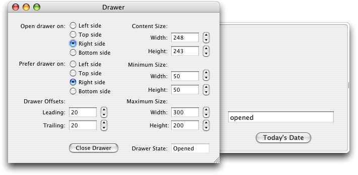

Because it is integrated with Apple’s development environment, AppleScript Studio can take advantage of powerful features provided by Xcode and Interface Builder. These include:

- use of Cocoa’s rich set of user interface classes; layout tools include built-in support for Aqua interface guidelines
- tools that simplify building and maintaining complex projects with multiple targets and build steps
- easy customization of application menus, icons, and About windows

AppleScript Studio supports a number of scripting features that are also available in the Script Editor application distributed with Mac OS X version 10.3, but were not available in previous versions of the Script Editor. These include:

- creation of arbitrarily large scripts
- search and replace in scripts
- easy access to handlers and properties in scripts (through a pop-up menu)
- a flexible dictionary viewer for working with application scripting terminologies

For more information, see [Xcode Features for AppleScript Studio](AppleScript%20Studio%20Components.md#apple-f4xwc4dqnrsv64tfmyxwi33df52wszbpgiydambrgi2talkukbmferkggeztm) and [Interface Builder Features for AppleScript Studio](AppleScript%20Studio%20Components.md#apple-f4xwc4dqnrsv64tfmyxwi33df52wszbpgiydambrgi2talkukbmferkggezto).

Because AppleScript Studio applications are Cocoa applications, they benefit from Cocoa’s full-featured application framework. As a result, an AppleScript Studio application can perform many operations automatically, without any additional Objective-C code from the developer. Built-in features allow users to open multiple windows, resize and minimize windows, display an About window, enter text in text fields, and even shuffle column positions in a table view.

To experiment with the features you get in the simplest document-based AppleScript Studio application, even before adding any code or scripts, see the steps in [Create a Project](Mail%20Search%20Tutorial-%20Create%20the%20Interface.md#apple-f4xwc4dqnrsv64tfmyxwi33df52wszbpgiydambrgi2tklkukbmferkgge2tg).

Users with previous Cocoa experience will also find a lot to like in AppleScript Studio, including the ability to

- use AppleScript to control other applications
- do quick prototyping, with scripts taking the place of unimplemented methods
- perform simple automated testing, using AppleScript Studio’s ability to script Cocoa user interface objects (not available in Cocoa alone); for more information, see [Scripting AppleScript Studio Applications](Programming%20With%20AppleScript%20Studio.md#apple-f4xwc4dqnrsv64tfmyxwi33df52wszbpgiydambrgi2tclkukbmferkgge3tq)

Although you can create applications that perform virtually all of their operations by executing AppleScript scripts, you are free to include additional Cocoa code in applications. You may find it useful to learn more about the Cocoa code working behind the scenes—to do so, see the information provided in [Cocoa Framework Overview](AppleScript%20Studio%20Components.md#apple-f4xwc4dqnrsv64tfmyxwi33df52wszbpgiydambrgi2talkukbmferkggeztq), as well as the Cocoa documentation described in [See Also](Introduction%20to%20AppleScript%20Studio%20Programming%20Guide.md#apple-f4xwc4dqnrsv64tfmyxwi33df52wszbpgiydambrgi2dqlkdjfeeiqkhifda).

AppleScript Studio offers a number of powerful features. However, for scripting tasks that don’t require a complex user interface, such as adjusting your workspace or automating repetitive tasks, the Script Editor (distributed with the Mac OS) or a third-party scripting application is usually a more appropriate tool. You’ll have access to AppleScript’s key features without the overhead that comes with AppleScript Studio’s additional power.

AppleScript Studio shows its strength for tasks that require:

- a complex user interface
- manipulation of information associated with user interface elements
- display of information provided or manipulated by other processes (including information gathered from databases)
- the ability to take advantage of features written in standard programming languages (which you can access from AppleScript Studio scripts, as shown in the Multi-Language sample application, described in [AppleScript Studio Sample Applications](#apple-f4xwc4dqnrsv64tfmyxwi33df52wszbpgiydambrgi2dslkdjjbeuqsgifaq))
- a fully functional build environment

AppleScript Studio is less appropriate for tasks that require:

- display of large amounts of data (such as massive tables)
- intensive computation or manipulation of large amounts of data in AppleScript Studio scripts
- intensive interaction with a file system (such as displaying large numbers of files; you can try the Browser sample application, described in [AppleScript Studio Sample Applications](#apple-f4xwc4dqnrsv64tfmyxwi33df52wszbpgiydambrgi2dslkdjjbeuqsgifaq), to experiment with the performance of an application that browses the file system)
- simple scripting operations, especially those with little or no user interface

You may notice that AppleScript Studio performs poorly when you use AppleScript scripts to perform computation-intensive operations. This reflects the limits of the processing power of the AppleScript language, which was not designed for those kinds of tasks. One way to work around these issues is to have your scripts call into C, C++, Objective-C, or Java code to perform computation-intensive operations. The Multi-Language sample application, distributed with AppleScript Studio, demonstrates how to access code written in various languages from an AppleScript Studio application.

AppleScript Studio does not support building non-Cocoa applications, or applications that must run in Mac OS 9, or in versions of Mac OS X before version 10.1.2.

AppleScript Studio applications, like other Cocoa applications, can access frameworks and libraries outside the Cocoa framework, including the Carbon framework, although detailed steps for doing so are not described in this document.

This section provides a brief description of AppleScript Studio’s components, introduces key concepts, and lists the steps required to create an AppleScript Studio application. It contains the following

- [AppleScript Studio’s Components](#apple-f4xwc4dqnrsv64tfmyxwi33df52wszbpgiydambrgi2dslkukbmferkgge2te)
- [AppleScript Studio Applications](#apple-f4xwc4dqnrsv64tfmyxwi33df52wszbpgiydambrgi2dslkukbmferkgge2tq)
- [Connecting Actions to Scripts](#apple-f4xwc4dqnrsv64tfmyxwi33df52wszbpgiydambrgi2dslkdjjbeor2kjbca)
- [Putting It All Together](#apple-f4xwc4dqnrsv64tfmyxwi33df52wszbpgiydambrgi2dslkukbmferkgge2tk)

Figure 1-2 shows the components that make up AppleScript Studio: AppleScript, Xcode, Interface Builder, the Cocoa framework, and AppleScript Studio’s own framework, the AppleScriptKit framework. A _framework_ is a type of bundle (or directory in the file system) that packages software with the resources that software requires, including its interface.

__Figure 1-2__  The components of AppleScript Studio

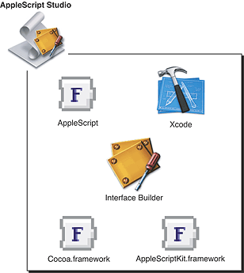

Here’s how AppleScript Studio’s components work together to produce AppleScript Studio applications:

- _AppleScript:_ Provides the ability to control multiple applications, including parts of the Mac OS, by writing scripts. For more information, see [AppleScript Overview](AppleScript%20Studio%20Components.md#apple-f4xwc4dqnrsv64tfmyxwi33df52wszbpgiydambrgi2talkukbmferkggeztk).
- _Cocoa framework:_ Provides an application framework, including a robust set of user interface classes. You use these classes in Interface Builder to create an interface for your AppleScript Studio application. You also link with Cocoa in Xcode to build the application itself. For more information, see [Cocoa Framework Overview](AppleScript%20Studio%20Components.md#apple-f4xwc4dqnrsv64tfmyxwi33df52wszbpgiydambrgi2talkukbmferkggeztq).
- _Interface Builder:_ Provides a graphical environment for creating user interface descriptions. You also use Interface Builder to link user actions, such as clicking a button or choosing an item in a pop-up menu, to specific handlers in scripts. (Handlers are described in [Connecting Actions to Scripts](#apple-f4xwc4dqnrsv64tfmyxwi33df52wszbpgiydambrgi2dslkdjjbeor2kjbca).) For more information, see [Interface Builder Features for AppleScript Studio](AppleScript%20Studio%20Components.md#apple-f4xwc4dqnrsv64tfmyxwi33df52wszbpgiydambrgi2talkukbmferkggezto).
- _Xcode:_ Provides the development environment to edit, build, and debug AppleScript Studio applications, as well as to display dictionaries of scripting terms. For more information, see [Xcode Features for AppleScript Studio](AppleScript%20Studio%20Components.md#apple-f4xwc4dqnrsv64tfmyxwi33df52wszbpgiydambrgi2talkukbmferkggeztm).
- _AppleScriptKit framework:_ Provides code and scripting terminology to support AppleScript Studio features, including enhanced scriptability for user interface objects and the ability to call Objective-C methods from scripts. For more information, see [AppleScriptKit Framework Overview](AppleScript%20Studio%20Components.md#apple-f4xwc4dqnrsv64tfmyxwi33df52wszbpgiydambrgi2talkcineukssgivca).

See [Chapter 3, AppleScript Studio Components,](AppleScript%20Studio%20Components.md#apple-f4xwc4dqnrsv64tfmyxwi33df52wszbpgiydambrgi2talkukbmferkggeydc) for a more detailed description of AppleScript Studio’s components.

AppleScript Studio applications take advantage of the Cocoa framework, which works “behind the curtain” to display the interface, respond to user actions, and more. However, there is very little visible Cocoa code required for an AppleScript Studio application (see [Listing 2-1](AppleScript%20Studio%20Components.md#apple-f4xwc4dqnrsv64tfmyxwi33df52wszbpgiydambrgi2talkdjjbeiqkbinca). As a result, scripters gain the ability to create complex interfaces and work in a powerful development environment, while still being able to use AppleScript script statements to control applications.

The ability to connect application events to scripts is a key concept in understanding AppleScript Studio. In every AppleScript Studio application you write, you will connect actions involving the application’s user interface objects to event handlers in its script files, the result of which is shown in Figure 1-3.

A _handler_ is a series of one or more script statements that are executed in response to an action or condition. In the case of a simple subroutine, a handler is similar to a function. Handlers that respond to action events in the application are called _event handlers_ to distinguish them from other handlers.

__Figure 1-3__  Connections between user interface items and scripts in an AppleScript Studio application

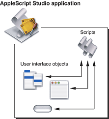

Handlers can have zero or more parameters. Listing 1-1 shows a simple event handler, where `(*Add your script here.*)` is an AppleScript comment. All event handlers start with the keyword `on`. The `clicked` handler has one parameter, `theObject`, which represents the user interface object that received the `clicked` message. Most event handlers in AppleScript Studio have this same parameter.

__Listing 1-1__  A simple event handler

```
on clicked theObject
    (*Add your script here.*)
end clicked
```

You’ll see the full details later in this chapter, but in brief, the process of connecting actions to event handlers consists of these steps:

1. Use Interface Builder to create a new user interface resource file (or nib file), or to open an existing nib file. The default nib file in an AppleScript Studio project, called `MainMenu.nib`, automatically contains one window object.
2. Add interface objects (such as buttons and text views) in Interface Builder. Figure 1-4 shows one of the palettes of objects available in Interface Builder.

   __Figure 1-4__  Interface Builder’s Palette window, showing the Cocoa-Controls palette

   

   Figure 1-5 shows the results of dragging a button object from the palette to a window.

   __Figure 1-5__  A window containing a button

   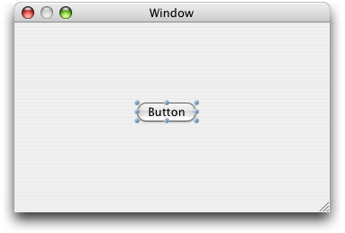
3. Select an interface item (such as a button) in Interface Builder and open the Info window. Figure 1-6 shows the Info window for a button, with the AppleScript pane visible, showing the possible event handler groups for the object. Each group contains one or more handlers.
4. Click to select the checkbox for the event handler (or handlers) you want to connect, then select a script file to connect it to, as shown in Figure 1-6. The available event handlers are grouped according to their function. The Action group contains just the `clicked` handler. Interface Builder inserts an empty event handler, in this case the `clicked` handler shown in Listing 1-1, into the selected script file in your application project.

   __Figure 1-6__  The Info window for a button

   
5. Open the script in Xcode and write script statements for the event handler. You can open the script by clicking the Edit Script button.

These steps are shown in more detail in [Creating a Hello World Application](#apple-f4xwc4dqnrsv64tfmyxwi33df52wszbpgiydambrgi2dslkukbmferkggezta).

Previous sections have described AppleScript Studio’s components, AppleScript Studio applications, and the key steps for connecting actions to scripts. By adding just a bit more detail, you have an algorithm for creating an application with AppleScript Studio:

1. Use Xcode to create a new project, using one of the AppleScript Studio application templates Xcode supplies.
2. Build the application’s user interface (which is stored in user interface resource files, or nib files) by adding user interface objects with Interface Builder.
3. Use the Info window in Interface Builder to hook up user actions, such as mouse clicks and menu selections, to event handlers in scripts.
4. Edit the scripts in Xcode to add script statements that perform the desired operations.
5. Build the application in Xcode.

A pictorial version of these steps is shown in Figure 1-7, and a simple tutorial demonstrates them in [Creating a Hello World Application](#apple-f4xwc4dqnrsv64tfmyxwi33df52wszbpgiydambrgi2dslkukbmferkggezta). Of course you may need to repeat steps 2 through 5 as you build and test your application. You’ll find more information on these operations throughout this document.

__Figure 1-7__  Creating an application with AppleScript Studio

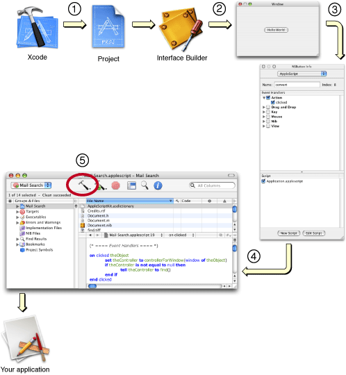

This section shows how easy it is to create a simple “Hello World” application with AppleScript Studio. See [Chapter 6, Currency Converter Tutorial,](Currency%20Converter%20Tutorial.md#apple-f4xwc4dqnrsv64tfmyxwi33df52wszbpgiydambrgi2tglkukbmferkggeydc) for a slightly more complex tutorial that demonstrates additional features of AppleScript Studio. See [Chapter 7, Mail Search Tutorial: Design the Application,](Mail%20Search%20Tutorial-%20Design%20the%20Application.md#apple-f4xwc4dqnrsv64tfmyxwi33df52wszbpgiydambrgi2tilkukbmferkggeydc) to start a multi-chapter tutorial that builds a more complete AppleScript Studio application.

If you’d like to know more about AppleScript Studio before you start programming, feel free to read [Chapter 3, AppleScript Studio Components,](AppleScript%20Studio%20Components.md#apple-f4xwc4dqnrsv64tfmyxwi33df52wszbpgiydambrgi2talkukbmferkggeydc) before going ahead with the Hello World tutorial.

To create a “Hello World” AppleScript Studio application, perform these steps:

1. See the information in [AppleScript Studio System Requirements and Version Information](AppleScript%20Studio%20System%20Requirements%20and%20Version%20Information.md#apple-f4xwc4dqnrsv64tfmyxwi33df52wszbpgiydambrgi3dalkukbmferkggeydc) to make sure that AppleScript Studio is available on your computer.
2. Open the Xcode application, located in `/Developer/Applications`.
3. Choose New Project from the File menu. Xcode opens the dialog shown in Figure 1-8:

   __Figure 1-8__  Choosing an AppleScript Studio application in Xcode

   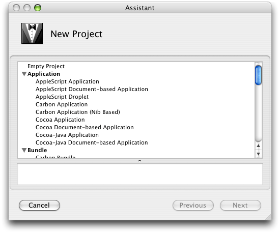
4. Select one of the AppleScript Studio application templates. For this example, choose the “AppleScript Application” template, then click the Next button. You will then get a chance to name the project and save it in the location of your choice. Type “Hello World” (without the quotes) for the project name. The resulting project is shown in Figure 1-9.

   __Figure 1-9__  A newly-created AppleScript Studio application project

   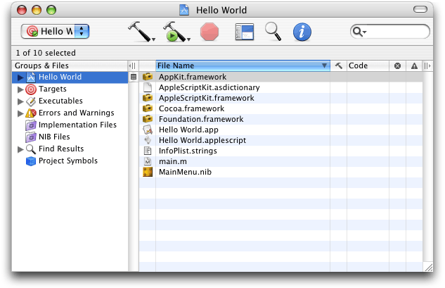
5. The project’s contents are visible in the detail view (to the right of the Groups & Files list). You can click the disclosure triangles in the Groups & Files list to see how the contents are stored in the project. Figure 1-10 shows the Groups & Files list with most groups expanded. The items are described in [Default Project Contents](AppleScript%20Studio%20Components.md#apple-f4xwc4dqnrsv64tfmyxwi33df52wszbpgiydambrgi2talkukbmferkgge3di).

   __Figure 1-10__  A project with many groups and files expanded

   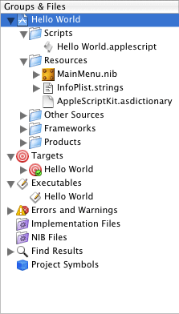
6. Save the new project by typing Command-S or by choosing the Save command from the File menu.
7. Double-click the icon for the `MainMenu.nib` file to open the Interface Builder application (located in `/Developer/Applications`). Interface Builder opens a number of windows. One of those windows, the default application window is shown in Figure 1-11. Drag the resize control in the lower-right corner of the window to reduce the window to a size suitable for containing one button.

   __Figure 1-11__  A default application window in Interface Builder

   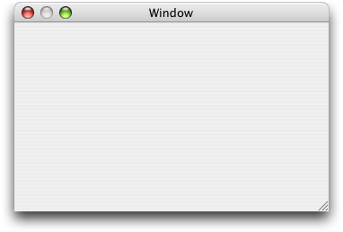
8. Figure 1-12 shows the Palette window, another window that opens when you open Interface Builder. You can change the current palette by clicking one of the buttons in the window’s toolbar.

   __Figure 1-12__  Interface Builder’s Palette window, showing the Cocoa-Controls palette

   

   Drag a button from the Cocoa-Controls palette into the “Window” window; the result is shown in Figure 1-13.

   __Figure 1-13__  A window containing a button

   
9. Double-click Button to select the button title text, then type “Hello World” as the button title. The result is shown in Figure 1-14.

   __Figure 1-14__  The Hello World button

   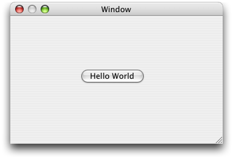
10. With the Hello World button selected, choose Show Info from the Tools menu (or type Command-Shift-I) to open the Info window. Use the pop-up menu at the top of the window to display the AppleScript pane. Then click the disclosure triangle next to the Action checkbox (if it isn’t already open) and click the “clicked” checkbox. The result is shown in Figure 1-15.

    Selecting the clicked action indicates that the Hello World button should have a `clicked` event handler, to be called when a user clicks the button.

    __Figure 1-15__  The Info window for the Hello World button

    
11. In the Script pane in the Info window shown in Figure 1-15, select the checkbox for `Hello World.applescript`, the default script for the application. That tells AppleScript Studio to put the `clicked` handler for the Hello World button in the selected script. In this example there is only one script—for an example that uses multiple scripts, see the Display Panel sample application (distributed with AppleScript Studio).

    When you click the Edit Script button, Xcode becomes active to allow you to edit the selected script, as shown in Figure 1-16. AppleScript Studio has already inserted the following handler, which is called whenever a user clicks the button:

```
on clicked theObject
    (*Add your script here.*)
end clicked
```


    __Figure 1-16__  Editing a `clicked` handler in Xcode

    
12. Select the text `(*Add your script here.*)` and replace it with `display dialog "Hello World!"`

    You could, of course, insert many other kinds of AppleScript statements as part of the handler executed when a user clicks the button.
13. Build the Hello World application by typing Command-B or choosing Build from the Build menu. (You can also use one of the build buttons, which have a hammer icon.)

    The script `Application.applescript` is compiled automatically when you build the application. Later chapters in this document describe how to compile scripts separately.

    Building the application also compiles the Cocoa code in the application’s `main.m` file, prepares the application’s resources, and links the application with the required frameworks.
14. Run the Hello World application by typing Command-R or choosing Build and Run from the Build menu. (Both of these options actually rebuild the application, but since you already built it in the previous step, the application should open quickly.) Figure 1-17 shows the result of clicking the Hello World button.

__Figure 1-17__  The Hello World application in action

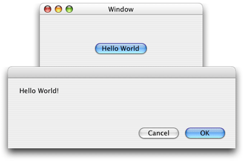

Building this Hello World application required very little Objective-C code, and that code was auto-generated by AppleScript Studio. In fact, you can build quite complex AppleScript Studio applications with no additional Cocoa code. However, every AppleScript Studio application is a Cocoa application, and it’s the Cocoa application framework that’s working behind the scenes. This suggests several possible paths for Studio developers, depending on your background and goals:

- Anyone interested in AppleScript Studio should:

  - See [Chapter 3, AppleScript Studio Components,](AppleScript%20Studio%20Components.md#apple-f4xwc4dqnrsv64tfmyxwi33df52wszbpgiydambrgi2talkukbmferkggeydc) for a more detailed introduction to AppleScript Studio.
  - Work through the tutorials in this document and experiment with the applications described in [AppleScript Studio Sample Applications](#apple-f4xwc4dqnrsv64tfmyxwi33df52wszbpgiydambrgi2dslkdjjbeuqsgifaq).
  - See [Terminology From the AppleScriptKit Framework](Programming%20With%20AppleScript%20Studio.md#apple-f4xwc4dqnrsv64tfmyxwi33df52wszbpgiydambrgi2tclkukbmferkgge3do) to learn more about the user interface objects you can use with AppleScript Studio and about the classes, properties, events, and enumerations you can use in scripts. (This section in turn points to the document _AppleScript Studio Terminology Reference_, the best source for terminology information.)
- If you have a scripting background and your main goal is to create scripting applications with complex user interfaces:

  - Use your scripting knowledge, along with information in this document and _AppleScript Studio Terminology Reference_, to help you quickly take advantage of AppleScript Studio.
  - Be aware of AppleScript Studio’s Cocoa underpinnings, and that the interface objects you use are implemented by Cocoa classes. Don’t be afraid to occasionally read the Cocoa information described in this document or pointed to elsewhere.
- If you have a Cocoa background and you’d like to take advantage of features of AppleScript Studio:

  - See [AppleScript Overview](AppleScript%20Studio%20Components.md#apple-f4xwc4dqnrsv64tfmyxwi33df52wszbpgiydambrgi2talkukbmferkggeztk) for an introduction to AppleScript.
  - Refer to the documents described in [See Also](Introduction%20to%20AppleScript%20Studio%20Programming%20Guide.md#apple-f4xwc4dqnrsv64tfmyxwi33df52wszbpgiydambrgi2dqlkdjfeeiqkhifda) as needed for more information on scripting.
  - Use your knowledge of Cocoa, along with information in this document, to provide a head start in understanding and taking advantage of Cocoa’s important role in AppleScript Studio.
  - See the document _AppleScript Studio Terminology Reference_, which describes the terms you use to work with buttons, menus, views, and other interface items in AppleScript Studio scripts. Most AppleScript Studio classes are based on Cocoa user interface classes, and where this is the case, the document contains a link to the Cocoa documentation for the corresponding Cocoa class.

AppleScript Studio includes the following sample applications, which can serve as a valuable source of examples and coding techniques for working with the many available user interface objects. The applications are located in `/Developer/Examples/AppleScript Studio/`. [Table 3-3](Programming%20With%20AppleScript%20Studio.md#apple-f4xwc4dqnrsv64tfmyxwi33df52wszbpgiydambrgi2tclkciffessseiveq) lists the main user interface objects used in some of the applications.

Sample applications that were added after AppleScript Studio version 1.1 are so noted. For related information, see [AppleScript Studio System Requirements and Version Information](AppleScript%20Studio%20System%20Requirements%20and%20Version%20Information.md#apple-f4xwc4dqnrsv64tfmyxwi33df52wszbpgiydambrgi3dalkukbmferkggeydc).

- _Archive Maker_ demonstrates many Cocoa user interface objects, such as drawers and panels, in a graphical front end to the `gnutar` shell tool (for building tar archives). It also shows how to use a `call method` statement to call an Objective-C method, and how to use a `do shell script` statement to execute a shell command.

  AppleScript’s `do shell script` command is documented in “Technical Note TN2065: `do shell script` in AppleScript” at [http://developer.apple.com/technotes/tn2002/tn2065.html](https://developer.apple.com/technotes/tn2002/tn2065.html).
- _Assistant_ presents one possible implementation of an Assistant, using a tab view with separate tab view items to represent an information panel. The tab view has no border or visible tabs, which supports the appearance of switching a full panel of user interface elements in and out.
- _Browser_ browses the file system, displaying files and folders in a window similar to the Finder’s column view.
- _Command Finder_ finds shell commands that match specified text strings, according to the current search type in a pop-up menu (such as “begins with” or “contains”). Double-clicking a found command opens a window containing the man page for that command.
- _Coordinate System_ demonstrates how to specify the coordinate system for an application. Added in AppleScript Studio version 1.4 (along with the support for alternate coordinate systems).
- _Countdown Timer_ demonstrates how to use an `idle` event handler to build a countdown timer. It also shows how to display an alert as a sheet. Added in AppleScript Studio version 1.2.1.
- _Currency Converter_ is a simple application that converts a dollar amount to an amount in another currency.
- _Currency Converter (SOAP)_ is a version of the Currency Converter that uses SOAP commands to look up exchange rates. Added in AppleScript Studio version 1.2.
- _Daily Dilbert_ uses the `date` and `curl` shell script commands to load and display an image, given a URL from a web service. Added in AppleScript Studio version 1.2.
- _Debug Test_ provides a test bed for debugging an AppleScript Studio script. It displays a progress bar and an incrementing text field so that you can set break points and examine values.
- _Display Alert_ demonstrates the `display alert` command, which you can use in place of `display dialog` to alert the user to some condition. You can specify the alert icon, whether to display the alert as a sheet (a modal dialog attached to a document window), the alert message, and the alert button titles. The window also displays the button returned when the user closes the alert.
- _Display Dialog_ demonstrates various ways of using the `display dialog` command. The application provides a window for specifying the text, buttons, and other inputs for a `display dialog` command, including whether to display the dialog as a sheet. The window also displays information returned when the user closes the dialog.
- _Display Panel_ demonstrates the `display panel` command, which allows you to create your own dialogs and display them either as a dialog or attached to a window as a sheet. The application shows how to load and display a panel from a nib (or user interface resource) file. Also demonstrates the use of multiple scripts in a project.
- _Drag and Drop_ demonstrates how a number of user interface items can accept drags, including files dragged from the Finder into a table, a color dragged from a color well into a table, text dragged into a button to change its title, text dragged into a text field, and images dragged into an image view. Added in AppleScript Studio version 1.2.
- _Drag Race_ is an amusing demonstration of racing buttons.
- _Drawer_, shown in [Figure 1-1](#apple-f4xwc4dqnrsv64tfmyxwi33df52wszbpgiydambrgi2dslkdjjbeescgizba), demonstrates how to use a number of interface classes, including buttons, text fields, radio buttons, steppers, and yes, even drawers.
- _Image_ demonstrates how to load an image and add it to an image view.
- _Language Translator_ is another sample that uses SOAP requests—in this case, to translate text to other languages.
- _Mail Search_ (in AppleScript Studio 1.0, Mail Search was known as “Watson”) is an application that searches specified Mail application mailboxes for any specified text, either in the Subject or To fields or in the body of messages. It demonstrates how to work with outline and table views, as well as progress bars. The Mail Search tutorial, which begins in [Chapter 7, Mail Search Tutorial: Design the Application,](Mail%20Search%20Tutorial-%20Design%20the%20Application.md#apple-f4xwc4dqnrsv64tfmyxwi33df52wszbpgiydambrgi2tilkukbmferkggeydc) provides a detailed tutorial for building Mail Search.
- _Multi-Language_ demonstrates how to access code written in various languages from an AppleScript Studio application. It works with C, C++, Objective-C, Objective-C++, and Java (both directly and through the Mac OS X Java bridge).
- _Open Panel_ demonstrates how to use the open-panel class, either as a modal panel or as a panel attached to a window. You can access an open panel as a property of the Application class.
- _Outline_ uses an outline view to browse the file system, displaying files and folders in a window similar to the Finder’s list view.
- _Outline Reorder_ demonstrates how to set the contents of an outline view using a single list of records. It also shows how to turn automatic reordering support on or off dynamically. Added in AppleScript Studio version 1.4 (along with the support for automatic reordering in data views).
- _Plain Text Editor_ provides a simple example of how to write a document-based plain-text editor. It takes advantage of the lower level handlers for document handling, namely `read from file` and `write to file`, so that it can read text documents created by other applications. (The Task List sample shows how to use the two higher level handlers, `data representation` and `load data representation`.) Added in AppleScript Studio version 1.2.
- _Save Panel_ demonstrates how to use the save-panel class, either as a modal panel or as a panel attached to a window. You can access a save panel as a property of the Application class.
- _Simple Outline_ provides an example of how to populate an outline view using a data source. Added in AppleScript Studio version 1.2.1.

  Updated in AppleScript Studio 1.4 to demonstrate the new drag and drop support for data views and the new `change cell` value event handler added.
- _Simple Shell_ shows how to use the `do shell script` command to make UNIX shell calls (such as `ls`, `man`, and so on).
- _Simple Table_ provides an example of how to populate an outline view using a data source. Added in AppleScript Studio version 1.2.1.

  Updated in AppleScript Studio 1.4 to demonstrate how to set the contents of a table view using a list of lists of strings, as well as how to use the new drag and drop event handlers for data views.
- _Simple Toolbar_ demonstrates how to create a toolbar in a window and populate it with toolbar items. Added in AppleScript Studio version 1.4.
- _SOAP Talk_ is a tool that helps to build the syntax needed to make SOAP requests over the Internet.
- _Table_ demonstrates two ways to work with table views (data displayed in rows and columns): with a data source object to supply table data (the approach also used by the Mail Search sample application), and without a data source object (supplying the data directly from a script). Data source objects are described in [Interface Creation](AppleScript%20Studio%20Components.md#apple-f4xwc4dqnrsv64tfmyxwi33df52wszbpgiydambrgi2talkukbmferkgge3dc).
- _Table Reorder_ demonstrates how to set the contents of a table view using a single list of records. It also shows how to turn automatic reordering support on or off dynamically. Added in AppleScript Studio version 1.4 (along with the support for automatic reordering in data views).
- _Table Sort_ demonstrates how to add sorting to a table. Clicking in a column header sorts the table based on that column. Clicking more than once in the same column header changes the sort order of that column. Added in AppleScript Studio version 1.2.
- _Talking Head_ shows how to use a movie view to display QuickTime movies.
- _Task List_ demonstrate how to write a document-based application using the higher level handlers `data representation` and `load data representation`. These handlers allow you to return and set any type of data, but the documents you create with them are readable only by your application. (The Plain Text Editor sample shows how to use the lower level handlers `read from file` and `write to file`.) Task List also demonstrates how to work with a table view, including support for sorting, as well as with menu items. Added in AppleScript Studio version 1.2.
- _Unit Converter_ converts values between different units of measurement.
- _XMethods Service Finder_ demonstrates how to use Web Services. It uses a service from `XMethods.org` that provides information about all of the services available at that site. It also shows how to create and use a data sources with a table view. Added in AppleScript Studio version 1.2.

[Next](AppleScript%20Studio%20Components.md)[Previous](Introduction%20to%20AppleScript%20Studio%20Programming%20Guide.md)

