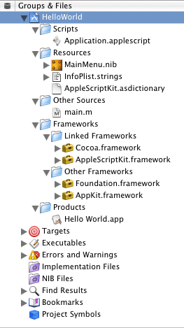
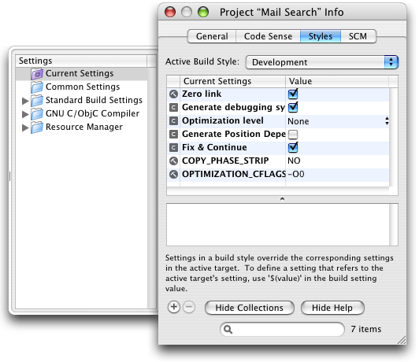
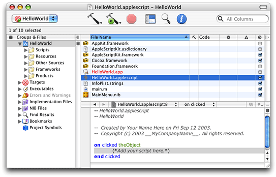
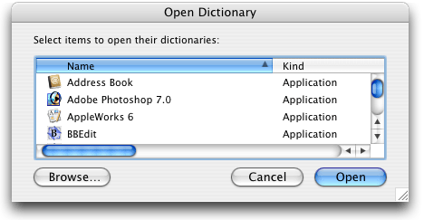
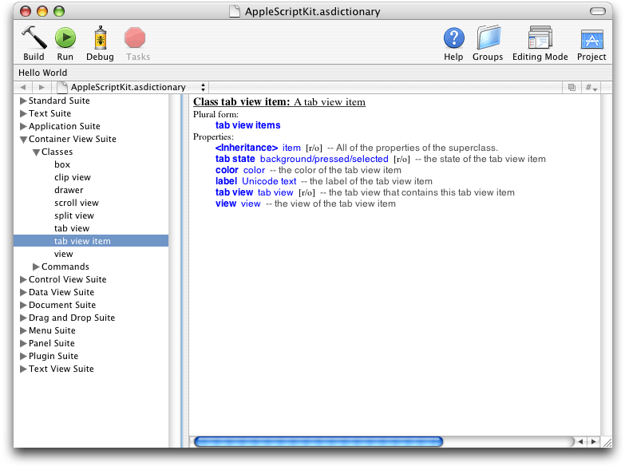
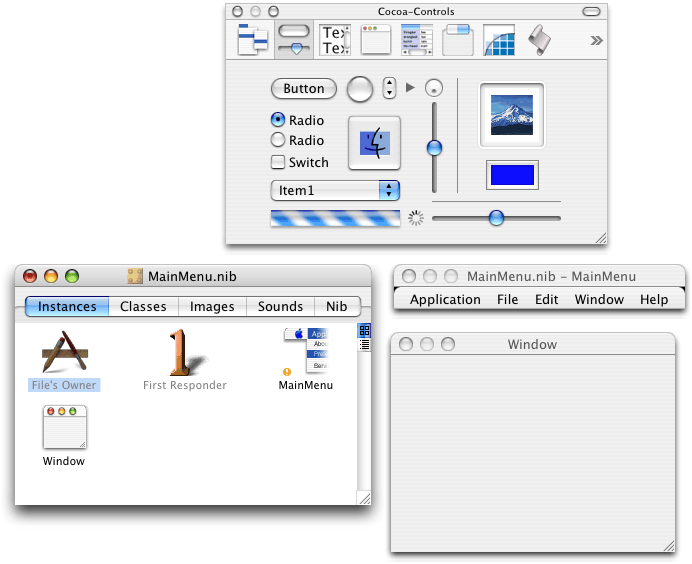
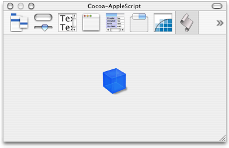
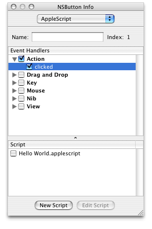

> 导航：[总目录](../../../README.md) · [documentation](../../../_indexes/documentation.md) · [AppleScript Studio Programming Guide](Introduction%20to%20AppleScript%20Studio%20Programming%20Guide.md)


[Next](Programming%20With%20AppleScript%20Studio.md)[Previous](About%20AppleScript%20Studio.md)

# AppleScript Studio Components

AppleScript Studio is a combination of a development environment and an application framework that lets you quickly build AppleScript Studio applications—Mac OS X applications that combine AppleScript scripts and Cocoa user-interface objects. It also supplies enhanced scripting capabilities to Cocoa applications.

AppleScript Studio makes use of features from AppleScript, Xcode, Interface Builder, and the Cocoa application framework. See [About AppleScript Studio](About%20AppleScript%20Studio.md#apple-f4xwc4dqnrsv64tfmyxwi33df52wszbpgiydambrgi2dslkukbmferkggeydc) for a brief introduction to AppleScript Studio.

This chapter describes, in the following sections, the key features you use to create AppleScript Studio applications:

- [AppleScript Overview](#apple-f4xwc4dqnrsv64tfmyxwi33df52wszbpgiydambrgi2talkukbmferkggeztk) describes the scripting system you use in AppleScript Studio.
- [Xcode Features for AppleScript Studio](#apple-f4xwc4dqnrsv64tfmyxwi33df52wszbpgiydambrgi2talkukbmferkggeztm) describes AppleScript Studio–specific features in this integrated development environment.
- [Interface Builder Features for AppleScript Studio](#apple-f4xwc4dqnrsv64tfmyxwi33df52wszbpgiydambrgi2talkukbmferkggezto) describes features for creating user interfaces for AppleScript Studio applications.
- [Cocoa Framework Overview](#apple-f4xwc4dqnrsv64tfmyxwi33df52wszbpgiydambrgi2talkukbmferkggeztq) describes the sophisticated application framework you use to create AppleScript Studio applications.
- [AppleScriptKit Framework Overview](#apple-f4xwc4dqnrsv64tfmyxwi33df52wszbpgiydambrgi2talkcineukssgivca) describes the framework that allows AppleScript Studio applications to script Cocoa user interface objects.

For additional overview information, see the chapter Terminology Fundamentals in _AppleScript Studio Terminology Reference_.

AppleScript is a scripting system that provides direct control of scriptable Macintosh applications, including many parts of the Mac OS itself. Instead of using a mouse or keyboard to manipulate applications, you create scripts—sets of English-like instructions—to automate tasks, control applications on local or remote computers, and even control complex workflows. There are examples of AppleScript scripts throughout this document.

AppleScript is the scripting language of choice for many Macintosh users. To provide scripters with increased flexibility and power, developers make applications scriptable, or capable of responding to Apple events. Although Carbon and Cocoa applications use different internal mechanisms to support scripting, scripters can access features in any scriptable application, allowing them to combine features from many applications.

Sophisticated scripters use AppleScript to provide customized solutions that typically make use of multiple scriptable applications, as well as scriptable parts of the Mac OS, including:

- The Finder, which supports a host of operations on files, folders, windows, and other components of the Macintosh desktop
- Mail, which supports operations such as getting, reading, and deleting mail. AppleScript Studio includes the Mail Search sample application, described in detail starting in [Chapter 7, Mail Search Tutorial: Design the Application,](Mail%20Search%20Tutorial-%20Design%20the%20Application.md#apple-f4xwc4dqnrsv64tfmyxwi33df52wszbpgiydambrgi2tilkukbmferkggeydc) which uses scripts to search mailboxes in the Mac OS X Mail application.
- QuickTime Player, which supports operations such as opening, playing, and stepping through movies. The Talking Head sample application shows how to play QuickTime movies in an AppleScript Studio application.

AppleScript scripts can target applications on remote machines and can even make remote procedure calls to access services over the Internet (starting with Mac OS X version 10.1). AppleScript’s support for remote procedure calls, including XML-RPC and SOAP requests, provides access to a variety of web-based servers that can check spelling, translate text between languages, obtain stock quotes, and more. The SOAP Talk AppleScript Studio application, described in [AppleScript Studio Sample Applications](About%20AppleScript%20Studio.md#apple-f4xwc4dqnrsv64tfmyxwi33df52wszbpgiydambrgi2dslkdjjbeuqsgifaq), shows one way to provide a user interface to access SOAP services. For documentation on AppleScript’s support for remote procedure calls, see _[XML-RPC and SOAP Programming Guide](../XML-RPC%20and%20SOAP%20Programming%20Guide/Introduction%20to%20XML-RPC%20and%20SOAP%20Programming%20Guide.md#apple-f4xwc4dqnrsv64tfmyxwi33df52wszbpkridgmbqgaytcmrw)_, available in AppleScript Documentation.

As an established scripting language, supported by a large number of scriptable applications and available on almost every Mac, AppleScript is the driving force behind AppleScript Studio.

You can use AppleScript Studio to create complex scripting solutions without detailed knowledge of how AppleScript is implemented in Mac OS X. Therefore, this section provides only a brief description of that implementation. For a more detailed description, see the additional documentation listed in [See Also](Introduction%20to%20AppleScript%20Studio%20Programming%20Guide.md#apple-f4xwc4dqnrsv64tfmyxwi33df52wszbpgiydambrgi2dqlkdjfeeiqkhifda).

The following are some of the key frameworks and other components that support scripting in Mac OS X. Note, however, that you aren’t required to work directly with any of these frameworks in your AppleScript Studio project.

- The _Open Scripting Architecture (OSA)_ provides an API for compiling and executing scripts, and for creating scripting components, such as AppleScript itself. It is implemented in `OpenScripting.framework`, a subframework of `Carbon.framework`.
- The _Apple Event Manager_ provides an API for sending and receiving Apple events and working with the information they contain. Scripting components use Apple events to send commands and data to targeted processes. The Apple Event Manager is implemented in `AE.framework`, a subframework of `ApplicationServices.framework`.
- The _AppleScript component_ in Mac OS X implements the AppleScript scripting language. A scripting component provides services for compiling and executing scripts (and relies on the OSA).
- The _Script Editor application_ provides the ability to edit, compile, and execute scripts, to examine the scripting terminology of scriptable applications (the terms you can use in scripts to communicate with applications), and to perform other scripting tasks. When you use it to execute a script, Script Editor calls on the AppleScript component to convert script statements into the appropriate Apple events to the targeted applications. In Mac OS X, Script Editor is located in `/Applications/AppleScript`. Third-party script editors provide many additional features.

  Most scripters are familiar with Script Editor, and you can learn more about it in AppleScript Help in the Help Center. The version released with Mac OS X version 10.3 provides a number of new and enhanced features, such as a pop-up menu for inserting common script coding blocks, and histories of previous results and event logs.

An AppleScript script can target any scriptable application in the Mac OS, including those in the Classic environment and on remote machines. It can also target scriptable parts of the Mac OS, and use any scripting features provided by AppleScript. With few exceptions, you can use any statements in an AppleScript Studio script that you would use in any other AppleScript script in Mac OS X.

AppleScript Studio also supports a key additional feature: the ability to access Cocoa’s rich set of user interface objects in scripts. These objects range from buttons and text fields to pop-up menus, browsers, and table views. For more information, see [Cocoa User Interface Objects](#apple-f4xwc4dqnrsv64tfmyxwi33df52wszbpgiydambrgi2talkciffeqqkbi5da)

To write scripts for an AppleScript Studio application, you need to know what terminology you can use with the user interface objects in the application. For information on how to find the available terminology, see [AppleScript Studio Terminology](Programming%20With%20AppleScript%20Studio.md#apple-f4xwc4dqnrsv64tfmyxwi33df52wszbpgiydambrgi2tclkdjjbeoqsijfda) in this document, as well as _AppleScript Studio Terminology Reference_. In addition, Cocoa’s user interface objects are described in [Cocoa User Interface Objects](#apple-f4xwc4dqnrsv64tfmyxwi33df52wszbpgiydambrgi2talkciffeqqkbi5da).

This document uses the following definitions to help distinguish between various kinds of Cocoa and AppleScript classes and objects you work with in AppleScript Studio:

- A _Cocoa user interface class_ is an Objective-C class, generally defined in the AppKit framework, that supports a user interface item. For example, NSButton and NSBrowser are Cocoa user interface classes.
- A _Cocoa user interface object_ is an instance of a Cocoa user interface class. When creating the interface for an AppleScript Studio application with Interface Builder, for example, you drag user interface objects such as buttons and browsers into your application windows, where the objects are instances of NSButton and NSBrowser, respectively.

  When you select a Cocoa user interface object in Interface Builder and examine it in the Info window, you see its class name in the window’s title bar (for example, NSButton).
- An _AppleScript object class_ is a category for AppleScript objects that share characteristics, such as properties and elements. For example, if you open the dictionary for an AppleScript Studio application, you see `button` in the list of classes in the Control View suite.
- An _AppleScript object_ is an instance of an AppleScript object class. An AppleScript object is typically a distinct object in an application or its documents that can be specified in a script. In an AppleScript Studio application, for example, you write statements similar to the following:

```
set currentButton to button "Search" of window "Some Window"
```

  where `currentButton` is a reference to an AppleScript object specified by `button "Search"`. The button referred to is also a Cocoa user interface object (an instance of NSButton) in the application. For user interface objects in AppleScript Studio applications, there is usually a corresponding Cocoa object for each AppleScript object.

_Xcode_ is Apple’s integrated development environment for Mac OS X. It supports building Cocoa and Carbon applications (as well as bundles, frameworks, plug-ins, and tools) with C, C++, Objective-C, and Java. Xcode has extensive online help and release notes. There are also several tutorials available that describe how to build and debug standard applications.

When AppleScript Studio is installed, Xcode provides support for building AppleScript Studio applications. See [Appendix A, AppleScript Studio System Requirements and Version Information,](AppleScript%20Studio%20System%20Requirements%20and%20Version%20Information.md#apple-f4xwc4dqnrsv64tfmyxwi33df52wszbpgiydambrgi3dalkukbmferkggeydc) for information on how to make sure AppleScript Studio is available.

You use the following Xcode features to create AppleScript Studio applications:

- _Project templates_ Xcode provides project templates for three types of AppleScript Studio application: AppleScript Application, AppleScript Document-based Application, and AppleScript Droplet. These templates are described in [AppleScript Studio Application Templates](#apple-f4xwc4dqnrsv64tfmyxwi33df52wszbpgiydambrgi2talkciffekqkdjbda) and [Default Project Contents](#apple-f4xwc4dqnrsv64tfmyxwi33df52wszbpgiydambrgi2talkukbmferkgge3di).

  Starting in AppleScript Studio version 1.3, Xcode also provides a template you can use to add features to Xcode itself. This template is described in [AppleScript Studio Xcode Plug-in Template](#apple-f4xwc4dqnrsv64tfmyxwi33df52wszbpgiydambrgi2talkdjjbekqkjircq).
- _Interface support_ AppleScript Studio relies on Interface Builder to create a user interface for AppleScript Studio applications, as described in [Interface Builder Features for AppleScript Studio](#apple-f4xwc4dqnrsv64tfmyxwi33df52wszbpgiydambrgi2talkukbmferkggezto). As you work on an AppleScript Studio application, you can easily switch back and forth between Xcode and Interface Builder.
- _Source code editor_ Xcode’s source code editor allows you to edit and compile AppleScript scripts. Scripts can be arbitrarily long and you can perform search and replace and other standard operations. For more information, see [Source Code Editor](#apple-f4xwc4dqnrsv64tfmyxwi33df52wszbpgiydambrgi2talkciffeorcejfdq).
- _Terminology Browser_ Xcode provides an Open Dictionary command (in the File menu) to view the terminology for any scriptable application. For details, see [Terminology Browser](#apple-f4xwc4dqnrsv64tfmyxwi33df52wszbpgiydambrgi2talkciffeersijjfa).
- _Debugging support_ Xcode provides AppleScript Studio with debugging support that allows you to perform a variety of debugging tasks. However, that support is not currently complete. For more information, see [Debugging Features](#apple-f4xwc4dqnrsv64tfmyxwi33df52wszbpgiydambrgi2talkdjjbeqssfircq).
- _Xcode Documentation Window_ Xcode’s Help menu provides the Documentation Window for quick access to reference, release notes, websites, and other documentation for working with AppleScript Studio.

The following sections describe these features in more detail. You can also find step-by-step instructions for working with Xcode in the Mail Search tutorial, starting in [Chapter 7, Mail Search Tutorial: Design the Application,](Mail%20Search%20Tutorial-%20Design%20the%20Application.md#apple-f4xwc4dqnrsv64tfmyxwi33df52wszbpgiydambrgi2tilkukbmferkggeydc) and in [Creating a Hello World Application](About%20AppleScript%20Studio.md#apple-f4xwc4dqnrsv64tfmyxwi33df52wszbpgiydambrgi2dslkukbmferkggezta).

To create a new AppleScript Studio application project in Xcode, you choose New Project from the File menu. The resulting template window is shown in [Figure 1-8](About%20AppleScript%20Studio.md#apple-f4xwc4dqnrsv64tfmyxwi33df52wszbpgiydambrgi2dslkdivduoqsgjjca). Xcode provides three kinds of templates for AppleScript Studio projects: AppleScript Application, AppleScript Document-based Application, and AppleScript Droplet. You use the first for applications that don’t need documents, the second for applications that create and manage multiple documents, and the third for simple droplets (defined in [AppleScript Droplet Template](#apple-f4xwc4dqnrsv64tfmyxwi33df52wszbpgiydambrgi2talkciffegrccireq)).

When you create a new project, you specify a name, which becomes the default name for the application as well. You can also choose a location for the project. The default location is your home directory (~/), or the last location you specified when creating a previous project.

Starting in AppleScript Studio version 1.3, first distributed with Mac OS X version 10.3, Xcode provides a new template for creating an AppleScript plug-in for Xcode. That is, you can use AppleScript Studio to create a plug-in that adds features to Xcode itself.

To create an AppleScript plug-in project in Xcode, you follow these steps:

1. Choose File > New Project
2. In the New Project Assistant window, scroll down to the section for Standard Apple Plug-ins.
3. Select AppleScript Xcode Plugin

Once you’ve built your plug-in, you place it in one of the following locations so that it will be loaded by Xcode the next time Xcode is launched:

- ~`/Library/Application Support/Apple/Developer Tools/Plug-Ins`

  check for plug-ins in the user’s home directory
- `/Library/Application Support/Apple/Developer Tools/Plug-Ins`

  check in the system domain
- `/Network/Library/Application Support/Apple/Developer Tools/Plug-Ins`

  check in the network domain

For an example of a plug-in script, see the Example section for the `plugin loaded` event in the PlugIn suite in _AppleScript Studio Terminology Reference_.

Xcode organizes a project’s files in a nested hierarchy of groups, displayed in the Files list in the project’s Groups & Files list, as shown in Figure 2-1. A group is represented by a folder icon, but items in a group do not necessarily reside in the same folder. If an item has a checked checkbox in the Target column (the column headed by a target symbol, next to the Groups & Files column), it is part of the current target and is included when that target is built. You can add an item to a build or remove it by clicking to select or deselect its checkbox in the target column. For more information on targets and builds, see the Documentation Window in the Xcode Help menu.

The default contents of the Groups & Files list is different for a new project based on the AppleScript Application and AppleScript Droplet templates than for one based on the AppleScript Document-based Application template, as described in the following sections.

A new project based on the AppleScript Application template contains all of the items shown in Figure 2-1.

__Figure 2-1__  Default contents of an AppleScript Application project



The following is a description of these default items:

- The Scripts group contains the application’s script files, all of which must have the extension `.applescript` so that Xcode’s source code editor recognizes them as AppleScript script files.

  `Application.applescript` is the default script file, which is created as an empty file. When you write script statements to perform operations in your application, you do so in this file, or in additional script files you create.
- The Resources group contains all of the application’s resources, and you should store any resource you add in this group. The default resources include the following:

  - `AppleScriptKit.asdictionary` is a pointer to a file in the AppleScriptKit framework (described below). This file describes the scripting terminology you can use in AppleScript Studio scripts. It includes terms that are available to all Cocoa applications that support scripting (in the Standard and Text suites) and those that are specific to AppleScript Studio applications (the Application, Container View, Control View, Data View, Menu, Panel, and Text View suites). See [AppleScript Studio Terminology](Programming%20With%20AppleScript%20Studio.md#apple-f4xwc4dqnrsv64tfmyxwi33df52wszbpgiydambrgi2tclkdjjbeoqsijfda) for more information on these suites.

    `AppleScriptKit.asdictionary` is provided so that you can conveniently examine the terminology before the application is built (and without opening the dictionary of some other built AppleScript Studio application). You can click the file’s icon to examine its contents; for details, see [Terminology Browser](#apple-f4xwc4dqnrsv64tfmyxwi33df52wszbpgiydambrgi2talkciffeersijjfa).
  - `MainMenu.nib` is the main nib file (or user interface resource file) for the application. Nib files are described in [Interface Builder Features for AppleScript Studio](#apple-f4xwc4dqnrsv64tfmyxwi33df52wszbpgiydambrgi2talkukbmferkggezto). You double-click the nib icon to open the file in Interface Builder, where you can add interface items, assign event handlers to them, and connect them to scripts.

    `English` contains the English version of any localized information for `MainMenu.nib`. By default, the application does not contain localized information for any other languages, so clicking or double-clicking `English` has the same affect as clicking or double-clicking `MainMenu.nib`.
  - `InfoPlist.strings` contains strings representing information that is displayed to the user, such as the application name, version, and copyright information. For a description of how this information is used, see [Customize Version and Copyright Information](Mail%20Search%20Tutorial-%20Customize%20the%20Application.md#apple-f4xwc4dqnrsv64tfmyxwi33df52wszbpgiydambrgi2tslkukbmferkgge3da).

    `English` contains the English version of any localized string information. By default, the application contains only an English version, so clicking or double-clicking `English` has the same affect as clicking or double-clicking `InfoPlist.strings`.
- The Other Sources group contains the file `main.m`. This file contains the minimum Cocoa code required by the application. That code is shown in [Listing 2-1](#apple-f4xwc4dqnrsv64tfmyxwi33df52wszbpgiydambrgi2talkdjjbeiqkbinca). You don’t typically need to make any changes to this code file.
- The Frameworks group contains two subgroups, Linked Frameworks and Other Frameworks. The Linked Frameworks group contains two frameworks:

  - `Cocoa.framework` The Cocoa framework includes both the AppKit and Foundation frameworks, which together provide the code and resources for Cocoa applications, including the user interface classes you use in AppleScript Studio. All AppleScript Studio applications link against this framework.
  - `AppleScriptKit.framework` This framework provides the scripting terminology and other extensions to Cocoa that allow AppleScript Studio applications to make use of Cocoa user interface classes. All AppleScript Studio applications link against this framework.

    For more information, see [AppleScriptKit Framework Overview](#apple-f4xwc4dqnrsv64tfmyxwi33df52wszbpgiydambrgi2talkcineukssgivca).

  The Other Frameworks group also contains two frameworks:

  - `Foundation.framework` As you’ve seen, the Cocoa framework includes the Foundation framework. Foundation is included in the Other Frameworks group as a convenience—by opening the framework, you can quickly access header and documentation files associated with it.
  - `AppKit.framework` As with the Foundation framework, the AppKit framework is included for convenience.
- The Products group contains the products produced by the targets in the project. The default project has just one target, which creates an application. In this example, `Simple Application.app` is the name of the application, where `.app` is the extension (which is not displayed in the Finder) for an application.

  The applications you build are saved in the build directory, which is usually a folder named “build” in the project folder. When you are ready to distribute your AppleScript Studio application, you copy it from this location.

Figure 2-2 shows the Groups & Files list for a new document-based project (the Mail Search project, from a later tutorial in this document), with most groups expanded. Many of the items are common to all AppleScript Studio project templates, and are described in [AppleScript Application Template](#apple-f4xwc4dqnrsv64tfmyxwi33df52wszbpgiydambrgi2talkciffeqrcjjbba). The following is a description of the default items that are unique to a document-based project:

- `Document.applescript` is the default document script file, which is created as an empty file. If you have any document-related script statements, you should add them to this file.
- `Document.nib` is the nib file for creating document-associated windows. Nib files are described in [Interface Builder Features for AppleScript Studio](#apple-f4xwc4dqnrsv64tfmyxwi33df52wszbpgiydambrgi2talkukbmferkggezto). You double-click the nib icon to open the file in Interface Builder.
- `Credits.rtf` is a rich text format (`.rtf`) file that supplies text for the default About window in a Cocoa application. You edit this file to supply your own About window information, as described in [Customize the About Window](Mail%20Search%20Tutorial-%20Customize%20the%20Application.md#apple-f4xwc4dqnrsv64tfmyxwi33df52wszbpgiydambrgi2tslkukbmferkggiyds).

If you write Cocoa classes for your AppleScript Studio application, you can create a group for them.

__Figure 2-2__  Default contents of an AppleScript Document-based Application project


AppleScript Studio version 1.2 provides new terms for working with documents. These terms are documented in _AppleScript Studio Terminology Reference_, and you can also examine them in the Document suite in the AppleScript Studio scripting dictionary `AppleScriptKit.asdictionary`. For details on how to view this dictionary, see [Terminology Browser](#apple-f4xwc4dqnrsv64tfmyxwi33df52wszbpgiydambrgi2talkciffeersijjfa).

AppleScript Studio provides the AppleScript Droplet template for creating its namesake—droplets. A _droplet_ is a script application that launches when you drag a file or folder icon in the Finder and “drop” it on the droplet’s icon. A droplet contains an `on open` handler, which receives a list of descriptors for the folders or files dropped on it. Droplets are a popular kind of application because they can conveniently handle everyday tasks, such as changing file extensions, printing, or performing more complicated operations, on each item in a list of files or folders.

A project created with the AppleScript Droplet template contains the same items shown in [Figure 2-1](#apple-f4xwc4dqnrsv64tfmyxwi33df52wszbpgiydambrgi2talkciffemq2cjjfa) for the AppleScript Application template. The one difference is that the default script file, `Application.applescript`, is not empty in a droplet application. Instead, it contains the following handlers:

- `on idle:` Script statements you add to this handler perform idle time processing.
- `on open:` Script statements you add to this handler perform the droplet’s main function.

  By default, the `open` handler ends with a `quit` statement. If you want the handler to stay open, remove the `quit` statement.

By adding script statements to these handlers, you can quickly create droplet applications.

Xcode keeps track of project targets in the Targets group. A new AppleScript Studio project contains just one target, with the same name as the application (without the `.app` extension). For example, the default target for the project described in [Default Project Contents](#apple-f4xwc4dqnrsv64tfmyxwi33df52wszbpgiydambrgi2talkukbmferkgge3di) is “Simple Application”. More complicated applications can have multiple targets.

Figure 2-3 shows the Targets inspector for the Mail Search application, developed in a tutorial later in this document. The figure shows the Styles pane, containing a pop-up menu to choose between Development and Deployment styles. By default, a new application uses the development build style. In a development build, debugging symbols are included and compiled script files in the application’s bundle include the script text. In addition, ZeroLink is active. In a deployment build, symbols and script text are not included, and ZeroLink is turned off. As a result, a deployment build may have a much smaller disk footprint.

__Figure 2-3__  The Mail Search Target inspector



Xcode provides a robust source code editor with many features, including:

- options for switching between recently edited files, jumping to named handlers, and performing split-pane editing
- syntax checking for AppleScript, Java, C, and C++, as well as syntax coloring, which uses fonts, styles, and colors to distinguish, for example, between key words, comments, and so on
- automatic indenting and adjustable tab width
- matching of parentheses, braces, and brackets

When AppleScript Studio is installed, Xcode recognizes files that end in `.applescript` as script files. For example, the name of the default script file created for a new AppleScript Studio project is `Application.applescript`. When you select a script file in the Groups & Files list and click the Show Editor button, Xcode displays the file’s contents in the main project window, as shown in Figure 2-4. (You can also double-click the file to open it in a separate editor window.) This window includes:

- a pair of arrows (the Go Back and Go Forward arrows) for switching between files displayed in the editor window
- a script icon, indicating the file is a script file (if you position the cursor over the script icon, it displays the full path to the script file)
- the name of the file (the name is in a pop-up menu; if you have displayed more than one file in the window, you can choose between them)
- a pop-up menu for navigating to any handler in the script (the current, and in this case only, handler is the `on clicked` handler)
- a “Go to Counterpart” button for switching between header and source files (not applicable for script files)
- a button for splitting the window into more than one pane (clicking again rejoins split panes

__Figure 2-4__  Editing a Hello World script in Xcode



You build an AppleScript Studio application with any of Xcode’s mechanisms for starting a build, which include menu commands (such as Build in the Build menu), keystroke shortcuts (such as Command-B), and clickable buttons (any of the buttons that include a hammer). Building creates the application or other product specified by the current target.

When you build an AppleScript Studio application, all modified script files that belong to the current target are compiled automatically. You can compile an individual script in an editor window by typing Command-K or pressing the Enter key.

Building the application also compiles the Cocoa code in the application’s `main.m` file (shown in [Figure 1-10](About%20AppleScript%20Studio.md#apple-f4xwc4dqnrsv64tfmyxwi33df52wszbpgiydambrgi2dslkdjjbeqssdjbdq)) and in any other source files in the current target, and links with the application’s frameworks. For more information on building applications, see any of the tutorials in this document, or refer to the Documentation Window in the Xcode Help menu.

In [Figure 2-4](#apple-f4xwc4dqnrsv64tfmyxwi33df52wszbpgiydambrgi2talkciffeqr2kjfbq), AppleScript keywords are shown in blue (`on`, `end`) and application keywords in red (`clicked`, `display dialog`). For information on script formatting, see [How Xcode Formats Scripts](Programming%20With%20AppleScript%20Studio.md#apple-f4xwc4dqnrsv64tfmyxwi33df52wszbpgiydambrgi2tclkdjjbegsciifca).

You can read more about the standard features available with Xcode’s source code editor in the Documentation Window, found in the Xcode Help menu.

The following sections contain some information that can help you debug your application:

- [Programming Tips](Programming%20With%20AppleScript%20Studio.md#apple-f4xwc4dqnrsv64tfmyxwi33df52wszbpgiydambrgi2tclkdjjbemskbjfba) provides pointers for creating Studio applications. The section [Using the Log Command to Track Your Scripts](Programming%20With%20AppleScript%20Studio.md#apple-f4xwc4dqnrsv64tfmyxwi33df52wszbpgiydambrgi2tclkciffegskbjjdq) can be useful in debugging your scripts.
- [Troubleshooting](Programming%20With%20AppleScript%20Studio.md#apple-f4xwc4dqnrsv64tfmyxwi33df52wszbpgiydambrgi2tclkdjjbeoqkhjbea) provides a list of common problems and tips for solving them.

You may be also able to debug your application with a third-party debugger.

Xcode provides the Open Dictionary command in the File menu to examine the scripting dictionary of any scriptable Carbon or Cocoa application. The dictionary defines the application’s scripting terminology—the English-like words and phrases you can use in a script to communicate with and control that application.

The Open Dictionary command brings up a dialog similar to the one in Figure 2-5, where you can select from among the currently available scriptable applications.

__Figure 2-5__  The Open Dictionary dialog in Xcode



Within an AppleScript Studio project, you can display the AppleScript Studio scripting dictionary by double-clicking the icon for `AppleScriptKit.asdictionary` in the Files list in Xcode’s Groups & Files list. The result is a browser window similar to the one shown in Figure 2-6. If you merely click the icon, or if you choose an AppleScript Studio application with the Open Dictionary command, the browser is displayed as a pane within the project window. In either case, you have access to the same information and navigation options.

You can also open dictionaries in the Script Editor application. Both applications provide the same information.

__Figure 2-6__  The AppleScript Studio scripting dictionary in a browser window



Figure 2-6 shows the classes (which can include elements and properties) and events (which provide syntax descriptions) of the Container View Suite, with the terminology for the tab view item class currently visible.

Figure 2-6 also shows a number of suites of related terminology. The Standard and Text suites are part of Cocoa and are available to all Cocoa applications that turn on scripting support. The remaining suites are provided by AppleScript Studio, which groups its scripting terminology in these suites. See _AppleScript Studio Terminology Reference_ for detailed information about the available terminology, and also the section [AppleScript Studio Terminology](Programming%20With%20AppleScript%20Studio.md#apple-f4xwc4dqnrsv64tfmyxwi33df52wszbpgiydambrgi2tclkdjjbeoqsijfda) in this document.

_Interface Builder_ is Apple’s graphical interface builder for Mac OS X. Interface Builder lets you lay out interface objects (including windows, controls, menus, and so on), resize them, set their attributes, and make connections to other objects. The resulting information is stored in user interface resources, called _nibs_, which in turn are stored in _nib files_ that become part of your application. (A nib file is an Interface Builder file—the ”ib” in ”nib” stands for Interface Builder.) When the application is opened, it creates an interface containing the windows, buttons, and other user interface objects specified in its nib files.

The Interface Builder application is located in `/Developer/Applications`. Interface Builder has extensive online help and release notes. There are also tutorials available that describe how to build interfaces for Carbon and Cocoa applications.

Interface Builder’s support for AppleScript Studio includes the following features:

- Graphical tools for creating sophisticated interfaces (not limited to AppleScript Studio applications). Some of these tools are reviewed in [Interface Creation](#apple-f4xwc4dqnrsv64tfmyxwi33df52wszbpgiydambrgi2talkukbmferkgge3dc). For additional documentation, see the tutorials throughout this document, as well as the tutorials and online help for Interface Builder.
- Access to Cocoa’s rich set of user interface objects (also not limited to AppleScript Studio applications). For more information, see [Cocoa User Interface Objects](#apple-f4xwc4dqnrsv64tfmyxwi33df52wszbpgiydambrgi2talkciffeqqkbi5da).
- An AppleScript palette, which provides custom AppleScript Studio objects. For more information, see [Interface Creation](#apple-f4xwc4dqnrsv64tfmyxwi33df52wszbpgiydambrgi2talkukbmferkgge3dc).
- An AppleScript pane in the Info window. You can use this pane to connect user interface objects to scripts—when an event occurs, such as a user clicking a button, the application calls a specified event handler in a script. For more information, see [Interface Connections](#apple-f4xwc4dqnrsv64tfmyxwi33df52wszbpgiydambrgi2talkukbmferkgge3de).

The following sections describe these features in more detail.

To create an interface with Interface Builder, you create and edit a nib file containing descriptions of the interface elements in your application. A nib file can describe all or part of a user interface. Many applications use multiple nib files—for more information, see [Deciding How Many Nib Files to Use](Programming%20With%20AppleScript%20Studio.md#apple-f4xwc4dqnrsv64tfmyxwi33df52wszbpgiydambrgi2tclkukbmferkgge4dc).

When you create an AppleScript Studio application with Xcode, it automatically contains a default nib file named `MainMenu.nib`. The icon for this nib file is shown in [Figure 2-1](#apple-f4xwc4dqnrsv64tfmyxwi33df52wszbpgiydambrgi2talkciffemq2cjjfa). Double-clicking the icon for a nib file opens Interface Builder. When you open the default `MainMenu.nib` file for an AppleScript Studio application, Interface Builder opens four windows, such as those shown in Figure 2-7.

__Figure 2-7__  Interface Builder windows after opening the `MainMenu.nib` file



The `MainMenu.nib` window displays the Instances pane, showing four instances, two of which (MainMenu and Window) are shown in their own windows. The four instances are:

- File’s Owner: Every nib file has one owner, an object outside the nib file that relays messages between objects that are created from the nib. In this, the main nib file, File’s Owner always represents `NSApp`, a global constant that references the NSApplication object for the application. The application object serves as the master controller for the application. For more information on the application object, see [Cocoa Application Framework](#apple-f4xwc4dqnrsv64tfmyxwi33df52wszbpgiydambrgi2talkukbmferkgge3to). For more on File’s Owner, see [Connect the Application Object](Mail%20Search%20Tutorial-%20Connect%20the%20Interface.md#apple-f4xwc4dqnrsv64tfmyxwi33df52wszbpgiydambrgi2tmlkukbmferkgge4de). For more detail, see the Cocoa documentation described in [See Also](Introduction%20to%20AppleScript%20Studio%20Programming%20Guide.md#apple-f4xwc4dqnrsv64tfmyxwi33df52wszbpgiydambrgi2dqlkdjfeeiqkhifda).
- First Responder: This instance identifies the object that is the first target in the application for keystrokes. You won’t typically need to modify this instance in AppleScript Studio applications.
- MainMenu: This instance defines the menus for the application. It is displayed in its own window in Figure 2-7. For information on working with menus, see [Customize Menus](Mail%20Search%20Tutorial-%20Customize%20the%20Application.md#apple-f4xwc4dqnrsv64tfmyxwi33df52wszbpgiydambrgi2tslkcineusqkgijbq).
- Window: This instance defines the document window for the application, and is also displayed in its own window in Figure 2-7. For information on working with windows, see [Create the Message Window](Mail%20Search%20Tutorial-%20Create%20the%20Interface.md#apple-f4xwc4dqnrsv64tfmyxwi33df52wszbpgiydambrgi2tklkukbmferkgge3dg) and [Create the Search Window](Mail%20Search%20Tutorial-%20Create%20the%20Interface.md#apple-f4xwc4dqnrsv64tfmyxwi33df52wszbpgiydambrgi2tklkukbmferkgge3dq).

For information on the other panes visible in the MainMenu.nib window, see Interface Builder Help.

The window containing a number of buttons and fields is the Palette window. You click the buttons in the Palette window’s toolbar to display other palettes, such as the AppleScript palette (whose button is on the left of the toolbar).

To add Cocoa user interface objects to your application’s main window, you simply drag them from the Cocoa-Controls palette (or from another palette) and position them in the Window window.

To create a new Window, you drag a window out of the Cocoa-Windows palette and release it. The window will appear both as an instance in the nib window and as a window, into which you can drag user interface items.

One feature of the Palette window that is unique to AppleScript Studio is the AppleScript palette, shown in Figure 2-8. This palette provides access to special-purpose objects the AppleScriptKit framework supplies for use in AppleScript Studio applications. For example, the icon in Figure 2-8 represents a _data source object_ that supplies data to a table view or other view with rows and columns. (The data source icon shown is subject to change.) The section [Connect the Search Window](Mail%20Search%20Tutorial-%20Connect%20the%20Interface.md#apple-f4xwc4dqnrsv64tfmyxwi33df52wszbpgiydambrgi2tmlkukbmferkgge4ta) in the Mail Search tutorial defines the data source and describes how to work with data source objects.

__Figure 2-8__  The AppleScript palette in Interface Builder’s Palette window



Interface Builder provides several mechanisms for modifying interface items:

- You can drag to move or resize items; as you drag, Interface Builder provides feedback to help align items according to the Aqua interface guidelines.
- For many items, such as buttons, you can double-click the item to select its title, then type a new title.
- You can use commands from the Format, Layout, and Tools menus to modify and position user interface items.
- You can select a user interface item, then open the Info window (by typing Command-Shift-I or choosing Show Info from the Tools menu). The Info window has a number of panes, selected through a pop-up menu, which allow you to set attributes, adjust size, and perform other operations. The AppleScript pane is shown in Figure 2-9 and described in [Interface Connections](#apple-f4xwc4dqnrsv64tfmyxwi33df52wszbpgiydambrgi2talkukbmferkgge3de).

Interface Builder provides the AppleScript pane in the Info window to connect objects in an application’s user interface to application scripts. You create connections so that when a user performs an action, such as typing text, clicking a button, or choosing a menu command, the application calls the appropriate handler to deal with that action.

To connect a handler, you select a user interface item in an Interface Builder window, then open the Info window by typing Command-Shift-I or choosing Show Info from the Tools menu. Use the pop-up menu at the top of the window to choose the AppleScript pane. Figure 2-9 shows the Info window for a button in the Hello World application, described in [Creating a Hello World Application](About%20AppleScript%20Studio.md#apple-f4xwc4dqnrsv64tfmyxwi33df52wszbpgiydambrgi2dslkukbmferkggezta).

__Figure 2-9__  The Info window for a button



The AppleScript pane provides the ability to

- select any available event handlers for an object

  The Info window shows all the event handlers available to objects of the current class (in this case, the button object is an instance of NSButton). That may include handlers inherited from superclasses.

  Event handlers are grouped by function. You click the checkbox for any group to connect all handlers in that group, or click one or more checkboxes within a group to connect individual handlers.
- assign selected event handlers to an existing script or to a new script you create

  Any existing scripts in your application appear in the Script list. You click the New Script button to create a new script, which is added to the list of scripts.

  To assign a handler to a script, check the handler, select the checkbox for the script, then click the Edit Script button. This automatically switches to an editor window in Xcode for the selected script. Xcode inserts an empty handler for the event, such as the following `clicked` handler:

```
on clicked theObject
    (*Add your script here.*)
end clicked
```

  You can then add any desired script statements to the handler.
- identify objects by an automatically assigned index, or by a name you supply

  The button object in Figure 2-9 has index 1, meaning it is the first button in the window. You can also type a name in the Name field. Then, from within your scripts, you can refer to the object by either name or index. You can also manipulate objects in scripts by ID, but AppleScript Studio and Interface Builder do not supply a mechanism for obtaining the ID while creating the interface.

You can use the AppleScript pane in the Info window to examine the event handler definitions for all available handlers for a particular object. Just select all the checkboxes, choose a script, and click the Edit Script button. Xcode inserts an empty handler for every selected event.

As mentioned in [Interface Creation](#apple-f4xwc4dqnrsv64tfmyxwi33df52wszbpgiydambrgi2talkukbmferkgge3dc), the Info window provides panes for performing many operations, such as setting the enabled state and other attributes of an object. The tutorial chapters in this document describe how to perform operations with the Info window, and you can also read about those operations in Interface Builder Help. It is possible to use the Info window to hook up objects to Cocoa class methods. See the Cocoa documentation described in [See Also](Introduction%20to%20AppleScript%20Studio%20Programming%20Guide.md#apple-f4xwc4dqnrsv64tfmyxwi33df52wszbpgiydambrgi2dqlkdjfeeiqkhifda) for more information.

While a previous section described AppleScript as the driving force behind AppleScript Studio, the Cocoa application framework provides the key technology for creating AppleScript Studio applications and supplying their user interfaces. This section provides a brief overview of features of the Cocoa framework.

The _Cocoa framework_ is an object-oriented application framework. It pulls together two other frameworks, the AppKit and Foundation frameworks. Together, the classes and resources in these frameworks provide the basic building blocks for sophisticated Mac OS X applications.

The _Foundation framework_ defines a layer of useful primitive object classes, including support for Unicode strings, allocation and deallocation of objects, arrays and collections, dates, ports, and more. The _AppKit framework_ provides classes for a graphical, event-driven user interface, including windows, buttons, text fields, and more.

These frameworks are located in `/System/Library/Frameworks`, along with the other frameworks available with Mac OS X.

Cocoa applications can take advantage of automated scripting support supplied by the Foundation and AppKit frameworks. With the help of a scripting definition supplied by the application itself, this support converts incoming Apple events into script command objects that access application objects automatically to perform the specified operation. This mechanism makes it very easy to provide basic scripting support, such as responding to Apple events by manipulating scriptable objects and data in the application.

To turn on Cocoa’s built-in scripting support, an application must link with the AppKit and Foundation frameworks, and must also add a key to its `Info.plist` file:

```
NSAppleScriptEnabled = YES
```

When you choose an AppleScript Studio project template in Xcode, this key is automatically added to your application’s `Info.plist` file.

AppleScript Studio uses an additional framework, the AppleScriptKit framework, to enhance the built-in scriptability available to Cocoa applications. That framework is described in [AppleScriptKit Framework Overview](#apple-f4xwc4dqnrsv64tfmyxwi33df52wszbpgiydambrgi2talkcineukssgivca). For information on how to use this framework with your Cocoa application, see [Adding AppleScript Studio Support to Your Cocoa Application](AppleScript%20Studio%20Cookbook.md#apple-f4xwc4dqnrsv64tfmyxwi33df52wszbpgiydambrgi2telkcineusr2gi5ca).

Cocoa provides a wide variety of user interface objects for use in your application. These objects range from the basic (buttons, checkboxes, text fields) to the sophisticated (windows, panes, tabs, browsers). You add these items to your application’s user interface with Interface Builder, as described in [Interface Creation](#apple-f4xwc4dqnrsv64tfmyxwi33df52wszbpgiydambrgi2talkukbmferkgge3dc). That section describes how to view the available objects in Interface Builder’s Palette window, shown in [Figure 2-7](#apple-f4xwc4dqnrsv64tfmyxwi33df52wszbpgiydambrgi2talkciffekrkhjfdq).

Another way to examine the user interface objects available in AppleScript Studio is to build the various applications distributed with AppleScript Studio. These applications are described in [AppleScript Studio Sample Applications](About%20AppleScript%20Studio.md#apple-f4xwc4dqnrsv64tfmyxwi33df52wszbpgiydambrgi2dslkdjjbeuqsgifaq).

The user interface objects you use in AppleScript Studio are instances of Cocoa classes defined in the AppKit framework. These classes are part of an application framework that provides many sophisticated features for creating object-oriented applications. For more information, see the Cocoa documentation described in [See Also](Introduction%20to%20AppleScript%20Studio%20Programming%20Guide.md#apple-f4xwc4dqnrsv64tfmyxwi33df52wszbpgiydambrgi2dqlkdjfeeiqkhifda).

Scripters can access these user interface classes through the terminology provided by AppleScript Studio. [AppleScript Studio Terminology](Programming%20With%20AppleScript%20Studio.md#apple-f4xwc4dqnrsv64tfmyxwi33df52wszbpgiydambrgi2tclkdjjbeoqsijfda) describes AppleScript Studio’s script suites, which specify the available objects and events you can use in AppleScript Studio scripts.

Because Cocoa is a full-featured application framework, just building the default application from a Cocoa project template results in an application that is ready to do real work, including displaying its interface and responding to user actions.

AppleScript Studio applications take advantage of the Cocoa framework, which works “behind the curtain” to display the interface, respond to user actions, and more. But there is very little visible Cocoa code required for an AppleScript Studio application (see Listing 2-1). As a result, scripters gain the ability to create complex interfaces, work in a powerful development environment, and control applications using AppleScript script statements.

__Listing 2-1__  Full Objective-C code for a simple AppleScript Studio application

```
extern int NSApplicationMain(int argc, const char *argv[]);

int main(int argc, const char *argv[])
{
    return NSApplicationMain(argc, argv);
}
```

In Listing 2-1, the main function calls `NSApplicationMain` to create an application object, load the application’s main nib file (thus creating the interface), and call the application object’s `run` method. The application object’s main task is to receive events and distribute them to the objects in the application that should respond to them. For example, all keyboard and mouse events go directly to the window object associated with the event. In an AppleScript Studio application, these events can then be dispatched to script event handlers (described in the next section) associated with user interface objects.

Although you can create applications that perform virtually all of their operations by executing AppleScript scripts, you are free to include additional Cocoa code in applications. And if you want to know more about the Cocoa code working behind the scenes, see the Cocoa documentation described in [See Also](Introduction%20to%20AppleScript%20Studio%20Programming%20Guide.md#apple-f4xwc4dqnrsv64tfmyxwi33df52wszbpgiydambrgi2dqlkdjfeeiqkhifda).

Any Cocoa application can take advantage of automated scripting support supplied by the Foundation and AppKit frameworks. AppleScript Studio uses an additional framework, the _AppleScriptKit framework_, to supply advanced Cocoa scripting support that allows AppleScript Studio applications to work with Cocoa user interface objects in scripts. All AppleScript Studio applications automatically link with this framework. Cocoa applications can also link with it, as described in [Adding AppleScript Studio Support to Your Cocoa Application](AppleScript%20Studio%20Cookbook.md#apple-f4xwc4dqnrsv64tfmyxwi33df52wszbpgiydambrgi2telkcineusr2gi5ca).

When you install AppleScript Studio, the AppleScriptKit framework is installed in `/System/Library/Frameworks`. The framework is also installed automatically with Mac OS X version 10.1.2 and later, so even users who haven’t installed AppleScript Studio can use your Studio applications if they have installed the corresponding version of Mac OS X. See [AppleScript Studio System Requirements and Version Information](AppleScript%20Studio%20System%20Requirements%20and%20Version%20Information.md#apple-f4xwc4dqnrsv64tfmyxwi33df52wszbpgiydambrgi3dalkukbmferkggeydc) for details on how to determine what version (if any) of AppleScript Studio is installed.

The primary importance of `AppleScriptKit.framework` to scripters is that it supplies the scripting terminology you use to access user interface objects in AppleScript Studio scripts. You can read about this terminology in [AppleScript Studio Terminology](Programming%20With%20AppleScript%20Studio.md#apple-f4xwc4dqnrsv64tfmyxwi33df52wszbpgiydambrgi2tclkdjjbeoqsijfda) and find instructions on how to display it in [Terminology Browser](#apple-f4xwc4dqnrsv64tfmyxwi33df52wszbpgiydambrgi2talkciffeersijjfa). For very detailed terminology reference, see _AppleScript Studio Terminology Reference_.

[Next](Programming%20With%20AppleScript%20Studio.md)[Previous](About%20AppleScript%20Studio.md)

