> 导航：[总目录](../../../README.md) · [documentation](../../../_indexes/documentation.md) · [AppleScript Studio Programming Guide](Introduction%20to%20AppleScript%20Studio%20Programming%20Guide.md)


[Next](Mail%20Search%20Tutorial-%20Design%20the%20Application.md)[Previous](AppleScript%20Studio%20Cookbook.md)

# Currency Converter Tutorial

In this chapter, you’ll create a simple AppleScript Studio application that converts a dollar amount to an amount in another currency. The Currency Converter tutorial describes a number of tasks that are common to most AppleScript Studio applications, including:

- creating a project with Xcode
- building an interface with Interface Builder, including

  - inserting and initializing user interface objects
  - adjusting the interface to comply with the Aqua guidelines
  - connecting the interface to an event handler in a script
  - using common shortcuts
- writing an event handler
- building and running the application

You can also find a plain Cocoa version of the Currency Converter Tutorial in the Objective-C Language Documentation area of the [Cocoa Documentation](https://developer.apple.com/library/archive/navigation/redirect.html#//apple_ref/doc/uid/TP30000416). That tutorial provides some information you won’t need in this chapter, such as a discussion of object-oriented design, steps for creating custom object classes, and steps for hooking up user actions to class methods. In the AppleScript Studio version of Currency Converter, you’ll handle user actions in a scripting event handler, rather than with custom classes and methods. That makes your task quite a bit simpler. However, you may want to consult the Cocoa tutorial before designing more complex AppleScript Studio applications, such as the one described in [Mail Search Tutorial: Design the Application](Mail%20Search%20Tutorial-%20Design%20the%20Application.md#apple-f4xwc4dqnrsv64tfmyxwi33df52wszbpgiydambrgi2tilkukbmferkggeydc).

To build the Currency Converter application, you’ll perform these steps:

1. [Design the Application](#apple-f4xwc4dqnrsv64tfmyxwi33df52wszbpgiydambrgi2tglkcineuqqsjirca)
2. [Create a Project](#apple-f4xwc4dqnrsv64tfmyxwi33df52wszbpgiydambrgi2tglkukbmferkgge2tg).
3. [Build the Interface](#apple-f4xwc4dqnrsv64tfmyxwi33df52wszbpgiydambrgi2tglkukbmferkgge2ti).
4. [Connect the Interface](#apple-f4xwc4dqnrsv64tfmyxwi33df52wszbpgiydambrgi2tglkcineusrsgjffa)
5. [Write Event Handlers](#apple-f4xwc4dqnrsv64tfmyxwi33df52wszbpgiydambrgi2tglkcineuusciifba)
6. [Build and Run the Application](#apple-f4xwc4dqnrsv64tfmyxwi33df52wszbpgiydambrgi2tglkcineugr2fivda)

This chapter assumes you have completed the Hello World tutorial in [Creating a Hello World Application](About%20AppleScript%20Studio.md#apple-f4xwc4dqnrsv64tfmyxwi33df52wszbpgiydambrgi2dslkukbmferkggezta) and read [AppleScript Studio Components](AppleScript%20Studio%20Components.md#apple-f4xwc4dqnrsv64tfmyxwi33df52wszbpgiydambrgi2talkukbmferkggeydc) as well.

After completing the Currency Converter tutorial, see [Where To Go From Here](#apple-f4xwc4dqnrsv64tfmyxwi33df52wszbpgiydambrgi2tglkcineuessdjbca) for suggestions on how to learn more about AppleScript Studio.

The Currency Converter application is simple enough that it doesn’t require a complicated design process. The application should enable a user to type in a conversion rate and a dollar amount, then click a button to see the result—how much the dollars are worth in the new currency. The application requires only one window, which can be configured as shown in Figure 5-1.

__Figure 5-1__  The Currency Converter window

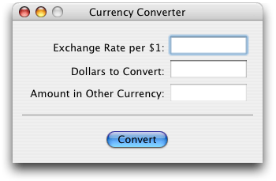

A user enters values in the first two fields, then clicks the button to get the answer in the third field. A horizontal separator divides the input and display fields from the Convert button.

Use Xcode to create a new AppleScript Studio project, as described in [Creating a Hello World Application](About%20AppleScript%20Studio.md#apple-f4xwc4dqnrsv64tfmyxwi33df52wszbpgiydambrgi2dslkukbmferkggezta), typing “Currency Converter” for the project name.

Figure 5-2 shows the new project after opening several groups in the Files list in the Groups & Files pane. You can save the project by typing Command-S or by choosing the Save command from the File menu. Use your typical level of care in periodically saving and backing up your work.

__Figure 5-2__  The project after opening several groups

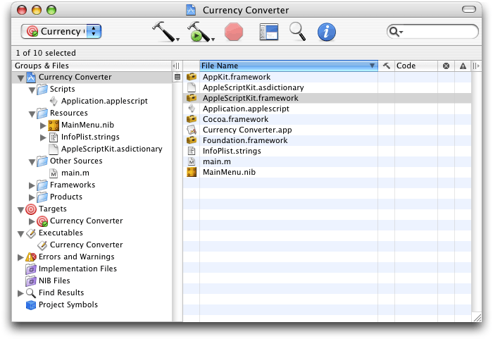

At this point, you can build the project and create a working application, with a window that can be expanded, minimized, and closed. The application can display an About window and respond to a number of menu choices. These features are provided by the Cocoa application framework (described in [Cocoa Framework Overview](AppleScript%20Studio%20Components.md#apple-f4xwc4dqnrsv64tfmyxwi33df52wszbpgiydambrgi2talkukbmferkggeztq)), without further work on your part. Of course you’ve got some work to do before the application can perform its custom operation of converting currencies.

To build and run the application, do one of the following:

- type Command-R
- choose Build and Run from the Build menu
- click the Build and Run button shown in Figure 5-2

When you are ready to continue with the tutorial, quit the application.

It usually makes sense to build an application periodically to make sure you haven’t introduced errors. However, the Currency Converter application is fairly simple, and it won’t have any additional functionality until you’ve written an event handler, so you might want to wait until later in this tutorial.

Before working on this section, you should be familiar with the information in [Interface Builder Features for AppleScript Studio](AppleScript%20Studio%20Components.md#apple-f4xwc4dqnrsv64tfmyxwi33df52wszbpgiydambrgi2talkukbmferkggezto), which describes, among other things, the nib files Interface Builder uses to store interface definitions.

To build the interface for Currency Converter, you perform these steps:

1. [Launch Interface Builder](#apple-f4xwc4dqnrsv64tfmyxwi33df52wszbpgiydambrgi2tglkukbmferkgge2do)
2. [Adjust the Title, Size, and Other Attributes of the Currency Converter Window](#apple-f4xwc4dqnrsv64tfmyxwi33df52wszbpgiydambrgi2tglkukbmferkgge3dg)
3. [Add Text Input Fields and Labels](#apple-f4xwc4dqnrsv64tfmyxwi33df52wszbpgiydambrgi2tglkcineuuqkji5cq)
4. [Add a Result Field and Label](#apple-f4xwc4dqnrsv64tfmyxwi33df52wszbpgiydambrgi2tglkcineuqskkifbq)
5. [Add Number Formatters to the Input and Result Fields](#apple-f4xwc4dqnrsv64tfmyxwi33df52wszbpgiydambrgi2tglkcineuirckizaq)
6. [Add a Convert Button](#apple-f4xwc4dqnrsv64tfmyxwi33df52wszbpgiydambrgi2tglkcineugqkbivaq)
7. [Add a Horizontal Separator](#apple-f4xwc4dqnrsv64tfmyxwi33df52wszbpgiydambrgi2tglkcineuiskhjjbq)
8. [Finalize the Layout](#apple-f4xwc4dqnrsv64tfmyxwi33df52wszbpgiydambrgi2tglkcineugskkirfa)

When you create a project with Xcode, the project automatically contains a default nib file named `MainMenu.nib`. The icon for this nib file is visible in [Figure 5-2](#apple-f4xwc4dqnrsv64tfmyxwi33df52wszbpgiydambrgi2tglkcineukqsci5ea). To launch Interface Builder, double-click the icon. You should see the same four windows shown in [Figure 2-7](AppleScript%20Studio%20Components.md#apple-f4xwc4dqnrsv64tfmyxwi33df52wszbpgiydambrgi2talkciffekrkhjfdq).

In this section you’ll make changes to the default window to set its title and adjust its size and other attributes. To modify the default window, perform these steps:

1. In Interface Builder’s MainMenu.nib window, double-click the text “Window” in the title of the Window instance. The result is shown in Figure 5-3.

   __Figure 5-3__  Selected text for Window instance in MainMenu.nib window

   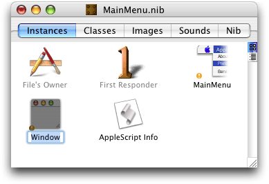
2. Type “Currency Converter” (without the quotes) as the new instance name. This step changes only the instance name, not the window title, but it’s a good habit to always name window instances so you can easily identify them.
3. Figure 5-4 shows the default window for the Currency Converter instance. Note “Window” is still the window title.

   __Figure 5-4__  The default window in the Currency Converter project

   

   Click once in this window, then choose Show Info from the Tools menu or type Command-Shift-I to open the Info window. The resulting Info window, with the Attribute pane visible, is shown in Figure 5-5.

   The Info window displays information about the currently selected object. The Info window displays the Attributes pane by default, or whichever pane was visible the last time the window was open. If the Attributes pane is not visible, use the pop-up menu at the top of the Info window or type Command-1 to display it.

   You can tell the Info window is displaying information for a window object because its title is “NSWindow Info” (the window object is an instance of Cocoa’s NSWindow class). If the Info window has some other title when you open it, click either the window instance shown in Figure 5-3 or the window object shown in Figure 5-4 to display window information in the Info window.

   __Figure 5-5__  The Attributes pane of the Info window for a window object

   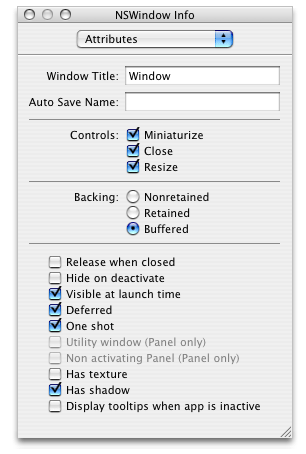
4. To retitle the window, simply type “Currency Converter” in the Window Title field, as shown in Figure 5-6.

   __Figure 5-6__  The Info window after retitling the Currency Converter window

   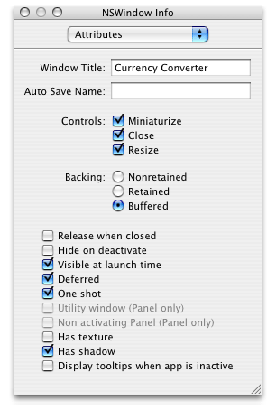
5. In the Controls section, deselect the Resize checkbox—you won’t allow a user to resize Currency Converter’s window. Later you’ll add a handler to quit the application when a user closes the window.

   You don’t need to change the default settings for any other attributes. The final settings are shown in Figure 5-7. For information on the other attributes, see [AppleScript Studio Terminology](Programming%20With%20AppleScript%20Studio.md#apple-f4xwc4dqnrsv64tfmyxwi33df52wszbpgiydambrgi2tclkdjjbeoqsijfda), as well as Interface Builder Help or the Cocoa documentation for the NSWindow class.

   __Figure 5-7__  The final Attributes settings for the Currency Converter window

   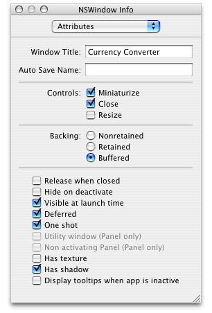
6. To resize the Currency Converter window, drag the resize control in the lower-right corner. The resized window should look similar to the one shown in [Figure 5-1](#apple-f4xwc4dqnrsv64tfmyxwi33df52wszbpgiydambrgi2tglkcineumr2eifcq).

   Instead of dragging, you can set the window to a specific pixel size. Use the pop-up menu or type Command-3 to display the Size pane in the Info window. The result is shown in Figure 5-8.

   __Figure 5-8__  The Size pane of the Currency Converter window

   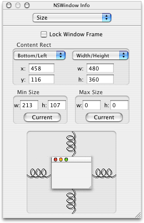

   To change the size, enter new width and height values in the text fields below the Width/Height pop-up menu. For the window shown in [Figure 5-1](#apple-f4xwc4dqnrsv64tfmyxwi33df52wszbpgiydambrgi2tglkcineumr2eifcq), the width is about 320 pixels and the height about 180 pixels.

   The Bottom/Left pop-up menu determines the window’s onscreen position when a user runs the application. You can either drag the window to the desired position or modify the values in the Size pane.

   There are several items in the Size pane whose default values don’t need to be changed for Currency Converter. For example, the spring images control resizing, but you’ve already turned off resizing for the Currency Converter window.

After all the changes you’ve made in this section, the Currency Converter window should look like Figure 5-9.

__Figure 5-9__  The modified Currency Converter window

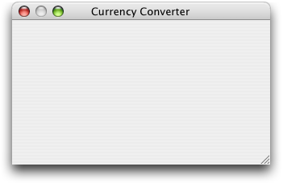

In this section you’ll perform steps that are common to nearly all AppleScript Studio application development, including:

- dragging user interface objects into your application window
- positioning and resizing objects to support the Aqua user interface guidelines
- using Interface Builder’s Info window to set attributes and prepare objects for scripting

Currency Converter needs text fields for entering the exchange rate per dollar and the number of dollars to convert. Each of these input fields needs a label.

To add text input fields and labels to Currency Converter’s main window, perform these steps:

1. Click the Cocoa-Text button in the Palette window toolbar. The Cocoa-Text palette is shown in Figure 5-10.

   To display a help tag describing a button (and the palette it selects), position the cursor over an item in the Palette window’s toolbar for a few seconds.

   Similarly, position the cursor over a user interface object in a palette to display the object’s Cocoa class (such as NSButton or NSTextField).

   You can see that the palette provides several kinds of text elements. Each text element has a distinct appearance based on its function and role in an application—you can see a search field, a pop-up menu, a wrapping text field, and more.

   __Figure 5-10__  The Cocoa-Text palette of Interface Builder’s Palette window

   
2. Drag a text field object from the Palette window to the Currency Converter window. Position the text field in the upper-right corner, using Interface Builder’s feedback to help you align the text field according to the Aqua guidelines, as shown in Figure 5-11. This is the exchange rate input field.

   __Figure 5-11__  Positioning a text input field for the exchange rate

   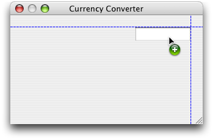
3. Select the text field, then drag the middle selection handle on the left side to resize the field, as shown in Figure 5-12. (If you use the upper or lower handle, it’s harder to maintain the same vertical height as you resize the field.) For now, don’t worry about making the field any specific width—you can adjust it later if necessary.

   __Figure 5-12__  Resizing the exchange rate input field

   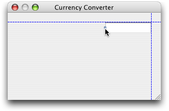
4. With the exchange rate field selected, open the Info window to the Attribute pane. The result is shown in Figure 5-13.

   __Figure 5-13__  The Attributes pane of the Info window for the exchange rate field

   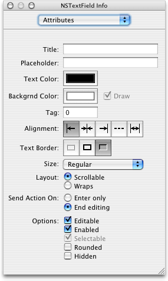
5. In the alignment section, click the middle button, to right-align text in the field.

   There are several attributes whose default values don’t need to be changed for Currency Converter. For example, Editable and Enabled are already selected in the Options section. For information on other attributes, see Interface Builder Help or the Cocoa documentation for the NSTextField class.
6. To provide an AppleScript name for the exchange rate input field (so you can access it in scripts), display the AppleScript pane in the Info window, then type “rate” in the Name field. Figure 5-14 shows the result.

   __Figure 5-14__  The Info window, after supplying an AppleScript name for the exchange rate field

   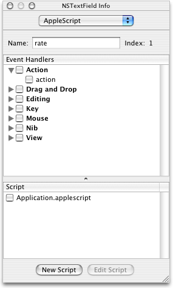

   If it makes sense, you can use the same AppleScript name for objects of different types in the same window (such as a button and a text field), or for objects of the same type (such as buttons) in different windows. However, if you name two text fields in the same window “rate,” you won’t be able to differentiate between them by name in an application script.

   __Figure 5-15__  The MainMenu.nib window showing an AppleScript Info object (not selected)

   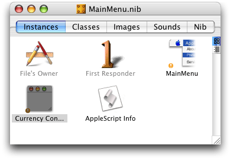
7. To add a label for the exchange rate input field, drag the label text field object with the text “System Font Text” (shown in [Figure 5-10](#apple-f4xwc4dqnrsv64tfmyxwi33df52wszbpgiydambrgi2tglkukbmferkggiyds)) from the Palette window to the Currency Converter window. Use the automatic feedback to position the label field to the left of the exchange rate input field, as shown in Figure 5-16.

   __Figure 5-16__  Positioning a label field for the exchange rate

   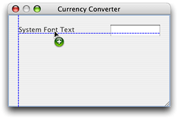
8. As in a previous step, select the label field and drag the middle selection handle on the left side to resize the field, as shown in Figure 5-17.

   __Figure 5-17__  Resizing the label field for the exchange rate

   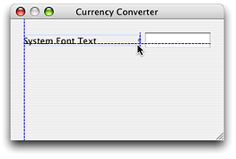
9. With the label field selected, open the Info window and display the Attributes pane. Now make these adjustments:

   1. Type “Exchange Rate per $1:” in the Title field. This is the label text. If any of the text is not visible, it may have scrolled out of view. If so, widen the label field until all the text is visible. You may need to resize the exchange rate input field as well.
   2. In the Alignment section, click the middle button, to right-align the label text.

   Figure 5-18 shows the resulting Info window; Figure 5-19 shows the text label field. Note that a label field, like an input field, is based on the NSTextField class.

   __Figure 5-18__  The Info window, after setting text and attributes for the exchange rate label

   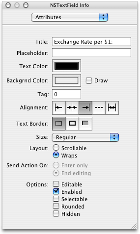

   __Figure 5-19__  The exchange rate label field (selected)

   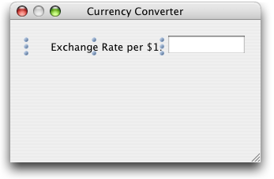
10. Save all the changes you’ve made in Interface Builder—they’re saved to the `MainMenu.nib` file. You’ll also be given a chance to save your changes if you quit Interface Builder.
11. To add the text input and label fields for “Dollars to Convert,” you can repeat your previous steps:

    1. Drag a text field into the Currency Converter window, aligning it below the exchange rate text field.
    2. Resize the field.
    3. Set its attributes.
    4. Give it the AppleScript name “amount”.
    5. Add a label field, aligning it below the previous label field.
    6. Label the field “Dollars to Convert:” and right-align it.

    Or, you can use Interface Builder’s Duplicate command to duplicate the two already-created text fields, then supply them with new label text and new AppleScript names:

    1. Shift-click or drag to select the two fields you’ve already entered, then choose Duplicate from the File menu or type Command-D.
    2. Drag the duplicated fields, using the automatic guides to align them below the original fields.
    3. Select the new label field and in the Attributes pane of the Info window, type “Dollars to Convert:” in the Title field.
    4. To provide an AppleScript name for the text input field, select the field, open the Info window to the AppleScript pane, and type “amount” in the Name field.

    Figure 5-20 shows the results of adding the two new text fields.

    __Figure 5-20__  The Currency Converter window with input fields and labels

    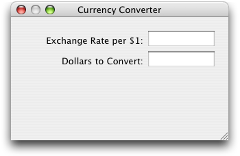

In this section you’ll add a text field to display the computed total in the new currency. You’ll also add a label field for the conversion result. You’ll get additional tips on aligning fields in [Finalize the Layout](#apple-f4xwc4dqnrsv64tfmyxwi33df52wszbpgiydambrgi2tglkcineugskkirfa).

1. To add a text field and label for “Amount in Other Currency,” perform these steps:

   1. Shift-click or drag to select the exchange rate label and text input fields, then choose Duplicate from the File menu or type Command-D.
   2. Drag the duplicated fields and align them below the original fields using the guides.
   3. Select the new label field and type “Amount in Other Currency:” in the Title field in the Attributes pane of the Info window.
   4. Select the text input field and type “total” in the Name field in the AppleScript pane of the Info window.

      Figure 5-21 shows the results of adding the additional text fields. The window now contains its final collection of text fields and labels.

      __Figure 5-21__  The Currency Converter window with all text fields and labels

      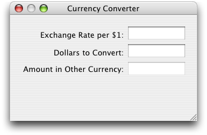
2. You don’t want a user to be able to enter text in the “Amount in Other Currency” input field, so you’ll need to disable editing. Select the field, display the Attributes pane in the Info window, and deselect the Editable checkbox in the Options section. Figure 5-22 shows the result.

   __Figure 5-22__  The Info window, after disabling editing for the amount in other currency field

   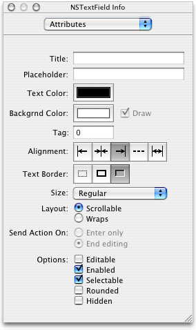

Save your work before moving on to the next section.

Currency Converter should allow users to input only meaningful values, and it should display a properly formatted result:

- the exchange rate input field should accept and display decimal numbers such as 1.55 or 10.24
- the dollars to convert input field should display valid dollar amounts, such as $125.20
- the amount in other currency field should display the computed total in the appropriate currency to the current locale, such as dollars ($600.10) or yen (¥1700.00)

To format the text in a text field, Interface Builder provides number formatters (based on the Cocoa NSNumberFormatter class). In the Cocoa-Text palette in [Figure 5-10](#apple-f4xwc4dqnrsv64tfmyxwi33df52wszbpgiydambrgi2tglkukbmferkggiyds), the number formatter is represented by a dollar sign superimposed on the number 1.99.

To provide number formatters for Currency Converter’s text fields, perform these steps

1. Select the exchange rate input field in the Currency Converter window.
2. Open the Info window to the Attributes pane.
3. Display the Cocoa-Text palette in Interface Builder’s Palette window.
4. Drag a number formatter from the palette and drop it on the input field, as shown in Figure 5-23.

   __Figure 5-23__  Adding a number formatter to the exchange rate input field

   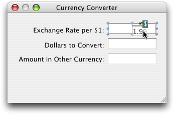

   Figure 5-24 shows Info window for the number formatter. The formatter pane should open automatically when you insert a number formatter into a text field. You can also select the pane from the pop-up menu.

   The default formatter settings are correct for the exchange rate input field, so you don’t need to make any changes.

   __Figure 5-24__  The Formatter pane for the exchange rate input field

   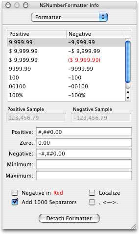
5. Repeat the previous steps to add a number formatter to the dollars to convert input field. The Info window should again look as in Figure 5-24.
6. Select the second row in the formatter, so that the field includes a dollar sign.
7. Repeat the previous steps to add a number formatter to the amount in other currency field. The Info window should again look as in Figure 5-24. Again, select the first format row that includes a dollar sign.
8. Because the amount in other currency is likely not to be in dollars, select the Localize checkbox in the Options section. Figure 5-25 shows the result.

   __Figure 5-25__  The Formatter pane for the amount in other currency field

   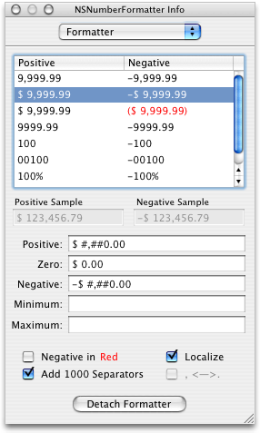

For more information on number formatters, see Interface Builder Help or the Cocoa documentation for the NSNumberFormatter class.

To add a Convert button to Currency Converter, perform the following steps:

1. Drag a button object from the Cocoa-Controls palette in the Palette window to the bottom right corner of the Currency Converter window. Use the automatic feedback to align the right edge of the button with the right edge of the text field above it.
2. Double-click the button to select its text, then type “Convert”. Figure 5-26 shows the result.

   __Figure 5-26__  The Currency Converter window with a “Convert” button

   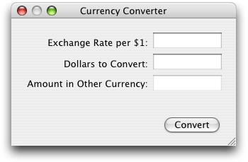

To add a horizontal separator to Currency Converter, perform the following steps:

1. Drag a box object from the Cocoa-Controls palette in the Palette window to the Currency Converter window. The box object looks like a horizontal line. (If you let the cursor rest over the line in the Palette window, Interface Builder displays “NSBox”.)

   Position the box in the lower right of the window, between the convert button and the text field above it, with the right edge near the right edge of the window. Use the automatic feedback to align it.
2. Drag the left selection handle to resize the separator, using the automatic feedback to stretch it until it almost reaches the left side of the window. Figure 5-27 shows the result.

   __Figure 5-27__  The Currency Converter window with a horizontal separator

   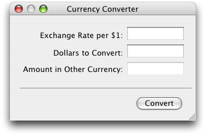

In this tutorial, you have generally positioned user interface objects so that they are aligned with other objects and in accord with the Aqua interface guidelines. However, now that all the user interface objects are in place, you can check the alignment and perform other layout operations.

1. Click and shift-click to select all three of the label fields.
2. To resize the fields to their minimum sizes, choose Size to Fit from the Layout menu.
3. To right align the labels, choose Align Right Edges under Alignment in the Layout menu.
4. Similarly, select all three non-label text fields.
5. To make them the same size, choose Same Size from the Layout menu.
6. To align their left edges, choose Align Left Edges under Alignment in the Layout menu.
7. To make sure they’re still aligned according to the Aqua guidelines, use the automatic feedback as you drag them to the right edge of the window.

See Interface Builder Help for information on other options in the Layout menu. And remember, you can use these layout options at any time that makes sense.

The Currency Converter application needs a connection so that when a user clicks the Convert button (or presses the Return key), the application calls a handler in an application script. It also needs a connection so that when a user closes the window, the application quits (the application can’t do anything useful without a window).

To set up connections for Currency Converter, perform these steps in Interface Builder:

1. Select the Convert button, then display the Attributes pane in the Info window. Figure 5-28 shows the row in the middle of the Attributes pane that you use to select a key equivalent for the button.

   __Figure 5-28__  Fields from the Info window for setting keystroke equivalent

   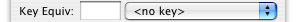

   In the pop-up that says <no key>, choose Return. This causes the Convert button’s action handler (the `clicked` handler you’ll connect next) to be called when a user presses the Return key. Figure 5-29 shows the result.

   __Figure 5-29__  Fields from the Info window for setting keystroke equivalent

   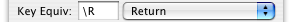

   When you choose the Return key as the keystroke equivalent for a button, you’ve designated that button as the default button in the window. Cocoa automatically colors the button aqua to show it is the default button.

   You can use the checkboxes to the right of the pop-up to include the Option and Command keys as part of the keystroke equivalent, but that isn’t necessary for Currency Converter.
2. With the Convert button still selected, display the AppleScript pane in the Info window.
3. Type “convert” for the AppleScript name for the button.
4. Click the disclosure triangle next to the Action checkbox and select the “clicked” checkbox to indicate the application should have a `clicked` event handler, called when a user clicks the button.
5. Check the file `Currency Converter.applescript` in the Script list to connect the handler. Figure 5-30 shows the Info window after this step.

   __Figure 5-30__  The Info window after connecting a clicked handler to the Convert button

   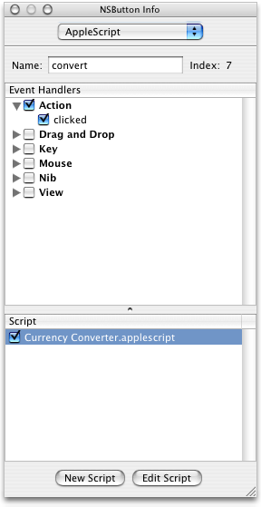
6. Save your results. That causes Interface Builder to insert an empty `clicked` handler in the selected script file. If you click the Edit Script button, Interface Builder also opens the file in an Xcode editor window. You’ll see the code for the `clicked` handler in the next section. But for now, just save your results and stay in Interface Builder so you can add another handler.
7. To quit the application when a user closes the Currency Converter window, you’ll need to connect a special handler to the application. [Figure 5-3](#apple-f4xwc4dqnrsv64tfmyxwi33df52wszbpgiydambrgi2tglkcineuor2hincq) shows the MainMenu.nib window. The File’s Owner instance in that window represents NSApp, a global constant for the application object that serves as the master controller for the application. (The icons in the Instances pane are described in [Interface Creation](AppleScript%20Studio%20Components.md#apple-f4xwc4dqnrsv64tfmyxwi33df52wszbpgiydambrgi2talkukbmferkgge3dc).)

   Select the File’s Owner in the nib window and open the Info window to display the AppleScript pane.
8. Click the disclosure triangle next to the Application checkbox and select the “should quit after last window closed” checkbox. Clicking this checkbox indicates the application should have a corresponding event handler, called when a user closes the last window (the Currency Converter’s only window).

   The dash in the Application checkbox indicates that at least one handler in the group is checked, but not all are.
9. Select the file `Currency Converter.applescript` in the Script list to connect the handler. Figure 5-31 shows the Info window after this step.

   __Figure 5-31__  The Info window after connecting a handler to the application object

   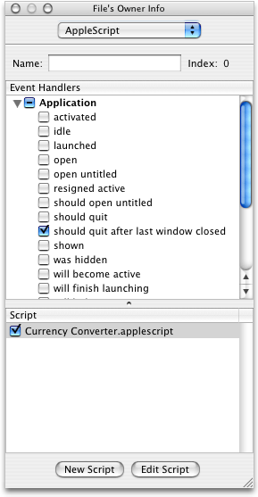

When you connect a handler in Interface Builder and save your changes, Interface Builder inserts a skeleton handler into the specified script in your Xcode project. Listing 5-1 shows the skeleton `clicked` handler in the file `Currency Converter.applescript`. The application calls this handler when a user clicks the Convert button. The parameter `theObject` is a reference to the button object itself.

__Listing 5-1__  The empty clicked handler

```
on clicked theObject
    (* Add your script here. *)
end clicked
```

In the `clicked` handler, the Currency Converter application needs to get the exchange rate and the number of dollars to convert, multiply them to determine the total in the new currency, and display that value. It should behave gracefully if the value for either the exchange rate or the number of dollars is missing. (The number formatters you added to the input fields prevent a user from saving erroneous values, such as alphabetic characters.)

Listing 5-2 shows the completed `clicked` handler.

__Listing 5-2__  The complete clicked handler

```
on clicked theObject
    tell window of theObject
        try
            set theRate to contents of text field "rate" as number
            set theAmount to contents of text field "amount" as number
            set contents of text field "total" to theRate * theAmount
        on error
            set contents of text field "total" to 0
        end try
    end tell
end clicked
```

The key points of this handler are:

- the `theObject` parameter is a reference to the clicked button object
- a button, like other controls, is a view, and a script can get the window of a view
- a script can get a reference to any named AppleScript object within a window (it can also refer to items by number—for example, `the first text field`— or ID, but names are easy to specify, self-documenting, and won’t change dynamically)
- the handler shows the syntax for getting and setting the content of text fields; when a number formatter is attached to a text field, the contents must be set explicitly as number, as shown in Listing 5-2, and not as text
- the actual work performed by the Currency Converter application is quite simple
- the handler uses a `try`, `on error` block to set the contents of the result field to 0 if an error occurs in calculating the converted value; this protects the user from receiving a possibly confusing error message if they attempt to convert without supplying both an exchange rate and an amount to convert

When you connect a handler in Interface Builder and click the Edit Script button, Interface Builder inserts a skeleton handler into the specified script and opens the script in Xcode. Listing 5-3 shows the completed `should quit after last window closed` handler in the file `Currency Converter.applescript`. This handler is called when a user closes the Currency Converter window. Its one line, supplied by you, returns the value `true`, indicating the application should, indeed, quit when the last window is closed.

__Listing 5-3__  The should quit after last widow closed handler

```
on should quit after last window closed theObject
    return true
end should quit after last window closed
```


The Currency Converter application should now be ready to perform conversions, so it’s time to build it again. Use any of the mechanisms described previously to build and run the application:

- type Command-R
- choose Build and Run from the Build menu
- click the Build and Run button (a combined monitor and hammer)

Figure 5-32 shows the application after computing a currency conversion. Because the test computer was set up for U.S. English, the converted amount is shown in dollars, but for another locale it might show yen or pounds.

__Figure 5-32__  The Currency Converter application in action


For a detailed discussion of building and checking for syntax errors, see [Mail Search Tutorial: Build and Test the Application](Mail%20Search%20Tutorial-%20Build%20and%20Test%20the%20Application.md#apple-f4xwc4dqnrsv64tfmyxwi33df52wszbpgiydambrgi2tqlkukbmferkggeydc).

Once you have completed the Currency Converter tutorial, you have several options for learning more about AppleScript Studio:

- If you haven’t already done so, build and experiment with some of the sample applications described in [AppleScript Studio Sample Applications](About%20AppleScript%20Studio.md#apple-f4xwc4dqnrsv64tfmyxwi33df52wszbpgiydambrgi2dslkdjjbeuqsgifaq).
- If you’re ready for a more challenging tutorial, go right to the chapter [Mail Search Tutorial: Design the Application](Mail%20Search%20Tutorial-%20Design%20the%20Application.md#apple-f4xwc4dqnrsv64tfmyxwi33df52wszbpgiydambrgi2tilkukbmferkggeydc).
- If you want to take it a little slower, try using the information in [Chapter 12, Mail Search Tutorial: Customize the Application,](Mail%20Search%20Tutorial-%20Customize%20the%20Application.md#apple-f4xwc4dqnrsv64tfmyxwi33df52wszbpgiydambrgi2tslkukbmferkggeydc) to customize the Currency Converter application. Although the customizing chapter refers frequently to Mail Search, the customization steps can be applied to any application.

[Next](Mail%20Search%20Tutorial-%20Design%20the%20Application.md)[Previous](AppleScript%20Studio%20Cookbook.md)

