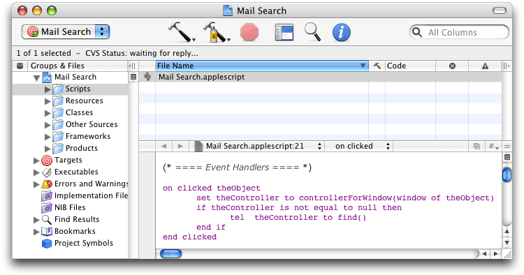
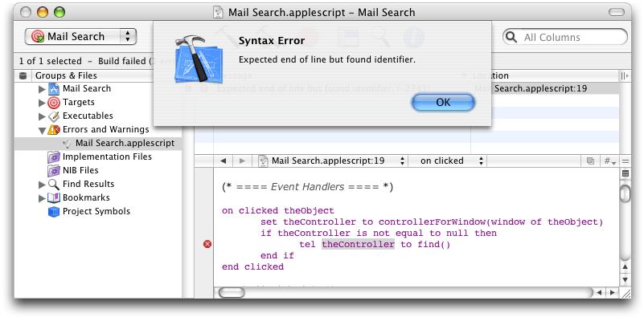
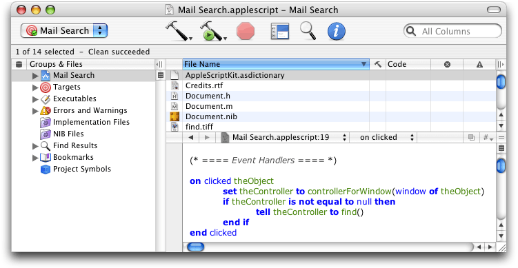
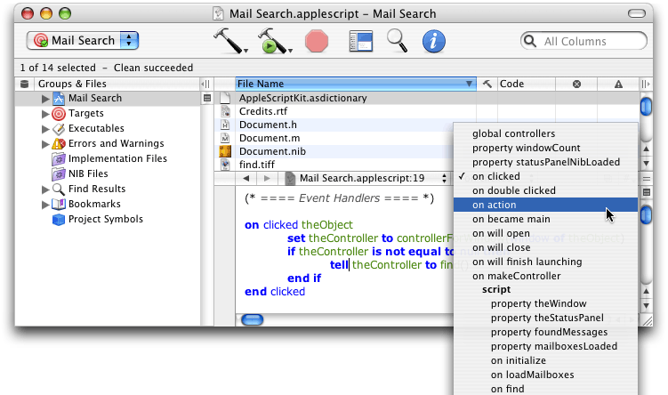

> 导航：[总目录](../../../README.md) · [documentation](../../../_indexes/documentation.md) · [AppleScript Studio Programming Guide](Introduction%20to%20AppleScript%20Studio%20Programming%20Guide.md)

[Next](Mail%20Search%20Tutorial-%20Customize%20the%20Application.md)[Previous](Mail%20Search%20Tutorial-%20Write%20the%20Code.md)

# Mail Search Tutorial: Build and Test the Application

In this chapter you’ll build and test Mail Search, an AppleScript Studio application that searches for specified text in messages in the Mac OS X Mail application.

This chapter assumes you have completed previous Mail Search tutorial chapters. By now, you should have completed constructing the application, including building the interface, connecting objects in the interface to handlers in the application, and writing the handlers. Chances are you built the application several times while creating the interface, and perhaps later as well.

You may have inserted handlers in Mail Search’s script file (`Mail Search.applescript`) as you worked on the tutorial, or you may have chosen to copy in the whole body of the script, either from [Appendix B](Mail%20Search%20Tutorial%2C%20Full%20Script%20Listing.md#apple-f4xwc4dqnrsv64tfmyxwi33df52wszbpgiydambrgi3dclkukbmferkggeydc) or by copying it (as recommended) from the Mail Search sample application distributed with AppleScript Studio. You should now be ready to build the application and run it. These steps are described in the following sections:

- [Build and Run Mail Search](#apple-f4xwc4dqnrsv64tfmyxwi33df52wszbpgiydambrgi2tqlkukbmferkggiytm)
- [Check for Syntax Errors](#apple-f4xwc4dqnrsv64tfmyxwi33df52wszbpgiydambrgi2tqlkukbmferkggiyto)

To build and run the application, you follow the same steps described earlier in this tutorial:

1. Open your Mail Search project in Xcode.
2. Type Command-R, choose Build and Run from the Build menu, or click the Build and Run button.

Xcode has a number of menu commands, keystroke equivalents, and buttons you can use to perform different kinds of build operations. You can display the help tag for any of the three build-related buttons visible in Figure 10-1 by positioning the cursor over them. In addition, each of these three buttons can operate as a pull-down menu.

- the hammer: Builds the active target. Same as Command-B, or Build in the Build menu. Its pull-down menu contains Clean and Clean All, used to clean the current target or the entire project of previously built products and files.
- the hammer and green button: Builds the active target and runs the executable product. Same as Command-R, or Build and Run in the Build menu. Other options are available in its pull-down menu, but Build and Run is the most important function.
- the stop sign: Stops the current activity for a product. Same as Command-Option-R, or Stop in the Debug menu. The pull-down menu lists all the currently active products, allowing you to select the one to stop.

All uncompiled script files in the current target (in this case, there’s just one target and one script file, `Mail Search.applescript`) are compiled automatically when you build the application. Building the application also compiles the Cocoa code in the application’s `main.m` file (visible in [Figure 1-10](About%20AppleScript%20Studio.md#apple-f4xwc4dqnrsv64tfmyxwi33df52wszbpgiydambrgi2dslkdjjbeqssdjbdq)), prepares the application’s resources, and links any designated frameworks (for Mail Search, that’s the frameworks in the Linked Frameworks group within the Frameworks group in the Groups & Files list).

If the build succeeds, Mail Search opens, launches the Mail application if it isn’t already running, and loads all available mailboxes. In the next sections, you’ll learn what to do if Mail Search doesn’t build correctly, or if testing shows the application isn’t working properly.

When you first enter text in an Xcode script editor window, it appears in the style specified in the Script Editor application (located in `/Applications/AppleScript`) for new (uncompiled) text. For example, Figure 10-1 shows how the `clicked` handler might look when you first type or copy it into the script file (in this case, with a minor spelling error you’ll fix in a minute).

__Figure 10-1__  An uncompiled handler

If you want to change the default format settings, use the steps described in [How Xcode Formats Scripts](Programming%20With%20AppleScript%20Studio.md#apple-f4xwc4dqnrsv64tfmyxwi33df52wszbpgiydambrgi2tclkdjjbegsciifca). You’ll have to quit and restart Xcode to pick up the new settings.

To check for syntax errors, perform these steps:

1. Open your Mail Search project in Xcode.
2. Open the Scripts group in the Files list in the Groups & Files list and select `Mail Search.applescript`. Xcode knows that files that end in `.applescript` are script files, and displays the file in a script editor window.
3. Select Build > Compile or press Command-K. Assuming your script file has the same spelling error shown in Figure 10-1, you should see a result similar to Figure 10-2.

   __Figure 10-2__  A syntax error in an Xcode script editor window

   

Because “tel” is misspelled (and looks like an identifier), it isn’t recognized as a keyword. As a result, the next term, “theController”, is flagged as an error. That word is selected and an error message is displayed, as shown in Figure 10-2.

Your job is to examine the offending line, correct whatever is wrong, and again click the checkmark to compile it. You can also initiate a compile by pressing the Enter key, typing Command-K, or choosing Compile from the Build menu. (As mentioned previously, uncompiled script files in the current target are also compiled when you build the application.) When you successfully compile the script, you should see formatting similar to that shown in Figure 10-3.

To help determine the correct terminology for a script, see [Finding Terminology Information](Programming%20With%20AppleScript%20Studio.md#apple-f4xwc4dqnrsv64tfmyxwi33df52wszbpgiydambrgi2tclkciffekq2djbeq).

__Figure 10-3__  A compiled handler

To help in editing and compiling scripts, you can use the pop-up menu in the editor window to jump to any property, script, or handler in the script file. Figure 10-4 shows how to select the `action` handler using the pop-up menu. Once selected, the editor will jump to that handler.

__Figure 10-4__  Event handlers in an Xcode pop-up menu

[Next](Mail%20Search%20Tutorial-%20Customize%20the%20Application.md)[Previous](Mail%20Search%20Tutorial-%20Write%20the%20Code.md)

