> 导航：[总目录](../../../README.md) · [documentation](../../../_indexes/documentation.md) · [AppleScript Studio Programming Guide](Introduction%20to%20AppleScript%20Studio%20Programming%20Guide.md)


[Next](Mail%20Search%20Tutorial-%20Write%20the%20Code.md)[Previous](Mail%20Search%20Tutorial-%20Create%20the%20Interface.md)

# Mail Search Tutorial: Connect the Interface

Mail Search is a fairly complex AppleScript Studio application that searches for specified text in messages in the Mac OS X Mail application. In previous chapters you’ve designed the application, created a project, and built the user interface with the Interface Builder application. In this chapter, you connect objects in the interface to handlers in the application’s script file.

This chapter assumes you have completed previous Mail Search tutorial chapters.

Now that you’ve built Mail Search’s interface, you need to perform additional steps in Interface Builder to connect objects in the interface to event handlers in the project. In [Event Handlers in Mail Search](Mail%20Search%20Tutorial-%20Design%20the%20Application.md#apple-f4xwc4dqnrsv64tfmyxwi33df52wszbpgiydambrgi2tilkcineuqrkcjbcq), you identified handlers that would be needed for various objects. You don’t need any handlers for the status dialog or the message window, but you do need to make connections for Mail Search’s application object and search window. For the search window, you also need to connect data source objects to provide data to the search results and mailbox views. (A data source object, described in more detail below, is a special object supplied by AppleScript Studio that provides row and column data to a table or outline view.) The next sections describe how to make these connections.

The application object in an AppleScript Studio application is represented by the File’s Owner object in the Instances tab in the MainMenu.nib window. This object is described in [Interface Creation](AppleScript%20Studio%20Components.md#apple-f4xwc4dqnrsv64tfmyxwi33df52wszbpgiydambrgi2talkukbmferkgge3dc) and shown in Figure 8-1. Your application can use this object to connect handlers that are called at various interesting times, such as when the application is launched or activated. For a look at the available handlers, see Figure 8-2.

__Figure 8-1__  The File’s Owner instance in the MainMenu.nib window

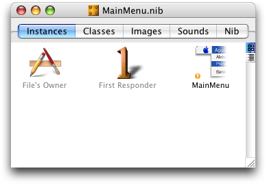

Mail Search uses the `will finish launching` handler to perform necessary initialization after the application has created its interface but has not yet completed launching. To connect this handler, perform the following steps:

1. Select the File’s Owner object in the Instances tab in the MainMenu.nib window, as shown in Figure 8-1.
2. Choose Show Info from the Tools menu or type Command-Shift-I to open the Info window. Use the pop-up menu at the top of the window to display the AppleScript pane. Then click the disclosure triangle to reveal the handlers in the Application group. The result is shown in Figure 8-2.

   __Figure 8-2__  The Info window for the File’s Owner instance

   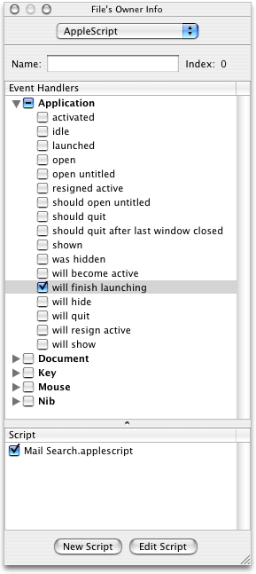
3. To connect the handler, perform the following steps:

   1. Select the `will finish launching` checkbox.
   2. Select the file `Mail Search.applescript` in the Script list.
   3. Click the Edit Script button.

   When you click the Edit Script button, Interface Builder inserts an empty `will finish launching` handler in the script file and opens the file in an Xcode editor window. The handler is shown in Listing 8-1. You add statements to this handler in [Application Object Handler](Mail%20Search%20Tutorial-%20Write%20the%20Code.md#apple-f4xwc4dqnrsv64tfmyxwi33df52wszbpgiydambrgi2tolkukbmferkgge4tk).

   __Listing 8-1__  A new handler declaration for the `will finish launching` handler

```
on will finish launching theObject
    (*Add your script here.*)
end will finish launching
```
4. When you create a new event handler for an object, you should also insert a comment that specifies which object initiates calls to the handler. In this case, you could add the line `(* "Called from the application object just prior to completion of launching." *)`. In some cases, more than one object of the same type may be connected to the handler. This situation is described in [Deciding How Many Script Files to Use](Programming%20With%20AppleScript%20Studio.md#apple-f4xwc4dqnrsv64tfmyxwi33df52wszbpgiydambrgi2tclkukbmferkgge4da).
5. To verify that the handler is correctly connected, you can replace the comment `(*Add your script here.*)` with `display dialog "In the will finish launching handler."`

   You can build and run the application by typing Command-R, choosing Build and Run from the Build menu, or clicking the Build and Run button. You should see the dialog after the application launches.

   As you work through additional sections that connect handlers, you can use the same techniques to verify that the handlers are working.
6. As always, save the nib file after completing your changes.

As noted in [Add the Message Window to the Nib File](Mail%20Search%20Tutorial-%20Create%20the%20Interface.md#apple-f4xwc4dqnrsv64tfmyxwi33df52wszbpgiydambrgi2tklkukbmferkgge3dk), the first time you make a change in the AppleScript pane, Interface Builder adds a new instance named AppleScript Info to the nib window.

The search window is the main place where you connect Mail Search’s interface to event handlers. You also need to connect data source objects to provide data to the search results and mailbox views. To make these connections, perform these steps, which are described in detail in the sections that follow:

1. Connect event handlers to the search window.
2. Connect an event handler to the text field.
3. Connect an event handler to the find button.
4. Connect an event handler to the search results view.
5. Connect data source objects to the mailboxes view and the search results view.

As described in [Plan the Code](Mail%20Search%20Tutorial-%20Design%20the%20Application.md#apple-f4xwc4dqnrsv64tfmyxwi33df52wszbpgiydambrgi2tilkcineuossbjjbq), Mail Search needs to know when a search window is opened, activated, or closed. To add these handlers, perform the following steps:

1. If the Document.nib file is not already open in Interface Builder, open it.
2. Select the Mail Search instance in the nib window.
3. Choose Show Info from the Tools menu or type Command-Shift-I to open the Info window. Use the pop-up menu at the top of the window to display the AppleScript pane. Then click the disclosure triangle to reveal the handlers in the Window group. The result is shown in Figure 8-3.

   __Figure 8-3__  The Info window for the Mail Search window instance

   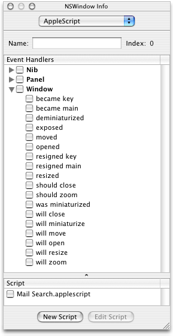
4. To connect the handlers, perform the following steps:

   1. Select the checkboxes for `became main`, `will close`, and `will open`.
   2. To connect the handlers, select the checkbox for the script file `Mail Search.applescript` in the Script list.
   3. Click the Edit Script button.

   When you click the Edit Script button, Interface Builder inserts empty handlers for the three event handlers in the script file and opens the file in an Xcode editor window. The handlers are shown in Listing 8-2. You add statements to these handlers in [Search Window Handlers](Mail%20Search%20Tutorial-%20Write%20the%20Code.md#apple-f4xwc4dqnrsv64tfmyxwi33df52wszbpgiydambrgi2tolkukbmferkgge4tm).

   __Listing 8-2__  New handler declarations for several handlers

```
on became main theObject
    (*Add your script here.*)
end became main

on will close theObject
    (*Add your script here.*)
end will close

on will open theObject
    (*Add your script here.*)
end will open
```
5. To verify that the handlers are correctly connected, you can add `display dialog` statements, as described in [Connect the Application Object](#apple-f4xwc4dqnrsv64tfmyxwi33df52wszbpgiydambrgi2tmlkukbmferkgge4de). You may also wish to add comments that the `theObject` parameter will be a search window object.

A user types text to search for in the text field in the search window. In this section, you connect an action handler to the text field so that when a user presses the Enter key, Mail Search initiates a search. To add this handler, perform the following steps:

1. In Interface Builder, open the Info window for the Mail Search window instance and display the AppleScript pane, as described in [Connect the Application Object](#apple-f4xwc4dqnrsv64tfmyxwi33df52wszbpgiydambrgi2tmlkukbmferkgge4de).
2. Select the text field in the search window.
3. Click to open the Action group, then select the checkbox for the `action` handler. The result is shown in Figure 8-4.

   Action handlers get their name from a Cocoa concept known as target-action. In this case, pressing the return key can cause a text field object to send an action message to its target (in Cocoa, the target is a method, but here it is a handler). Other examples of action events are `clicked` and `double-clicked`.

   __Figure 8-4__  The Info window for the search text field

   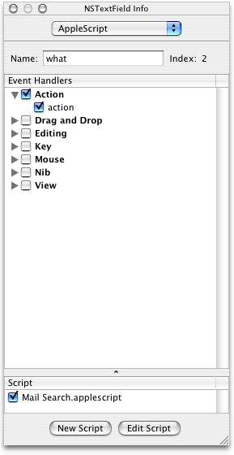
4. Connect the handler as in previous sections by selecting the file `Mail Search.applescript` in the Script list, then click the Edit Script button to open the script in an Xcode editor window.

   The resulting handler declaration is shown in Listing 8-3. You add statements to this handler in [Text Field Handler](Mail%20Search%20Tutorial-%20Write%20the%20Code.md#apple-f4xwc4dqnrsv64tfmyxwi33df52wszbpgiydambrgi2tolkcineukrshizaq).

   __Listing 8-3__  A new `action` handler for a text field

```
on action theObject
    (*Add your script here.*)
end action
```
5. To verify that the handler is correctly connected, you can add `display dialog` statements, as described in [Connect the Application Object](#apple-f4xwc4dqnrsv64tfmyxwi33df52wszbpgiydambrgi2tmlkukbmferkgge4de). You may also wish to add a comment that the `theObject` parameter will be a text view object.

A user clicks the find button in Mail Search’s search window to initiate a search. To enable this behavior, you connect a `clicked` handler for the find button. To do so, perform steps similar to those you’ve used in previous sections:

- select the find button
- open the Info window
- display the AppleScript pane
- select the checkbox for the `clicked` handler
- To connect the handlers, select the checkbox for the script file `Mail Search.applescript`; the result is shown in Figure 8-5.
- click the Edit Script button to insert a `clicked` handler declaration in the script file

You can examine the resulting handler declaration in Xcode. You add statements to the handler in [Find Button Handler](Mail%20Search%20Tutorial-%20Write%20the%20Code.md#apple-f4xwc4dqnrsv64tfmyxwi33df52wszbpgiydambrgi2tolkukbmferkgge4to).

__Figure 8-5__  The Info window for the find button

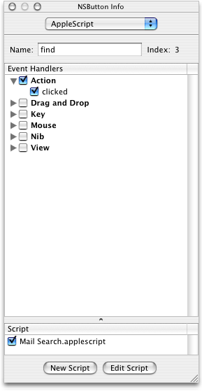

Mail Search uses a table view to show search results—the found messages that contain the search text. When a user double-clicks a found message in the table view, Mail Search displays the message in a separate window. To support this behavior, the table view object needs a `double-clicked` handler.

To connect a `double-clicked` handler for the table view in the search window, perform the same steps you’ve used in previous sections:

- click, then double-click (and double-click again if necessary) to select the table view
- open the Info window
- display the AppleScript pane
- select the checkbox for the `double-clicked` handler
- select the checkbox for the script file `Mail Search.applescript`
- click the Edit Script button to insert a `double-clicked` handler declaration in the script file

The result before clicking the Edit Script button is shown in Figure 8-6.

In Figure 8-6, the Action group and clicked checkboxes have dashes while the double clicked checkbox has a checkmark. A handler checkbox (such as the double clicked checkbox) can have one of three states:

- Empty: Indicates there is no handler with that name in the currently selected script.
- Dashed: Indicates that there is an event handler with that name in the currently selected script, but that the current object isn’t connected to it (so presumably some other object is).
- Checked: Indicates there is an event handler with that name in the currently selected script (or that such a handler will be added when you edit the script), and it is (or will be) connected to the current object in the Info window.

A group checkbox (such as the Action group checkbox) can have one of the same three states:

- Empty: Indicates no event handler in that group is checked.
- Dashed: Indicates at least one event handler in that group is checked.
- Checked: Indicates every event handler in that group is checked.

__Figure 8-6__  The Info window for the search results table view

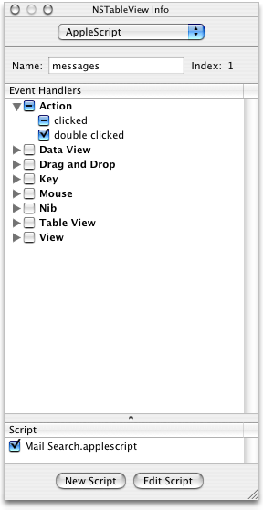

You can examine the resulting `double-clicked` handler declaration in Xcode. You add statements to the handler in [Search Results Table View Handler](Mail%20Search%20Tutorial-%20Write%20the%20Code.md#apple-f4xwc4dqnrsv64tfmyxwi33df52wszbpgiydambrgi2tolkukbmferkgge4tq).

Mail Search uses an outline view to display a list of all mailboxes from all accounts. An outline view can display hierarchical data, similarly to the way the Finder displays directories and files in a list view. The outline view needs to be connected to a _data source object_—a special object supplied by AppleScript Studio that provides row data (in this case, mailbox names) to a table or outline view.

To create a data source object and connect it to the outline view in the search window, perform these steps (assuming you still have the search window from the `Document.nib` file open in Interface Builder, along with the Info window):

1. Click the AppleScript button in the Palette window toolbar to select the AppleScript pane. There currently is a single image in that pane, representing a data source object.
2. Drag a data source object from the Palette window to the Document.nib window. The result is shown in Figure 8-7. The letters “ASK” come from AppleScriptKit, the framework that defines this data source.

   __Figure 8-7__  The Document.nib window with a data source object

   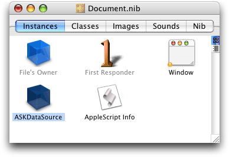
3. Double-click the name (“ASKDataSource”) and change it to “Mailboxes”.
4. Double-click to select the outline view in the search window. Be sure the view appears as in [Figure 7-42](Mail%20Search%20Tutorial-%20Create%20the%20Interface.md#apple-f4xwc4dqnrsv64tfmyxwi33df52wszbpgiydambrgi2tklkcineukqkgjfba), so that you know it’s selected.
5. Press and hold the Control key and drag from the outline view to the data source object in the Document.nib window. This step is shown in Figure 8-8.

   __Figure 8-8__  Connecting the outline view to the data source object

   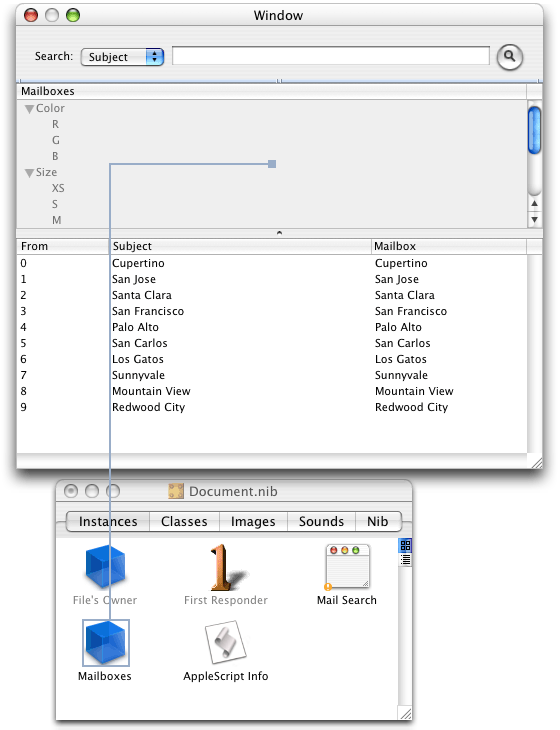
6. At this point, the Info window displays the Connections pane. Double-click the dataSource outlet. This connects the outline view to the data source object. The result is shown in Figure 8-9.

   Even though you named the data source “Mailboxes,” the destination of the connection in Figure 8-9 is still “ASKDataSource.”

   __Figure 8-9__  The Info window for the outline view after connecting a data source outlet

   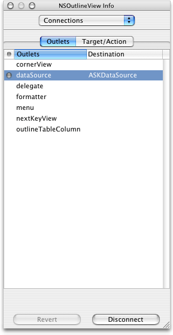
7. Mail Search also needs an identifier for the column header (which has the column title Mailboxes) in the outline view. Data source objects use identifiers specify columns and rows, since they can be shuffled. To provide an identifier, perform these steps:

   1. With the outline view still selected in the search window, click to select the column header.
   2. Choose the Attributes pane in the Info window.
   3. Type “mailboxes” in the Identifier text field. The result is shown in Figure 8-10.

   __Figure 8-10__  The Info window after entering an outline column identifier

   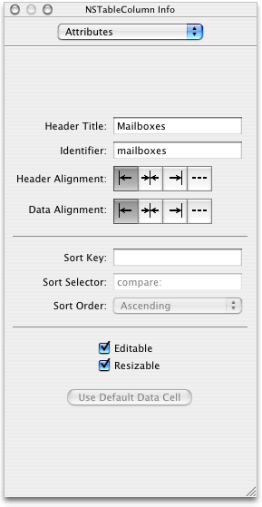
8. Don’t forget to periodically save the nib file.

In [Group the Outline View and Table View in a Split View](Mail%20Search%20Tutorial-%20Create%20the%20Interface.md#apple-f4xwc4dqnrsv64tfmyxwi33df52wszbpgiydambrgi2tklkukbmferkgge4dc), you saw that once you have a series of deeply nested views, it can become difficult to select one of them. However, Interface Builder provides a mechanism to make it easier to display view hierarchies and connections, and to select nested objects. That mechanism consists of displaying the nib window in outline view. In this case, “outline view” refers to a mode of window display, not an outline view object.

Figure 8-11 shows the Document.nib window after connecting a data source for the outline view object.

__Figure 8-11__  The Document.nib window

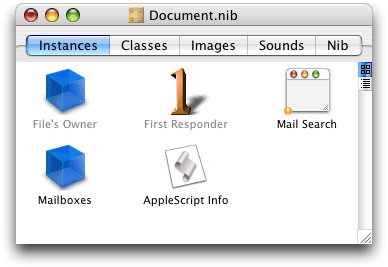

By clicking the small outline view icon on the right-hand side of the view, you can display contents of the window in outline view, as shown in Figure 8-12.

__Figure 8-12__  The Document.nib window in outline view

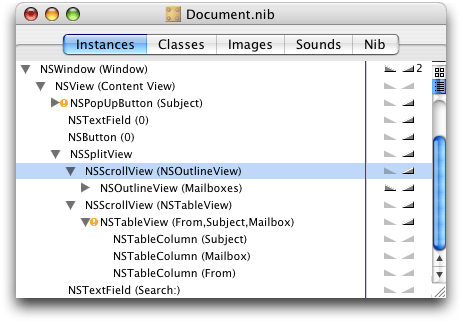

In this case, the window shows the expanded hierarchy for the search window. Instead of interface objects (such as buttons), it shows the Cocoa classes for the objects (NSButton). You can view the hierarchy for any object in the nib window. Double-clicking an object (such as NSOutlineView (Mailboxes)) in the Instances tab selects the object in its window, providing a simple way to select a nested item such as an outline view within a scroller within a split view. If the Info window is open, it also displays the object in the Info window.

To examine the connections for an object, you click the small triangles next to it in the right-hand column. For example, Figure 8-13 shows the connections for the NSOutlineView object (the mailboxes outline view).

__Figure 8-13__  Connections for the NSOutlineView object

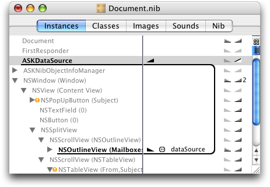

Mail Search uses a table view to display the messages found by a search. The table includes columns for the message sender, the message subject, and the message mailbox. The table view needs to be connected to a data source object that provides row data to the table view.

To create a data source object and connect it to the table view in the search window, perform the same series of steps you used to connect a data source to the outline view in [Provide a Data Source Object for the Mailboxes View](#apple-f4xwc4dqnrsv64tfmyxwi33df52wszbpgiydambrgi2tmlkcineuoqshinca). Assuming you still have the search window from the `Document.nib` file open in Interface Builder, along with the Info window, the steps include:

1. Drag a data source object from the AppleScript pane in the Palette window to the Document.nib window.
2. Change the name of the data source object from “ASKDataSource” to “Messages”.
3. Select the table view in the search window, then press and hold the Control key and drag from the table view to the Messages data source object in the Document.nib window.
4. Double-click the dataSource outlet in the Connections pane of the Info window. to connect the table view to the data source object. The result is shown in Figure 8-14.

   __Figure 8-14__  The Info window for the table view after connecting a data source outlet

   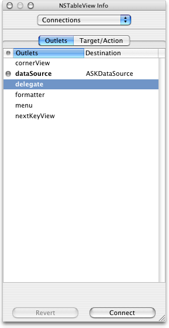
5. You also need to provide an identifier for each column header (the column headers are titled From, Subject, and Mailbox) in the table view. To do so, perform these steps:

   1. With the table view still selected in the search window, click to select the column header.
   2. Choose the Attributes pane in the Info window.
   3. Type the name (either “from,” “subject,” or “mailbox”) in the Identifier text field. Save your results after typing each new identifier. The result for the From column header is shown in Figure 8-15.

      __Figure 8-15__  The Info window after entering a table column identifier

      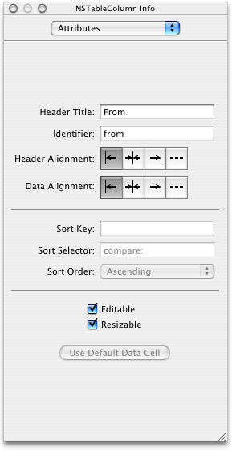
6. As always, save the Document nib file after completing your changes.

You have now completed connecting the interface for the Mail Search application.

[Next](Mail%20Search%20Tutorial-%20Write%20the%20Code.md)[Previous](Mail%20Search%20Tutorial-%20Create%20the%20Interface.md)

