> 导航：[总目录](../../../README.md) · [documentation](../../../_indexes/documentation.md) · [AppleScript Studio Programming Guide](Introduction%20to%20AppleScript%20Studio%20Programming%20Guide.md)

[Next](Mail%20Search%20Tutorial-%20Connect%20the%20Interface.md)[Previous](Mail%20Search%20Tutorial-%20Design%20the%20Application.md)

# Mail Search Tutorial: Create the Interface

Mail Search is a fairly complex AppleScript Studio application that searches for specified text in messages in the Mac OS X Mail application. In this chapter you’ll create an AppleScript Studio project for Mail Search and build the user interface. These tasks are described in the following sections:

1. [Create a Project](#apple-f4xwc4dqnrsv64tfmyxwi33df52wszbpgiydambrgi2tklkukbmferkgge2tg).
2. [Add an Image File to the Project](#apple-f4xwc4dqnrsv64tfmyxwi33df52wszbpgiydambrgi2tklkdjjbeqsscjfdq)
3. [Build the Interface](#apple-f4xwc4dqnrsv64tfmyxwi33df52wszbpgiydambrgi2tklkukbmferkgge2ti).

This chapter assumes you have completed [Mail Search Tutorial: Design the Application](Mail%20Search%20Tutorial-%20Design%20the%20Application.md#apple-f4xwc4dqnrsv64tfmyxwi33df52wszbpgiydambrgi2tilkukbmferkggeydc) the previous Mail Search tutorial chapter.

To create a new AppleScript Studio project for Mail Search, perform these steps:

1. Use Xcode to create a new AppleScript Studio project, as described in [Creating a Hello World Application](About%20AppleScript%20Studio.md#apple-f4xwc4dqnrsv64tfmyxwi33df52wszbpgiydambrgi2dslkukbmferkggezta), but choose the AppleScript Document-based Application for the project template—you use this template for an application that creates and manages multiple documents— and name the project “Mail Search”.
2. Open the groups in the Files list in the Groups & Files list to show their contents, as in Figure 7-1. Each of the items is described in [Default Project Contents](AppleScript%20Studio%20Components.md#apple-f4xwc4dqnrsv64tfmyxwi33df52wszbpgiydambrgi2talkukbmferkgge3di).

   __Figure 7-1__  Default contents of a document-based AppleScript Studio project

   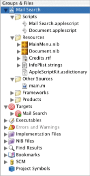
3. `Document.applescript` is the default document script file, which is created as an empty file. Mail Search doesn’t use this file, so select the file and press the Delete key to remove it from the project. You’ll then see the dialog shown in Figure 7-2.

   __Figure 7-2__  Deleting a file from a project

   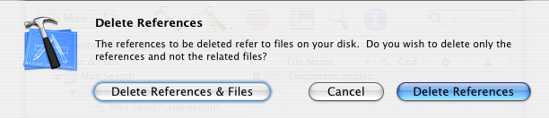

   Click the Delete References & Files button to delete the file on disk, as well as from the project.
4. Select the script file `Application.applescript` and choose Rename from the Project menu. Rename the file `Mail Search.applescript`.

At this point you can build the project and create a working application that can create multiple document windows, expand and minimize them, display an About window, and respond to a number of menu choices. To build and run the application, do one of the following:

- type Command-R
- choose Build and Run from the Build menu
- click the Build and Run button, which is represented by a hammer and green go button

The Mail Search sample project included with AppleScript Studio includes an image of a magnifying glass you’ll need for the search window. Open the folder for the Mail Search sample project and drag the file `find.tiff` to the Files list in the Groups & Files list of your new Mail Search project. You can drag it directly to the Resources group.

You can also add a file to the Mail Search project by choosing Add Files from the Project menu in Xcode, then navigating to the file `find.tiff` in the directory for the Mail Search sample project. Select it and click Open. Whichever approach you choose, you’ll get the dialog shown in Figure 7-3.

__Figure 7-3__  Adding a file to a project

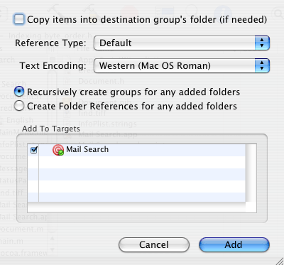

Select the checkbox “Copy items into destination group’s folder (if needed),” then click Add to add the file to your project. If you used the Add Files menu choice, drag the file `find.tiff` into the Resources group in the Groups & Files list.

You’ll build the interface for Mail Search with Interface Builder, a Mac OS X development tool located in `/Developer/Applications`. You should be familiar with Interface Builder from reading about it in [Interface Builder Features for AppleScript Studio](AppleScript%20Studio%20Components.md#apple-f4xwc4dqnrsv64tfmyxwi33df52wszbpgiydambrgi2talkukbmferkggezto), and from completing the [Currency Converter Tutorial](Currency%20Converter%20Tutorial.md#apple-f4xwc4dqnrsv64tfmyxwi33df52wszbpgiydambrgi2tglkukbmferkggeydc). In particular, you should be familiar with the nib files Interface Builder uses to store interface definitions.

Each of the following sections provides instructions for building one of the interface items described in [Design the Interface](Mail%20Search%20Tutorial-%20Design%20the%20Application.md#apple-f4xwc4dqnrsv64tfmyxwi33df52wszbpgiydambrgi2tilkukbmferkgge2te). You’ll start with the simpler items and with nib files that are created automatically as part of the project, then move to more complex interface items that require the creation of new nib files.

As you work through the steps to create Mail Search’s interface, you can build and run the application at any point. You won’t see much difference in the application’s interface until you’ve completed the section [Create the Search Window](#apple-f4xwc4dqnrsv64tfmyxwi33df52wszbpgiydambrgi2tklkukbmferkgge3dq). That’s because except for the menus and the main search window, the interface won’t become visible until after you connect it to event handlers and write the handlers in later sections.

To Build the interface for Mail Search, you’ll work through these steps:

1. [Examine the Default Menus](#apple-f4xwc4dqnrsv64tfmyxwi33df52wszbpgiydambrgi2tklkukbmferkgge2do)
2. [Create the Message Window](#apple-f4xwc4dqnrsv64tfmyxwi33df52wszbpgiydambrgi2tklkukbmferkgge3dg)
3. [Create a Status Dialog](#apple-f4xwc4dqnrsv64tfmyxwi33df52wszbpgiydambrgi2tklkcineuuqsgijda)
4. [Create the Search Window](#apple-f4xwc4dqnrsv64tfmyxwi33df52wszbpgiydambrgi2tklkukbmferkgge3dq)

You won’t make any changes to Mail Search’s menus until [Customize Menus](Mail%20Search%20Tutorial-%20Customize%20the%20Application.md#apple-f4xwc4dqnrsv64tfmyxwi33df52wszbpgiydambrgi2tslkcineusqkgijbq). In this section you’ll examine the menus in Interface Builder. To examine the default menus in a Document-based AppleScript Studio project template, you do the following:

1. Open the Mail Search project in Xcode.
2. Open the `MainMenu.nib` file by double-clicking its icon in the Files list in Xcode’s Groups & Files list, shown in [Figure 7-1](#apple-f4xwc4dqnrsv64tfmyxwi33df52wszbpgiydambrgi2tklkciffemq2cjjfa).

   Interface Builder opens, displaying the four windows shown and described in [Interface Creation](AppleScript%20Studio%20Components.md#apple-f4xwc4dqnrsv64tfmyxwi33df52wszbpgiydambrgi2talkukbmferkgge3dc).

__Figure 7-4__  Interface Builder windows after opening Mail Search’s `MainMenu.nib` file

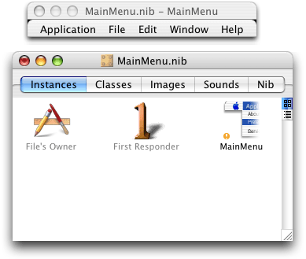

Figure 7-4 shows just the MainMenu.nib window and the application’s menus. The four icons in the Instances pane visible in Figure 7-4 are described in [Interface Creation](AppleScript%20Studio%20Components.md#apple-f4xwc4dqnrsv64tfmyxwi33df52wszbpgiydambrgi2talkukbmferkgge3dc). The File’s Owner instance represents NSApp, a global constant for the application object that serves as the master controller for the application. You’ll use this instance in [Connect the Application Object](Mail%20Search%20Tutorial-%20Connect%20the%20Interface.md#apple-f4xwc4dqnrsv64tfmyxwi33df52wszbpgiydambrgi2tmlkukbmferkgge4de).

At this point, you can use any of Interface Builder’s capabilities for creating and modifying menus, such as adding or deleting menus or menu items. You don’t need to do anything now to change the default menus. But in [Customize Menus](Mail%20Search%20Tutorial-%20Customize%20the%20Application.md#apple-f4xwc4dqnrsv64tfmyxwi33df52wszbpgiydambrgi2tslkcineusqkgijbq), you’ll find steps for changing menu and menu item names so that they match the menus shown in [Figure 6-4](Mail%20Search%20Tutorial-%20Design%20the%20Application.md#apple-f4xwc4dqnrsv64tfmyxwi33df52wszbpgiydambrgi2tilkcineueqsgjfcq). When you are finished looking at the menus, close the nib file window; otherwise, you’ll end up with a lot of open nib windows as you work through the tutorial.

[Figure 6-5](Mail%20Search%20Tutorial-%20Design%20the%20Application.md#apple-f4xwc4dqnrsv64tfmyxwi33df52wszbpgiydambrgi2tilkcineugsseinaq) shows the design for a Mail Search message window as it appears in Interface Builder. The message window is a simple window with one main view and no special features. To create the message window, you need to:

1. Create a new nib file.
2. Add a window instance to the nib file.
3. Add interface objects (in this case, a single text view object, enclosed within a scroll view) to the window.

These steps are described in the following sections.

To create a new nib file, perform these steps:

1. Open the Mail Search project in Xcode.
2. Double-click one of the nib file icons (such as `MainMenu.nib`) in the Files list in the Groups & Files list to start Interface Builder.
3. In Interface Builder, choose New from the File menu. Interface Builder opens the dialog shown in Figure 7-5.

   __Figure 7-5__  Creating a new nib file in Interface Builder

   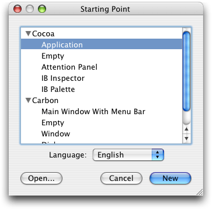
4. Select Empty in the Cocoa section and click New. The new nib file is shown in Figure 7-6. The icons in the Instances pane visible in Figure 7-6 are described in [Interface Creation](AppleScript%20Studio%20Components.md#apple-f4xwc4dqnrsv64tfmyxwi33df52wszbpgiydambrgi2talkukbmferkgge3dc).

   __Figure 7-6__  A new nib file in Interface Builder

   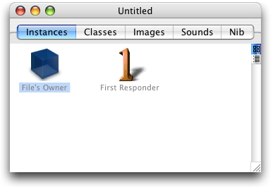
5. Choose Save As from the File menu and navigate to the `English.lproj` directory in your Mail Search project. Save the file as `Message.nib` (you just type “Message” and Interface Builder adds the extension). You will be prompted for a nib file format. Your three choices are:

   - Pre-10.2 format: Use this if you want your application to run in Mac OS X versions earlier than 10.2.
   - 10.2 and later format: Use this if you want your application to run in Mac OS X version 10.2 and later.
   - Both formats: Use this if you want to run your application in all versions of Mac OS X.

   Select the option for 10.2 and later.
6. After saving the file, you should be prompted to add the file directly to the Mail Search project. Click Add to add the nib file to the project.

   If for any reason you don’t have the opportunity to automatically add the new nib file to the Mail Search project, you can add it directly by opening the project in Xcode, and dragging it into the Resources group in the Groups & Files list, which is shown in [Figure 7-1](#apple-f4xwc4dqnrsv64tfmyxwi33df52wszbpgiydambrgi2tklkciffemq2cjjfa), or by choosing Add Files from the Project menu, navigating to the `Message.nib` file, and choosing that file. If you use Add Files, you should then drag the icon for the nib file to the Resources group.

To add a message window to the nib file, perform these steps:

1. In Interface Builder, click the Cocoa Windows button in the Palette window toolbar. The Palette window, showing the Cocoa Windows palette, is shown in Figure 7-7.

   __Figure 7-7__  The Cocoa-Windows palette of Interface Builder’s Palette window

   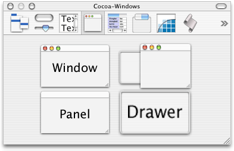
2. Drag an instance of Window from the Palette window to any convenient space on your desktop. You’ll see a window that looks similar to the image you dragged from the Palette window. You’ll also see an icon for the window added to the Message.nib window, as shown in Figure 7-8.

   __Figure 7-8__  The Message.nib window, showing a window instance

   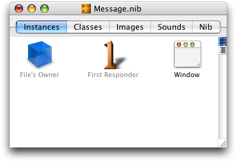
3. Double-click the word “Window” in the window instance in the nib window and type “Message” to change the instance name.
4. You need to provide an AppleScript name for the window too, so you can access it in scripts. To do so, click in the nib window to select the Message window instance, then choose Show Info from the Tools menu or type Command-Shift-I to open the Info window. Use the pop-up menu at the top of the window to display the AppleScript pane. The result is shown in Figure 7-9.

   __Figure 7-9__  The AppleScript pane in the Info window for a window object

   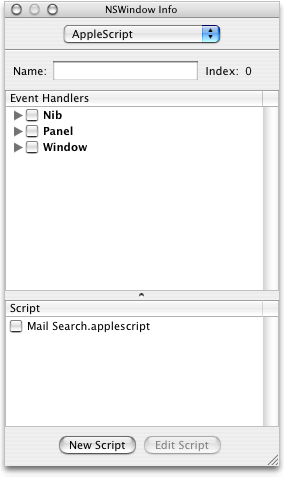

   To name the window, simply type “message” in the Name field. Remember that this is the object’s AppleScript name, which you can use in a script to identify the object. It is a different entity than the name of the window object in the nib window, and is also different from the window’s title in the running application.

   If it makes sense, you can use the same AppleScript name for objects of different types in the same window (such as a button and a text field), or for objects of the same type (such as buttons) in different windows. However, if you name two buttons in the same window “button,” you won’t be able to differentiate between them by name in an application script.

   __Figure 7-10__  The Message.nib window showing an AppleScript Info object (not selected)

   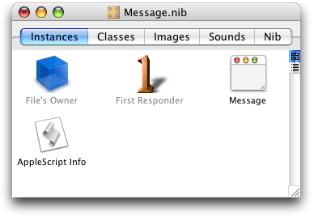
5. Save the changes to the `Message.nib` file. You should save changes periodically as you work through this tutorial.

   When you are finished with a nib file, you should also close its window to avoid a clutter of nib-related windows as you work through the tutorial.

To set up interface objects in the message window (in this case, there is just one object, a text view), perform these steps:

1. Click the Cocoa Text Views button in the Palette window toolbar. The Cocoa-Text palette is shown in Figure 7-11.

   __Figure 7-11__  The Cocoa-Text palette of Interface Builder’s Palette window

   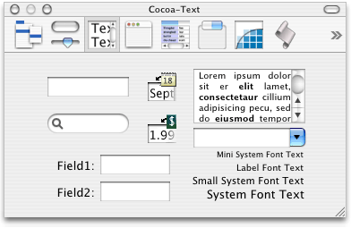
2. Drag a text view object (the item containing Latin text and one scroll bar) from the Palette window to the message window you created previously. Drag it to the top-left corner of the window (below the title bar). Interface Builder provides feedback to aid in alignment and resizing, as shown in Figure 7-12. The text view is actually enclosed within a scroll view with one scroll bar.

   __Figure 7-12__  Positioning a text view object

   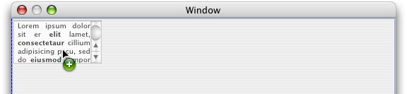
3. Drag the bottom-right corner of the text view object to resize it until it fills the whole window. Again, you get resizing feedback from Interface Builder. The result is shown in Figure 7-13. The small dots below the title bar and just inside the other sides of the window indicate that the text view is still selected.

   __Figure 7-13__  The finished message window

   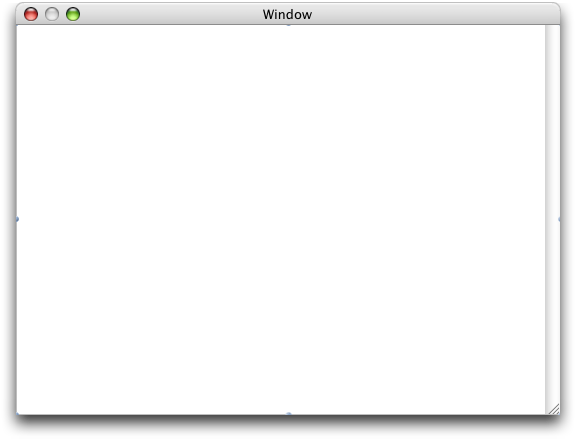
4. To provide an AppleScript name for the text view, open the Info window and display the AppleScript pane. The result is similar to [Figure 7-9](#apple-f4xwc4dqnrsv64tfmyxwi33df52wszbpgiydambrgi2tklkcineuorsijfdq). Type “message” in the Name field.
5. To support Undo in the text view, you’ll have to modify its default attributes. While the Info window is still open, use the pop-up menu at the top of the window (or type Command-1) to display the Attributes pane.
6. In the Options section, select the “Undo allowed” checkbox. The result is shown in Figure 7-14.

   __Figure 7-14__  Attributes pane in Info window for text vie

   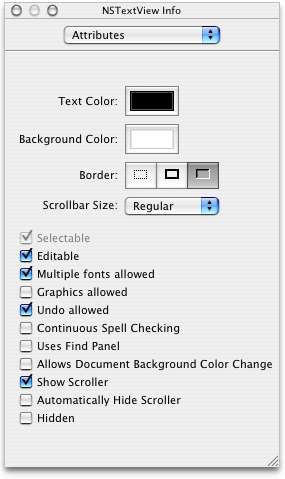
7. As always, save the nib file after completing your changes.

Figure 7-15 shows a status dialog as it appears in Interface Builder. Mail Search displays the status dialog as a sheet on the search window during lengthy operations. The status dialog contains a progress bar and an invisible text field in which Mail Search can write status messages.

To create the status dialog, you’ll perform steps very similar to those in [Create the Message Window](#apple-f4xwc4dqnrsv64tfmyxwi33df52wszbpgiydambrgi2tklkukbmferkgge3dg). You need to:

1. Create a new nib file. This process is described in [Create a Nib File](#apple-f4xwc4dqnrsv64tfmyxwi33df52wszbpgiydambrgi2tklkukbmferkgge3di).

   In this case, name the nib file `StatusPanel.nib`.
2. Use the same process described in [Add the Message Window to the Nib File](#apple-f4xwc4dqnrsv64tfmyxwi33df52wszbpgiydambrgi2tklkukbmferkgge3dk) to add a window instance to the nib, but with these differences:

   1. drag an instance of the user interface object labeled “Panel” from the Cocoa-Windows palette, rather than the one labeled “Window”
   2. name the instance “Status”
   3. type “status” in the Name field in the AppleScript pane of the Info window for the instance
3. Adjust its size and attributes for the status dialog.
4. Set up a progress bar in the window.
5. Set up a text field to display progress text.

Steps 3, 4, and 5 are described in the following sections.

You need to change certain window attributes to use the window as a pane. You also need to reduce the size of the status dialog so that it looks appropriate when it appears below the title bar of the search window. The previously designed status dialog, shown again in Figure 7-15, is smaller than the minimum size for a default window in Interface Builder, so you have to adjust the minimum size.

__Figure 7-15__  The status dialog as previously designed

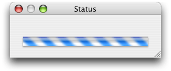

To make these changes, perform the following steps:

1. Select the Status window instance in the StatusPanel.nib window, then display the Attributes pane in the Info window.
2. In the Window Title field, change the title from Panel to Status. The result is shown in Figure 7-16.

   __Figure 7-16__  The revised Attributes pane in the Info window for the status dialog

   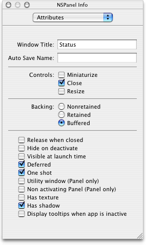
3. With the Info window still open, use the pop-up menu at the top of the window to display the Size pane. The result is shown in Figure 7-17.

   __Figure 7-17__  The Size pane in the Info window for the status dialog

   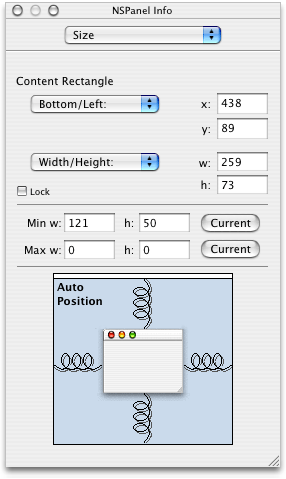
4. In the Min Size section, type 110 for the width and 50 for the height. (These values just have to be at least as small as the values you’ll enter in the next step.)
5. In the Content Rect section, type 260 for the width and 75 for the height. The resized status dialog that results from these changes is shown in Figure 7-18.

   __Figure 7-18__  The resized status dialog

   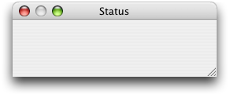

To set up a progress bar in the status dialog, do the following:

1. Click the Controls button in the Palette window toolbar. The Cocoa-Controls palette is shown in Figure 7-19.

   __Figure 7-19__  The Cocoa-Controls palette of Interface Builder’s Palette window

   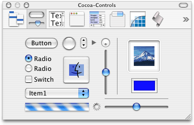
2. Drag a progress bar object (the horizontal striped cylinder near the bottom of the window) from the Palette window to the status dialog you just created and position it as shown in Figure 7-20.

   __Figure 7-20__  Positioning the progress bar

   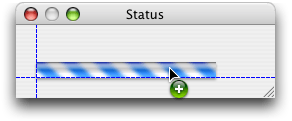
3. Select the progress bar, then grab the lower-right corner and resize it. Use Interface Builder’s feedback to help you resize the progress bar, as shown in Figure 7-21.

   __Figure 7-21__  Resizing the progress bar

   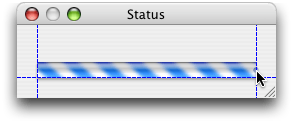
4. You need to provide an AppleScript name for the progress bar so you can access it in scripts. To do so, select the progress bar, then open the Info window to the AppleScript pane. The result is similar to [Figure 7-9](#apple-f4xwc4dqnrsv64tfmyxwi33df52wszbpgiydambrgi2tklkcineuorsijfdq).

   To name the progress bar, simply type “progress” in the Name field.

To set up a text field to display progress text in the status dialog, do the following:

1. Drag a text field object (a rectangular, unlabeled field with a white background) from the Cocoa-Text palette (shown in [Figure 5-10](Currency%20Converter%20Tutorial.md#apple-f4xwc4dqnrsv64tfmyxwi33df52wszbpgiydambrgi2tglkukbmferkggiyds)) in the Palette window to the status dialog. Position the text field above the progress bar you added in a previous step. Use Interface Builder’s feedback to help you align the left side of the text field with the progress bar and just above it, as shown in Figure 7-22.

   __Figure 7-22__  Positioning a status text field above the progress bar

   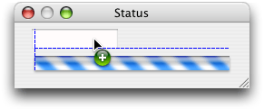
2. Select the text field, then grab the middle selection handle on the right and resize the field, as shown in Figure 7-23.

   __Figure 7-23__  Resizing the status text field

   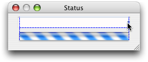
3. You don’t want a user to enter text in the text field and you do want the field (though not the status messages that get written to it) to be invisible. To choose the correct settings, select the text field and open the Info window to the Attributes pane. The result is shown in Figure 7-24.

   __Figure 7-24__  The Attributes pane in the Info window for the text field

   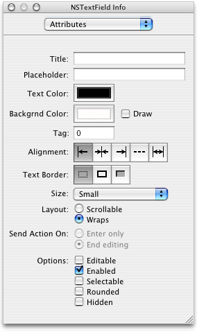

   Now make these adjustments, in the order shown:

   1. Deselect the Editable checkbox.
   2. Deselect the Selectable checkbox.
   3. Select the Small option in the Size pop-up menu.
   4. In the Border section, click the button on the left to select no border.
   5. In the Backgrnd Color section, deselect the Draw checkbox.
   6. In the Layout section, select the Wraps radio button. The resulting invisible text field is shown in Figure 7-25.

   __Figure 7-25__  The invisible status text field

   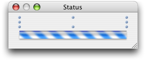
4. You need to provide an AppleScript name for the text field so you can access it in scripts. To do so, display the AppleScript pane in the Info window, then type “statusmessage” in the Name field.
5. Save all the changes to the `StatusPanel.nib` file.

Now that you’ve used Interface Builder to create and modify several relatively simple nibs, you’ll get a chance to work with a more interesting and challenging example, the nib for Mail Search’s search window. [Figure 6-2](Mail%20Search%20Tutorial-%20Design%20the%20Application.md#apple-f4xwc4dqnrsv64tfmyxwi33df52wszbpgiydambrgi2tilkcineuur2hinea) shows the design for the search window. To put together a nib that implements that window requires the following steps:

1. Open the nib file `Document.nib`.

   The steps for opening a nib file are listed in [Examine the Default Menus](#apple-f4xwc4dqnrsv64tfmyxwi33df52wszbpgiydambrgi2tklkukbmferkgge2do).
2. Rename the default window instance in the nib window.

   Double-click the instance name “Window” and type “Mail Search” as the new name. The Mail Search search window is a little larger than the default window size (with a width of about 525 and a height of about 440). You can resize with the same steps you used in [Adjust the Size and Attributes of the Status Dialog](#apple-f4xwc4dqnrsv64tfmyxwi33df52wszbpgiydambrgi2tklkcineuursgivdq), though in this case you won’t need to reset the minimum size for the window. The resulting window is shown in Figure 7-26.

   __Figure 7-26__  The resized, empty search window

   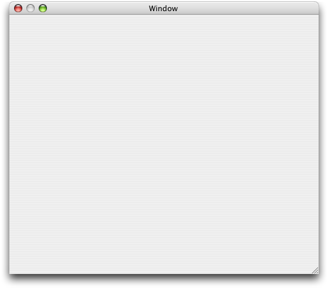

   You should also follow the same steps you used in [Add the Message Window to the Nib File](#apple-f4xwc4dqnrsv64tfmyxwi33df52wszbpgiydambrgi2tklkukbmferkgge3dk) to display the AppleScript pane in the Info window, then type “mail search” in the Name field to supply an AppleScript name for the window.
3. Set up a popup button for the search type.
4. Set up a text field for the search text.
5. Set up a button to initiate searches.
6. Set up an outline view to display the available mailboxes.
7. Set up a table view to display matching messages.
8. Group the outline and table views in a split view.

Steps 3 through 8 are described in the following sections.

Once you’ve completed these steps, you can build the application, view the search window, and perform operations such as opening the pop-up menu, resizing the table and outline views, and rearranging the columns in the search result table. You can also build the application periodically to view the search window at various stages of completion. However, you won’t be able to do any searching until you connect scripts to the user interface in later sections. To build and run the application, open the project in Xcode and type Command-R, choose Build and Run from the Build menu, or click the Build and Run button.

Mail Search uses a popup button to provide a pop-up menu of search locations (in the To, From, or Subject fields of messages or in the message contents). To set up a popup button in the search window (the Mail Search window instance in the Document nib), perform these steps:

1. With the search window still open as shown in Figure 7-26, drag a popup button from the Cocoa-Controls palette in the Palette window (shown in [Figure 7-19](#apple-f4xwc4dqnrsv64tfmyxwi33df52wszbpgiydambrgi2tklkukbmferkgge3ta)) to the search window. Use the automatic feedback to position the button in the top left corner of the window. As the button nears the corner, Interface Builder provides dashed feedback lines to help align the object according to the Aqua guidelines, as shown in Figure 7-27.

   __Figure 7-27__  Positioning a popup button in the search window

   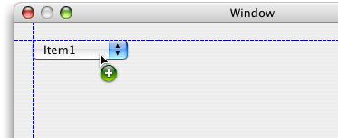
2. You need to provide menu items in the popup button for the possible search locations: Contents, Subject, To, and From. Double-click the button to reveal its default contents, as shown in Figure 7-28.

   __Figure 7-28__  The default contents of a popup button

   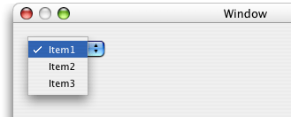
3. To add a fourth item, simply choose Copy from the Edit menu (copying the selected Item1) and then Paste from the Edit menu. The result is shown in Figure 7-29.

   __Figure 7-29__  A popup button with a new item

   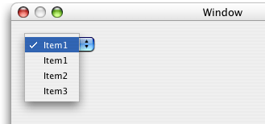
4. To rename the first item, double-click it, type “Contents” as the new text, then tab to the next field. The result is shown in Figure 7-30.

   __Figure 7-30__  A renamed popup button item

   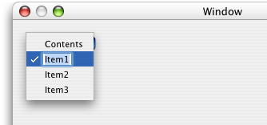
5. Rename the remaining three items as Subject, To, and From. Figure 7-31 shows the renamed items.

   __Figure 7-31__  Popup button with renamed items

   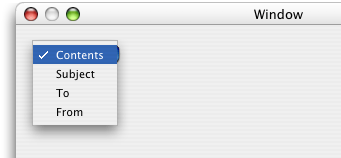
6. Open the Info window for the popup button to the Attributes pane and select the Small checkbox in the Options section. The result is shown in Figure 7-32.

   __Figure 7-32__  The popup button after checking the Small checkbox

   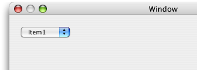
7. Adjust the size of the button so that it is just large enough for the item with the longest name, Contents. To do so, select the popup button, then drag the middle selection handle on the right side. As you resize, Interface Builder again provides alignment guides, as shown in Figure 7-33.

   __Figure 7-33__  Resizing the popup button

   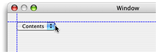
8. You should also follow the same steps you used in [Set Up a Progress Bar](#apple-f4xwc4dqnrsv64tfmyxwi33df52wszbpgiydambrgi2tklkcineuqrkijfeq) to display the AppleScript pane in the Info window, then type “where” in the Name field to supply an AppleScript name for the popup button.

Mail Search uses a text field to allow a user to provide text to search for. To set up a text field in the search window, perform these steps:

1. Drag a text field from the Cocoa-Text palette in the Palette window to the search window. Use the automatic feedback to position the field in the top left corner of the window next to the previously placed popup button, as shown in Figure 7-34.

   __Figure 7-34__  Positioning a text field in the search window

   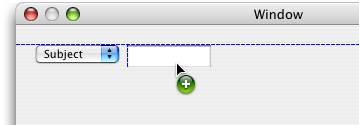
2. To resize the text field, select it, then grab the middle selection handle on the right. Stretch the text field across the window, leaving room on the right for the find button. The result is shown in Figure 7-35

   __Figure 7-35__  Resized text field in the search window

   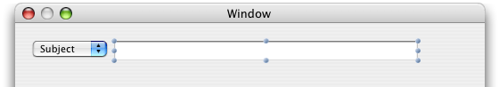
3. While the text field is still selected, open the Info window to the Attributes pane. In the Send Action On section, click the radio button for Enter only. With this setting, the Mail Search application begins searching if a user types search text and presses the Return or Enter keys, in addition to when a user clicks the find button. The keystrokes only initiate a search when the text field has the focus. (See [Setting the Keyboard Focus](AppleScript%20Studio%20Cookbook.md#apple-f4xwc4dqnrsv64tfmyxwi33df52wszbpgiydambrgi2telkcijbuerciizea) for related information.)
4. In the same window, select the Small option in the Size pop-up menu, as you did previously for the popup button.
5. While you still have the Info window open for the text field, display the AppleScript pane, then type “what” in the Name field to supply an AppleScript name for the text field.

Mail Search uses a button to initiate a search. To set up a button in the search window, perform these steps:

1. Drag a round button from the Cocoa-Controls palette in the Palette window to the search window. Use the automatic feedback to position the button in the top right corner of the window next to the previously placed text field, as shown in Figure 7-36.

   __Figure 7-36__  Positioning a button in the search window

   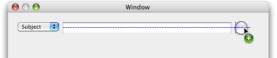
2. Open the Info window for the button, display the AppleScript pane, then type “find” in the Name field to supply an AppleScript name for the button.
3. In [Create a Project](#apple-f4xwc4dqnrsv64tfmyxwi33df52wszbpgiydambrgi2tklkukbmferkgge2tg), you added an image file named `find.tiff` to the Mail Search project. That image file contains an image of a magnifying glass that you will now add to the button. With the Info window still open from the previous step, display the Attributes pane, then type “find” (the name of the image file, without the extension) into the “Icon:” field, as shown in Figure 7-37.

   __Figure 7-37__  The Info window for the find button

   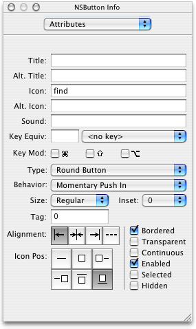

   Alternatively, you can simply drag the image from the Images pane in the nib window to the find button.

   To center the icon, click the middle button in the top row under “Icon Position” in the Info window shown in Figure 7-37. The result is shown in Figure 7-38.

   __Figure 7-38__  The button and magnifying glass

   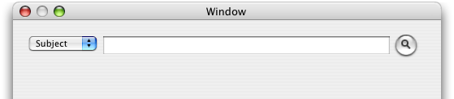
4. You have a couple of options for correctly positioning the button in relation to the right side of the window. You can drag the button to the right and use Interface Builder’s alignment guides to align it with the edge of the window, then expand the text field toward the button until it is also aligned. Or you can resize the window itself, moving the right edge toward the button, again using Interface Builder’s alignment guides to align the window edge. Figure 7-39 shows the latter process.

   __Figure 7-39__  Aligning the right edge of the window with the button

   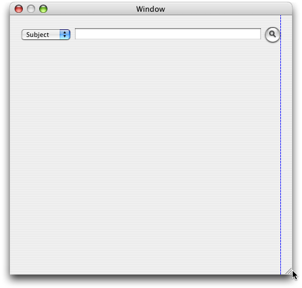

Mail Search uses an outline view to show the Mail folders that can be searched. It can be difficult to determine in Interface Builder whether you have selected an outline view or the scroll view that contains it. Single-clicking selects the containing scroll view, while double-clicking selects the outline view. The tutorial steps that follow describe visual cues to determine which view is selected.

To be certain whether an outline view or the containing scroll view is selected, you can also open an Info window to the AppleScript pane. When that pane is displayed, the window title for the Info window shows the class of the selected item: either NSScrollView if the scroll view is selected, or NSOutlineView if the outline view is selected (or NSTableView when a table view is selected).

As a final alternative, you can display the objects in a nib window in outline view (as described in [Examining an Object Hierarchy in the Nib View](Mail%20Search%20Tutorial-%20Connect%20the%20Interface.md#apple-f4xwc4dqnrsv64tfmyxwi33df52wszbpgiydambrgi2tmlkcineugq2ji5fa)), find the object (either an outline view, a scroll view, or any other object) in the view hierarchy, and double-click the object to select it in its window and to display it in the Info window.

To set up an outline view in the search window, perform these steps:

1. Drag an outline view from the Cocoa-Data palette in the Palette window to the search window. The outline view is in the upper-left corner with “Name” and “Description” columns.

   Use the automatic feedback to position the outline view in the top left corner of the search window, below the previously placed popup button. Align it with the left side of the window, as shown in Figure 7-40.

   When you release the outline view, it takes on a more generic format, as shown (after resizing) in Figure 7-41.

   __Figure 7-40__  Inserting an outline view in the search window

   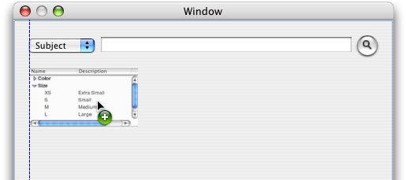
2. To resize the outline view, click to select it, then drag the lower-right corner. The text field should stretch all the way across the window and about half the way down (leaving room for a table view to display the search results), as shown in Figure 7-41.

   __Figure 7-41__  Resizing the outline view in the search window

   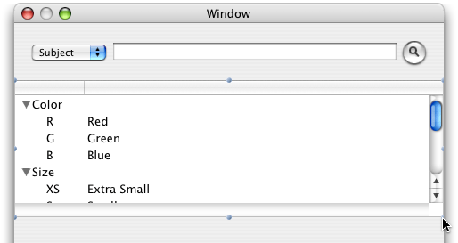
3. By default, a new outline view has two columns, but you only need one column to display mailboxes. To change the number of columns, double-click the outline view. The result is shown in Figure 7-42.

   __Figure 7-42__  A selected outline view

   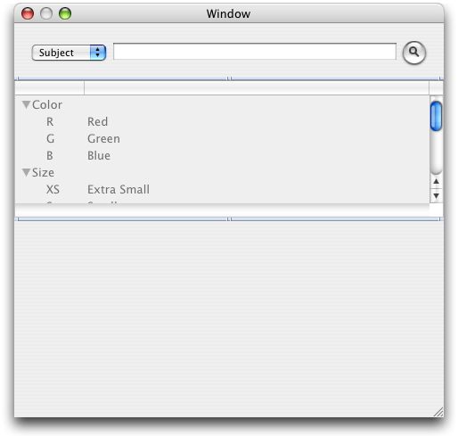

   Now open the Info window to the Attributes pane. The result is shown in Figure 7-43. Make the following changes to the default settings:

   1. In the Allow section, select the Multiple Selection checkbox.
   2. In the Display section, deselect Horizontal Scroller.
   3. In the Options section, select the “Autoresizes Columns to fit” checkbox; deselect the Allows Reordering checkbox.
   4. Set the row height to 14.
   5. Set the number of columns to 1.

   __Figure 7-43__  The Info window for the outline view, after changes

   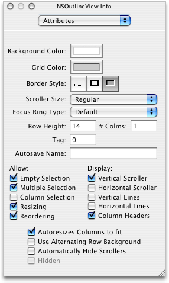
4. While you still have the Info window open for the outline view, display the AppleScript pane, then type “mailboxes” in the Name field to supply an AppleScript name for the outline view.
5. To add a column title to the outline view, double-click the view to select it, then double-click the title row at the top. You can then type “Mailboxes” for the column title. The result is shown in Figure 7-44.

   __Figure 7-44__  The outline view after naming the Mailboxes column

   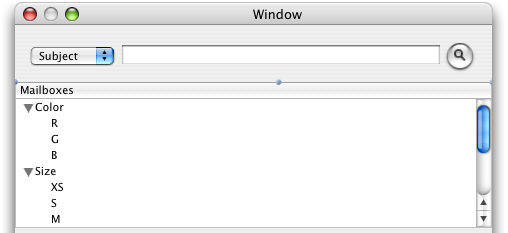
6. Mail Search also requires an AppleScript name for the scroll view that contains the outline view. To provide this name, single-click the outline view, open the Info window (for the scroll view) to the AppleScript pane, then type “mailboxes” in the Name field. The result is shown in Figure 7-45.

   __Figure 7-45__  The Info window for the scroll view containing the outline view

   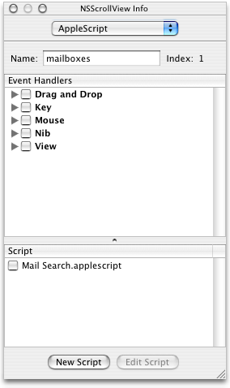
7. If you haven’t saved the Document.nib file recently, do so now.

Mail Search uses a table view to show search results—the messages that contain the search text.

To set up a table view in the search window, perform these steps:

1. Drag a table view from the Cocoa-Data palette in the Palette window to the search window. The table view is in the lower-left corner with “Address” and “Name” columns.

   Use the automatic feedback to position the table view below the previously placed outline view. Align it with the left side of the window, as shown in Figure 7-46.

   When you release the table view, it takes on a more generic format.

   __Figure 7-46__  Inserting a table view in the search window

   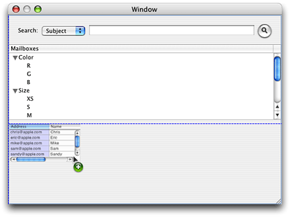
2. To resize the table view, click to select it, then drag the lower-right corner. The text field should stretch all the way across the window and all the way to the bottom.
3. By default, a new table view has two columns, but you need three columns (for From, Subject, and Mailbox). Use the same steps described in [Set Up an Outline View](#apple-f4xwc4dqnrsv64tfmyxwi33df52wszbpgiydambrgi2tklkcineueqkeircq) to open the Info window for the table view. Make the following changes to the default settings:

   1. In the Display section, deselect the Horizontal Scroller checkbox.
   2. In the lower options section, select the “Autoresizes Columns to fit” checkbox.
   3. Set the row height to 14.
   4. Set the number of columns to 3.

      The resulting Info window is shown in Figure 7-47.

      __Figure 7-47__  The Info window for the table view, after changes

      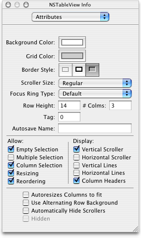
4. While you still have the Info window open for the table view, display the AppleScript pane, then type “messages” in the Name field to supply an AppleScript name for the table view.
5. To resize a column in the table view, double-click the view to select it, then position the cursor over the column divider in the title row. The cursor changes to indicate when you can resize. Simply click and drag to resize a column.

   Start by moving the right-most column divider to the left, which reduces the size of the middle column. Then move the left-most divider to the right, increasing the size of the left column. Adjust the column sizes as needed so that the Subject and Mailbox columns are wider than the From column.
6. To add column titles to the table view, use the same steps described in [Set Up an Outline View](#apple-f4xwc4dqnrsv64tfmyxwi33df52wszbpgiydambrgi2tklkcineueqkeircq). You can tab from column title to column title as you add titles. The result is shown in Figure 7-48.

   __Figure 7-48__  The table view with titles

   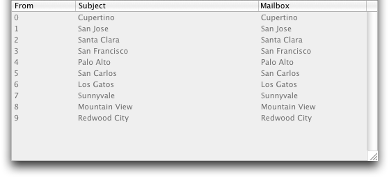
7. Mail Search also requires an AppleScript name for the scroll view that contains the table view. To name the scroll view, follow the same steps you used in [Set Up an Outline View](#apple-f4xwc4dqnrsv64tfmyxwi33df52wszbpgiydambrgi2tklkcineueqkeircq):

   1. Single-click the table view to select the scroll view that contains it.
   2. In the AppleScript pane of the Info window for the scroll view, type “messages” in the Name field.
8. If you haven’t saved the Document.nib file recently, do so now.

Mail Search uses a split view to combine the outline and table views you’ve previously installed. The split view allows a user to adjust the size of either view, depending on how much space they want to devote to the available mailboxes (in the outline view) and how much to the found messages (in the table view).

To group the outline view and table view in a split view, perform these steps:

1. In the search window you have been working on, click to select the table view. The view should have selection handles (small dots) on all sides, and you should see “NSTableView Info” as the title of the Info window. Shift-click to also select the outline view. The outline view should have selection handles and the Info window should display “Multiple Selection” in the Attributes pane.
2. In the Layout menu, choose Split View in the “Make subviews of” submenu to make these two views into subviews of a split view. The result is shown in Figure 7-49. The distinguishing feature of a split view is the handle for modifying the relative sizes of the contained outline and table views.

   __Figure 7-49__  The final search window, now containing a split view

   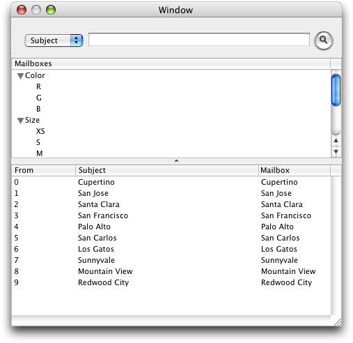
3. Mail Search also requires an AppleScript name for the split view that contains the outline and table views. To name the split view, you follow similar steps to those listed in [Set Up an Outline View](#apple-f4xwc4dqnrsv64tfmyxwi33df52wszbpgiydambrgi2tklkcineueqkeircq):

   1. Single-click to select the split view. You may have to click on another object, then click the split view to select it.
   2. In the AppleScript pane of the Info window for the split view, type “splitter” in the Name field.
4. Congratulations—you’ve completed Mail Search’s user interface. If you haven’t saved recently, do so now.

[Next](Mail%20Search%20Tutorial-%20Connect%20the%20Interface.md)[Previous](Mail%20Search%20Tutorial-%20Design%20the%20Application.md)

