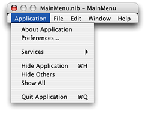
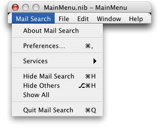
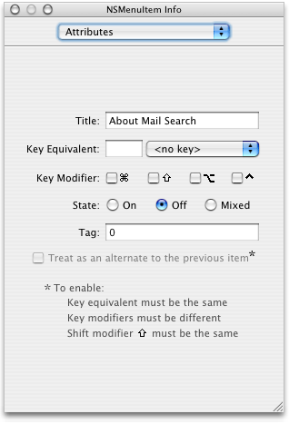
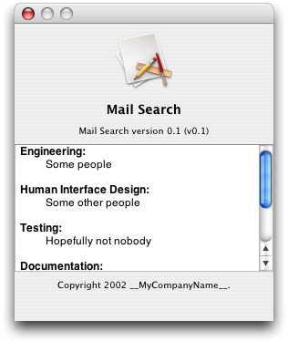
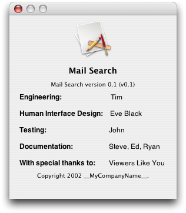
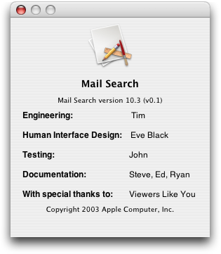
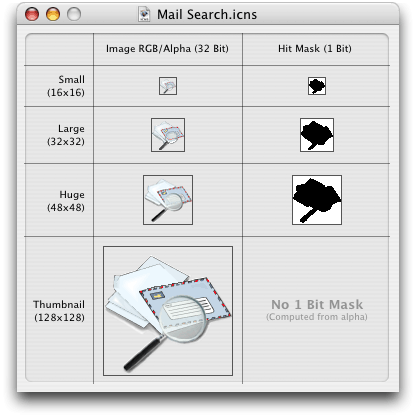
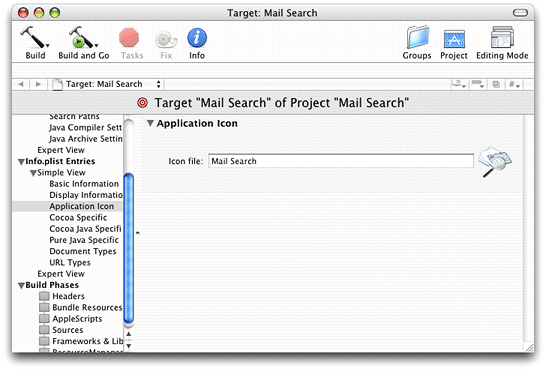
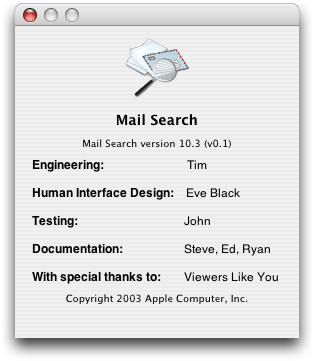
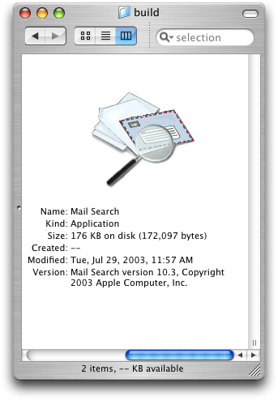

> 导航：[总目录](../../../README.md) · [documentation](../../../_indexes/documentation.md) · [AppleScript Studio Programming Guide](Introduction%20to%20AppleScript%20Studio%20Programming%20Guide.md)


[Next](AppleScript%20Studio%20System%20Requirements%20and%20Version%20Information.md)[Previous](Mail%20Search%20Tutorial-%20Build%20and%20Test%20the%20Application.md)

# Mail Search Tutorial: Customize the Application

In this chapter you’ll customize Mail Search, an AppleScript Studio application that searches for specified text in messages in the Mac OS X Mail application. You’ll learn how to perform basic customization that should be useful for many applications.

To customize the Mail Search application, you’ll perform the steps described in the following sections:

- [Customize Menus](#apple-f4xwc4dqnrsv64tfmyxwi33df52wszbpgiydambrgi2tslkcineusqkgijbq)
- [Customize the About Window](#apple-f4xwc4dqnrsv64tfmyxwi33df52wszbpgiydambrgi2tslkukbmferkggiyds)
- [Customize Version and Copyright Information](#apple-f4xwc4dqnrsv64tfmyxwi33df52wszbpgiydambrgi2tslkukbmferkgge3da)
- [Customize Icons](#apple-f4xwc4dqnrsv64tfmyxwi33df52wszbpgiydambrgi2tslkukbmferkgge3dc)

This chapter assumes you have completed previous Mail Search tutorial chapters.

Figure 11-1 shows the MainMenu instance from Mail Search’s `MainMenu.nib` file as it appears in Interface Builder. The application menu is open, showing the default items in that menu. You’ll need to change the names of certain menu items so that they match the ones specified in [Design the Interface](Mail%20Search%20Tutorial-%20Design%20the%20Application.md#apple-f4xwc4dqnrsv64tfmyxwi33df52wszbpgiydambrgi2tilkukbmferkgge2te).

To customize Mail Search’s menus, perform the steps described in the following sections:

1. Rename the Application menu to Mail Search and add Mail Search to several of its items.
2. Optionally set menu attributes, including key equivalents.
3. Optionally remove menus and menu items.

To rename Mail Search menus and menu items, perform the following steps:

1. Open the project in Xcode.
2. Open the Resources group in the Files list in the Groups & Files list.
3. Double-click the icon for the file `MainMenu.nib` to open the file in Interface Builder. That should automatically open the MainMenu instance, but if not, double-click it in the Instances pane.
4. Click the Application menu in the menu bar. The result should look similar to Figure 11-1.

   __Figure 11-1__  Mail Search’s menu nib in Interface Builder, showing the application menu

   
5. Double-click the About Application menu item and replace Application with Mail Search.
6. Do the same for the Hide Application and Quit Application menu items. You can tab between menu items.
7. Double-click the Application item in the menu bar and change it to Mail Search. If you open the menu again, it should now look similar to Figure 11-2

__Figure 11-2__  The revised Mail Search application menu



Mail Search doesn’t currently supply any menu items beyond the default items that come with any AppleScript Studio document-based project. However, you may choose to modify Mail Search’s menus by adding keystroke equivalents (including modifier keys) and setting the initial checked state. To do so, perform the following steps:

1. Open the `MainMenu.nib` file as described in [Rename Menus and Menu Items](#apple-f4xwc4dqnrsv64tfmyxwi33df52wszbpgiydambrgi2tslkcineumr2gjbba).
2. Click a menu in the menu bar (in this case, choose the Mail Search menu). The result is shown in Figure 11-2.
3. Click to select the About Mail Search menu item, then type Command-Shift-I to open the Info window. If necessary, use the pop-up menu to choose the Attributes pane. The result is shown in Figure 11-3

   __Figure 11-3__  The Info window for the About Mail Search menu item

   
4. To specify a key equivalent, you can type any key not used by another Mail Search menu in the Key Equivalent text field. Many keys have standard usages, so avoid overriding those keys.
5. To assign a modifier key or combination, you click to select any of the checkboxes in the Modifiers section. The checkbox on the left represents the Shift key, the middle checkbox the Option key, and the last checkbox the Control key.
6. You use the radio buttons in the State section to specify whether a menu item is initially checked.

As you can see in Figure 11-3, you can also change a menu item’s name in the Attributes pane by typing in the Title field.

You can modify Mail Search’s menus by removing menus or menu items. To do so, perform the following steps:

1. Open the `MainMenu.nib` file in Interface Builder as described in [Rename Menus and Menu Items](#apple-f4xwc4dqnrsv64tfmyxwi33df52wszbpgiydambrgi2tslkcineumr2gjbba)
2. Click the any menu in the menu bar. To delete that whole menu, simply press the Delete key or choose Delete from the Edit menu.
3. To delete a single item from a menu, open the menu as in previous sections, select the item, and press the Delete key.

Don’t delete items from the Edit menu—items such as Cut and Paste are automatically supported when users open a message window in Mail Search.

Customizing Mail Search’s About window requires several simple tasks. A document-based AppleScript Studio project contains a file named `Credits.rtf`, described in [Document-based Application Template](AppleScript%20Studio%20Components.md#apple-f4xwc4dqnrsv64tfmyxwi33df52wszbpgiydambrgi2talkciffemqkbizda). This rich text format file supplies the application description for the default About window. The current default About window is shown in Figure 11-4.

__Figure 11-4__  AppleScript Studio’s default About window



To customize this text, you simply edit the file and supply your own information. You can open the file in Xcode, or in another editor such as TextEdit (distributed with Mac OS X). Figure 11-5 shows the About window after modifying the `Credits.rtf` file.

__Figure 11-5__  The About window after modifying the application description



You’ll make changes in later sections that will further customize the About window:

- When you add customized information in [Customize Version and Copyright Information](#apple-f4xwc4dqnrsv64tfmyxwi33df52wszbpgiydambrgi2tslkukbmferkgge3da), the application name, version string, and copyright information are displayed in the About window.
- When you add a custom icon in [Customize Icons](#apple-f4xwc4dqnrsv64tfmyxwi33df52wszbpgiydambrgi2tslkukbmferkgge3dc), the icon is displayed in the About window.

An _information property list_ is a special property list that contains predefined keys for application information that may be used by the Finder, by other applications, and by the application itself. The file `InfoPlist.strings` is a property list that contains application information that can be displayed to the user in several places, including:

- in Mail Search’s About window
- an Info window in the Finder
- by other applications that look for the information, such as the Apple System Profiler application (located in `/Applications/Utilities`)

Listing 11-1 shows the default `InfoPlist.strings` file for an AppleScript Studio application. “Application” would reflect your product’s name.

__Listing 11-1__  The default InfoPlist.strings file from an AppleScript Studio application

```
/* Localized versions of Info.plist keys */

CFBundleName = "Application";
CFBundleShortVersionString = "Application version 0.1";
CFBundleGetInfoString = "Application version 0.1, Copyright 2003 __MyCompanyName__.";
NSHumanReadableCopyright = "Copyright 2003 __MyCompanyName__.";
```

The string associated with the `CFBundleName` key appears as the application name in the default About window shown in Figure 11-4. The string associated with the `CFBundleShortVersionString` key appears as the application version number, below the application name, and the string associated with `NSHumanReadableCopyright` appears as the application copyright, below the application description (described in [Customize the About Window](#apple-f4xwc4dqnrsv64tfmyxwi33df52wszbpgiydambrgi2tslkukbmferkggiyds)).

To customize version and copyright information, you simply edit the `InfoPlist.strings` file in Xcode and insert the information you want to display. Figure 11-6 shows the About window after modifying the version and copyright information.

__Figure 11-6__  The About window after modifying version and copyright information



Mac OS X supports the display of very large icons for the desktop, the Dock, and in various other locations. The Finder uses a high-quality scaling algorithm to generate the variable-sized icons it needs. To help ensure a pleasing result, applications should provide at least a thumbnail icon (a large, 128 x 128 image) as part of an `'icns'` resource (stored in an icon resource file with the extension “.icns”).

The Mail Search sample application provides customized icons in the file `Mail Search.icns`. Figure 11-7 shows this file as displayed by the Icon Composer application (which is located in `/Developer/Applications/Utilities/`).

__Figure 11-7__  Mail Search’s icons displayed in Icon Composer



To add custom icons to the Mail Search tutorial application requires the following steps:

1. Create the icon art.
2. Populate an icon resource file with the required icons (Figure 11-7 shows the contents of a fully-populated Icon Composer icon resource template).
3. Add the icon resource file to the Mail Search application.
4. Register a unique creator code for the application so that the Finder can display the correct icons for the application

The first two steps are not included here, but are described in other documentation. For example, _Learning Cocoa_ by O’Reilly & Associates describes how to create a simple icon resource file with Icon Composer. For this tutorial, you can use the icon resource file provided by the Mail Search sample application.

Steps 3 and 4 are described in the following sections.

To add an icon resource file to the Mail Search tutorial project, perform these steps:

1. Open the Mail Search project in Xcode.
2. The Mail Search sample project included with AppleScript Studio includes an icon resource file that contains customized icons. Open the folder for the Mail Search sample project and drag the file `Mail Search.icns` to the Files list in the Groups & Files list of the Mail Search project. You can insert it directly in the Resources group.

   You can also add this file to the Mail Search project by choosing Add Files from the Project menu in Xcode, as described in [Create a Project](Mail%20Search%20Tutorial-%20Create%20the%20Interface.md#apple-f4xwc4dqnrsv64tfmyxwi33df52wszbpgiydambrgi2tklkukbmferkgge2tg). In either case, you’ll get the dialog shown in Figure 11-8.

   __Figure 11-8__  Adding a file to a project

   

   Select “Copy items into destination group’s folder (if needed),” then click Add to add the file to your project. If you used the Add Files menu choice, drag the file `Mail Search.icns` into the Resources group in the Groups & Files list.
3. Double-click the Mail Search target in Xcode’s Targets group to open a window for the target. Use the disclosure triangles in the column view on the left to display Simple View within the Info.plist Entries section. Then click the Application Icon entry. The result is shown in Figure 11-9.

   __Figure 11-9__  The Icon field in a target window for the Mail Search target

   
4. Type the name of the file “Mail Search” into the Icon file text field. Note you do not add the `.icns` suffix.
5. Build and run the Mail Search application. The new About window, now including the Mail Search icon, is shown in Figure 11-10.

   __Figure 11-10__  The About window after customizing icons

   
6. You may need to quit Xcode and restart the Finder to make sure the Finder recognizes the new icons.

Figure 11-11 shows the Mail Search icon in the Finder, at maximum resolution. Note the version string you added earlier shows up now in the Finder.

__Figure 11-11__  The Mail Search icon in the Finder



You should make sure your application has a unique creator code (or signature). The creator code identifies the application to the Finder so that it can display the correct icons for the application. If you create an AppleScript Studio application to distribute commercially, you should register your creator code with Apple Developer Technical Support, which keeps a database of creator codes to avoid conflict between applications.

Creator codes consisting entirely of lower case letters are reserved for Apple, so use at least one upper case letter in your code. You can make sure your creator code is unique (and also register it) at the following site:

[http://developer.apple.com/datatype/](https://developer.apple.com/datatype/)

In [Figure 11-9](#apple-f4xwc4dqnrsv64tfmyxwi33df52wszbpgiydambrgi2tslkciffeiqkki5fa), the Applications Settings pane shows the application type (APPL, or application) and signature (????, the default value supplied by Xcode). If you look at the same pane for the Mail Search sample project, you will see that it has the creator code “wats”.

To add your unique, four-character creator code, type it in the Signature field on the Application Settings pane.

[Next](AppleScript%20Studio%20System%20Requirements%20and%20Version%20Information.md)[Previous](Mail%20Search%20Tutorial-%20Build%20and%20Test%20the%20Application.md)

