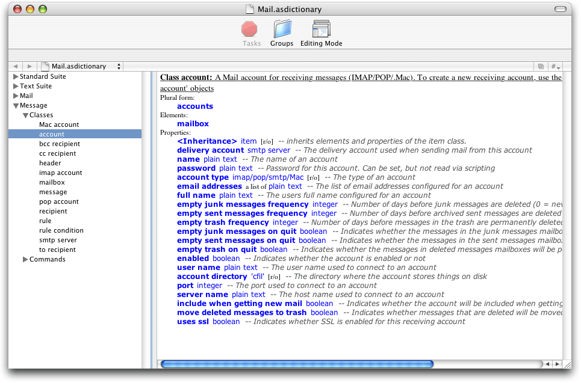
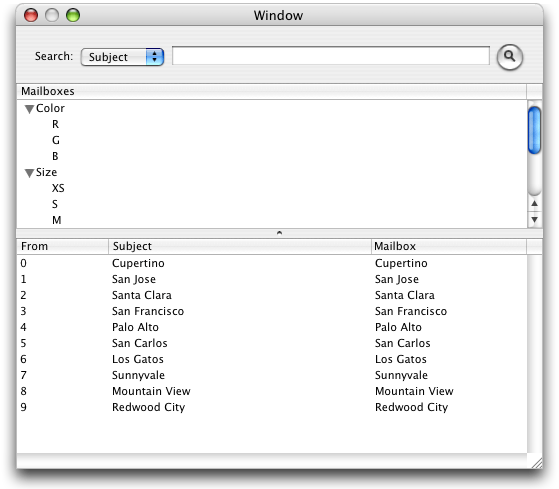
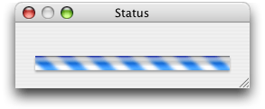
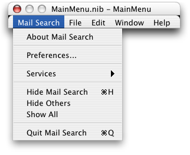
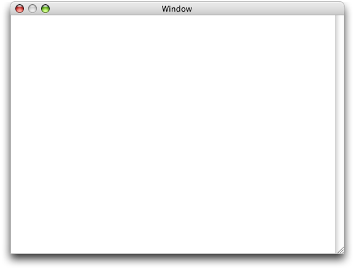

> 导航：[总目录](../../../README.md) · [documentation](../../../_indexes/documentation.md) · [AppleScript Studio Programming Guide](Introduction%20to%20AppleScript%20Studio%20Programming%20Guide.md)

[Next](Mail%20Search%20Tutorial-%20Create%20the%20Interface.md)[Previous](Currency%20Converter%20Tutorial.md)

# Mail Search Tutorial: Design the Application

In this chapter you’ll use AppleScript Studio to design a fairly complex AppleScript Studio application called Mail Search. Mail Search searches for text in messages in the Mac OS X Mail application. You’ll design Mail Search by performing the steps described in the following sections:

1. [Identify a Goal for the Application](#apple-f4xwc4dqnrsv64tfmyxwi33df52wszbpgiydambrgi2tilkcineuqssijjeq).
2. [Examine Mail’s Scripting Dictionary](#apple-f4xwc4dqnrsv64tfmyxwi33df52wszbpgiydambrgi2tilkukbmferkgge2ta).
3. [Specify Operations for Mail Search](#apple-f4xwc4dqnrsv64tfmyxwi33df52wszbpgiydambrgi2tilkukbmferkgge2tc).
4. [Design the Interface](#apple-f4xwc4dqnrsv64tfmyxwi33df52wszbpgiydambrgi2tilkukbmferkgge2te).
5. [Plan the Code](#apple-f4xwc4dqnrsv64tfmyxwi33df52wszbpgiydambrgi2tilkcineuossbjjbq).

You’ll complete the Mail Search application in the following chapters:

- [Mail Search Tutorial: Create the Interface](Mail%20Search%20Tutorial-%20Create%20the%20Interface.md#apple-f4xwc4dqnrsv64tfmyxwi33df52wszbpgiydambrgi2tklkukbmferkggeydc)
- [Mail Search Tutorial: Connect the Interface](Mail%20Search%20Tutorial-%20Connect%20the%20Interface.md#apple-f4xwc4dqnrsv64tfmyxwi33df52wszbpgiydambrgi2tmlkukbmferkggeydc)
- [Mail Search Tutorial: Write the Code](Mail%20Search%20Tutorial-%20Write%20the%20Code.md#apple-f4xwc4dqnrsv64tfmyxwi33df52wszbpgiydambrgi2tolkukbmferkggeydc)
- [Mail Search Tutorial: Build and Test the Application](Mail%20Search%20Tutorial-%20Build%20and%20Test%20the%20Application.md#apple-f4xwc4dqnrsv64tfmyxwi33df52wszbpgiydambrgi2tqlkukbmferkggeydc)
- [Mail Search Tutorial: Customize the Application](Mail%20Search%20Tutorial-%20Customize%20the%20Application.md#apple-f4xwc4dqnrsv64tfmyxwi33df52wszbpgiydambrgi2tslkukbmferkggeydc)

This organization demonstrates a design decision to use separate steps to create the interface, connect it, and write scripts to perform operations. Working in this manner is appropriate for a tutorial, where the outcome is known in advance, but once you’re familiar with AppleScript Studio, it may not be the most convenient way to design your own applications. Instead, you may choose to work more incrementally, adding part of the interface, connecting it to a handler, and testing (even if only with diagnostic statements to show that program flow is working properly). This tutorial points out places where you might choose to build and test the application in the normal course of development.

Before starting the Mail Search tutorial, it is recommended that you complete the [Currency Converter Tutorial](Currency%20Converter%20Tutorial.md#apple-f4xwc4dqnrsv64tfmyxwi33df52wszbpgiydambrgi2tglkukbmferkggeydc), read [AppleScript Studio Components](AppleScript%20Studio%20Components.md#apple-f4xwc4dqnrsv64tfmyxwi33df52wszbpgiydambrgi2talkukbmferkggeydc), and experiment with some of the sample applications described in [AppleScript Studio Sample Applications](About%20AppleScript%20Studio.md#apple-f4xwc4dqnrsv64tfmyxwi33df52wszbpgiydambrgi2dslkdjjbeuqsgifaq). In particular, the Table and Outline sample applications demonstrate how to work with table view and outline view objects.

If you’re a regular user of the Mac OS X Mail application, you may know that it has a convenient feature for finding specified text in the messages within a mailbox, but prior to Mac OS X version 10.2, it could only search one mailbox at a time. Suppose you recently got mail from a friend and couldn’t remember if you filed it in Personal Mail, To Do List, Read Later, or some other mailbox. You could look for the message in any single mailbox by searching for your friend’s name, or for a word or phrase you remember from the message. You could specify what part of the message to search—Subject, To, From, or Entire message text—but there was no option to search more than one mailbox at a time.

Well, many users had to wait for Mac OS X version 10.2 to be able to search across mailboxes. But AppleScript Studio supplied this feature in Mac OS X version 10.1, through the Mail Search application, one of the sample applications distributed with AppleScript Studio. And though this feature is now built in to Mail, the Mail Search application still provides a useful introduction to a full-featured AppleScript Studio application.

In this tutorial, you’ll perform all the steps required to design and build the Mail Search application. In the process, you’ll gain experience with many AppleScript Studio features, including

- working with document-based applications
- creating and connecting complex user interface objects, using multiple nib files
- writing scripts to control outline and table views, progress bars, and other interface objects
- incorporating script objects in an application
- building AppleScript Studio applications

While designing and building the Mail Search application may prove a challenging task, by the time you complete the tutorial you should have a good grasp of many of the key tools and concepts needed to build AppleScript Studio applications. And even if you don’t work through every step of the tutorial, you can browse it to find tips for performing specific tasks.

Before you can design an AppleScript Studio application to script the Mail application, you need to know what scripting terminology Mail supports. To examine Mail’s scripting dictionary, do the following:

1. Open Xcode.
2. Choose Open Dictionary from the File menu.
3. Choose the Mail application. If it doesn’t show up among the available scriptable applications, you can navigate to it by clicking the Browse button. The application itself is located in `/Applications`.

You’ll find more information on examining scripting dictionaries in [Terminology Browser](AppleScript%20Studio%20Components.md#apple-f4xwc4dqnrsv64tfmyxwi33df52wszbpgiydambrgi2talkciffeersijjfa). Figure 6-1 shows Mail’s scripting dictionary in an Xcode pane. (You can also open dictionaries in the Script Editor application. Both applications provide the same information.)

__Figure 6-1__  The Mail application’s scripting dictionary in an Xcode window

Figure 6-1 shows several terminology suites, or collections of related classes and events. The Standard Suite and Text Suite are default suites that all Cocoa applications get just by turning on scripting (as described in [Cocoa Scripting Support](AppleScript%20Studio%20Components.md#apple-f4xwc4dqnrsv64tfmyxwi33df52wszbpgiydambrgi2talkukbmferkgge3dq)). The Mail and Message suites are specific to Mail. Take some time to examine the classes and events available in each suite. Mail Search is likely to require scripting terms from the Mail and Message suites, as well as terms from the Standard suite, such as `get` and `set`.

For example, to search through messages in all mailboxes, Mail Search has to access:

- accounts (elements of the application class in the Mail suite)
- the mailboxes they contain (elements of the account class)
- the messages (elements of the mailbox class) in those mailboxes

Look for other classes whose properties and elements Mail Search might need, as well as for events that may be useful. As it turns out, Mail Search doesn’t require any events from the Message or Mail suites, but does use events from the Standard Suite (which includes such built-in AppleScript commands as `get` and `set`). In fact, Mail Search uses the `get` command extensively to get accounts, mailboxes, and messages.

The goal of the Mail Search application is to search multiple Mail application mailboxes for specified text. A Mail user can have multiple mail accounts—for example, an IMAP account for work-related email, a POP account from an Internet service provider, and perhaps additional accounts as well. Each account can have multiple mailboxes, including mailboxes within other mailboxes.

A user should be able to search all or a selected group of mailboxes and to specify which part of the messages to search: Subject, To, From, or Contents (in Mail, the equivalent of Contents is “Entire message text”). For lengthy operations, Mail Search should display a progress bar. On completion of a search, Mail Search should display a list of messages that contain the specified text. Columns in the list should display the From and Subject fields, as well as the name of the mailbox the message is in.

Finally, a user must be able to read individual messages that contain the search text. Because Mail’s scripting support doesn't currently support opening an individual message in a Mail window, Mail Search can instead display a message in a separate window it creates.

Based on this analysis, Mail Search’s requirements can be summarized as follows:

- Mail Search can obtain and display a list of all mailboxes from all accounts.
- A user can specify which mailboxes to search, by specifying one or more of the available mailboxes.
- A user can specify text to search for.
- A user can specify where to search from the following choices:

  - Subject field
  - To field
  - From field
  - Contents of message
- Mail Search can find and display all messages containing the specified text. The result list includes

  - From
  - Subject
  - Mailbox name
- A user can double-click a message in the result list to open it in a separate window.
- During long operations, such as searching through multiple mailboxes and potentially thousands of messages, Mail Search can provide feedback on its progress.

As you’ll see in later sections, the Cocoa application framework and the Cocoa user interface objects you use to implement Mail Search have many built-in features. As a result, Mail Search automatically gains many capabilities not listed here.

One way to design an interface is to perform these simple steps:

1. Figure out what the application does so that you can describe what information and user actions the interface must be able to handle.

   This step has already been completed, in [Specify Operations for Mail Search](#apple-f4xwc4dqnrsv64tfmyxwi33df52wszbpgiydambrgi2tilkukbmferkgge2tc).
2. Identify the kinds of user interface widgets you might use to implement the interface.

   AppleScript Studio supplies plenty of widgets—namely all of Cocoa’s user interface objects. This step is described in [Identify Objects for the User Interface](#apple-f4xwc4dqnrsv64tfmyxwi33df52wszbpgiydambrgi2tilkcineugscjjfdq).
3. Arrange the widgets in a pleasing format. This step is described in [Arrange the User Interface](#apple-f4xwc4dqnrsv64tfmyxwi33df52wszbpgiydambrgi2tilkcineugq2fjbea).

Before specifying requirements for Mail Search, which works closely with the Mail application, you investigated the scriptable features supported by Mail. Similarly, before designing Mail Search’s interface, you should investigate the user interface objects available to AppleScript Studio applications. [Cocoa User Interface Objects](AppleScript%20Studio%20Components.md#apple-f4xwc4dqnrsv64tfmyxwi33df52wszbpgiydambrgi2talkciffeqqkbi5da) describes how to view user interface objects in the Palettes window in Interface Builder. You can also take a look various sample applications distributed with AppleScript Studio, including Browser and Outline, which demonstrate the use of column and outline views that imitate the Finder’s column and list views. For more information on the sample applications, see [AppleScript Studio Sample Applications](About%20AppleScript%20Studio.md#apple-f4xwc4dqnrsv64tfmyxwi33df52wszbpgiydambrgi2dslkdjjbeuqsgifaq).

To help narrow the search for objects, here are Mail Search’s requirements from a previous section, along with recommended user interface objects, as well as the script suite to which each object class belongs (where you can examine the scripting terminology for that object):

- Mail Search can obtain and display a list of all mailboxes from all accounts.

  To display a list of mailboxes, consider using an outline view (from the Data View suite). An outline view can display hierarchical data, similar to the way the Finder displays folders and files in a list view. You can build the Outline sample application to see an outline view in action.

  To avoid unnecessary complexity in this tutorial, Mail Search only uses one layer of nesting in the outline view.
- A user can specify which mailboxes to search, including a single mailbox, a subset, or all mailboxes.

  An outline view, as a subclass of the table view class (both belong to the Data View suite), automatically supports row selection.
- A user can specify text to search for.

  A text field (from the Control View suite) is the obvious choice for obtaining text from a user.

  In addition, Mail Search can use a button (also from the Control View suite) to initiate the search.
- A user can specify where to search:

  - Subject field
  - To field
  - From field
  - Contents of message

  A good way to choose one item from a small number of items is a pop-up menu, which is supported by the popup button class (from the Control View suite). By using a pop-up menu, Mail Search mimics Mail’s implementation of this feature.
- Mail Search can find and display all messages containing the specified text.

  There are several aspects of a found message that a user might like to see, including who it’s from, the subject, and the mailbox where it is stored. In fact, the interface for displaying messages should look similar to the ones that display mail in Mail and similar applications.

  A table view (from the Data View suite) is a good choice for displaying rows and columns of data. You can build the Tables sample application (distributed with AppleScript Studio) to see a table view in action. The Tables application demonstrates two ways to work with table views: using a data source object to supply table data (the approach Mail Search uses), and operating without a data source (supplying the data directly from a script).

  A data source object is a special object supplied by AppleScript Studio to supply row and column data to a table or outline view. Data source objects are available from the AppleScript pane of Interface Builder’s Palette window.
- A user can double-click a message in the result list to open it in a separate window.

  As a simple solution for displaying text in a separate window, you can use a window object containing a text view (from the Text View suite). Though it is easy to implement, a text view supports many operations on the displayed messages, including Cut, Paste, and even Undo.
- During long operations, such as searching through multiple mailboxes and potentially thousands of messages, Mail Search should provide feedback on its progress.

  A progress bar (from the Control View suite) provides a standard mechanism for user feedback. Combined with a text field, it can provide both determinate (the total time is known and the bar moves from left to right proportional to the percentage of the task completed) and indeterminate (the total time is not known, and a striped cylinder spins continually) progress bars, as well as text messages.

You’ve now got a good start on the objects you’ll use for Mail Search’s user interface. In later sections, you’ll read about a few additional objects you’ll need that work together with those described here.

There are any number of ways to sketch out a user interface, from the legendary napkin sketch to laying out actual interface objects in a tool such as Interface Builder. This section presents Interface Builder snapshots of the prospective Mail Search interface. Keep in mind that these illustrations represent just one solution for the specified requirements. Other solutions are certainly possible; feel free to look for changes and improvements as you work through this tutorial and gain knowledge of the interface objects available in AppleScript Studio.

Figure 6-2 shows the Interface Builder definition for Mail Search’s main window, the search window. It contains a pop-up menu to specify where to search, a text field to specify the text to search for, a button to start the search, an outline view to show the available mailboxes, and a table view to display the messages found by the search. The outline view and table view contain sample entries inserted by Interface Builder to help display the views’ rows and columns. This data is not displayed in the application.

You’ll learn how to create each of the interface objects shown in the search window in [Create the Search Window](Mail%20Search%20Tutorial-%20Create%20the%20Interface.md#apple-f4xwc4dqnrsv64tfmyxwi33df52wszbpgiydambrgi2tklkukbmferkgge3dq). The search window also contains the standard close, minimize, and zoom buttons. This set of buttons is just one of the many features you'll get automatically in an AppleScript Studio application.

__Figure 6-2__  Mail Search’s search window in Interface Builder

Figure 6-3 shows the status dialog that Mail Search displays during lengthy operations, such as gathering a list of mailboxes or searching through a large number of messages. Mail Search displays the status dialog as a sheet attached to the main window, not as a separate window. You’ll learn how to create each of the interface objects shown in the status dialog in [Create the Search Window](Mail%20Search%20Tutorial-%20Create%20the%20Interface.md#apple-f4xwc4dqnrsv64tfmyxwi33df52wszbpgiydambrgi2tklkukbmferkgge3dq).

__Figure 6-3__  A status dialog in Interface Builder

Figure 6-4 shows the MainMenu instance from Mail Search’s `MainMenu.nib` file as it appears in Interface Builder. The application menu is open, showing the items in that menu. Mail Search uses the default menu nib created for an AppleScript Studio application, changing only the names of certain menu items shown in Figure 6-4. You’ll learn how to create this nib in [Create the Message Window](Mail%20Search%20Tutorial-%20Create%20the%20Interface.md#apple-f4xwc4dqnrsv64tfmyxwi33df52wszbpgiydambrgi2tklkukbmferkgge3dg) and how to modify it in [Customize Menus](Mail%20Search%20Tutorial-%20Customize%20the%20Application.md#apple-f4xwc4dqnrsv64tfmyxwi33df52wszbpgiydambrgi2tslkcineusqkgijbq).

__Figure 6-4__  Mail Search’s menu nib in Interface Builder, showing the application menu

Figure 6-5 shows a Mail Search message window as it appears in Interface Builder. When a user double-clicks a message in Mail Search’s search window, Mail Search opens a message window to display the message text. You will learn how to create this window in [Create the Message Window](Mail%20Search%20Tutorial-%20Create%20the%20Interface.md#apple-f4xwc4dqnrsv64tfmyxwi33df52wszbpgiydambrgi2tklkukbmferkgge3dg).

__Figure 6-5__  A Mail Search message window in Interface Builder

The interface items shown in this section form the basic user interface for the Mail Search application.

Although you won’t write scripts and handlers for Mail Search until you’ve completed several additional tasks, it makes sense to spend a little time now thinking about the application’s code. A look at dependencies between the code and the interface provides useful background for building the interface and connecting it to handlers in application script files.

Because every AppleScript Studio application is built on the Cocoa application architecture, Mail Search can perform many operations automatically, without any additional effort on your part. For example, users can open multiple windows, resize and minimize windows, enter text, and even shuffle the position of the From, Subject, and Mailbox columns in the list of found messages. To experiment with the features you get in the simplest document-based AppleScript Studio application, even before adding any of Mail Search’s user interface, follow the steps in [Create a Project](Mail%20Search%20Tutorial-%20Create%20the%20Interface.md#apple-f4xwc4dqnrsv64tfmyxwi33df52wszbpgiydambrgi2tklkukbmferkgge2tg).

AppleScript Studio applications also have the ability to connect user actions and other events in the application to handlers in scripts. As you saw in [Terminology Browser](AppleScript%20Studio%20Components.md#apple-f4xwc4dqnrsv64tfmyxwi33df52wszbpgiydambrgi2talkciffeersijjfa), user interface objects in AppleScript Studio applications can respond to a variety of events and contain many scriptable elements and properties. In planning the code for Mail Search, you’ll need to identify the events that Mail Search responds to.

To summarize Mail Search briefly, it opens a search window, connects to the Mail application (opening it if necessary), obtains a list of available mailboxes, and displays them. At that point, it waits for user input and responds accordingly, by opening new search windows, selecting mailboxes to search, initiating a search, displaying results, and so on.

To perform these operations, Mail Search needs two kinds of handlers:

- Handlers that respond directly to user actions (such as the opening or closing of a window) or changes of state in the application (such as completion of application launch). These handlers, called event handlers (as defined in [Connecting Actions to Scripts](About%20AppleScript%20Studio.md#apple-f4xwc4dqnrsv64tfmyxwi33df52wszbpgiydambrgi2dslkdjjbeor2kjbca)), are identified in [Event Handlers in Mail Search](#apple-f4xwc4dqnrsv64tfmyxwi33df52wszbpgiydambrgi2tilkcineuqrkcjbcq).
- Handlers that are not necessarily called to respond to an event, but rather perform basic tasks in the application, such as obtaining a list of available mailboxes, displaying a status dialog, and so on. These handlers are typically called from event handlers. These handlers are identified in [Additional Handlers and Scripts in Mail Search](#apple-f4xwc4dqnrsv64tfmyxwi33df52wszbpgiydambrgi2tilkcineugrsijjbq).

Because AppleScript Studio provides so much built-in support, Mail Search won’t require as much code as you might expect. For a full listing of Mail Search’s script file, `Mail Search.applescript`, see [Mail Search Tutorial: Write the Code](Mail%20Search%20Tutorial-%20Write%20the%20Code.md#apple-f4xwc4dqnrsv64tfmyxwi33df52wszbpgiydambrgi2tolkukbmferkggeydc).

Most interaction with user interface items takes place in the search window, and you’ve already identified the objects for that window in [Identify Objects for the User Interface](#apple-f4xwc4dqnrsv64tfmyxwi33df52wszbpgiydambrgi2tilkcineugscjjfdq). Working from those objects, you can identify events the objects must handle and the event handlers for those events:

- _The search window:_ Mail Search needs to know when a window is opened, when it is activated, and when it is closed. The corresponding event handlers are:

  - `will open`: This event handler is called after a window is instantiated from a nib file and before it is opened. Mail Search can use this handler to perform any initialization associated with the search window that can’t be stored with the nib file.
  - `became main`: This event handler is called when a window becomes the main window (the front window and principal focus of user action), such as when a window is first opened or when a user switches back to the application. The main window is typically (but not always) also the key window (or first recipient for keystrokes). Mail Search can use this handler to perform any required tasks prior to the search window becoming main, such as checking whether the available mailboxes have been loaded.
  - `will close`: This event handler is called before a window is closed. Mail Search can use it to perform any cleanup when a search window is closed.
- _The search text field:_ Mail Search needs to know when a user presses the Return key so it can initiate a search. It can do so by implementing an `action` event handler.
- _The find button:_ Mail Search also needs to know when a user clicks the find button so it can initiate a search. It can do so by implementing a `clicked` event handler.
- _The search results table view:_ Mail Search should open a message window when a user double-clicks on a message. It can handle this event by implementing a `double-clicked` event handler.
- _The application object:_ Mail Search needs to perform certain initialization tasks after the application has unarchived its user interface objects from the nib file but before it enters its main routine. It can achieve this goal by implementing a `will finish launching` event handler.

You’ll connect objects to these event handlers in [Connect the Interface](Mail%20Search%20Tutorial-%20Connect%20the%20Interface.md#apple-f4xwc4dqnrsv64tfmyxwi33df52wszbpgiydambrgi2tmlkukbmferkgge2tk) and write the handlers in [Write Event Handlers for the Interface](Mail%20Search%20Tutorial-%20Write%20the%20Code.md#apple-f4xwc4dqnrsv64tfmyxwi33df52wszbpgiydambrgi2tolkukbmferkgge2tm).

A _script object_ is a user-defined object, combining data (in the form of properties) and handlers, that can be used in a script. A _script object definition_ is a compound statement that can contain collections of properties, handlers, and other AppleScript script statements. A script object definition is similar to an object-oriented class definition—you can instantiate multiple instances of the script object, each containing data and handlers to operate on that data. You can even extend or modify the behavior of a handler in one script object when calling it from another script object.

Most event handlers in Mail Search are associated with the search window. These event handlers need to call other handlers to perform searches and display results. One convenient way to organize these handlers is to create a script object for each search window that implements all the necessary handlers related to searching and displaying results. In response to user actions, Mail Search’s event handlers call the script object’s handlers, which in turn call other handlers in the script object as needed. Mail Search can also use a script object to encapsulate operations involving the status dialog. In Mail Search, neither of these script objects require the use of inheritance to modify contained handlers.

In the next sections, you’ll specify script and handlers for Mail Search. You’ll write these handlers in [Write Scripts and Additional Handlers](Mail%20Search%20Tutorial-%20Write%20the%20Code.md#apple-f4xwc4dqnrsv64tfmyxwi33df52wszbpgiydambrgi2tolkukbmferkgge2to).

Mail Search defines a script to handle operations for the search window. It calls this script a controller, in the tradition of the _model-view-controller (MVC)_ paradigm. In MVC, the view is responsible for what the user sees, the model represents the application’s data and algorithms, and the controller interprets user input and specifies changes to the model and the view. When a search window is about to open, Mail Search creates a controller script object for it and stores it in a global list of controllers. When a window is activated, Mail Search gets its controller and tells it to load all available mail- boxes from the Mail application.

Each open search window has an associated controller in Mail Search’s global list of controllers. When a user performs an action in a window, such as clicking the find button, the application calls the appropriate event handler (such as `on clicked`). That event handler typically gets the controller (a script object) for its window, then calls the appropriate handler in the controller (such as the `find` handler) to perform the requested action (to find matching messages).

The controller script object defines properties for things it needs to keep track of, including

- a reference to its window
- a reference to a status panel (or dialog)
- a list of found messages
- a boolean for whether it has created a list of available mailboxes

The controller script object defines handlers for the searching-related tasks it performs:

- `initialize:` performs any initialization needed for searching
- `loadMailboxes:` loads mailboxes if they haven’t already been loaded; shows status dialog
- `find:` if a valid search has been specified (there is text to search for and at least one selected mailbox to search in), performs the search

In addition to these high-level handlers, the controller script object needs handlers to actually load the mailboxes and search for and display messages. For example, to load mailboxes, Mail Search must search each account. This leads to the following handlers:

- `addMailboxes:` called by `loadMailboxes`; calls `addAccount` for each account
- `addAccount:` called by `addMailboxes`; adds an account name to the mailboxes view; for each mailbox in the account, calls `addMailbox`
- `addMailbox:` called by `addAccount`; adds the mailbox to the mailboxes view

This should help you understand how the controller script might implement other tasks, such as adding found messages to the messages view.

Finally, Mail Search needs several handlers that are not part of the controller script itself:

- `makeController:` creates a controller script object for a window
- `addController:` adds a controller to the global list of controllers
- `removeController:` removes a controller from the global list of controllers
- `controllerForWindow:` given a window, returns the controller for that window from the global list of controllers

You’ll find more information about controller handlers in [Write Scripts and Additional Handlers](Mail%20Search%20Tutorial-%20Write%20the%20Code.md#apple-f4xwc4dqnrsv64tfmyxwi33df52wszbpgiydambrgi2tolkukbmferkgge2to). Of course you can always look ahead by examining Mail Search in [Mail Search Tutorial: Write the Code](Mail%20Search%20Tutorial-%20Write%20the%20Code.md#apple-f4xwc4dqnrsv64tfmyxwi33df52wszbpgiydambrgi2tolkukbmferkggeydc), or by opening the Mail Search sample application in Xcode.

The status dialog provides both determinate (the bar moves from left to right) and indeterminate (a spinning striped cylinder) progress bars, as well as text messages. Mail Search’s approach for handling a status dialog is similar to its approach for handling search operations. That is, it defines a status dialog script and instantiates a script object based on that script whenever it needs to display a status dialog. The status dialog script defines properties for things it needs to keep track of, including

- a reference to its window
- a boolean for whether it has been initialized
- count variables used in showing progress

The status dialog script is fairly simple, and requires fewer handlers than the controller script. As you might expect, its handlers are used for opening and closing the panel or adjusting its status:

- `openPanel:` performs initialization and displays the status dialog
- `closePanel:` closes the panel
- `changePanel:` changes the progress display message
- `adjustPanel:` adjusts the current state of the progress bar
- `incrementPanel:` increments the progress bar display

These handlers aren’t shown in individual listings, but you can examine them in [Mail Search Tutorial: Write the Code](Mail%20Search%20Tutorial-%20Write%20the%20Code.md#apple-f4xwc4dqnrsv64tfmyxwi33df52wszbpgiydambrgi2tolkukbmferkggeydc) or in the Mail Search sample application.

[Next](Mail%20Search%20Tutorial-%20Create%20the%20Interface.md)[Previous](Currency%20Converter%20Tutorial.md)

