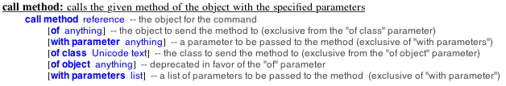
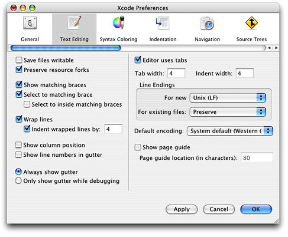
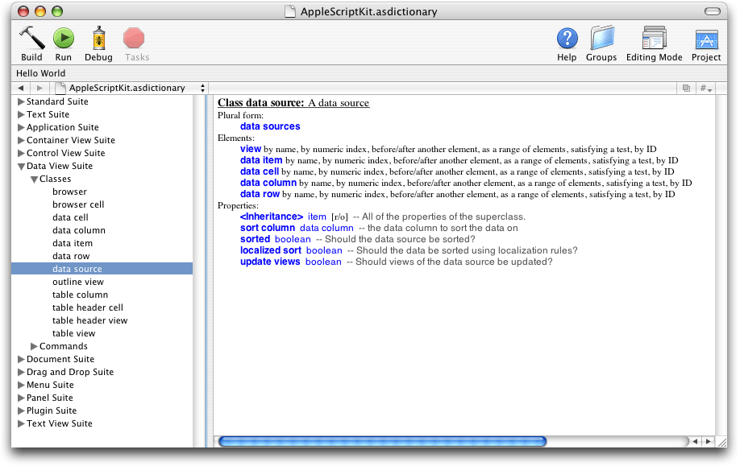

> 导航：[总目录](../../../README.md) · [documentation](../../../_indexes/documentation.md) · [AppleScript Studio Programming Guide](Introduction%20to%20AppleScript%20Studio%20Programming%20Guide.md)


[Next](AppleScript%20Studio%20Cookbook.md)[Previous](AppleScript%20Studio%20Components.md)

# Programming With AppleScript Studio

This chapter describes a number of features and issues that will help you get the most from AppleScript Studio. It contains the following sections:

- [Additional Information on AppleScript Studio](#apple-f4xwc4dqnrsv64tfmyxwi33df52wszbpgiydambrgi2tclkdjjbekqkgifea)
- [AppleScript Studio Terminology](#apple-f4xwc4dqnrsv64tfmyxwi33df52wszbpgiydambrgi2tclkdjjbeoqsijfda)
- [Programming Tips](#apple-f4xwc4dqnrsv64tfmyxwi33df52wszbpgiydambrgi2tclkdjjbemskbjfba)
- [Troubleshooting](#apple-f4xwc4dqnrsv64tfmyxwi33df52wszbpgiydambrgi2tclkdjjbeoqkhjbea)

For related information, see [Strengths and Limitations](About%20AppleScript%20Studio.md#apple-f4xwc4dqnrsv64tfmyxwi33df52wszbpgiydambrgi2dslkukbmferkgge3da).

The following sections describe additional features and issues you’ll want to know more about as you work with AppleScript Studio.

- [Organizing an AppleScript Studio Project](#apple-f4xwc4dqnrsv64tfmyxwi33df52wszbpgiydambrgi2tclkciffeirsejjdq)
- [Naming Conventions for Methods and Handlers](#apple-f4xwc4dqnrsv64tfmyxwi33df52wszbpgiydambrgi2tclkukbmferkgge4de)
- [Accessing Code From AppleScript Studio Scripts](#apple-f4xwc4dqnrsv64tfmyxwi33df52wszbpgiydambrgi2tclkukbmferkgge3tk)
- [Persistent Script Properties](#apple-f4xwc4dqnrsv64tfmyxwi33df52wszbpgiydambrgi2tclkdjjbemr2jjjea)
- [Accessing Script Globals](#apple-f4xwc4dqnrsv64tfmyxwi33df52wszbpgiydambrgi2tclkdjjbegqsjinca)
- [Overridden Scripting Additions](#apple-f4xwc4dqnrsv64tfmyxwi33df52wszbpgiydambrgi2tclkukbmferkgge3ts)
- [How Xcode Formats Scripts](#apple-f4xwc4dqnrsv64tfmyxwi33df52wszbpgiydambrgi2tclkdjjbegsciifca)
- [Switching Between AppleScript Studio and Script Editor](#apple-f4xwc4dqnrsv64tfmyxwi33df52wszbpgiydambrgi2tclkciffeorskjfea)
- [Scripting AppleScript Studio Applications](#apple-f4xwc4dqnrsv64tfmyxwi33df52wszbpgiydambrgi2tclkukbmferkgge3tq)
- [Using Script Editor to Test AppleScript Studio Terminology](#apple-f4xwc4dqnrsv64tfmyxwi33df52wszbpgiydambrgi2tclkdjjbeiqkejbeq)

Two questions you may frequently face in organizing an AppleScript Studio project are whether to use one or many script files and whether to use one or many nib files. In each case, the answer depends on the scope and goals of the project.

When you create a new AppleScript Studio project in Xcode with the AppleScript Application or Droplet templates, it contains one script file, `Application.applescript`. If you use the Document-based template, you get an additional script file, `Document.applescript`. As the names suggest, these script files are intended for handlers related to the application and its documents, respectively. However, you are free to delete these script files, to rename them, or to add additional script files.

Given this freedom of choice, how should you organize the handlers and other script statements you write for an AppleScript Studio application? As you might expect, the answer depends on the scope of the project and the complexity of the user interface.

There are several advantages to putting all of your script statements in one file:

- Because they are in one file, handlers and script objects have access to other handlers, script objects, and global properties in the file. When this access is important, use of one file makes sense. Script objects are described in [Additional Handlers and Scripts in Mail Search](Mail%20Search%20Tutorial-%20Design%20the%20Application.md#apple-f4xwc4dqnrsv64tfmyxwi33df52wszbpgiydambrgi2tilkcineugrsijjbq).
- There is less overhead with a single script file. For a small application or one with a simple user interface, creating multiple script files may slow the pace of development.

A significant disadvantage of using a single script file is that if many similar objects in the interface (such as buttons) share a handler (such as the `clicked` handler), you may need to do lengthy testing to determine which object the handler was called for. An example is shown in Listing 3-1. Thus using a single script file can have drawbacks in the case of a complex interface with many similar objects, such as a preferences panel. It can also lead to greater complexity in testing and debugging.

__Listing 3-1__  Detecting which button was clicked

```
on clicked theObject
    if the name of the object is "Dial button" then
        --do something
    else if name of the object is "Hang Up button" then
        --do something else
    else if name of the object is "Panic button" then
        --do a third thing
    else if ...
```

There are also advantages to using multiple script files:

- Modularity is a widely-accepted principle in software development. Grouping like things together can make the application both easier to understand and easier to test and debug.
- Having one script per significant object allows you to avoid the code complexity shown in Listing 3-1. Within a handler, you know which object triggered the call. In fact, you should put a comment to that affect in the handler itself.

The downside to using multiple script files is a proliferation of small files in the project. That makes multiple script files most appropriate for projects with a significant, but manageable, number of similar user interface objects.

Finally, you may want to provide one script file per window in your application. This approach may make sense if you are using a similar approach for nib files (as described in the next section).

To create an interface with Interface Builder, you create and edit a nib resource file that contains descriptions of the interface elements in your application. A nib file can describe all or part of a user interface. Many applications use two or more nib files, with one of them designated as the main nib file. The main nib file contains the main menu and any windows and panels you want to appear when your application starts up.

In addition to the main nib file, you can have one or more nib files that you load whenever you need them. Loading a nib file unarchives (or creates instances of) whatever user-interface objects are described in the nib. For example, if your application creates its own document type, you might have a separate nib file for a document window. Each time a user opens a new document, you would create a document window by loading the auxiliary nib file.

It is certainly possible to put a large number of user interface definitions into a single nib file. However, as you add object instances (and possibly classes, images, and sounds as well) to a nib file, the task of working with the nib in Interface Builder becomes more complicated. For example, you can use Interface Builder to examine the objects in a nib file in an outline view, as described in [Examining an Object Hierarchy in the Nib View](Mail%20Search%20Tutorial-%20Connect%20the%20Interface.md#apple-f4xwc4dqnrsv64tfmyxwi33df52wszbpgiydambrgi2tmlkcineugq2ji5fa). This mode of display can be very useful for examining an object hierarchy and viewing the connections between objects. However, as you add objects to the nib file, the clarity of the hierarchy and relationships diminishes.

As a result, using a single nib file probably only makes sense for relatively small AppleScript Studio applications with simple user interfaces, and for applications that are not built with the Document-based project template.

A rule of thumb for creating nib files is to use one nib for each separate kind of window in the application. For example, the Mail Search application, described in detail in the tutorial beginning in [Chapter 7, Mail Search Tutorial: Design the Application,](Mail%20Search%20Tutorial-%20Design%20the%20Application.md#apple-f4xwc4dqnrsv64tfmyxwi33df52wszbpgiydambrgi2tilkukbmferkggeydc) uses four nib files: one for the application and its menus, one for the search window, one for the message window, and one for a status dialog. By using a single nib for a window definition, you can easily create instances of that window object by loading the nib with the `load nib` command.

One final advantage of using multiple nib files is that doing so can help simplify the task of finding and correcting interface-related bugs—and in AppleScript Studio, the interface is likely to be a major factor in most applications.

The Cocoa application framework follows a naming convention that helps explain when certain methods are called. This convention, which is reflected in the terminology for AppleScript Studio’s event handlers, inserts `should`, `will`, and `did` in method names. Table 3-1 describes the meaning of these terms. Note that to indicate a completed operation, AppleScript Studio uses the past tense, rather than the term `did`.

__Table 3-1__  Naming conventions in Cocoa and AppleScript Studio

| Cocoa phrase | Explanation | AppleScript Studio examples |
| `should` | Asks whether an operation should take place. You can cancel the operation by returning `false`. | `should open`  `should close` |
| `will` | An operation is about to take place. You can prepare for it, but not prevent it. | `will resize`  `will hide`  `will quit` |
| `did` | An operation has completed. You can perform actions in response to it. AppleScript Studio uses past tense, rather than the term `did`. | `activated`  `launched`  `miniaturized`  `zoomed` |

So, for example, you can add a `should close` handler to a window object. When the handler is called, it can determine whether the user has performed some essential task—if not, it can return `false` and refuse to allow the window to close. A `will close` handler cannot cancel the close operation, but it can perform any necessary tasks to prepare for closing. Finally, a `closed` handler can perform any tasks required after closing.

See _AppleScript Studio Terminology Reference_ for detailed descriptions of the event handlers and other terminology that is available in AppleScript Studio.

AppleScript Studio provides the `call method` command for calling methods of Objective-C objects in an AppleScript Studio application.

The `call method` command provides the ability to:

- target user interface objects
- target the application object or its delegate
- specify as many parameters as needed
- receive a return value; the return value can be another object, from which you can extract more information

Because you can access other languages from Objective-C, the `call method` command also allows you to:

- access code written in C, C++, Objective-C++, and Java (both directly and through the Java bridge—a Mac OS X mechanism for communicating between Objective-C and Java)
- access legacy code written in one of these languages
- access Mac OS X frameworks, such as the Core Foundation and Carbon frameworks

The Multi-Language application, distributed starting with AppleScript Studio 1.1, demonstrates how to call other languages from an AppleScript Studio application.

Figure 3-1 shows the syntax for the `call method` command.

__Figure 3-1__  Syntax for the call method command



**`call method`**
: Invokes the command, with `reference` specifying the method to call.

**`with parameter`**
: This optional parameter allows you to pass a value to a method that takes a single parameter. You can use the parameter to pass an object or a simple value such as an integer. You can also pass a single list, which can contain multiple items, but only if the called method expects a single parameter that encompasses multiple values, such as an array or dictionary.

**`of class`**
: This optional parameter allows you to specify the Objective-C class whose method is called.

**`of object`**
: This optional parameter allows you to specify the object whose method is called.

You never use both `of object` and `of class`. If you don’t specify either, the call goes to a method of the application’s delegate object or, if the delegate doesn’t support it, to the application object itself.

The application object is described in [Cocoa Framework Overview](AppleScript%20Studio%20Components.md#apple-f4xwc4dqnrsv64tfmyxwi33df52wszbpgiydambrgi2talkukbmferkggeztq). For information on class methods, delegates, and other Cocoa topics, see the documentation described in [See Also](Introduction%20to%20AppleScript%20Studio%20Programming%20Guide.md#apple-f4xwc4dqnrsv64tfmyxwi33df52wszbpgiydambrgi2dqlkdjfeeiqkhifda).

**`with parameters`**
: This optional parameter is intended for use with methods that have more than one parameter, though you can also use it for a method with a single parameter. You specify a list with one item for each parameter of the specified method. An item within the list of parameters can be a list, if the called method expects a single parameter that encompasses multiple values in that position.

You never use both `with parameter` and `with parameters`. If you don’t use either, it is assumed the method has no parameters.

It is useful to note that Objective-C associates a colon with each parameter of a method. For example, the following is a method declaration from Cocoa’s NSDocument class:

```objc
- (BOOL) readFromFile: (NSString *) fileName ofType: (NSString *) docType
```

This method has two parameters, so to call it with call method, you use the `with parameters` option, as shown in listing Listing 3-2:

__Listing 3-2__  Calling a document method with two parameters

```
call method "readFromFile:ofType:" of object (document 1 of window 1)
    with parameters {myFilenameString, myDocTypeString}
```

In Listing 3-2, the list consists of the two string variables (whose values are set prior to the call) enclosed in curly brackets: `{myFilenameString, myDocTypeString}`.

For a method with one parameter (and one colon), you use `with parameter`. The example in Listing 3-3 calls the `performClick:` method of a button object, passing as a parameter another button object.

__Listing 3-3__  Calling a method of a button

```
call method "performClick:" of object (button 1 of window 1)
    with parameter (button 2 of window 2)
```

The single parameter in Listing 3-3 is enclosed in parentheses because it is a multi-term reference: `(button 2 of window 2)`. You could optionally use `with parameters` and pass a one-item list: `{button 2 of window 2}`.

Listing 3-4 shows an example that calls a class method of NSNumber to get back a number object initialized with an integer value. It passes a single value (the number 10) for its one parameter. In this case, the parameter is unambiguous, and does not require parentheses.

__Listing 3-4__  Calling a class method

```
set theResult to call method "numberWithInt:" of class "NSNumber"
    with parameter 10
```

Listing 3-5 shows a hypothetical example that has no parameters. Because it doesn’t specify a class or object, call method will attempt to execute the `countMyCustomers` method of the application object, returning the customer count. It’s your obligation to make sure the method you call actually exists!

__Listing 3-5__  Calling a method of the application

```
set customerCount to call method "countMyCustomers"
```

The `call method` command can accept and return the types NSRect, NSPoint, NSSize, and NSRange, in addition to primitive types such as `int`, `double`, `char *`, and so on. For example, to call the NSView method `- (void) setFrame: (NSRect) frameRect`, you use a script statement similar to the following:

```
call method "setFrame:" of object (view 1 of window 1)
        with parameter {20, 20, 120, 120}
```

In this case, the single parameter is a 4-item list that is passed to `setFrame` as a type NSRect.

Table 3-2 lists Cocoa types you typically use with the `call method` command and their AppleScript equivalents.

__Table 3-2__  Cocoa types and their AppleScript equivalents

| Cocoa type | AppleScript equivalent |
| [NSArray](https://developer.apple.com/library/archive/documentation/LegacyTechnologies/WebObjects/WebObjects_3.5/Reference/Frameworks/ObjC/Foundation/Classes/NSArrayClassCluster/Description.html#//apple_ref/occ/cl/NSArray) | list |
| [NSDate](https://developer.apple.com/library/archive/documentation/LegacyTechnologies/WebObjects/WebObjects_3.5/Reference/Frameworks/ObjC/Foundation/Classes/NSDateClassCluster/Description.html#//apple_ref/occ/cl/NSDate) | date |
| [NSDictionary](https://developer.apple.com/library/archive/documentation/LegacyTechnologies/WebObjects/WebObjects_3.5/Reference/Frameworks/ObjC/Foundation/Classes/NSDictionaryClassClstr/Description.html#//apple_ref/occ/cl/NSDictionary) | record |
| [NSPoint](https://developer.apple.com/library/archive/documentation/LegacyTechnologies/WebObjects/WebObjects_3.5/Reference/Frameworks/ObjC/Foundation/TypesAndConstants/FoundationTypesConstants/Description.html#//apple_ref/c/tdef/NSPoint) | list of two numbers:  {x, y} |
| [NSRange](https://developer.apple.com/library/archive/documentation/LegacyTechnologies/WebObjects/WebObjects_3.5/Reference/Frameworks/ObjC/Foundation/TypesAndConstants/FoundationTypesConstants/Description.html#//apple_ref/c/tdef/NSRange) | list of two numbers:  {begin offset, end offset} |
| [NSRect](https://developer.apple.com/library/archive/documentation/LegacyTechnologies/WebObjects/WebObjects_3.5/Reference/Frameworks/ObjC/Foundation/TypesAndConstants/FoundationTypesConstants/Description.html#//apple_ref/c/tdef/NSRect) | list of four numbers:  {left, bottom, right, top} |
| [NSSize](https://developer.apple.com/library/archive/documentation/LegacyTechnologies/WebObjects/WebObjects_3.5/Reference/Frameworks/ObjC/Foundation/TypesAndConstants/FoundationTypesConstants/Description.html#//apple_ref/c/tdef/NSSize) | list of two numbers:  {width, height} |
| [NSString](https://developer.apple.com/library/archive/documentation/LegacyTechnologies/WebObjects/WebObjects_3.5/Reference/Frameworks/ObjC/Foundation/Classes/NSStringClassCluster/Description.html#//apple_ref/occ/cl/NSString) | string |

To see script statements that invoke the `call method` command in a working project, see the Archive Maker or Drawer sample projects, described in [AppleScript Studio Sample Applications](About%20AppleScript%20Studio.md#apple-f4xwc4dqnrsv64tfmyxwi33df52wszbpgiydambrgi2dslkdjjbeuqsgifaq).

In AppleScript Studio, script properties are not saved back into the application as they currently are in AppleScript script applications created with Script Editor or other script editing applications. Therefore the values of script properties do not persist between launches of an AppleScript Studio application.

If you want persistent storage of values, you can write them to a preferences file before your application quits and read them back when it is launched. Starting in version 1.1, AppleScript Studio also provides a mechanism for conveniently saving and restoring values from scripts using the user defaults system available in Mac OS X. This mechanism is described in _AppleScript Studio Terminology Reference_—see the `user-defaults` class and the `default entry` class.

In AppleScript Studio, global variables declared in one script are not accessible from another script without doing an explicit `load script` command. (See the Unit Converter sample application for an example of how to load a script.) Even when you load a script, you’re getting a snapshot of the current values of the variables, not access to one variable that can be referenced (and updated) by each script.

If you need to keep one set of values that can be accessed and updated from multiple scripts, use one of the mechanisms described in [Persistent Script Properties](#apple-f4xwc4dqnrsv64tfmyxwi33df52wszbpgiydambrgi2tclkdjjbemr2jjjea).

AppleScript Studio overrides the `display dialog` command to provide its own version, which can be displayed as a sheet (a dialog attached to a window).

When specifying a `display dialog` command, you use a term similar to the following to display the dialog as a sheet with the specified window:

```
display dialog ... [other terms] ... attached to window "Window Name"
```

For a detailed example of how to use AppleScript Studio’s version of `display dialog`, see the Display Dialog sample application (distributed with AppleScript Studio). The following call to the `display dialog` command is from that application. Many of the parameters are variables, set before making the call.

```
display dialog dialogText buttons
        {dialogButton1, dialogButton2, dialogButton3}
    default button dialogDefaultButton
    giving up after dialogGivingUpAfter
    with icon dialogIcon attached to window "main"
```

If you pass a string for the `with icon` parameter, the command will look for a `.tiff` resource with that name.

The `display dialog` command generates a “user canceled” error when the cancel button is pressed only if the dialog is not attached to a window. If the dialog is attached, cancel is treated like any other button, and you must check for it in your `dialog ended` handler. The Display Dialog sample application demonstrates how to display dialogs, both as a plain dialog or as a sheet attached to a window.

For more information on `display dialog`, see the “Panel Suite” section in _AppleScript Studio Terminology Reference_.

When you check the syntax for a script, Xcode reformats it according to your formatting preferences. Xcode’s editor window currently uses the same formatting (font, style, and color) you have specified in the Script Editor application (located in `/Applications/AppleScript`). To change settings in the version of Script Editor released with Mac OS X version 10.3, follow these steps:

1. Quit Xcode.
2. Open the Script Editor application (located in `/Applications/AppleScript`).
3. Choose Preferences… from the Application menu.
4. Click the Formatting button.
5. Choose the fonts and styles you prefer. (Or click the Use Defaults button to go back to the default values.)
6. Click the Apply button, then quit Script Editor.
7. Open Xcode. Your formatting changes are now in effect.

Because of differences in Script Editor and Xcode, the same font may be rendered differently in the two applications. For an example of script formatting, see [Figure 2-4](AppleScript%20Studio%20Components.md#apple-f4xwc4dqnrsv64tfmyxwi33df52wszbpgiydambrgi2talkciffeqr2kjfbq). In that script, AppleScript keywords are shown in blue (`on`, `end`) and application keywords in red (`clicked`, `display dialog`).

Most scripters are familiar with AppleScript's line-continuation character, "¬", used for dealing with long lines. When a line ends with that character, AppleScript treats the following line as part of the previous line. Long lines are common with some of the user interface terminology in AppleScript Studio. However, Xcode’s ability to wrap lines provides an elegant way to deal with long lines without using continuation characters. You can also set tab widths to improve control script formatting.

To adjust line wrap and tab settings, choose Preferences in Xcode’s application menu, then click the button for the Text Editing pane, shown in Figure 3-2. To choose settings that work well for AppleScript Studio projects:

- select the checkbox for “Wrap lines”
- select the checkbox for “Indent wrapped lines by:” and enter a value of 4
- select the checkbox for “Editor uses tabs”
- enter a value of 4 for “Tab width:” and “Indent width:”

__Figure 3-2__  Setting Text Editing preferences in Xcode



If you copy text from an AppleScript Studio script file to a Script Editor window on a version of Mac OS X prior to version 10.3, you may see the script displayed with many “garbage” characters. The strange characters are probably there because Script Editor can not deal effectively with UNIX-style line endings, while that is the default line-ending style for Project Builder editor windows. You can change the default setting in Project Builder by displaying the script file in an editor window, clicking in the script, then choosing Use Mac Line Endings (CR) from the Line Endings submenu of the Format menu.

Even if you do not experience the line endings problem (or you are using Mac OS X version 10.3 or later), you may still be unable to compile the script. A likely cause is that Script Editor doesn’t know where to find AppleScript Studio terminology you use in the script. You can tell Script Editor about AppleScript Studio’s terminology by enclosing the copied script statements in a Using Terms From block. The block can specify any AppleScript Studio application, such as any of the sample applications you’ve built. Listing 3-6 shows how to do this by getting terminology from the Drawer application (shown in [Figure 1-1](About%20AppleScript%20Studio.md#apple-f4xwc4dqnrsv64tfmyxwi33df52wszbpgiydambrgi2dslkdjjbeescgizba)).

__Listing 3-6__  Telling Script Editor where to look for AppleScript Studio terminology

```
using terms from "Drawer"
    (* Insert script statements from your AppleScript Studio
        script file here. *)
end using terms from
```

For more information on working with Xcode’s source code editor, see [Source Code Editor](AppleScript%20Studio%20Components.md#apple-f4xwc4dqnrsv64tfmyxwi33df52wszbpgiydambrgi2talkciffeorcejfdq).

AppleScript Studio applications use scripts to respond to user actions and perform operations, but are they themselves scriptable applications? The answer is yes, but perhaps not as fully as you might expect.

In script files in the sample applications distributed with AppleScript Studio, you will see many examples of statements that operate on user interface objects, particularly by comparing or setting properties of the objects. For example, the Drawer application gets the state of the “Drawer” button and obtains the “Open drawer on” value (Left, Right, Top, or Bottom) from the matrix of radio buttons, then opens or closes the drawer in the specified location.

You can script similar operations on the running Drawer application from a separate script executed, for example, in Script Editor. The script shown in Listing 3-7 sets a local variable to the current text from the “Date” text field on the application’s drawer. To identify the field, it uses a statement similar to ones in the Drawer application script file `Content Controller.applescript`:

__Listing 3-7__  Setting text in the Drawer application from an external script

```
tell application "Drawer"
    set theText to contents of text field "Date Field" of drawer
        "Drawer" of window "Main"
end tell
```

However, there are limitations to this approach. AppleScript Studio makes an application’s user interface scriptable—it doesn’t make the underlying object model scriptable. For example, if an application window isn’t currently open, a script won’t be able to access user interface objects in that window. Thus scripts that “script the UI” suffer from the inherent problems of knowing what user interface objects are available when the script runs, as well as how to identify the desired object.

Because of these limitations, turning your Cocoa application into an AppleScript Studio application will not automatically allow robust scripting of the application’s features. So using AppleScript Studio for QA testing, for example, is likely to be of most value in simple cases, or for Cocoa applications that already support scripting of their object model.

For related information, see [Performing User Interface Actions](AppleScript%20Studio%20Cookbook.md#apple-f4xwc4dqnrsv64tfmyxwi33df52wszbpgiydambrgi2telkciffeor2iirba), [Experiment With Script Editor to Find Terminology](#apple-f4xwc4dqnrsv64tfmyxwi33df52wszbpgiydambrgi2tclkdjjbekrkbifdq), and [Adding AppleScript Studio Support to Your Cocoa Application](AppleScript%20Studio%20Cookbook.md#apple-f4xwc4dqnrsv64tfmyxwi33df52wszbpgiydambrgi2telkcineusr2gi5ca).

You can use Script Editor (or a third party script editor) to test the terminology you’ll need to access an object in your running AppleScript Studio application. That is, you can target the application, write a statement that gets an object such as the front window, write another statement that gets an object in the front window, and so on. As you execute each script statement to get an object, you can examine the result in the Script Editor’s Result pane. By repeating this process, you can identify terminology that will work in your AppleScript Studio script.

Listing 3-8 shows script statements for obtaining a value from a text field in the Drawer sample application. Before using these statements, build and run the Drawer application. Then open a script window in Script Editor (located in `/Applications/AppleScript`) and show the result by clicking the Result tab at the bottom of the window.

__Listing 3-8__  Scripting the Drawer application from Script Editor

```
tell application "Drawer"
    set theWindow to the front window
    (*if that works, then add the next line *)
    set theTextField to text field "content width" of theWindow
    (* and so on, depending on your object hierarchy *)
    set theText to contents of text field "content width" of theWindow
    display dialog (theText)
    (* and so on *)
end tell
```

To work through this example, start with an empty Tell block:

```
tell application "Drawer"

end tell
```

You can then insert each statement in turn, execute the script, and examine the result. For example, adding the first statement, `set theWindow to the front window` gives you a result something like (`window id 1 of application "Drawer"`) in the Result window. You can then keep adding statements and checking the results until you’ve figured out how to specify the object, property, or element you’re interested in.

In Listing 3-8, the `display dialog` statement merely displays the text extracted from the text field. Starting with AppleScript Studio 1.1, you can obtain a similar result within an AppleScript Studio application script with the `log` command, using statements such as `log theWindow`.

Listing 3-9 shows a script you can run in Script Editor that obtains a list of all the views in the front window of an AppleScript Studio application named “applicationName”. The script logs each view and its class.

__Listing 3-9__  Examining the views of an AppleScript Studio application

```
tell application "applicationName"
    set viewList to (views of window 1)
    repeat with aView in viewList
        log aView
        log class of aView
    end repeat
end tell
```

If you run this script for the Currency Converter sample application distributed with AppleScript studio (starting with version 1.1), you will get output something like the following in Script Editor’s the Event Log pane:

```
    (*view id 2*)
    (*text field*)
    (*view id 3*)
    (*text field*)
    (*view id 4*)
    (*text field*)
    (*view id 5*)
    (*text field*)
    (*view id 6*)
    (*text field*)
    (*view id 7*)
    (*text field*)
    (*view id 8*)
    (*box*)
    (*view id 9*)
    (*button*)
```


The primary documentation for AppleScript Studio terminology is _AppleScript Studio Terminology Reference_. It provides a complete reference to the available terminology, including classes, events, commands, and enumerations.

The following sections describe AppleScript Studio terminology and how it is used:

- [Overview](#apple-f4xwc4dqnrsv64tfmyxwi33df52wszbpgiydambrgi2tclkukbmferkgge3dc)
- [General Sources of Scripting Terminology](#apple-f4xwc4dqnrsv64tfmyxwi33df52wszbpgiydambrgi2tclkciffeorkbincq)
- [Terminology From the AppleScriptKit Framework](#apple-f4xwc4dqnrsv64tfmyxwi33df52wszbpgiydambrgi2tclkukbmferkgge3do)
- [Finding Terminology Information](#apple-f4xwc4dqnrsv64tfmyxwi33df52wszbpgiydambrgi2tclkciffekq2djbeq)

AppleScript allows you to write scripts that control multiple applications, including many parts of the Mac OS itself. The power in your scripts comes primarily from the scripting terminology provided by the applications and the operating system, not from the relatively small number of terms that are native to AppleScript itself. Scripting additions from Apple and from third parties provide additional terms. (A _scripting addition_ is code, stored in Mac OS X in `/System/Library/SystemAdditions`, that makes additional commands or coercions available to scripts on the same computer.)

To take full advantage of the capabilities available, you need to know what terminology you can use in your scripts. Scripts in AppleScript Studio applications have access to the basic terminology that is available to all scripts, as well as to additional terminology that is available to Cocoa applications and, finally, to terminology defined by AppleScript Studio itself. Each of these sources of terminology can include class definitions (which include elements and properties), event and command definitions (which have an associated syntax), and enumerations (or predefined constants).

Sources of terminology that are not unique to AppleScript Studio include:

- terminology provided by AppleScript
- terminology from scriptable parts of the Mac OS
- terminology from available Apple and third party scripting additions
- terminology from available scriptable applications (whether Carbon or Cocoa applications)

  - Cocoa applications store scripting terminology in a _script suite_, described in [Terminology From the AppleScriptKit Framework](#apple-f4xwc4dqnrsv64tfmyxwi33df52wszbpgiydambrgi2tclkukbmferkgge3do).
  - Carbon applications store scripting terminology in an `'aete'` resource, described in the AppleScript documentation listed in [See Also](Introduction%20to%20AppleScript%20Studio%20Programming%20Guide.md#apple-f4xwc4dqnrsv64tfmyxwi33df52wszbpgiydambrgi2dqlkdjfeeiqkhifda).
  - You can examine the terminology for either type of application, as described in [Terminology Browser](AppleScript%20Studio%20Components.md#apple-f4xwc4dqnrsv64tfmyxwi33df52wszbpgiydambrgi2talkciffeersijjfa).

Cocoa applications have access to scripting information derived from the script suites of the application itself (including Cocoa’s default suites), any scriptable frameworks the application uses, and any scriptable bundles it loads. An AppleScript Studio application has access to the default terminology that is available to it as a Cocoa application, as well as to terminology it defines in its own framework, which gives the application the ability to script Cocoa user interface objects.

AppleScript Studio applications are built with the Cocoa application framework and provide terminology to allow scripters to make use of Cocoa application, document, user interface, and other objects. That terminology comes from two sources: terms that are available to all Cocoa applications that support scripting, and terms defined by AppleScript Studio’s AppleScriptKit framework.

Cocoa frameworks and applications provide scripting information in the form of one or more script suites. A _script suite_ consists of at least one suite definition and one suite terminology, contained in external files. A _suite definition_ describes scriptable objects in terms of their attributes, relationships, and supported commands. This information is stored as key-value pairs (where each pair has an identifying key and a corresponding value) in a property list. A _property list_ is a structured, textual representation of data, commonly stored in Extensible Markup Language (XML) format.

A _suite terminology_ provides corresponding AppleScript terminology—the English-like words and phrases you can use in a script—for the class and command descriptions in a suite definition. Suite terminologies are also stored as property lists. Frameworks and applications typically place terminology files in a localized resource directory named `English.lproj`. (English is currently the only supported dialect in AppleScript.)

AppleScript Studio applications can take advantage of the built-in Cocoa terminology found in two default suites, the Standard and Text suites.

- The Standard suite:

  - Defines the Abstract Object class. This class serves as a parent class for all other classes. It has just one property, the Class of the object.
  - Defines basic classes, including Application, Document, and Window (though you’ll see in the next section that AppleScript Studio defines its own version of these classes in its Application and Document suites).
  - Defines terminology for basic events, including Get, Set, Count, Delete, Print, Quit, and others. In Cocoa applications that turn on scripting support (as previously described in [Terms from The AppleScriptKit Framework](#apple-f4xwc4dqnrsv64tfmyxwi33df52wszbpgiydambrgi2tclkukbmferkgge3dq)), objects can support certain key events, such as Get and Set, with little or no extra code.
- The Text suite defines classes for working with text, such as Character, Paragraph, Word, and Text.

For more information on Cocoa’s built-in scripting support, see the documentation described in [See Also](Introduction%20to%20AppleScript%20Studio%20Programming%20Guide.md#apple-f4xwc4dqnrsv64tfmyxwi33df52wszbpgiydambrgi2dqlkdjfeeiqkhifda).

AppleScript Studio adds to the two default suites defined by Cocoa so that it can provide additional terminology for scripting Cocoa’s many user interface objects. This terminology is defined in several suite terminology files in AppleScript Studio’s own framework, the AppleScriptKit framework. For detailed information on the classes and events in these suites, see [Finding Terminology Information](#apple-f4xwc4dqnrsv64tfmyxwi33df52wszbpgiydambrgi2tclkciffekq2djbeq).

The _Application suite_ defines its own version of some common classes that are defined in the Standard suite (described previously), including Application and Window classes. It also defines the Item class, which has Name and ID properties, and the Responder class, which inherits from the Item class and serves as a superclass for the Window, View, and Control classes. These and other classes that inherit from Responder can respond to user actions.

To work with the many high-level classes it contains, the Application suite defines a large number of events for working with the application, windows, mouse and keyboard events, and so on. Prior to AppleScript Studio 1.2, the Application suite defined the Document class. That class is now defined in its own suite.

The _Container View suite_ defines the View class, as well as additional classes whose primary purpose is to contain other views. These include Box, Clip View, Drawer, Scroll View, Split View, Tab View, and Tab View Item. Except for Tab View Item, all of the classes in the Container View suite inherit from Responder, either directly or through the View class. The Container View suite also defines events for working with container views and the views they contain.

The _Control View suite_ defines a number of classes for implementing or working with controls, including Button, Cell, Color Well, Control, Image View, Movie View, Popup Button, Progress Indicator, Slider, and Text Field. Controls are graphic objects that cause instant actions or visible results when the user manipulates them with the mouse. The Cell class inherits from the Abstract Object class (described in [Terms From Cocoa’s Built-in Suites](#apple-f4xwc4dqnrsv64tfmyxwi33df52wszbpgiydambrgi2tclkciffesrsiinda)), while other classes in this suite inherit from the View class, either directly or through the Control class.

The Control View suite defines many events for working with user actions involving controls.

The _Data View suite_ defines classes whose primary purpose is to display rows and columns of data. These include Browser, Browser Cell, Data Cell, Data Column, Data Row, Data Source, Outline View, Table Column, Table Header Cell, Table Header View, and Table View. You’ve worked with several of these classes in building the Mail Search application. The classes in the Data View suite generally inherit from either the View class, the Cell class, or the Abstract Object class (described in [Terms From Cocoa’s Built-in Suites](#apple-f4xwc4dqnrsv64tfmyxwi33df52wszbpgiydambrgi2tclkciffesrsiinda)).

The Data View suite defines events for working with the items, cells, rows, and columns found in table and outline views.

The _Document suite_ defines AppleScript Studio’s version of the document class defined in the Standard suite (described previously). This suite defines terminology you can use to work with documents in any AppleScript Studio application, but which is most important to document-based applications. The Document suite first became available in AppleScript Studio 1.2. In prior versions, a smaller Document class was defined as part of the Application suite.

The _Drag and Drop suite_ defines terms for working with drag and drop, including the `drag info` class to provide information about a drag, and events to drag, track, prepare for a drop, and conclude a drop. The Drag and Drop suite first became available in AppleScript Studio 1.2.

The _Menu suite_ is a small suite that defines just two classes and two events for working with menus. The classes are Menu and Menu Item, which both inherit from the Abstract Object class (described in [Terms From Cocoa’s Built-in Suites](#apple-f4xwc4dqnrsv64tfmyxwi33df52wszbpgiydambrgi2tclkciffesrsiinda)). The events are Choose Menu Item and Update Menu Item.

The _Panel suite_ defines classes and events for dealing with dialogs, alerts, and panels. The classes include Alert Reply, Color Panel, Dialog Reply, Font Panel, Open Panel, Panel, and Save Panel. The two reply classes inherit from the Abstract Object class (described in [Terms From Cocoa’s Built-in Suites](#apple-f4xwc4dqnrsv64tfmyxwi33df52wszbpgiydambrgi2tclkciffesrsiinda)), while the other classes inherit from Window, either directly or through the Panel class.

The _Plugin suite_ defines terms for working with application plug-ins. Starting in AppleScript Studio version 1.3, first distributed with Mac OS X version 10.3, Xcode provides a new template for creating AppleScript plug-ins for Xcode. That is, you can use AppleScript Studio to create a plug-in that adds features to Xcode itself. The Plugin suite provides terminology to use with plug-ins of this type. For more information, see [AppleScript Studio Xcode Plug-in Template](AppleScript%20Studio%20Components.md#apple-f4xwc4dqnrsv64tfmyxwi33df52wszbpgiydambrgi2talkdjjbekqkjircq).

The _Text View suite_ defines two classes for displaying and manipulating text: Text and Text View. Text inherits from View and Text View inherits from Text.

The primary documentation for AppleScript Studio terminology is _AppleScript Studio Terminology Reference_, available in the AppleScript Documentation area. This section describes several additional ways to obtain information about the scripting terminology available to AppleScript Studio applications.

You can get detailed information about the currently available terminology by examining AppleScript Studio’s scripting terminology in a dictionary viewer, as described in [Terminology Browser](AppleScript%20Studio%20Components.md#apple-f4xwc4dqnrsv64tfmyxwi33df52wszbpgiydambrgi2talkciffeersijjfa). You can open any of the AppleScript Studio sample projects in Xcode and select `AppleScriptKit.asdictionary` in the Files list of the Groups & Files list. It provides a link to a scripting terminology file in the AppleScriptKit framework. By displaying this file in a dictionary viewer (also known as a terminology browser), you can examine the terms that are available to all Cocoa applications that support scripting (in the Standard and Text suites) and those that are specific to AppleScript Studio applications (the Application, Container View, Control View, Data View, Document, Drag and Drop, Menu, Panel, and Text View suites).

Figure 3-3 shows the open dictionary in an Xcode window; the classes in the Data View suite are visible, with the Data Source object selected.

__Figure 3-3__  The AppleScript Studio scripting dictionary in Xcode



Each class description in the dictionary shows the plural form for the class (if applicable), its elements (if any), and its properties (if any). Every class except the Abstract object class (described in [Terms From Cocoa’s Built-in Suites](#apple-f4xwc4dqnrsv64tfmyxwi33df52wszbpgiydambrgi2tclkciffesrsiinda)) has an inheritance property, and through it inherits the properties of its superclasses. A property is labeled “[r/o]” if it is read only (you can’t set its value).

Each command description in the dictionary shows the syntax for invoking the command. Parameters enclosed in brackets, such as `[on]`, are optional.

The sample applications distributed with AppleScript Studio provide valuable examples of the terminology for working with objects based on most AppleScript Studio classes. Each of the sample applications demonstrates a small number of features, so that you can more easily focus on the details. These applications are described in [AppleScript Studio Sample Applications](About%20AppleScript%20Studio.md#apple-f4xwc4dqnrsv64tfmyxwi33df52wszbpgiydambrgi2dslkdjjbeuqsgifaq).

Table 3-3 lists some of the sample applications and the key objects used in each application. You can examine the application script files to find examples of terminology for working with these types of objects.

__Table 3-3__  AppleScript Studio sample applications and the objects they use

| Application | Objects used |
| Archive Maker | button, checkbox, custom view, panel, progress indicator, text field, text view; uses `call method` command to call Objective-C methods; uses `do shell script` command |
| Assistant | box, button, image view, tab view, text field |
| Browser | browser, browser cell, column, Finder items, browser row |
| Currency Converter | box, button, label text, number formatter, text field |
| Display Alert | alert, button, checkbox, matrix (radio buttons), text field, window |
| Display Dialog | dialog, button, checkbox, text field, window |
| Display Panel | dialog, button, checkbox, matrix (radio buttons), panel, text field, window |
| Drag Race | button, dialog, progress indicator, slider, text field, window |
| Drawer | button, drawer, matrix (radio buttons), panel, text field, steppers, window; uses `call method` command to call Objective-C methods |
| Image | image, image view |
| Language Translator | box, button, popup button (pop-up menu), progress indicator, slider, split view, text field, window; makes SOAP calls |
| Mail Search (formerly Watson) | button, outline view, progress indicator, scroller, split view, table view, window |
| Multi-Language | button, menu, menu item, text field, window |
| Open Panel | button, open-panel, text field, window |
| Outline | child, Finder items, outline view, row, table column |
| Save Panel | button, save-panel, text field, window |
| Simple Shell | text field, text view, window; uses `do shell script` command |
| SOAP Talk | button, progress indicator, scroll view, text field, window; makes SOAP calls |
| Table | button, column, data cell, data source, row, table view, text field |
| Talking Head | bundle, frame, menu item, movie, movie view, window |
| Unit Converter | box, button, popup button (pop-up menu), text field, window; uses `load script` command |

To determine script terminology by targeting an AppleScript Studio application from Script Editor, see [Using Script Editor to Test AppleScript Studio Terminology](#apple-f4xwc4dqnrsv64tfmyxwi33df52wszbpgiydambrgi2tclkdjjbeiqkejbeq).

The following sections provide information that may be useful as you build applications with AppleScript Studio:

- [Targeting an AppleScript Studio Application](#apple-f4xwc4dqnrsv64tfmyxwi33df52wszbpgiydambrgi2tclkdjjbekr2hijca)
- [Using Make, Not Create, to Create New Objects in Scripts](#apple-f4xwc4dqnrsv64tfmyxwi33df52wszbpgiydambrgi2tclkukbmferkgge4dg)
- [Using the Log Command to Track Your Scripts](#apple-f4xwc4dqnrsv64tfmyxwi33df52wszbpgiydambrgi2tclkciffegskbjjdq)
- [Basic Tips and Reminders](#apple-f4xwc4dqnrsv64tfmyxwi33df52wszbpgiydambrgi2tclkukbmferkgge4di)

You do not have to use a `tell application` statement in an AppleScript Studio application script because scripts implicitly target the application itself.

Scripters are familiar with using AppleScript’s `make` command to create new objects. To make a new object, you specify the class to make, the location, and optionally the properties and data for the object. For example, to make a new “name” data column in a table view, the Table sample application uses the following statement:

```
make new data column at the end of the data columns with properties {name:"name"}
```

For more information on tables and data columns, see the Table application, or see [Controller Script Properties and Initialization](Mail%20Search%20Tutorial-%20Write%20the%20Code.md#apple-f4xwc4dqnrsv64tfmyxwi33df52wszbpgiydambrgi2tolkukbmferkggiydq) in the Mail Search tutorial. For more information on the `make` command, see [AppleScript Language Guide](https://developer.apple.com/documentation/AppleScript/Conceptual/AppleScriptLangGuide/index.html).

During development, you can insert `log` statements in your AppleScript Studio scripts to help keep track of what’s going on. The `log` command outputs a value to the console view of Xcode’s "Run" pane if you run the application from Xcode, or to the Console application (located in `/Applications/Utilities`) if you run the application from the Finder.

You can log references to objects or strings or variables. The following examples show `log` statements and their results:

```
log "Testing" -- "Testing"
log theObject -- "view id 23 of view id 10 of window id 1"
```


This section provides a number of tips and reminders that may improve your experience in working with AppleScript Studio.

Comments are generally a good thing, and in AppleScript Studio it’s particularly useful to comment event handlers. For example, Listing 3-10 shows the code AppleScript Studio inserts in your script when you attach a `clicked` handler to a button (assuming you haven’t already created a `clicked` handler in the same script).

__Listing 3-10__  A new clicked handler

```
on clicked theObject
    (* Add your script here. *)
end clicked
```

There are several things you might do to help make this code more self-explanatory:

- If the handler is called for one of several types of control objects, you can add a comment to that effect:

```
on clicked theObject
    (* This handler handles controls on the Search Parameters pane. *)
    -- Your script statements here
end clicked
```
- If you know the `clicked` handler will only be called for one object (say a “Search” button), you can change the name of the `theObject` parameter accordingly (to, for example, `theSearchButton`). Changing the name has no effect on how the handler operates.
- If the handler may called for one of several objects (say a series of buttons), you can both change the parameter name and add a comment:

```
on clicked importButton
    (* This handler handles buttons on the Import pane. *)
    -- Your script statements here
end clicked
```

  For an example that shows how to distinguish between multiple named buttons in a handler, see [Listing 3-1](#apple-f4xwc4dqnrsv64tfmyxwi33df52wszbpgiydambrgi2tclkciffeqr2kijfa).

Some things are obvious but still need repeating. Any time you’ve done significant work on the code or interface for your AppleScript Studio application, save your work. Even though Mac OS X is very robust. Even if you have an interruptible power supply. And while you’re at it, occasionally save your entire project to another drive. (Pardon the lecture.)

You should occasionally use Xcode’s “Clean active target” button (or the Clean or Clean All Targets items in the Build menu) to do a full rebuild of your application. Cleaning removes all derived products and files (such as `.o` files). Doing a clean build can sometimes eliminate odd results when running or debugging the application.

When you’re adding objects to your nib file in Interface Builder, consider giving an AppleScript name to any objects you may want to script in the future, even if you don’t currently plan to script them. That way you’re prepared when you’re working on a handler and you realize you need to access a particular object.

You can enhance the benefits of this approach by using a consistent naming convention. For example, you can always name your main window “main” and come up with a standard way of naming buttons, text fields, and so on. Then when you need to access one of those items in a script, it will be easy to remember their names. It may also help eliminate a common bug—spelling an AppleScript name differently in a script than in Interface Builder.

This following sections provide tips that may be useful in troubleshooting your AppleScript Studio applications.

- [My Script Statements Aren’t Working](#apple-f4xwc4dqnrsv64tfmyxwi33df52wszbpgiydambrgi2tclkukbmferkgge4tm)
- [Several Windows in My Application Have ID 0](#apple-f4xwc4dqnrsv64tfmyxwi33df52wszbpgiydambrgi2tclkukbmferkggiydc)
- [I Can’t Script My UI to Do QA Testing](#apple-f4xwc4dqnrsv64tfmyxwi33df52wszbpgiydambrgi2tclkukbmferkggiyde)

If your script compiles but doesn’t work in the running application, there are several options for determining the problem:

- The runtime error message may point you at the problem. Some runtime messages are notoriously unhelpful—efforts are being made to improve them.
- You can use Script Editor (or a third-party script editor) to test the terminology you’re using in your scripts. For details, see [Using Script Editor to Test AppleScript Studio Terminology](#apple-f4xwc4dqnrsv64tfmyxwi33df52wszbpgiydambrgi2tclkdjjbeiqkejbeq).
- You can use the `log` command to get more information, as described in [Using the Log Command to Track Your Scripts](#apple-f4xwc4dqnrsv64tfmyxwi33df52wszbpgiydambrgi2tclkciffegskbjjdq).
- You can use the standard basic debugging tactics of inserting `beep` or `display dialog` commands in your scripts.
- You may be able to use powerful third-party debuggers with AppleScript Studio. Details will be provided as soon as they are available.

When you add new windows to a nib file in Interface Builder, they all have ID 0. Interface Builder doesn’t attempt to assign serial index numbers to windows (though it does for buttons or other items you place in a window).

If you so desire, you will still be able to access windows by index in your application, with statements such as

```
set myButton to the first button of the second window
```


This topic is described in [Scripting AppleScript Studio Applications](#apple-f4xwc4dqnrsv64tfmyxwi33df52wszbpgiydambrgi2tclkukbmferkgge3tq).

[Next](AppleScript%20Studio%20Cookbook.md)[Previous](AppleScript%20Studio%20Components.md)

