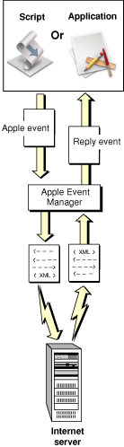

> 导航：[总目录](../../../README.md) · [documentation](../../../_indexes/documentation.md) · [XML-RPC and SOAP Programming Guide](Introduction%20to%20XML-RPC%20and%20SOAP%20Programming%20Guide.md)


[Next](Making%20Remote%20Procedure%20Calls%20From%20Scripts.md)[Previous](Introduction%20to%20XML-RPC%20and%20SOAP%20Programming%20Guide.md)

# About AppleScript’s Support for XML-RPC and SOAP

Starting with OS X version 10.1, AppleScript and the Apple Event Manager provide XML-RPC and SOAP support such that:

- Scripters can make XML-RPC calls and SOAP requests from scripts.
- Developers can make XML-RPC calls and SOAP requests from applications or other code by sending Apple events.

A _remote procedure call_ is a request to a server application at another location to perform operations and return information. _XML-RPC_ is a simple protocol that allows software running in different environments to make remote procedure calls over the Internet. XML-RPC uses two industry standards: XML (extensible markup language) for encoding messages, and HTTP (hypertext transfer protocol) for transporting them. A properly formatted XML-RPC message is an HTTP POST request whose body is in XML. The specified remote server executes the requested call and returns any requested data in XML format.

XML-RPC recognizes procedure parameters by position. Parameters and return values can be simple types such as numbers, strings, and dates, or more complex types such as structures and arrays. To learn more about XML-RPC messages, see the XML-RPC specification at [http://www.xmlrpc.com/spec](http://www.xmlrpc.com/spec).

_SOAP (Simple Object Access Protocol)_ is an RPC protocol designed for a distributed environment, where a server may consist of a hierarchy of objects whose methods can be called over the Internet. A goal of SOAP is to establish a standard protocol that will serve both web service providers and service users. As with other remote procedure call protocols, SOAP uses XML to encode messages and HTTP to transport them. A SOAP request contains a header and an envelope; the envelope in turn contains the body of the request.

One key difference between the SOAP and XML-RPC protocols is that with SOAP, parameters are notational (a request must encode the method parameter names within its XML), rather than positional (recognized by position). To learn more about SOAP messages, see the SOAP specification at [http://www.w3.org/TR/](http://www.w3.org/TR/).

Remote procedure calls provide a powerful tool for accessing services over the Internet. For example, there are already a variety of web-based servers that can check spelling, translate text between languages, provide stock prices, supply weather and traffic information, and more. You can find available services at sites such as XMethods at [http://www.xmethods.net/](http://www.xmethods.net/). There you can also find information you’ll need to make remote procedure calls to these services.

This section describes how to make XML-RPC and SOAP requests from scripts and from applications or other code. Using this support, both scripters and developers can take advantage of the growing number of XML-RPC and SOAP servers available on the Internet.

With OS X version 10.1, the Apple Event Manager is able to process Apple events that encapsulate remote procedure calls, whether the events originate from scripts or applications. [Figure 2-1](#apple-f4xwc4dqnrsv64tfmyxwi33df52wszbpkridgmbqgaytcmrwfuxs6ylqobwgkx3smvtc6zdpmmxxk2lef4zdambqge3temjninfeer2iineuc) shows a simplified view of this process.

__Figure 1-1__  The Apple Event Manager processing a remote procedure call Apple Event.



The Apple Event Manager recognizes a remote procedure call Apple event by its address descriptor, which uses the descriptor type `typeApplicationURL`. To process a remote procedure call Apple event (assuming the event and the XML it contains are properly formatted), the Apple Event Manager performs these basic steps:

1. It uses information from the Apple event to build the XML that represents the remote procedure call.
2. It opens a connection to the specified server.
3. It sends the XML via HTTP POST request.
4. It waits for a response.
5. It parses the XML of the response.
6. It constructs a reply Apple event.
7. It returns the reply.

Scripters can take advantage of this capability by adding statements to their scripts that specify XML-RPC or SOAP requests. Application developers can create and send Apple events directly to invoke XML-RPC or SOAP requests.

When you compile and execute a script, the AppleScript component works with the Apple Event Manager to convert script statements into Apple events that are sent to the specified applications. The following sections describe the terminology and syntax for making XML-RPC calls and SOAP requests from scripts.

AppleScript 1.7 for OS X version 10.1 can specify Internet applications as targets of Tell statements or within Using Terms From blocks. When you specify an XML-RPC server or a SOAP server in one of these statements, the Apple Event Manager generates a dictionary that makes the terminology for remote procedure calls available to your script. That terminology includes the following terms that specify XML-RPC and SOAP requests:

- `call xmlrpc`
- `call soap`

The next sections describe how to use AppleScript’s remote procedure call terminology.

To make an XML-RPC request from a script, you must specify an XML-RPC server as the target application for the request. To do so, you use a statement like the following, which specifies an XML-RPC server that provides spell-checking services over the Internet:

```
tell application "http://www.stuffeddog.com/speller/speller-rpc.cgi"
```

In this statement, the XML-RPC server application is `speller-rpc.cgi` and the remote location is specified by the URL `http://www.stuffeddog.com/speller/`. You can also use the following alternate syntax (where the symbol `¬` (Option-l) denotes a continuation of one script statement onto more than one line), but this form is converted to the above form when the script is compiled:

```
tell application "speller-rpc.cgi" of machine ¬
     "http://www.stuffeddog.com/speller"
```

Once you have specified an XML-RPC server, you can make remote procedure calls within a script block (such as a Tell statement) that specifies that server:

```
tell application "http://www.stuffeddog.com/speller/speller-rpc.cgi"
    -- remote procedure calls here
end tell
```

To specify a name and parameters for the remote procedure call, you use script statements like the following:

```
set returnValue to¬
    call xmlrpc {method name:"someMethod",¬
        parameters: {parameter1, parameter2} }
```

This statement specifies a remote procedure call with two parameters. (You use the same terminology, `method name:`, whether specifying a function or method.) The parameters are represented as a list. The returned information is stored in the variable `returnValue`. Because XML-RPC parameter syntax is positional, you don’t need to provide the parameter names for a given procedure call. An XML-RPC server returns an error if the passed XML is not properly formatted.

The following example combines a Tell block with a remote procedure call to the spell-checking server specified earlier.

```
set myText to "My frst naem is John"
tell application "http://www.stuffeddog.com/speller/speller-rpc.cgi"
    set returnValue to call xmlrpc {method name:"speller.spellCheck",¬
        parameters: {myText} }
end tell
```

This sample shows how easy it can be to set up a remote procedure call from a script. The first line sets a local variable to a text string to be checked. Then the Tell statement specifies an Internet spell-checking server. The single statement in the Tell block calls the `speller.spellCheck` function, passing the local string variable as the single parameter (the text to be checked) and storing the result in a second local variable. This particular remote procedure returns a list that contains, for each misspelled word, a list of suggested corrections, the location of the word in the text, and the misspelled word itself. [Listing 2-1](#apple-f4xwc4dqnrsv64tfmyxwi33df52wszbpkridgmbqgaytcmrwfuxs6ylqobwgkx3smvtc6zdpmmxxk2lef4zdambqge3temjnijauurscinduc) shows an example of such a list.

__Listing 1-1__  Sample list of misspelled words returned by spellCheck remote procedure call.

```
        {{suggestions:{"fast", "fest", "first", "fist", "Forst",
        "frat", "fret", "frist", "frit", "frost", "frot", "fust"},
        location:4, |word|:"frst"}, {suggestions:{"haem", "na em",
        "na-em", "naam", "nae", "nae m", "nae-m", "nael", "Naim",
        "nam", "name", "neem"}, location:9, |word|:"naem"}}
```

Note that this is not the raw data returned from the remote procedure call. When you execute the script shown above, the AppleScript component calls on the Apple Event Manager to convert the `call xmlrpc` statement to an Apple event and send the event to the specified server. The Apple Event Manager recognizes the event and processes it by formatting the remote procedure call into proper XML, opening a connection, sending the message, waiting for a reply, formatting the returned XML into an Apple event, and returning the event.

For a complete script that uses remote procedure calls to check spelling, see [Scripting an XML-RPC Call](Making%20Remote%20Procedure%20Calls%20From%20Scripts.md#apple-f4xwc4dqnrsv64tfmyxwi33df52wszbpkridgmbqgaytcmrwfuxs6ylqobwgkx3smvtc6zdpmmxxk2lef4zdambqge3temznijauur2eijdug).

The process for making SOAP requests in AppleScript scripts is very similar to the process for XML-RPC, though it uses the term `call soap` rather than `call xmlrpc`. To specify a SOAP server as the target application for a SOAP request, you use a statement like the following:

```
tell application "http://services.xmethods.net:80/perl/soaplite.cgi"
```

In this statement, the SOAP server application is `soaplite.cgi`, a server that can perform English to French translation, and the remote location is specified by the URL `http://services.xmethods.net:80/perl/`. Once you have specified a SOAP server on a remote machine, you can make SOAP requests within a script block that specifies that server:

```
tell application "http://services.xmethods.net:80/perl/soaplite.cgi"
    -- SOAP requests here
end tell
```

To specify a method name and parameters for the SOAP request, you use script statements like the following (where the symbol `¬` (Option-l) denotes a continuation of one script statement onto more than one line):

```
    set returnValue to call soap {method name:"BabelFish", ¬
        method namespace uri:"urn:xmethodsBabelFish", ¬
        parameters:{translationmode:direction as string, ¬
        sourcedata:theText as string}, ¬
        SOAPAction:"urn:xmethodsBabelFish#BabelFish"}
```

This statement specifies a SOAP request to a method named `BabelFish` with two parameters, `translationmode` (such as English to French) and `sourcedata` (the text to be translated). The returned information (translated text) is stored in the variable `returnValue`. Unlike the case with XML-RPC calls, for a SOAP request you must specify the names of the parameters for the specified method. While an XML-RPC call represents parameters as a list, a SOAP request represents them as a record. The server will return an error if the passed XML is not properly formatted.

The following example combines a Tell block with a SOAP request to the translation server specified earlier.

```
set theText to "The spirit is willing but the flesh is weak."
set direction to "en_fr"
tell application "http://services.xmethods.net:80/perl/soaplite.cgi"
    set resultText to call soap {method name:"BabelFish", ¬
        method namespace uri:"urn:xmethodsBabelFish", ¬
        parameters:{translationmode:direction as string, ¬
        sourcedata:theText as string}, ¬
        SOAPAction:"urn:xmethodsBabelFish#BabelFish"}
end tell
```

The first two lines set local variables for the text to be translated and the direction of translation (from English to French). The Tell statement specifies an Internet language translation server. The `call soap` statement in the Tell block calls the `BabelFish` function, specifying two parameters by name (`translationmode` and `sourcedata`), and passing the local variables as the parameter values. All the terms shown in the `call soap` statement in this example are required except `parameters:` (because a SOAP method may have no parameters). The resulting translated text is stored in another local variable.

You obtain values for the `method namespace uri:` and `SOAPAction:` terms from the services themselves. For example, many SOAP services publish the information needed to use their services at sites such as XMethods at [http://www.xmethods.net/](http://www.xmethods.net/). You can learn more about SOAP name spaces and SOAPAction in the SOAP specification at [http://www.w3.org/TR/](http://www.w3.org/TR/).

When you execute this script, AppleScript and the Apple Event Manager take care of formatting the SOAP request into proper XML, opening a connection, sending the message, waiting for a reply, formatting the returned XML into an Apple event, and returning the event.

For a complete script that uses SOAP requests to translate English text to French, see [Scripting a SOAP Request](Making%20Remote%20Procedure%20Calls%20From%20Scripts.md#apple-f4xwc4dqnrsv64tfmyxwi33df52wszbpkridgmbqgaytcmrwfuxs6ylqobwgkx3smvtc6zdpmmxxk2lef4zdambqge3temznijauuqsgjjbei).

As described earlier, the Apple Event Manager is now able (in OS X version 10.1) to process Apple events that encapsulate remote procedure calls, whether the events originate from scripts or applications. Assuming the Apple event and the XML it contains are properly formatted, the Apple Event Manager extracts the XML, establishes a connection to the specified server, sends the request via HTTP, waits for a response, parses the XML of the response, constructs a reply Apple event, and returns the reply.

To take advantage of this support, applications and other code can create Apple events to send either XML-RPC or Soap requests. The process includes the following steps:

1. Link with `Carbon.framework`.
2. Prepare any necessary Apple event descriptors, including an address descriptor of type `typeApplicationURL` that specifies the target for the request (a remote server).
3. Create an Apple event with event class `kAERPCClass` and event type `kAEXMLRPCScheme` (for XML-RPC) or `kAESOAPScheme` (for SOAP), and with the target address descriptor created previously.
4. Create the direct object for the Apple event and insert parameters for the method name, method parameter list, and any other required information for the remote procedure call.
5. Insert the direct object into the Apple event.
6. Send the Apple event with `AESend`.
7. Process the reply Apple event to extract any needed information.

More detailed steps for sending an XML-RPC Apple event are shown in [Sending an XML-RPC Apple Event](#apple-f4xwc4dqnrsv64tfmyxwi33df52wszbpkridgmbqgaytcmrwfuxs6ylqobwgkx3smvtc6zdpmmxxk2lef4zdambqge3temjnijauur2ejbeeu) and for a SOAP request in [Sending a SOAP Apple Event](#apple-f4xwc4dqnrsv64tfmyxwi33df52wszbpkridgmbqgaytcmrwfuxs6ylqobwgkx3smvtc6zdpmmxxk2lef4zdambqge3temjnijauur2jiveuc). For examples with sample code, see [Making Remote Procedure Calls From Applications](Making%20Remote%20Procedure%20Calls%20From%20Applications.md#apple-f4xwc4dqnrsv64tfmyxwi33df52wszbpkridgmbqgaytcmrwfuxs6ylqobwgkx3smvtc6zdpmmxxk2lef4zdambqge3tenbnkrifqusfiyytami).

There is some overhead in creating Apple events to send remote procedure calls and in extracting information from the reply Apple event, but you gain the advantage of having the Apple Event Manager build the required XML for you. If, however, you already have code that, for example, automatically generates XML for remote procedure calls, it may be more efficient for you to write your own code to make the remote procedure calls as well.

This section describes some of the key constants used to construct remote procedure call Apple events. These constants are defined in `AEDataModel.h` (in `AE.framework`, a subframework of `ApplicationServices.framework`). For step-by-step instructions that show how to create Apple events using these constants, see [Making Remote Procedure Calls From Applications](Making%20Remote%20Procedure%20Calls%20From%20Applications.md#apple-f4xwc4dqnrsv64tfmyxwi33df52wszbpkridgmbqgaytcmrwfuxs6ylqobwgkx3smvtc6zdpmmxxk2lef4zdambqge3tenbnkrifqusfiyytami).

The Apple Event Manager defines one event class constant and two event ID constants for remote procedure call Apple events. These constants are shown in [Listing 2-2](#apple-f4xwc4dqnrsv64tfmyxwi33df52wszbpkridgmbqgaytcmrwfuxs6ylqobwgkx3smvtc6zdpmmxxk2lef4zdambqge3temjnijauussfijeec). You use the constant `kAERPCClass` as the event class for both XML-RPC and SOAP requests. To specify the request type, you use either `kAEXMLRPCScheme` or `kAESOAPScheme` for the event ID.

__Listing 1-2__  Event class and event ID constants for remote procedure call Apple events.

```
    kAERPCClass     = 'rpc ', /* for outgoing XML events */
    kAEXMLRPCScheme = 'RPC2', /* event ID: send to XMLRPC endpoint */
    kAESOAPScheme   = 'SOAP', /* event ID: send to SOAP endpoint */
```

[Listing 2-3](#apple-f4xwc4dqnrsv64tfmyxwi33df52wszbpkridgmbqgaytcmrwfuxs6ylqobwgkx3smvtc6zdpmmxxk2lef4zdambqge3temjnijauuscbirees) shows the constant `typeApplicationURL`. An Apple event for a remote procedure call must have an address descriptor of this type that specifies the target for the request. The Apple Event Manager recognizes this type as a remote procedure call and processes it appropriately.

__Listing 1-3__  Address descriptor type for remote procedure call Apple events.

```
enum {
    //...some constants not shown
    typeApplicationURL = 'aprl',
    //...
};
```

The SOAP specification defines a schema for encoding (or serializing) information. The Apple Event Manager can work with both the 1999 (or SOAP specification version 1.1) and 2001 (SOAP specification version 1.2) schemas. [Listing 2-4](#apple-f4xwc4dqnrsv64tfmyxwi33df52wszbpkridgmbqgaytcmrwfuxs6ylqobwgkx3smvtc6zdpmmxxk2lef4zdambqge3temjnijauurcdjbdei) shows the constants for specifying the SOAP schema used to format the SOAP request in a remote procedure call Apple event.

You can specify a serialization schema by adding a parameter of type `typeType` and key `keySOAPSchemaVersion` to the direct object of a SOAP request Apple event. If you do not specify a schema, the default is `kSOAP1999Schema`.

__Listing 1-4__  Constants for specifying a SOAP schema.

```
enum {
    kSOAP1999Schema = 'ss99',
    kSOAP2001Schema = 'ss01',
    //...
    keySOAPSchemaVersion = 'ssch'
};
```

[Listing 2-5](#apple-f4xwc4dqnrsv64tfmyxwi33df52wszbpkridgmbqgaytcmrwfuxs6ylqobwgkx3smvtc6zdpmmxxk2lef4zdambqge3temjnijauurceivdug) shows some of the constants you use to identify the components of an XML-RPC or SOAP request. When you create a remote procedure call Apple event, you use these constants to add various information about the request to the direct object of the Apple event:

- You use the key `keyRPCMethodName` to add an Apple event parameter that specifies the procedure or method name for the request.
- After you build a descriptor list that describes the parameters for a remote procedure call, you insert it into the direct object for the Apple event using the key `keyRPCMethodParam`.
- For a SOAP request, you add the required SOAPAction header to the direct object using the key `keySOAPAction`.
- For a SOAP request, you add the required SOAP name space URI to the direct object using the key `keySOAPMethodNameSpaceURI`.

__Listing 1-5__  Constants used in constructing an XML-RPC or SOAP request in a remote procedure call Apple event.

```
    keyRPCMethodName    = 'meth', /* name of the method to call */
    keyRPCMethodParam   = 'parm', /* the list (or structure) of parameters*/
    keySOAPAction       = 'sact', /* the SOAPAction header */
    keySOAPMethodNameSpaceURI= 'mspu',/* Required namespace URI */
```

[Listing 2-6](#apple-f4xwc4dqnrsv64tfmyxwi33df52wszbpkridgmbqgaytcmrwfuxs6ylqobwgkx3smvtc6zdpmmxxk2lef4zdambqge3temjnijauuq2bijdus) shows constants you can specify in an attribute to a remote procedure call Apple event to turn on Apple Event Manager debugging. Depending on which debug information you specify with these constants, the reply Apple event from an XML-RPC or SOAP request can supply the header or the body of the outgoing request, or of the reply.

__Listing 1-6__  Constants for turning on the Apple Event Manager’s remote procedure call debugging.

```
enum {
    kAEDebugPOSTHeader = (1 << 0), /* headers of the HTTP post - typeChar */
    kAEDebugReplyHeader = (1 << 1), /* headers returned by the server */
    kAEDebugXMLRequest = (1 << 2), /* the XML request we sent */
    kAEDebugXMLResponse = (1 << 3), /* the XML reply from the server */
    kAEDebugXMLDebugAll = 0xffffffff/* everything! */
};
```

Depending on which debugging flags you specify with the constants shown in [Listing 2-6](#apple-f4xwc4dqnrsv64tfmyxwi33df52wszbpkridgmbqgaytcmrwfuxs6ylqobwgkx3smvtc6zdpmmxxk2lef4zdambqge3temjnijauuq2bijdus), one or more attributes is added to the Apple event. You can extract those attributes using the keys shown in [Listing 2-7](#apple-f4xwc4dqnrsv64tfmyxwi33df52wszbpkridgmbqgaytcmrwfuxs6ylqobwgkx3smvtc6zdpmmxxk2lef4zdambqge3temjnijauurcbijcum).

__Listing 1-7__  Key constants for remote procedure call debugging attributes.

```
    keyAEPOSTHeaderData = 'phed', /* header of request to the server */
    keyAEReplyHeaderData = 'rhed', /* header of server reply */
    keyAEXMLRequestData = 'xreq', /* body of request to the server */
    keyAEXMLReplyData = 'xrep', /* body of server reply */
```


To make an XML-RPC request from your application or other code, you’ll need to create an Apple event that encapsulates the procedure call and call `AESend` to send it. This section describes the steps you need to follow. To see those steps implemented in code, see [Making an XML-RPC Call](Making%20Remote%20Procedure%20Calls%20From%20Applications.md#apple-f4xwc4dqnrsv64tfmyxwi33df52wszbpkridgmbqgaytcmrwfuxs6ylqobwgkx3smvtc6zdpmmxxk2lef4zdambqge3tenbnijbusr2jjjcue).

To use an Apple event to execute an XML-RPC request, you do the following:

1. Link with `Carbon.framework`.
2. Create a target address descriptor of type `typeApplicationURL` that specifies the target for the request (a remote server).
3. Create an Apple event with event class `kAERPCClass`, event ID `KAEXMLRPCScheme`, and with the target address descriptor created in a previous step.
4. Create the direct object for the Apple event.
5. Insert the method name, using the key `keyRPCMethodName`.
6. Create a list descriptor for the remote procedure call parameters and insert each parameter (using the key `keyRPCMethodParam`).
7. Add the parameter list to the direct object.
8. Insert the direct object into the Apple event.
9. Optionally turn on debugging by adding an attribute to the event with key `keyXMLDebuggingAttr`.
10. Send the Apple event with `AESend`.
11. Process the reply Apple event to extract any needed information. If you turned on debugging, you can extract debugging information, according to which of the debugging constants (described above) you specified. For example, you can examine the header or the body of the posted message, or of the reply.

To make a SOAP request from your application or other code, you’ll need to create an Apple event that encapsulates the request and call `AESend` to send it. This section describes the steps you need to follow. To see those steps implemented in code, see [Making a SOAP Request](Making%20Remote%20Procedure%20Calls%20From%20Applications.md#apple-f4xwc4dqnrsv64tfmyxwi33df52wszbpkridgmbqgaytcmrwfuxs6ylqobwgkx3smvtc6zdpmmxxk2lef4zdambqge3tenbnijbusrcfizdeu).

To use an Apple event to execute a SOAP request, you do the following:

1. Link with `Carbon.framework`.
2. Create a target address descriptor of type `typeApplicationURL` that specifies the target for the request (a remote server).
3. Create an Apple event with event class `kAERPCClass`, event ID `kAESOAPScheme`, and with the target address descriptor created in a previous step.
4. Create the direct object for the Apple event.
5. Insert the method name, using the key `keyRPCMethodName`.
6. Create a list descriptor for the SOAP method parameters and insert each parameter as character data.
7. Add the parameter list to the direct object, using the key `keyRPCMethodParam`.
8. Add the SOAP name space URI to the direct object, using the key `keySOAPMethodNameSpaceURI`.
9. Insert the direct object into the Apple event.
10. Optionally turn on debugging by adding an attribute to the event with key `keyXMLDebuggingAttr`.
11. Send the Apple event with `AESend`.
12. Process the reply Apple event to extract any needed information. If you turned on debugging, you can extract debugging information, according to which of the constants described above you specified. For example, you may be able to examine the header or the body of the posted message, or of the reply.

[Next](Making%20Remote%20Procedure%20Calls%20From%20Scripts.md)[Previous](Introduction%20to%20XML-RPC%20and%20SOAP%20Programming%20Guide.md)

