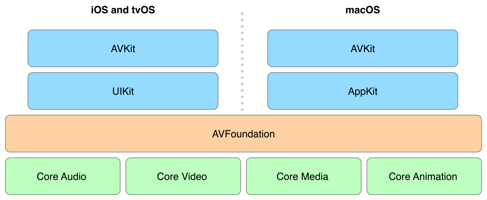

> 导航：[总目录](../../../README.md) · [documentation](../../../_indexes/documentation.md)

[Next](Building%20a%20Basic%20Playback%20App.md)

# About Media Playback

You use the AVKit and AVFoundation frameworks to play and present audiovisual media. This guide provides you with the details of how to leverage the powerful features and capabilities of these frameworks to build media playback apps.

Apple platforms provide robust media playback capabilities, enabling you to handle both simple and advanced use cases. Playback support is provided by the AVKit and AVFoundation frameworks shown in the following figure:

### AVFoundation

AVFoundation is Apple’s media framework for iOS, tvOS, and macOS. You can use it to perform a wide variety of media processing tasks, including media capture, editing, and low-level processing, but one of its most frequently used features is media playback. With AVFoundation, you can efficiently load and control the playback of media assets such as QuickTime movies, MP3 audio files, and even audiovisual media served remotely over HTTP Live Streaming.

AVFoundation’s features extend beyond basic media playback. The framework makes it easy for you to retrieve and present descriptive media metadata, display subtitles and closed captions, and select alternative audio and video presentations. You can even perform real-time processing of media samples during playback, giving you complete control over how your media is processed and presented. Later sections of this guide describe how to use these advanced capabilities.

AVFoundation gives you a rich set of features to build robust playback apps. However, because the framework sits below the user interface frameworks, it doesn’t provide a standard user interface for controlling playback. Although it’s possible to build your own custom player interface, doing so often involves a considerable amount of work and requires you to have a deep understanding of the lower-level AVFoundation interfaces. There are certainly cases where having complete control over the user interface is desirable, but often the better solution is to rely on the features provided by the AVKit framework.

### AVKit

AVKit is a companion framework built on top of AVFoundation. AVKit makes it easy for you to provide a player interface for your app that matches the platform’s native playback experience. AVKit uses AVFoundation’s playback infrastructure to provide a player interface that automatically adapts to best match the content being played. Using AVKit, your player automatically displays subtitles and closed captions, presents navigable chapter markers, and provides controls to select alternative media options. Because AVKit is a system framework, your playback apps automatically adopt the new aesthetics and features of future operating system updates without any additional work from you.

The framework is available in iOS, tvOS, and macOS. Although it shares many of its core features across all platforms, it also offers a number of platform-specific features you can use in your apps. These features are described in later sections of this guide.

#### iOS

In the past, the simple way to add full-featured video playback to your apps was to use the MediaPlayer framework’s `MPMoviePlayerViewController` class. It provided standard playback controls, could be presented in a variety of ways, supported AirPlay streaming, and offered a number of other useful features. This class was built on top of AVFoundation, but hid those underpinnings, preventing you from using AVFoundation’s more advanced features. In iOS 9, `MPMoviePlayerController` was deprecated and replaced with AVKit and AVFoundation. You get all of the same features by using the AVKit framework’s [AVPlayerViewController](https://developer.apple.com/documentation/avkit/avplayerviewcontroller) class, but you also have direct access to AVFoundation, making it possible for you to build both simple _and_ advanced media playback apps for iOS.

#### tvOS

It’s important to present a familiar playback experience to users on tvOS. Users have certain expectations of how to control playback and interact with media content using the Siri Remote. The same playback experience found in Apple’s built-in apps is available to you when you use the AVKit framework’s [AVPlayerViewController](https://developer.apple.com/documentation/avkit/avplayerviewcontroller) class. Using this class, you can deliver the same intuitive transport behavior, including trick play support, making it easy for users to control the playback of your media. It also gives you a customizable Info Panel that you can use to display metadata and chapter markers to further enhance navigating through your content. One of the most compelling features of AVKit in tvOS is that it provides full Siri Remote control of your content using spoken commands such as “Play from beginning,” “Skip ahead 30 seconds,” or “What did she say?” to control playback.

#### macOS

You can build media players for macOS with the same core features of QuickTime Player by using the AVKit framework’s [AVPlayerView](https://developer.apple.com/documentation/avkit/avplayerview) class. The player view lets you choose between a variety of _controls styles_, making it easy to tailor the player’s presentation to best match the needs of your app. `AVPlayerView` provides a dynamic playback interface that automatically adapts to the content being played. This makes it easy for you to provide the best user experience to control the features of the presented media. You can also use `AVPlayerView` to easily add the same trimming capabilities found in QuickTime Player to your app. AVKit for macOS is built with modern apps in mind and automatically supports all of the standard macOS features, such as localization, state restoration, full-screen playback, high-resolution display, and accessibility.

This document describes how to use the features of AVKit and AVFoundation to build media playback apps. Start by reading [Building a Basic Playback App](Building%20a%20Basic%20Playback%20App.md#apple-f4xwc4dqnrsv64tfmyxwi33df52wszbpkridimbqge3donjxfvbuqmjqfvjvomq), which walks you through the steps to create your first playback app. Next, read [Exploring AVFoundation](Exploring%20AVFoundation.md#apple-f4xwc4dqnrsv64tfmyxwi33df52wszbpkridimbqge3donjxfvbuqnbnknltc), which provides you with the essentials for using the media playback capabilities of AVFoundation. After you’ve completed Exploring AVFoundation, you can explore the remaining chapters to find out more about the specifics of using AVKit and AVFoundation.

This guide assumes no prior media programming experience. However, knowledge of the following areas is needed to take advantage of some of the more advanced features of AVKit and AVFoundation:

- A solid understanding of fundamental Cocoa or Cocoa Touch development tools and techniques
- Swift or Objective-C, including an understanding of using blocks (see _[A Short Practical Guide to Blocks](https://developer.apple.com/library/archive/featuredarticles/Short_Practical_Guide_Blocks/index.html#//apple_ref/doc/uid/TP40009758)_)
- Key-value observing (see _[Key-Value Observing Programming Guide](../../Cocoa/Key-Value%20Observing%20Programming%20Guide/Introduction%20to%20Key-Value%20Observing%20Programming%20Guide.md#apple-f4xwc4dqnrsv64tfmyxwi33df52wszbpgeydambqge3to2i)_)
- A basic understanding of Grand Central Dispatch (see _[Concurrency Programming Guide](../../General/Concurrency%20Programming%20Guide/Introduction.md#apple-f4xwc4dqnrsv64tfmyxwi33df52wszbpkridimbqga4daojr)_)

See the following documents for information related to the _Media Playback Programming Guide_:

- _[Audio Session Programming Guide](../../Audio/Audio%20Session%20Programming%20Guide/Introduction.md#apple-f4xwc4dqnrsv64tfmyxwi33df52wszbpkridimbqga3tqnzv)_. Provides the details of using audio sessions to configure your app’s audio behavior.
- _[HTTP Live Streaming Overview](../../Networking%20Internet/HTTP%20Live%20Streaming%20Overview/Introduction.md#apple-f4xwc4dqnrsv64tfmyxwi33df52wszbpkridimbqga4dgmzs)_. Explains how to set up and use HTTP Live Streaming to deliver live and on-demand audio and video over HTTP from an ordinary web server.
- _[AV Foundation Framework Reference](https://developer.apple.com/documentation/avfoundation)_. Provides the API details of the AVFoundation classes described in this guide.
- _[AVKit Framework Reference](https://developer.apple.com/documentation/avkit)_. Provides the API details for the AVKit classes described in this guide.
[Next](Building%20a%20Basic%20Playback%20App.md)

