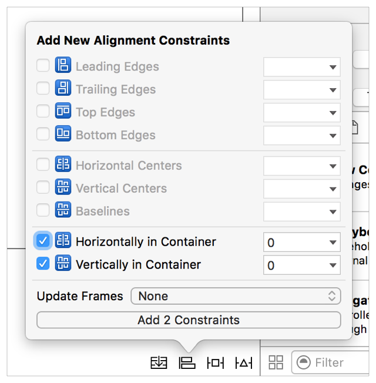
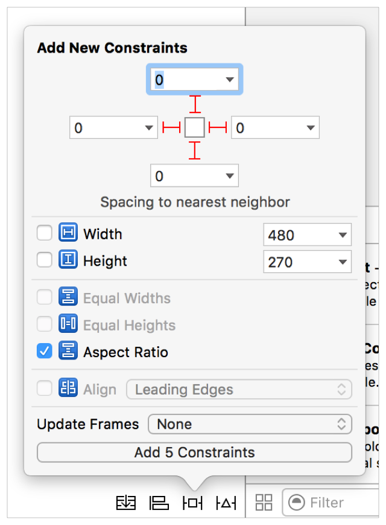
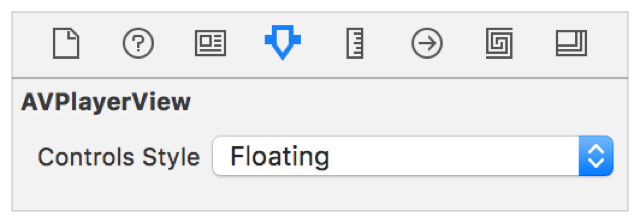

> 导航：[总目录](../../../README.md) · [documentation](../../../_indexes/documentation.md) · [Media Playback Programming Guide](About%20Media%20Playback.md)


[Next](Configuring%20Audio%20Settings%20for%20iOS%20and%20tvOS.md)[Previous](About%20Media%20Playback.md)

# Building a Basic Playback App

The best way for you to learn AVKit and AVFoundation is to dive in and build your first playback app. This chapter shows you how to get started with these frameworks by walking you through the development of a basic app for iOS, tvOS, and macOS to play media served using HTTP Live Streaming. This project requires that you be familiar with developing apps for at least one of these platforms. For more information, see _[Start Developing iOS Apps (Swift)](https://developer.apple.com/library/archive/referencelibrary/GettingStarted/DevelopiOSAppsSwift/index.html#//apple_ref/doc/uid/TP40015214)_ and _[Mac App Programming Guide](../../General/Mac%20App%20Programming%20Guide/About%20OS%20X%20App%20Design.md#apple-f4xwc4dqnrsv64tfmyxwi33df52wszbpkridimbqgeydknbt)_. The example projects in this chapter are written in Swift 3 and require Xcode 8.0 or later.

Create a new Xcode project for an iOS or tvOS app using the Single View Application template.

- Product Name: `AVBasicPlayback`
- Language: Swift
- Devices: Universal (iOS only)

Begin by configuring the project’s [App Transport Security](https://developer.apple.com/library/archive/releasenotes/General/WhatsNewIniOS/Articles/iOS9.html#//apple_ref/doc/uid/TP40016198-SW14) so your app can successfully connect to the remote server.

1. In the project navigator, locate the app’s `Info.plist` file. Right-click this file and select Open As > Source Code.
2. Add the following entry before the closing `</dict>` tag:

```
<key>NSAppTransportSecurity</key>
<dict>
    <key>NSExceptionDomains</key>
    <dict>
        <key>devimages-cdn.apple.com</key>
        <dict>
            <key>NSExceptionRequiresForwardSecrecy</key>
            <false/>
        </dict>
    </dict>
</dict>
```

   Adding this entry ensures that the app can successfully retrieve the media served from `devimages.apple.com.edgekey.net`.

1. Open the `AppDelegate.swift` class. Above the class definition, import the AVFoundation framework.

```
import AVFoundation
```
2. In the `application:didFinishLaunchingWithOptions:` method, set the app’s audio session category to `AVAudioSessionCategoryPlayback`.

```swift
func application(_ application: UIApplication,
                 didFinishLaunchingWithOptions launchOptions: [UIApplicationLaunchOptionsKey: Any]?) -> Bool {

    let audioSession = AVAudioSession.sharedInstance()
    do {
        try audioSession.setCategory(AVAudioSessionCategoryPlayback)
    }
    catch {
        print("Setting category to AVAudioSessionCategoryPlayback failed.")
    }

    return true
}
```

   Setting the audio session category ensures that the application has the audio behavior expected of a media playback app.

1. Select the `Main.storyboard` file. In the Object library’s search field, type `button` to find the `Button` object.
2. Drag the `Button` object into the View Controller Scene’s view and give it the title `Play Video`.
3. Add alignment constraints so the button is centered both horizontally and vertically.

   

1. In the project navigator, select the `Main.storyboard` file and open the assistant editor.
2. Control-drag from the `Play Video` button to the `ViewController.swift` class to add a new `@IBAction` method called `playVideo`.

```swift
@IBAction func playVideo(_ sender: AnyObject) {
    // TODO
}
```
3. Close the assistant editor and select the `ViewController.swift` class in the project navigator. Above the class definition, import the AVKit and AVFoundation frameworks.

```
import AVKit
import AVFoundation
```
4. In the `playVideo` method, add the following implementation:

```swift
@IBAction func playVideo(_ sender: AnyObject) {
    guard let url = URL(string: "https://devimages-cdn.apple.com/samplecode/avfoundationMedia/AVFoundationQueuePlayer_HLS2/master.m3u8") else {
        return
    }
    // Create an AVPlayer, passing it the HTTP Live Streaming URL.
    let player = AVPlayer(url: url)

    // Create a new AVPlayerViewController and pass it a reference to the player.
    let controller = AVPlayerViewController()
    controller.player = player

    // Modally present the player and call the player's play() method when complete.
    present(controller, animated: true) {
        player.play()
    }
}
```

Your app is complete, and you can run it in the Simulator or on your iOS or tvOS device. In only a few lines of code, you’ve created a full-featured playback app.

Create a new Xcode project for a Cocoa app using the Cocoa Application template.

- Product Name: `AVBasicPlayback`
- Language: Swift
- Use Storyboards: true
- Create Document-Based Application: false

Begin by configuring the project’s [App Transport Security](https://developer.apple.com/library/archive/releasenotes/General/WhatsNewIniOS/Articles/iOS9.html#//apple_ref/doc/uid/TP40016198-SW14) so your app can successfully connect to the remote server.

1. In the project navigator, locate the app’s `Info.plist` file. Right-click this file and select Open As > Source Code.
2. Add the following entry before the closing `</dict>` tag:

```
<key>NSAppTransportSecurity</key>
<dict>
    <key>NSExceptionDomains</key>
    <dict>
        <key>devimages-cdn.apple.com</key>
        <dict>
            <key>NSExceptionRequiresForwardSecrecy</key>
            <false/>
        </dict>
    </dict>
</dict>
```

   Adding this entry ensures that the app can successfully retrieve the media served from `devimages.apple.com.edgekey.net`.

1. In the project navigator, select the `Main.storyboard` file. In the Object library’s search field, type `player` to find the `AVKit Player View` object.
2. Drag the `AVKit Player View` object into the View Controller Scene’s view.
3. Add pinning constraints to the player view to pin it to its superview’s edges and maintain its aspect ratio.

   
4. Select the player view. In the Attributes inspector, change the Controls Style selection to Floating.

   This style presents controls matching the ones found in Quicktime Player.

   

1. While in the `Main.storyboard` file, open the assistant editor.
2. Control-drag from the player view object to the `ViewController.swift` class and add a new `@IBOutlet` called `playerView`.

```swift
@IBOutlet weak var playerView: AVPlayerView!
```
3. Close the assistant editor and select the `ViewController.swift` class in the project navigator. Above the class definition, import the AVKit and AVFoundation frameworks.

```
import AVKit
import AVFoundation
```
4. In the `viewDidLoad` method, add the following implementation:

```swift
override func viewDidLoad() {
    super.viewDidLoad()
    guard let url = URL(string: "https://devimages-cdn.apple.com/samplecode/avfoundationMedia/AVFoundationQueuePlayer_HLS2/master.m3u8") else {
        return
    }
    // Create a new AVPlayer and associate it with the player view
    let player = AVPlayer(url: url)
    playerView.player = player

}
```

Your app is complete, and you can run it. In only a few lines of code, you’ve created a full-featured playback app.

[Next](Configuring%20Audio%20Settings%20for%20iOS%20and%20tvOS.md)[Previous](About%20Media%20Playback.md)

