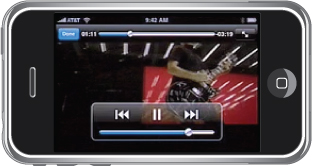

> 导航：[总目录](../../../README.md) · [documentation](../../../_indexes/documentation.md) · [Multimedia Programming Guide](About%20Audio%20and%20Video.md)


[Next](Document%20Revision%20History.md)[Previous](Using%20Audio.md)

# Using Video

Starting in iOS 3.0, you can record video, with included audio, on supported devices. To display the video recording interface, create and push a [UIImagePickerController](https://developer.apple.com/documentation/uikit/uiimagepickercontroller) object, just as for displaying the still-camera interface.

To record video, you must first check that the camera source type ([UIImagePickerControllerSourceTypeCamera](https://developer.apple.com/documentation/uikit/uiimagepickercontroller/sourcetype/camera)) is available and that the movie media type (`kUTTypeMovie`) is available for the camera. Depending on the media types you assign to the `mediaTypes` property, the picker can directly display the still camera or the video camera, or a selection interface that lets the user choose.

Using the [UIImagePickerControllerDelegate](https://developer.apple.com/documentation/uikit/uiimagepickercontrollerdelegate) protocol, register as a delegate of the image picker. Your delegate object receives a completed video recording by way of the [imagePickerController:didFinishPickingMediaWithInfo:](https://developer.apple.com/documentation/uikit/uiimagepickercontrollerdelegate/1619126-imagepickercontroller) method.

On supported devices, you can also pick previously-recorded videos from a user’s photo library.

For more information on using the image picker class, see _[UIImagePickerController Class Reference](https://developer.apple.com/documentation/uikit/uiimagepickercontroller)_. For information on trimming recorded videos, see _[UIVideoEditorController Class Reference](https://developer.apple.com/documentation/uikit/uivideoeditorcontroller)_ and _[UIVideoEditorControllerDelegate Protocol Reference](https://developer.apple.com/documentation/uikit/uivideoeditorcontrollerdelegate)_.

In iOS 4.0 and later, you can record from a device’s camera and display the incoming data live on screen. You use [AVCaptureSession](https://developer.apple.com/documentation/avfoundation/avcapturesession) to manage data flow from inputs represented by [AVCaptureInput](https://developer.apple.com/documentation/avfoundation/avcaptureinput) objects (which mediate input from an [AVCaptureDevice](https://developer.apple.com/documentation/avfoundation/avcapturedevice)) to outputs represented by [AVCaptureOutput](https://developer.apple.com/documentation/avfoundation/avcaptureoutput).

In iOS 4.0 and later, you can edit, assemble, and compose video using existing assets or with new raw materials. Assets are represented by [AVAsset](https://developer.apple.com/documentation/avfoundation/avasset), which you can inspect asynchronously for better performance. You use [AVMutableComposition](https://developer.apple.com/documentation/avfoundation/avmutablecomposition) to compose media from one or more sources, then [AVAssetExportSession](https://developer.apple.com/documentation/avfoundation/avassetexportsession) to encode output of a composition for delivery.

iOS supports the ability to play back video files directly from your application using the Media Player framework, described in _[Media Player Framework Reference](https://developer.apple.com/documentation/mediaplayer)_. Video playback is supported in full screen mode only and can be used by game developers who want to play short animations or by any developers who want to play media files. When you start a video from your application, the media player interface takes over, fading the screen to black and then fading in the video content. You can play a video with or without user controls for adjusting playback. Enabling some or all of these controls (shown in Figure 2-1) gives the user the ability to change the volume, change the playback point, or start and stop the video. If you disable all of these controls, the video plays until completion.

__Figure 2-1__  Media player interface with transport controls



To initiate video playback, you must know the URL of the file you want to play. For files your application provides, this would typically be a pointer to a file in your application’s bundle; however, it can also be a pointer to a file on a remote server. Use this URL to [instantiate](https://developer.apple.com/library/archive/documentation/General/Conceptual/DevPedia-CocoaCore/ObjectCreation.html#//apple_ref/doc/uid/TP40008195-CH39) a new instance of the [MPMoviePlayerController](https://developer.apple.com/documentation/mediaplayer/mpmovieplayercontroller) class. This class presides over the playback of your video file and manages user interactions, such as user taps in the transport controls (if shown). To start playback, call the `play` method described in _[MPMediaPlayback Protocol Reference](https://developer.apple.com/documentation/mediaplayer/mpmediaplayback)_.

Listing 2-1 shows a sample method that plays back the video at a specified URL. The play method is an asynchronous call that returns control to the caller while the movie plays. The movie controller loads the movie in a full-screen view, and animates the movie into place on top of the application’s existing content. When playback is finished, the movie controller sends a [notification](https://developer.apple.com/library/archive/documentation/General/Conceptual/DevPedia-CocoaCore/Notification.html#//apple_ref/doc/uid/TP40008195-CH35) received by the application [controller object](https://developer.apple.com/library/archive/documentation/General/Conceptual/DevPedia-CocoaCore/ControllerObject.html#//apple_ref/doc/uid/TP40008195-CH11), which releases the movie controller now that it is no longer needed.

__Listing 2-1__  Playing full-screen movies

```objc
-(void) playMovieAtURL: (NSURL*) theURL {

    MPMoviePlayerController* theMovie =
                [[MPMoviePlayerController alloc] initWithContentURL: theURL];

    theMovie.scalingMode = MPMovieScalingModeAspectFill;
    theMovie.movieControlMode = MPMovieControlModeHidden;

    // Register for the playback finished notification
    [[NSNotificationCenter defaultCenter]
                    addObserver: self
                       selector: @selector(myMovieFinishedCallback:)
                           name: MPMoviePlayerPlaybackDidFinishNotification
                         object: theMovie];

    // Movie playback is asynchronous, so this method returns immediately.
    [theMovie play];
}

// When the movie is done, release the controller.
-(void) myMovieFinishedCallback: (NSNotification*) aNotification
{
    MPMoviePlayerController* theMovie = [aNotification object];

    [[NSNotificationCenter defaultCenter]
                    removeObserver: self
                              name: MPMoviePlayerPlaybackDidFinishNotification
                            object: theMovie];

    // Release the movie instance created in playMovieAtURL:
    [theMovie release];
}
```

For a list of supported video formats, see _iOS Technology Overview_.

In iOS 4.0 and later, you can play video using [AVPlayer](https://developer.apple.com/documentation/avfoundation/avplayer) in conjunction with an [AVPlayerLayer](https://developer.apple.com/documentation/avfoundation/avplayerlayer) or an [AVSynchronizedLayer](https://developer.apple.com/documentation/avfoundation/avsynchronizedlayer) object. You can use [AVAudioMix](https://developer.apple.com/documentation/avfoundation/avaudiomix) and [AVVideoComposition](https://developer.apple.com/documentation/avfoundation/avvideocomposition) to customize the audio and video parts of playback respectively. You can also use [AVCaptureVideoPreviewLayer](https://developer.apple.com/documentation/avfoundation/avcapturevideopreviewlayer) to display video as it is being captured by an input device.

[Next](Document%20Revision%20History.md)[Previous](Using%20Audio.md)

