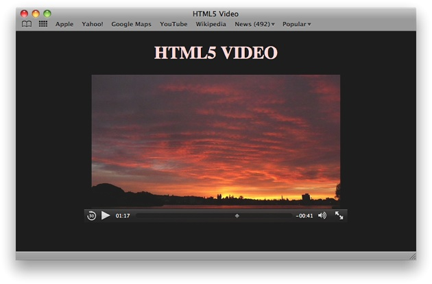

> 导航：[总目录](../../../README.md) · [documentation](../../../_indexes/documentation.md)


[Next](Audio%20and%20Video%20HTML.md)

# About HTML5 Audio and Video

If you embed audio or video in your website, you should use HTML5.

HTML5 is the next major version of HTML, the primary standard that determines how web content interacts with browsers. HTML5 supports audio and video playback natively in the browser, without requiring a plug-in. With HTML5, you can add media to a webpage with just a line or two of code.

The HTML5 media elements provide simple fallback for browsers that still need to use plug-ins, so you can update your website to HTML5 today and still be compatible with older browsers.

When you use HTML5, you can create your own customized media controllers for rich interactivity using web-standard CSS and JavaScript.

The HTML5 `<audio>` and `<video>` tags make it simple to add media to your website. Just include the `<audio>` or `<video>` element, use the `src` attribute to identify the media source, and include the `controls` attribute.

`<video src="mymovie.mp4" controls></video>`

There are no plug-ins to install or configure. The audio or video downloads and plays in your webpage with built-in controls.



In Safari, the built-in video controls include a play/pause button, volume control, and a time scrubber. In Safari 5.0 and later on the desktop and on iOS 4.2 on the iPad, the controls also include a full-screen playback toggle on the lower right. The controls automatically fade out when the video is playing and fade in when the user hovers over the video or touches it.

If you want to provide your own media controller on the desktop or iPad, just leave out the `controls` attribute. HTML5 media elements expose a full set of methods, properties, and events to JavaScript for interactivity, and because the media elements are HTML, they can be styled using CSS to create exactly the look and feel you want.

In Safari 5.1 and later, you can choose any HTML element and expand it to fill the screen, allowing you to use your own custom controls while playing video in full-screen mode.

Safari supports the `<video>` and `<audio>` media elements on iOS 3.0 and later and in Safari 3.1 and later on the desktop (Mac OS X and Windows). Support for these media elements allows Safari and other HTML5-compliant browsers to play the indicated source media without using a plug-in.

To get the most out of HTML5 audio and video, you should first learn to create the HTML media elements, then learn how to control them using JavaScript, and finally learn to apply CSS styles to media elements and modify styles dynamically using JavaScript.

### Create the HTML5 Media Elements

To use HTML5 audio or video, start by creating an `<audio>` or `<video>` element, specifying a source URL for the media, and including the `controls` attribute.

```
<video src="http://example.com/path/mymovie.mp4" controls></video>
```


#### Add Optional Attributes

You can set additional attributes to tell Safari that the media should autoplay or loop, for example, or specify a video height and width. You set boolean attributes such as `controls` or `autoplay` by including or omitting them—no value is required.

```
<video src="mymovie.mp4"
       controls autoplay height="480" width="640">
</video>
```

For more information, see [Working with Attributes](Audio%20and%20Video%20HTML.md#apple-f4xwc4dqnrsv64tfmyxwi33df52wszbpkridimbqga4tkmrtfvbuqmrnknltm).

#### Provide Alternate Sources

Not all browsers can play all media sources. Some browsers are able to play MPEG-4 or MP3 files, while others play only files compressed using codecs such as Ogg Vorbis. Desktop computers can typically play media using a wider assortment of compressors than mobile devices. Safari supports streaming delivery using HTTP Live Streaming, while some other browsers support only HTTP download. To provide the best experience for everyone, you can provide multiple versions of your media. List the sources in order of preference using separate `<source>` tags. The browser iterates through the list and plays the first source that it can.

```
<audio controls>
    <source src="http://example.com/mysong.aac">
    <source src="mysong.oga">
</audio>
```

You don’t have to rely on the file extension and delivery scheme to tell Safari about the media file. The `<source>` tag accepts attributes for MIME type and codecs as well. For details, see [Providing Multiple Sources](Audio%20and%20Video%20HTML.md#apple-f4xwc4dqnrsv64tfmyxwi33df52wszbpkridimbqga4tkmrtfvbuqmrnknltemi).

#### Fall Back in Good Order

Browsers that don’t support HTML5 ignore the `<audio>` and `<video>` tags, and HTML5-savvy browsers ignore anything between the opening and closing tags except `<source>` tags, so it’s easy to specify fallback behavior for older browsers. Just put the fallback HTML between the opening and closing `<audio>` or `<video>` tags (after any `<source>` tags).

```
<video src="mymovie.mov" controls>
       <!-- fallback -->
       <p>Your browser does not support HTML5 video.</p>
</video>
```

Your fallback can be an `<object>` tag for a browser that needs a plug-in to play your media, a redirect to another page, or a simple error message telling the user what the problem is.

For more information, including examples of how to use a plug-in as a fallback, see [Specifying Fallback Behavior](Audio%20and%20Video%20HTML.md#apple-f4xwc4dqnrsv64tfmyxwi33df52wszbpkridimbqga4tkmrtfvbuqmrnknltcmy).

### Take Control Using JavaScript

HTML5 media elements expose methods, properties, and events to JavaScript. There are methods for playing, pausing, and changing the media source URL dynamically. There are properties—such as duration, volume, and playback rate—that you can read or set (some properties are read-only). In addition, there are DOM events that notify you, for example, when a media element is able to play through, begins to play, is paused by the user, or completes.

For a complete list of methods, properties, and events that Safari supports, see _[HTMLMediaElement Class Reference](https://developer.apple.com/documentation/webkitjs/htmlmediaelement)_, _[HTMLVideoElement Class Reference](https://developer.apple.com/documentation/webkitjs/htmlvideoelement)_, and _[HTMLAudioElement Class Reference](https://developer.apple.com/documentation/webkitjs/htmlaudioelement)_.

You can use JavaScript with HTML5 media elements to:

- Create your own interactive audio or video controller—for an example, see [A Simple JavaScript Media Controller and Resizer](Controlling%20Media%20with%20JavaScript.md#apple-f4xwc4dqnrsv64tfmyxwi33df52wszbpkridimbqga4tkmrtfvbuqmznknltcmi).
- Display a progress indicator that shows how much of the media has downloaded—for an example, see [Using DOM Events to Monitor Load Progress](Controlling%20Media%20with%20JavaScript.md#apple-f4xwc4dqnrsv64tfmyxwi33df52wszbpkridimbqga4tkmrtfvbuqmznknlti).
- Load another audio or video when the current one finishes playing—for an example, see [Replacing a Media Source Sequentially](Controlling%20Media%20with%20JavaScript.md#apple-f4xwc4dqnrsv64tfmyxwi33df52wszbpkridimbqga4tkmrtfvbuqmznknltk).
- Slave multiple audio and/or video elements to a master controller to ensure your media elements are always synchronized—for an example, see [Syncing Multiple Media Elements Together](Controlling%20Media%20with%20JavaScript.md#apple-f4xwc4dqnrsv64tfmyxwi33df52wszbpkridimbqga4tkmrtfvbuqmznknlteni).
- Test whether Safari can play the specified media type or file—for examples, see [Using JavaScript to Provide Fallback Content](Controlling%20Media%20with%20JavaScript.md#apple-f4xwc4dqnrsv64tfmyxwi33df52wszbpkridimbqga4tkmrtfvbuqmznknltg) and [Handling Playback Failure](Controlling%20Media%20with%20JavaScript.md#apple-f4xwc4dqnrsv64tfmyxwi33df52wszbpkridimbqga4tkmrtfvbuqmznknltcmq).
- Enter full-screen video mode—for examples, see [Taking Video Full Screen](Controlling%20Media%20with%20JavaScript.md#apple-f4xwc4dqnrsv64tfmyxwi33df52wszbpkridimbqga4tkmrtfvbuqmznknltcmy) and [Taking Your Custom Controls Full Screen](Controlling%20Media%20with%20JavaScript.md#apple-f4xwc4dqnrsv64tfmyxwi33df52wszbpkridimbqga4tkmrtfvbuqmznknltema).

### Set the Style with CSS3

Because the `<audio>` and `<video>` elements are standard HTML, you can customize them using CSS—set the background color, control opacity, add a reflection, move the element smoothly across the screen, or even rotate it in 3D. You can combine CSS with JavaScript to change media properties dynamically, in response to user input or movie events.

You can also change the CSS properties of other parts of your webpage in response to media events. For example, you could darken the background and reduce the opacity of the rest of the page—effectively “dimming the lights”—when a movie is playing, or highlight the title of the currently-playing song in a playlist.

For more information, see [Changing Styles in Response to Media Events](Adding%20CSS%20Styles.md#apple-f4xwc4dqnrsv64tfmyxwi33df52wszbpkridimbqga4tkmrtfvbuqnbnknlte) and [Adding CSS Styles to Video](Adding%20CSS%20Styles.md#apple-f4xwc4dqnrsv64tfmyxwi33df52wszbpkridimbqga4tkmrtfvbuqnbnknltg).

For code examples, see [Example: Setting Opacity](Adding%20CSS%20Styles.md#apple-f4xwc4dqnrsv64tfmyxwi33df52wszbpkridimbqga4tkmrtfvbuqnbnknltm), [Adding a Mask](Adding%20CSS%20Styles.md#apple-f4xwc4dqnrsv64tfmyxwi33df52wszbpkridimbqga4tkmrtfvbuqnbnknlto), [Adding a Reflection](Adding%20CSS%20Styles.md#apple-f4xwc4dqnrsv64tfmyxwi33df52wszbpkridimbqga4tkmrtfvbuqnbnknltq), and [Rotating Video in 3D](Adding%20CSS%20Styles.md#apple-f4xwc4dqnrsv64tfmyxwi33df52wszbpkridimbqga4tkmrtfvbuqnbnknlts).

You should be familiar with HTML and JavaScript. Familiarity with CSS is helpful. To create image masks, you should be able to work with transparency (alpha channels).

- _[Safari DOM Additions Reference](https://developer.apple.com/documentation/webkitjs)_—DOM events, JavaScript functions and properties added to Safari to support HTML5 audio and video, touch events, and CSS transforms and transitions.
- _[Safari CSS Visual Effects Guide](../../Internet%20Web/Safari%20CSS%20Visual%20Effects%20Guide/Introduction.md#apple-f4xwc4dqnrsv64tfmyxwi33df52wszbpkridimbqga4damzs)_—How to use CSS transitions and effects in Safari.
- _[Safari CSS Reference](../../Apple%20Applications/Safari%20CSS%20Reference/Introduction%20to%20Safari%20CSS%20Reference.md#apple-f4xwc4dqnrsv64tfmyxwi33df52wszbpkridimbqgazdanjq)_—Complete list of CSS properties, rules, and property functions supported in Safari, with syntax and usage.
- _[Safari HTML Reference](../../Apple%20Applications/Safari%20HTML%20Reference/Introduction.md#apple-f4xwc4dqnrsv64tfmyxwi33df52wszbpkridimbqgazdanbz)_—The HTML elements and attributes supported by different Safari and WebKit applications.
- _[WebKit DOM Programming Topics](https://developer.apple.com/library/archive/documentation/AppleApplications/Conceptual/SafariJSProgTopics/index.html#//apple_ref/doc/uid/TP40001483)_—How to get the most out of using DOM events in Safari.
- _iOS Human Interface Guidelines_—User interface guidelines for designing webpages and web applications for Safari on iOS.
[Next](Audio%20and%20Video%20HTML.md)

