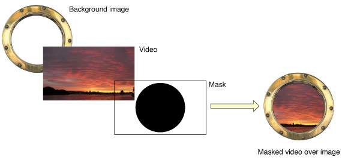
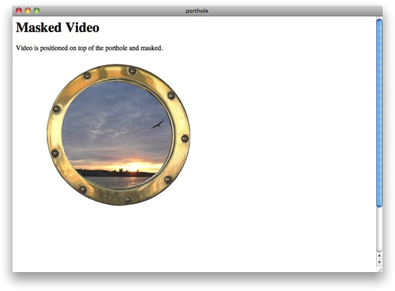
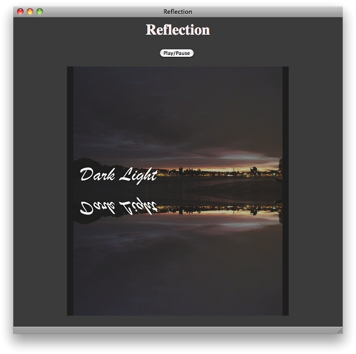

> 导航：[总目录](../../../README.md) · [documentation](../../../_indexes/documentation.md) · [Safari HTML5 Audio and Video Guide](About%20HTML5%20Audio%20and%20Video.md)


[Next](Document%20Revision%20History.md)[Previous](Controlling%20Media%20with%20JavaScript.md)

# Adding CSS Styles

Because the `<video>` element is standard HTML, you can modify its appearance and behavior using CSS styles. You can modify the opacity, add a border, position the element dynamically on the page, and much more. You can also use CSS styles to enhance elements that interact with audio or video, such as custom controllers and progress bars. In addition, you can listen for media events in JavaScript and change the properties of other website elements in response.

This chapter illustrates some methods of adding CSS styles to video, as well as how to modify the style of non-video elements in response to media events. For more information on using CSS styles in Safari, see _[Safari CSS Visual Effects Guide](../../Internet%20Web/Safari%20CSS%20Visual%20Effects%20Guide/Introduction.md#apple-f4xwc4dqnrsv64tfmyxwi33df52wszbpkridimbqga4damzs)_, _Safari Graphics, Media, and Visual Effects Coding How-To's_, and _[Safari CSS Reference](../../Apple%20Applications/Safari%20CSS%20Reference/Introduction%20to%20Safari%20CSS%20Reference.md#apple-f4xwc4dqnrsv64tfmyxwi33df52wszbpkridimbqgazdanjq)_.

You can use JavaScript to modify the style of website elements in response to media events. For example, you could update a music playlist and highlight the name of the song currently being played. The example in [Listing 5-1](#apple-f4xwc4dqnrsv64tfmyxwi33df52wszbpkridimbqga4tkmrtfvbuqnbnknltk) changes the webpage styles when a movie is playing—darkening the background and fading the rest of the webpage by making it partly transparent—then restores things when the movie is paused or completes. Figures III-1 and III-2 show the webpage with the movie playing and paused.

__Figure 5-1__  Page with movie paused

!!

__Figure 5-2__  Page with movie playing

!!

The example listens for the `playing`, `pause`, and `ended` events. When the `playing` event fires, a function stores the current background color, sets the background color to black, and sets the opacity of the rest of the page to 0.25. When the `pause` or `ended` event fires, a second function restores the background color and sets the opacity to 1.

Note that the `<style>` section of the page sets the `webkit-transition-property` and `webkit-transition-duration` for the background color and opacity, so these properties change smoothly over a few seconds instead of changing abruptly. The background color and opacity change work in any HTML5-compliant browser, but the gradual state change happens only in Safari and other WebKit-based browsers.

Alternatively, you could set a JavaScript timer and darken the background and reduce the page opacity incrementally over several steps.

__Listing 5-1__  Dim the lights

```
<!doctype html>
<html>
<head>
    <title>Dim the Lights</title>
    <script type="text/javascript">
        var restoreColor;
        function dimLights() {
            restoreColor = document.body.style.backgroundColor;
            var theBody = document.body;
            theBody.style.backgroundColor = "black";
            var theRest = document.getElementById("restofpage");
            theRest.style.opacity = 0.25;
        }
        function lightsUp() {
            var theBody = document.body;
            theBody.style.backgroundColor = restoreColor;
            var theRest = document.getElementById("restofpage");
            theRest.style.opacity = 1;
       }
        function addListener() {
            var myVideo = document.getElementsByTagName('video')[0];
            myVideo.addEventListener('playing', dimLights, false);
            myVideo.addEventListener('pause', lightsUp, false);
            myVideo.addEventListener('ended', lightsUp, false);
        }
    </script>
    <style>
        body {
            background-color: #888888;
            color: #ffdddd;
            text-shadow: 0.1em 0.1em #333;
            -webkit-transition-property: background-color;
            -webkit-transition-duration: 4s;
        }
        #restofpage {
           color: #ffffff;
            width: 640px;
            -webkit-transition-property: opacity;
            -webkit-transition-duration: 4s;
        }
    </style>
</head>
<body onload="addListener()">
    <div align="center">
        <h1>Dim the Lights, Please</h1>
        <video id="player" controls
            src="http://homepage.mac.com/qt4web/myMovie.m4v">
        </video>
        <div id="restofpage">
            <h3 style="color:#ffdddd;" >
            This webpage uses HTML5 video, JavaScript, DOM events, and CSS.
            </h3>
            <p>
             When the video starts playing, a DOM event is fired, and a JavaScript
            function "dims the lights" by fading the webpage background color
            to black and lowering the opacity of the rest of the page.
            </p>
            <p>
            When the video pauses or ends, another event is fired and a second
            JavaScript function brings the lights back up.
            </p>
            <p>
            Try it!
            </p>
        </div>
    </div>
</body>
</html>
```


You can use CSS to apply styles to the video element itself. For example, you can change the video opacity, position the video on top of another element, or add a border.

To allow elements under the video to show through, set the opacity of the video. Opacity has a range from 0 (completely transparent) to 1 (completely opaque). You can set opacity directly in CSS—applying it to video generally, or to a class of video, or to a particular video element:

Declaring the opacity of the `video` element: `video { opacity: 0.5 }`

Declaring the opacity of a class: `.seeThroughVideo { opacity: 0.3 }`

Declaring the opacity of an element using its ID: `#theVideo { opacity: 0.7 }`

To change video opacity dynamically, use JavaScript. You can address the video element by ID or tag name, and you can set the opacity property either directly or by changing the element’s class name to a class with a style applied to it.

The following code snippet declares the opacity of a class. The snippet then defines a JavaScript function that sets a video element’s classname to the declared class. A second JavaScript function illustrates setting the opacity of a video element directly, instead of changing the classname.

```
<style>
    .seeThroughVideo { opacity: 0.3 }
</style>

<script type="text/javascript">
    function makeSeeThrough() {
        document.getElementById("theVideo").className = "seeThroughVideo";
    }
    function setOpacityDirectly (val) {
        document.getElementsByTagName("video")[0].style.opacity = val;
    }
</script>
```


In addition to the standard CSS properties, you can apply WebKit properties to video in Safari or other WebKit-based browsers. WebKit properties are prefixed with `-webkit-`. Many CSS properties begin as WebKit properties, are proposed as CSS standards, and go through review before becoming standardized. When and if a WebKit property becomes a standard property, `-webkit-` is dropped from the name. The `-webkit-` prefixed version is maintained for backward compatibility, however.

You can safely add CSS properties that have the `-webkit-` prefix to your webpages. WebKit-based browsers, such as Safari and Chrome, recognize these prefixed properties. Other browsers just ignore them. Use CSS properties with the `-webkit-` prefix to enhance general websites, but verify that your site still looks good using other browsers, unless your site is Safari-specific or designed solely for iOS devices.

Four noteworthy WebKit properties are filters, masks, reflections, and 3D rotation. These CSS properties are available to other HTML elements as well, not just videos.

Safari 6 and later supports CSS filters, or special visual effects, that you can apply to many elements, including videos (see [Figure 5-3](#apple-f4xwc4dqnrsv64tfmyxwi33df52wszbpkridimbqga4tkmrtfvbuqnbnknltemi)). These hardware-accelerated filters (such as brightness, contrast, saturation, and blur) can be stacked on top of and animated against one another. Read [CSS Property Functions](https://developer.apple.com/library/archive/documentation/AppleApplications/Reference/SafariCSSRef/Articles/Functions.html#//apple_ref/doc/uid/TP40007955) in _[Safari CSS Reference](../../Apple%20Applications/Safari%20CSS%20Reference/Introduction%20to%20Safari%20CSS%20Reference.md#apple-f4xwc4dqnrsv64tfmyxwi33df52wszbpkridimbqgazdanjq)_ to find out more about CSS filters.

__Figure 5-3__  CSS filters on a video

!!

The video above has a hue-rotation and saturation, as described in [Listing 5-2](#apple-f4xwc4dqnrsv64tfmyxwi33df52wszbpkridimbqga4tkmrtfvbuqnbnknltemq).

__Listing 5-2__  Applying CSS filters to HTML elements

```
<!doctype html>
<html>
<head>
    <title>Filters</title>
    <style>
        video {
            float: left;
            width: 50%;
        }
        .filtered {
            -webkit-filter: hue-rotate(180deg)
                            saturate(200%);
        }
    </style>
</head>
<body>
    <h1>Video with and without CSS filters</h1>
    <p>The video on the left does not have CSS filters applied, while the video on the right does.</p>
    <p>These videos are playing from the same source file.</p>
    <video src="shuttle.m4v" autoplay></video>
    <video src="shuttle.m4v" autoplay class="filtered"></video>
</body>
</html>
```


You can make a video element appear non-rectangular or discontinuous by masking part of the video out using `-webkit-mask-box-image`. Specify an image to use as a mask. The mask image should have the same dimensions as the video, be opaque where you want the video to show, and be transparent where you want the video to be hidden. Making areas of the mask semi-opaque makes the corresponding areas of the video proportionally semi-transparent.

The following example uses CSS to position a video over the image of a porthole, then masks the video with a circular image so the movie appears to be seen through the porthole.



```
<!doctype html>
<html>
<head>
    <title>porthole</title>
</head>
<body>
    <h1>Video with Filters</h1>
    <p>
    Video is saturated and blurred with CSS filters.
    </p>
    

    <video src="myMovie.m4v" autoplay
           style="position:relative; top:-325px;
                  -webkit-mask-box-image: url(portholemask.png);">
    </video>
</body>
</html>
```



Add a reflection of a video using the `-webkit-box-reflect` property. Specify whether the reflection should appear on the left, right, above, or below the video, and specify any offset space between the video and the reflection. The following snippet adds a reflection immediately below the video.

```
<video src="myMovie.m4v" autoplay style="-webkit-box-reflect: below 0px;">
```



If you set the `controls` attribute, the video controls will also appear mirrored in the reflection. Since the mirrored controls are backwards and nonfunctional, this is not usually what you want. Video reflections are best used with a JavaScript controller.

You can mask out part of the reflection by including the url of a mask image. The following example adds a masked reflection below the video.

```
<!doctype html>
<html>
<head>
    <title>Reflection with Mask</title>
    <script type="text/javascript">

    function playPause() {
    var myVideo = document.getElementById('theVideo');
    if (myVideo.paused)
        myVideo.play();
    else myVideo.pause();
    }
    </script>
</head>
<body align="center" style = "background-color: 404040">
    <h1 style="color:#ffeeee">
    Reflection with Mask
    </h1>
    <input type="button" value="Play/Pause" onclick="playPause()">
    <BR><BR>
    <video  src = "myMovie.m4v" id = "theVideo"
    style = "-webkit-box-reflect: below 0px url(mask.png);">
    </video>
</body>
</html>
```


__Figure 5-4__  Reflection with mask image

!!

__Figure 5-5__  Mask image

!

You can specify a gradient instead of an image to mask the reflection. The following snippet creates a gradient that fades to transparency.

`<video style="-webkit-box-reflect: below 0px`

`-webkit-gradient(linear, left top, left bottom, from(transparent), to(black));">`

Because the gradient is reflected, it is specified from transparent to black—its reflection goes from black to transparent. Because the gradient is a mask, only its opacity matters. It could also be specified from transparent to white.

The following snippet adds a color-stop to the gradient, causing it to reach transparency at four-tenths of its length.

`<video style="-webkit-box-reflect: below 0px`

`-webkit-gradient(linear, left top, left bottom, from(transparent), to(black),`

`color-stop(0.4, transparent));">`

__Figure 5-6__  Reflection with gradient mask and color stop

!!

You can use WebKit CSS properties to rotate video around the x or y axis. Rotating the video 180° allows the user to see it playing from “behind”. Rotating the video 90° causes it to play edge-on, making it invisible and revealing whatever is behind it. Rotation can be set statically using CSS or dynamically using JavaScript. The following snippet sets the video rotation at 45° about the y axis.

`<video style="-webkit-transform: rotateY(45deg);" src="myVideo.m4v" controls>`

Dynamic rotation is best used in conjunction with the `webkit-transition` property. Setting `webkit-transition` causes the video element to rotate smoothly over a specified duration, without having to set JavaScript timers or stepper functions. You set the transition property, specify the duration, and any time you change the specified property, the change is animated smoothly over the specified duration. The property to animate for rotation is `-webkit-transform`. When the animation completes, a `webkitTransitionEnd` event is fired.

The following snippet sets the transition property to `-webkit-transform` and sets the animation duration to 4 seconds.

```
<video src="myVideo.m4v" controls
style="-webkit-transition-property: -webkit-transform;
-webkit-transition-duration: 4s">
```

You can add perspective to the rotation, so that parts of the video element closer to the viewer along the z axis appear larger, and parts further away appear smaller. To add perspective, set the `-webkit-perspective` property of one of the video element’s parents, such as a parent `div` or the document body.

Listing 5-3 dynamically flips a playing video 180° around its y axis, intermittently revealing the text behind the video. The video has perspective when it rotates, due to the `-webkit-perspective` property of the `body` element.

__Listing 5-3__  3D rotation with perspective

```
<!doctype html>
<html>
<head>
    <title>Video Flipper</title>
    <style>
        video {
            -webkit-transition-property: -webkit-transform;
            -webkit-transition-duration: 4s;
        }
        body { -webkit-perspective: 500; }
    </style>
    <script type="text/javascript">
        var flipped = 0;
        function flipper() {
            if (flipped)
                myVideo.style.webkitTransform = "rotateY(0deg)";
            else
                myVideo.style.webkitTransform = "rotateY(180deg)";
            flipped = !flipped ;
        }
    </script>
</head>
<body>
    <h1>Video Flipper</h1>
    <p>Text hidden behind the video.</p>
    <div style="position:relative; top:-40px;">
        <video src="myMovie.m4v" id="myVideo" autoplay controls>
        </video>
        <input type="button" value="Flip Video" onclick="flipper()">
    </div>
</body>
</html>
```


__Figure 5-7__  Video in mid-rotation

!

[Next](Document%20Revision%20History.md)[Previous](Controlling%20Media%20with%20JavaScript.md)

