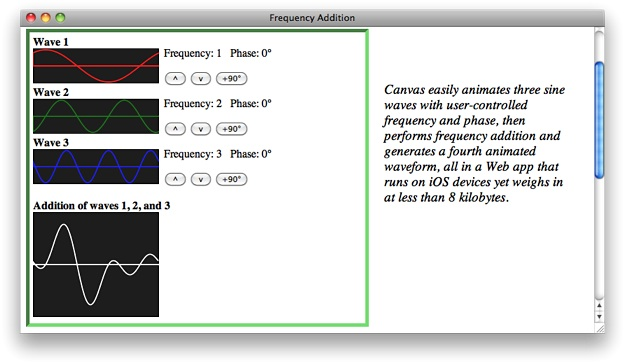

> 导航：[总目录](../../../README.md) · [documentation](../../../_indexes/documentation.md)


[Next](Setting%20Up%20the%20Canvas.md)

# About Canvas

If your website includes infographics, animation, image processing, interactive graphics, or games, you should learn about the HTML5 `canvas` element, an immediate drawing surface in your webpage where you can create runtime-generated graphics, including animations, games, and video, all without using a plug-in.

You interact with canvas using JavaScript. HTML5 adds a set of powerful graphics methods to the JavaScript API. There are JavaScript methods for drawing text, lines, curved paths, and shapes, as well as for rendering images such as JPEGs, GIFs, PNGs, SVGs, and even video. There are also JavaScript methods for manipulating canvas pixels directly, supporting real-time image processing.



The `canvas` element offers a quick and elegant solution for creating interactive animations and 2D games. Because canvas animations are written in HTML, CSS, and JavaScript, you can modify them quickly using a text editor or text output from a script. Since no plug-in is needed, games and animations written using canvas run on iOS-based devices as well as on desktop computers. Because the graphics are created at runtime on the user’s system, they’re always up-to-date and generate no server load or round-trip delay.

The canvas specification provides for simple fallback, so you can start using canvas today while keeping your website compatible with older browsers. Canvas is supported on the desktop (Mac OS X and Windows) in Safari 2.0 and later and in all versions of Safari on iOS, as well as in most other current browsers.

Here, in a nutshell, are the main features of canvas, along with the methods and properties you use to implement them. Follow the links at the bottom of each subsection for details and examples on particular features.

### You Can Add a Canvas Element in a Few Lines of Code

In your HTML, include a line that defines the `canvas` element, giving it a height and width. Be sure to include a closing tag. It’s a good idea to assign it an ID as well. Put any fallback behavior for older browsers between the opening and closing `<canvas>` tags.

```
<canvas id="myCanvas" height="300" width="400">
    
</canvas>
```

Using JavaScript, get the `canvas` element into an object and get a `"2d"` drawing context.

```
    var can = document.getElementById("myCanvas");
    var ctx = can.getContext("2d");
```

That’s all the setup required. Now you’re ready to start drawing. Because the `canvas` element is HTML, you can use CSS to modify it—give it a border or a background, round the corners, move it around on the screen, hide it offscreen, and so on.

### There Are Methods for Drawing Rectangles, Lines, Curves, Arcs, and Complex Shapes

To draw a rectangle, specify the x and y coordinates and the height and width of the rectangle. The `strokeRect(x, y, width, height)` method draws the outline of a rectangle. The `fillRect(x, y, width, height)` method draws a filled rectangle.

You draw shapes other than rectangles by creating a path, adding line segments, curves, or arcs, and closing the path. Begin a path using `beginPath()`. Set the starting point, or start a discontinuous subpath, by calling the `moveTo(x, y)` method. The `closePath()` method draws a line from the current endpoint to the starting point of the path, creating a closed shape.

The path is not actually drawn until you call `stroke()` or `fill()`. The stroke or fill style specifies the color the element is drawn in. Colors are specified using the same naming conventions as CSS—`ctx.strokeStyle = "black"`, for example, or `ctx.fillStyle = "rgba(128, 128, 128, 0.5)"`. You can also set the line width for strokes. For example, `ctx.lineWidth = 2`.

You can add a shadow to any shape, or make any shape into a mask by designating it as the clipping region for drawing operations.

Canvas supports matrix transforms—anything you draw can be translated, rotated, scaled, and more.

### It’s Easy to Include JPEGs, GIFs, PNGs, and SVGs

The drawing operations given so far are perfect for drawing graphs and charts, but you probably wouldn’t want to draw fine art, or even a smiley face, by describing the geometric shapes that make it up. Fortunately, you can include predrawn images on the canvas using an image source, such as an `img`, `video`, or another `canvas` element. Include the image source in your HTML and get it into a JavaScript object using a method such as `getElementById`.

### You Can Also Render Text On Canvas

The `canvas` element supports basic text rendering on a line-by-line basis. Just enter a line of text and x and y coordinates for the text box using the `fillText("text",x,y)` or `strokeText("text",x,y)` method. You can specify a number of text settings, such as the font family, size, and weight, and the text alignment and baseline.

### Canvas is Great for Infographics

It’s easy to plot data, create bar graphs, pie charts and infographics using canvas. To plot data, just choose your colors and select an appropriate scale to fit your data. Bar charts are also straightforward—pick your colors, choose an appropriate scale, and make calls to `fillRect(x,y, width,height)`. Pie charts are only slightly more complicated.

### Canvas Can Create Fast, Lightweight Animations

Animation involves repeatedly clearing the canvas and drawing the visual elements, from backmost to frontmost. Set the animation to repeat using the `setInterval("function()", ms)` method for endless animations, or `setTimeout("function()", ms)` for animation that repeats conditionally. For the smoothest animation, break your animation into a model and a view, updating position, rotation, and scale of the elements in the model, then drawing everything at the pre-calculated values.

### You Can Manipulate Pixels Directly for Image Processing

You have direct access to the canvas bitmap as an array of RGBa pixels. You can use this information to analyze the canvas’s content, detect collisions, apply digital filters, and do image processing in real time.

### Make Games That Play on the Desktop and iOS-Based Devices

You can add sound to canvas-based media using HTML5 audio. You can also add controls that respond to mouse or touch input. You can detect collisions using `isPointInPath(x,y)`. Because your game logic is in JavaScript, it has ready access to client-side data storage, which simplifies tracking multiple players, high scores, dungeon maps, and so on. Because canvas games work natively in the browser, web-based games based on canvas work equally well on the desktop and on mobile devices, such as iPad, iPhone, and iPod touch.

### The Web Inspector Provides Built-In JavaScript Debugging

Safari has built-in tools for debugging HTML and JavaScript, and for optimizing JavaScript timing. These tools are invaluable for creating interactive canvas displays and games. To enable the developer tools, click “Show develop menu in menu bar” in Safari preferences > Advanced. To open the Web Inspector and begin debugging, load your webpage and choose Show Web Inspector from the Develop menu. For more information, see _[Safari Web Inspector Guide](../../Apple%20Applications/Safari%20Web%20Inspector%20Guide/About%20Safari%20Web%20Inspector.md#apple-f4xwc4dqnrsv64tfmyxwi33df52wszbpkridimbqga3tqnzu)_.

### Export to Canvas is Possible from Illustrator or Flash

If your expertise has been honed using authoring tools such as Flash or Illustrator, you can continue to author in them while creating canvas content. Illustrator can export vector graphics in SVG format, which is ideal for creating resolution-independent images for canvas. You can draw images in Flash and export them in PNG or SVG format. Porting from ActionScript to JavaScript is relatively straightforward, as the two languages are quite similar. Current versions of Flash support export to HTML for complete Flash documents, ActionScript and all, using a provided JavaScript library.

You should already be familiar with HTML and JavaScript. Familiarity with CSS is helpful.

- _[HTMLCanvasElement Class Reference](https://developer.apple.com/documentation/webkitjs/htmlcanvaselement)_—Summary of the methods and properties of the `canvas` element.
- _[CanvasRenderingContext2D Class Reference](https://developer.apple.com/documentation/webkitjs/canvasrenderingcontext2d)_—Summary of the methods and properties used for drawing on canvas.
- _[Safari HTML5 Audio and Video Guide](../Safari%20HTML5%20Audio%20and%20Video%20Guide/About%20HTML5%20Audio%20and%20Video.md#apple-f4xwc4dqnrsv64tfmyxwi33df52wszbpkridimbqga4tkmrt)_—Guide to use of `audio` and `video` elements in Safari.
- _[TicTacToe with HTML5 Offline Storage](../../../samplecode/TicTacToe%20with%20HTML5%20Offline%20Storage/TicTacToe%20with%20HTML5%20Offline%20Storage.md#apple-f4xwc4dqnrsv64tfmyxwi33df52wszbpirkfgnbqgaytamzqhe)_—Example of a game that uses HTML5 client-side storage.
- _[Safari Web Inspector Guide](../../Apple%20Applications/Safari%20Web%20Inspector%20Guide/About%20Safari%20Web%20Inspector.md#apple-f4xwc4dqnrsv64tfmyxwi33df52wszbpkridimbqga3tqnzu)_—Complete guide to debugging JavaScript, HTML, and CSS using Safari’s built-in Web Inspector.
- _[Safari CSS Visual Effects Guide](../../Internet%20Web/Safari%20CSS%20Visual%20Effects%20Guide/Introduction.md#apple-f4xwc4dqnrsv64tfmyxwi33df52wszbpkridimbqga4damzs)_—Guide to using CSS for animated transformations and effects.
- _[Safari CSS Reference](../../Apple%20Applications/Safari%20CSS%20Reference/Introduction%20to%20Safari%20CSS%20Reference.md#apple-f4xwc4dqnrsv64tfmyxwi33df52wszbpkridimbqgazdanjq)_—Supported CSS properties in Safari.
- _iOS Human Interface Guidelines_—Includes guidance for creating web-based apps for iOS-based devices.
[Next](Setting%20Up%20the%20Canvas.md)

