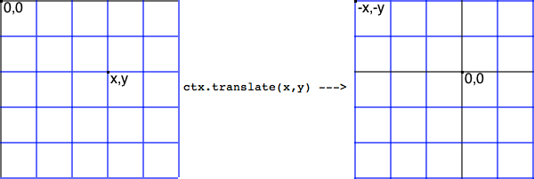
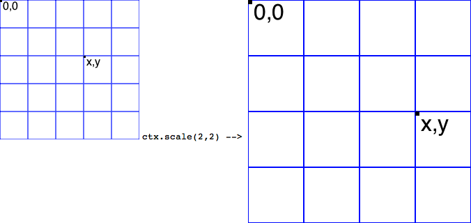
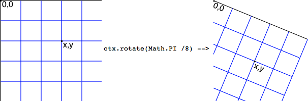
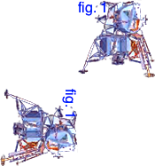

> 导航：[总目录](../../../README.md) · [documentation](../../../_indexes/documentation.md) · [Safari HTML5 Canvas Guide](About%20Canvas.md)


[Next](Matrix%20Transforms.md)[Previous](Adding%20Shadows.md)

# Translation, Rotation, and Scaling

Imagine that you had a magic drawing surface; you could slide it effortlessly, so the center would be anywhere under your drawing; you could spin it around its center, without disturbing anything you had already drawn, and any subsequent drawing would be rotated perfectly; you could expand or shrink it—again without disturbing your existing drawing—and anything you drew subsequently would be scaled up or down precisely.

That magic drawing surface is built into the `canvas` element.

You reposition the center of your drawing surface—the 0,0 point, or origin—by calling the `translate(x,y)` method. The origin of the canvas’s coordinate system is moved to the point `x,y`.

You spin the drawing surface around the origin by calling the `rotate(angle)` method. The canvas’s coordinate system is spun clockwise by `angle` radians.

You scale the drawing surface by calling the `scale(xScale,yScale)` method. The canvas’s coordinate system is scaled wider or narrower by `xScale`, and taller or shorter by `yScale`.

When you change the rotation, translation, or scale, you are changing the underlying coordinate system of the canvas—the change affects all subsequent drawing operations, but it has no effect on anything already drawn.

Translation, rotation, and scaling are all examples of two-dimensional transforms. If you perform more than one transform on the canvas, the order in which you do things is important. For example, if you translate and then rotate, you move the origin then rotate the coordinate system around it, but if you rotate and then translate, you spin the coordinate system around its existing origin, then move the origin in the rotated coordinate system.

Each transform is individually simple and intuitive, and for the most part, it’s easy to predict what will happen when you perform two or three transforms. After that, things get complicated very quickly. To avoid unintended interactions, it’s generally wise to save the context, perform two or three transforms, then restore the context and repeat the process.

For more about transformations generally, see [Matrix Transforms](Matrix%20Transforms.md#apple-f4xwc4dqnrsv64tfmyxwi33df52wszbpkridimbqgeydknbsfvbuqmjqfvjvomi).

Translation changes the origin, or `0,0` point, of the canvas’s coordinate system. Call the context’s `translate(x,y)` method to make the point `x,y` the new origin.



One use for translation is to redraw a path at a new location without having to respecify the endpoints. You specify a path as a series of endpoints using x and y coordinates. The simplest way to draw a path at a new location—offset from its original location by x,y—is to translate the coordinate system to x,y, then draw the exact same path again, as exemplified in Listing 7-1 and illustrated in Listing 7-1.

__Listing 7-1__  Drawing a path at a new location

```
function init() {
    can = document.getElementById("can");
    ctx = can.getContext("2d");
    drawPath();
    ctx.clearRect(can.width, can.height);
    ctx.translate(120, 80);
    drawPath();
}

function drawPath() {
    ctx.strokeStyle = "black";
    ctx.beginPath();
    ctx.moveTo(0, 40);
    ctx.lineTo(80, 40);
    ctx.lineTo(40, 80);
    ctx.closePath();
    ctx.stroke();
}
```


__Figure 7-1__  Translating a path

!

You expand or contract the canvas’s coordinate system by calling the context’s `scale(xScale, yScale)` method. Anything you draw subsequently is made bigger or smaller by the `xScale` and `yScale` values. If `xScale = 2`, for example, everything you draw comes out twice as wide. If `yScale = 0.5` everything comes out half as tall.



If you scale an element, you need to compensate for the changes to the coordinate system when placing the element on the canvas.

An easy way to draw an element at point x,y, scaled up or down, is to first translate to x,y, then set the scale, and draw the element at 0,0.

Alternatively, you can set the scale without translating the coordinate system first, then draw the element at the point `x / xScale, y / yScale`.

You rotate the canvas’s coordinate system around its origin by calling the context’s `rotate(angle)` method. The coordinate system is rotated by `angle` radians, clockwise. Anything already on the canvas is unaffected, but subsequent drawing operations are rotated.



When you rotate the canvas, the x and y coordinates change in complex ways, except at the origin, which remains at 0,0. The simplest way to draw an element at a point x,y, rotated at an angle, is to translate to the point x,y, set the rotation, and draw the element at 0,0.

Alternatively, you can rotate the canvas without translating the coordinate system first, then draw the element at `x * cos(-angle) - y * sin(-angle), y * cos(-angle) + x * sin(-angle)`. But that’s really doing it the hard way.

In other words, if you want to draw something at x,y rotated at an angle, follow these steps:

1. Call `ctx.save()`.
2. Call `ctx.translate(x,y)`.
3. Call `ctx.rotate(angle)`.
4. Draw the path, shape, or image at 0,0.
5. Call `ctx.restore()`.

The example in Listing 7-2 draws an image and some accompanying text twice, once at 0 degrees and once at 90 degrees of rotation.



__Listing 7-2__  Rotating an image and text

```
<html>
<head>
    <title>Rotation</title>
    <script type="text/javascript">
        var can, ctx, sprite,
            x, y, rot = 0;

        function init() {
            sprite = document.getElementById("sprite");
            can = document.getElementById("can");
            ctx = can.getContext("2d");
            ctx.fillStyle = "blue";
            ctx.font = "12pt Helvetica";
            ctx.textBaseline = "top";
            x = 100;
            y = 0;
            rot = 0;
            drawSprite();
            x = 100;
            y = 100;
            rot = Math.PI / 2;
            drawSprite();
        }

        function drawSprite() {
            ctx.save();
            ctx.translate(x, y);
            ctx.rotate(rot);
            ctx.drawImage(sprite, 0, 0);
            ctx.fillText("fig. 1", 0, 0);
            ctx.restore();
        }
    </script>
</head>
<body onload="init()">
    <h2>Rotation</h2>
    <canvas id="can" height="200" width="300">
    </canvas>
    
</body>
</html>
```


Once the context’s `rotate(angle)` method is called, all subsequent drawing operations are rotated clockwise by _angle_ radians.

Images are rotated around their origin (the upper-left corner). Rectangles are rotated around their x,y coordinate (the upper-left corner, if height and width are positive). Other shapes are rotated around the first point on the shape’s path.

In many cases, you may want to rotate elements around their center instead. For images and rectangles, this is easy. Offset the drawing by negative one-half the height and width of the image or rectangle. The following snippet draws an image rotated around its center at position x,y:

```
var xOffset = image.width / -2;
var yOffset = image.height / -2;
ctx.save();
ctx.translate(x, y);
ctx.rotate(angle);
ctx.drawImage(image.png, xOffset, yOffset);
ctx.restore();
```

If you are scaling the image as well as rotating it, offset the drawing operation by negative one-half the height and width, multiplied by the scale, as shown in the following snippet.

```
var xOffset = image.width / -2;
var yOffset = image.height / -2;
ctx.save();
ctx.translate(x, y);
ctx.rotate(angle);
ctx.scale(xScale, yScale);
ctx.drawImage(image.png, xOffset * xScale, yOffset * yScale);
ctx.restore();
```

If you are planning to rotate a path or complex shape about its center, define the points on the path relative to the center point. Listing 7-3 and Listing 7-4 show two ways to define the same shape, but the second snippet is easily moved and rotated by setting new values for x and y.

__Listing 7-3__  Defining a shape literally

```
function drawPath() {
    ctx.beginPath();
    ctx.moveTo(0, 0);
    ctx.lineTo(50, 0);
    ctx.lineTo(50, 50);
    ctx.lineTo(0, 50);
    ctx.closePath();
}
```


__Listing 7-4__  Defining a shape relative to its center point

```
var x = 25;
var y = 25;
function drawPath() {
    ctx.beginPath();
    ctx.moveTo(x - 25, y - 25);
    ctx.lineTo(x + 25, y - 25);
    ctx.lineTo(x + 25, y + 25);
    ctx.lineTo(x - 25, y + 25);
    ctx.closePath();
}
```

The following snippet draws the shape with its center at any point x,y, rotated at an angle.

```
ctx.save();
ctx.translate(x, y);
ctx.rotate(angle);
drawPath();
ctx.restore();
```


Most combinations of rotation, translation, and scale behave as you would intuitively expect them to, if you consider what each transform does and perform the operations in a logical sequence. The one exception is combining rotation and _asymmetric_ scaling—not just making things bigger or smaller, but stretching or compressing the shape by using a different scale on the x-axis and y-axis.

If you rotate the coordinate system, then scale just the x-axis, for example, whatever you draw is stretched in the direction of the rotated x-axis. If you rotate the coordinate system a quarter turn, for example, and then increase the x scale by a factor of two, things are drawn twice as tall. This is probably what you would intuitively expect; whatever you draw is rotated, but retains its stretched shape.

If you scale _before_ you rotate, however, whatever you draw is stretched in the direction the x-axis was pointing _prior_ to the rotation. This causes the shape of things you draw to change when rotated. This is probably not what you would expect to happen. The interactions are illustrated in Figure 7-2.

__Figure 7-2__  Nonintuitive interaction

!

To stretch something, then rotate it, retaining the stretched shape, you must perform the transforms by first rotating, then scaling, in that order.

If you scale symmetrically, setting the x scale and y scale to the same value, you can perform the `rotate()` and `scale()` operations in either order.

[Next](Matrix%20Transforms.md)[Previous](Adding%20Shadows.md)

