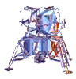

> 导航：[总目录](../../../README.md) · [documentation](../../../_indexes/documentation.md) · [Safari HTML5 Canvas Guide](About%20Canvas.md)


[Next](Adding%20Text.md)[Previous](Gradients%20and%20Patterns.md)

# Using Predrawn Images

You can add predrawn images to the canvas, such as GIFs, JPEGs, PNGs, SVGs, or the current frame of a video. By default, such images are drawn at their native size, and are clipped if they extend beyond the canvas. You can specify a height and width at which to display the image, however, or specify a region of the image to draw and a region of the canvas to draw it on.

You can use an `img` element, a `video` element, or another `canvas` element as an image source. If your image is an HTML element, get it into a JavaScript object using a method such as `getElementById`. You can also create an image source entirely in JavaScript, using such methods as `new Image`.

This chapter describes using images specified using the `` tag. For a description of how to use video as an image source, see Putting Video on Canvas.

If you use an animated GIF as an image source, only the first frame of the animation is shown. Transparency is supported.

When you use a PNG as an image source, it is recommended that it have a transparent background, so that it composites smoothly with other elements. PNG image sources are preferred to GIFs or JPGs.

If your animation uses a lot of scaling and rotation, the ideal image source is an SVG file. SVGs are inherently resolution-independent, so they appear smooth and sharp at any size or rotation.

Scaling images other than SVGs to a size greater than 1 can result in pixelation. Unless your source is an SVG, if the image is displayed at multiple sizes, the best results will come from using a source whose native size is the largest version displayed and scaling the image down when it needs to appear smaller.

You can use another canvas as an image source, but you cannot use a canvas as an image source inside itself. The main reason to use a canvas as an image source is as an offscreen buffer for image processing. You can load an image into a hidden canvas, manipulate the image at the pixel level, and display the results in another canvas.

Include an `` tag in your HTML. If you don’t want the image displayed outside of the canvas, set the `display` property to `none`. It’s a good idea to give the image an `id`, to make it easier to manipulate using JavaScript. Get the image into a JavaScript object so you can use it with the canvas.

Listing 4-1 shows how to add an image for use in your canvas.

__Listing 4-1__  Drawing an image

```
<html>
<head>
    <title>Drawing An Image</title>
    <script type="text/javascript">
        var can, ctx, sprite;

        function init() {
            can = document.getElementById("can");
            ctx = can.getContext("2d");
            sprite = document.getElementById("sprite");
        }
    </script>
</head>
<body onload="init()">
    <canvas id="can" height="300" width="300">
    </canvas>
    
</body>
</html>
```


To draw an image at its native height and width, clipping any areas that fall outside the canvas, call the context’s `drawImage(image, x, y)` method, passing in the `x` and `y` coordinates at which to draw the image.

`ctx.drawImage(image, x, y)`

The following snippet draws an image at `0, 0`—by default, the upper-left corner of the canvas.



```
function init() {
    can = document.getElementById("can");
    ctx = can.getContext("2d");
    sprite = document.getElementById("sprite");
    drawSprite();
}

function drawSprite() {
    ctx.drawImage(sprite, 0, 0);
}
```


You can specify a height and width for an image by passing two additional parameters into `drawImage()`.

`ctx.drawImage(image, x, y, width, height)`

The image is scaled to the specified height and width. If part of the image falls outside the canvas, the image is clipped at the canvas boundary.

The following snippet draws an image at 0,0 with a width of 200 and a height of 100.

```
function init() {
    can = document.getElementById("can");
    ctx = can.getContext("2d");
    sprite = document.getElementById("sprite");
    drawSprite();
}

function drawSprite() {
    ctx.drawImage(sprite, 0, 0, 200, 100);
}
```


You can specify a region of the image and a region of the canvas as part of the `drawImage()` method. Only the specified region of the image is displayed, scaled to fill the specified region of the canvas.

To draw an image with region mapping, call `drawImage()`, passing in the image; the x, y, width, and height of the source region within the image; and the x, y, width, and height of the destination region in the canvas, as illustrated in Figure 4-1.

`ctx.drawImage(image, sx, sy, sWide, sHi, dx, dy, dWide, dHigh)`

__Figure 4-1__  Region mapping

!

The following snippet clips an image to a 100 x 100 area and draws it at 0,0 scaled up by a factor of 2.

```
function init() {
    can = document.getElementById("can");
    ctx = can.getContext("2d");
    sprite = document.getElementById("sprite");
    drawSprite();
}

function drawSprite() {
    ctx.drawImage(sprite, 0, 0, 100, 100, 0, 0, 200, 200);
}
```

The example in Listing 4-2 uses region mapping to divide an image of a soccer ball into 25 tiles. The tiles are initially mapped to the regions where they would be drawn as part of the whole image, so the ball appears to be drawn normally. When the BOOM button is clicked, the tiles are redrawn several times, mapped further and further from each other each time. The canvas is rotated slightly between drawings so the tiles fly away from each other with a circular motion, as illustrated in Figure 4-2.

__Figure 4-2__  Exploding soccer ball

__Listing 4-2__  Exploding an image

```
<html>
<head>
    <title>Exploding Ball</title>
    <script type="text/javascript">
        var can;
        var ctx;
        var ball;
        var x;
        var y;
        var scalar;
        var ballHi = 150;
        var ballWide = 150;
        // offset so ball center is drawn at x,y
        var xOff = -1 * ballWide / 2;
        var yOff = -1 * ballHi / 2;
        var tiles = 25;
        var grid;
        var tHi;
        var tWide;

        function init() {
            ball = document.getElementById("ball");
            can = document.getElementById("can");
            ctx = can.getContext("2d");
            x = can.width / 2;
            y = can.height / 2;
            // tiles must be a perfect square--4, 9, 16, 25, etc.
            grid = Math.sqrt(tiles);
            tHi = ballHi / grid;
            tWide = ballWide / grid;
            // when scalar is 1, everything is drawn normally
            scalar = 1;
            drawTiles();
        }

        function drawTiles(){
            ctx.clearRect(0, 0, can.width, can.height);
            ctx.save();
            ctx.translate(x, y);
            ctx.scale = scalar;
            ctx.rotate(scalar - 1);
            for (var i = 0; i < grid; i++) {
                for (var j = 0; j < grid; j++) {
                    var tileX = i * tWide;
                    var tileY = j * tHi;
                    ctx.drawImage(ball, tileX, tileY, tWide, tHi,
                                  scalar * (xOff + tileX),
                                  scalar * (yOff + tileY), tWide, tHi);
                }
            }
            ctx.restore();
        }

        function boom() {
            scalar += 0.05;
            drawTiles();
            if (scalar < 3)
                window.setTimeout(boom, 50);
            else
                ctx.clearRect(0, 0, can.width, can.height);
        }
    </script>
</head>
<body onload="init()">
    <h2>Exploding Ball</h2>
    <p>
        
        <canvas id="can" height="300" width="400" style="position:relative;top:-50">
        </canvas>
    </p>
    <input type="button" value="BOOM" onclick="boom();" />
    <input type="button" value="Reset" onclick="init();" />
</body>
</html>
```

[Next](Adding%20Text.md)[Previous](Gradients%20and%20Patterns.md)

