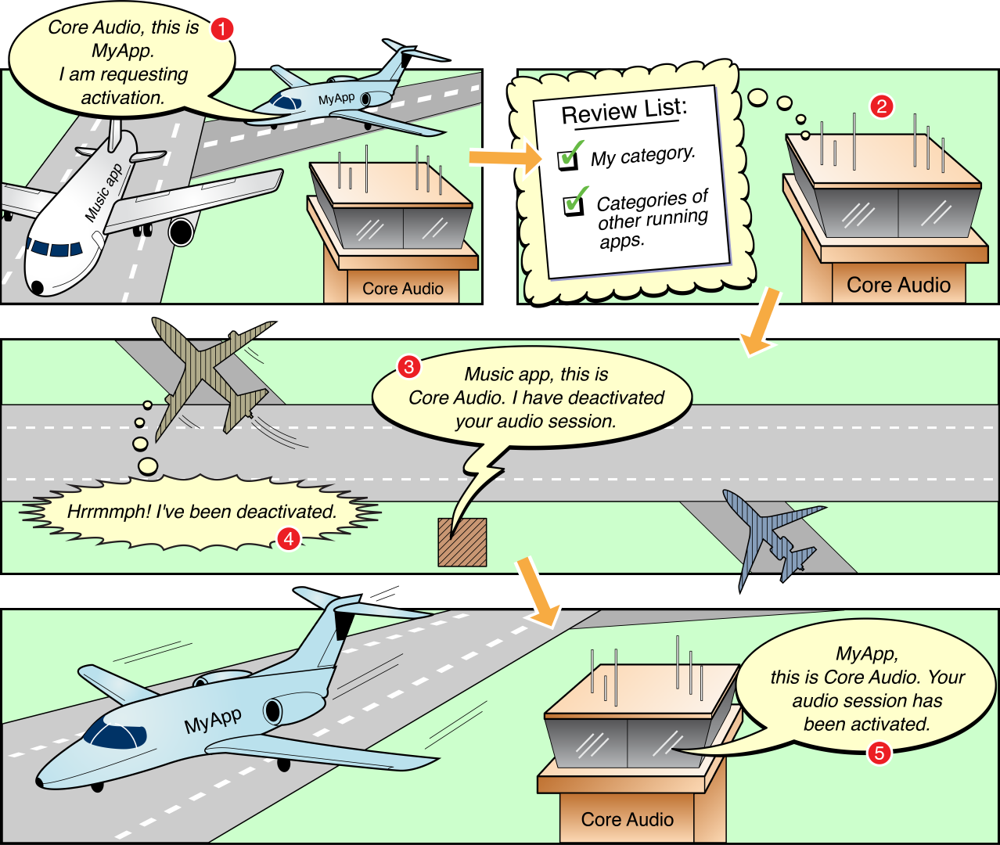

> 导航：[总目录](../../../README.md) · [documentation](../../../_indexes/documentation.md) · [Audio Session Programming Guide](Introduction.md)


[Next](Responding%20to%20Interruptions.md)[Previous](Configuring%20an%20Audio%20Session.md)

# Activating an Audio Session

You’ve configured an audio session by setting its category, options, and mode. To put your configuration into action, you now need to activate your audio session.

As your app launches, built-in apps (Messages, Music, Safari, the phone) may be running in the background. Each of these may produce audio: a text message arrives, a podcast you started 10 minutes ago continues playing, and so on.

If you think of a device as an airport, with apps represented as taxiing airplanes, the system serves as a sort of control tower. Your app can make audio requests and state its desired priority, but final authority over what happens “on the tarmac” comes from the system. You communicate with the “control tower” using the audio session. Figure 2-1 illustrates a typical scenario—your app asking to use audio while the Music app is already playing. In this scenario, your app interrupts the Music app.

__Figure 2-1__  The system manages competing audio demands



In step 1 of the figure, your app requests activation of its audio session. You’d make such a request, for example, on app launch, or perhaps in response to a user tapping the Play button in an audio recording and playback app. In step 2, the system considers the activation request. Specifically, it considers the category you’ve assigned to your audio session. In Figure 2-1, your app uses a category that requires other audio to be silenced.

In steps 3 and 4, the system deactivates the Music app’s audio session, stopping its audio playback. Finally, in step 5, the system activates your app’s audio session and playback can begin.

Although the AVFoundation playback and recording classes automatically activate your audio session, manually activating it gives you an opportunity to test whether activation succeeded. However, if your app has a play/pause UI element, write your code so that the user must press Play before the session is activated. Likewise, when changing your audio session’s active/inactive state, check to ensure that the call is successful. Write your code to gracefully handle the system’s refusal to activate your session.

The system deactivates your audio session for a Clock or Calendar alarm or an incoming phone call. When the user dismisses the alarm, or chooses to ignore a phone call, the system allows your session to become active again. Whether to reactivate a session at the end of an interruption depends on the app type, as described in [Audio Guidelines By App Type](Audio%20Guidelines%20By%20App%20Type.md#apple-f4xwc4dqnrsv64tfmyxwi33df52wszbpkridimbqga3tqnzvfvbuqmjrfvjvomi).

__Listing 2-1__  Activating an audio session

```
let session = AVAudioSession.sharedInstance()
do {
    // 1) Configure your audio session category, options, and mode
    // 2) Activate your audio session to enable your custom configuration
    try session.setActive(true)
} catch let error as NSError {
    print("Unable to activate audio session:  \(error.localizedDescription)")
}
```

To deactivate your audio session, pass `false` to the `setActive` method.

When playing or recording audio with an AVFoundation object (`AVPlayer`, `AVAudioRecorder`, and so on), the system takes care of audio session reactivation upon interruption end. However, if you register for notification messages and explicitly reactivate your audio session, you can verify that reactivation succeeded, and you can update your app’s state and user interface. For more information, see [Figure 3-1](Responding%20to%20Interruptions.md#apple-f4xwc4dqnrsv64tfmyxwi33df52wszbpkridimbqga3tqnzvfvbuqnbnknltm).

Many apps never need to deactivate their audio session explicitly. Important exceptions include VoIP apps, turn-by-turn navigation apps, and, in some cases, playback and recording apps.

- Ensure that the audio session for a VoIP app, which usually runs in the background, is active only while the app is handling a call. In the background, standing ready to receive a call, a VoIP app’s audio session should not be active.
- Ensure that the audio session for an app using a recording category is active only while recording. Before recording starts and when it stops, ensure that your session is inactive to allow other sounds, such as incoming message alerts, to play.
- If an app supports background audio playback or recording, deactivate its audio session when entering the background if the app is not actively using audio (or preparing to use audio). Doing so allows the system to free up audio resources so that they may be used by other processes. It also prevents the app's audio session from being deactivated when the app process is suspended by the operating system (see [AVAudioSessionInterruptionWasSuspendedKey](https://developer.apple.com/documentation/avfoundation/avaudiosessioninterruptionwassuspendedkey)).

When your app becomes active, sound may already be playing on the device. For example, the Music app may be playing a song when a user launches your app, or Safari may be streaming audio. Knowing if other audio is playing is especially important if your app is a game. Many games have a music sound track as well as sound effects. [Audio](https://developer.apple.com/ios/human-interface-guidelines/interaction/audio/) in _iOS Human Interface Guidelines_ advises you to assume that users expect the other audio to continue, along with the game’s sound effects, as they play the game.

In your app delegate’s [applicationDidBecomeActive:](https://developer.apple.com/documentation/uikit/uiapplicationdelegate/1622956-applicationdidbecomeactive) method, inspect the audio session’s [secondaryAudioShouldBeSilencedHint](https://developer.apple.com/documentation/avfoundation/avaudiosession/1616600-secondaryaudioshouldbesilencedhi) property to determine if audio is already playing. The value is `true` when another app with a nonmixable audio session is playing audio. Apps should use this property as a hint to silence audio that is secondary to the functioning of the app. For example, a game using `AVAudioSessionCategoryAmbient` can use this property to determine if it should mute its soundtrack while leaving its sound effects unmuted.

You can also subscribe to notifications of type [AVAudioSessionSilenceSecondaryAudioHintNotification](https://developer.apple.com/documentation/avfoundation/avaudiosessionsilencesecondaryaudiohintnotification) to ensure that your app is notified when optional secondary audio muting should begin or end. This notification is sent only to registered listeners who are currently in the foreground and have an active audio session.

```swift
func setupNotifications() {
    NotificationCenter.default.addObserver(self,
                                           selector: #selector(handleSecondaryAudio),
                                           name: .AVAudioSessionSilenceSecondaryAudioHint,
                                           object: AVAudioSession.sharedInstance())
}

func handleSecondaryAudio(notification: Notification) {
    // Determine hint type
    guard let userInfo = notification.userInfo,
        let typeValue = userInfo[AVAudioSessionSilenceSecondaryAudioHintTypeKey] as? UInt,
        let type = AVAudioSessionSilenceSecondaryAudioHintType(rawValue: typeValue) else {
            return
    }

    if type == .begin {
        // Other app audio started playing - mute secondary audio
    } else {
        // Other app audio stopped playing - restart secondary audio
    }
}
```

This notification's `userInfo` dictionary contains an [AVAudioSessionSilenceSecondaryAudioHintType](https://developer.apple.com/documentation/avfoundation/avaudiosession/silencesecondaryaudiohinttype) value for [AVAudioSessionSilenceSecondaryAudioHintTypeKey](https://developer.apple.com/documentation/avfoundation/avaudiosessionsilencesecondaryaudiohinttypekey). Use the audio hint type to determine if your secondary audio muting should begin or end.

[Next](Responding%20to%20Interruptions.md)[Previous](Configuring%20an%20Audio%20Session.md)

