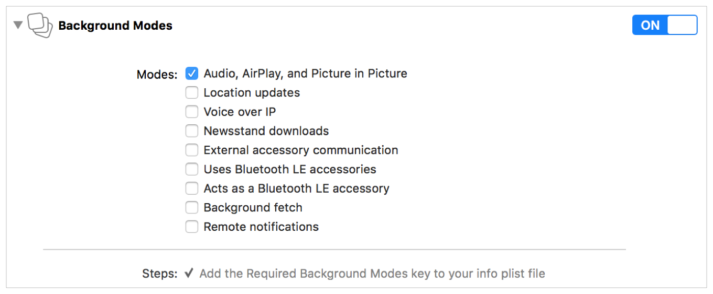

> 导航：[总目录](../../../README.md) · [documentation](../../../_indexes/documentation.md) · [Audio Session Programming Guide](Introduction.md)


[Next](Activating%20an%20Audio%20Session.md)[Previous](Introduction.md)

# Configuring an Audio Session

An audio session _category_ is a key that identifies a set of audio behaviors for your app. By setting a category, you indicate your audio intentions to the system—such as whether your audio should continue when the Ringer/Silent switch is flipped. Several audio session categories, along with a set of override and modifier switches, let you customize your app’s audio behavior.

As detailed in [Table B-1](Audio%20Session%20Categories%20and%20Modes.md#apple-f4xwc4dqnrsv64tfmyxwi33df52wszbpkridimbqga3tqnzvfvbuqmjqfvjvomy), each audio session category specifies a particular set of responses to each of the following behaviors:

- _Interrupts nonmixable apps audio:_ If yes, nonmixable apps are interrupted when your app activates its audio session.
- _Silenced by the Silent switch:_ If yes, your audio is silenced when the user activates the Silent switch. (On iPhone, this switch is called the _Ring/Silent switch_.)
- _Supports audio input:_ If yes, app audio input (recording) is allowed.
- _Supports audio output:_ If yes, app audio output (playback) is allowed.

Most apps only need to set the category once, at launch, but you can change the category as often as you need to. You can change it while the audio session is active; however, it’s generally preferable to deactivate your audio session before changing the category or other session properties. Making these changes while the session is deactivated prevents unnecessary reconfigurations of the audio system.

All iOS, tvOS, and watchOS apps have a default audio session that is preconfigured as follows:

- Audio playback is supported, but audio recording is disallowed.
- In iOS, setting the Ring/Silent switch to silent mode silences any audio being played by the app.
- In iOS, when the device is locked, the app's audio is silenced.
- When your app plays audio, any other background audio—such as audio being played by the Music app—is silenced.

The default audio session has useful behavior, but in most cases, you should customize it to better suit your app’s needs. To change the behavior, you configure your app’s audio session.

The primary means of configuring your audio session is by setting its category. An audio session category defines a set of audio behaviors. The precise behaviors associated with each category are not under your app’s control, but rather are set by the operating system. Apple may refine category behavior in future versions of the OS, so your best strategy is to pick the category that most accurately describes your intentions for the audio behavior you want. [Audio Session Categories and Modes](Audio%20Session%20Categories%20and%20Modes.md#apple-f4xwc4dqnrsv64tfmyxwi33df52wszbpkridimbqga3tqnzvfvbuqmjqfvjvomi) summarizes behavior details for each category.

While categories set the base audio behaviors for your app, you can further specialize those behaviors by setting the category’s mode. For instance, a Voice over IP (VoIP) app would use [AVAudioSessionCategoryPlayAndRecord](https://developer.apple.com/documentation/avfoundation/avaudiosession/category/1616568-playandrecord). You can specialize the behavior of this category for a VoIP app by setting the audio session’s mode to `AVAudioSessionModeVoiceChat`. This mode ensures that signals are optimized for voice through system-supplied signal processing.

Certain categories support overriding their default behavior by setting one or more category options on the session (see [AVAudioSessionCategoryOptions](https://developer.apple.com/documentation/avfoundation/avaudiosession/categoryoptions)). For instance, the default behavior associated with the [AVAudioSessionCategoryPlayback](https://developer.apple.com/documentation/avfoundation/avaudiosessioncategoryplayback) category interrupts other system audio when the session is activated. In most cases, a playback app needs this behavior. However, if you want your audio to mix with other system audio, you can override this behavior by setting the [AVAudioSessionCategoryOptionMixWithOthers](https://developer.apple.com/documentation/avfoundation/avaudiosessioncategoryoptions/avaudiosessioncategoryoptionmixwithothers) option on the session.

To set the audio session category (and optionally its mode and options), call the [setCategory:mode:options:error:](https://developer.apple.com/documentation/avfoundation/avaudiosession/1771734-setcategory) method as shown in Listing 1-1.

__Listing 1-1__  Setting the audio session category using the AVFoundation framework

```
// Access the shared, singleton audio session instance
let session = AVAudioSession.sharedInstance()
do {
    // Configure the audio session for movie playback
    try session.setCategory(AVAudioSessionCategoryPlayback,
                            mode: AVAudioSessionModeMoviePlayback,
                            options: [])
} catch let error as NSError {
    print("Failed to set the audio session category and mode: \(error.localizedDescription)")
}
```


The multiroute category works slightly differently from the other categories. All other categories follow the “last in wins” rule, where the last device plugged into an input or output route is the dominant device. However, the multiroute category enables the app to use all of the connected output ports instead of only the last-in port. For example, if you are listening to audio through the HDMI output route and plug in a set of headphones, your app continues playing audio through the HDMI output route while also playing audio through the headphones.

With the multiroute category, your app can also send different audio streams to different output routes. For example, your app can send one audio stream to the left headphone, another to the right headphone, and a third to the HDMI routes. Figure 1-1 shows an example of sending multiple audio streams to different audio routes.

__Figure 1-1__  Sending different audio streams to different audio routes

!

Depending on the device and any connected accessories, the following are valid output route combinations:

- USB and headphones
- HDMI and headphones
- LineOut and headphones

The multiroute category supports the use of a single input port.

Only specific categories and modes support AirPlay. The following categories support both the mirrored and non-mirrored versions of AirPlay:

- `AVAudioSessionCategorySoloAmbient`
- `AVAudioSessionCategoryAmbient`
- `AVAudioSessionCategoryPlayback`

The `AVAudioSessionCategoryPlayAndRecord` category and the following modes support only the mirrored version of AirPlay:

- `AVAudioSessionModeDefault`
- `AVAudioSessionModeVideoChat`
- `AVAudioSessionModeGameChat`

iOS and tvOS apps require you to enable certain capabilities for some background operations. A common capability required by playback apps is to play background audio. With this capability enabled, your app’s audio can continue when users switch to another app or when they lock their iOS devices. This capability is also required for enabling advanced playback features like AirPlay streaming and Picture in Picture playback in iOS.

The simplest way to configure these capabilities is by using Xcode. Select your app’s target in Xcode and select the Capabilities tab. Under the Capabilities tab, set the Background Modes switch to ON and select the “Audio, AirPlay, and Picture in Picture” option from the list of available modes.



With this background mode enabled and your audio session configured with an appropriate category, your app is ready to play background audio.

[Next](Activating%20an%20Audio%20Session.md)[Previous](Introduction.md)

