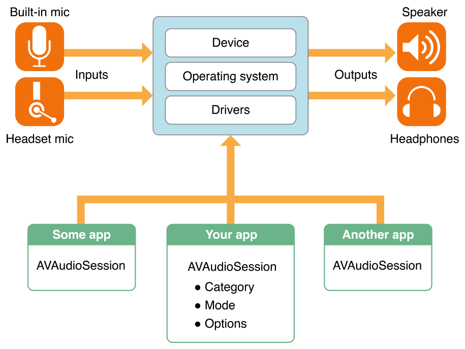

> 导航：[总目录](../../../README.md) · [documentation](../../../_indexes/documentation.md)

[Next](Configuring%20an%20Audio%20Session.md)

# Introduction

Audio is a managed service in iOS, tvOS, and watchOS. The system manages audio behavior at the app, inter-app, and device levels through the use of _audio sessions_.

You use an audio session to communicate to the system how you intend to use audio in your app. This audio session acts as an intermediary between your app and the operating system—and in turn, the underlying audio hardware. You use it to communicate to the operating system the nature of your app’s audio without detailing the specific behavior or required interactions with the audio hardware. Delegating the management of those details to the audio session ensures optimal management of the user’s audio experience.

You interact with your app’s audio session using an instance of [AVAudioSession](https://developer.apple.com/documentation/avfoundation/avaudiosession) to:

- Configure the audio session category and mode to communicate to the system how you intend to use audio in your app
- Activate your app’s audio session to put your category and mode configuration into action
- Subscribe and respond to important audio session notifications, such as audio interruptions and route changes
- Perform advanced audio device configuration such as setting sample rate, I/O buffer duration, and number of channels

### An Audio Session Manages Audio Behavior

An _audio session_ is the intermediary between your app and the operating system that is used to configure your app’s audio behavior. Upon launch, your app is automatically provided with a [singleton](https://developer.apple.com/library/archive/documentation/General/Conceptual/DevPedia-CocoaCore/Singleton.html#//apple_ref/doc/uid/TP40008195-CH49) audio session. You configure it to provide the desired behavior and activate it to put that behavior into action.

### Categories Express Audio Roles

The primary mechanism for expressing audio behaviors is the audio session category. By setting the category, you indicate whether your app uses input or output routes, whether you want music to continue playing along with your audio, and so on. The behavior you specify should meet user expectations as described in [Audio](https://developer.apple.com/ios/human-interface-guidelines/interaction/audio/) in _iOS Human Interface Guidelines_.

AVFoundation defines a number of audio session categories, along with a set of override and modifier switches, that let you customize audio behavior according to your app’s personality or role. Various categories support playback, recording, and playback with recording. When the system knows your app’s audio role, it provides you appropriate access to hardware resources. The system also ensures that other audio on the device behaves in a way that works for your app and is consistent with user expectations.

Some categories can further be customized by specifying a mode, which is used to specialize the behavior of a given category. For example, when an app uses Video Recording mode, the system might choose a different built-in microphone than it would choose if it were using the default mode. The system might also engage microphone signal processing that is tuned for video recording use cases.

### Notifications Support Interruption Handling

An _audio interruption_ is the deactivation of your app’s audio session—which immediately stops your audio. Interruptions occur when a competing audio session from an app is activated and that session is not categorized by the system to mix with yours. Your app should respond to interruptions by saving state, updating the user interface, and so on. To be notified when audio interruptions begin and end, register to observe notifications of type [AVAudioSessionInterruptionNotification](https://developer.apple.com/documentation/avfoundation/avaudiosession/1616596-interruptionnotification).

### Notifications Support Audio Route Change Handling

Users have particular expectations when they initiate an _audio route change_ by docking or undocking a device, or by plugging in or unplugging a headset. _iOS Human Interface Guidelines_ describes these expectations and provides guidelines on how to meet them. Handle route changes by registering to observe notifications of type [AVAudioSessionRouteChangeNotification](https://developer.apple.com/documentation/avfoundation/avaudiosession/1616493-routechangenotification).

### Audio Sessions Control Device Configuration

Apps don’t have direct control over device hardware, but an audio session provides the interface for you to request your _preferred_ hardware device settings. This interface enables you to perform advanced audio device configuration such as setting sample rate, I/O buffer duration, and number of audio channels.

### Audio Sessions Protect User Privacy

Apps that record audio, alone or in conjunction with video, require explicit user permission before recording is allowed. Until the user grants your app permission to record, the app can record only silence. `AVAudioSession` provides the interface to ask for this permission and determine the user’s privacy setting.

Be familiar with Cocoa Touch development as introduced in _[App Programming Guide for iOS](https://developer.apple.com/library/archive/documentation/iPhone/Conceptual/iPhoneOSProgrammingGuide/Introduction/Introduction.html#//apple_ref/doc/uid/TP40007072)_ and with the basics of Core Audio as described in that document and in _[Core Audio Overview](../../Music%20Audio/Core%20Audio%20Overview/Introduction.md#apple-f4xwc4dqnrsv64tfmyxwi33df52wszbpkridimbqgaztknzx)_. Because audio sessions bear on practical end-user scenarios, also be familiar with iOS devices and with iOS Human Interface Guidelines, especially the [Audio](https://developer.apple.com/ios/human-interface-guidelines/interaction/audio/) section in _iOS Human Interface Guidelines_.

You may find the following resource helpful:

- _[AVAudioSession Class Reference](https://developer.apple.com/documentation/avfoundation/avaudiosession)_: Describes the interface for configuring and using audio sessions
[Next](Configuring%20an%20Audio%20Session.md)

