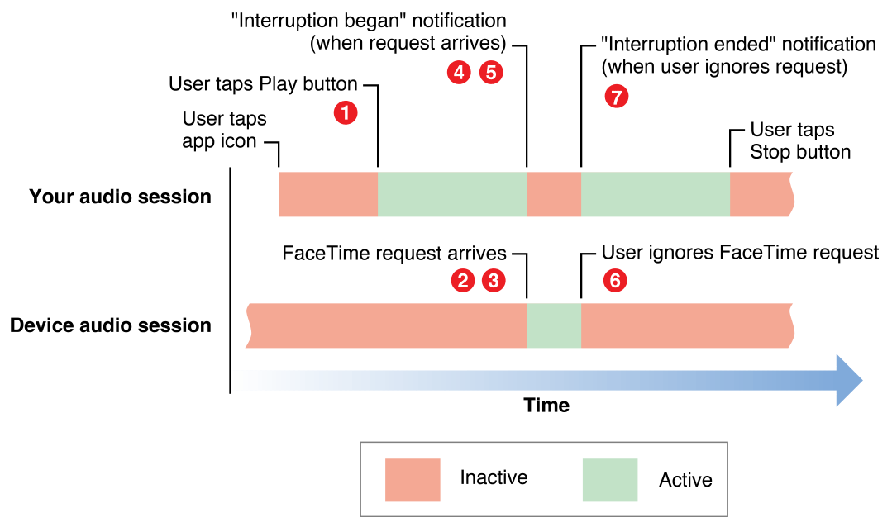

> 导航：[总目录](../../../README.md) · [documentation](../../../_indexes/documentation.md) · [Audio Session Programming Guide](Introduction.md)


[Next](Responding%20to%20Route%20Changes.md)[Previous](Activating%20an%20Audio%20Session.md)

# Responding to Interruptions

Adding audio session code to handle interruptions ensures that your app’s audio continues behaving gracefully when a phone call arrives, a Clock or Calendar alarm sounds, or another app activates its audio session.

An _audio interruption_ is the deactivation of your app’s audio session—which immediately stops your audio. Interruptions happen when a competing audio session from an app is activated and that session is not categorized by the system to mix with yours. After your session goes inactive, the system sends a “you were interrupted” message that you can respond to by saving state, updating the user interface, and so on.

Your app may be suspended following an interruption. This happens when a user accepts a phone call. If a user instead ignores a call, or dismisses an alarm, the system issues an “interruption ended” message, and your app continues running. For your audio to resume, you must reactivate your audio session.

Figure 3-1 illustrates the sequence of events before, during, and after an audio session interruption for a playback app.

__Figure 3-1__  An audio session is interrupted



An interruption event—in this example, the arrival of a FaceTime request—proceeds as follows. The numbered steps correspond to the numbers in the figure.

1. Your app is active, playing back audio.
2. A FaceTime request arrives. The system activates the FaceTime app’s audio session.
3. The system deactivates your audio session. At this point, playback in your app has stopped.
4. The system posts a notification, indicating that your session has been deactivated.
5. Your notification handler takes appropriate action. For example, it could update the user interface and save the information needed to resume playback at the point where it stopped.
6. If the user dismisses the interruption—ignoring the incoming FaceTime request—the system posts a notification, indicating that the interruption has ended.
7. Your notification handler takes action appropriate to the end of an interruption. For example, it might update the user interface, reactivate the audio session, and resume playback.
8. (Not shown in the figure.) If, instead of dismissing the interruption at step 6, the user accepts a phone call, your app is suspended.

Handle interruptions by registering to observe interruption notifications posted by `AVAudioSession`. What you do within your interruption code depends on the audio technology you are using and on what you are using it for—playback, recording, audio format conversion, reading streamed audio packets, and so on. Generally speaking, you need to ensure the minimum possible disruption, and the most graceful possible recovery, from the perspective of the user.

Table 3-1 summarizes appropriate audio session behavior during an interruption. If you use AVFoundation playback or recording objects, some of these steps are handled automatically by the system.

__Table 3-1__  What should happen during an audio session interruption

| _After interruption starts_ | - Save state and context - Update user interface |
| _After interruption ends_ | - Restore state and context - Update user interface - Reactivate audio session, if appropriate for the app |

Table 3-2 summarizes how to handle audio interruptions according to technology. The rest of this chapter provides details.

__Table 3-2__  Audio interruption handling techniques according to audio technology

| Audio technology | How interruptions work |
| AVFoundation framework | The system automatically pauses playback or recording upon interruption and reactivates your audio session when you resume playback or recording.  If you want to save and restore the playback position between app launches, save the playback position on interruption as well as on app quit. |
| Audio Queue Services, I/O audio unit | These technologies put your app in control of handling interruptions. You are responsible for saving playback or recording position and for reactivating your audio session after the interruption ends. |
| System Sound Services | Sounds played using System Sound Services go silent when an interruption starts. The sounds are eligible to be played again if the interruption ends. Apps cannot influence the interruption behavior for sounds that use this playback technology. |

When Siri interrupts your app’s playback, you must keep track of any remote control commands issued by Siri while the audio session is in an interrupted state. During the interruption, keep track of any commands issued by Siri and respond accordingly when the interruption ends. For example, during the interruption, the user asks Siri to pause your app’s audio playback. When your app is notified that the interruption has ended, it should not automatically resume playing. Instead, your app’s UI should indicate that the app is in a paused state.

To handle audio interruptions, begin by registering to observe notifications of type [AVAudioSessionInterruptionNotification](https://developer.apple.com/documentation/avfoundation/avaudiosession/1616596-interruptionnotification).

```swift
func registerForNotifications() {
    NotificationCenter.default.addObserver(self,
                                           selector: #selector(handleInterruption),
                                           name: .AVAudioSessionInterruption,
                                           object: AVAudioSession.sharedInstance())
}

func handleInterruption(_ notification: Notification) {
    // Handle interruption
}
```

The posted `NSNotification` instance contains a populated `userInfo` dictionary providing the details of the interruption. You determine the type of interruption by retrieving the `AVAudioSessionInterruptionType` value from the `userInfo` dictionary. The interruption type indicates whether the interruption has begun or has ended.

```swift
func handleInterruption(_ notification: Notification) {
    guard let info = notification.userInfo,
        let typeValue = info[AVAudioSessionInterruptionTypeKey] as? UInt,
        let type = AVAudioSessionInterruptionType(rawValue: typeValue) else {
            return
    }
    if type == .began {
        // Interruption began, take appropriate actions (save state, update user interface)
    }
    else if type == .ended {
        guard let optionsValue =
            userInfo[AVAudioSessionInterruptionOptionKey] as? UInt else {
                return
        }
        let options = AVAudioSessionInterruptionOptions(rawValue: optionsValue)
        if options.contains(.shouldResume) {
            // Interruption Ended - playback should resume
        }
    }
}
```

If the interruption type is [AVAudioSessionInterruptionTypeEnded](https://developer.apple.com/documentation/avfoundation/avaudiosessioninterruptiontype/avaudiosessioninterruptiontypeended), the `userInfo` dictionary might contain an [AVAudioSessionInterruptionOptions](https://developer.apple.com/documentation/avfoundation/avaudiosession/interruptionoptions) value. An options value of `AVAudioSessionInterruptionOptionShouldResume` is a hint that indicates whether your app should automatically resume playback if it had been playing when it was interrupted. Media playback apps should always look for this flag before beginning playback after an interruption. If it’s not present, playback should not begin again until initiated by the user. Apps that don’t present a playback interface, such as a game, can ignore this flag and reactivate and resume playback when the interruption ends.

The media server provides audio and other multimedia functionality through a shared server process. Although rare, it’s possible for the media server to reset while your app is active. Register for the [AVAudioSessionMediaServicesWereResetNotification](https://developer.apple.com/documentation/avfoundation/avaudiosession/1616540-mediaserviceswereresetnotificati) notification to monitor for a media server reset. After receiving the notification, your app needs to do the following:

- Dispose of orphaned audio objects (such as players, recorders, converters, or audio queues) and create new ones
- Reset any internal audio states being tracked, including all properties of [AVAudioSession](https://developer.apple.com/documentation/avfoundation/avaudiosession)
- When appropriate, reactivate the [AVAudioSession](https://developer.apple.com/documentation/avfoundation/avaudiosession) instance using the [setActive:error:](https://developer.apple.com/documentation/avfoundation/avaudiosession/1616597-setactive) method

You can also register for the [AVAudioSessionMediaServicesWereLostNotification](https://developer.apple.com/documentation/avfoundation/avaudiosessionmediaserviceswerelostnotification) notification if you want to know when the media server first becomes unavailable. However, most apps only need to respond to the reset notification. Use the lost notification only if the app must respond to user events that occur after the media server is lost, but before the media server is reset.

[Next](Responding%20to%20Route%20Changes.md)[Previous](Activating%20an%20Audio%20Session.md)

