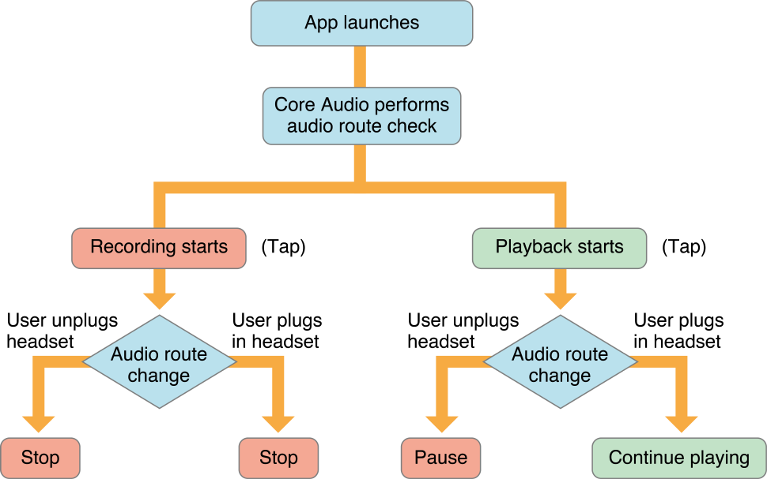

> 导航：[总目录](../../../README.md) · [documentation](../../../_indexes/documentation.md) · [Audio Session Programming Guide](Introduction.md)


[Next](Configuring%20Device%20Hardware.md)[Previous](Responding%20to%20Interruptions.md)

# Responding to Route Changes

As your app runs, a user might plug in or unplug a headset, or use a docking station with audio connections. _iOS Human Interface Guidelines_ describes how apps should respond to such events. To implement the recommendations, write audio session code to handle audio hardware route changes. Certain types of apps, like games, don’t always have to respond to route changes. However, other types of apps, such as media players, must respond to all route changes.

An _audio hardware route_ is a wired electronic pathway for audio signals. When a user of a device plugs in or unplugs a headset, the system automatically changes the audio hardware route. Your app can be notified of such changes if you register to observe notifications of type [AVAudioSessionRouteChangeNotification](https://developer.apple.com/documentation/avfoundation/avaudiosession/1616493-routechangenotification).

Figure 4-1 depicts the sequence of events for various route changes during recording and playback. The four possible outcomes, shown across the bottom of the figure, result from actions taken by a property listener callback function that you write.

__Figure 4-1__  Handling audio hardware route changes



As shown in the figure, the system initially determines the audio route after your app launches. It continues to monitor the active route as your app runs. Consider first the case of a user tapping the Record button in your app, represented by the “Recording starts” box on the left side of the figure.

During recording, the user may plug in or unplug a headset—see the diamond-shaped decision element toward the lower-left of the figure. In response, the system sends a route change notification containing the reason for the change, and the previous route. Your app should stop recording.

The case for playback is similar but has different outcomes, as shown on the right of the figure. If a user unplugs the headset during playback, your app should pause the audio. If a user plugs in the headset during playback, your app should simply allow playback to continue.

Audio route changes occur for a number of reasons, including a user plugging in a pair of headphones, connecting a Bluetooth LE headset, or unplugging a USB audio interface. Knowing when these changes occur may be important to your app so you can update its user interface or change its internal state. You can be notified of audio route changes by registering to observe notifications of type [AVAudioSessionRouteChangeNotification](https://developer.apple.com/documentation/avfoundation/avaudiosession/1616493-routechangenotification).

```swift
func setupNotifications() {
    NotificationCenter.default.addObserver(self,
                                           selector: #selector(handleRouteChange),
                                           name: .AVAudioSessionRouteChange,
                                           object: AVAudioSession.sharedInstance())
}

func handleRouteChange(_ notification: Notification) {

}
```

The posted notification contains a populated `userInfo` dictionary providing the details of the route change. You can determine the reason for this change by retrieving the `AVAudioSessionRouteChangeReason` value from the `userInfo` dictionary. When a new device is connected, the reason is [AVAudioSessionRouteChangeReasonNewDeviceAvailable](https://developer.apple.com/documentation/avfoundation/avaudiosession/routechangereason/newdeviceavailable), and when one is removed, it is [AVAudioSessionRouteChangeReasonOldDeviceUnavailable](https://developer.apple.com/documentation/avfoundation/avaudiosession/routechangereason/olddeviceunavailable).

```swift
func handleRouteChange(_ notification: Notification) {
    guard let userInfo = notification.userInfo,
        let reasonValue = userInfo[AVAudioSessionRouteChangeReasonKey] as? UInt,
        let reason = AVAudioSessionRouteChangeReason(rawValue:reasonValue) else {
            return
    }
    switch reason {
    case .newDeviceAvailable:
        // Handle new device available.
    case .oldDeviceUnavailable:
        // Handle old device removed.
    default: ()
    }
}
```

When a new device becomes available, you query the audio session’s `currentRoute` property to determine where the audio output is currently routed. This returns an [AVAudioSessionRouteDescription](https://developer.apple.com/documentation/avfoundation/avaudiosessionroutedescription) object listing all of the audio session’s inputs and outputs. When a device is removed, you retrieve the `AVAudioSessionRouteDescription` object for the _previous_ route from the `userInfo` dictionary. In both cases, you query the route description’s `outputs` property, which returns an array of [AVAudioSessionPortDescription](https://developer.apple.com/documentation/avfoundation/avaudiosessionportdescription) objects providing the details of the audio output routes.

```swift
func handleRouteChange(notification: NSNotification) {
    guard let userInfo = notification.userInfo,
        let reasonValue = userInfo[AVAudioSessionRouteChangeReasonKey] as? UInt,
        let reason = AVAudioSessionRouteChangeReason(rawValue:reasonValue) else {
            return
    }
    switch reason {
    case .newDeviceAvailable:
        let session = AVAudioSession.sharedInstance()
        for output in session.currentRoute.outputs where output.portType == AVAudioSessionPortHeadphones {
            headphonesConnected = true
        }
    case .oldDeviceUnavailable:
        if let previousRoute =
            userInfo[AVAudioSessionRouteChangePreviousRouteKey] as? AVAudioSessionRouteDescription {
            for output in previousRoute.outputs where output.portType == AVAudioSessionPortHeadphones {
                headphonesConnected = false
            }
        }
    default: ()
    }
}
```

[Next](Configuring%20Device%20Hardware.md)[Previous](Responding%20to%20Interruptions.md)

