> 导航：[总目录](../../../README.md) · [documentation](../../../_indexes/documentation.md) · [ATSUI Programming Guide](Introduction%20to%20ATSUI%20Programming%20Guide.md)

[Next](Basic%20Tasks-%20Working%20With%20Objects%20and%20Drawing%20Text.md)[Previous](Typography%20Concepts.md)

# ATSUI Style and Text Layout Objects

This chapter describes the objects that ATSUI uses for text layout and style information: text layout objects and style objects. A _text layout object_ contains the information that controls the display and formatting of the text associated with the text layout object. A _style object_ contains a collection of stylistic attributes that can be applied to text runs within the text associated with a text layout object.

Any ATSUI function that sets or retrieves stylistic or layout information uses text layout and style objects, which is why you should read this chapter if you plan to call ATSUI functions in your code. This chapter

- describes the information contained in style and text layout objects
- provides a description of the ATSUI tags you use to specify style attributes and control text layout
- provides illustrations to show how settings effect the way ATSUI renders text

To understand this chapter, you should first read [Typography Concepts](Typography%20Concepts.md#apple-f4xwc4dqnrsv64tfmyxwi33df52wszbpkridgmbqgaydamryfvkfami).

ATSUI style objects are opaque objects that represent a collection of stylistic attributes. A style object can represent one or more attributes, including information about the following:

- Style attributes. You can set attributes such as font, size, color, and directionality, and you can override font-specified default behavior governing how glyphs in a style run are displayed and formatted, including such behavior as kerning and optical alignment.
- Font features. You can select or deselect font features (ligatures, swashes, and so forth) to specify whether to employ, and at what level, various special typographic and layout features provided by the font for a particular style run.
- Font variations. You can manipulate the font variation axes and values of the font used in a style run to get different stylistic variations built into the font that are available for drawing text.

In ATSUI, a style object is created by calling the function `ATSUCreateStyle` with an `ATSUStyle` data structure as a parameter. Because style objects are opaque, you must use ATSUI accessor functions to get or set style attributes, font features, font variations, and other information associated with a style object. You’ll see how to use those functions in [Basic Tasks: Working With Objects and Drawing Text](Basic%20Tasks-%20Working%20With%20Objects%20and%20Drawing%20Text.md#apple-f4xwc4dqnrsv64tfmyxwi33df52wszbpkridgmbqgaydamzqfvkfami).

Once a style object has been defined, it can be applied to a run of text. A _style run_ is a sequence of contiguous characters in memory that share the same style attributes, font features, and font variations. The same style object can be used by more than one style run in one or more text layout objects.

The specific style attributes, font variations, and font features that you can manipulate using ATSUI are discussed in the sections that follow.

Style attributes are a collection of values and settings that override the font-specified behavior for displaying and formatting text in a style run. For example, a text color of red is a style attribute that overrides the default text color of black.

ATSUI uses a triple to specify an attribute. A _triple_ is an attribute tag, a value for that tag, and the size of the value. Attribute tags are constants. ATSUI provides tags for most style attributes. For example, the ATSUI tag for text color is `kATSURGBAlphaColorTag`. Its tag for font size is [kATSUSizeTag](https://developer.apple.com/documentation/applicationservices/1452204-anonymous/katsusizetag). The triples associated with each of these tags are shown in Figure 2-1.

__Figure 2-1__  Triples for text color and font size style attributes

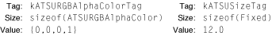

As you can see in Figure 2-1, color is specified by data of type `ATSURGBAlphaColor`, so the size is `sizeof(ATSURGBAlphaColor)`. The value in the figure is the default color value, which specifies black with an alpha-channel (translucency) setting of 1—`(0, 0, 0, 1)`. Size is specified by a `Fixed` value. In this example, the value `12.0` specifies 12-point size.

This section discusses most of the style attributes for which ATSUI provides tags. It describes a style attribute, the default setting for the attribute, and in many cases shows the effect of applying the attribute to text. See _Inside Mac OS X: ATSUI Reference_ for a complete reference of the style attribute tags provided by ATSUI.

You can create a custom attribute tag for a style attribute for which ATSUI does not provide a tag. For more information, see [Custom Attribute Tags](#apple-f4xwc4dqnrsv64tfmyxwi33df52wszbpkridgmbqgaydamrzfvbeeq2fiveuqqi).

The ascent attribute tag represents the ascent associated with a style object’s font. You can obtain the ascent value by using the following style attribute tag:

**Attribute tag:**
: `kATSUAscentTag`

**Data type:**
: `ATSUTextMeasurement`; the value must be >= 0.

**Default value:**
: The ascent value of the style’s font with the current point size.

**Comment:**
: This tag is available starting with Mac OS X version 10.2.

The baseline attribute type represents the preferred baseline (such as Roman, hanging, or ideographic-centered) to use for text of a given font in a style run. You can set and retrieve the baseline type value using the following style attribute tag:

**Attribute tag:**
: `kATSUBaselineClassTag`

**Data type:**
: `BslnBaselineClass` (defined in `SFNTLayoutTypes.h`)

**Default value:**
: `kATSURomanBaseline`

**Comment:**
: If you want to use the intrinsic baselines, set the value of this tag to `kBSLNNoBaselineOverride`.

See [Figure 1-8](Typography%20Concepts.md#apple-f4xwc4dqnrsv64tfmyxwi33df52wszbpkridgmbqgaydamryfvbuuqscivduorq) for illustrations of baselines. For an example of how to apply a baseline attribute tag to a style, see [Setting a Baseline](Advanced%20Tasks-%20Substituting%20Fonts%20and%20Modifying%20Layouts.md#apple-f4xwc4dqnrsv64tfmyxwi33df52wszbpkridgmbqgaydamzsfvkfawcsivddcnbr).

The caret angle attribute tag specifies whether the text caret or edges of a highlighted area are always parallel to the slant of the style run’s text or always perpendicular to the baseline. You can set and retrieve the value of the caret angle using the following style attribute tag:

**Attribute tag:**
: `kATSUNoCaretAngleTag`

**Data type:**
: `Boolean`

**Default value:**
: `false`

**Comment:**
: The default setting is to use the character’s angularity to determine caret angle and the edges of a highlighted area.

For example, when the caret appears in italic text or text that has an intrinsic angle, you may want to display an angled (slanted) caret rather than a straight one. ATSUI supports this capability by using data present in a font that identifies the intrinsic font angle. Figure 2-2 shows the position of straight (top line) and angled (bottom line) carets.

__Figure 2-2__  Straight and angled caret positions

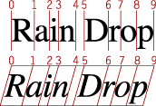

_Cross-stream kerning_ is the movement of glyphs (as specified by the font) perpendicular to the line orientation of the text. (For horizontal text, the automatic movement is vertical.) Cross-stream kerning is required for such scripts as Taliq (used in Urdu). It can also be used to assist in the creation of automatic fractions. You can set and retrieve the cross-stream kerning value using the following style attribute tag:

**Attribute tag:**
: `kATSUSuppressCrossKerningTag`

**Data type:**
: `Boolean`

**Default value:**
: `false`

**Comment:**
: The default setting specifies not to suppress automatic cross-kerning (defined by the font).

Figure 2-3 shows how cross-stream kerning raises the minus sign between two uppercase glyphs to reflect the centers of those characters. The text on the left does not use cross-stream kerning whereas the text on the right does.

__Figure 2-3__  Cross-stream kerning applied to a minus sign in an equation

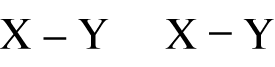

For an example of how to apply the cross-stream kerning tag to a style, see [Drawing Equations](Basic%20Tasks-%20Working%20With%20Objects%20and%20Drawing%20Text.md#apple-f4xwc4dqnrsv64tfmyxwi33df52wszbpkridgmbqgaydamzqfvbegskeivausqi).

The descent attribute tag represents the descent associated with a style object’s font. You can obtain the descent value by using the following style attribute tag:

**Attribute tag:**
: `kATSUDescentTag`

**Data type:**
: `ATSUTextMeasurement`; the value must be >= 0.

**Default value:**
: The descent value of the style’s font with the current point size.

**Comment:**
: This tag is available starting with Mac OS X version 10.2. The leading value is not included as part of the descent.

A _font ID_ is a value that identifies a font to the font management system. You can set and retrieve the font ID value using the following style attribute tag:

**Attribute tag:**
: `kATSUFontTag`

**Data type:**
: `ATSUFontID`

**Default value:**
: The application font for the current script system.

**Comments:**
: If the application font is not usable by ATSUI, the default is Helvetica.

The font ID is used by ATSUI functions that retrieve or manipulate fonts. When you copy a style object, you copy the font ID of the font used in the style run in addition to the style object’s style attributes, font features, and font attributes. The font ID does not persist across system startups. In other words, a font does not have the same font ID when the computer is restarted.

You can associate a font transformation matrix with a style object to achieve such effects as reversing glyphs across the x-axis and rotating glyphs You can set and retrieve the font matrix using the following style attribute tag:

**Attribute tag:**
: `kATSUFontMatrixTag`

**Data type:**
: `CGAffineTransform`

**Default value:**
: `CGAffineTransformIdentity`, which is `[1, 0, 0, 1, 0, 0]`

**Comment:**
: This tag is available in Mac OS X version 10.2 and later.

Figure 2-4 shows four instances of the phrase “Hello World.” The first instance is drawn normally; no transformation is applied. The second and third instances are the result of scaling the font transformation matrix to stretch or shrink the glyphs. The fourth instance of “Hello World” is created by rotating the transformation matrix. Some of the glyphs overlap in this case because the rotation does not modify the advance widths.

__Figure 2-4__  Using a font transformation matrix to achieve text effects

The _glyph orientation_ of a style run specifies which direction (vertical or horizontal) glyphs should be drawn. You can set and retrieve the glyph orientation using the following attribute tag:

**Attribute tag:**
: `kATSUVerticalCharacterTag`

**Data type:**
: `ATSUVerticalCharacterType`

**Default value:**
: `kATSUStronglyHorizontal`

**Comment:**
: The other possible value for this tag is `kATSUStronglyVertical`.

Figure 2-5 shows two horizontal lines of text. The glyphs in the top line of Figure 2-5 are vertical and those in the bottom line are horizontal.

__Figure 2-5__  Vertical and horizontal glyphs

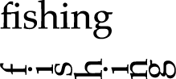

Fonts that have large character sets, such as Chinese, Japanese, and Korean fonts, can be packaged as glyph collections, or character sets. Many characters in these large font sets are not readily accessible. Using the glyph selector tag allows you access to characters in the fonts by specifying a font-specific glyph ID or a collection ID (CID). You can use the glyph selector attribute tag to specify a glyph ID or collection by using the following style attribute tag:

**Attribute tag:**
: `kATSUGlyphSelectorTag`

**Data type:**
: `ATSUGlyphSelector`

**Default value:**
: `0`

**Comment:**
: The default specifies to use the glyphs derived by the ATSUI layout process. This tag is available in Mac OS X version 10.2 and later.

For more information on CID conventions, see [http://www.adobe.com](http://www.adobe.com/). You can get the variant glyph information from an input method through the Text Services Manager using the Carbon event key, `kEventParamTextInputGlyphInfoArray`.

Glyph widths, by default, are specified by font-defined advance widths. You can override the glyph’s default metrics by imposing a width for ATSUI to use. You can set and retrieve the imposed-width value using the following style attribute tag:

**Attribute tag:**
: `kATSUImposeWidthTag`

**Data type:**
: `ATSUTextMeasurement`; the value must be >= 0.

**Default value:**
: `kATSUNoImposedWidth`

**Comment:**
: The default setting is for glyphs to use their own font-defined advance widths.

Imposing a width is useful if you need to embed a picture or other graphic in a line of text. Your application can create a gap at a specific point in that line by using a single whitespace character as its own style run and imposing a width on that style run, as shown in Figure 2-6. The specified glyph always has the imposed width, regardless of the point size of the text, to within a single pixel in device resolution.

Figure 2-6 shows text in which one of the style runs consists of only the whitespace character between the words “As” and “you”. The text is drawn twice. The first time (the top line) with no imposed width and then (the second line) with an imposed width on the whitespace character. By imposing a width on the style run, you can tailor the size of the gap between the words.

__Figure 2-6__  A line of text without and with an imposed glyph width

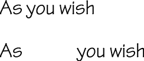

_Hanging punctuation_ refers to glyphs that extend beyond the left or right margins of the text area and whose widths are not counted when line length is measured. This property is font-specified, and is usually true for “lightweight” punctuation, such as quotation marks or periods. You can set and retrieve the hanging punctuation value using the following style attribute tag:

**Attribute tag:**
: `kATSUHangingInhibitFactorTag`

**Data type:**
: `Fract`; must be a fractional value between 0 and 1.0.

**Default value:**
: `0`

**Comment:**
: The default setting specifies no adjustment to the font-specified data.

The ability to control whether punctuation glyphs can hang permits automatic alignment of text lines such as that shown in Figure 2-7. Hanging glyphs typically extend beyond the left and right margins of the text area. Their widths are not counted when line length is measured. In Figure 2-7 the quotation mark on the left and the period on the right are hanging punctuation glyphs.

__Figure 2-7__  Hanging punctuation glyphs

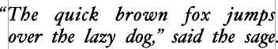

By default, ATSUI uses font-specific information to automatically hang punctuation where appropriate. A value of `0` (the default) indicates that the glyph should hang by the normal amount. Your application has the ability to control the degree to which hanging punctuation occurs by supplying a value other than `0`. A positive nonzero value lessens the amount of hanging proportionally; a value of `1` means “no hanging at all.” Figure 2-8 shows the same line of (justified) text laid out with the default value (top), with a value of `0.5` (middle), and with a value of `1.0` (bottom).

__Figure 2-8__  Effects of changing the hanging punctuation attribute

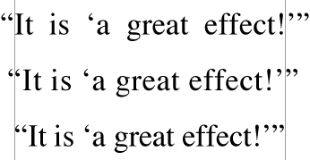

You can treat glyphs in a style run as hanging punctuation, whether or not the font designer intended them to be. You can set and retrieve the forced hanging punctuation setting using the following style attribute tag:

**Attribute tag:**
: `kATSUForceHangingTag`

**Data type:**
: `Boolean`

**Default value:**
: `false`

**Comment:**
: The default setting specifies not to force the character to hang beyond line boundaries.

Figure 2-9 shows a line in which the question mark, which is not normally a hanging punctuation glyph, is in its own style run and is defined as hanging, causing the question mark to extend beyond the margin.

__Figure 2-9__  A question mark forced to extend beyond the margin

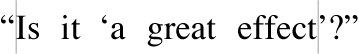

_Justification override_ represents the degree to which ATSUI should override justification behavior for glyphs in the style run. You can set and retrieve the justification override value using the following style attribute tag:

**Attribute tag:**
: `kATSUPriorityJustOverrideTag`

**Data type:**
: `ATSUJustWidthDeltaEntryOverride`

**Default value:**
: Each field has a value of `0`

**Comment:**
: The default setting specifies no overrides.

The `ATSUJustWidthDeltaEntryOverride` structure contains an array of four width delta structures, one for each priority level, in index order. The width delta structure contains the information needed to override the distribution behavior of a glyph or set of glyphs during justification. You can use these structures to specify both a change in priority level and distribution behavior.

_Kerning_ increases the overlap between glyphs that fit together naturally. It does not apply evenly to all glyphs in a style run. You can set and retrieve the kerning value using the following style attribute tag:

**Attribute tag:**
: `kATSUKerningInhibitFactorTag`

**Data type:**
: `Fract`; must be a fractional value between 0 and 1.0.

**Default value:**
: `0`

**Comment:**
: The default setting specifies no inhibition of font-specified kerning.

ATSUI uses information in font tables to determine how much to increase or decrease the space between glyphs. In the general case, this amount can depend on more than just the two adjacent glyphs: It can also depend on preceding or following glyphs, or even on glyphs in other parts of the line. For example, the two pairs of glyphs in Figure 2-10 might kern, but the triple would not—at least not in the same manner as the two separate pairs.

__Figure 2-10__  When kerning can and cannot occur

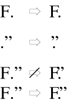

To determine caret positions, kerning offset is effectively split between glyphs in a kerned pair. The example in Figure 2-11 shows where the caret would appear between the two glyphs without kerning (left side) and with kerning (right side).

__Figure 2-11__  Caret position between two kerned glyphs

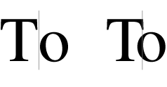

Kerning does not refer to the apparent overlap that can be caused by glyphs that overhang their bounds (glyphs that extend beyond their leading or trailing edges defined by the character origin and advance width), as shown by the Q in Figure 2-12.

__Figure 2-12__  Apparent kerning by a glyph that extends beyond its advance width

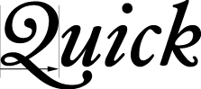

The language region attribute tag represents the regional language code for glyphs in a style run. ATSUI uses the value associated with this tag to determine how to render region-dependent characteristics. You can set and retrieve the language region value using the following style attribute tag:

**Attribute tag:**
: `kATSULangRegionTag`

**Data type:**
: `RegionCode`

**Default value:**
: `GetScriptManagerVariable (smRegionCode)`

**Comment:**
: Region codes are defined in the Script Manager.

The leading attribute tag represents the leading associated with a style object’s font. You can obtain the leading value by using the following style attribute tag:

**Attribute tag:**
: `kATSULeadingTag`

**Data type:**
: `ATSUTextMeasurement`; the value must be >= 0.

**Default value:**
: The leading value of the style’s font with the current point size.

**Comment:**
: This tag is available in Mac OS X version 10.2 and later.

_Ligature decomposition_ is the breaking up of a ligature into its component glyphs during justification, so that the individual glyphs may more evenly occupy the space allotted to the ligature. You can set and retrieve the ligature decomposition value using the following style attribute tag:

**Attribute tag:**
: `kATSUDecompositionFactorTag`

**Data type:**
: `Fixed`; the value must be >= -1.0 and <= 1.0)

**Default value:**
: `0`

**Comment:**
: The value associated with this tag represents the fractional adjustment to the font-specified threshold at which ligature decomposition occurs during justification, with `0` representing no adjustment to the font-specified threshold.

Depending on the amount of white space surrounding a ligature, postcompensation action may replace that ligature with its component glyphs, after which ATSUI recalculates the positions of all glyphs on the line.

_Ligature splitting_ is the division of a ligature for hit-testing purposes into regions corresponding to each of its component glyphs. You can set and retrieve the ligature splitting value using the following style attribute tag:

**Attribute tag:**
: `kATSUNoLigatureSplitTag`

**Data type:**
: `Boolean`

**Default value:**
: `false`

**Comment:**
: The default setting specifies that ligatures and compound characters in a style have divisible components.

If the value set by the ligature splitting attribute tag is `true` and the caret position is adjacent to a ligature, ATSUI considers the next valid caret position to be at the other side of the entire ligature rather than at any point within it.

_Optical alignment_ is the fine adjustment of glyph positions (as specified by the font) at the ends of lines to give a more even visual appearance to margins. You can set and retrieve the optical alignment value using the following style attribute tag:

**Attribute tag:**
: `kATSUNoOpticalAlignmentTag`

**Data type:**
: `Boolean`

**Default value:**
: `false`

**Comment:**
: The default setting specifies not to suppress automatic optical positioning alignment.

In multiline text, glyphs may seem to line up incorrectly at the margins. This is accounted for by two factors. First, glyph advance widths contain a certain amount of extra white space (side bearing) to account for the normal interglyph spacing. This produces certain anomalies at line margins, because the side bearing varies with font size.

The second problem is that due to optical effects, curved lines do not appear to line up properly with straight lines. To make them appear to line up, some compensation must occur. On baselines, for example, curved letters such as “C” or “S” are generally designed to extend slightly below the baseline, so that they appear to line up with straight letters such as “H”.

This same effect should happen at the edges of lines. On the left side of Figure 2-13, the “O” in “Oregon” and the “C” in “Connecticut” appear to be indented compared to the “H” and “D” glyphs. However, as shown by the vertical line on the right, the outlines of the four glyphs are exactly aligned. The apparent indentation is an optical effect.

__Figure 2-13__  Apparent misalignment of curved letters

To compensate for these effects, ATSUI applies optical alignment information contained in the font. When determining the leading and trailing edges of a line of text, ATSUI uses the optical leading and trailing edges as specified by the font.

Figure 2-14 shows the same text as Figure 2-13, except that on the left in Figure 2-14, the glyphs appear to be aligned. However, as shown by the vertical line on the right, the outlines of the four glyphs are not exactly aligned; the glyphs have been shifted to compensate for optical effects.

__Figure 2-14__  Optical alignment at line edges

_Postcompensation justification_ is a set of processes (such as glyph stretching and ligature decomposition) that occur at the end of the justification process and should take place after glyph positions have been calculated. You can set and retrieve the postcompensation justification value using the following style attribute tag:

**Attribute tag:**
: `kATSUNoSpecialJustificationTag`

**Data type:**
: `Boolean`

**Default value:**
: `false`

**Comment:**
: The default setting specifies to perform postcompensation justification if needed.

Style rendering options provide you with fine control over how ATSUI renders a style. You can specify whether or not ATSUI should use hinting and whether or not anti-aliasing should be used. You can set and retrieve the style rendering option value using the following style attribute tag:

**Attribute tag:**
: `kATSUStyleRenderingOptionsTag`

**Data type:**
: `ATSStyleRenderingOptions`

**Default value:**
: `kATSStyleNoOptions`

**Comment:**
: See _Inside Mac OS X: ATSUI Reference_ for a complete list of style rendering options.

ATSUI uses text-locator information to determine where to break text and which options to apply to text breaks. The attribute value associated with this tag (`TextBreakLocatorRef`) contains the data needed by ATSUI to locate various kinds of text breaks. You can set and retrieve the style text locator value using the following style attribute tag:

**Attribute tag:**
: `kATSUStyleTextLocatorTag`

**Data type:**
: `TextBreakLocatorRef` (an opaque structure defined in Unicode Utilities)

**Default value:**
: `NULL`

**Comment:**
: The default value specifies to use the region-derived locator or the default Text Utilities locator.

The text color attribute tag represents the color of the glyphs in a style run. You can set and retrieve the text color using the following style attribute tag:

**Attribute tag:**
: `kATSUColorTag`

**Data type:**
: `RGBColor`

**Default value:**
: `(0,0,0)`

**Comment:**
: The default setting designates black.

The `RGBColor` structure lets you specify intensity values for the three additive primary colors—red, green, and blue.

The text color attribute tag represents the color of the glyphs in a style run and the alpha channel (translucency) setting for those glyphs. You can set and retrieve the text color and alpha channel setting using the following style attribute tag:

**Attribute tag:**
: `kATSURGBAlphaColorTag`

**Data type:**
: `ATSURGBAlphaColor`

**Default value:**
: `(0,0,0,1)`

**Comment:**
: The default setting designates black, with an alpha-channel setting of 1.

The `ATSURGBAlphaColor` structure lets you specify intensity values for the three additive primary colors—red, green, and blue—as well as an alpha-channel value.

The text size attribute tag represents the size, in typographic points (72 per inch), of the text in the style run. You can set and retrieve the text size using the following style attribute tag:

**Attribute tag:**
: `kATSUSizeTag`

**Data type:**
: `Fixed`

**Default value:**
: The application font size for the current script system.

ATSUI uses `Fixed` values to specify points for coordinates and measurements, rotated text, and angled and dual carets, unlike QuickDraw, which uses integer coordinates.

_Tracking_ represents the relative proportion of font-defined adjustments to apply to interglyph positions. You can expand or contract the spacings of all glyphs in a style run by applying a tracking value, called the _tracking setting_, to that style run. You can set and retrieve the tracking setting using the following style attribute tag:

**Attribute tag:**
: `kATSUTrackingTag`

**Data type:**
: `Fixed`

**Default value:**
: `0`

**Comment:**
: No change to the font-defined adjustments.

Tracking is different from with-stream shifting because the actual amount of space added or removed is controlled by the font, not by your application. The positional shifts are the result of two-dimensional interpolation based on the tracking setting, the text size in points, and the threshold values present in the font’s tracking table. These threshold values are used to permit nonlinear tracking amounts. For example, a single tracking setting can specify different sets of spacings for text below 8 points, from 8 to 12 points, from 12 to 15, from 15 to 36, and over 36 points if the font designer specifies it.

Specifying a tracking setting of `0` means “space normally” according to the specifications set by the font designer. That does not necessarily mean that no adjustment to spacing occurs. The font designer may decide that “normal spacing” includes some spacing adjustment in certain point size ranges.

The glyph orientation also affects the tracking settings. A font designer can specify different spacings for a tracking setting of `0` (normal spacing) depending on the orientation of the glyphs.

Figure 2-15 shows the same phrase written three times in a particular font. The top line is drawn when the application specifies a tracking setting of `0`; the middle is drawn with a large positive tracking setting (`+2`); and the bottom with a large negative tracking setting (`–2`).

__Figure 2-15__  Text drawn with three different tracking settings

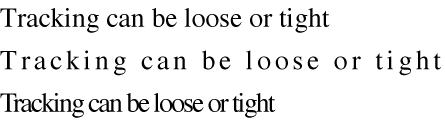

_Text styles_ are the visual attributes, other than size, applied as a systematic variation to the plain (unstyled) characteristics of a font’s glyphs. The set of text styles supported by ATSUI include bold, italic, underline, condensed, and extended.

Text style attribute tags are included for compatibility with the `Style` type used by QuickDraw’s `TextFace` function. If a font variant for one of these text styles exists, that variant is used. Otherwise, the variant is generated algorithmically. QuickDraw-compatible style features are not supported by all fonts. Some fonts have finer controls for setting QuickDraw text styles; these controls can be accessed with font variations.

The tags you can use to set and retrieve text style attributes are listed in Table 2-1 along with the data type for each tag and its default value.

__Table 2-1__  Style attribute tags, data types, and default values for text styles

| Attribute tag | Data type | Default value | Comments |
| `kATSUQDBoldfaceTag` | `Boolean` | `false` | The default specifies not boldfaced |
| `kATSUItalicTag` | `Boolean` | `false` | The default specifies not italicized |
| `kATSUUnderlineTag` | `Boolean` | `false` | The default specifies not underlined |
| `kATSUCondensedTag` | `Boolean` | `false` | The default specifies not condensed |
| `kATSUExtendedTag` | `Boolean` | `false` | The default specifies not extended |

_With-stream shift_ represents a uniform shift parallel to the baseline of the positions of individual pairs or sets of glyphs in the style run. It can be used for manual kerning or letter spacing. You can apply with-stream shift before (to the left of) the glyphs of the style run using the following style attribute tag:

**Attribute tag:**
: `kATSUBeforeWithStreamShiftTag`

**Data type:**
: `Fixed`

**Default value:**
: `0`

**Comment:**
: The default value represents no adjustment the amount of space to the left edge (or top, for vertical text).

You can apply with-stream shift after (to the right of) the glyphs of the style run using the following style attribute tag:

**Attribute tag:**
: `kATSUAfterWithStreamShiftTag`

**Data type:**
: `Fixed`

**Default value:**
: `0`

**Comment:**
: The default value represents no adjustment to the amount of space to add to the right edge (or bottom, for vertical text).

You can apply both tags (before and after) to the same style run. Positive with-stream shift moves the glyphs farther apart; negative shift moves them closer together.

_Cross-stream shift_ represents the distance to raise or lower glyphs in the style run perpendicular to the text stream. This shift is vertical for horizontal text and horizontal for vertical text. Each glyph in the style run is shifted by the same amount from the baseline. It can be used for superscript and subscript effects. Positive cross-stream shift moves the glyphs upward from the baseline (as in superscripts); negative shift moves them downward (as in subscripts). You can apply cross-stream shift using the following style attribute tag:

**Attribute tag:**
: `kATSUCrossStreamShiftTag`

**Data type:**
: `Fixed`

**Default value:**
: `0`

**Comment:**
: The default value represents no adjustment.

Figure 2-16 shows an example of a negative and a positive with-stream shift applied before (to the left of) the glyphs of a style run. The glyphs “c” and “d” constitute a single style run. The line is drawn first with no shift, then with a large negative with-stream shift for that style run, and finally with an even larger positive with-stream shift.

__Figure 2-16__  Negative and positive with-stream shift

Figure 2-17 illustrates the simultaneous use of with-stream and cross-stream shifts. The layout consists of two style runs of a single glyph each. On the left the layout is drawn with no shifting. On the right, a negative with-stream shift is applied before the “2”, and a positive cross-stream shift is applied to the “2”. The net result is a well-proportioned and well-placed superscript. (There are other ways to make superscripts, including the use of superiors; see [Vertical Position Feature Type](Font%20Features.md#apple-f4xwc4dqnrsv64tfmyxwi33df52wszbpkridgmbqgaydamzvfvkfawcsivddemjq).)

__Figure 2-17__  Combined with-stream and cross-stream shift

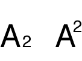

When text is shifted in a with-stream direction, the boundary (caret position) between pairs of glyphs is adjusted to be halfway between the advance width of the earlier glyph and the origin of the later glyph, as shown in Figure 2-18. Using with-stream and cross-stream shifts can give your application a full manual letter-spacing capability.

__Figure 2-18__  Caret position between with-stream shifted glyphs

If Apple provides a tag for an attribute, you should use the tag. In the rare case in which there isn’t a tag available for an attribute you want to control, you can create your own custom tag. Apple reserves values `0` to `65,535` (`0` to `0x0000FFFF`) for Apple-defined attribute tags. Your attribute tag must have a value outside this range.

As you may recall from [Font Variations](Typography%20Concepts.md#apple-f4xwc4dqnrsv64tfmyxwi33df52wszbpkridgmbqgaydamryfvbecsscjjbeusa), a font variation is a setting along a particular style variation axis defined by the font designer. The font variations associated with a style object specify the variations that can be applied to the style’s font. A style object may specify the values for any number of variation axes.

You can use ATSUI to obtain the variation axes and variation settings defined for a font. You can also use ATSUI to supply your own setting for any variation axes defined for the font. If the font does not support the variation axis you specify, your custom variations have no visual effect.

_Font features_ are typographic and layout capabilities that can be selected or deselected by an application and that control many aspects of glyph selection, ordering, and positioning. Font features include fundamental controls such as whether or not contextual forms are to be used and details of appearance such as whether or not alternate forms of glyphs are to be used at the beginning of a word. To a large extent, how text looks when it is laid out is a function of the number and kinds of font features chosen.

Font vendors create tables that implement a set of font features from which your application can pick and choose. The architecture of font features is open-ended; as font vendors create new kinds of features, ATSUI automatically takes advantage of them. When your application selects a group of features, ATSUI uses them, plus any font-specified features not overridden by your feature selections, when it draws the text layout object.

Font features are grouped into categories called _feature types_, within which individual_feature selectors_ are used to define particular feature settings or selections. Feature types can be exclusive or nonexclusive. If a feature type is _exclusive_ you can choose only one of the available feature selectors, such as whether numbers are to be proportional or fixed-width. If a feature type is _nonexclusive_, you can enable any number of feature selectors at once. For example, for the ligature feature type you can choose any combination of the available classes of ligatures that the font supports.

Some features are contextual while others are noncontextual. The manner in which _contextual features_ are applied to a glyph depends on the glyph’s position compared to adjacent glyphs. Much of ATSUI’s text layout power results from its ability to apply sophisticated contextual processing automatically.

_Noncontextual features_ are applied in the same manner to a glyph regardless of the adjacent glyphs. These features include the selection of alternate glyph sets to give text a different appearance and glyph substitution for purposes of mathematical typesetting or enhancing typographic sophistication.

[Font Features](Font%20Features.md#apple-f4xwc4dqnrsv64tfmyxwi33df52wszbpkridgmbqgaydamzvfvkfami) describe font features types and the selectors available for each feature type. As feature types can be added at any time, you should check Apple’s font feature registry website for the most up-to-date list of font feature types and selectors:

[http://developer.apple.com/fonts/](https://developer.apple.com/fonts/)

Text layout objects contain the stylistic information that influences the display and formatting of the text associated with the text layout object. In ATSUI, you can create a text layout object by calling the function `ATSUCreateTextLayout` with an `ATSUTextLayout` data structure as a parameter. Like style objects, text layout objects are opaque. You use ATSUI accessor functions to retrieve and manipulate the data associated with a text layout object.

Each text layout object contains the text layout attributes, soft line breaks, and style runs that have been set for a block of Unicode text. The text layout object keeps track of the following information:

- A pointer to the Unicode text string associated with the text layout object, and the length of the text associated with the object (which could also include a subrange of the text). See [Text Information](#apple-f4xwc4dqnrsv64tfmyxwi33df52wszbpkridgmbqgaydamrzfvkfawcsivddcnrt).
- The number of style runs in the text layout object, the length (in bytes) of each style run, and a list of references to the style objects that correspond to the text layout object’s style runs. See [Style Run Information](#apple-f4xwc4dqnrsv64tfmyxwi33df52wszbpkridgmbqgaydamrzfvkfawcsivddcnru).
- Attributes that control the layout of the text at the line and paragraph level. They influence the width of the text area from the left margin to the right margin, the alignment of the text, the justification of the text, the rotation of the text, the direction of the text, the locations of the various baselines for the text, and other layout controls. See [Line and Layout Attributes](#apple-f4xwc4dqnrsv64tfmyxwi33df52wszbpkridgmbqgaydamrzfvkfawcsivddcnrv).

When you create a text layout object, you need to provide a pointer to a Unicode text buffer along with information about the text. You must allocate and manage the memory for the text associated with the text layout object.

The following is a list of the text-related information you must supply to ATSUI for each text layout object you create:

- address of the start of the text array in memory

  ATSUI assumes that the block of text associated with a text layout object is found in memory as a contiguous block. To handle text that is broken up into discontinuous memory blocks, you must use one text layout object for each block.
- offset to the beginning of the portion of text to be drawn

  You must specify the portion of the text buffer to which ATSUI should apply style attributes. This allows you to draw only a portion of text—for example, the visible page and the areas immediately around it—and avoid the overhead of drawing the rest of the text. The starting position is represented as a double-byte character offset of type `UniCharArrayOffset` relative to the beginning of the text buffer.

  ATSUI assumes that the memory between the beginning of the text and the beginning of the text that is to be drawn, contains text. ATSUI may need to examine the text prior to the starting offset to read Unicode control characters that are embedded in the Unicode text string.
- length of the text to be drawn

  The length of the text is measured in the number of double-byte Unicode characters of type `UniCharCount`.
- total length (offset plus length of text to be drawn)

For best text-rendering performance, an ATSUI text layout object should contain at least a paragraph of text.

Typically the text associated with a text layout object spans a block of Unicode text—a sequence of characters terminated by Unicode block separator characters such as hard breaks or tabs. However, this does not have to be the case. The text associated with a text layout object may span multiple blocks of Unicode text or part of a block. Regardless of whether the text is shorter, longer, or equal to a block of text as defined by Unicode, ATSUI always behaves as if there are Unicode block separator characters preceding and terminating the text associated with the text layout object.

Figure 2-19 shows the text associated with a text object and calls out the portion of the text to be rendered by ATSUI. Even though ATSUI needs to draw only a portion of the text, ATSUI might scan the remainder of the text block for formatting controls or other information.

__Figure 2-19__  A range of text in a text block

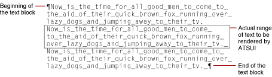

Although ASTUI requires Unicode text, you should not assume that the caret can move through the text one character at a time by moving at least two bytes at a time. The backing store position of each character in the text relative to the beginning of the text buffer is specified by a double-byte character offset of type `UniCharArrayOffset`, illustrated in Figure 2-20. The `UniCharArrayOffset` is a zero-based offset that represents the position between two Unicode characters in a text buffer. Because of the possible presence of surrogates, the double-byte `UniCharArrayOffset` edge offset does not necessarily represent a position between two logical Unicode characters.

__Figure 2-20__  Text offsets of type `UniCharArrayOffset`

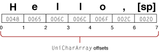

Some ATSUI functions need more information than a text offset. They also need to know whether the offset comes after the preceding character or before the next character. This is important for bidirectional text, where some of the text has a left-to-right direction and some has a right-to-left direction, as shown in Figure 2-21.

__Figure 2-21__  Bidirectional text

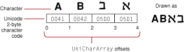

The text associated with a text layout object is divided into one or more style runs. Each style run is specified by a style object that contains a collection of style attributes, font features, and font variations that influence the display and formatting of a style run in a text layout object.

Figure 2-22 shows text that’s divided into twelve style runs. Six of the style runs in the figure are marked with the style attribute unique to that run. The other six runs that aren’t marked have two attributes set—Palatino font and a point size of 18.0.

__Figure 2-22__  Text that has twelve style runs

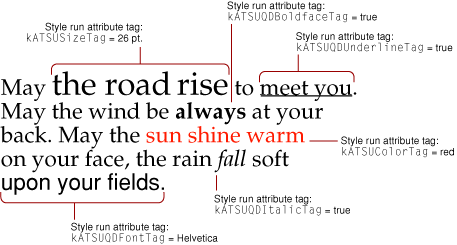

When you create a text layout object, you must provide the number of style runs in the text, the length of each style run, and the style object for each run. Style objects and style attributes are discussed in detail in [Style Objects](#apple-f4xwc4dqnrsv64tfmyxwi33df52wszbpkridgmbqgaydamrzfvkfawcsivddcnzv).

_Line and layout attributes_ control how the lines of text associated with the text layout object are displayed and formatted. Similar to style attributes, ATSUI uses a triple to specify line and layout attributes: an attribute tag, the value of the attribute it sets, and the size (in bytes) of the attribute value. Attribute tags are constants supplied by ATSUI. Attribute values may be a scaler, a structure, or a pointer.

This section discusses most of the line and layout attributes for which ATSUI provides tags. It describes a line or layout attribute, the default setting for the attribute, and in many cases shows the effect of applying the attribute to a text layout. For the complete list of line and layout attributes that can be applied to a text layout object, see _Inside Mac OS X: ATSUI Reference_.

You can create a custom line or layout attribute for an attribute for which ATSUI does not provide a tag. For more information, see [Custom Attribute Tags](#apple-f4xwc4dqnrsv64tfmyxwi33df52wszbpkridgmbqgaydamrzfvbeeq2fiveuqqi).

_Alignment_, or flushness, is the process of placing text in relation to one or both margins, which are the left and right sides (or top and bottom sides) of the text area. You can set and retrieve the alignment value using the following line and layout control attribute tag:

**Attribute tag:**
: `kATSULineFlushFactorTag`

**Data type:**
: `Fract`

**Default value:**
: `kATSUStartAlignment`

**Comment:**
: Text is drawn to the right of the left margin for horizontal text, or below the top margin for vertical text.

Text can be aligned left (`kATSUStartAlignment`), right (`kATSUEndAlignment`), or center (`kATSUCenterAlignment`), as shown in [Figure 1-16](Typography%20Concepts.md#apple-f4xwc4dqnrsv64tfmyxwi33df52wszbpkridgmbqgaydamryfvkfawcsivddcobq). You can also specify a fractional value to align text at any location between the margins. Note in [Figure 1-16](Typography%20Concepts.md#apple-f4xwc4dqnrsv64tfmyxwi33df52wszbpkridgmbqgaydamryfvkfawcsivddcobq) how the words of the text are spaced normally. Unlike justification (see [Justification Attribute Tag](#apple-f4xwc4dqnrsv64tfmyxwi33df52wszbpkridgmbqgaydamrzfvkfawcsivddcnzq)), alignment does not affect the spacing between words or individual glyphs.

The alignment attribute has an effect only with text whose width is shorter than the width specified by the width attribute (`kATSULineWidthTag`), as shown in Figure 2-23. You must specify a width if you want to have any alignment other than `kATSUStartAlignment`.

__Figure 2-23__  Use of the alignment attribute with text whose width is shorter than the line’s width

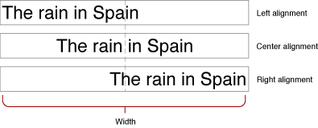

See [Justification Attribute Tag](#apple-f4xwc4dqnrsv64tfmyxwi33df52wszbpkridgmbqgaydamrzfvkfawcsivddcnzq) for additional information on how the width, alignment, and justification attributes interact.

Baseline offsets specify the positions of different baseline types with respect to one another in a line of text. You can set and retrieve these values using the following line and layout control attribute tag:

**Attribute tag:**
: `kATSULineBaselineValuesTag`

**Data type:**
: `BslnBaselineRecord`

**Default value:**
: `0` for each entry in the record

In general, a style run has a default baseline, the line to which all glyphs are visually aligned when the text is laid out. For example, in a run of Roman text, the default baseline is the Roman baseline, upon which glyphs sit (except for descenders, which extend below the baseline). In some other writing systems, glyphs hang from the baseline. When text in a line comprises runs using multiple baselines, the text layout object uses information in the baseline record to determine how to align the runs with each other.

The baseline structure contains an array of distances, in points, from a delta of `0` from the y-coordinate of the layout’s origin to the other baseline types the text layout object contains. Positive values indicate baselines above the default baseline and negative values indicate baselines below it. ATSUI can use these values to position text relative to the default baseline.

Figure 2-24 shows an example of text with multiple baselines aligned according to information in the baseline structure. Baseline types are described in detail in [Baselines](Typography%20Concepts.md#apple-f4xwc4dqnrsv64tfmyxwi33df52wszbpkridgmbqgaydamryfvkfawcsivddcnrs).

__Figure 2-24__  Text with multiple baselines aligned to the default baseline

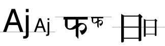

The font fallbacks attribute specifies a font fallback object to use with a text layout. You can set and retrieve the font fallback object for a text layout using the following line and layout control attribute tag:

**Attribute tag:**
: `kATSULineFontFallbacksTag`

**Data type:**
: `ATSUFontFallbacks`

**Default value:**
: `NULL`

Before you use this tag, you must associate a font fallback method with a font fallback object. Then you can call the function `ATSUSetLayoutControls`, passing as parameters the tag `kATSULineFontFallbacksTag` and the font fallback object you set up previously. For more information on using the font fallbacks attribute tag see [Using Font Fallback Objects](Advanced%20Tasks-%20Substituting%20Fonts%20and%20Modifying%20Layouts.md#apple-f4xwc4dqnrsv64tfmyxwi33df52wszbpkridgmbqgaydamzsfvkfawcsivddcmzy).

_Justification_ is the process of typographically fitting a line of text to a given width (or height, in the case of vertical text). You can set and retrieve the justification value using the following line and layout control attribute tag:

**Attribute tag:**
: `kATSULineJustificationFactorTag`

**Data type:**
: `Fract`

**Default value:**
: `kATSUNoJustification`

In ATSUI some of the information that controls justification behavior is contained in the text layout object, whereas other information is contained in the style objects associated with the text layout object. There are several different kinds of justification, including justification with white space, kashidas, glyph deformation, and ligature decomposition.

ATSUI justifies Roman text primarily by adjusting the white space between words and glyphs, as shown in Figure 2-25. Note that white space is added not only between words but also between glyphs. Also notice that ligatures such as “fi” and “ff” can be broken during justification.

__Figure 2-25__  Alignment and justification of Roman text

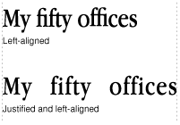

When Arabic text is justified, ATSUI distributes the available white space on the line by automatically lengthening or shortening the _kashidas_, which are the extender bars stretching between some of the glyphs of a word, as shown in Figure 2-26.

__Figure 2-26__  Alignment and justification in Arabic

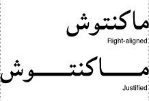

The value of the justification attribute can have fractional values from `0` through `1`. A value of `0.0` means no justification; a value of `1.0` means full justification using the width set by the width attribute tag `kATSULineWidthTag`. ATSUI interprets intermediate values, such as `0.5`, to mean partial justification (also called ragged justification). Figure 2-27 shows a line with no justification followed by a partially justified line and a fully justified line.

__Figure 2-27__  Use of the justification line and layout control attribute

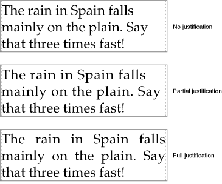

Figure 2-28 shows how the justification and alignment line and layout attributes interact with values ranging from `0.0` to `1.0`. Note that when the user chooses full justification—that is, when the line justification attribute equals `1.0`—the value set by the alignment attribute tag (`kATSULineFlushFactorTag`) has no effect.

__Figure 2-28__  Justification and alignment in a text layout object

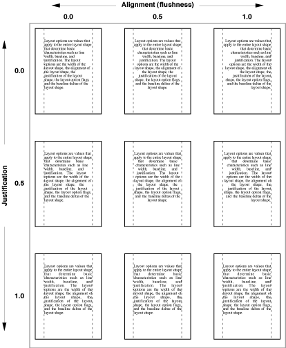

The width, justification, and alignment attributes interact, and may produce a text layout other than what you expect. Table 2-2 describe the text layout that results from the interaction of these three attributes set at various values.

__Table 2-2__  Interactions between the width, justification, and alignment attributes

| Width | Justification | Alignment | Effect |
| 0 | 0 | 0 | Text is drawn flush left. |
| 0 | 0 | > 0 | Text is drawn proportionally around the origin. For example, if the value set by the attribute tag `kATSULineFlushFactorTag` equals `1.0`, the right edge of the text aligns to the origin. |
| 0 | > 0 | 0 | Text is drawn compressed, flush left. |
| 0 | > 0 | > 0 | Text is drawn compressed at the point specified by the attribute tag `kATSULineFlushFactorTag`. |
| > 0 | 0 | 0 | Text is drawn flush left, unless the unjustified width is greater than the specified width. In this case, the text is drawn compressed into the specific width. |
| > 0 | 0 | > 0 | Text is drawn at the point specified by the attribute tag `kATSULineWidthTag` within the specified width (rather than around the origin, as happens when the width is `0`). If the unjustified width is greater than the specified width, the text is drawn compressed into the specified width. |
| > 0 | > 0 | 0 | Text is drawn in the specified width, flush left, unless the value set by the attribute tag `kATSULineJustificationFactorTag` is equal to `1.0`. In this case, both edges are flush. |
| > 0 | > 0 | > 0 | Text is drawn in the specified width at the point specified by the attribute tag `kATSULineFlushFactorTag` within the specified width, unless the value set by the attributes tag `kATSULineJustificationFactorTag` is equal to `1.0`. In this case, both edges are flush. |

The language attribute tag represents the regional language code for glyphs in a line or text layout. ATSUI uses the value associated with this tag to determine how to render region-dependent characteristics. You can set and retrieve the language region value using the following line and layout control attribute tag:

**Attribute tag:**
: `kATSULineLangRegionTag`

**Data type:**
: `RegionCode`

**Default value:**
: `kTextRegionDontCare`

The layout operation attribute specifies a layout operation (such as morphing or kerning) that you want to handle instead of letting ATSUI perform it. You can set and retrieve the layout operation value using the following line and layout control attribute tag:

**Attribute tag:**
: `kATSULayoutOperationOverrideTag`

**Data type:**
: `ATSULayoutOperationOverrideSpecifier`

**Default value:**
: `NULL`

**Comment:**
: This attribute is available starting with Mac OS X version 10.2.

For information on how to use the layout operation override tag, see [Overriding ATSUI Layout Operations](Direct-Access%20Tasks-%20Working%20With%20Glyph%20Data.md#apple-f4xwc4dqnrsv64tfmyxwi33df52wszbpkridgmbqgaydamztfvkfawcsivddcnbu).

The line ascent attribute tag represents the ascent associated with a line of text. You can obtain the line ascent value by using the following line and layout control attribute tag:

**Attribute tag:**
: `kATSULineAscentTag`

**Data type:**
: `ATSUTextMeasurement`

**Default value:**
: Maximum typographical ascent of all fonts used in a line of text or a text layout.

You can retrieve the line ascent value when you need to calculate line height. See [Calculating Line Height](Basic%20Tasks-%20Working%20With%20Objects%20and%20Drawing%20Text.md#apple-f4xwc4dqnrsv64tfmyxwi33df52wszbpkridgmbqgaydamzqfvkfawcsivddcoju).

The line descent attribute tag represents the sum of the descent and leading associated with a line of text or a text layout object. You can obtain the line descent value by using the following line and layout control attribute tag:

**Attribute tag:**
: `kATSULineDescentTag`

**Data type:**
: `ATSUTextMeasurement`

**Default value:**
: The maximum line descent and leading of all fonts in a line of text or in a text layout object.

You can retrieve the line descent value when you need to calculate line height. See [Calculating Line Height](Basic%20Tasks-%20Working%20With%20Objects%20and%20Drawing%20Text.md#apple-f4xwc4dqnrsv64tfmyxwi33df52wszbpkridgmbqgaydamzqfvkfawcsivddcoju). Note the unlike the style descent value (see [Descent Attribute Tag](#apple-f4xwc4dqnrsv64tfmyxwi33df52wszbpkridgmbqgaydamrzfvkfawcsivddeojz)), the line descent value includes the leading value.

The _line direction_ attribute specifies a left-to-right or right-to-left direction for the glyphs associated with a text layout object, regardless of their natural direction as specified in the font. You can set and retrieve the line direction value using the following line and layout control attribute tag:

**Attribute tag:**
: `kATSULineDirectionTag`

**Data type:**
: `Boolean`

**Default value:**
: Derived from the system script by calling the function `GetSysDirection`

The dominant direction of a line is the overall, controlling direction within which the individual glyph directions are set. If a Hebrew word is embedded in a line of Roman text, the dominant direction for that line is left to right, but the Hebrew word is still laid out right to left, as expected. Conversely, Roman text embedded in a line of Hebrew, in which the dominant direction is right to left, is still displayed left to right. For this reason, dominant direction has significance only in mixed-direction text.

The ATSUI text layout model accounts for dominant direction as well as glyph direction, automatically performing any reordering needed for correct display of simple mixed-direction lines of text.

Line layout options allow for fine control over the layout process. You can set and retrieve line layout options using the following attribute tag:

**Attribute tag:**
: `kATSULineLayoutOptionsTag`

**Data type:**
: `ATSLineLayoutOptions`

**Default value:**
: `kATSUNoLayoutOptions`

The value for the line layout option attributes is specified by setting flags of type `ATSLineLayoutOptions`. These flags are described in Table 2-3. Note that some of the flags override style attributes set in the style objects associated with the text layout object.

__Table 2-3__  Line layout option flags

| Flag | Description |
| `kATSLineHasNoHangers` | This value overrides any adjustment to hanging punctuation set for a style run inside the text layout object using the style attribute tag `kATSUForceHangingTag` or `kATSUHangingInhibitFactorTag`. |
| `kATSLineHasNoOpticalAlignment` | Indicates that optical alignment of characters at the text margin does not occur. This value overrides any adjustment to optical alignment set for a style run inside the text layout object using the style attribute tag `kATSUNoOpticalAlignmentTag`. |
| `kATSLineKeepSpacesOutOfMargin` | Indicates that whenever a space occurs at the end of a line that space is within the margin. (The default is to allow trailing white spaces inside the margin.) |
| `kATSLineNoSpecialJustification` | This value overrides the setting of postcompensation actions (such as ligature decomposition or kashida insertions) for a style run inside the text layout object using the style attribute tag `kATSUNoSpecialJustificationTag`. |
| `kATSLineLastNoJustification` | Indicates that the last line of a paragraph should not be justified. |
| `kATSLineFractDisable` | Specifies that the displayed line glyph positions will adjust for device metrics and integer origins. |
| `kATSLineImposeNoAngleForEnds` | Specifies that the carets at the ends of the line are perpendicular to the baseline. |
| `kATSLineFillOutToWidth` | Specifies that highlights for the line-end characters are extended from `0` to the specified line width. |
| `kATSLineTabAdjustEnabled` | Specifies that the tab character width at the end of a line is automatically adjusted to fit the specified line width. |
| `kATSLineIgnoreFontLeading` | Specifies that any leading value specified by a font or the ATSUI style attribute for leading is ignored. |
| `kATSLineApplyAntiAliasing` | Specifies that Apple Type Services (ATS) produce anti-aliased glyph images despite system preferences or Quartz settings. |
| `kATSLineNoAntiAliasing` | Specifies that ATS turn-off anti-aliasing glyph imaging despite system preferences or Quartz settings (negates the `kATSLineApplyAntiAliasing` flag if set). |
| `kATSLineDisableNegativeJustification` | Specifies that if the line width is not sufficient to hold all the line’s glyphs, glyph positions are allowed to extend beyond the line’s assigned width so negative justification is not used. |
| `kATSLineDisableAutoAdjustDisplayPos` | Specifies that lines with any integer glyph positioning (such as that due to characters that are not anti-aliased or to the `kATSLineFractDisable` flag being set) do not automatically adjust individual character positions so they are rendered more aesthetically. |
| `kATSLineUseQDRendering` | Specifies that rendering uses QuickDraw. The default rendering in ATSUI in Mac OS X is to use Quartz in a 4-bit mode unless you specifically set up a Quartz (`CGContextRef`) context. In this case the default is to use a subpixel 8-bit mode. |
| `kATSLineDisableAllJustification` | Specifies that any justification operations are not run. |
| `kATSLineDisableAllGlyphMorphing` | Specifies that any glyph morphing operations are not run. |
| `kATSLineDisableAllKerningAdjustments` | Specifies that any kerning adjustment operations are not run. |
| `kATSLineDisableAllBaselineAdjustments` | Specifies that any baseline adjustment operations are not run. |
| `kATSLineDisableAllTrackingAdjustments` | Specifies that any tracking adjustment operations are not run. |
| `kATSLineDisableAllLayoutOperations` | A convenience constant that specifies to turn off all adjustments to justification, morphing, kerning, baseline, and tracking. |
| `kATSLineUseDeviceMetrics` | Specifies to optimize for onscreen display of text. Rounded device metrics are used instead of fractional path metrics (not anti-aliased). |

The line truncation attribute specifies where truncation should occur and whether any negative justification should also be applied. You can set and retrieve the line truncation value using the following line and layout control attribute tag:

**Attribute tag:**
: `kATSULineTruncationTag`

**Data type:**
: `ATSULineTruncation`

**Default value:**
: `kATSUTruncateNone`

The Quartz context attribute specifies how ATSUI should render text. You can set and retrieve the Quartz context value using the following line and layout control attribute tag:

**Attribute tag:**
: `kATSUCGContextTag`

**Data type:**
: `CGContextRef`

**Default value:**
: `NULL`

**Comment:**
: This tag is available in Mac OS X. The default is for ATSUI to render text using Quartz at an anti-aliasing setting that simulates QuickDraw rendering. That is, a 4-bit pixel-aligned anti-aliasing.

You can use this tag to set up ATSUI to draw using Quartz in an 8-bit, subpixel rendering mode. Using this method of rendering, glyph origins are positioned on fractional points, resulting in superior rendering compared to the default 4-bit pixel-aligned rendering. For information on how to use the Quartz context tag to set up a rendering mode, see [Drawing Text Using a Quartz Context](Basic%20Tasks-%20Working%20With%20Objects%20and%20Drawing%20Text.md#apple-f4xwc4dqnrsv64tfmyxwi33df52wszbpkridgmbqgaydamzqfvkfawcsivddcobt).

The _rotation_ attribute specifies the angle (in degrees) by which the entire line should be rotated. You can set and retrieve the rotation value using the following line and layout control attribute tag:

**Attribute tag:**
: `kATSULineRotationTag`

**Data type:**
: `Fixed`

**Default value:**
: `0`

In ATSUI, rotation is counterclockwise. To produce vertical text, set the rotation value to `-90.0` degrees and the value accessed by the style attribute tag `kATSUVerticalCharacterTag` to the constant `kATSUStronglyVertical`, as described in [Glyph Orientation Attribute Tag](#apple-f4xwc4dqnrsv64tfmyxwi33df52wszbpkridgmbqgaydamrzfvkfawcsivddcobt).

The line shown on the right side of Figure 2-29 is rotated -90.0 degrees, but the glyphs have not been rotated. This type of rotation can be used to label the axis of a scientific graph.

__Figure 2-29__  A horizontal line and a line rotated -90 degrees

ATSUI uses text-locator information to determine where to break text and which options to apply to text breaks. The attribute value associated with this tag (`TextBreakLocatorRef`) contains the data needed by ATSUI to locate various kinds of text breaks. You can set and retrieve the text locator value using the following line and layout control attribute tag:

**Attribute tag:**
: `kATSULineTextLocatorTag`

**Data type:**
: `TextBreakLocatorRef` (an opaque structure defined in Unicode Utilities)

**Default value:**
: `NULL`

**Comment:**
: The default value specifies to use the region-derived locator or the default Text Utilities locator.

The width attribute specifies the desired width of a line of text, in typographic points, of the line when drawn as justified or right-aligned text. ATSUI treats vertical text as if it were horizontal. You can set and retrieve the width value using the following line and layout control attribute tag:

**Attribute tag:**
: `kATSULineWidthTag`

**Data type:**
: `ATSUTextMeasurement`

**Default value:**
: `0`

**Comment:**
: If you don’t set the line width, you can’t justify and align the text.

If a line is not justified or right-aligned, the value set by the width attribute tag `kATSULineWidthTag` is still used to apply negative justification (unless the `kATSLineDisableNegativeJustification` tag is set). _Negative justification_ is the process of condensing text that exceeds the specified width so that the text fits the specified width. See [Justification Attribute Tag](#apple-f4xwc4dqnrsv64tfmyxwi33df52wszbpkridgmbqgaydamrzfvkfawcsivddcnzq) for additional information on how the width, alignment, and justification attributes interact.

If the line contains glyphs with large negative side bearings, hanging punctuation, or optically aligned edges, the final width of the displayed text may be different from the value specified by the width attribute. See [Hanging Punctuation Attribute Tag](#apple-f4xwc4dqnrsv64tfmyxwi33df52wszbpkridgmbqgaydamrzfvkfawcsivddcobx) and [Optical Alignment Attribute Tag](#apple-f4xwc4dqnrsv64tfmyxwi33df52wszbpkridgmbqgaydamrzfvkfawcsivddcojv) for more information.

If you use the width of the image bounding rectangle and the typographic bounding rectangle as a measure of the overall line length, the measurements may be slightly different from each other. See [Text Measurements](Typography%20Concepts.md#apple-f4xwc4dqnrsv64tfmyxwi33df52wszbpkridgmbqgaydamryfvkfawcsivddcmzy) for more information.

[Next](Basic%20Tasks-%20Working%20With%20Objects%20and%20Drawing%20Text.md)[Previous](Typography%20Concepts.md)

