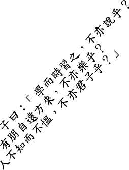
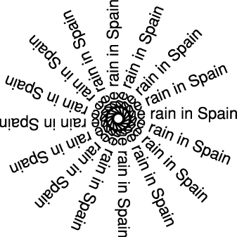
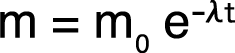
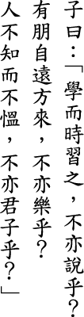
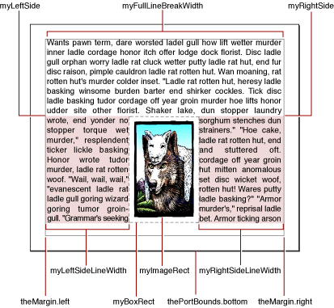

> 导航：[总目录](../../../README.md) · [documentation](../../../_indexes/documentation.md) · [ATSUI Programming Guide](Introduction%20to%20ATSUI%20Programming%20Guide.md)


[Next](Interactive%20Tasks-%20Supporting%20Carets%20and%20Highlighting%20Text.md)[Previous](ATSUI%20Style%20and%20Text%20Layout%20Objects.md)

# Basic Tasks: Working With Objects and Drawing Text

This chapter provides general guidelines for using ATSUI and provides step-by-step instructions for the basic tasks you can perform with ATSUI. These tasks are described in the following sections:

- [Creating Style Objects and Setting Attributes](#apple-f4xwc4dqnrsv64tfmyxwi33df52wszbpkridgmbqgaydamzqfvkfawcsivddcnzy) shows how to use ATSUI functions to create a style object and provides instructions for associating one or more style attributes with an object.
- [Creating a Text Layout Object and Setting Attributes](#apple-f4xwc4dqnrsv64tfmyxwi33df52wszbpkridgmbqgaydamzqfvkfawcsivddcnju) describes how to create a text layout object, set layout attributes to control the text associated with the text layout object, and associate style objects with the text layout.
- [Determining Paragraphs in a Unicode Text Block](#apple-f4xwc4dqnrsv64tfmyxwi33df52wszbpkridgmbqgaydamzqfvkfawcsivddcobw) provides an example of how to find paragraph separators in a block of text.
- [Drawing Horizontal Text](#apple-f4xwc4dqnrsv64tfmyxwi33df52wszbpkridgmbqgaydamzqfvkfawcsivddcobu) shows how to use ATSUI to render horizontal text.
- [Drawing Text Using a Quartz Context](#apple-f4xwc4dqnrsv64tfmyxwi33df52wszbpkridgmbqgaydamzqfvkfawcsivddcobt) details how to use a Quartz drawing context in conjunction with ATSUI.
- [Drawing Equations](#apple-f4xwc4dqnrsv64tfmyxwi33df52wszbpkridgmbqgaydamzqfvbegskeivausqi) shows how to use style attributes to draw equations that contain subscripts and superscripts.
- [Drawing Vertical Text](#apple-f4xwc4dqnrsv64tfmyxwi33df52wszbpkridgmbqgaydamzqfvbegskkifeeqri) describes how to use ATSUI to renter vertical text.
- [Breaking Lines](#apple-f4xwc4dqnrsv64tfmyxwi33df52wszbpkridgmbqgaydamzqfvkfawcsivddcnjz) shows how to set soft line breaks programmatically and how to use ATSUI’s batch line-breaking function.
- [Measuring Text](#apple-f4xwc4dqnrsv64tfmyxwi33df52wszbpkridgmbqgaydamzqfvkfawcsivddcnjv) provides information on the functions to use to obtain text measurements.
- [Calculating Line Height](#apple-f4xwc4dqnrsv64tfmyxwi33df52wszbpkridgmbqgaydamzqfvkfawcsivddcoju) discusses the preferred method for setting line height in Mac OS X version 10.2 and describes what to you if your application runs in an earlier version of the Mac OS.
- [Flowing Text Around a Graphic](#apple-f4xwc4dqnrsv64tfmyxwi33df52wszbpkridgmbqgaydamzqfvkfawcsivddcmzz) shows the preferred way to draw text so that it flows around an image.
- [Setting Up a Tab Ruler](#apple-f4xwc4dqnrsv64tfmyxwi33df52wszbpkridgmbqgaydamzqfvkfawcsivddcojt) provides step-by-step instructions for setting up a tab ruler for a text layout object.

Before you read this chapter, you should be familiar with the concepts discussed in [Typography Concepts](Typography%20Concepts.md#apple-f4xwc4dqnrsv64tfmyxwi33df52wszbpkridgmbqgaydamryfvkfami) and [ATSUI Style and Text Layout Objects](ATSUI%20Style%20and%20Text%20Layout%20Objects.md#apple-f4xwc4dqnrsv64tfmyxwi33df52wszbpkridgmbqgaydamrzfvkfami), [ATSUI Style and Text Layout Objects](ATSUI%20Style%20and%20Text%20Layout%20Objects.md#apple-f4xwc4dqnrsv64tfmyxwi33df52wszbpkridgmbqgaydamrzfvkfami).

This chapter provides a number of code samples to illustrate how to use ATSUI. You can obtain the sample applications from which this code is taken, as well as additional code samples, from the developer sample code website:

[http://developer.apple.com/samplecode/](https://developer.apple.com/samplecode/)

There are a number of guidelines you should follow to assure optimal performance and efficient memory use when you use ATSUI. This section summarizes them. The sample code in this and the other task chapters follows these guidelines.

- Once you have created a style object, keep it until you no longer need it. That is, do not dispose of a style object and then recreate it each time you need to draw using that style. See [Creating Style Objects and Setting Attributes](#apple-f4xwc4dqnrsv64tfmyxwi33df52wszbpkridgmbqgaydamzqfvkfawcsivddcnzy).
- Associate a text layout object with a paragraph of text. If you associate a text layout object with a smaller unit of text such as a word, line, or style run, ATSUI won’t be able to lay out text efficiently. In addition, text may not be laid out properly. Using a unit of text that is longer than one paragraph may cause extra coding on your part if you want to treat the last line of a paragraph separately from the other lines (for example, justifying everything except the last line in a paragraph). See [Creating a Text Layout Object and Setting Attributes](#apple-f4xwc4dqnrsv64tfmyxwi33df52wszbpkridgmbqgaydamzqfvkfawcsivddcnju).
- Keep a text layout object around even when the text associated with it is altered. Call the functions `ATSUSetTextPointerLocation`, `ATSUTextDeleted`, or `ATSUTextInserted` to manage the altered text.
- Use the QuickDraw functions `QDBeginCGContext` and `QDEndCGContext` to do Quartz drawing instead of the function `CreateCGContextForPort`. See [Drawing Text Using a Quartz Context](#apple-f4xwc4dqnrsv64tfmyxwi33df52wszbpkridgmbqgaydamzqfvkfawcsivddcobt).
- Use the same Quartz context (`CGContext`) until all drawing is completed. Don’t create and destroy the context each time you draw unless it is absolutely necessary. See [Drawing Text Using a Quartz Context](#apple-f4xwc4dqnrsv64tfmyxwi33df52wszbpkridgmbqgaydamzqfvkfawcsivddcobt).
- Call the function `ATSUGetGlyphBounds` to get the ascent and descent of a line and the typographic bounds after layout. Don’t call `ATSUGetUnjustifiedBounds` for these measurements because that function might need to perform a separate layout. See [Measuring Text](#apple-f4xwc4dqnrsv64tfmyxwi33df52wszbpkridgmbqgaydamzqfvkfawcsivddcnjv).
- Set soft line breaks programmatically rather than manually. You can set line breaks by calling the function `ATSUBreakLine` with the `iUseAsSoftLineBreak` parameter. See [Breaking Lines](#apple-f4xwc4dqnrsv64tfmyxwi33df52wszbpkridgmbqgaydamzqfvkfawcsivddcnjz).
- When you have text that must flow around a graphic, use one text layout object per paragraph. Flow the text around the graphic by varying the line width for each line appropriately rather than using multiple layouts to flow the text around a graphic. See [Flowing Text Around a Graphic](#apple-f4xwc4dqnrsv64tfmyxwi33df52wszbpkridgmbqgaydamzqfvkfawcsivddcmzz),
- Use font fallback objects (`ATSUFontFallbacks`) instead of the global font fallbacks, as global font fallbacks will be deprecated. A font fallback object works with a specific text layout object. See [Using Font Fallback Objects](Advanced%20Tasks-%20Substituting%20Fonts%20and%20Modifying%20Layouts.md#apple-f4xwc4dqnrsv64tfmyxwi33df52wszbpkridgmbqgaydamzsfvkfawcsivddcmzy).
- Keep font fallback objects (`ATSUFontFallbacks`) around as long as possible, and share them between text layout objects. See [Using Font Fallback Objects](Advanced%20Tasks-%20Substituting%20Fonts%20and%20Modifying%20Layouts.md#apple-f4xwc4dqnrsv64tfmyxwi33df52wszbpkridgmbqgaydamzsfvkfawcsivddcmzy).
- Create a standard Carbon Font menu or build a Font menu or list when your application first starts up. Get the font selection from the menu instead of calling the function `ATSUFindFontFromName` to find a font.

ATSUI style objects are opaque objects that represent a collection of stylistic attributes. Each attribute is defined by three values (a triple):

- an attribute tag
- the size of the attribute value associated with the tag
- the value for the attribute specified by the tag

To create an ATSUI style object, you must do the following:

1. Declare storage for the style.

   For example:

```
ATSUStyle       gDefaultStyle;
```
2. Create the style object.

   You can use the function `ATSUCreateStyle`. For example:

```
OSStatus       status = noErr;

status = ATSUCreateStyle (&gDefaultStyle);
```
3. Set up a triple (tag, size, value) for each attribute associated with the style.

   Typically, you declare three parallel arrays, one for attribute tags, one for sizes, and the third array for the value of the attribute. ATSUI supplies constants that specify attribute tags. For example, the following code sets up two attributes—a font size (`kATSUSizeTag`) and style (`kATSUQDBoldfaceTag`):

```
ATSUAttributeTag  theTags[] =  {kATSUSizeTag, kATSUQDBoldfaceTag};
ByteCount        theSizes[] = {sizeof(Fixed), sizeof(Boolean)};

Fixed   atsuSize = Long2Fix (12);
Boolean isBold = TRUE;
ATSUAttributeValuePtr theValues[] = {&atsuSize, &isBold};
```

   See [Style Objects](ATSUI%20Style%20and%20Text%20Layout%20Objects.md#apple-f4xwc4dqnrsv64tfmyxwi33df52wszbpkridgmbqgaydamrzfvkfawcsivddcnzv) for more information on the attribute tags that are available in ATSUI.
4. Associate the attributes with the style object.

   You can use the function `ATSUSetAttributes`. You pass in the number of attributes you want to set and the three parallel arrays that represent the attribute tags, sizes of the values, and the values themselves, as shown in the following code:

```
status = ATSUSetAttributes (gDefaultStyle,
                            2,
                            theTags,
                            theSizes,
                            theValues);
```

Note that a style object is not associated with any text; it simply specifies a collection of attributes. You can set up style objects for your application once, and then reuse them over and over as needed. For example, you could set up style objects to define such styles as emphasis, heading level, superscript, subscript, and bold.

You can create a style object by copying another style object using the function `ATSUCreateAndCopyStyle`. Copying a style object is useful if you want to make a set of related styles. For example, if you have already created a style object to define a default font, font size, and font color, you could make an italic style based on the default by calling the following function:

```
ATSUStyle       italicStyle;
ATSUCreateAndCopyStyle (defaultStyle, &italicStyle);
```

Then you would set up a triple for the italic attribute:

```
ATSUAttributeTag    theTags[] =  {kATSUQDItalicTag};
ByteCount           theSizes[] = {sizeof(Boolean)};
Boolean             isItalic = TRUE;

ATSUAttributeValuePtr theValues[] = {&isItalic};
```

Finally, you associate the italic attribute with the `italicStyle` object:

```
status = ATSUSetAttributes (gItalicStyle,
                            1,
                            theTags,
                            theSizes,
                            theValues);
```

By using the function `ATSUCreateAndCopyStyle`, the `italicStyle` object inherits the attributes of the `defaultStyle` object and has any other attributes you set by calling the function `ATSUSetAttributes`.

When you are done using a style object, you must call the function `ATSUDisposeStyle` to dispose of it. For example, to dispose of the `italicStyle` object, you’d use the following line of code:

```
ATSUDisposeStyle (italicStyle);
```

Remember, it’s best to reuse styles rather than to create and dispose of a style each time you need them in your application. You can create all the common styles you need when your application starts up, and dispose of them when your application quits. Listing 3-1 shows code that creates styles prior to the application event loop and disposes of styles when the application event loop terminates.

__Listing 3-1__  Code that keeps style objects around until the application quits

```
MyMakeStyles();
RunApplicationEventLoop();
MyDisposeStyles();
```

Once you have created a style object, you can pass it to any ATSUI function that takes a style object as a parameter, such as the function `ATSUSetRunStyle`. You can pass an array of style objects to such functions as `ATSUCreateTextLayoutWithTextPtr` to define the attributes for style runs in a text layout object.

ATSUI text layout objects are opaque objects that contain a pointer or handle to a block of Unicode text, style run information, and line and layout controls for the block of text.

To create an ATSUI text layout object, you must do the following:

1. Declare storage for the text layout.

   For example:

```
ATSUTextLayout  myTextLayout;
```
2. Create the text layout object by calling the functions `ATSUCreateTextLayout` or `ATSUCreateTextLayoutWithTextPtr`.

   For example, the following code creates a text layout object (`myTextLayout`) for an entire text buffer (`myTextBlock`):

```
OSStatus       status = noErr;
UniCharCount length = kATSUToTextEnd;

status = ATSUCreateTextLayoutWithTextPtr ((UniChar*) myTextBlock,
                kATSUFromTextBeginning,  // offset from beginning
                kATSUToTextEnd,         // length of text range
                myTextBlockLength,      // length of text buffer
                1,                      // number of style runs
                &length,         // length of the style run
                &myArrayOfStyleObjects,
                &myTextLayout);
```

   On output, `myTextLayout` refers to the newly created text layout object. Note that you own the text in the buffer you pass to the function `ATSUCreateTextLayoutWithTextPtr`.

   Each ATSUI text layout can have no more than 64,000 different styles.
3. Set up a triple (tag, size, value) for each line and layout attribute associated with the text layout.

   Typically, you declare three parallel arrays, one for attribute tags, one for sizes, and the third array for the value of the attribute. ATSUI supplies constants that specify attribute tags. For example, the following code sets up two attributes—flushness (`kATSULineFlushFactorTag`) and justification (`kATSULineJustificationFactorTag`):

```
ATSUAttributeTag  theTags[] =  {kATSULineFlushFactorTag,
                            kATSULineJustificationFactorTag};
ByteCount   theSizes[] = {sizeof(Fract), sizeof(Fract)};
Fract   myFlushFactor = kATSUStartAlignment;
Fract   myJustFactor = kATSUFullJustification;

ATSUAttributeValuePtr theValues[] = {&myFlushFactor, &myJustFactor};
```

   See [Line and Layout Attributes](ATSUI%20Style%20and%20Text%20Layout%20Objects.md#apple-f4xwc4dqnrsv64tfmyxwi33df52wszbpkridgmbqgaydamrzfvkfawcsivddcnrv) for more information on the attribute tags available in ATSUI.
4. Associate the line and layout attributes with the text layout object by calling the function `ATSUSetLayoutControls`.

   For example:

```
status = ATSUSetLayoutControls (myTextLayout,
                            2,
                            theTags,
                            theSizes,
                            theValues);
```

You can also create a text layout object by calling the function `ATSUCreateAndCopyTextLayout`. This function is useful if you want all text layout objects in your application to use the same line and layout attributes. After you have created the new text layout object, you can call the function `ATSUSetTextPointerLocation` to associate the new text layout object with the appropriate block of text. 

This section shows you how to find a paragraph within a block of Unicode text. Although determining paragraphs is not a task that uses ATSUI functions, breaking a block of text into paragraph-sized chunks is important if you want to use ATSUI efficiently. Once the text is broken into paragraphs, you can create a text layout object for each paragraph.

To find a paragraph, you can write code that performs steps similar to the following:

1. Define Unicode characters that act as paragraph separators. Exactly what you choose to define as a paragraph separator depends on the needs of your specific application. For example, these five character sequences can be used to separate paragraphs:

   - ASCII newline '\n'
   - ASCII return '\r'
   - ASCII return followed by ASCII newline
   - Unicode line separator
   - Unicode paragraph separator
2. Iterate through the block of text until you find a paragraph separator.

The code in Listing 3-2 shows a `MyFindParagraph` function that takes a block of Unicode text, the total length of the text block, and an offset into the text. The function finds the next paragraph separator and returns whether or not the function reached the end of the text block. A detailed explanation for each numbered line of code appears following the listing.

__Listing 3-2__  A function to find a paragraph in a block of Unicode text

```
Boolean MyFindParagraph (UniChar *theText,
                    UniCharCount theTextLength,
                    UniCharArrayOffset paragraphStart,
                    UniCharArrayOffset *paragraphEnd)
{
    UniChar         CR   = 0x000D;  // 1
    UniChar         LF   = 0x000A;  // 2
    UniChar         LSEP = 0x2028;  // 3
    UniChar         PSEP = 0x2029;  // 4
    UniChar         NL   = 0x0085;// 5
    UniCharCount    currentPosition;
    UniChar         currentChar;
    Boolean         endOfText = false;

    if (theText == NULL) // 6
    {
        *paragraphEnd = 0;
        return true;
    }

    for (currentPosition=paragraphStart; (currentPosition < theTextLength);
                                currentPosition++) // 7
    {
        currentChar = theText[currentPosition];

        if ( (currentChar == PSEP) || (currentChar ==  LSEP) ||
                            (currentChar ==  LF) || (currentChar ==  NL))
        {
            break;
        }
        if ( currentChar == CR )
        {
            if ( currentPosition < (theTextLength - 1) )
            {
                if ( theText[currentPosition + 1] == LF ) // 8
                    currentPosition++;
             }
            break;
        }
    }

    if (currentPosition == theTextLength)
                    currentPosition--;// 9
    if (currentPosition == (theTextLength - 1))
                    endOfText = true;// 10

    *paragraphEnd = currentPosition + 1;// 11

    return endOfText;// 12
}
```

Here’s what the code does:

1. Declares a variable to represent the ASCII return character.
2. Declares a variable to represent the ASCII newline character.
3. Declares a variable to represent the Unicode line separator character.
4. Declares a variable to represent the Unicode paragraph separator character.
5. Declares a variable to represent the Unicode next line character that is a C1 control used by XML for line breaks.
6. Checks to see if there is text to process. If the pointer is `NULL`, returns from the function.
7. Iterates through the block of text until it finds a character sequence that indicates the end of a paragraph.
8. Treats the ASCII new line and ASCII return combination as if it were a single entity, by advancing through the text buffer accordingly.
9. Checks for the special case of reaching the end of the text without finding a paragraph. In this case, the current position must be decremented by one.
10. Checks to see if it reached the end of the text buffer.
11. Returns the position just after the end of the paragraph. This position is returned because an ATSUI-style offset is between array elements (an edge offset). See [Typography Concepts](Typography%20Concepts.md#apple-f4xwc4dqnrsv64tfmyxwi33df52wszbpkridgmbqgaydamryfvkfami) for information on edge offsets in ATSUI.
12. Returns a Boolean value to indicate whether the end of text was reached (`true`) or not (`false`).

Drawing text is easy once you have created a text layout object and associated text with the object. You call the function `ATSUDrawText`, as shown in the following code:

```
ATSUDrawText (myTextLayout,
            kATSUFromTextBeginning,
            kATSUToTextEnd,
            myXLocation,
            myYLocation);
```

The function `ATSUDrawText` take five parameters:

- A text layout object. See [Creating a Text Layout Object and Setting Attributes](#apple-f4xwc4dqnrsv64tfmyxwi33df52wszbpkridgmbqgaydamzqfvkfawcsivddcnju) for information on how to create a text layout object.
- The offset from the beginning of the text to the first character that should be rendered.
- The length of the text range to render. The constant `kATSUToTextEnd` specifies to render to the end of the text buffer.
- The x-coordinate of the origin at which to render the text. You specify QuickDraw or Quartz 2D coordinates, depending on whether you are using a QuickDraw port or a Quartz graphics context (`CGContext`). Coordinates must be specified as `Fixed` values.
- The y-coordinate of the origin at which to render the text.

With Mac OS X version 10.2, ATSUI renders text through Quartz, even if you do not attach a `CGContext` to a text layout object. In this default case, ATSUI retrieves the internal canonical `CGContext` of the current port, and renders to that port using Quartz at an anti-aliasing setting that simulates QuickDraw rendering. That is, a 4-bit pixel-aligned anti-aliasing. With this method of rendering, the origins of the glyphs always fall on integer positions and can lead to less-than-ideal glyph placements even after ATSUI makes fine adjustments to the integer positioning. This section shows you how to you set up ATSUI to instead use an 8-bit, subpixel rendering. Using this method of rendering, glyph origins are positioned on fractional points, resulting in superior rendering compared to ATSUI’s default 4-bit pixel-aligned rendering.

To set up ATSUI to use an 8-bit, subpixel rendering through Quartz, you must perform the following tasks:

1. Set up a Quartz context (`CGContext`) for your application by using the QuickDraw function `QDBeginCGContext`. When you are done using the `CGContext`, you must call the function `QDEndCGContext`.

   You need to call the function `QDBeginCGContext` only once in your application, as you should use the same `CGContext` until all drawing is completed.
2. Set the Quartz context as a layout attribute for the text layout object whose text you want to draw, using the tag `kATSUCGContextTag`, and by calling the function `ATSUSetLayoutControls`.

   For example, if you already set up a Quartz context named `myCGContext`, you use the following code to set the Quartz context as an attribute of a text layout object (`myTextLayout`) you created previously:

```
ATSUAttributeTag        theTags[0] = kATSUCGContextTag;
ByteCount               theSizes[0] = sizeof (CGContextRef);
ATSUAttributeValuePtr   theValues[] = &myCGContext;

ATSUSetLayoutControls (myTextLayout,
                    1,
                    theTags,
                    theSizes,
                    theValues);
```

When you use Quartz with ATSUI, you can use all the effects available through Quartz 2D. You can rotate the Quartz context to achieve a number of effects, such as the angled text as shown in Figure 3-1 and the rotated text shown in Figure 3-2.

Listing 3-3 shows the code necessary to draw rotated text using Quartz 2D. First, you call the Quartz 2D function `CGContextRotateCTM` to rotate the Quartz context by a specified angle. Then, when you call the function `ATSUDrawText`, the text is drawn into the rotated context. The text appears on the screen when you call the function `CGContextFlush`.

__Figure 3-1__  Text drawn at an angle



__Listing 3-3__  Using a Quartz context to rotate text

```
CGContextRotateCTM (myCGContext, myAngle);
ATSUDrawText (myTextLayout,
            kATSUFromTextBeginning,
            kATSUToTextEnd,
            myXLocation,
            myXLocation);
CGContextFlush (myCGContext);
```


__Figure 3-2__  Rotated text



Drawing scientific and mathematical equations often requires drawing subscripts and superscripts, such as those shown in Figure 3-3. You can draw characters as subscripts or a superscripts by applying the tag `kATSUCrossStreamShiftTag` to the characters. For horizontal text, a positive cross-stream value shifts a glyph upwards, whereas a negative cross-stream value shifts a glyph downwards. You also need to adjust the font size of the subscripts and superscripts appropriately, as these characters are usually drawn with a smaller font size than that used for the main characters of the equation.

__Figure 3-3__  A scientific equation drawn by adjusting cross-stream shift values



You can create styles for subscripts and superscripts when your application launches, and use the styles whenever you need to draw an equation. You need to perform the following steps to set up subscript and superscript styles:

1. Allocate space for the ATSUI style objects.

   The subscript and superscript styles are based on a default style object.

```
ATSUStyle       myDefaultStyle.
                mySubscriptStyle,
                mySuperscriptStyle;
```
2. Create and set attributes for the default style.

   As for any style, you must set up a triple (tag, size, value) for each attribute and call the function `ATSUSetAttributes` to apply the attributes to the style.

```
ATSUCreateStyle (&myDefaultStyle);
ATSUAttributeTag  theTags[] =  {kATSUSizeTag, kATSUQDItalicTag};

ByteCount theSizes[] = {sizeof (Fixed), sizeof (Boolean)};

Fixed       myFontSize = Long2Fix (myDefaultSize);
Boolean     isItalic = FALSE;

ATSUAttributeValuePtr theValues[] = {&myFontSize, &isItalic};

status = ATSUSetAttributes (gDefaultStyle, 2,
                            theTags, theSizes, theValues);
```
3. Create and set attributes for the subscript style.

```
ATSUCreateAndCopyStyle (myDefaultStyle, &mySubScriptStyle);
ATSUAttributeTag  theTags[] =  { kATSUSizeTag,
                                kATSUCrossStreamShiftTag};
ByteCount theSizes[] = {sizeof(Fixed),
                        sizeof(Fixed)};
Fixed    mySubScriptSize = Long2Fix (myDefaultSize - 2);
Fixed    mySubScriptShift = Long2Fix (-6);

ATSUAttributeValuePtr theValues[] = {&mySubScriptSize,
                                     &mySubScriptShift};

status = ATSUSetAttributes (mySubScriptStyle, 2,
                            theTags, theSizes, theValues);
```
4. Create and set attributes for the superscript style.

```
ATSUCreateAndCopyStyle (myDefaultStyle, &mySuperScriptStyle);
ATSUAttributeTag  theTags[] =  { kATSUSizeTag,
                                 kATSUCrossStreamShiftTag};
ByteCount theSizes[] = {sizeof(Fixed), sizeof(Fixed)};

Fixed    mySuperScriptSize = Long2Fix (myDefaultSize - 2);
Fixed    mySuperScriptShift = Long2Fix (6);

ATSUAttributeValuePtr theValues[] = {&mySuperScriptSize,
                                     &mySuperScriptShift};

status = ATSUSetAttributes (mySuperScriptStyle, 2,
                            theTags, theSizes, theValues);
```

You should keep these styles around as long as you need them. Style objects are independent of text; you can use them over and over.

You can apply the subscript and superscript styles to the appropriate characters in an equation by following these steps:

1. Create a text layout object for the equation text.

   Use the default style on the entire text string to create the text layout object.

```
length = sizeof(myPhysicsEquation)/sizeof(UniChar);
status = ATSUCreateTextLayoutWithTextPtr ((UniChar*) myPhysicsEquation,
                            0,
                            length,
                            length,
                            1,
                            &length,
                            &myDefaultStyle,
                            &myEquationLayout);
```
2. You may need to set up transient font matching to assure that the glyphs in the equation are rendered appropriately.

```
status = ATSUSetTransientFontMatching (myEquationLayout, true);
```
3. Set the subscript and superscript styles.

   You apply the subscript and superscript styles to the appropriate characters by calling the function `ATSUSetRunStyle`. You must specify the starting character to which the style applies and specify the number of characters in the style run.

```
status = ATSUSetRunStyle (myEquationLayout,
                        mySubScriptStyle,
                        myStartofSubScript,
                        myCharsInSubScript);
 status = ATSUSetRunStyle (myEquationLayout,
                        mySuperScriptStyle,
                        myStartofSuperScript,
                        myCharsInSubScript);
```
4. Draw the equation.

```
ATSUDrawText (myEquationLayout,
                kATSUFromTextBeginning,
                sizeof(myPhysicsEquation)/sizeof(UniChar),
                Long2Fix (myXPenLocation),
                Long2Fix (myYPenLocation));
```


If you want to draw text vertically—for example Chinese, Japanese, or Korean text—you must set up ATSUI to use vertical forms of the glyphs and rotate the line. The vertical form of a glyph is a style attribute; whereas line rotation is a line and layout attribute. If you simply rotate a line without also setting up ATSUI to use vertical forms of the glyphs, you get a result similar to that shown in Figure 3-4. If you use vertical forms of the glyphs and then rotate the line, you get results similar to that shown in Figure 3-5. Compare the glyphs in the center of the third column in Figure 3-5 with Figure 3-4 to see the effect of rotating both the glyphs and the line.

__Figure 3-4__  A rotated line of text that does not use vertical forms of the glyphs


__Figure 3-5__  A rotated line of text that uses vertical forms of the glyphs



To draw vertical text (rotated line and rotated glyphs), perform the following steps:

1. Create a style object and set it to use vertical forms.

   You can base this style object on a default style object that you’ve already created for your application.

   As for any style, you must set up a triple (tag, size, value) for each attribute and call the function `ATSUSetAttributes` to apply the attributes to the style.

```
ATSUCreateAndCopyStyle(myDefaultStyle, &myVerticalStyle);
ATSUVerticalCharacterType verticalType = kATSUStronglyVertical;
theTags[0] = kATSUVerticalCharacterTag;
theSizes[0] = sizeof (ATSUVerticalCharacterType);
theValues[0] = &verticalType;

ATSUSetAttributes (myVerticalStyle, 1,
                    theTags, theSizes, theValues);
```
2. Rotate the line by setting line rotation as a layout attribute.

   As for any line or layout attribute, you must set up a triple (tag, size, value) for each attribute and call the function `ATSUSetLayoutControls` to apply the attributes to the text layout object.

```
ATSUCreateTextLayoutWithTextPtr(
                (UniChar *) myTextString,
                myOffset,
                length,
                totalLength,
                styleRunCount,
                &length,
                &myVerticalStyle,
                &myTextLayout);
Fixed myAngleToRotateText = FloatToFixed (-90.0); // degrees
theTags[0] = kATSULineRotationTag;
theSizes[0] = sizeof (Fixed);
theValues[0] = &myAngleToRotateText;
ATSUSetLayoutControls (myTextLayout, 1,
                        theTags, theSizes, theValuePtrs);
```
3. Draw the text.

```
ATSUDrawText (myTextLayout,
                kATSUFromTextBeginning,
                sizeof(myTextString)/sizeof(UniChar),
                Long2Fix (myXPenLocation),
                Long2Fix (myYPenLocation));
```


ATSUI provides two functions for calculating and setting soft line breaks programmatically: `ATSUBreakLine` and `ATSUBatchBreakLines`. Calling the function `ATSUBatchBreakLines` is equivalent to repeatedly calling the function `ATSUBreakLine`, as shown in Listing 3-4. It’s preferable that you use `ATSUBatchBreakLines` because this function performs more efficiently than repeated calls to `ATSUBreakLine`.

The code fragment in Listing 3-4 compares batch line breaking to calculating breaks on a line-by-line basis. A detailed explanation for each numbered line of code appears following the listing. If you’ve used the `ATSUBreakLine` function before, you’ll see that replacing it with `ATSUBatchBreakLines` reduces your code by a few lines and improves the performance of your application.

__Listing 3-4__  A code fragment that performs line breaking

```
ATSUTextLayout       myTextLayout;
Fixed                myLineBreakWidth;
ItemCount            myNumSoftBreaks;
UniCharCount         myTextLength;
UniCharArrayOffset   *mySoftBreaks,
                     myStarting Offset,
                     myCurrentStart,
                     myCurrentEnd;

 /* Insert your code to set up the text layout object

#if USE_BATCHBREAKLINES // 1
    ATSUBatchBreakLines (myTextLayout,
                            myStartingOffset,
                            myTextLength,
                            myLineBreakWidth,
                            &myNumSoftBreaks);// 2
#else
    myCurrentStart = myStartingOffset;// 3
    myCurrentEnd = myTextLength;
    do
    {
        status = ATSUBreakLine (myTextLayout,
                            myCurrentStart,
                            myLineBreakWidth,
                            true,
                            &myCurrentEnd);// 4
        myCurrentStart = myCurrentEnd;
    } while (myCurrentEnd < myTextLength);
#endif

ATSUGetSoftLineBreaks (myTextLayout,
            kATSUFromTextBeginning,
            kATSUToTextEnd,
            0, NULL, &myNumSoftBreaks);// 5
mySoftBreaks = (UniCharArrayOffset *) malloc(myNumSoftBreaks *
                     sizeof(UniCharArrayOffset));// 6
ATSUGetSoftLineBreaks (myTextLayout,
            kATSUFromTextBeginning,
            kATSUToTextEnd,
            myNumSoftBreaks, mySoftBreaks, &myNumSoftBreaks);// 7

 // Insert your code here to loop over all the soft breaks and draw them

free (mySoftBreaks);// 8
```

Here’s what the code does:

1. Checks to see if batch line breaking should be used. This code is here only to illustrate the difference between batch line breaking and using the older function `ATSUBreakLine`.
2. Calls the function `ATSUBatchBreakLines`. You must supply the text layout object that is associated with the text you want to process. You must also supply a starting offset, the length of the text, and a line width. ATSUI returns the number of soft breaks that are calculated.
3. If batch line breaking isn’t used, sets up variables for the starting and ending offsets of the text for which you want to calculate line breaks.
4. Calls the function `ATSUBreakLine` to calculate line breaks. The parameter `iUseAsSoftLineBreak` is set to `true` to indicate that ATSUI should automatically set the line break to the value returned by the `oLineBreak` parameter (`myCurrentEnd`). You must also provide as parameters the first character of the text range associated with the text layout object and the line width.
5. Calls the function `ATSUGetSoftLineBreaks` to obtain the number of soft line breaks calculated by ATSUI. This is a function you typically call twice. The first time, pass `NULL` for the `oBreaks` parameter to obtain the number of line breaks. Then, allocate memory for the line break array and call the function again to obtain the array, as shown in the next two steps.
6. Allocates the appropriate amount of memory for the line break array.
7. Calls the function `ATSUGetSoftLineBreaks` a second time, but this time passes an array of the appropriate size. On output, the array contains offsets from the beginning of the text buffer to each of the soft line breaks in the text range.
8. Frees the previously allocated memory.

Although it is possible for you to set soft line breaks instead of letting ATSUI do it for you (by passing `false` for the parameter `iUseAsSoftLineBreak`), you shouldn’t do so unless it is absolutely necessary. See [Flowing Text Around a Graphic](#apple-f4xwc4dqnrsv64tfmyxwi33df52wszbpkridgmbqgaydamzqfvkfawcsivddcmzz) for an example of using the function `ATSUBreakLine` to set line breaks.

The trick with measuring text is to choose the appropriate function to obtain text measurements. In most cases, an application needs to obtain the typographic bounds of a line of text after final layout. After-layout typographic bounds take into account rotation and other layout attributes that have been applied to the line. If these are the measurements you need, call the function `ATSUGetGlyphBounds`. See [Flowing Text Around a Graphic](#apple-f4xwc4dqnrsv64tfmyxwi33df52wszbpkridgmbqgaydamzqfvkfawcsivddcmzz) for an example of how the function `ATSUGetGlyphBounds` is used to get ascent and descent values. The obtained values are then used to set pen location prior to drawing a line of text.

In rare cases, an application may need to obtain the typographic bounds of a line of text prior to final layout. For example, before–justification/alignment typographic bounds can be used when you need to determine your own line breaks or the leading and line space to impose on a line. Before–justification/alignment typographic bounds ignore any previously–set line attributes such as line rotation, alignment, justification, ascent, and descent. If you need before–justification/alignment measurements, call the function `ATSUGetUnjustifiedBounds`.

For more information on typographic bounds, see [Text Measurements](Typography%20Concepts.md#apple-f4xwc4dqnrsv64tfmyxwi33df52wszbpkridgmbqgaydamryfvkfawcsivddcmzy). See _Inside Mac OS X: ATSUI Reference_ for documentation on the functions `ATSUGetGlyphBounds` and `ATSUGetUnjustifiedBounds`.

Your application needs to space lines appropriately when it draws text. When you calculate line spacing, you should use the ascent, descent, and leading values. (Line height = ascent + descent + leading) The line/layout descent value combines the font’s descent and leading values, as both values refer to measurements below the baseline.

You can use either of these two functions to determine line height:

- `ATSUGetLineControl`. You can use this function to obtain line ascent and descent values in Mac OS X version 10.2 and later, even if the values were not explicitly set. The code fragment in Listing 3-5 demonstrates how to obtain line height using the function `ATSUGetLineControl`.
- `ATSUGetGlyphBounds`. You can use this function to obtain the trapezoid that represents the typographic bounds of a line after the final layout. You must use this function if your application runs in CarbonLib and Mac OS 8 and 9. The code fragment in [Listing 3-6](#apple-f4xwc4dqnrsv64tfmyxwi33df52wszbpkridgmbqgaydamzqfvbecssijbbumqq) demonstrates how to obtain line height using the function `ATSUGetGlyphBounds`.

A detailed explanation for each numbered line of code appears following the listing.

__Listing 3-5__  Calculating line height in Mac OS X version 10.2

```
ATSUTextLayout          myTextLayout;
ATSUTextMeasurement     myAscent, myDescent;
ByteCount               actualSize;
UniCharArrayOffset      myStartingOffset;// 1

// Your code to set up the text layout object and associate it with with
// text

ATSUGetLineControl (myTextLayout,
                    myStartingOffset,
                    kATSULineAscentTag,
                    sizeof (ATSUTextMeasurement),
                    &myAscent,
                    &actualSize);// 2
ATSUGetLineControl (myTextLayout,
                    myStartingOffset,
                    kATSULineDescentTag,
                    sizeof(ATSUTextMeasurement),
                    &myDescent,
                    &actualSize);// 3
```

Here’s what the code does:

1. Declares the variable `myStartingOffset`. The value of this variable should be the offset that corresponds to the beginning of the line you want to measure. You can obtain the starting offset by calling the function `ATSUGetSoftLineBreaks` to obtain all the soft line breaks set for the text you want to render. The offset for each soft line break also denotes the starting offset for a line. See [Breaking Lines](#apple-f4xwc4dqnrsv64tfmyxwi33df52wszbpkridgmbqgaydamzqfvkfawcsivddcnjz) for information on getting soft line breaks.
2. Calls the function `ATSUGetLineControl` to obtain the ascent for the line whose starting offset is specified by the `myStartingOffset` value. You must pass the `kATSULineAscentTag` attribute tag to specify that you want to obtain the line ascent. On output, the `myAscent` parameter contains the line ascent value, and the `actualSize` parameter points to the size in bytes of the attribute value.
3. Calls the function `ATSUGetLineControl` to obtain the descent for the line whose starting offset is specified by the `myStartingOffset` value. You must pass the `kATSULineDescentTag` attribute tag to specify that you want to obtain the line descent. On output, the `myDescent` parameter contains a value that is the line descent plus the leading, and the `actualSize` parameter points to the size in bytes of the attribute value.

__Listing 3-6__  Calculating line height in Mac OS 8, Mac OS 9, and CarbonLib

```
ATSUTextLayout          myTextLayout;
ATSUTextMeasurement     myAscent, myDescent;
UniCharArrayOffset      myStartingOffset; // 1
UniCharCount            myLineLength // 2

ATSTrapezoid            theBounds;
ItemCount               numBounds;

// Your code to set up the text layout object and associate it with text

ATSUGetGlyphBounds (myTextLayout,
                    0,
                    0,
                    myStartingOffset,
                    myLineLength,
                    kATSUseFractionalOrigins,
                    1,
                    &theBounds,
                    &numBounds); // 3
myAscent = - theBounds.upperLeft.y; // 4
myDescent = theBounds.lowerLeft.y; // 5
```

Here’s what the code does:

1. Declares the variable `myStartingOffset`. The value of this variable should be the offset that corresponds to the beginning of the line you want to measure. You can obtain the starting offset by calling the function `ATSUGetSoftLineBreaks` to obtain all the soft line breaks set for the text you want to render. The offset for each soft line break also denotes the starting offset for a line. See [Breaking Lines](#apple-f4xwc4dqnrsv64tfmyxwi33df52wszbpkridgmbqgaydamzqfvkfawcsivddcnjz) for information on getting soft line breaks.
2. Declares the variable `myLineLength`. The value of this variable should be the length of the line you want to measure. You can obtain the line length by subtracting the starting offset for the line you want to measure from the starting offset for the next line in the text layout.
3. Calls the function `ATSUGetGlyphBounds` to obtain the typographic bounds of a line of glyphs after the final layout. On output, `theBounds` points to an `ATSTrapezoid` structure that contains the line ascent and descent values. When you call this function on an entire line, only one trapezoid is returned.
4. Extracts the ascent value from the trapezoid returned by the function `ATSUGetGlyphBounds`.
5. Extracts the descent value from the trapezoid returned by the function `ATSUGetGlyphBounds`. The `theBounds.lowerLeft.y` value is the sum of the descent and the leading values.

This section shows you how to embed a graphic in text by flowing text around it, as shown in Figure 3-6. To flow text around a graphic, you use one text layout object per paragraph, then vary the width of the lines in the text layout object so the text flows around the graphic appropriately.

__Figure 3-6__  Text flowed around a graphic


The following steps outline what you must do for each paragraph of text for which you want to flow text around a graphic. The steps assume that you have already set up a text layout object for each paragraph of text and that you obtained the coordinates of the image around which you need to flow text.

1. Determine the current line breaking width. It should be the full line width, the line width for lines on the left side of the image, or the line width for lines on the right side of the image.
2. Set the line width as part of the line attributes for the text layout object.
3. Measure the text to get the ascent and descent of the laid-out line. You need the ascent and the descent to calculate the y-coordinate of the pen position.
4. Set the x and y coordinates of the pen position. If you are drawing a full-width line or a line that is on the left side of the image, you should use the left-side margin value for the x-coordinate.

   If you are drawing a line that is on the right side of the image, you should use the value calculated for the x-coordinate of the right side of the image plus any whitespace you want between the image and the text.

   You also need to set the y-coordinate. Make sure you transform the y-coordinate appropriately if you are using Quartz 2D.
5. Check to see if the text will collide with the image; if not, draw the text.
6. Prepare to draw the next line by adjusting variables accordingly. For example, if you’ve just drawn a line of text that does not flow around the graphic, then you need to adjust the coordinates of the pen location. If you’ve just drawn a line of text on the left side of the graphic, you need to adjust only the x-coordinate of the pen location so the second part of the line starts just right of the graphic, and so forth.

[Figure 3-7](#apple-f4xwc4dqnrsv64tfmyxwi33df52wszbpkridgmbqgaydamzqfvbegskdineesri) shows the variables you need to define before you write the code that flows a paragraph a text around an image. These are the variables:

- `theMargin.left`, the left-side margin. This is the left-side page (or window) boundary plus the space you’ve defined to be the margin.
- `theMargin.right`, the right-side margin. This is the right-side page (or window) boundary minus the space you’ve defined to be the margin.
- `thePortBounds.bottom`, the y-coordinate that defines the page (or window) boundary. For a Quartz 2D context, the y-coordinate is `0`; for a QuickDraw port, the y-coordinate is the maximum y-value.
- `myImageRect`, the rectangle that defines the boundary of the graphic around which you want the text to flow. You need to define where the image is placed before you start to flow text around it.
- `myBoxRect`, the rectangle that defines the boundary of the graphic plus the amount of white space you want between the image and the text. This is the rectangle that you use to calculate the line widths for text that flows around the graphic.
- `myLeftSide`, the area between `theMargin.left` and the left side of the rectangle specified by `myBoxRect`.
- `myRightSide`, the area between `theMargin.right` and the right side of the rectangle specified by `myBoxRect`.
- `myFullLineBreakWidth`, the length of a line that spans from `theMargin.left` to `theMargin.right`. That is, a line that does not flow around the image.
- `myLeftSideLineWidth`, the length of a line that spans from `theMargin.left` to the left side of the rectangle specified by `myBoxRect`.
- `myRightSideLineWidth`, the length of a line that spans from `theMargin.right` to the right side of the rectangle specified by `myBoxRect`.

__Figure 3-7__  Variables needed for line breaking



Once you have defined these variables, implementing the code that carries out the six steps outlined previously is fairly straightforward. The code in Listing 3-7 shows sample code that draws one paragraph of text. This code is a loop that iterates through one paragraph of text, using the same text layout object throughout. In the context of an application, this code would be part of a routine to draw a page of text. You can download the sample application ATSUILineBreak from [http://developer.apple.com/samplecode](https://developer.apple.com/samplecode) to see how the code in Listing 3-7 works in the context of a complete application.

As you look through the sample code in Listing 3-7, keep the following caveats in mind:

- If end-of-line effects such as swashes are applied to the text, the effects show up at the end of each part of the line that flows around the graphic.
- Runs of bidirectional text are treated as though they are on two successive lines, rather than two parts of the same line.

A detailed explanation for each numbered line of code follows the listing. Note that the variable declarations are not shown in Listing 3-7. These variables must be declared prior to the start of the loop, as part of the page drawing routine.

__Listing 3-7__  Code that flows text around a graphic

```
do// 1
 {
    if (myFlowTextAroundGraphics) // 2
        myCurrentLineBreakWidth = (myRightSide) ? myRightSideLineWidth :
                                             myLeftSideLineWidth;
    else
         myCurrentLineBreakWidth = myFullLineBreakWidth;

    verify_noerr (status);
    theTags[0] = kATSULineWidthTag;// 3
    mySizes[0] = (ByteCount) sizeof(Fixed);
    myValues[0] = (ATSUAttributeValuePtr) &myCurrentLineBreakWidth;

    status = ATSUClearLineControls myLayout, myCurrentStart, 1, myTags);    // 4
    status = ATSUSetLineControls (myLayout,
                            myCurrentStart, 1,
                            myTags, mySizes, myValues);// 5
    require_noerr (status, CleanUpAndExit);

    if (mySetManualSoftBreaks) // 6
    {
        status = ATSUBreakLine (myLayout,
                        myCurrentStart,
                        myCurrentLineBreakWidth,
                        false,
                        &myCurrentEnd);
        require (((status == noErr) || (status == kATSULineBreakInWord)),
                                     CleanUpAndExit);
        status = ATSUSetSoftLineBreak (myLayout, myCurrentEnd);
        require_noerr (status, CleanUpAndExit);
    }
    else
    {
        status = ATSUBreakLine (myLayout,
                            myCurrentStart,
                            myCurrentLineBreakWidth, true,
                            &myCurrentEnd);
        require (((status == noErr) || (status == kATSULineBreakInWord)),
                                     CleanUpAndExit );
    }

    status = ATSUGetGlyphBounds (myLayout, 0, 0,
                            myCurrentStart,
                            myCurrentEnd - myCurrentStart,
                            kATSUseDeviceOrigins, 1,
                            &myGlyphBounds,
                            &myNumGlyphBounds);// 7
    require_noerr (status, CleanUpAndExit);
    myAscent = 0 - myGlyphBounds.upperLeft.y;// 8
    myDescent = myGlyphBounds.lowerLeft.y;// 9

    if (myFlowTextAroundGraphics) // 10
    {
        if (myRightSide)
            penX = myRightSideBoxRect;
        else
        {
            penX = Long2Fix (theMargin.left);
            if (firstWrappedLine)
                firstWrappedLine = false;
            else
                penY += myAscent;
        }
    }
    else
    {
        penX = Long2Fix (theMargin.left);
        penY += myAscent;
    }

    CGawarePenY = (myUseQuartzContext ) ? Long2Fix (thePortBounds.bottom -
                                            Fix2X(penY)) : penY;                                                                    // 11

    if (! myBoxRectCleared) // 12
    {
        if (! myFlowTextAroundGraphics)
        {
            if ((penY + myDescent) > myBoxRectTop)
            {
                myFlowTextAroundGraphics = true;
                firstWrappedLine = true;
                myRightSide = false;
                continue;
            }
        }
    }

    endOfPage = ((penY + myDescent) > pageBoundary) ? true : false;// 13
    require_noerr (status, CleanUpAndExit);

    if (! endOfPage) // 14
    {
        status = ATSUDrawText (myLayout,
                                myCurrentStart,
                                myCurrentEnd - myCurrentStart,
                                 penX,
                                 CGawarePenY);
        require_noerr (status, CleanUpAndExit);

    }

    if (myFlowTextAroundGraphics) // 15
    {
        if (myRightSide)
        {
            penY += myDescent;
            secondHalf = false;
            if (penY > myBoxRectBottom)
            {
                 myFlowTextAroundGraphics = false;
                 myBoxRectCleared = true;
            }
        }
        else
        {
            if (myCurrentEnd >= myCurrentLength)
            {
                if (penY > myBoxRectBottom)
                {
                    myFlowTextAroundGraphics = false;
                    myBoxRectCleared = true;
                }
            }
             myRightSide = true;
        }
    }
    else // 16
        penY += myDescent;
        myCurrentStart = myCurrentEnd;
} while ((myCurrentStart < myCurrentLength) && (!endOfPage)) ; // 17
```

Here’s what the code does:

1. Begins the paragraph loop. Each pass through the loop processes a line of text in the paragraph.
2. Checks to see if the text should flow around a graphic. On entering the loop, the `myFlowTextAroundGraphics` variable has a value of `false`, as the first line should be drawn over the graphic.

   For the case in which the text should flow around a graphic, checks to see if the line is on the right side, then sets the line width accordingly.

   For the case in which the text should not flow around a graphic, sets the line width to the full line length.
3. Sets up a triple (attribute tag, size, value) for the line width attribute.
4. Calls the ATSUI function `ATSUClearLineControls` to clear the line width attribute set previously. The variable `myCurrentStart` is the offset that specifies the start of the current line in the text buffer associated with the text layout object `myLayout`.
5. Calls the ATSUI function `ATSUSetLineControls` to set the line width attribute to the value of the current line width that was set in step 2.
6. Checks to see if manual soft line breaks are to be used.

   If manual soft line breaks are to be used, calls the ASTUI function `ATSUBreakLine` with the `iUseAsSoftLineBreak` parameter set to `false`. The code then calls the ATSUI function `ATSUSetSoftLineBreak` to set a soft line break using the value returned in the previous call to the function `ATSUBreakLine`. In most cases you should not use manual soft line breaks. If you choose to set line breaks yourself, then you must make sure you unset any line breaks that have already been set by ATSUI.

   If manual soft line breaks are not to be used, calls the ATSUI function `ATSUSetSoftLineBreak` to set a soft line break using the value returned in the previous call to the function `ATSUBreakLine`.
7. Calls the ATSUI function `ATSUGetGlyphBounds` to obtain the ascent and descent of the laid-out line. These values are returned in the parameter `myGlyphBounds`.
8. Calculates the ascent value and assigns it to the variable `myAscent`.
9. Assigns the descent value to the variable `myDecent`.
10. Checks to see if the text should flow around a graphic.

    If the text should flow around a graphic and if the text is to be drawn on the right side of the graphic, sets the x-coordinate of the pen location to the right of the image. There is no need to set the y-coordinate of the pen location, as it should be the same as that used to draw the line on the left side of the graphic.

    If the text should flow around a graphic and if the text is to be drawn on the left side of the graphic, sets the x-coordinate of the pen location to the left margin and sets the y-coordinate accordingly. If this is the first line of the page, you do not need to set the y-coordinate for the pen location, as it is correct when the loop is first entered.

    If the text does not flow around a graphic, sets the x-coordinate of the pen location to the left margin and increments the y-coordinate of the pen to take the ascent of the line into account.
11. If the text is drawn using a Quartz context, adjusts the value of the y-coordinate to the pen location. Up to now, we’ve been using QuickDraw coordinates. Quartz coordinates have their origin (0,0) in the lower-left corner rather than the upper-left corner as QuickDraw does.
12. If the text is not clear of the box rectangle and if the text does not flow around the graphic, checks to see if the y-coordinate of the pen location added to the descent is greater than the location of the top of the image. If so, sets the variable `myFlowTextAroundGraphics` to `true`, sets the variable `firstWrappedLine` to `true`, sets the `myRightSide` variable to `false`. This is the case in which there is text on the left side of the graphic, but not on the right side.
13. Checks to see if the end of the page has been reached, and exits if it has.
14. If the end of the page has not been reached, calls the ATSUI function `ATSUDrawText` to draw the line of text in the current pen location.
15. Checks to see if the text should flow around a graphic.

    If the text should flow around a graphic, and if the line is on the right-side of the graphic, sets the y-coordinate of the pen location to take into account the descent of the line that was just drawn. This is in preparation for the next pass through the loop. Sets the `myRightSide` variable to `false`.

    If the text should flow around a graphic, and if the line is on the left side of the graphic, checks to see if the current end of the line is greater than or equal to the current length of the line.

    If the current end of the line is greater than or equal to the current length of the line, checks to see if the y-coordinate of the pen location is greater than the y-coordinate of the bottom of the box. If it is, sets the variable `myFlowTextAroundGraphics` to `false` and sets the variable `myBoxRectCleared` to `true`. The next time though the loop, the full line width will be used.

    If the line is on the left side of the graphic, sets the variable `myRightSide` to `true`, in preparation for the next trip through the loop.
16. If the text does not flow around the graphics, sets the y-coordinate of the pen location to take the descent of the line into account. Then sets the current starting offset to the ending offset in preparation to draw the next line of text.
17. Checks to see if the paragraph or the end of the page has been reached. If so, the paragraph loop terminates.

Support for tabs is available starting in Mac OS X version 10.2. You can set up a tab ruler for a text layout object by specifying an array of tab values and passing this array as a parameter to the function `ATSUSetTabArray`. When a tab ruler is set for a text layout object, ATSUI automatically aligns text such that any tabs in the text are laid out to follow the settings specified by the tab ruler.

There are three types of tabs:

- left (`kATSULeftTab`), which specifies that the left side of the tabbed text should be flush against the tab stop
- center (`kATSUCenterTab`), which specifies that the tabbed text should be centered on the tab stop
- right (`kATSURightTab`), which specifies that the right side of the tabbed text should be flush against the tab stop

[Listing 3-8](#apple-f4xwc4dqnrsv64tfmyxwi33df52wszbpkridgmbqgaydamzqfvbecssgjbauqry) shows a code fragment that creates an array of tab values and then calls the function `ATSUSetTabArray` to set a tab ruler for a text layout object. A detailed explanation for each numbered line of code appears following the listing.

__Listing 3-8__  Setting tab values for a text layout object

```
#define     MYTABCOUNT 20
#define     MYTABINCREMENT 50
Fixed       cumulative;
ATSUTab     myTabArray[MYTABCOUNT];
ATSUTextLayout  myTextLayout;

// Your code to create a text layout and associate it with a text buffer

cumulative = Long2Fix(0);// 1
for (i=0; i < MYTABCOUNT; i++) // 2
{
    cumulative += Long2Fix (MYTABINCREMENT);// 3
    myTabArray[i].tabType = kATSULeftTab;// 4
    myTabArray[i].tabPosition = cumulative;// 5
}
verify_noerr (ATSUSetTabArray (myTextLayout, myTabArray, TABCOUNT));// 6
```

Here’s what the code does:

1. Initializes the `cumulative` variable to `0`. This value must be a `Fixed` data type.
2. Sets up a loop for the number of tabs.
3. Increments the `cumulative` variable by a set amount.
4. Assigns a tab position type to the `tabType` field of the tab array. A tab ruler can contain tabs of more than one type, even though this example uses only left tabs.
5. Assigns a position value to the `tabPosition` field of the tab array. The tabs in the example are evenly spaced; tab spacing does not need to be even. Your code should assign tab values appropriate for your application.
6. Calls the function `ATSUSetTabArray` to associate the array of tab values with the text layout object.

You can retrieve a previously set tab ruler by calling the function `ATSUGetTabArray`, as shown in Listing 3-9. A detailed explanation for each numbered line of code appears following the listing.

__Listing 3-9__  Obtaining an array of tab values

```
ATSUTab         *myGetTabArray;
ItemCount       myNumTabs;

verify_noerr (ATSUGetTabArray (myTextLayout, 0, NULL, &myNumTabs));// 1
myGetTabArray = (ATSUTab *) malloc(sizeof(ATSUTab) * myNumTabs);// 2
verify_noerr (ATSUGetTabArray (myTextLayout, myNumTabs,
                                myGetTabArray, &myNumTabs) );// 3
free(getTabArray);// 4
```

Here’s what the code does:

1. Calls the function `ATSUGetTabArray` to obtain the number of tab values set for the text layout object. When you pass `NULL` as the tab array, ATSUI returns the number of tab values in the `oTabCount` (`myNumTabs`) parameter.

   The macro `verify_noerr` checks for errors that could be returned by `ATSUGetTabArray`.
2. Calls the function `malloc` to allocate an array large enough to hold the tab values previously set for the text layout object.
3. Calls the function `ATSUGetTabArray` to obtain the tab array to the text layout object.
4. Calls the function `free` to dispose of the array when it is no longer needed. 

[Next](Interactive%20Tasks-%20Supporting%20Carets%20and%20Highlighting%20Text.md)[Previous](ATSUI%20Style%20and%20Text%20Layout%20Objects.md)

