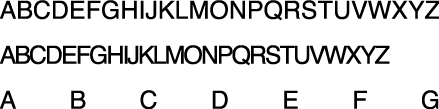
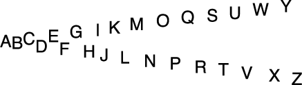
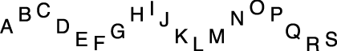

> 导航：[总目录](../../../README.md) · [documentation](../../../_indexes/documentation.md) · [ATSUI Programming Guide](Introduction%20to%20ATSUI%20Programming%20Guide.md)


[Next](ATSUI%20Implementation%20of%20the%20Unicode%20Specification.md)[Previous](Advanced%20Tasks-%20Substituting%20Fonts%20and%20Modifying%20Layouts.md)

# Direct-Access Tasks: Working With Glyph Data

ATSUI provides a set of functions that enable you to access information about glyphs during the layout process. These functions are called _direct-access functions_ because they allow you to manipulate glyph data directly. You can use direct-access functions to control many aspects of ATSUI’s internal layout process and, as a result, control how ATSUI draws text for your application. For example, you can override one or more steps of the ATSUI layout process, exercise fine control over layout metrics, specify glyph replacements, and perform post-layout processing.

You can call ATSUI direct-access functions along with functions you’ve provided in your text layout engine. Mixing your functions with ATSUI’s reduces the processing ATSUI does by default and enables you to perform your own layout adjustments.

This chapter shows you how to use ATSUI’s direct-access functions in the following sections:

- [Overriding ATSUI Layout Operations](#apple-f4xwc4dqnrsv64tfmyxwi33df52wszbpkridgmbqgaydamztfvkfawcsivddcnbu) shows how to write and install callbacks that obtain and modify glyph positioning information.
- [Retrieving and Drawing Glyph Outlines](#apple-f4xwc4dqnrsv64tfmyxwi33df52wszbpkridgmbqgaydamztfvkfawcsivddcmzw) provides information on obtaining the curves that make up a glyph shape and using your own functions to draw them.

Before you read this chapter you should be familiar with the text measurement terms discussed in Chapter 2, [Typography Concepts](Typography%20Concepts.md#apple-f4xwc4dqnrsv64tfmyxwi33df52wszbpkridgmbqgaydamryfvkfami) and know how to perform the tasks discussed in Chapter 4, [Basic Tasks: Working With Objects and Drawing Text](Basic%20Tasks-%20Working%20With%20Objects%20and%20Drawing%20Text.md#apple-f4xwc4dqnrsv64tfmyxwi33df52wszbpkridgmbqgaydamzqfvkfami).

This chapter provides a number of code samples to illustrate how to use direct-access functions. You can obtain the sample applications from which this code is taken, as well as additional code samples, from the developer sample code website:

[http://developer.apple.com/samplecode/](https://developer.apple.com/samplecode/)

You can override ATSUI’s layout operations by modifying layout information for the glyphs associated with a text layout object. You can adjust such values as the glyph’s baseline delta, advance delta, and real position values. You can also specify a post-layout operation (such as glyph substitution) that modifies a line after ATSUI has completed its layout operations. Table 6-1 defines some of the values you can modify using direct-access functions.

__Table 6-1__  Some values you can modify using direct-access functions

| Value | Definition |
| Real position | The actual drawing position on the x-axis. This position does not include the device delta. |
| Advance delta | The distance between the end of one glyph’s advance and the next glyph’s real position. |
| Baseline delta | The distance between the actual drawing position on the y-axis and the baseline position. |
| Device delta | A value used to adjust truncated factional values for cases in which fractional positioning can’t be used. For example, to compensate for integer drawing in QuickDraw. Device delta values are usually used when anti-aliasing is turned off. However, these values can be used when anti-aliasing is on to assure that the glyphs in a connected script (such as one that used the Zapfino font) are connected smoothly. |

The three lines of text in Figure 6-1 show an example of what you can do using the ATSUI direct-access functions. The first line is drawn as ATSUI would normally draw the text. The next two lines were drawn by ATSUI after glyph values were modified through the use of direct-access functions. The advance delta values of the text in the second line have been modified by decreasing the advance to create a condensed text appearance. Whereas the advance delta values of the text in the third line have been increased from normal to create an extended text appearance. To achieve each effect, the advance delta values are modified by a callback, then ATSUI uses the modified values during the course of its normal layout and drawing processes.

__Figure 6-1__  Unadjusted text compared to text with modified advance delta values



Figure 6-2 also shows an example of using ATSUI direct-access functions, but in this case the layout was modified after ATSUI already performed its normal layout process. The space characters in the text are replaced with a specified replacement character through a callback that is applied post-layout.

__Figure 6-2__  Text drawn with replacement characters in place of space characters


The text in Figure 6-3 is one line of text. The baseline delta values for the glyphs are adjusted such that every other glyph has a positive baseline delta value and alternate glyphs have a negative baseline delta value.

__Figure 6-3__  Text with modified baseline delta values



As you can see from Figure 6-1, Figure 6-2, and Figure 6-3, you can achieve a number of effects using the ATSUI direct-access functions. Overriding ATSUI layout operations requires that you perform these tasks:

1. Write a callback that obtains glyph data from ATSUI and modifies the glyph data associated with a text layout object.
2. Install the callback on a text layout object.
3. Use ATSUI as you normally would to create text layout objects, draw text, get glyph bounds, and so forth. ATSUI invokes your callback each time it lays out a line of text.

The callback definition for a direct-access callback function is as follows:

```
OSStatus (* ATSUDirectLayoutOperationOverrideProcPtr)(
                    ATSULayoutOperationSelector iCurrentOperation,
                    ATSULineRef iLineRef,
                    UInt32 iRefCon,
                    void *iOperationCallbackParameterPtr,
                    ATSULayoutOperationCallbackStatus *oCallbackStatus);
```

These are the parameters:

- `iCurrentOperation`, the operation that triggered the callback. This value is passed to your callback by ATSUI. If you write a callback that handles more than one layout operation, you can use this value to determine which operation you should handle.
- `iLineRef`, a reference to the current line. This is the line of text on which your callback operates. Your callback gets called for each line of text associated with the text layout object on which you installed the callback.
- `iRefCon`, a value set by calling the function `ATSUSetTextLayoutRefCon`. This is optional, and can be any data you need to track for your application, such as user preference data related to layout operations.
- `iOperationCallbackParameterPtr`. Currently unused and is set to `NULL`.
- `oCallbackStatus`. On output, you must supply a status value to indicate to ATSUI whether your callback handled the operation (`kATSULayoutOperationCallbackStatusHandled`) or whether ATSUI needs to handle the operation (`kATSULayoutOperationCallbackStatusContinue`). If you return the result `kATSULayoutOperationCallbackStatusContinue`, ATSUI may overwrite any settings that you have modified for that process.

Within the body of your callback function you need to call one of the ATSUI direct-access functions, such as `ATSUDirectGetLayoutDataArrayPtrFromLineRef`, to obtain the glyph data you want to modify. You use the data selectors shown in Table 6-2 to specify which data you want to obtain. The selectors are nonexclusive; you can use the logical-Or operator to combine several data selectors if your callback handles multiple operations.

__Table 6-2__  Data selectors used to obtain glyph data

| Selector | Obtains |
| `kATSUDirectDataAdvanceDeltaFixedArray` | The advance delta array. |
| `kATSUDirectDataBaselineDeltaFixedArray` | The baseline delta array. |
| `kATSUDirectDataDeviceDeltaSInt16Arrray` | The device delta array. |
| `kATSUDirectDataStyleIndexUInt16Array` | The style-index array. The values in the array are indices to the style setting reference array. |
| `kATSUDirectDataStyleSettingATSUStyleSettingRefArray` | The style setting array. |
| `kATSUDirectDataLayoutRecordATSLayoutRecordVersionCurrent` | The `ATSLayoutRecord` for a glyph. The layout record contains the glyph ID, real position, and other information. |

To install a callback, you follow the same procedure as you would to set a layout attribute. You must do the following:

1. Set up a triple (tag, size, value) to specify the operation you want to override and the callback function you are providing to handle the operation.

   In this case, the attribute tag is a structure (`ATSULayoutOperationOverrideSpecifier`) that specifies a selector for a layout operation and a pointer to a callback function. Typical selectors are listed in Table 6-3. See _Inside Mac OS X: ATSUI Reference_ for a complete list.
2. Call the function `ATSUSetLayoutControls` to associate the triple with the text layout object whose layout operation you want to override.

__Table 6-3__  Selectors for layout operations

| Selector | Specifies |
| `kATSULayoutOperationNone` | No layout select operation selected. |
| `kATSULayoutOperationJustification` | Justification. |
| `kATSULayoutOperationMorph` | Character morphing. |
| `kATSULayoutOperationKerningAdjustment` | Kerning adjustment. |
| `kATSULayoutOperationBaselineAdjustment` | Baseline adjustment; layout above or below current baseline. |
| `kATSULayoutOperationTrackingAdjustment` | Tracking adjustment. |
| `kATSULayoutOperationPostLayoutAdjustment` | Applies a layout operation after ATSUI has finished its layout operations. |

After you’ve installed the callback, you use ATSUI as you normally would to draw text. ATSUI triggers your callback each time the layout operation you specified is invoked.

You’ll see specific examples of how to write and install callbacks that manipulate the final layout in the following sections:

- [Extending the Space Between Glyphs](#apple-f4xwc4dqnrsv64tfmyxwi33df52wszbpkridgmbqgaydamztfvkfawcsivddcnrt). This example shows how to obtain the array of advance delta values for a line of text, and then to modify advance values to extend the space between the glyphs.
- [Positioning Glyphs Along a Curve](#apple-f4xwc4dqnrsv64tfmyxwi33df52wszbpkridgmbqgaydamztfvkfawcsivddcnrw). This example shows how to retrieve ATS layout records, advance delta arrays, and baseline delta arrays, and then to use real position information to calculate advance and baseline delta values that achieve the desired layout.

Before you override any of ATSUI’s layout operations, you should read the guidelines outlined in the following section.

Follow these guidelines when you override ATSUI layout operations:

- You should modify advance delta values during ATSUI’s layout process and not as a post layout operation. ATSUI uses advance delta values when it calculates the real position. The real position is available only post layout. So adjusting advance delta values post layout won’t have an effect.
- You should modify the real position only at post layout.
- Ideally, if you modify the real position, you should update the advance delta values to reflect the real-position modifications.
- You should modify baseline delta values as a post-layout operation (`kATSULayoutOperationPostLayoutAdjustment`) or in the baseline operation (`kATSULayoutOperationBaselineAdjustment`). If you modify these values during any other operation, ATSUI’s baseline operation can overwrite the values you modify.

You can extend the space between glyphs by providing values that adjust the positions of the glyph. To do so, you need to

- inform ATSUI that you want to override the justification layout operation
- obtain the advance delta array for the glyphs associated with the text layout object whose layout you want to modify
- adjust advance delta values for each glyph whose layout you want to modify

Depending on the advance delta values you provide, you’ll get an effect similar to the bottom line shown in [Figure 6-1](#apple-f4xwc4dqnrsv64tfmyxwi33df52wszbpkridgmbqgaydamztfvbeeq2ejfbeuqi). All glyphs except the first glyph in this line are drawn using the same advance delta value to achieve a uniform spacing. The advance delta values do not need to be the same for each glyph.

The following sections show how to extend the space between glyphs:

- [Writing a Callback to Modify Advance Delta Values](#apple-f4xwc4dqnrsv64tfmyxwi33df52wszbpkridgmbqgaydamztfvkfawcsivddcnrv)
- [Installing a Callback for a Justification Override Operation](#apple-f4xwc4dqnrsv64tfmyxwi33df52wszbpkridgmbqgaydamztfvkfawcsivddcnru)

The callback shown in Listing 6-1 (`MyStretchGlyphCallback`) performs one task—it modifies advance delta values. The effect is to extend the space between glyphs. A detailed explanation for each numbered line of code appears following the listing.

__Listing 6-1__  A callback that modifies advance delta values

```
static
OSStatus MyStretchGlyphCallback (
                    ATSULayoutOperationSelector     iCurrentOperation,
                    ATSULineRef     iLineRef,
                    UInt32          iRefCon,
                    void            *iOperationExtraParameter,
                    ATSULayoutOperationCallbackStatus *oCallbackStatus )// 1
{
    OSStatus        status;
    Fixed           *myDeltaXArray;// 2
    ItemCount       myRecordArrayCount;
    ItemCount       myItems;
    Fixed           myStretchFactor;

    status = ATSUDirectGetLayoutDataArrayPtrFromLineRef (iLineRef,
                            kATSUDirectDataAdvanceDeltaFixedArray,
                            true,
                            (void **) &myDeltaXArray,
                            &myRecordArrayCount);// 3
    require_noerr (status, StretchGlyphCallback_err);

    myStretchFactor = (Fixed) ((gFontSize*2) << 16);// 4
    for (myItems = 1; myItems < myRecordArrayCount; myItems++ ) // 5
    {
        myDeltaXArray[myItems] += myStretchFactor;
    };
    status = ATSUDirectReleaseLayoutDataArrayPtr (iLineRef,
                            kATSUDirectDataAdvanceDeltaFixedArray,
                            (void **) &myDeltaXArray );// 6

StretchGlyphCallback_err:
    *oCallbackStatus = kATSULayoutOperationCallbackStatusHandled;// 7
    return status;
}
```

Here’s what the code does:

1. Provides the parameters specified by the callback definition. As you’ll see, this callback uses only two of the parameters: `iLineRef` and `oCallbackStatus`.
2. Declares an array for the advance delta values.
3. Calls the function `ATSUDirectGetLayoutDataArrayPtrFromLineRef` to obtain the advance delta values for the line specified by `iLineRef`. This function returns the data pointer specified by the `iDataSelector` parameter (in this case, `kATSUDirectDataAdvanceDeltaFixedArray`) for the line specified by `iLineRef`.

   You should pass `true` for the `iCreate` parameter. If the requested array isn’t referenced by `iLineRef`, ATSUI creates and returns a zero-filled array. If the requested array has already been created, ATSUI returns the array with the current advance delta values. On output, `myRecordArrayCount` specifies the number of items in the array.
4. Sets a stretch-factor value, based on the current font size, to be used for the advance delta.
5. Iterates through the advance delta array, assigning a value to each element in the array.
6. Releases the data pointer (`myDeltaXArray`) obtained by calling the function `ATSUDirectGetLayoutDataArrayPtrFromLineRef`. You must release this data pointer by calling the function `ATSUDirectReleaseLayoutDataArrayPtr`. Releasing the array signals ATSUI that you are done with the data and that ATSUI can merge values you set with those set in the font.
7. Returns the status `kATSULayoutOperationCallbackStatusHandled` to indicate the layout operation is handled successfully.

The `MyInstallStretchGlyphCallback` function in A function that installs a justification override callback  sets up ATSUI to call `MyStretchGlyphCallback` each time a justification operation needs to be performed on the text associated with the specified text layout object. A detailed explanation for each numbered line of code appears following the listing.

__Listing 6-2__  A function that installs a justification override callback

```
OSStatus MyInstallStretchGlyphCallback (ATSUTextLayout myTextLayout)
{
    OSStatus                status = noErr;
    ATSULayoutOperationOverrideSpecifier    myOverrideSpec;// 1
    ATSUAttributeTag        theTag;
    ByteCount               theSize;
    ATSUAttributeValuePtr   theValue;

    myOverrideSpec.operationSelector =
                 kATSULayoutOperationJustification;// 2
    myOverrideSpec.overrideUPP = MyStretchGlyphCallback;

    theTag = kATSULayoutOperationOverrideTag;// 3
    theSize = sizeof (ATSULayoutOperationOverrideSpecifier);
    theValue = &myOverrideSpec;

    status = ATSUSetLayoutControls (myTextLayout, 1,
                            &theTag, &theSize, &theValue);// 4
    require_noerr (status, InstallStrechGlyphCallback_err );

InstallStrechGlyphCallback_err:

    return status;
}
```

Here’s what the code does:

1. Declares an override specification. This structure contains a selector for a layout operation and a universal procedure pointer to the callback you supply.
2. Assigns the justification selector as the operation selector and the `MyStretchGlyphCallback` callback as the callback to handle justification.
3. Sets up a triple (tag, size, value) for the layout attribute. In this case, the layout attribute is the override specification.
4. Calls the function `ATSUSetLayoutControls` to associate the override specification with the text layout object.

The text in Figure 6-4 shows glyphs whose baseline delta values are adjusted to track a sine curve. To achieve the smoothest look possible, the baseline delta values are calculated using the real position of the glyphs. In addition, the advance width for each glyph is adjusted.

To position glyphs along a curve, you need to do the following:

- Inform ATSUI that you want to provide a post-layout operation.
- Obtain the ATS layout record, advance delta array, and the baseline delta array for the glyphs associated with the text layout object whose layout you want to modify. The ATS layout record contains the real position of the glyph.
- Adjust the advance delta and baseline delta values for each glyph such that the values track the specified curve.

The next sections discuss the specific tasks you need to perform to position glyphs along a curve:

- [Writing the Callback to Modify Baseline Delta Values](#apple-f4xwc4dqnrsv64tfmyxwi33df52wszbpkridgmbqgaydamztfvkfawcsivddcnry)
- [Installing a Callback for a Post-Layout Operation](#apple-f4xwc4dqnrsv64tfmyxwi33df52wszbpkridgmbqgaydamztfvkfawcsivddcnrx)

__Figure 6-4__  Text positioned along a sine curve



The callback (`MySineCurveGlyphCallback`) shown in Listing 6-3 modifies advance and delta values so that glyphs are positioned along a sine curve. A detailed explanation for each numbered line of code appears following the listing.

__Listing 6-3__  A callback that positions glyphs along a sine curve

```
static
OSStatus MySineCurveGlyphCallback(
            ATSULayoutOperationSelector     iCurrentOperation,
            ATSULineRef             iLineRef,
            UInt32                  iRefCon,
            void                    *iOperationExtraParameter,
            ATSULayoutOperationCallbackStatus   *oCallbackStatus )
{
    OSStatus        status = noErr;
    Fixed           *deltaYArray;
    Fixed           *deltaXArray;
    Fixed           positionDifference;
    ATSLayoutRecord *layoutRecordArray;
    ItemCount       recordArrayCount;
    ItemCount       i;
    Fixed           scaleFactor = 0;
    float           amplitude;

    status = ATSUDirectGetLayoutDataArrayPtrFromLineRef (iLineRef,
                    kATSUDirectDataLayoutRecordATSLayoutRecordCurrent,
                    false,
                    (void **) &layoutRecordArray,
                    &recordArrayCount );// 1
    require_noerr (status, GlyphWaveCallback_err);

    status = ATSUDirectGetLayoutDataArrayPtrFromLineRef (iLineRef,
                            kATSUDirectDataAdvanceDeltaFixedArray,
                            true,
                            (void **) &deltaXArray,
                            &recordArrayCount );// 2
    require_noerr (status, GlyphWaveCallbackDeltaXArray_err);

    status = ATSUDirectGetLayoutDataArrayPtrFromLineRef (iLineRef,
                        kATSUDirectDataBaselineDeltaFixedArray,
                        true,
                        (void **) &deltaYArray,
                        &recordArrayCount );// 3
    require_noerr (status, SineCurveGlyphCallbackDeltaYArray_err);

    for ( i = 1; i < recordArrayCount; i++ )// 4
    {
        positionDifference = (layoutRecordArray[i].realPos -
                            layoutRecordArray[i-1].realPos);
        if (positionDifference > scaleFactor)
                    scaleFactor = positionDifference;
    }

    amplitude = FixedToFloat( scaleFactor );// 5

    for ( i = 1; i < recordArrayCount - 1; i++ )// 6
    {
        positionDifference =  scaleFactor - (layoutRecordArray[i].realPos -
                                layoutRecordArray[i-1].realPos);// 7

        layoutRecordArray[i].realPos += positionDifference;// 8
        deltaXArray[i-1] += positionDifference;// 9

        deltaYArray[i] = FloatToFixed (sinf ( i ) * amplitude);// 10
    };

    ATSUDirectReleaseLayoutDataArrayPtr (iLineRef,
                            kATSUDirectDataBaselineDeltaFixedArray,
                            (void **) &deltaYArray );// 11

SineCurveGlyphCallbackDeltaYArray_err:

    ATSUDirectReleaseLayoutDataArrayPtr (iLineRef,
                            kATSUDirectDataAdvanceDeltaFixedArray,
                            (void **) &deltaXArray );// 12

SineCurveGlyphCallbackDeltaXArray_err:

    ATSUDirectReleaseLayoutDataArrayPtr (iLineRef,
                    kATSUDirectDataLayoutRecordATSLayoutRecordCurrent,
                        (void **) &layoutRecordArray );// 13

SineCurveGlyphCallback_err:

    *oCallbackStatus = kATSULayoutOperationCallbackStatusHandled;// 14

    return status;

}
```

Here’s what the code does:

1. Calls the function `ATSUDirectGetLayoutDataArrayPtrFromLineRef` with the layout record data selector to obtain the ATS layout records for each glyph on the line. A layout record contains the glyph real position. Calculating a sine curve based on the real positions of the glyphs results in a much smoother appearance.
2. Calls the function `ATSUDirectGetLayoutDataArrayPtrFromLineRef` with the advance delta data selector to obtain the advance delta array for the glyphs on the line.
3. Calls the function `ATSUDirectGetLayoutDataArrayPtrFromLineRef` with the baseline delta data selector to obtain the baseline delta array for the glyphs on the line.
4. Iterates through the layout records to find the largest positional difference in the line. This difference will be used to set a scaling factor.
5. Sets the amplitude for the sine curve calculation to the scale factor.
6. Iterates through the glyph information to set the advance and baseline delta factors, taking into account the real position of the glyph.
7. Calculates a positional difference. This will be used to impose a fixed width on each glyph that takes the glyph’s point size into account.
8. Adds the positional difference to the real position value for the layout record array.
9. Adds the positional difference to the advance delta value.
10. Calculates the baseline delta using the previously calculated amplitude value and calling the function `sinf`.
11. Releases the baseline delta array by calling the function `ATSUDirectReleaseLayoutDataArrayPtr` with the baseline delta data selector.
12. Releases the advance delta array by calling the function `ATSUDirectReleaseLayoutDataArrayPtr` with the advance delta data selector.
13. Releases the layout record array by calling the function `ATSUDirectReleaseLayoutDataArrayPtr` with the ATS layout record data selector.
14. Returns a status value to ATSUI to indicate the layout operation is handled successfully.

The `MyInstallSineCuveGlyphCallback` function in Listing 6-4 sets up ATSUI to call `MySineCuveGlyphCallback`. ATSUI triggers the callback for each line of text associated with the specified text layout object. Because the callback does post-layout processing, ATSUI invokes the callback at the end of its layout operations for the line. A detailed explanation for each numbered line of code appears following the listing.

__Listing 6-4__  Installing a callback for a post-layout override operation

```
OSStatus MyInstallSineCurveGlyphCallback (ATSUTextLayout textLayout )
{
    OSStatus                                status = noErr;
    ATSULayoutOperationOverrideSpecifier    myOverrideSpec;// 1
    ATSUAttributeTag     theTag;
    ByteCount            theSize;
    ATSUAttributeValuePtr thePtr;

    myOverrideSpec.operationSelector =
                            kATSULayoutOperationPostLayoutAdjustment;// 2
    myOverrideSpec.overrideUPP = MySineCurveGlyphCallback;

    attrTag = kATSULayoutOperationOverrideTag;// 3
    attrSize = sizeof (ATSULayoutOperationOverrideSpecifier);
    attrPtr = &myOverrideSpec;

    status = ATSUSetLayoutControls (textLayout, 1,
                                &theTag, &theSize, &thePtr );// 4
    require_noerr (status, InstallSineCureveGlyphCallback_err );

InstallSineCureveGlyphCallback_err:

    return status;
}
```

Here’s what the code does:

1. Declares an override specification. This structure contains a selector for a layout operation and a universal procedure pointer to the callback you supply.
2. Assigns the post-layout selector as the operation selector and the `MySineCurveGlyphCallback` callback as the callback to handle justification.
3. Sets up a triple (tag, size, value) for the layout attribute. In this case, the layout attribute is the override specification.
4. Calls the function `ATSUSetLayoutControls` to associate the override specification with the text layout object.

ATSUI provides several direct-access functions that retrieve _glyph outlines_—the curves that make up the shape of the glyph. You should obtain glyph outlines only when you want to handle drawing the glyph instead of letting ATSUI do it. You can make modifications to the glyph data before you draw the glyph.

Using direct-access functions, you can do the following:

- Determine the native curve type of a font. TrueType fonts use quadratic curves while Type 1 (PostScript) fonts use cubic curves.
- Retrieve a cubic or quadratic glyph path—that is, the segments that make up the shape of a glyph.

Determining the native curve type of a font is easy, just call the function `ATSUGetNativeCurveType`.

Obtaining cubic or quadratic paths for a glyph requires you to use the functions `ATSUGlyphGetCubicPaths` or `ATSUGlyphGetQuadraticPaths`, respectively. However, you can call the function `ATSUGlyphGetQuadraticPaths` for fonts whose native curve type is cubic, and you can call `ATSUGlyphGetCubicPaths` for a font whose native curve type is quadratic. In each case, the font’s curves are converted to the format specified by the function.

The curves returned by the functions are those that have been modified by hints present in the font. If you need unhinted outlines, you should use a very large point size (for example, 1000 points) and scale down the result. Alternatively, you can set the `ATSUStyleRenderingOptions` of the style object (`ATSUStyle`) to `0`.

The coordinates returned for the curves and lines use the QuickDraw coordinate system. The (0,0) coordinate in QuickDraw is located in the upper-left corner. Quartz 2D has its (0,0) coordinate in the lower-left corner. If you are drawing into a Quartz context, you need to transform the QuickDraw coordinates accordingly.

If you want to handle drawing glyphs that use quadratic curves, you call the function `ATSUGlyphGetQuadraticPaths`. This function obtains the glyph segments for a glyph and then calls your callback functions for drawing the glyph. You must supply these universal procedure pointers (UPPs) to the function `ATSUGlyphGetQuadraticPaths][]. This function obtains the glyph segments for a glyph and then calls your callback functions for drawing the glyph. You must supply these universal procedure pointers (UPPs) to the function [ATSUGlyphGetQuadraticPaths`:

- `ATSQuadraticNewPathUPP`, a pointer to your callback to handle the new-path operation
- `ATSQuadraticLineUPP`, a pointer to your callback to handle the line-to operation
- `ATSQuadraticCurveUPP`, a pointer to your callback to handle the curve-to operation
- `ATSQuadraticClosePathUPP`, a pointer to your callback to handle the close-path operation

Similarly, if you want to handle drawing glyphs that use cubic curves, you call the function `ATSUGlyphGetCubicPaths`. This function obtains the glyph segments for a glyph and then calls your callback functions for drawing the glyph. You must supply these UPPs to the function `ATSUGlyphGetCubicPaths`:

- `ATSCubicMoveToUPP`, a pointer to your callback to handle the move-to operation
- `ATSCubicLineToUPP`, a pointer to your callback to handle the line-to operation
- `ATSCubicCurveToUPP`, a pointer to your callback to handle the curve-to operation
- `ATSCubicClosePathUPP`, a pointer to your callback to handle the close-path operation

Note that for cubic paths, the starting position for each curve or line is implicit from the current pen position. The start of a path is also implicit and is signaled by the move to establish the initial pen position.

Listing 6-5 shows code that sets up the four quadratic curve callbacks that handle glyph drawing for glyphs whose curve type is quadratic. [Listing 6-6](#apple-f4xwc4dqnrsv64tfmyxwi33df52wszbpkridgmbqgaydamztfvbuuqsdivbekqq) shows a function (`MyDrawQuadratics`) that creates universal procedure pointers to the callbacks and uses the function `ATSUGlyphGetQuadraticPaths`. A detailed explanation for each numbered line of code in a listing appears following each listing. The code for using cubic curve callbacks to handle glyph drawing is similar to that shown in Listing 6-5 and Listing 6-6, except that you would use the function `ATSUGlyphGetCubicPaths` and supply to it your cubic callbacks.

__Listing 6-5__  Setting up the quadratic curve callbacks

```swift
OSStatus MyQuadraticLineProc (const Float32Point *pt1,
                        const Float32Point *pt2,
                        void *callBackDataPtr)// 1
{
    float x1 = ((MyCallbackData *)callBackDataPtr)->origin.x + pt1->x;// 2
    float y1 = ((MyCallbackData *)callBackDataPtr)->origin.y + pt1->y;
    float x2 = ((MyCallbackData *)callBackDataPtr)->origin.x + pt2->x;
    float y2 = ((MyCallbackData *)callBackDataPtr)->origin.y + pt2->y;

     y1 = ((MyCallbackData *)callBackDataPtr)->windowHeight - y1;// 3
     y2 = ((MyCallbackData *)callBackDataPtr)->windowHeight - y2;
     if ( ((MyCurveCallbackData *)callBackDataPtr)->first ) // 4
     {
            CGContextMoveToPoint (gContext, x1, y1);
            ((MyCurveCallbackData *)callBackDataPtr)->first = false;
     }
     CGContextAddLineToPoint (context, x2, y2);// 5

    return noErr;// 6
}

OSStatus MyQuadraticCurveProc (const Float32Point *pt1,
                    const Float32Point *controlPt,
                    const Float32Point *pt2,
                    void *callBackDataPtr)// 7
{
    float x1 = ((MyCallbackData *)callBackDataPtr)->origin.x + pt1->x;// 8
    float y1 = ((MyCallbackData *)callBackDataPtr)->origin.y + pt1->y;
    float x2 = ((MyCallbackData *)callBackDataPtr)->origin.x + pt2->x;
    float y2 = ((MyCallbackData *)callBackDataPtr)->origin.y + pt2->y;
    float cpx = ((MyCallbackData *)callBackDataPtr)->origin.x +
                                     controlPt->x;
    float cpy = ((MyCallbackData *)callBackDataPtr)->origin.y +
                                     controlPt->y;

     y1 = ((MyCallbackData *)callBackDataPtr)->windowHeight - y1;// 9
     y2 = ((MyCallbackData *)callBackDataPtr)->windowHeight - y2;
     cpy = ((MyCallbackData *)callBackDataPtr)->windowHeight - cpy;
     if ( ((MyCurveCallbackData *)callBackDataPtr)->first ) // 10
     {
            CGContextMoveToPoint(gContext, x1, y1);
            ((MyCurveCallbackData *)callBackDataPtr)->first = false;
     }

     CGContextAddQuadCurveToPoint (context, cpx, cpy, x2, y2);// 11

    return noErr;// 12
}

OSStatus MyQuadraticNewPathProc (void * callBackDataPtr)// 13
{
     ((MyCurveCallbackData *)callBackDataPtr)->first = true;// 14

    return noErr;// 15
}

OSStatus MyQuadraticClosePathProc (void * callBackDataPtr)
{
     ((MyCurveCallbackData *)callBackDataPtr)->first = true;// 16
    return noErr;// 17
}
```

Here’s what the code does:

1. Sets up the parameters that are passed to your callback for drawing a line. ATSUI passes two points that define a line and a pointer to any data your callback needs. You pass the pointer to your callback data to ATSUI when you call the function `ATSUGlyphGetQuadraticPaths`. See [Listing 6-6](#apple-f4xwc4dqnrsv64tfmyxwi33df52wszbpkridgmbqgaydamztfvbuuqsdivbekqq).
2. Modifies the coordinate values of the points passed in by ATSUI. The four lines of code here add values supplied by the callback data pointer. These values are spacing adjustments that take into account the window height. When you write your callback, you would modify the values appropriately for your application.
3. Transforms the y-coordinate values from QuickDraw coordinates to Quartz coordinates. If you are using a Quartz context, you must perform this transformation because ATSUI always passes coordinates as QuickDraw coordinates.
4. Checks to see if this is the first point in the curve. If it is, calls the Quartz 2D function `CGContextMoveToPoint` to begin drawing at the specified coordinates.
5. Calls the Quartz 2D function `CGContextAddLineToPoint` to draw a straight line segment from the current point to the specified point.
6. Returns a result code that indicates whether or not your callback executed successfully. If your callback returns any value other than `0`, the function `ATSGlyphGetQuadraticPaths` stops parsing the path outline and returns the result `kATSOutlineParseAbortedErr`.
7. Sets up the parameters that are passed to your callback for drawing a curve. ATSUI passes the two end points and a control point that define the curve along with a pointer to any data your callback needs. You pass the pointer to your callback data to ATSUI when you call the function `ATSUGlyphGetQuadraticPaths`. See [Listing 6-6](#apple-f4xwc4dqnrsv64tfmyxwi33df52wszbpkridgmbqgaydamztfvbuuqsdivbekqq).
8. Modifies the coordinate values of the end points and control point passed in by ATSUI. The six lines of code here add origin values supplied by the callback data pointer. When you write your callback, you would modify the values of the end points and control point appropriately for your application.
9. Transforms the y-coordinate values from QuickDraw coordinates to Quartz coordinates. If you are using a Quartz context, you must perform this transformation because ATSUI always passes coordinates as QuickDraw coordinates.
10. Checks to see if this is the first point in the curve. If it is, calls the Quartz 2D function `CGContextMoveToPoint` to begin drawing at the specified location.
11. Calls the Quartz 2D function `CGContextAddQuadCurveToPoint` to draw a quadratic Bézier curve from the current point, using the control point and end point you specify.
12. Returns a result code that indicates whether or not your callback executed successfully. If your callback returns any value other than `0`, the function `ATSGlyphGetQuadraticPaths` stops parsing the path outline and returns the result `kATSOutlineParseAbortedErr`.
13. Sets up the parameter that is passed to your callback for establishing a new path. ATSUI passes a pointer to any data your callback needs. You pass the pointer to your callback data to ATSUI when you call the function `ATSUGlyphGetQuadraticPaths`. See [Listing 6-6](#apple-f4xwc4dqnrsv64tfmyxwi33df52wszbpkridgmbqgaydamztfvbuuqsdivbekqq).
14. Sets the flag that indicates the beginning of a curve segment to `true`. This flag is used by the functions `MyQuadraticlineProc` and `MyQuadraticCurveProc`.
15. Returns a result code that indicates whether or not your callback executed successfully. If your callback returns any value other than `0`, the function `ATSGlyphGetQuadraticPaths` stops parsing the path outline and returns the result `kATSOutlineParseAbortedErr`.
16. Sets the flag that indicates the beginning of a curve segment to `true`. This flag is used by the functions `MyQuadraticlineProc` and `MyQuadraticCurveProc`.
17. Returns a result code that indicates whether or not your callback executed successfully. If your callback returns any value other than `0`, the function `ATSGlyphGetQuadraticPaths` stops parsing the path outline and returns the result `kATSOutlineParseAbortedErr`.

After you have written callbacks to handle drawing operations for a quadratic curve (as shown in Listing 6-5), you need to write a function that creates universal procedure pointers (UPPs) for each callback and then pass the UPPs to the function `ATSUGlyphGetQuadraticPaths`. Listing 6-6 shows a function that sets up UPPs, obtains glyph data, and calls the function `ATSUGlyphGetQuadraticPaths` to draw each glyph in a text run. A detailed explanation for each numbered line of code appears following the listing.

__Listing 6-6__  A function that draws glyph outlines using quadratic curve data

```
void MyDrawQuadratics (ATSUTextLayout iLayout,
                            ATSUStyle iStyle,
                            UniCharArrayOffset start,
                            UniCharCount length,
                            Fixed penX,
                            Fixed penY,
                            float windowHeight)// 1
{
    ATSLayoutRecord             *layoutRecords;
    ItemCount                   numRecords;
    Fixed                       *deltaYs;
    ItemCount                   numDeltaYs;
    ATSQuadraticNewPathUPP      newPathProc;
    ATSQuadraticLineUPP         lineProc;
    ATSQuadraticCurveUPP        curveProc;
    ATSQuadraticClosePathUPP    closePathProc;
    MyCallbackData              data;
    OSStatus                    status;
    int                         i;

    newPathProc = NewATSQuadraticNewPathUPP (MyQuadraticNewPathProc);// 2
    lineProc = NewATSQuadraticLineUPP (MyQuadraticLineProc);// 3
    curveProc = NewATSQuadraticCurveUPP (MyQuadraticCurveProc);// 4
    closePathProc = NewATSQuadraticClosePathUPP (MyQuadraticClosePathProc);// 5

    ATSUDirectGetLayoutDataArrayPtrFromTextLayout (iLayout,
                    start,
                    kATSUDirectDataLayoutRecordATSLayoutRecordCurrent,
                    (void *) &layoutRecords,
                    &numRecords) ;// 6
    ATSUDirectGetLayoutDataArrayPtrFromTextLayout (iLayout,
                    start,
                    kATSUDirectDataBaselineDeltaFixedArray,
                    (void *) &deltaYs,
                    &numDeltaYs);// 7
    CGContextBeginPath (gContext);// 8

    data.windowHeight = windowHeight;// 9
    for (i=0; i < numRecords; i++) // 10
    {
        data.origin.x = Fix2X(penX) +
                                Fix2X(layoutRecords[i].realPos);// 11
        if (deltaYs == NULL) // 12
                data.origin.y = Fix2X(penY);
        else
                data.origin.y = Fix2X(penY) - Fix2X(deltaYs[i]);
         data.first = true;// 13
        if (layoutRecords[i].glyphID != kATSDeletedGlyphcode)// 14
        {
            ATSUGlyphGetQuadraticPaths (iStyle,
                        layoutRecords[i].glyphID,
                        newPathProc,
                        lineProc,
                        curveProc,
                        closPathProc,
                        &data,
                        &status);
        }
    }


    CGContextClosePath(gContext);// 15
    CGContextDrawPath(gContext, kCGPathStroke);// 16

    if (deltaYs != NULL) // 17
        ATSUDirectReleaseLayoutDataArrayPtr (NULL,
                     kATSUDirectDataBaselineDeltaFixedArray,
                     (void *) &deltaYs);
    ATSUDirectReleaseLayoutDataArrayPtr (NULL,
                 kATSUDirectDataLayoutRecordATSLayoutRecordCurrent,
                 (void *) &layoutRecords);// 18

    DisposeATSQuadraticNewPathUPP (newPathProc);// 19
    DisposeATSQuadraticLineUPP (lineProc);
    DisposeATSQuadraticCurveUPP (curveProc);
    DisposeATSQuadraticClosePathUPP (closePathProc);
}
```

Here’s what the code does:

1. Sets up the parameters needed by this function:

   - a valid text layout
   - the style object associated with the text layout
   - the starting offset for the text run that will be processed by this function
   - the length of the text run that will be processed by this function
   - the x-coordinate for the pen’s starting location
   - the y-coordinate for the pen’s starting location
   - the height of the window into which the text will be drawn
2. Calls the function `NewATSQuadracticNewPathUPP` to create a UPP for the `MyQuadraticNewPathProc` callback created in [Listing 6-5](#apple-f4xwc4dqnrsv64tfmyxwi33df52wszbpkridgmbqgaydamztfvbuuqskjfcuoqy).
3. Calls the function `NewATSQuadracticLineUPP` to create a UPP for the `MyQuadraticLineProc` callback created in [Listing 6-5](#apple-f4xwc4dqnrsv64tfmyxwi33df52wszbpkridgmbqgaydamztfvbuuqskjfcuoqy).
4. Calls the function `NewATSQuadracticCurveUPP`to create a UPP for the `MyQuadraticCurveProc` callback created in [Listing 6-5](#apple-f4xwc4dqnrsv64tfmyxwi33df52wszbpkridgmbqgaydamztfvbuuqskjfcuoqy).
5. Calls the function `NewATSQuadracticClosePathUPP` to create a UPP for the `MyQuadraticClosePathProc` callback created in [Listing 6-5](#apple-f4xwc4dqnrsv64tfmyxwi33df52wszbpkridgmbqgaydamztfvbuuqskjfcuoqy).
6. Calls the function `ATSUDirectGetLayoutDataArrayPtrFromTextLayout` to obtain the glyph IDs and the real position for the glyphs associated with the text layout.
7. Calls the function `ATSUDirectGetLayoutDataArrayPtrFromTextLayout` to obtain the baseline delta values (if any) for the glyphs associated with the text layout.
8. Calls the Quartz 2D function `CGContextBeginPath` to begin a path for the glyph outlines. A Quartz graphics context can have only a single path in use at any time. If the context already contains a path when you call `CGContextBeginPath`, Quartz replaces the previous current path with the new path, discarding the old path and any data associated with it.
9. Assigns the window height to the data structure that will be passed to the callbacks. This is used to transform the y-coordinate from QuickDraw coordinate space to Quartz coordinate space.
10. Begins a loop over all the glyphs in the text run.
11. Assigns an adjusted x-coordinate to the data structure that will be passed to the callbacks. The x-coordinate is the position for the beginning of the line added to the real position.
12. Checks to see if the baseline delta array is `NULL`. If the array is `NULL`, the y-coordinate is the vertical position of the line; otherwise, the y-coordinate is the vertical position of the line added to the baseline delta value.
13. Sets the flag that indicates the start of a curve segment to `true`. This flag is used by the callback functions `MyQuadraticlineProc` and `MyQuadraticCurveProc`. See [Listing 6-5](#apple-f4xwc4dqnrsv64tfmyxwi33df52wszbpkridgmbqgaydamztfvbuuqskjfcuoqy).
14. Checks whether the glyph ID is not that of a deleted glyph. Deleted glyphs should not be drawn. If the glyph should be drawn, calls the function `ATSUGlyphGetQuadracticPaths` to draw the glyphs using the callback functions specified by the UPPs passed to `ATSUGlyphGetQuadracticPaths`. This function also takes as parameters the style object associated with the text run, the glyph ID, a pointer to the data structure that will be passed to the callbacks, and a pointer to a status value. The status value is used to indicate the status of your callback functions. When a callback function returns any value other than `0`, the `ATSGlyphsGetQuadraticPaths` function stops parsing the path outline and returns the result `kATSOutlineParseAbortedErr`.
15. Calls the Quartz 2D function `CGContextClosePath` to close and terminate the current path.
16. Calls the Quartz 2D function `CGContextDrawPath` to paint a line along the current path.
17. Checks to see if the baseline delta array is `NULL`. If it is not, calls the function `ATSUDirectReleaseLayoutDataArrayPtr` to release the baseline delta array.
18. Calls the function `ATSUDirectReleaseLayoutDataArrayPtr` to release the layout record array.
19. Calls the appropriate ATSUI functions to dispose of the four UPPs created previously.

[Next](ATSUI%20Implementation%20of%20the%20Unicode%20Specification.md)[Previous](Advanced%20Tasks-%20Substituting%20Fonts%20and%20Modifying%20Layouts.md)

