> 导航：[总目录](../../../README.md) · [documentation](../../../_indexes/documentation.md) · [ATSUI Programming Guide](Introduction%20to%20ATSUI%20Programming%20Guide.md)

[Next](Document%20Revision%20History.md)[Previous](ATSUI%20Implementation%20of%20the%20Unicode%20Specification.md)

# Font Features

This appendix describes font feature types and the selectors available for each feature type. In many cases, it also provides illustrations that show the effect of enabling a font feature or set of features. Before you read this appendix, you should be familiar with the font feature concepts discussed in detail in Chapter 3, [ATSUI Style and Text Layout Objects](ATSUI%20Style%20and%20Text%20Layout%20Objects.md#apple-f4xwc4dqnrsv64tfmyxwi33df52wszbpkridgmbqgaydamrzfvkfami).

Font features are available for a font only if the font designer chooses to include them. Many of the font features described here are rarely available. You should check with the font provider to see what features, if any, are available for a specific font.

The constants that represent font feature types and selectors are declared in the header file `SFNTLayoutTypes.h`. When you use ATSUI to access and set font features, you must use the constants defined in this header file, which are described in this appendix. Font designers can define feature types at any time. For the most up-to-date list of font feature types and selectors you should check Apple’s font feature registry website:

[http://developer.apple.com/fonts/Registry/index.html](https://developer.apple.com/fonts/Registry/index.html)

The all-typographic features feature type (`kAllTypographicFeaturesType`) enables or disables all available typographic features at once. Table B-1 lists the selectors for this feature.

__Table B-1__  Selectors for the all-typographic features feature type

| Feature selector | Description |
| `kAllTypographicFeaturesOnSelector` | Enables all typographic features. This is the default setting. |
| `kAllTypographicFeaturesOffSelector` | Disables all typographic features. |

The annotation feature type (`kAnnotationType`) specifies annotations (or adornments) to basic letter shapes. For instance, most Japanese fonts include versions of numbers that are circled, are enclosed by parentheses, have periods after them, and so on. Figure B-1 shows some glyphs that are drawn with annotations.

__Figure B-1__  Glyphs drawn with annotations

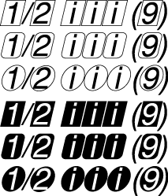

Annotation is a noncontextual, exclusive feature type. Table B-2 lists the selectors for this feature.

__Table B-2__  Selectors for the annotation feature

| Feature selector | Description |
| `kNoAnnotationSelector` | Specifies that characters should appear without annotation. This is the default setting. |
| `kBoxAnnotationSelector` | Specifies to use the forms of characters surrounded by a box cartouche. See line 1 in Figure B-1. |
| `kRoundedBoxAnnotationSelector` | Specifies to use the forms of characters surrounded by a box cartouche with rounded corners. See line 2 in Figure B-1. |
| `kCircleAnnotationSelector` | Specifies to use the forms of characters surrounded by a circle. For example, see Unicode characters U+3260 through U+326F. See line 3 in Figure B-1. |
| `kInvertedBoxAnnotationSelector` | Specifies to use the forms of characters surrounded by a box cartouche, but with white and black reversed. See line 4 in Figure B-1. |
| `kInvertedRoundedBoxAnnotationSelector` | Specifies to use the forms of characters surrounded by a box cartouche with rounded corners, but with white and black reversed. See line 5 in Figure B-1. |
| `kInvertedCircleAnnotationSelector` | Specifies to use the forms of characters surrounded by a circle, but with white and black reversed. For example, see Unicode characters U+2776 through U+277F. See line 6 in Figure B-1. |
| `kParenthesisAnnotationSelector` | Specifies to use the forms of characters surrounded by parentheses. For example, see Unicode characters U+2474 through U+2487. |
| `kPeriodAnnotationSelector` | Specifies to use the forms of characters followed by a period. For example, see Unicode characters U+2488 through U+249B. |
| `kRomanNumeralAnnotationSelector` | Specifies to display the given characters in their Roman numeral form. |
| `kDiamondAnnotationSelector` | Specifies to display the text surrounded by a diamond. |

The cursive connection feature type (`kCursiveConnectionType`) is used for cursively connected scripts to specify whether or not cursive connections are to be used between glyphs. This feature type is required for Arabic, but may be supported by other scripts as well. Figure B-2 shows an example of cursive connection in a Roman font.

__Figure B-2__  Cursive connection in a Roman font

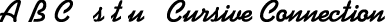

If a font supports the cursive connection feature type, you may be able to select features that either disable cursive connection completely, enable letter forms that connect in a noncontextual manner, or enable completely contextual, cursively connected letter forms (as in Arabic). Table B-3 lists the feature selectors for cursive connection. This is a contextual, exclusive feature type.

__Table B-3__  Selectors for the cursive connection feature type

| Feature selector | Description |
| `kUnconnectedSelector` | Disables cursive connection. Selecting this for some scripts results in incorrect linguistic appearance. |
| `kPartiallyConnectedSelector` | Specifies predrawn letter forms that connect in a noncontextual manner. |
| `kCursiveSelector` | Specifies full contextual connection of letter forms. For Arabic fonts, this selector is set by default. |

The character alternatives feature type (`kCharacterAlternativesType`) specifies any font-specific set of alternate glyph forms. This feature type gives a font a very general way to provide different sets of glyphs. Sets are numbered sequentially. For a font that supports the character alternates feature type, you can select, by number, any of the sets it provides. Figure B-3 shows the character “g,” first drawn using the default glyph for the font, then drawn using an alternate glyph form provided by the font.

__Figure B-3__  The character “g” shown as two glyph forms

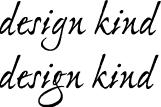

The character alternative feature type is a noncontextual, exclusive feature type. Table B-4 lists the only defined selector for this feature.

__Table B-4__  Selector for the character alternatives feature

| Feature selector | Description |
| `kNoAlternativesSelector` | Specifies that no character alternatives are to be used. This is the default setting. |

The character shape feature type (`kCharacterShapeType`) is used when a single font contains different appearances for the same character shape, and these shapes are not traditionally treated as swashes. It is needed for languages such as Chinese that have both traditional and simplified character sets, as shown in Figure B-4. In fact, Chinese usually has several alternatives for traditional characters sets.

__Figure B-4__  Traditional and simplified versions of a Chinese character

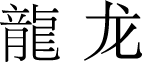

Table B-5 lists the selectors for the character shape feature type. This is a noncontextual, exclusive feature type.

__Table B-5__  Selectors for the character shape feature

| Feature selector | Description |
| `kTraditionalCharactersSelector` | Specifies to use traditional forms for characters. |
| `kSimplifiedCharactersSelector` | Specifies to use simplified forms for characters. |
| `kJIS1978CharactersSelector` | Specifies to use character shapes for Japanese characters as defined by the JIS (Japanese Industrial Standard) C 6226-1978 document. |
| `kJIS1983CharactersSelector` | Specifies to use character shapes for Japanese characters as defined by the JIS (Japanese Industrial Standard) C 0208-1983 document. |
| `kJIS1990CharactersSelector` | Specifies to use character shapes for Japanese characters as defined by the JIS (Japanese Industrial Standard) C 0208-1990 document. |
| `kTraditionalAltOneSelector` | Specifies to use alternate set 1 of traditional forms for characters. |
| `kTraditionalAltTwoSelector` | Specifies to use alternate set 2 of traditional forms for characters. |
| `kTraditionalAltThreeSelector` | Specifies to use alternate set 3 of traditional forms for characters. |
| `kTraditionalAltFourSelector` | Specifies to use alternate set 4 of traditional forms for characters. |
| `kTraditionalAltFiveSelector` | Specifies to use alternate set 5 of traditional forms for characters. |
| `kExpertCharactersSelector` | Specifies to use expert forms of ideographs, such as those defined in the Fujitsu FMR character set. |

The CJK (Chinese, Japanese, Korean) italic Roman feature type (`kItalicCJKRomanType`) specifies whether or not to use italic Roman characters in a CJK font. Table B-6 lists the selectors for this feature.

__Table B-6__  Selectors for the CJK italic Roman feature type

| Feature selector | Description |
| `kCJKItalicRomanOffSelector` | Specifies not to use italic Roman characters. This is the default setting. |
| `kCJKItalicRomanOnSelector` | Specifies to use italic Roman characters. |
| `kNoCJKItalicRomanSelector` | Specifies not to use italic Roman characters. This is deprecated; use `kCJKItalicRomanOffSelector` instead. |
| `kCJKItalicRomanSelector` | Specifies to use italic Roman characters. This is deprecated; use `kCJKItalicRomanOnSelector` instead. |

The CJK (Chinese, Japanese, Korean) Roman spacing feature type (`kCJKRomanSpacingType`) specifies the spacing to use for Roman characters in a CJK font. Table B-7 lists the selectors for this feature.

__Table B-7__  Selectors for the CJK Roman spacing feature

| Feature selector | Description |
| `kHalfWidthCJKRomanSelector` | Specifies to use half-width spacing. |
| `kProportionalCJKRomanSelector` | Specifies to use proportional-width spacing. |
| `kFullWidthCJKRomanSelector` | Specifies to use full-width spacing. |

The design complexity feature type (`kDesignComplexityType`) controls the overall appearance of a font. It can be used to allow a single font to contain plain glyphs, italic glyphs, calligraphic chancery glyphs, and so forth. For a font that supports the design complexity feature type, design levels are numbered, and you can select any available level by number or by such selectors as those shown in Table B-8. This is a noncontextual, exclusive feature type. Figure B-5 shows four levels of design complexity for a font.

__Figure B-5__  Four levels of design complexity

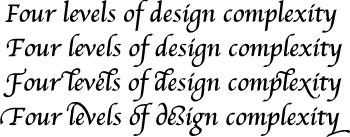

__Table B-8__  Selectors for the design complexity feature

| Feature selector | Description |
| `kDesignLevel1Selector` | Specifies the basic glyph set. This should be available for any font that utilizes this feature type. This is the default setting. |
| `kDesignLevel2Selector` | Specifies an alternate glyph set, more complex than level 1. |
| `kDesignLevel3Selector` | Specifies an alternate glyph set, more complex than level 2. |
| `kDesignLevel4Selector` | Specifies an alternate glyph set, more complex than level 3. |
| `kDesignLevel5Selector` | Specifies an alternate glyph set, more complex than level 4. |

The diacritical marks feature type (`kDiacriticsType`) controls how diacritical marks (that is, accent marks or applied vowels) appear in text. For Roman fonts the default setting is to show diacritical marks. In text for scripts in which vowel marks are not normally shown, you can specify that marks be visible in certain instances, such as for children’s text or for pronunciation guides on rare words. Figure B-6 shows an example of Hebrew text drawn with and without its diacritical marks.

__Figure B-6__  Hebrew text with diacritical marks shown (upper) and hidden (lower)

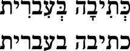

Figure B-7 shows an example of text drawn with and without its accents.

__Figure B-7__  Accented forms

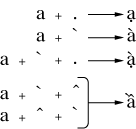

If the font supports the diacritical marks feature type, you can specify that ATSUI should show, hide, or decompose diacritical marks, using the feature selectors shown in Table B-9. This is a contextual, exclusive feature type.

__Table B-9__  Selectors for the diacritical marks feature

| Feature selector | Description |
| `kShowDiacriticsSelector` | Specifies to display diacritical marks normally; that is, attached to their base forms (glyphs) in the appropriate place. This is the default setting. |
| `kHideDiacriticsSelector` | Specifies not to display diacritical marks. |
| `kDecomposeDiacriticsSelector` | Specifies not to display marked glyphs as unmarked, followed by the accent ligatures as standalone glyphs. |

The fractions feature type (`kFractionsType`) controls the selection and generation of fractions. For a font that supports the fractions feature type, you can select between two different types of automatic fraction generation—vertical and diagonal. Figure B-8 shows a fraction, drawn first without automatic fraction formation, then with the diagonal fractions selector, and finally with the vertical fractions selector.

__Figure B-8__  Fractions drawn with three different fractions feature selectors

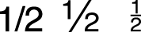

The feature selectors for the fractions feature type is shown in Table B-10. This feature is a contextual, exclusive feature type.

__Table B-10__  Selectors for the fractions feature

| Feature selector | Description |
| `kNoFractionsSelector` | Specifies that fractions should not be formed automatically. |
| `kVerticalFractionsSelector` | Specifies replacement of slash-separated numeric sequences with pre-drawn fraction glyphs, if present in the font. |
| `kDiagonalFractionsSelector` | Specifies replacement of slash-separated numeric sequences with pre-drawn fraction glyphs, but fractions will be synthesized using superiors and inferiors (or special-purpose number and denominator forms) if present in the font. |

The ideographic spacing feature type (`kIdeographicSpacingType`) specifies whether to use full-width or proportional-width text in the representation of Japanese kanji, Chinese hanzi, and Korean hanja (that is, ideographic characters). Table B-11 lists the selectors for this feature. This is a noncontextual, exclusive feature type.

__Table B-11__  Selectors for the ideographic spacing feature

| Feature selector | Description |
| `kFullWidthIdeographicSelector` | Specifies to use full-width spacing for ideographs. This is the default setting. |
| `kProportionalIdeographsSelector` | Specifies to use proportional spacing for ideographs. |
| `kHalfWidthIdeographsSelector` | Specifies to use half-width spacing for ideographs. |

The kana spacing feature type (`kKanaSpacingType`) specifies the widths to use for Japanese hiragana and katakana characters. Table B-12 lists the selectors for this feature. This is a noncontextual, exclusive feature type.

__Table B-12__  Selectors for the kana spacing feature

| Feature selector | Description |
| `kFullWidthKanaSelector` | Specifies to use the full-width forms of kana. This is the default setting. |
| `kProportionalKanaSelector` | Specifies to use the proportional forms of kana. |

The letter case feature type (`kLetterCaseType`) is used to specify changes to letter case in scripts where case has meaning. This feature changes only the appearance of the letter; the string typed by the user remains invariant. If the string is typed using lowercase letters, the string remains lowercase.

Figure B-9 shows text in which different letter case feature selectors have been applied. The first line of text is drawn with no case conversion. The second line is drawn with the all caps feature enabled. The third line is drawn with the initial caps and small caps feature enabled.

__Figure B-9__  Text drawn with different letter case feature selectors

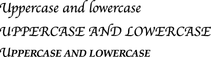

If the font supports the letter case feature type, you can select features that specify case changes such as those shown in Table B-13. This is an exclusive feature type.

__Table B-13__  Selectors for the letter case feature

| Feature selector | Description |
| `kUpperAndLowerCaseSelector` | Specifies no case conversion. This leaves letters in whichever case the user specifies. This is the default setting. |
| `kAllCapsSelector` | Converts all letters to uppercase. This feature is noncontextual. |
| `kAllLowerCaseSelector` | Converts all letters to lowercase. This feature is noncontextual. |
| `kInitialCapsSelector` | Converts the first letter of a word to uppercase and the remaining letters to lowercase. This feature is contextual. |
| `kInitialCapsAndSmallCapsSelector` | Converts the first letter of a word to uppercase and the remaining letters to small caps. This feature is contextual. |

The ligatures feature type (`kLigaturesType`) specifies the use of linguistically required ligatures and a variety of optional ligatures. Figure B-10 shows several levels of ligature formation specified through ligature feature selectors. In the top line, the ligatures feature type is set to have required ligatures enabled. In the middle line, the value is set to have common ligatures enabled. In the bottom line, the value is set to have rare ligatures enabled.

__Figure B-10__  Levels of ligature formation controlled with ligature feature selectors

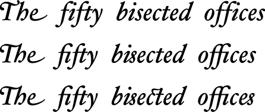

Figure B-11 shows the results of selection and deselection of diphthong ligatures. In the top line, the ligatures feature type (`kLigaturesType`) is set to have diphthong ligatures enabled; in the bottom line, the ligatures feature type is set to have diphthong ligatures disabled.

__Figure B-11__  Use of diphthong ligatures

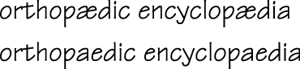

If the font supports the ligatures feature type, you can select features related to ligature formation, including those shown in Table B-14. This is a contextual, nonexclusive feature type.

__Table B-14__  Selectors for the ligatures feature type

| Feature selector | Description |
| `kRequiredLigaturesOnSelector` | Allows the use of linguistically required ligatures (such as occur in Arabic or Hindi). This is the default setting. |
| `kRequiredLigaturesOffSelector` | Prevents the use of linguistically required ligatures (such as occur in Arabic or Hindi). |
| `kCommonOnSelector` | Allows the use of ligatures that are common, or that usually appear in well-set text, such as the “fi” and “fl” ligatures in English. |
| `kCommonOffSelector` | Prevents the use of ligatures that are common, or that usually appear in well-set text, such as the “fi” and “fl” ligatures in English. |
| `kRareOnSelector` | Allows the use of ligatures that are used less than those in the Common category, such as “ct” or “ss” ligatures. |
| `kRareOffSelector` | Prevents the use of ligatures that are used less than those in the Common category, such as “ct” or “ss” ligatures. |
| `kLogosOnSelector` | Allows the use of ligatures that represent logos; typically used for trademarks or other special display text. For example, typing the word “Apple” to display the Apple logo. |
| `kLogosOffSelector` | Prevents the use of ligatures that represent logos; typically used for trademarks or other special display text. For example, typing the word “Apple” to display the Apple logo. |
| `kRebusPicturesOnSelector` | Allows the use of pictures that represent words or syllables. |
| `kRebusPicturesOffSelector` | Prevents the use of pictures that represent words or syllables. |
| `kDiphthongLigaturesOnSelector` | Specifies to replace diphthong sequences, such as “AE” and “oe” with their equivalent ligatures. |
| `kDiphthongLigaturesOffSelector` | Specifies not to replace diphthong sequences, such as “AE” and “oe” with their equivalent ligatures. |
| `kSquaredLigaturesOnSelector` | Allows the use of ligatures in which the component letters are arranged in a lattice, such that the ligature fits into the space of a single letter. For examples, see Unicode characters U+3300 through U+3357 and U+337B through U+337F. |
| `kSquaredLigaturesOffSelector` | Prevents the use of ligatures in which the component letters are arranged in a lattice, such that the ligature fits into the space of a single letter. For examples, see Unicode characters U+3300 through U+3357 and U+337B through U+337F. |
| `kAbbrevSquaredLigaturesOnSelector` | Allows the use of ligatures that are similar to squared ligatures, but abbreviated in form. |
| `kAbbrevSquaredLigaturesOffSelector` | Prevents the use of ligatures that are similar to squared ligatures, but abbreviated in form. |
| `kSymbolLigaturesOnSelector` | Allows the use of symbol ligatures. |
| `kSymbolLigaturesOffSelector` | Prevents the use of symbol ligatures. |

The linguistic rearrangement feature type (`kLinguisticRearrangementType`) specifies whether or not linguistic rearrangement of glyphs (Indic-style) is to be used. This feature is on by default for fonts that represent South Asian scripts. Linguistic rearrangement is different than the notion of linguistic reordering, which happens when text from predominantly left-to-right scripts (such as Latin) is mixed with text from predominantly right-to-left scripts (such as Hebrew).

Figure B-12 shows two examples of the display of the word “hindi”, first with linguistic rearrangement on and then with it off. In both cases, the source text is the same. However, when rearrangement is on, ATSUI rearranges the glyphs so they are displayed appropriately.

__Figure B-12__  The word “hindi” drawn with rearrangement turned on and off

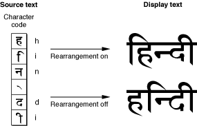

In some cases, users may not always want linguistic rearrangement to occur, preferring instead to enter characters in an “already rearranged” order. If a font supports the rearrangement feature type, you can either allow the default behavior (which is to perform rearrangement) or you can prevent it, using the selectors shown in Table B-15. This is a contextual feature type.

__Table B-15__  Selectors for the linguistic rearrangement feature

| Feature selector | Description |
| `kLinguisticRearrangementOnSelector` | Allows the automatic rearrangement of certain glyphs as required by language rules. This is the default setting. |
| `kLinguisticRearrangementOffSelector` | Prevents the automatic rearrangement of certain glyphs as required by language rules. |

The mathematical extras feature type (`kMathematicalExtrasType`) represents a collection of features that are used to set figures and mathematics. For example, this feature can change asterisks to multiplication symbols.

Figure B-13 shows an example of drawing mathematical text without and with the mathematical extras features selectors. The top line is drawn without mathematical extras features. The bottom line is drawn with two mathematical extras features enabled: hyphen to minus sign and asterisk to multiplication sign.

__Figure B-13__  Drawing text without and with mathematical extras

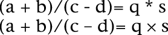

Table B-16 shows the selectors you can use for the mathematical extras feature type. This is a noncontextual, nonexclusive feature type.

__Table B-16__  Selectors for the mathematical extras feature

| Feature selector | Description |
| `kHyphenToMinusOnSelector` | Allows the automatic replacement of the sequence space-hyphen-space (or the hyphen in the sequence numeral-hyphen-numeral) with a minus sign glyph (–). The default setting is to allow hyphen to minus replacement. See [Figure B-13](#apple-f4xwc4dqnrsv64tfmyxwi33df52wszbpkridgmbqgaydamzvfvbeeq2ijfeuera). |
| `kHyphenToMinusOffSelector` | Prevents the automatic replacement of the sequence space-hyphen-space (or the hyphen in the sequence numeral-hyphen-numeral) with a minus sign glyph (–). |
| `kAsteriskToMultiplyOnSelector` | Allows the automatic replacement of the sequence space-asterisk-space (or the asterisk in the sequence numeral-asterisk-numeral) with a multiplication sign glyph (X). See [Figure B-13](#apple-f4xwc4dqnrsv64tfmyxwi33df52wszbpkridgmbqgaydamzvfvbeeq2ijfeuera) |
| `kAsteriskToMultiplyOffSelector` | Prevents the automatic replacement of the sequence space-asterisk-space (or the asterisk in the sequence numeral-asterisk-numeral) with a multiplication sign glyph (X). |
| `kSlashedToDivideOnSelector` | Allows the automatic replacement of the sequence space-slash-space (or the slash in the sequence numeral-slash-numeral) with a division sign glyph (). |
| `kSlashedToDivideOffSelector` | Prevents the automatic replacement of the sequence space-slash-space (or the slash in the sequence numeral-slash-numeral) with a division sign glyph (). |
| `kInequalityLigaturesOnSelector` | Allows the automatic replacement of sequences such as “>=” and “<=” with the equivalent ligatures “≥” and “≤”. |
| `kInequalityLigaturesOffSelector` | Prevents the automatic replacement of sequences such as “>=” and “<=” with the equivalent ligatures “≥” and “≤”. |
| `kExponentsOnSelector` | Allows the automatic replacement of the sequence exponentiation glyph—numeral with the superior forms of the numeral. |
| `kExponentsOffSelector` | Prevents the automatic replacement of the sequence exponentiation glyph—numeral with the superior forms of the numeral. |

The number case feature type (`kNumberCaseType`) specifies whether to use numerals that extend below the baseline. Figure B-14 shows both kinds of numerals. Lowercase numerals (also called traditional or old-style) may descend below the baseline, as shown in the bottom line of the figure. Uppercase numbers (also called lining) do not descend below the baseline.

__Figure B-14__  Uppercase and lowercase numerals

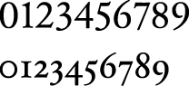

For fonts that support the number case feature type, you can select either kind of numeral. Table B-17 lists the selectors for this noncontextual feature.

__Table B-17__  Selectors for the number case feature

| Feature selector | Description |
| `kLowerCaseNumbersSelector` | Specifies the use of lowercase numerals. |
| `kUpperCaseNumbersSelector` | Specifies the use of uppercase numerals. |

The number spacing feature type (`kNumberSpacingType`) specifies whether to use fixed-width or proportional-width glyphs for numerals. Figure B-15 shows the difference between fixed-width and proportional-width numerals. In proportional-width numerals, the 1 is narrower than the 0; whereas in fixed-width numerals all numerals have identical widths. Fixed-width numerals are also called collimating because they align well in text that consists of columns of numerical data.

__Figure B-15__  Fixed-width and proportional-width numerals

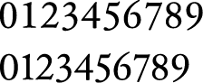

Table B-18 lists the selectors for the number spacing feature type. It is a noncontextual feature.

__Table B-18__  Selectors for the number spacing feature

| Feature selector | Description |
| `kMonospacedNumbersSelector` | Specifies the use of fixed-width numerals, useful for displaying in columns. |
| `kProportionalNumbersSelector` | Specifies the use of proportional-width numerals. |
| `kThirdWidthNumbersSelector` | Specifies the use of fixed-width numerals, using an alternate spacing. |
| `non-alphanumeric` | Specifies the use of fixed-width numerals, using an alternate spacing. |

The ornament sets feature type (`kOrnamentSetsType`) specifies non-alphanumeric glyph sets, such as decorative borders or musical symbols. Figure B-16 shows an example of glyphs from a fleurons ornamental set.

__Figure B-16__  Ornamental glyphs

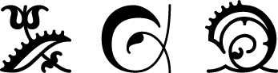

If a font supports the ornament set feature type, you may be able to select among glyph sets, using the selectors shown in Table B-19.

__Table B-19__  Selectors for the ornament sets feature

| Feature selector | Description |
| `kNoOrnamentSelector` | Specifies not to use ornamental glyphs sets. This is the default setting. |
| `kDingbatsSelector` | Specifies the use of dingbats: arrows, stars, bullets, or other miscellaneous symbols used for occasional emphasis in display. |
| `kPiCharactersSelector` | Specifies a set of related symbols designed for a particular purpose (for example, cartography or musical notation) that do not make up a formal alphabet. |
| `kFleuronsSelector` | Specifies the use of ornaments in the shape of flowers, vines leaves, and so forth. |
| `kDecorativeBordersSelector` | Specifies the use of decorative borders: glyphs used in interlocking patterns to form text borders. |
| `kInternationalSymbolsSelector` | Specifies the use of international symbols, such as the barred circle representing “no.” |
| `kMathSymbolsSelector` | Specifies the use of special symbols used to set mathematical or logical expressions. |

The overlapping glyphs feature type (`kOverlappingCharactersType`) controls whether long tails on glyphs are permitted to collide with other glyphs. Some glyphs, especially certain initial swashes, have parts that extend well beyond their advance widths. An initial “Q”, for example, may have a tail that extends underneath the following “u”, as shown in Figure B-17.

Figure B-17 shows text that allows and prevents glyph overlap. The first line does not prevent glyph overlap whereas the second line does. Preventing glyph overlap means that the script “Q” can remain because the following “u” has no descender to collide with it, whereas the script “L” is replaced with a simpler form to avoid collision with the “y”.

__Figure B-17__  Allowing and preventing glyph overlap

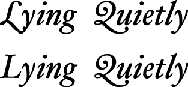

For fonts that support the glyph overlap feature type, you can specify that no glyph may overlap the outline of the following glyph. If it does overlap, ATSUI substitutes a non-overlapping form of the glyph. Table B-20 lists the selectors that turn the overlapping glyphs feature type on and off. It is a contextual feature.

__Table B-20__  Selectors for the overlapping characters feature

| Feature selector | Description |
| `kPreventOverlapOnSelector` | Prevents the collision of an extended part of one glyph with an adjacent glyph. |
| `kPreventOverlapOffSelector` | Allows the collision of an extended part of one glyph with an adjacent glyph. |

_Ruby text_ is a run of text associated with another run of text (the base text), usually used to annotate the base text. Ruby text is often used to provide annotations or indicate pronunciation for Asian languages. Figure B-18 shows ruby text—characters drawn in a smaller point size placed above the base text.

__Figure B-18__  Ruby text above the base text

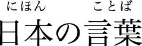

You can select or deselect ruby variant kana glyphs for the Hiragino font by using the ruby kana feature type (`kRubyKanaType`) with the selectors such as shown in Table B-21.

__Table B-21__  Selectors for the ruby kana feature type

| Feature selector | Description |
| `kRubyKanaOffSelector` | Do not use ruby variant glyphs. This is the default setting. |
| `kRubyKanaOnSelector` | Use ruby variant glyphs. |
| `kNoRubyKanaSelector` | Do not use ruby variant glyphs. This is deprecated; instead use `kRubyKanaOffSelector`. |
| `kRubyKanaSelector` | Use ruby variant glyphs. This is deprecated; instead use `kRubyKanaOnSelector`. |

The smart swashes feature type (`kSmartSwashType`) controls contextual swash substitution. (A _swash_ is a variation, often ornamental, of an existing glyph.) The feature determines whether swash variants of glyphs are to be substituted in specific places in the text, such as at the beginnings or ends of words or lines.

Figure B-19 shows the same phrase written four times, each using a different feature selector for the smart swash feature. The first line is drawn without swash variants. The second line is drawn with only initial swashes enabled. The third line is drawn with only final swashes enabled. The last line is drawn with both initial and final swashes enabled.

__Figure B-19__  Text drawn with different swash feature selectors

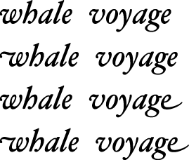

If the font supports the smart swashes feature type, you can select features that allow you to specify sets of swashes, such as shown in Table B-22. This feature is contextual and nonexclusive.

__Table B-22__  Selectors for the smart swash feature

| Feature selector | Description |
| `kWordInitialSwashesOnSelector` | Allows the substitution of swash variants that appear at the start of a word (or a line). This is the default setting. |
| `kWordInitialSwashesOffSelector` | Prevents the substitution of swash variants that appear at the start of a word (or a line). |
| `kWordFinalSwashesOnSelector` | Allows the substitution of swash variants that appear at the end of a word (or a line). |
| `kWordFinalSwashesOffSelector` | Prevents the substitution of swash variants that appear at the end of a word (or a line). |
| `kLineInitialSwashesOnSelector` | Allows the substitution of swash variants that appear only at the start of a line. |
| `kLineInitialSwashesOffSelector` | Prevents the substitution of swash variants that appear only at the start of a line. |
| `kLineFinalSwashesOnSelector` | Allows the substitution of swash variants that appear only at the end of a line. |
| `kLineFinalSwashesOffSelector` | Prevents the substitution of swash variants that appear only at the end of a line. |
| `kNonFinalSwashesOnSelector` | Allows the substitution of swash variants that are used at the beginning or middle of words. An example of this is the archaic long “s”. |
| `kNonFinalSwashesOffSelector` | Prevents the substitution of swash variants that are used at the beginning or middle of words. An example of this is the archaic long “s”. |

The style options feature type (`kStyleOptionsType`) allows the font designer to group together collections of noncontextual substitutions into named sets. These substitutions give the text a specific style or appearance. You can select among sets, using such selectors as those listed in Table B-23.

__Table B-23__  Selectors for the style options feature

| Feature selector | Description |
| `kNoStyleOptionsSelector` | Specifies to use plain text. This is the default setting. |
| `kDisplayTextSelector` | Specifies the use of a glyph set that is designed for best display at large sizes (typically over 24 point). |
| `kEngravedTextSelector` | Specifies the use of a glyph set that has contrasting strokes parallel to the main stroke, giving an engraved-in-stone effect. |
| `kIlluminatedCapsSelector` | Specifies the use of a glyph set with complex decoration surrounding the glyphs of capital letters, in the manner used by medieval scribes. |
| `kTiltingCapsSelector` | Specifies the use of a glyph set in which capital letters have a special form for display in titles. |
| `kTallCapsSelector` | Specifies the use of a glyph set in which capital letters have a taller form than is typical. |

The text spacing feature type (`kTextSpacingType`) specifies whether to use proportional, monospaced, or half-width forms of glyphs for characters in a font. Use of this feature is optional; for more precise control see [Kana Spacing Feature Type](#apple-f4xwc4dqnrsv64tfmyxwi33df52wszbpkridgmbqgaydamzvfvkfawcsivddemrq)t and [Ideographic Spacing Feature Type](#apple-f4xwc4dqnrsv64tfmyxwi33df52wszbpkridgmbqgaydamzvfvkfawcsivddemrr).

Figure B-20 shows text drawn using the text spacing feature type. The first line uses the default text spacing for the font, which is proportional. The next line uses the monospaced text selector. The last line is drawn using the proportional text spacing selector, which in this case, is the same as the default.

__Figure B-20__  Normal, monospaced, and proportional text spacing

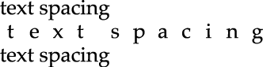

Table B-24 lists the selectors for the text spacing feature type. It is a noncontextual feature.

__Table B-24__  Selectors for the text spacing feature

| Feature selector | Description |
| `kProportionalTextSelector` | Specifies the use of proportional forms of characters. This is the default setting. |
| `kMonospacedTextSelector` | Specifies the use of monospaced forms of characters. |
| `kHalfWidthTextSelector` | Specifies the use of half-width forms of characters. |

The transliteration feature type (`kTransliterationType`) specifies that text in one format is to be displayed using another format. For example, displaying a Hanja string as Hangul, as shown in Figure B-21. The top line is Hanja and the bottom line is the Hangul transliteration.

__Figure B-21__  Hanja text (top) displayed as Hangul (bottom)

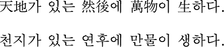

Table B-25 lists the selectors for the transliteration feature type. It is a noncontextual, exclusive feature.

__Table B-25__  Selectors for the transliteration feature

| Feature selector | Description |
| `kNoTransliterationSelector` | Specifies not to use transliteration. This is the default setting. |
| `kHanjaToHangulSelector` | Specifies to display Hanja as Hangul. |
| `kHiraganaToKatakanaSelector` | Specifies to display Hiragana as Katakana. |
| `kKatakanaToHiraganaSelector` | Specifies to display Katakana as Hiragana. |
| `kKanaToRomanizationSelector` | Specifies to display Kana as Roman. |
| `kRomanizationToHiraganaSelector` | Specifies to display Roman as Hiragana. |
| `kRomanizationToKatakanaSelector` | Specifies to display Roman as Katakana. |
| `kHanjaToHangulAltOneSelector` | Specifies to display Hanja as Hangul, using alternative glyph set 1. |
| `kHanjaToHangulAltTwoSelector` | Specifies to display Hanja as Hangul, using alternative glyph set 2 |
| `kHanjaToHangulAltThreeSelector` | Specifies to display Hanja as Hangul, using alternative glyph set 3. |

The typographical extras features type (`kTypographicExtrasType`) represents a collection of effects that are associated with sophisticated typography, such as substitution of en dashes for hyphens. Fonts that support the typographic extras feature type allow you to specify certain typographic conventions, using such selectors as those shown in Table B-26. This feature is noncontextual and nonexclusive.

__Table B-26__  Selectors for the typographical extras feature

| Feature selector | Description |
| `kHyphensToEmDashOnSelector` | Allows the automatic replacement of two adjacent hyphens with an em dash. This is the default setting. |
| `kHyphensToEmDashOffSelector` | Prevents the automatic replacement of two adjacent hyphens with an em dash. |
| `kHyphenToEnDashOnSelector` | Allows the automatic replacement of the sequence space-hyphen-space (or the hyphen in the sequence numeral-hyphen-numeral) with an en dash. |
| `kHyphenToEnDashOffSelector` | Prevents the automatic replacement of the sequence space-hyphen-space (or the hyphen in the sequence numeral-hyphen-numeral) with an en dash. |
| `kSlashedZeroOnSelector` | Allows the forced use of the zero glyph with a slash, regardless of whether the font specifies a slashed zero as the default. |
| `kSlashedZeroOffSelector` | Prevents the forced use of the zero glyph with a slash, regardless of whether the font specifies a slashed zero as the default. |
| `kFormInterrogbangOnSelector` | Allows the automatic replacement of the sequence “?!” or “!?” with the font’s interrobang glyph. |
| `kFormInterrogbangOffSelector` | Prevents the automatic replacement of the sequence “?!” or “!?” with the font’s interrobang glyph. |
| `kSmartQuotesOnSelector` | Allows the automatic contextual replacement of straight quotation marks with curly ones. |
| `kSmartQuotesOffSelector` | Prevents the automatic contextual replacement of straight quotation marks with curly ones. |
| `kPeriodsToEllipsisOnSelector` | Allows the automatic replacement of three adjacent periods with an ellipsis. |
| `kPeriodsToEllipsisOffSelector` | Prevents the automatic replacement of three adjacent periods with an ellipsis. |

The Unicode decomposition feature type (`kUnicodeDecompositionType`) controls whether combining marks are joined with base characters to form composite glyphs. Table B-27 shows the selectors you can use for this feature.

__Table B-27__  Selectors for the Unicode decomposition feature type

| Feature selector | Description |
| `kCanonicalCompositionOnSelector` | Specifies that Unicode canonical composing sequences should be recognized and combined into glyphs. |
| `kCanonicalCompositionOffSelector` | Specifies that Unicode canonical composing sequences should not be recognized and combined into glyphs. |
| `kCompatibilityCompositionOnSelector` | Specifies that Unicode compatibility composing sequences should be recognized and combined into glyphs. |
| `kCompatibilityCompositionOffSelector` | Specifies that Unicode compatibility composing sequences should not be recognized and combined into glyphs. |
| `kTranscodingCompositionOnSelector` | Specifies that Apple transcoding hints (for legacy Mac OS character sets) should be recognized and combined into glyphs. |
| `kTranscodingCompositionOffSelector` | Specifies that Apple transcoding hints (for legacy Mac OS character sets) should not be recognized and combined into glyphs. |

The vertical position feature type (`kVerticalPositionType`) controls the selection of superscript and subscript glyph sets. Figure B-22 shows text drawn using normal, superior, inferior, and ordinal vertical positions.

__Figure B-22__  Normal, superior, inferior, and ordinal vertical positions

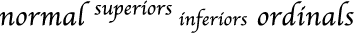

The vertical position feature type is a contextual, exclusive feature type. The selectors for this feature are described in Table B-28.

__Table B-28__  Selectors for the vertical position feature

| Feature selector | Description |
| `kNormalPositionSelector` | Specifies to display the text with no vertical displacement. This is the default setting. See the first word in Figure B-22. |
| `kSuperiorsSelector` | Specifies use of superiors; changes any characters having superior forms in the font into those forms, used typically for superscripts. See the second word in Figure B-22. |
| `kInferiorsSelector` | Specifies use of inferiors; changes any characters having inferior forms in the font into those forms, used typically for subscripts. See the third word in Figure B-22. |
| `kOrdinalsSelector` | Specifies to contextually change certain letters into their superior forms. As shown in the fourth word in Figure B-22, the ordinals selector may not effect drawing. |

The vertical substitution feature type (`kVerticalSubstitutionType`) specifies that certain glyphs (such as parentheses) should change their appearance in vertical runs of text. Figure B-23 illustrates how vertical substitution works. The top line shows horizontal text—a word enclosed in parentheses. When the text is displayed vertically without turning on vertical substitution (left side of the figure), the parentheses appear odd. When vertical substitution is turned on (right side of the figure) the parentheses appear in the appropriate orientation.

__Figure B-23__  Vertical substitution forms in a font

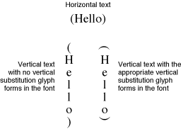

If the font supports the vertical substitution feature type, its default behavior is to perform such substitutions. You may either prevent the substitution or allow it to occur. For vertical substitution to work, the vertically rotated forms must exist in the font and must be indicated as such in the font’s tables. Otherwise, no characters are substituted even when you turn on this feature explicitly. Note that vertical substitution is not used to rotate glyphs, simply to substitute forms, as shown in Figure B-23. 

Table B-29 lists the selectors for the vertical substitution feature type. It is a contextual feature.

__Table B-29__  Selectors for the vertical substitution feature

| Feature selector | Description |
| `kSubstituteVerticalFormsOnSelector` | Allows the substitution of alternate glyph forms in vertical lines. |
| `kSubstituteVerticalFormsOffSelector` | Prevents the substitution of alternate glyph forms in vertical lines. |

[Next](Document%20Revision%20History.md)[Previous](ATSUI%20Implementation%20of%20the%20Unicode%20Specification.md)

