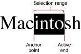

> 导航：[总目录](../../../README.md) · [documentation](../../../_indexes/documentation.md) · [ATSUI Programming Guide](Introduction%20to%20ATSUI%20Programming%20Guide.md)

[Next](Advanced%20Tasks-%20Substituting%20Fonts%20and%20Modifying%20Layouts.md)[Previous](Basic%20Tasks-%20Working%20With%20Objects%20and%20Drawing%20Text.md)

# Interactive Tasks: Supporting Carets and Highlighting Text

This chapter provides information on how to support user interaction with the text your application draws onscreen. Handling the caret and highlighting text are discussed in the following sections:

- [Positioning the Caret](#apple-f4xwc4dqnrsv64tfmyxwi33df52wszbpkridgmbqgaydamzrfvkfawcsivddcnbu) describes which functions to use to determine the insertion point and move the caret.
- [Highlighting Selected Text](#apple-f4xwc4dqnrsv64tfmyxwi33df52wszbpkridgmbqgaydamzrfvkfawcsivddcnbz) discusses how to draw highlighted text.

Before you read this chapter, you should be familiar with the tasks described in Chapter 4, [Basic Tasks: Working With Objects and Drawing Text](Basic%20Tasks-%20Working%20With%20Objects%20and%20Drawing%20Text.md#apple-f4xwc4dqnrsv64tfmyxwi33df52wszbpkridgmbqgaydamzqfvkfami).

If you want users to interact with the text your application draws onscreen, you need to recognize and respond appropriately to mouse clicks and arrow-key presses. This section discusses two tasks your application must perform to position the caret in response to user actions:

- [Setting the Insertion Point](#apple-f4xwc4dqnrsv64tfmyxwi33df52wszbpkridgmbqgaydamzrfvbegskcjfbugqq)
- [Moving the Caret](#apple-f4xwc4dqnrsv64tfmyxwi33df52wszbpkridgmbqgaydamzrfvbegskdijeuesa)

Each of these tasks requires you to take into consideration whether the mouse click or arrow-key press occurs at a direction boundary and whether the glyph involved in caret movement forms a combining character.

Before you perform the tasks described in this section, you should be familiar with [Caret Handling](Typography%20Concepts.md#apple-f4xwc4dqnrsv64tfmyxwi33df52wszbpkridgmbqgaydamryfvkfawcsivddcnjs).

When the user clicks a location in onscreen text, your application must determine which caret position best reflects the user’s action. The ATSUI function `ATSUPositionToOffset` determines the position for you. When you use this function, ATSUI calculates whether the mouse click is closest to the trailing edge or the leading edge of the glyph and returns the appropriate caret position. For example, [Figure 1-26](Typography%20Concepts.md#apple-f4xwc4dqnrsv64tfmyxwi33df52wszbpkridgmbqgaydamryfvbecsscjfcugry) shows the caret position associated with a mouse-down region in line of unidirectional text.

The caret position in a line of unidirectional text is fairly straightforward to determine. But suppose the user clicks between a direction boundary? In this case, the function `ATSUPositionToOffset` returns a value to indicate that a dual caret is appropriate and returns the two caret positions associated with the mouse-down event. One position specifies where your application should draw the high, or primary, caret while the second position specifies where your application should draw the low, or secondary, caret. Figure 4-1 shows the two caret positions returned when the insertion point is at the direction boundary associated with offset 3. The primary caret position indicates where Arabic text should be entered and the secondary caret position indicates where Roman text should be entered.

__Figure 4-1__  Caret positions returned for an insertion point on a direction boundary

You need to perform the following steps to set the insertion point in response to a mouse click by a user:

1. Obtain the location of the mouse-down event.
2. Convert the coordinates to local coordinates relative to the line origin.

   You need to determine which line in the text is associated with the mouse-down event and then get the line origin.

   The coordinates must be local to the line origin. For example, if the position of the mouse-down event in local coordinates is (100,250), you would subtract this value from the position of the origin of the line in the current graphics port. If the position of the origin of the line in the current graphics port is (10,250), then the relative position of the mouse-down event is (90,0).
3. Call the function `ATSUPositionToOffset` to obtain the memory offset corresponding to the glyph edge nearest the mouse-down event.

   You must pass this function the local coordinates relative to the line origin.

   If the mouse-down event occurs at a direction boundary or within a glyph cluster, `ATSUPositionToOffset` produces two offsets.
4. Call the function `ATSUOffsetToPosition` to obtain the actual caret position for the mouse-down event.

   You must pass this function the memory offset returned in the previous step. Pass two memory offsets if the mouse-down event occurs at a direction boundary or within a glyph cluster.

   The function `ATSUOffsetToPosition` returns an `ATSUCaret` structure that specifies the starting and ending pen locations for the caret. If it is a dual caret, the function returns the starting and ending pen locations for the high and low carets.
5. Draw the caret using the pen location returned by the function `ATSUOffsetToPosition` in the previous step.

   It is the responsibility of your application to draw the caret. ATSUI does not draw carets; it only provides the pen locations for you to use.

For unidirectional text, when the user presses an arrow key to move the caret left or right across the text, your application should move the caret in the direction of the arrow key. If the document contains objects such as graphics or sound data embedded in the text, you should treat the embedded object as a single character.

You can use these functions to obtain the memory offset for an insertion point:

- `ATSUNextCursorPosition` obtains the memory offset for an insertion point that follows the current insertion point in storage order.
- `ATSUPreviousCursorPosition` obtains the memory offset for an insertion point that precedes the current insertion point in storage order.
- `ATSURightwardCursorPosition` obtains the memory offset for an insertion point to the right of the high caret position.
- `ATSULeftwardCursorPosition` obtains the memory offset for an insertion point to the left of the high caret position.

The functions `ATSUNextCursorPosition`, `ATSUPreviousCursorPosition`, `ATSURightwardCursorPosition`, and `ATSULeftwardCursorPosition` can treat individual combining characters either as part of an indivisible larger unit (that is, a cluster) or as characters in their own right, depending on the caret movement type you specify when you call the function. You can also use the style attribute tag `kATSUNoLigatureSplitTag` to treat combining characters of ligatures as one or two text elements.

Once you have obtained the memory offset for an insertion point, you can call the function `ATSUOffsetToPosition` to obtain the actual caret position. Then, you can draw the caret using the pen location returned by the function `ATSUOffsetToPosition`.

A user can select a range of text by positioning the pointer, pressing the mouse button, moving the mouse, and then releasing the mouse button. The _anchor point_ is the position in the text at which the user positions the pointer and presses the mouse button. The point at which the user releases the button is the _active end_ of the range. Figure 4-2 shows the anchor point and active end for a selection range. Note that a selection range can also be set programmatically by your application.

__Figure 4-2__  The anchor point and active end of a selection range

Recall from [Typography Concepts](Typography%20Concepts.md#apple-f4xwc4dqnrsv64tfmyxwi33df52wszbpkridgmbqgaydamryfvkfami) that characters in a selection range are always contiguous in memory, but their corresponding glyphs are not necessarily contiguous onscreen, as shown in [Figure 1-25](Typography%20Concepts.md#apple-f4xwc4dqnrsv64tfmyxwi33df52wszbpkridgmbqgaydamryfvbecssfizduksq).

Your application should highlight text in response to a user’s selection moves. To highlight text, you need to perform the following tasks:

1. Obtain the coordinates for the anchor point and the active end of a selection event.
2. Call the function `ATSUPositionToOffset` to obtain the memory offsets for the glyphs edges nearest the anchor point and the active end of the selection.
3. Calculate the length of the area to highlight.

   You need to calculate the absolute value of the length.
4. Call the function `ATSUHighlightText` to render a highlighted range of text.

   ATSUI automatically produces discontinuous highlighting if necessary.

   To draw a highlighted range of text that spans more than one line, you should call the function `ATSUHighlightText` for each line, even if the lines are in the same text layout object.

If you need to remove highlighting from previously highlighted text, call the function `ATSUUnhighlightText`.

[Next](Advanced%20Tasks-%20Substituting%20Fonts%20and%20Modifying%20Layouts.md)[Previous](Basic%20Tasks-%20Working%20With%20Objects%20and%20Drawing%20Text.md)

