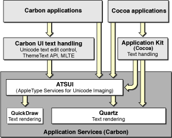

> 导航：[总目录](../../../README.md) · [documentation](../../../_indexes/documentation.md)

[Next](Typography%20Concepts.md)

# Introduction to ATSUI Programming Guide

Apple Type Services for Unicode Imaging (ATSUI) is the technology behind all text drawing in Mac OS X. This document gives an overview of ATSUI, provides an introduction to the concepts and terms you need to understand ATSUI, discusses the core data types you use to control text layout and styles, and shows you how to use ATSUI in your application.

You should read this document if you plan to write an application that

- allows fine control over layout features—for example, you can precisely position individual glyphs and lines of text as well as draw Unicode text at any angle of rotation, including vertically
- provides text-processing services when Multilingual Text Engine (MLTE) isn’t sufficient
- accesses Quartz text effects from Carbon in Mac OS X
- supports high-end typography

You might also find parts of this document useful if you are using an API (such as MLTE) that calls into ATSUI, as this document discusses typographical concepts and terms that are relevant to the APIs that call ATSUI.

The chapters in the rest of this document cover the following topics:

- [Typography Concepts](Typography%20Concepts.md#apple-f4xwc4dqnrsv64tfmyxwi33df52wszbpkridgmbqgaydamryfvkfami) provides an overview of how text is laid out and displayed and defines the typographical concepts you need to know to understand how ATSUI implements typography.
- [ATSUI Style and Text Layout Objects](ATSUI%20Style%20and%20Text%20Layout%20Objects.md#apple-f4xwc4dqnrsv64tfmyxwi33df52wszbpkridgmbqgaydamrzfvkfami) describes the style and text layout objects used by ATSUI and outlines many of the style, line, and layout features you can control with ATSUI.
- [Basic Tasks: Working With Objects and Drawing Text](Basic%20Tasks-%20Working%20With%20Objects%20and%20Drawing%20Text.md#apple-f4xwc4dqnrsv64tfmyxwi33df52wszbpkridgmbqgaydamzqfvkfami) discusses general guidelines for using ATSUI, provides step-by-step instructions for getting and setting line, layout, and style attributes, and shows you how to do the most common tasks with ATSUI, such as measuring and drawing text.
- [Interactive Tasks: Supporting Carets and Highlighting Text](Interactive%20Tasks-%20Supporting%20Carets%20and%20Highlighting%20Text.md#apple-f4xwc4dqnrsv64tfmyxwi33df52wszbpkridgmbqgaydamzrfvkfami) describes how to support user interaction with the text your application draws onscreen.
- [Advanced Tasks: Substituting Fonts and Modifying Layouts](Advanced%20Tasks-%20Substituting%20Fonts%20and%20Modifying%20Layouts.md#apple-f4xwc4dqnrsv64tfmyxwi33df52wszbpkridgmbqgaydamzsfvkfami) provides detailed instructions for doing such advanced tasks as using font fallbacks and kerning text.
- [Direct-Access Tasks: Working With Glyph Data](Direct-Access%20Tasks-%20Working%20With%20Glyph%20Data.md#apple-f4xwc4dqnrsv64tfmyxwi33df52wszbpkridgmbqgaydamztfvkfami) shows how you can use direct-access functions to control the internal layout processes of ATSUI to affect how glyphs are drawn.
- [ATSUI Implementation of the Unicode Specification](ATSUI%20Implementation%20of%20the%20Unicode%20Specification.md#apple-f4xwc4dqnrsv64tfmyxwi33df52wszbpkridgmbqgaydamzufvkfami) gives additional details on how ATSUI implements Unicode.
- [Font Features](Font%20Features.md#apple-f4xwc4dqnrsv64tfmyxwi33df52wszbpkridgmbqgaydamzvfvkfami) lists font feature types and the selectors available for each feature type.

Mac OS X is an international operating system. It fully supports Unicode and comes with high-quality fonts capable of displaying many languages, including Japanese and Chinese. Mac OS X supports input of non-phonetic characters used by Chinese, Japanese, and Korean through the use of input methods. Because Mac OS X uses Unicode for all onscreen text display, ASTUI is at the heart of all text drawing in Mac OS X, as shown in Figure I-1. From the Mac OS X Human Interface Toolbox to the Menu Manager, all Mac OS X text drawing at some point uses ATSUI to render Unicode text. For example, the Finder uses ATSUI to display menu items and create text editing fields:

- Menu items are static text displayed by calling the Menu Manager function `DrawThemeTextBox`, which in turn uses ATSUI to render the Unicode text.
- Editable text fields are created using MLTE (Multilingual Text Engine) text objects, but MLTE relies on ATSUI to render the Unicode text in the editable text fields.

TextEdit is another application among the many Mac OS X applications that use ATSUI to lay out and render Unicode text. The Unicode text rendering of ATSUI includes support for accents and ligatures, bidirectional text, contextual forms and vowel reordering, vertical text, and surrogates.

ATSUI is not just a technology that works behind the scenes; you can call directly into the ATSUI API from your application to render Unicode-encoded text. With ATSUI, you can control many aspects of text layout, including justification, alignment (flushness), kerning, tracking, shifting, and ligature formation. Using ATSUI direct-access functions, you can, if necessary, control how individual segments of glyphs are drawn.

__Figure I-1__  ATSUI and text drawing in Mac OS X

ATSUI uses opaque objects to keep track of style and layout information that specify how you want text displayed. Using the information in these objects, ATSUI can support high-end typographic control of

- bidirectional text
- vertical text with variants, kanji variants, and proportional Chinese-Japanese-Korean (CJK)
- kashida justification, rearrangement, ligatures, and contextual forms
- combined characters that require ligation, morphing, and other advanced effects
- optical alignment
- stylistic sophistication of font design such as swash variants and arbitrary ligatures

ATSUI has a number of functions that support text editing, including highlighting, hit-testing, caret movement, and caret positioning functions. For developers who need to manipulate glyphs directly, ATSUI also provides a set of functions that allows access to glyph outlines and details of the glyph array.

ATSUI provides full Unicode 3.2 layout support and supports text rendering support for all the features required by scripts included with version 2.1 of the Unicode standard or later. The ability of ATSUI to render Unicode text is limited only by the available fonts the user has installed. (ATSUI does not provide other Unicode-related text processing services such as formatting the date and time.)

ATSUI takes advantage of all data included in a font. This means if a font designer includes ligatures, swashes, alternate forms, or any data that describes the font, ATSUI can use the data. For example, the Zapfino font provides several forms for a ligature. Using ATSUI, you can access the Zapfino font data to automatically form the appropriate ligature. When ATSUI changes glyphs to provide an alternate form, ligature, or other modification, the text doesn’t change. This ensures that such services as spelling checking and text searching work properly even when the text is redrawn. If you don’t want to use the data provided with a font, you can set up ATSUI to override the data with the settings you provide.

ATSUI renders text with Quartz, Apple’s 2D rendering engine, giving your text the look and feel that makes Mac OS X unique. ATSUI is fully integrated with Quartz in Mac OS X. You can use the two technologies together to get superior anti-aliasing and to take advantage of the attributes associated with a Quartz context (`CGContext`). For example, some features, such as line rotation, are supported by both ATSUI and Quartz. By using ATSUI and Quartz together, you have the option to choose which technology does the rotation. You’ll see how to do this later in [Drawing Text Using a Quartz Context](Basic%20Tasks-%20Working%20With%20Objects%20and%20Drawing%20Text.md#apple-f4xwc4dqnrsv64tfmyxwi33df52wszbpkridgmbqgaydamzqfvkfawcsivddcobt).

Quartz provides a number of other features that you may want to take advantage of, such as transparency. You can set a transparency level for a Quartz context, then when you use ATSUI to draw text into the context, the text is drawn with the transparency level specified for the Quartz context.

_ATSUI Reference_, a complete reference to the ATSUI programming interface

To download ATSUI-related sample code and to obtain documentation about other programming interfaces related to text and international services, see the Apple developer website:

[http://developer.apple.com/](https://developer.apple.com/)

For detailed information about Unicode:

[http://www.unicode.org](http://www.unicode.org/)

[Next](Typography%20Concepts.md)

