> 导航：[总目录](../../../README.md) · [documentation](../../../_indexes/documentation.md) · [ATSUI Programming Guide](Introduction%20to%20ATSUI%20Programming%20Guide.md)

[Next](ATSUI%20Style%20and%20Text%20Layout%20Objects.md)[Previous](Introduction%20to%20ATSUI%20Programming%20Guide.md)

# Typography Concepts

This chapter introduces and defines important typographic terms related to _text_—traditionally defined as the written representation of spoken language. The terms and concepts discussed in this chapter are used throughout the rest of the book and in _ATSUI Reference_. If you plan to use ATSUI, or any API that uses ATSUI (for example, MLTE), you should read this chapter.

This chapter starts by outlining the different components that make up text. It then describes how text is

- measured and stored
- arranged on a display device
- adjusted in various ways to affect the text direction, kerning, alignment (or flushness), justification, and line breaks
- drawn, highlighted, and hit-tested

A writing system’s alphabet, numbers, punctuation, and other writing marks consist of characters. A _character_ is a symbolic representation of an element of a writing system; it is the concept of, for example, “lowercase a” or “the number 3.” It is an abstract object, defined by custom in its own language.

As soon as you write a character, however, it is no longer abstract but concrete. The exact shape by which a character is represented is called a _glyph_. The “characters” that ATSUI places on the screen are really glyphs.

Glyphs and characters do not necessarily have a one-to-one correspondence. For example, a single character may be represented by one or more glyphs (the character “lowercase i” could be represented by the combination of a “dotless-i” glyph and a “dot” glyph), and a single glyph can represent two or more characters (the two characters “f” and “i” can be represented by a single glyph as shown in [Figure B-10](Font%20Features.md#apple-f4xwc4dqnrsv64tfmyxwi33df52wszbpkridgmbqgaydamzvfvkfawcsivddenrv)).

Context—where the glyph appears in a line of text—also affects which glyph represents a character. Figure 1-1 shows examples of such contextual forms in a Roman font. Different forms of a glyph are used according to whether the glyph stands alone, occurs at the beginning of a word, occurs at the end of a word, or forms part of a new glyph, as in a ligature. For example, both forms of “X” can be used at the beginning of a word, but the form on the right side of the figure can be used only at the start of a word, whereas the form on the left side can be used alone or at the start of a word. Similarly, the “n” on the left side of the figure can be used alone or at the end of a word whereas the “n” on the right side can be used only to end a word. The last line in Figure 1-1 illustrates how “s” and “t” can be drawn separately or combined to form a ligature.

__Figure 1-1__  Contextual forms in a Roman font

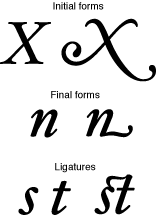

A _font_ is a collection of glyphs, all of similar design, that constitute one way to represent the characters of one or more languages. Fonts usually have some element of design consistency, such as the shape of the ovals (known as the _counter_), the design of the stem, stroke thickness, or the use of _serifs_, which are the fine lines stemming from the upper and lower ends of the main strokes of a letter. Figure 1-2 shows some of the elements of glyphs that indicate they are members of the same family.

__Figure 1-2__  Elements that distinguish glyphs of a Roman font

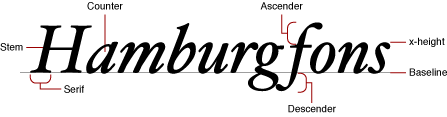

A _font family_ is a group of fonts that share certain characteristics and have a common family name. Each font family has its own name, such as “New York,” “Geneva,” or “Symbol.” In contrast, a font always has a full name—for example, Geneva Regular or Times Bold. The full name determines which family the font belongs to and what typestyle it represents. (See [Typestyles](#apple-f4xwc4dqnrsv64tfmyxwi33df52wszbpkridgmbqgaydamryfvkfawcsivddcmzz) for more information.) Several fonts may have the same family names (such as Geneva, Geneva Bold, and so on) but are stored separately—these fonts are still part of the same font family. The font Geneva Italic, for example, shares many characteristics with Geneva Regular, but all of the glyphs slant at a certain angle. Though different, these fonts are part of the same font family.

A computer represents characters in numeric form. A _character encoding_ is a mapping that assigns numeric values (character codes) to characters. The mapping varies depending on the character set, which in turn may depend on the language as well as other factors.

Fonts associate each glyph with a double-byte code called its _glyph code_ (which is not the same as a character code). Different fonts may have different glyph codes for the same glyphs, and a single font may have several glyph codes associated with a particular character because several glyphs may represent that character. Because the font and general textual context determine which glyph and which glyph codes represent characters, ATSUI transparently handles the details of mapping character codes to the correct glyph codes. Your application does not have to handle the details of obtaining glyphs from a font.

Different languages may have different requirements in terms of which glyphs they use from a font. A font contains some number of character encodings. Each encoding is an internal conversion table for interpreting a specific character set—that is, a way to map a character code to a glyph code for that font.

The reason a font can have multiple encodings is that the requirements for each writing system that the font supports may be different. A _writing system_ is a method of depicting words visually. It consists of a character set and a set of rules for displaying, ordering, and formatting the glyphs associated with those characters. Writing systems can differ in line direction, the direction in which their glyphs are read, the size of the character set used to represent the script, and contextual variation (that is, whether a glyph changes according to its position relative to other glyphs). Writing systems have specific requirements for text display, text editing, character set, and fonts. A writing system can serve one or several languages. For example, the Roman writing system serves many languages, including French, Italian, and Spanish.

Most character sets and character encoding schemes developed in the past are limited in that they supported just one language or a small set of languages. Multilingual software has traditionally had to implement methods for supporting and identifying multiple character encodings. To interpret a character encoded numerically, you needed to know the text encoding system used to encode the character. Because text encoding systems are not unique, the same numeric encoding used in different systems may not represent the same character. The adoption of Unicode has changed this.

_Unicode_ is a character encoding system designed to support the interchange, processing, and display of all the written texts of the diverse languages of the modern world. Unicode supplies enough numeric values to encode all characters available to all written texts. It provides a single model for text display and editing. Unicode also simplifies the handling of bidirectional text and characters that change according to their position in the sentence.

Unicode has three primary formats available for encoding: UTF-8, UTF-16, and UTF-32 (UTF stand for Unicode Transformation Format). UTF-8 is a single-byte format; UTF-16 is a double-byte format; and UTF-32 is a quadruple-byte format. ATSUI uses UTF-16, which uses two bytes to specify a character. Text that uses an encoding other than Unicode can be converted to Unicode using the Text Encoding Converter. See _Programming With the Text Encoding Conversion Manager_ for more information.

Because Unicode includes the character repertoires of most common character encodings, it facilitates data interchange with other platforms. Using Unicode, text manipulated by your application and shared across applications and platforms can be encoded in a single coded character set.

Unicode provides some special features, such as combining or nonspacing marks and conjoining Jamo. These features are a function of the variety of languages that Unicode handles. If you have coded applications that handle text for the languages these features support, they should be familiar to you. If you have used a single coded character set such as ASCII almost exclusively, these features will be new to you. ATSUI lets you control how the special features available through Unicode are rendered.

For more information on Unicode, see [http://www.unicode.org](http://www.unicode.org/). For additional details on how ATSUI implements the Unicode specification, see [ATSUI Implementation of the Unicode Specification](ATSUI%20Implementation%20of%20the%20Unicode%20Specification.md#apple-f4xwc4dqnrsv64tfmyxwi33df52wszbpkridgmbqgaydamzufvkfami).

ATSUI doesn’t allocate and manage buffers for your text; you are responsible for memory management. Instead ATSUI caches the text that you want rendered, storing the cached text as a sequence of glyph codes. Because ATSUI uses Unicode (UTF-16), each character uses at least 2 bytes of storage. (Surrogate and other characters may require more than 2 bytes of storage.) The storage order is the order in which text is stored. The text stored in memory is the _source text_; the text displayed is the _display text_, as shown in [Figure 1-3](#apple-f4xwc4dqnrsv64tfmyxwi33df52wszbpkridgmbqgaydamryfvkfawcsivddcnry).

_Display order_ is the left-to-right (or top-to-bottom) order in which glyphs are drawn. ATSUI expects you to store your text in _input order_, which is the “logical” order, or the order in which the characters, not glyphs, would be read or pronounced in the language of the text. Because text of different languages may be read from left to right, right to left, or top to bottom, the input order is not necessarily the same as the display order of the text when it is drawn. Your application needs to differentiate between the order in which the character codes are stored and the order in which the corresponding glyphs are displayed. Figure 1-3 shows Hebrew glyphs that are stored one way and displayed another way.

As shown in Figure 1-3, the character codes that make up the text are numbered using zero-based _offsets_. Therefore, the first character code in the figure has an offset of 0.

__Figure 1-3__  Input order and display order

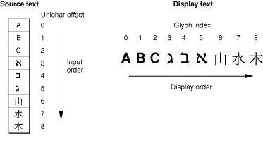

ATSUI also uses a zero-based numbering scheme to index the glyphs that are actually displayed. The _glyph index_, which gives the glyph’s position in the display order, always starts at 0. Each glyph has a single index, even though its character code is 2 bytes (one `Unichar`) long.

Most users use point size to specify the size of the glyphs in a document. _Point size_ indicates the size of a font’s glyphs as measured from the baseline of one line of text to the baseline of the next line of single-spaced text. In the United States, point size is measured in _typographic points_, and there are 72.27 points per inch. However, ATSUI and the PostScript language both define 1 point to be exactly 1/72 of an inch. Although point size is a useful measure of the size of text, you may wish to use more exact measurements for greater control over placement of the glyphs on the display device. ATSUI permits fractional point sizes.

Font designers use a special vocabulary for the measurements of different parts of a glyph. [Figure 1-4](#apple-f4xwc4dqnrsv64tfmyxwi33df52wszbpkridgmbqgaydamryfvkfawcsivddcnrz) shows the terms describing the most frequently used measurements. The _bounding box_ of a glyph is the smallest rectangle that entirely encloses the drawn parts of the glyph. The _glyph origin_ is the point that ATSUI uses to position the glyph when drawing. In Figure 1-4, notice that there is some space between the glyph origin and the edge of the bounding box: this space is the glyph’s _left-side bearing_. The left-side bearing value can be negative, which decreases the space between adjacent characters. The _right-side bearing_ is space on the right side of the glyph; this value may or may not be equal to the value of the left-side bearing. The _advance width_ is the full horizontal width of the glyph as measured from its origin to the origin of the next glyph on the line, including the side bearings on both sides.

Most glyphs in Roman fonts appear to sit astride the _baseline_, an imaginary horizontal line. The _ascent_ is a distance above the baseline, chosen by the font’s designer and the same for all glyphs in a font, that often corresponds approximately to the tops of the uppercase letters in a Roman font. Uppercase letters are chosen because, among the regularly used glyphs in a font, they are generally the tallest.

The _descent_ is a distance below the baseline that usually corresponds to the bottoms of the descenders (the “tails” on glyphs such as “p” or “g”). The descent is the same distance from the baseline for all glyphs in the font, whether or not they have descenders. The sum of ascent plus descent marks the _line height_ of a font.

__Figure 1-4__  Terms for glyph measurements

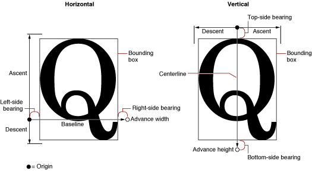

For vertical text, font designers may use additional measurements. The _top-side bearing_ is the space between the top of the glyph and the top edge of the bounding box. The _bottom-side bearing_ is the distance from the bottom of the bounding box to the origin of the next glyph. For vertical text, the _advance height_ is the sum of the top-side bearing, the bounding-box height, and the bottom-side bearing. These metrics are useful if, for example, you want to display a horizontal font vertically. Likewise, vertical fonts such as kanji may also have horizontal metrics.

Every block of text has an _image bounding rectangle_, which is the smallest rectangle that completely encloses the filled or framed parts of a block of text. However, because of the height differences between glyphs—for example, between a small glyph, such as a lowercase “e”, and a taller, larger glyph, such an uppercase “M”, or even between glyphs of different fonts and point sizes—the image bounding rectangle may not be sufficient for your application’s purposes. Therefore, you can also use the _typographic bounding rectangle_, which, in most cases, is the smallest rectangle that encloses the full span of the glyphs from the ascent line to the descent line.

Figure 1-5 shows an example of how the typographic bounding rectangle and image bounding rectangle relate. The two rectangles are markedly different because the text has no ascenders or descenders. Whereas the image bounding rectangle encloses just the black bits of the drawn text, the typographic bounding rectangle takes into account the ascent and descent needed to accommodate all glyphs in a font. If text includes glyphs with ascenders and descenders, the typographic bounding rectangle doesn’t change, but the image bounding rectangle does.

__Figure 1-5__  Image bounding rectangle and typographic bounding rectangle

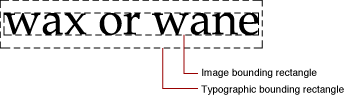

Glyphs can be differentiated not only by font but by typestyle. A _typestyle_ is a specific variation in the appearance of a glyph that can be applied consistently to all the glyphs in a font family. Some of the typical typestyles available on the Macintosh computer include plain, bold, italic, underline, outline, shadow, condensed, and extended. Other styles that may be available are demibold, extra-condensed, or antique.

A _font variation_ is a setting along a particular variation axis. Font variations allow your application to produce a range of typestyles algorithmically. Each _variation axis_ has a name that usually indicates the typestyle that the axis represents, a tag to represent that name (such as `'wght'`), a set of maximum and minimum values for the axis, and the default value of the axis. The weight axis, for example, governs the possible values for the weight of the font; the minimum value may produce the lightest appearance of that font, the maximum value the boldest. The default value is the position along the variation axis at which that font falls normally. Because the axis is created by the font designer, font variations can be optimized for their particular font. Figure 1-6 shows a range of possible weights for a glyph, from the minimum weight to the maximum weight.

__Figure 1-6__  Font variations along a variation axis

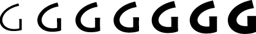

A _font instance_ is a set of named variations identified by the font designer that matches specific values along one or more variation axes and associates those values with a name. For example, suppose a font has the variation axis `'wght'` with a minimum value of 0.0, a default of 0.5, and a maximum value of 1.0. The corresponding font instance might have the name “Demibold” with a value along that variation axis of 0.8.

In Figure 1-6, the variation axis value of the glyph at the far right could represent the named instance “Extra Bold,” whereas the glyph at the far left could represent the named instance “Light.” The other values represented in the figure could likewise have instance names.

Font variations and font instances give your application the ability to provide whatever typestyles the font designer has decided to include with the font. They are available through ATSUI only if the font designer has defined variations and instances for a font.

When you arrange text on a display device, you can let ATSUI use default values to automatically handle many aspects of the text display or you can specify precisely how ATSUI should present and arrange the text. The specifics of text layout using ATSUI are discussed in later chapters. This section describes some of the general concepts of laying out text on a display device. For example, when laying out text, the following need to be considered:

- text direction
- baselines
- text runs, style runs, and direction runs
- contextual forms and ligatures
- alignment (or flushness) and justification
- kerning and tracking
- line breaks
- font substitution

_Text direction_ consists of text orientation (horizontal or vertical) and the direction in which the text is read. Text in your application can be oriented in three common directions: horizontally, left to right; horizontally, right to left; and vertically, top to bottom. ATSUI allows your application, for example, to draw lines of text in multiple directions, as shown in Figure 1-7.

__Figure 1-7__  Bidirectional text

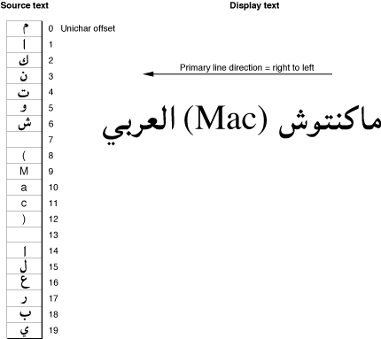

A _baseline_ is an imaginary line that coincides with some point in a font—for example, the bottom, middle, or top of each glyph. The baseline of a glyph defines the position of the glyph with respect to other glyphs at different point sizes when all the glyphs are aligned. It represents a stable platform from which glyphs of different sizes and different writing systems grow proportionally.

Depending on the writing system, the baseline may be above, below, or through the center of each glyph, as shown in Figure 1-8. ATSUI provides your application with capabilities for using multiple baselines. For more information, see [Baseline Offsets Attribute Tag](ATSUI%20Style%20and%20Text%20Layout%20Objects.md#apple-f4xwc4dqnrsv64tfmyxwi33df52wszbpkridgmbqgaydamrzfvkfawcsivddcnzt).

__Figure 1-8__  Baselines for different sizes of a glyph and for different writing systems

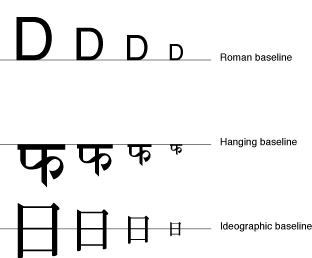

A _baseline delta_ is the distance between the baseline and the position of the glyph with respect to the baseline, as shown in Figure 1-9.

__Figure 1-9__  The baseline delta

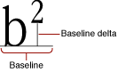

Various baselines can also be used to create special effects, such as drop capitals. A _drop capital_ is an initial capital letter that is much larger than surrounding glyphs and embedded in them. Figure 1-10 is an example of drop capitals formed solely on the basis of the baselines in the font. The default baseline for this text is the Roman baseline for 18-point type. The hanging baseline of the drop capitals aligns with the hanging baseline of the regular text, creating the effect shown.

__Figure 1-10__  Drop capitals

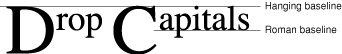

Because text has a direction, the concept of which glyph comes “first” in a line of text cannot always be limited to the visual terms “left” and “right.” The _leading edge_ is defined as the edge of a glyph you first encounter—such as the left foot of a Roman glyph—when you first read the text that includes that glyph. The _trailing edge_ is the edge of a glyph encountered last.

Figure 1-11 shows how the concepts of leading edge and trailing edge change depending on the characteristics of the glyph. In the first example—a Roman glyph—the leading edge is on the left, because the reader encounters that side first. In the second example, the leading edge of the Hebrew glyph is on the right for the same reason.

__Figure 1-11__  Leading edges and trailing edges

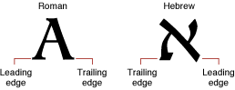

In any segment of contiguous text, certain parts stand out as belonging together, because the glyphs share a certain font, typestyle, or direction. For the purposes of referring to individual segments of text, you can think of sequences of glyphs that are contiguous in memory and share a set of common attributes as _runs_.

ATSUI associates a block of text with a _text run_. A sequence of glyphs contiguous in memory that share the same style is a _style run_. As Figure 1-12 shows, a text run can be subdivided into several style runs. The figure shows three style runs.

__Figure 1-12__  Three style runs in a line of text

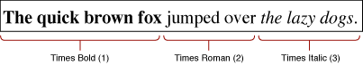

A sequence of contiguous glyphs that share the same text direction is a _direction run_. As with text runs and style runs, the number of direction runs does not necessarily correlate to the number of style runs available, as shown in Figure 1-13, which has two direction runs.

__Figure 1-13__  Two direction runs in a line of text

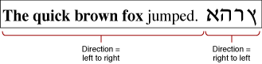

A glyph’s position next to other glyphs or its position in a word or a line of text may determine its appearance. For some writing systems, such as Roman, alternate glyphs are used for aesthetic reasons; in other writing systems, use of alternate forms is required.

A _contextual form_ is an alternate form of a glyph that is chosen depending on the glyph’s placement in a certain context, such as a certain word or line. Some contextual forms of initial and final forms of glyphs in a Roman font are shown in [Figure 1-1](#apple-f4xwc4dqnrsv64tfmyxwi33df52wszbpkridgmbqgaydamryfvbuuqskjffeqsa). Other writing systems, such as Arabic, require different contextual forms of glyphs according to where they appear. Figure 1-14 shows the forms of the Arabic letter “ha” that appear alone and at the beginning, middle, or end of a word. The same character code is used for each case; ATSUI finds the appropriate glyph code.

__Figure 1-14__  Contextual forms of the Arabic letter “ha”

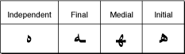

_Ligatures_ are two or more glyphs combined to form a single new glyph (whereas contextual forms are variations on the shape of one glyph). In the Roman writing system, ligatures are generally an optional aesthetic refinement. In other writing systems, special ligatures are required when certain glyphs appear next to one another. Some examples of ligatures used in a Roman font are shown in Figure 1-15.

__Figure 1-15__  Examples of Roman ligatures

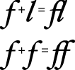

In general, the font contains all of the information needed to determine when your application should use the appropriate contextual forms and ligatures. If your application allows alternate forms of glyphs to be used, ATSUI does the substitution for you.

The _text area_ is the space on the display device in which text you want to display should fit. The left, right, top, and bottom sides of that area are the _margins_. How you arrange the text depends on the effect you want to achieve. There are two primary methods of arranging text: alignment and justification. _Alignment_ (also called flushness) is the process of placing text in relation to one or both margins. Figure 1-16 shows left, right, and center alignment of text. _Justification_ is the process of typographically stretching or shrinking a line of text to fit within a given width. Your application can set the width of the space in which the line of text should appear. ATSUI then distributes the white space available on the line between words or even between glyphs, depending on the level of justification chosen.

There are other means of aligning or justifying a line—for example, stretching a glyph or decomposing a ligature. ATSUI can also handle complex justification such as that used in Arabic writing systems.

__Figure 1-16__  Left, center, and right text alignment (or flushness)

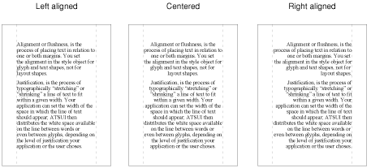

_Kerning_ is an adjustment to the normal spacing between two or more specific glyphs. A _kerning pair_ consists of two adjacent glyphs such that the position of the second glyph is changed with respect to the first. The font designer determines which glyphs participate in kerning and in what context. Any adjustments to glyph positions are specified relative to the point size of the glyphs. Kerning usually improves the apparent letter-spacing between glyphs that fit together naturally.

Figure 1-17 shows how glyphs are positioned differently with and without kerning. Note that the phrase is shorter when kerning is applied than when it is not applied.

__Figure 1-17__  Glyphs with and without kerning

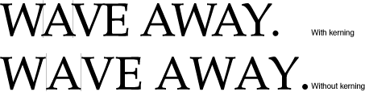

_Cross-stream kerning_ allows the automatic movement of glyphs perpendicular to the line orientation of the text. For example, when ATSUI applies cross-stream kerning to horizontal text, the automatic movement is vertical; this feature is required for writing systems such as Taliq, which is used in the Urdu language.

When your application lays out text, it has the option of using the interglyph spacing specified by the font designer or altering the spacing slightly in order to achieve a tighter fit between letters and improve the look of a line of text.

Your application can also use tracking if it has been specified by the font designer. In _tracking_, space is adjusted between all glyphs in the run. You can increase or decrease interglyph spacing by using a _tracking setting_, which is a value that specifies the relative tightness or looseness of interglyph spacing. Positive tracking settings result in an increase in the looseness of all glyphs in the run. Negative tracking settings result in a increase in the tightness of all glyphs. Normal tracking, tight tracking, and loose tracking are shown in Figure 1-18.

__Figure 1-18__  Tracking settings for normal, tight, and loose tracking

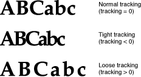

Some special features are available in certain fonts. You can increase the control a user has over the presentation of text in a document if you provide access to these features when they are available in a font. The font provides the functionality for using these features. Table 1-1 shows some of the currently defined features. See [Font Features](Font%20Features.md#apple-f4xwc4dqnrsv64tfmyxwi33df52wszbpkridgmbqgaydamzvfvkfami) for a more complete list.

__Table 1-1__  Special font features

| Feature | Description |
| Ligatures | Permits selection from different ranges of ligatures. |
| Cursive connections | Controls the level of cursive connection in the font. This feature is used in fonts, such as cursive Roman fonts or Arabic fonts, in which glyphs are connected to each other. See [Figure B-2](Font%20Features.md#apple-f4xwc4dqnrsv64tfmyxwi33df52wszbpkridgmbqgaydamzvfvkfawcsivddenrx) for an example. |
| Vertical substitution | Specifies that glyphs need to change their appearance in vertical runs of text. [Figure B-23](Font%20Features.md#apple-f4xwc4dqnrsv64tfmyxwi33df52wszbpkridgmbqgaydamzvfvkfawcsivddenry) shows how a vertical form of a glyph can be substituted for a horizontal form. |
| Smart swashes | A _swash_ is a variation, often ornamental, of an existing glyph. The smart swash feature controls contextual swash substitution, such as substituting a final glyph when a particular glyph appears at the end of a word. See [Figure B-19](Font%20Features.md#apple-f4xwc4dqnrsv64tfmyxwi33df52wszbpkridgmbqgaydamzvfvbegskfjfbeqrq) for an example of swashes. |
| Vertical position | Controls superscripts, subscripts, and ordinal forms. See [Figure B-22](Font%20Features.md#apple-f4xwc4dqnrsv64tfmyxwi33df52wszbpkridgmbqgaydamzvfvbeeq2kjjcuura) for an example of vertical positions. |
| Fractions | Governs selection and generation of fractions. See [Figure B-8](Font%20Features.md#apple-f4xwc4dqnrsv64tfmyxwi33df52wszbpkridgmbqgaydamzvfvkfawcsivddenzt) for examples of how fractions can be drawn. |
| Overlapping glyphs | Prevents the collision of long tails on glyphs with the descenders of other glyphs. See [Figure B-17](Font%20Features.md#apple-f4xwc4dqnrsv64tfmyxwi33df52wszbpkridgmbqgaydamzvfvbegskhijbumsq) for an example. |
| Typographical extras | Allows fine typographic effects, such as the automatic conversion of two adjacent hyphens to an em dash. |
| Ornament sets | Governs nonletter ornament sets of glyphs. See [Figure B-16](Font%20Features.md#apple-f4xwc4dqnrsv64tfmyxwi33df52wszbpkridgmbqgaydamzvfvbegskhjfeukqq) for an example of ornamental glyphs. |
| Style options | Allows the font designer to group together collections of noncontextual substitutions into named sets. |
| Character shape | Specifies the use, with Chinese fonts, of the traditional or simplified character forms. See [Figure B-4](Font%20Features.md#apple-f4xwc4dqnrsv64tfmyxwi33df52wszbpkridgmbqgaydamzvfvbegskjifeeiri) for an example. |

Some of these features, such as typographic extras, are fancy elements that provide the user with alternate forms of glyphs or other ornamental designs. Other features are contextual and absolutely necessary for using that font correctly—for example, cursive connectors for Arabic. Fonts that require these features include them, whereas optional elements are included at the discretion of the font designer.

Your application determines how wide the text area for a line should be. At times, a user enters a line of text that does not fit neatly in the given text area and overlaps one of the margins. When this happens, you break the line of text and wrap the text onto the next line.

Figure 1-19 shows a line break made on the basis of a simple algorithm: The application backs up in the source text to the trailing edge of the last white space and then carries over all of the text following that white space to the next line.

__Figure 1-19__  Text width and line breaking

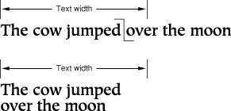

Your application can devise more complex algorithms, such as breaking a word at an appropriate hyphenation point, if possible. ATSUI leaves the final decision about where to break the line up to your application. However, ATSUI provides you with functions designed to help you determine the best place to break a line. For more information, see [Breaking Lines](Basic%20Tasks-%20Working%20With%20Objects%20and%20Drawing%20Text.md#apple-f4xwc4dqnrsv64tfmyxwi33df52wszbpkridgmbqgaydamzqfvkfawcsivddcnjz) and [Flowing Text Around a Graphic](Basic%20Tasks-%20Working%20With%20Objects%20and%20Drawing%20Text.md#apple-f4xwc4dqnrsv64tfmyxwi33df52wszbpkridgmbqgaydamzqfvkfawcsivddcmzz).

In some cases there may not be a glyph defined for a character code in a font. Your application can specify a search order for ATSUI to use when trying to locate a replacement glyph. If ATSUI cannot find any suitable replacement, it recommends substituting a glyph from the Last Resort font. The _Last Resort_ font is a collection of glyphs that represent types of Unicode characters. If the font cannot represent a particular Unicode character, the appropriate "missing" glyph from the Last Resort font is used instead. For more information on font substitution, see [Using Font Fallback Objects](Advanced%20Tasks-%20Substituting%20Fonts%20and%20Modifying%20Layouts.md#apple-f4xwc4dqnrsv64tfmyxwi33df52wszbpkridgmbqgaydamzsfvkfawcsivddcmzy).

When the user places a pointer over a line of text and presses and releases a mouse button, the user expects that mouse click to produce a caret at the corresponding onscreen position. Similarly, when the user drags the mouse while pressing and holding the mouse button, the user expects the selected text to be highlighted. In each case, your application must recognize and respond to mouse events appropriately. This section discusses caret positioning, highlighting, and conversion of screen position to text offset in memory.

A caret position is a location on the screen that corresponds to an insertion point in memory. It lets the user know where in the text file the next insertion (or deletion) will occur. A caret position is always between glyphs on the screen, usually on the leading edge of one glyph and the trailing edge of another. The leading edge of a glyph is the edge that is encountered first when reading text of that glyph’s script system; the trailing edge is opposite from the leading edge. In left-to-right text, a glyph’s leading edge is its left edge; in right-to-left text, a glyph’s leading edge is its right edge.

In most situations for most text applications, the caret position is on the leading edge of the glyph corresponding to the character at the insertion point in memory, as shown in Figure 1-20. When a new character is inserted, it displaces the character at the insertion point, shifting it and all subsequent characters in the buffer forward by one character position.

__Figure 1-20__  Caret position and insertion point

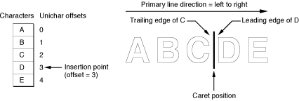

The caret position is unambiguous in text with a single line direction. In such a case, the caret position is on the trailing and leading edges of characters that are contiguous in the text buffer; it thus corresponds directly to a single offset in the buffer. This is not always the case in bidirectional text.

In determining caret position, an ambiguous case occurs at direction boundaries because the offset in memory can map to two different glyph positions on the screen—one for the text in each line direction. In Figure 1-21, for example, the insertion point is at offset 3 in the buffer. If the next character to be inserted is Arabic, the caret should be drawn at position 3 on the screen; if the next character is English, the caret should be drawn at caret position 12.

__Figure 1-21__  Caret positions at direction boundaries

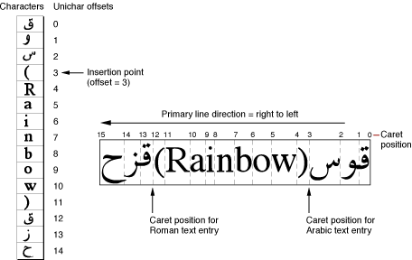

The Mac OS codifies this relationship between text offset and caret position as follows:

- For any given offset in memory, there are two potential caret positions:

  - the leading edge of the glyph corresponding to the character at that offset
  - the trailing edge of the glyph corresponding to the previous (in memory) character
- In unidirectional text, the two caret positions coincide: the leading edge of the glyph for one character is at the same location as the trailing edge of the glyph for the previous character. In [Figure 1-20](#apple-f4xwc4dqnrsv64tfmyxwi33df52wszbpkridgmbqgaydamryfvbecssgizeuksi), the offset of 3 yields caret positions on the leading edge of “D” and the trailing edge of “C”, which are the same unambiguous location.
- At a boundary between text of opposite directions, the two caret positions do not coincide. Thus, in Figure 1-21, for an offset of 3 there are two caret positions: 12 and 3. Likewise, an offset of 12 yields two caret positions (also 12 and 3, but on the edges of two different glyphs).

At an ambiguous character offset, the current line direction (the presumed direction of the next character to be inserted) determines which caret position is the correct one:

- If the current direction equals the direction of the character at that offset, the caret position is the leading edge of that character’s glyph. In Figure 1-21, if Roman text is to be inserted at offset 3 (occupied by a Roman character), the caret position is on the leading edge of that character’s glyph—that is, at caret position 12.
- If the current direction equals the direction of the previous (in memory) character, the screen position is on the trailing edge of the glyph corresponding to that previous (in memory) character. In Figure 1-21, if Arabic text is to be inserted at offset 3, the caret position is on the trailing edge of the glyph of the character at offset 2—that is, at caret position 3.

Two common approaches for drawing the caret at direction boundaries involve the use of a dual caret and a single caret. A _dual caret_ consists of two lines, a high caret and a low caret, each measuring half the text height (see Figure 1-22). The high caret is displayed at the primary caret position for the insertion point; the low caret is displayed at the secondary caret position for that insertion point. Which position is primary, and which is secondary, depends on the primary line direction:

- The primary caret position is the screen location associated with the glyph that has the same direction as the primary line direction. If the current line direction corresponds to the primary line direction, inserted text will appear at the primary caret position. A primary caret is a caret drawn at the primary caret position.
- The secondary caret position is the screen location associated with the glyph that has a different direction from the primary line direction. If the current line direction is opposite to the primary line direction, inserted text will appear at the secondary caret position. In Figure 1-22, the display of the Roman keyboard icon shows that the current line direction is not the same as the primary line direction, so the next character inserted will appear at the secondary caret position. A secondary caret is a caret drawn at the secondary caret position.

__Figure 1-22__  Dual caret at direction boundaries in mixed-directional text

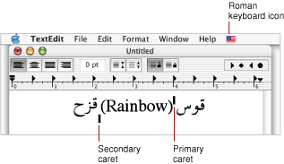

A single caret (or moving caret) is simpler than a dual caret (see Figure 1-23). It is a single, full-length caret that appears at the screen location where the next glyph will appear. At direction boundaries, its position depends on the keyboard script. At a direction boundary, the caret appears at the primary caret position if the current line direction corresponds to the primary line direction; it appears at the secondary caret position if the current line direction is opposite to the primary line direction. The moving caret is also called a jumping caret because its position jumps between the primary and secondary caret positions as the user switches the keyboard script between the two text directions represented.

__Figure 1-23__  Single carets at direction boundaries in mixed-directional text

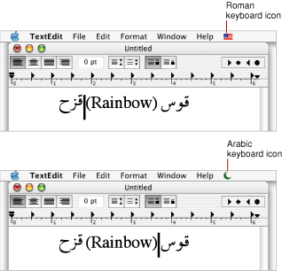

When you place a caret between glyphs, you need to be able to relate the caret to the insertion point: a point between `Unichar` offsets in the source text. The _edge offset_ is a `Unichar` offset between character codes in the source text that corresponds to the caret location between glyphs. In [Figure 1-20](#apple-f4xwc4dqnrsv64tfmyxwi33df52wszbpkridgmbqgaydamryfvbecssgizeuksi), the edge offset is 3.

When displaying a selection range, an application typically marks it by _highlighting_, drawing the glyphs in inverse video or with a colored or outlined background. As part of its text-display tasks, your application is responsible for knowing what the selection range is and highlighting it properly, as well as for making the necessary changes in memory that result from any cutting, pasting, or editing operations involving the selection range. Figure 1-24 shows highlighting for a selection range in unidirectional text.

__Figure 1-24__  Highlighting a selection range in unidirectional text

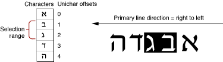

The Mac OS measures the limits of highlighting rectangles in terms of caret position. Thus, in Figure 1-24, in which the selection range consists of the characters at offsets 1 and 2 in memory, the ends of the highlighting rectangle correspond to caret positions for offsets 1 and 3. It’s equivalent to saying that the highlighting extends from the leading edge of the glyph for the character at offset 1 to the leading edge of the glyph for the character at offset 3.

If the displayed text has bidirectional runs, the selection range may appear as discontinuous highlighted text. This is because the characters that make up the selection range are always contiguous in memory, but characters that are contiguous in memory may not be contiguous onscreen. Figure 1-25 is an example of text whose selection range consists of a contiguous sequence of characters in memory, whereas the highlighted glyphs are displayed discontinuously.

__Figure 1-25__  Highlighting a selection range in bidirectional text

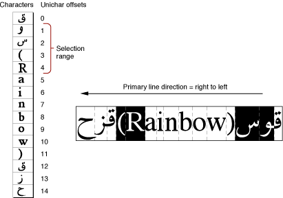

In describing the boundaries of the highlighting rectangles in terms of caret position, note that for Figure 1-25, it is not possible to simply say that the highlighting extends from the caret position of offset 2 to the caret position of offset 6. Using the definitions of caret position given earlier, however, it is possible to define the selection range as two separate rectangles, one extending from offset 4 to offset 2, and another extending from offset 12 to offset 6 (assuming for the ambiguous offsets—4 and 12—that the current text direction equals the primary line direction).

Caret positioning and highlighting, as just discussed, require conversion from text offset to screen position. But that is only half the picture; it is just as necessary to be able to convert from screen position to text offset. For example, if the user clicks the cursor within your displayed text, you need to be able to determine the offset in your text buffer equivalent to that mouse-down event. _Hit-testing_ is the process of obtaining the location of an event relative to the position of onscreen glyphs and to the corresponding offset between character codes in memory. You can use the location information obtained from hit-testing to set the insertion point (that is, the caret) or selection range (highlighting).

ATSUI does most of this work for you. It provides functions that convert a screen position to a memory offset (and vice versa). These functions work properly with bidirectional text and with text that has been rendered with ligatures and contextual forms.

Determining the character associated with a screen position requires first defining the caret position associated with a given screen position. Once that is done, the previously defined relationship between caret position and text offset can be used to find the character.

Figure 1-26 shows the cursor positioned within a line of text at the moment of a mouse click. A mouse-down event can occur anywhere within the area of a glyph, but the caret position that is to be derived from that event must be a thin line that falls between two glyphs.

__Figure 1-26__  Interpreting caret position from a mouse-down event

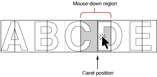

A line of displayed glyphs is divided by ATSUI into a series of mouse-down regions. A mouse-down region is the screen area within which any mouse click yields the same caret position. For example, a mouse click that occurs anywhere between the leading edge of a glyph and the center of that glyph results in a caret position at the leading edge of that glyph. For unidirectional text, mouse-down regions extend from the center of one glyph to the center of the next glyph (except at the ends of a line), as Figure 1-26 shows. A mouse click anywhere within the region results in a caret position between the two glyphs.

At line ends, and at the boundaries between text of different line directions, mouse-down regions are smaller and interpreting them is more complex. As Figure 1-27 shows, the mouse-down regions at direction boundaries extend only from the leading or trailing edges of the bounding glyphs to their centers. Note that the shaded part of Figure 1-26 is a single mouse-down region, whereas each of the shaded parts of Figure 1-27 are two mouse-down regions.

__Figure 1-27__  Mouse-down regions and caret positions in bidirectional text

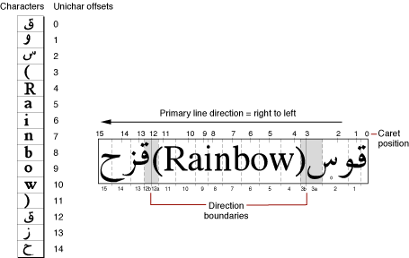

How do mouse-down regions relate to offsets? Using Figure 1-27 as an example, consider the two mouse-down regions 3a and 12a. Keep in mind that the primary line direction is right to left.

- A mouse click within region 3a is associated with the trailing edge of the Arabic character. To insert Arabic text, your application might draw a primary caret (or single caret) at caret position 3, and place the insertion point at offset 3 in the buffer. (If you are drawing a dual caret, the secondary caret should be at caret position 12, which also corresponds to an insertion point at offset 4 in the buffer.)
- A mouse click within region 12a is associated with the leading edge of the Roman character. To insert Roman text, your application might, draw a secondary caret (or single caret) at caret position 12, and place the insertion point at offset 3 in the buffer. (If you are drawing a dual caret, the primary caret should be at caret position 3, which also corresponds to an insertion point at offset 3 in the buffer.)

Thus mouse clicks in two widely separated areas of the screen can lead to an identical caret display and to a single insertion point in the text buffer. One, however, permits insertion of Roman text, the other Arabic text, and the insertions occur at different screen locations. 

Mouse clicks in regions 3b and 12b in Figure 1-27 would lead to just the opposite situation: a primary caret at caret position 12, a secondary caret at caret position 3, and an insertion point at offset 12 in the text buffer.

[Next](ATSUI%20Style%20and%20Text%20Layout%20Objects.md)[Previous](Introduction%20to%20ATSUI%20Programming%20Guide.md)

