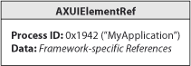

> 导航：[总目录](../../../README.md) · [documentation](../../../_indexes/documentation.md) · [Accessibility Programming Guidelines for Carbon](Introduction%20to%20Accessibility%20Programming%20Guidelines%20for%20Carbon.md)

[Next](Making%20a%20Standard%20Carbon%20Application%20Accessible.md)[Previous](Introduction%20to%20Accessibility%20Programming%20Guidelines%20for%20Carbon.md)

# Accessibility and the Carbon Framework

The Mac OS X accessibility architecture defines the model that applications follow to make themselves accessible to assistive applications and technologies. The model is not tied to any one application framework, so each framework is free to implement accessibility support in the most natural and efficient way.

This chapter describes how the Carbon framework implements accessibility for Carbon applications in Mac OS X. If your application uses only standard HIObject objects and subclasses to implement its user interface, you should skim this chapter for background information before you read [Making a Standard Carbon Application Accessible](Making%20a%20Standard%20Carbon%20Application%20Accessible.md#apple-f4xwc4dqnrsv64tfmyxwi33df52wszbpkridgmbqgaytcmrxfvbuqmrqgywviucykjcummjqge).

If you implement some custom subclasses of HIObject or if your application is based on a custom application framework (such as PowerPlant), you should read this chapter to enhance your understanding of the Carbon accessibility implementation. Then, you should read [Making a Semistandard Carbon Application Accessible](Making%20a%20Semistandard%20Carbon%20Application%20Accessible.md#apple-f4xwc4dqnrsv64tfmyxwi33df52wszbpkridgmbqgaytcmrxfvbuqmrrgawviucykjcummjqge) or [Making a Custom Carbon Application Accessible](Making%20a%20Custom%20Carbon%20Application%20Accessible.md#apple-f4xwc4dqnrsv64tfmyxwi33df52wszbpkridgmbqgaytcmrxfvbuqmrrgewviucykjcummjqge) to learn how to access-enable your application.

If you’re unfamiliar with the Mac OS X accessibility model or you’re unsure why your application should be accessible, read _[Accessibility Programming Guide for OS X](https://developer.apple.com/library/archive/documentation/Accessibility/Conceptual/AccessibilityMacOSX/index.html#//apple_ref/doc/uid/TP40001078)_ for an introduction to accessibility in Mac OS X.

As described in _[Accessibility Programming Guide for OS X](https://developer.apple.com/library/archive/documentation/Accessibility/Conceptual/AccessibilityMacOSX/index.html#//apple_ref/doc/uid/TP40001078)_, the Mac OS X accessibility architecture models the user interface of an accessible application as a hierarchy of accessibility objects. Each of these objects represents an accessible user interface object in the application, such as a button or a window. The accessibility object provides information about itself (such as its capabilities, position in the accessibility hierarchy, and a localizable description) to assistive applications. An assistive application uses this information to tell the user about the application’s features, help the user navigate, and perform the application’s functions.

The following sections describe the basics of the Carbon implementation of an accessibility object. If your application implements custom subclasses of HIObject or HIView or uses a custom application framework, you should read these sections to become familiar with how Carbon defines the accessibility object.

Carbon bases its implementation of the accessibility object on the HIObject subsystem. Introduced in Mac OS X version 10.2, HIObject is the base class for all user interface objects in Carbon. If you’re unfamiliar with HIObject and its subclass HIView (the base class for all view-based controls), you should read _[Upgrading to the Mac OS X HIToolbox](../Upgrading%20to%20the%20Mac%20OS%20X%20HIToolbox/Introduction%20to%20Upgrading%20to%20the%20Mac%20OS%20X%20HIToolbox.md#apple-f4xwc4dqnrsv64tfmyxwi33df52wszbpkridgmbqgaytcnbq)_ and _[HIView Programming Guide](../HIView%20Programming%20Guide/Introduction%20to%20HIView%20Programming%20Guide.md#apple-f4xwc4dqnrsv64tfmyxwi33df52wszbpkridgmbqgaydsmrt)_.

In Carbon, an accessibility object is an `AXUIElementRef`. An `AXUIElementRef` is a Core Foundation data structure that contains two members:

- The HIObject reference of an accessible user interface object, such as a window or a button
- A 64-bit identifier that can be used to represent an accessible subcomponent of a complex user interface object, such as a window, a button, or some other object of your design

[Figure 2-1](#apple-f4xwc4dqnrsv64tfmyxwi33df52wszbpkridgmbqgaytcmrxfvbuqmrqg4wuer2ci5dumrcd) shows the structure of the accessibility object as it is implemented in Carbon.

__Figure 1-1__  The Carbon accessibility object

Carbon implements an accessibility object as a `CFTypeRef` object because this allows it to be flattened easily and sent across processes. This is important because the Carbon events that carry accessibility messages both send and receive accessibility objects. It also allows you to put accessibility objects inside another `CFTypeRef` object, such as a CFArray. An event handler does this, for example, when it responds to the request for all accessible children of a given accessibility object.

The HIObject inside the accessibility object is significant both because it represents the user interface object and because it is a target for Carbon events related to that object. Recall from _[Accessibility Programming Guide for OS X](https://developer.apple.com/library/archive/documentation/Accessibility/Conceptual/AccessibilityMacOSX/index.html#//apple_ref/doc/uid/TP40001078)_ that in Mac OS X, accessibility is message-driven. An assistive application communicates with an application by sending messages to the application’s user interface. In a Carbon application, these messages take the form of Carbon events. Because an HIObject is automatically a target for Carbon events, the accessibility object containing the HIObject is also a target. In addition, the Carbon accessibility implementation installs the accessibility-specific event handlers on all standard HIObjects and HIViews. For more information on the role of Carbon events in the Carbon accessibility implementation, see [Accessibility Carbon Events](#apple-f4xwc4dqnrsv64tfmyxwi33df52wszbpkridgmbqgaytcmrxfvbuqmrqg4wuer2cizeeossd).

The accessibility object identifier provides an efficient way for Carbon to represent the subcomponents of a complex object without needing multiple HIObjects. Consider a data browser object that displays check boxes and relevance indicators in addition to the list and column views of its data. For an assistive application to access every check box, relevance indicator, and item of data, each of these components must be represented by an accessibility object. Rather than create a separate HIObject for each accessibility object, however, Carbon uses the HIObject reference of the parent object coupled with a unique identifier for each component. By convention, an identifier with the value 0 means the accessibility object represents the object as a whole (the parent object), rather than one of the object’s components.

Because the accessibility object uses the HIObject reference of a user interface object, it is very lightweight. In addition, because the core of the accessibility object is the HIObject to which it refers, its life span can be very short. In general, an accessibility object is created, returned in an event parameter, and released. Although you could create accessibility objects and reserve them for later use, there is little to no performance penalty for creating them as needed and then releasing them.

If your application uses only standard HIObjects and subclasses in its user interface, it is unlikely that you will need to pay much attention to the value of an accessibility object’s identifier. If you override the standard event handlers on these objects, however, you may have to use the identifier to determine which child of the object a given accessibility object represents.

If you implement custom subclasses of HIObject or HIView or use a custom application framework, you can use the accessibility object identifier to represent the containment hierarchy of your complex objects in your own way. If you do this, be sure to follow the convention of giving the top-level, parent object an identifier with the value 0. Then, you can give the child objects identifiers that make sense in your implementation.

Carbon does not create an accessibility object for every standard HIObject in an application when it launches. Because accessibility is message-driven, it is not necessary to create large numbers of accessibility objects before they are required. Instead, Carbon creates an accessibility object for a user interface object only when necessary, in response to an accessibility Carbon event. This is a technique you can use if you handle events that require you to return accessibility objects for your custom subclasses of HIObject or custom user interface objects.

In general, if your application uses only HIObject and HIView objects in its user interface, you create very few accessibility objects. About the only accessibility object you have to create in a standard Carbon application is one to represent a static text title you display near a control or view. (To learn how to do this, see [Link Objects and Related Static Text Titles](Making%20a%20Standard%20Carbon%20Application%20Accessible.md#apple-f4xwc4dqnrsv64tfmyxwi33df52wszbpkridgmbqgaytcmrxfvbuqmrqgywugsceinceeqsg).) If you implement custom subviews or other user interface objects, however, you must create accessibility objects for them when an assistive application needs to access them.

When you create an accessibility object, you use the `AXUIElementCreateWithHIObjectAndIdentifier` function (defined in `CarbonEvents.h`). This function requires an HIObject reference and an identifier and it returns a reference to the accessibility object. Note that because Carbon implements the accessibility object as a `CFTypeRef` object, the normal Core Foundation semantics apply. In particular, you must use `CFRelease` to dispose of the accessibility object when it is no longer needed.

If your application uses a custom application framework, your user interface objects probably are not implemented as HIObjects. When you create an accessibility object for such an object, you first instantiate an HIObject wrapper for it and then create the accessibility object. For more information on how to do this, see [Making a Custom Carbon Application Accessible](Making%20a%20Custom%20Carbon%20Application%20Accessible.md#apple-f4xwc4dqnrsv64tfmyxwi33df52wszbpkridgmbqgaytcmrxfvbuqmrrgewviucykjcummjqge).

When Carbon creates an accessibility object to represent a given HIObject or HIView, it also provides some default values for the required attributes, based on the type of the object. It does this in response to a Carbon event requesting the value of a given attribute. For a button, for example, Carbon can supply values for attributes such as the role, the size, and the view that contains the button. Carbon gets most of this information from the object implementation, but context-specific attribute values must be supplied by the application.

The most important attribute value an application supplies is the accessibility object’s description. Carbon cannot supply the value of a description attribute, because it is specific to the way an application uses an object. If your application contains a print button, for example, and you do not supply a description, an assistive application can tell a user only that the object is a button, not that it is a print button.

If your application uses only standard HIObject and HIView objects, there are only a few attribute values you must supply. For the most part, these attributes describe the layout and specific features of your application. To learn how to supply these values, see [Making a Standard Carbon Application Accessible](Making%20a%20Standard%20Carbon%20Application%20Accessible.md#apple-f4xwc4dqnrsv64tfmyxwi33df52wszbpkridgmbqgaytcmrxfvbuqmrqgywviucykjcummjqge).

When you create an accessibility object for a custom object, you must supply additional attribute values. Because the set of required and optional attributes is largely dictated by the role of the accessibility object, the first thing you have to do is determine what role the accessibility object should have. It is best to leverage the existing accessibility protocol and choose one of the roles Apple defines to describe the new accessibility object. For more information about the set of roles and the attributes associated with them, see the appendix “Roles and Associated Attributes” in _[Accessibility Programming Guide for OS X](https://developer.apple.com/library/archive/documentation/Accessibility/Conceptual/AccessibilityMacOSX/index.html#//apple_ref/doc/uid/TP40001078)_.

In Mac OS X version 10.3, the Carbon accessibility implementation introduced parameterized accessibility object attributes. A parameterized attribute is a special attribute that allows an assistive application to access individual parts of an accessibility object.

Used mainly for objects that contain user-entered text, a parameterized attribute can refer to something as specific as a particular line within an editable text area. Unless your application handles complex, editable text areas, you probably do not need to use parameterized attributes.

As described in _[Accessibility Programming Guide for OS X](https://developer.apple.com/library/archive/documentation/Accessibility/Conceptual/AccessibilityMacOSX/index.html#//apple_ref/doc/uid/TP40001078)_, an application can simplify its accessibility hierarchy by designating selected accessibility objects as ignored. In general, these accessibility objects represent implementation-specific parts of the user interface that a user does not access. Because an assistive application is interested in only accessible objects, ignored objects are not included in the accessibility hierarchy an assistive application sees. It’s worthwhile to identify accessibility objects that should be ignored because doing so streamlines the user interface.

Carbon provides the `HIObjectSetAccessibilityIgnored` function (defined in `HIObject.h`) you can use to adjust the ignored status of an accessibility object. This function requires an accessibility object and a Boolean value that indicates whether or not the accessibility object should be ignored. This function sets the ignored status of the passed-in accessibility object alone; it does not touch the accessibility object’s descendents. If you want an accessibility object’s descendents to be ignored as well, you must call this function on each of them. By default, a newly created accessibility object is not ignored.

It’s important to note that an accessibility object’s ignored status is not something your application needs to take into account during its normal processing. In particular, you should continue to return accessibility objects when appropriate, regardless of their ignored status. For example, if you handle an event that requests an accessibility object’s child, you return that child whether or not it is ignored. The Carbon accessibility implementation automatically removes ignored accessibility objects from the accessibility hierarchy it presents to assistive applications.

In `CarbonEvents.h`, Carbon defines ten accessibility Carbon events of the event class `kEventClassAccessibility`. An accessible application responds to these events, giving assistive applications information about specific accessibility objects and performing requested actions.

The following sections give you an overview of the accessibility Carbon events and describe the part they play in accessibility. For reference documentation on these events, see _[Carbon Accessibility Reference](https://developer.apple.com/documentation/applicationservices/carbon_accessibility)_. If you’re unfamiliar with the Carbon event mechanism, you should read _[Carbon Event Manager Programming Guide](../Carbon%20Event%20Manager%20Programming%20Guide/Introduction%20to%20Carbon%20Event%20Manager%20Programming%20Guide.md#apple-f4xwc4dqnrsv64tfmyxwi33df52wszbpkridgmbqgaydsobz)_ for an introduction.

If you use only standard HIObject and HIView objects in your application’s user interface and you’re using Mac OS X version 10.4 or later, you probably do not have to create any custom accessibility event handlers. This is because, as described in [The Carbon Implementation of the Accessibility Object](#apple-f4xwc4dqnrsv64tfmyxwi33df52wszbpkridgmbqgaytcmrxfvbuqmrqg4wuer2cjjeuoqsj), Carbon automatically installs the necessary event handlers on standard HIObjects and HIViews. However, if you implement any custom user interface objects (or subviews) or if you need to handle an event in a nonstandard way, you should read this section to learn about the events you might have to handle.

In addition, all developers should read [Providing Attribute Values Without Event Handlers](#apple-f4xwc4dqnrsv64tfmyxwi33df52wszbpkridgmbqgaytcmrxfvbuqmrqg4wuer2cizcuissg). This section describes how a new function introduced in Mac OS X version 10.4 allows you to set selected accessibility object attribute values without having to create custom event handlers.

Carbon supports automatic runtime data conversion of accessibility event parameters. For example, in response to a request for the value of an accessibility object’s position attribute, you can return an `HIPoint` type value. Carbon automatically converts this value into the expected `kAXValueCGPointType` value.

This allows you to handle values in the best way for your application without worrying about how the Carbon accessibility implementation uses them.

The parent-child relationships among accessibility objects define an application’s accessibility hierarchy. As described in _[Accessibility Programming Guide for OS X](https://developer.apple.com/library/archive/documentation/Accessibility/Conceptual/AccessibilityMacOSX/index.html#//apple_ref/doc/uid/TP40001078)_, an assistive application views your application through its accessibility hierarchy. It is therefore essential that all accessible objects in your application appear in their proper positions in the application’s accessibility hierarchy.

The accessibility hierarchy is based on the containment hierarchies defined by the user interface objects. For a Carbon application, this means the containment hierarchies of HIObject and HIView objects. The default HIView subsystem can accurately represent an HIView’s containment hierarchy as long as all subviews of the view are also HIViews. The handlers Carbon installs on these objects automatically supply the appropriate accessibility hierarchy information. If you do not implement any custom subviews (and you do not redefine any parent-child relationships), you do not have to provide your own handlers for the accessibility hierarchy events.

Two of the accessibility hierarchy-based events concern hit-testing and keyboard focus:

- `kEventAccessibleGetChildAtPoint`
- `kEventAccessibleGetFocusedChild`

The hit-testing event, `kEventAccessibleGetChildAtPoint`, contains an accessibility object and a global screen point. Standard HIObjects and HIViews automatically handle this event by returning the accessibility object’s immediate child accessibility object that contains the point (if one exists).

An assistive application sends the keyboard-focus event, `kEventAccessibleGetFocusedChild`, to find the focused child of the given accessibility object. The default handler determines if an immediate child of the accessibility object is in the focus chain. If such a child exists, the handler returns it.

Both these events might seem to encourage recursive hit-testing and focus-testing on the part of the handler receiving the event, but this not the case. The Carbon accessibility implementation performs the necessary recursion, so it is important that the handlers for these events do not also perform recursive testing.

Carbon does not define a separate event an assistive application can use to get the accessible parent or children of an accessibility object. Instead, an assistive application sends the `kEventAccessibleGetNamedAttribute` event, specifying the parent or children attribute. Standard HIObject and HIView handlers return the requested value, which an assistive application can use to traverse the accessibility hierarchy. For more information about this event, see [Attribute Events](#apple-f4xwc4dqnrsv64tfmyxwi33df52wszbpkridgmbqgaytcmrxfvbuqmrqg4wuer2circeircb).

Carbon defines three accessibility action events:

- `kEventAccessibleGetAllActionNames`
- `kEventAccessibleGetNamedActionDescription`
- `kEventAccessiblePerformNamedAction`

An assistive application must be able to drive an application’s user interface just as a user does with the mouse or keyboard. As part of this process, an assistive application sends the `kEventAccessibleGetAllActionNames` event to discover which actions an accessibility object can perform. The handler for this event adds the names of the object’s supported actions to the array contained in one of the event parameters.

Some assistive applications need to speak the name of an action to the user. When this is the case, the assistive application sends the `kEventAccessibleGetNamedActionDescription` event. Even though the name of this event contains the word “Description”, don’t confuse this with an accessibility object’s description attribute. Whereas the description attribute is an application-specific description of the accessibility object’s purpose, the action description is simply its human-intelligible, localizable name. The `AXActionConstants.h` file defines the Mac OS X accessibility actions, along with their names. If you need to supply an event handler for this event, you must supply the action description value. See [Handle Action Events](Making%20a%20Semistandard%20Carbon%20Application%20Accessible.md#apple-f4xwc4dqnrsv64tfmyxwi33df52wszbpkridgmbqgaytcmrxfvbuqmrrgawuessfindukqse) for information on how to do this.

An assistive application sends the `kEventAccessiblePerformNamedAction` event to transmit the user’s request to perform an action. The handler for this event makes sure the accessibility object supports this event and, if so, tells the application to perform it.

An assistive application relies on an accessibility object’s attribute values to tell it how to handle the object the accessibility object represents. An assistive application may also set the values of some attributes in response to a user’s actions. Carbon defines five accessibility events that allow an assistive application to query, get, and set attribute names and values:

- `kEventAccessibleIsNamedAttributeSettable`
- `kEventAccessibleGetAllAttributeNames`
- `kEventAccessibleGetAllParameterizedAttributeNames`
- `kEventAccessibleGetNamedAttribute`
- `kEventAccessibleSetNamedAttribute`

An assistive application sends the `kEventAccessibleIsNamedAttributeSettable` event to find out if the given attribute value is settable. Settable attribute values are those that can change dynamically while the application runs. An example of a settable attribute is the value attribute of an editable text field.

If you provide an event handler to return an attribute’s value, you must also provide a handler for the `kEventAccessibleIsNamedAttributeSettable` event. Your handler returns the settability of the specific attribute for which you provide a value. This way, you ensure that an assistive application gets the correct information about this attribute, instead of relying on the default handler to provide it.

An assistive application uses the `kEventAccessibleGetAllAttributeNames` event to request the names of all an accessibility object’s attributes _except_ parameterized attributes. To request the names of parameterized attributes, an assistive application sends the `kEventAccessibleGetAllParameterizedAttributeNames` event. The handlers for both events return an array of attribute names, represented as CFStrings.

When an assistive application needs to get the value of a specific attribute, it sends the `kEventAccessibleGetNamedAttribute` event. The handler for this event returns the value of the specified attribute, whether or not it is a parameterized attribute.

In versions of Mac OS X prior to 10.4, the only way to provide application-specific values of accessibility object attributes is to install a custom handler that provides those values. For example, to provide the value of an accessibility object’s description attribute, you install a handler that returns to the `kEventAccessibleGetNamedAttribute` event a CFString containing the description.

Mac OS X version 10.4 introduced the `HIObjectSetAuxiliaryAccessibilityAttribute` function (defined in `HIObject.h`) that you can use in place of an event handler to provide values for static, unsettable attributes. An attribute value is settable if a user (through an assistive application) can directly change it, such as the selected text attribute of an editable text field object. A good way to think of this is, if an attribute helps describe the layout of your user interface, such as a description or a title, its value is probably static and unsettable.

When you use the `HIObjectSetAuxiliaryAccessibilityAttribute` function to set attribute values, it holds those values in a store that the HIObject event handler at the bottom of the handler stack can consult. When no higher-level handlers can handle the `kEventAccessibleGetNamedAttribute` event for a specific attribute, the event passes to the HIObject handler, which consults the store for the requested attribute value. This scheme gives you the flexibility to set some attribute values as your application launches and others by installing custom handlers.

It’s important to note that you don’t have to use this function to set the values of static attributes. Depending on other accessibility-related tasks you perform, it might be more efficient to install event handlers to provide these values, even if you’re developing in Mac OS X version 10.4.

As described in _[Accessibility Programming Guide for OS X](https://developer.apple.com/library/archive/documentation/Accessibility/Conceptual/AccessibilityMacOSX/index.html#//apple_ref/doc/uid/TP40001078)_, an accessibility object can broadcast notifications about changes in its state. Assistive applications register for these notifications so they can keep track of the creation, change in value, and destruction of accessibility objects.

The Carbon accessibility implementation defines many notifications in `AXNotificationConstants.h` (in the HIServices framework). It also defines the `AXNotificationHIObjectNotify` function you use to send notifications for an accessibility object. If your application uses only standard, noncustom HIObjects and HIViews, all necessary notifications are sent for you. If, on the other hand, you implement custom user interface classes and, consequently, create accessibility objects to represent them, you have to send your own notifications. This is particularly important for the value-change notifications. If you implement a complex user interface object (one that has its own children), only you know which child view’s value has changed. For more information on sending notifications, see [Making a Semistandard Carbon Application Accessible](Making%20a%20Semistandard%20Carbon%20Application%20Accessible.md#apple-f4xwc4dqnrsv64tfmyxwi33df52wszbpkridgmbqgaytcmrxfvbuqmrrgawviucykjcummjqge).

In Mac OS X version 10.4, Apple introduced VoiceOver, a state-of-the-art, built-in screen reading interface to the Macintosh. Users can activate VoiceOver from System Preferences (in the Universal Access pane) or by pressing Command-F5. VoiceOver is a prime example of an assistive application that uses the accessibility information your application provides to present a verbal picture of your application to the user.

When using VoiceOver, the Option and Control keys are considered VoiceOver control keys. VoiceOver does not hide the use of these keys when it is telling an application to perform an action, such as open a document or push a button. This is not a problem unless an application uses the `GetCurrentEventKeyModifiers` function to discover which modifier keys are in an event. Contrary to its name, the `GetCurrentEventKeyModifiers` function returns the modifiers that were in the _last_ user event that reached the application. It does not return the modifiers that are used at the time the event is being processed. If your application uses this function while VoiceOver is running, it will interpret the Option key as a modifier of the primary key, instead of as the VoiceOver trigger. This is wrong and will result in behavior the user does not desire.

If your application uses the `GetCurrentEventKeyModifiers` function, you should replace it with code that extracts the desired information from the event parameter. This will allow you to discover the modifiers used in key-down and mouse-down events without impairing the accessibility of your application.

[Next](Making%20a%20Standard%20Carbon%20Application%20Accessible.md)[Previous](Introduction%20to%20Accessibility%20Programming%20Guidelines%20for%20Carbon.md)

