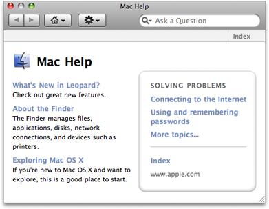
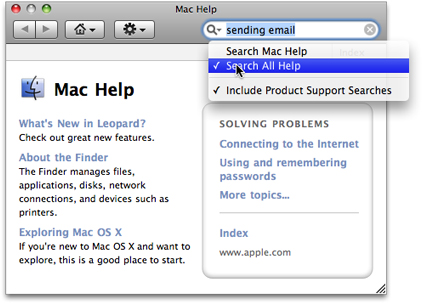
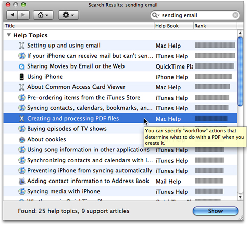
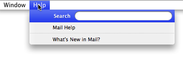
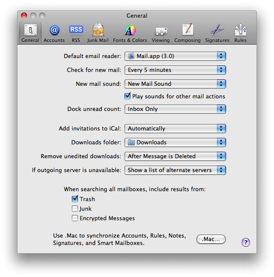

> 导航：[总目录](../../../README.md) · [documentation](../../../_indexes/documentation.md) · [Apple Help Programming Guide](Introduction%20to%20Apple%20Help%20Programming%20Guide.md)

[Next](Authoring%20Apple%20Help.md)[Previous](Introduction%20to%20Apple%20Help%20Programming%20Guide.md)

# Apple Help Concepts

This chapter introduces the Help Viewer application and the Apple Help application programming interface. It describes the Help Viewer interface, how Help Viewer displays your help book, and how users access help from your application. All Carbon, Cocoa, and Java developers authoring user help for a Mac app should be familiar with the concepts presented here.

Users view online help in Help Viewer, a browser-like application designed to display HTML help content. Help Viewer displays files adhering to the HTML 4.01 specification.

Users typically launch Help Viewer by choosing the application help item from the Help menu, or by typing a query in the Spotlight For Help text field in the Help menu (see [How Users Access Your Help](#apple-f4xwc4dqnrsv64tfmyxwi33df52wszbpkridgmbqgaydsmbtfvbuqmrqguwueqkcijceissd) ). When Help Viewer launches, it brings up a window displaying help for the application from which the user requested assistance. In Figure 1-1, the Help Viewer window displays the system help book, Mac Help.

__Figure 1-1__  The Help Viewer window

There are four user interface elements in the toolbar at the top of the Help Viewer window: the Back and Forward buttons, the Home button, the Action menu button, and the search field. The Back and Forward buttons on the left side of the toolbar allow users to view their navigation history and navigate through previously visited help pages. Clicking the Home button opens the title page of the currently open help book; if the user presses this button, a menu of all the available help books appears. The Action menu provides items such as Make Text Larger (or smaller), Find (which finds text strings on the current page), and Print. The search field allows users to search all help in the current book or all help on the system—they click the magnifying glass at the left of the search field to choose which.

One of the primary advantages of Help Viewer for viewing online help is its ability to quickly and accurately search an installed set of help content. Users often arrive at online help with an idea of what they want to accomplish; help should allow them to get the information they need as quickly as possible and get on with their tasks. Especially for large help systems, searching is often the most efficient and effective way for users to obtain help.

The text entry field at the right side of the Help Viewer window’s toolbar allows users to search the available help content on the system. Users enter the term or concept for which they want to obtain help into the text field. Figure 1-2 shows a query entered in the text field of the Help Viewer window, with Search All Help selected.

__Figure 1-2__  A query entered in the search field of Help Viewer

When the user presses Return, Help Viewer searches the help books installed on the system (if the user selected Search All Help) or in the selected help book (if they selected that option) for the relevant term or terms. Help Viewer returns up to 15 help topics, sorted in order of relevance as determined by SearchKit)

Help Viewer displays the title of each relevant help topic in a table of search results, along with the help book in which that topic is found (if the user selected Search All Help). When the user moves their cursor over a topic from the search results, an abstract of the help topic appears, if available. The user can view the selected topic by clicking the topic in the search results table. Figure 1-3 shows the abstract for a help topic returned as a search result for the query entered in [Figure 1-2](#apple-f4xwc4dqnrsv64tfmyxwi33df52wszbpkridgmbqgaydsmbtfvbuqmrqguwvgvzr). For information on how to provide abstracts for help topics, see [Adding Abstracts](Authoring%20Apple%20Help.md#apple-f4xwc4dqnrsv64tfmyxwi33df52wszbpkridgmbqgaydsmbtfvbuqmrqgywugscejjeueqsj).

__Figure 1-3__  A topic abstract displayed for a search result in Help Viewer

To ensure that certain queries return the most relevant results regardless of the search term’s occurrence in the text, you can provide a list of search terms and corresponding search results to be displayed. This is referred to as _exact match_ searching. You can use an exact match search list, for example, to provide responses to search terms too short to normally be used in a search (such as “CD”), to make sure that a particular help topic is included in the responses when there are likely to be more than 15 matches to a query, or to make sure that the most relevant results receive the highest relevance rating regardless of the algorithm used to rank results. Exact match searches are described in more detail in [Setting Up Exact Match Searching](Authoring%20Apple%20Help.md#apple-f4xwc4dqnrsv64tfmyxwi33df52wszbpkridgmbqgaydsmbtfvbuqmrqgywvgvzv).

There are Apple Help–specific URLs that you can use to create links to help pages in your help book. You can create individual links to specific locations in your book, and you can generate lists of links to use for index pages or for “see also” lists at the end of help topics. See [Apple Help URLs](Apple%20Help%20URLs.md#apple-f4xwc4dqnrsv64tfmyxwi33df52wszbpkridgmbqgaydsmbtfvbuqmrrgawuer2cijduercd) for a list of these URLs and cross-references to their descriptions in this document.

To display help in Help Viewer, you must create and register a help book. A help book is the collection of HTML files that constitute your help content plus (optionally) a help index file. In addition to HTML files, help books can contain graphics, AppleScript scripts, QuickTime movies, and other resources used in the help pages. A help book can be simple or complex, depending upon the complexity of the software product it describes. In addition to any help content, a help book must contain these two items:

- A title page (also referred to as the default, landing, start, or access page). This is the XHTML page that is displayed by default when Help Viewer first opens the help book. Title pages are described in more detail in [Creating a Title Page](Authoring%20Apple%20Help.md#apple-f4xwc4dqnrsv64tfmyxwi33df52wszbpkridgmbqgaydsmbtfvbuqmrqgywugskijjcucrkg).
- An index file. For a help book to be searchable, it must have an index file. You can create index files using the Help Indexer utility, described in [Indexing Your Help Book](Authoring%20Apple%20Help.md#apple-f4xwc4dqnrsv64tfmyxwi33df52wszbpkridgmbqgaydsmbtfvbuqmrqgywugskijbdeqqkg).

All of the content referenced by your help book must reside in a single folder, although a help book folder can contain any number of subfolders. If you localize your help book, you need a folder for each language—see [Localizing Your Help Book](Authoring%20Apple%20Help.md#apple-f4xwc4dqnrsv64tfmyxwi33df52wszbpkridgmbqgaydsmbtfvbuqmrqgywuerkkjfduer2k) for more information.

When you register your help book, Help Viewer locates your help book folder, searches the folder for the title page and index file or files for your help book, and caches the location of those files. When users choose the application help item from the Help menu in your application, Help Viewer opens the title page of your help book. When users enter a search in Help Viewer, Help Viewer searches the index file in your help book and displays the relevant results in the table view shown in Search results displayed in Help Viewer.

Help Viewer supports Internet-based help book content: You can store help pages on a remote server and Help Viewer downloads them as needed. This allows you to keep your help content up to date easily and without inconvenience to your users. There are several strategies you can use to provide help:

- Internet-only: Only a small percentage of the pages are installed locally. If the Internet isn’t available, the help is not available. This strategy is used, for example, by OS X Server Help.
- Internet-primary: Most or all help pages are installed locally, but Help Viewer checks the server to determine whether a newer version of each page is available before displaying the page. If the server isn’t available, or if the page has not been updated, then the local version is used. This strategy is used by Mac Help and most Apple application help books.
- Local-primary: Local pages are used if available. If the requested page is not available locally, then Help Viewer looks for it on the remote server.

In your help book's information property list file, you specify the remote server from which Help Viewer should retrieve content. When the user opens your help book, Help Viewer loads your title page. When the user follows a link to another page, Help Viewer checks the index to see whether you specified local-primary or Internet-primary help. If you specified local-primary help, Help viewer loads the page in the local help book folder. If the page is not present in the local help folder, then Help Viewer contacts the server and downloads the page. On the other hand, if you specified Internet-primary help, Help Viewer checks first for content on your remote server and downloads the page from there. If the page is not present on the server, but is present locally, then Help Viewer loads the page from the local help book folder.

Local-primary help has the advantage of loading quickly while still allowing you to add help content by providing new topics on an Internet server. Using Internet-primary help, you can update help content at any time without requiring the user to install an updated version of the help book, while still providing a complete help book locally in case the user is not connected to a network. With Internet-only help, the user must be connected to the Internet to access help. This method is most appropriate for applications that must be connected to the Internet in order to function.

Help Viewer also supports updating indexes over the Internet.

Users access your application’s help book— and other help resources—in any of the following three ways:

- Choosing the application help item from the Help menu or typing a query into the Spotlight For Help text field in the Help menu. This is the most visible means of accessing user help, and your application must provide Help menu access to its help book. If you register your help book, the system automatically makes your help book accessible from the Help menu and automatically indexes your help book in Spotlight For Help.
- Clicking a help button. Where appropriate—for example, in a dialog requesting a user action—your application may supply a help button. Clicking this button should bring up a relevant page in your application’s user help.
- Choosing a help item from a contextual menu. If contextually relevant help exists for a part of your application’s user interface, the first item in a contextual menu should be a help item. If the user chooses the help item, your application should bring up the relevant help.

Users access your application’s help book and other help resources through the Help menu, normally the rightmost menu in the application region of the menu bar. Although your application may also provide additional means of obtaining help, such as contextual menu items or help buttons, the Help menu is the most obvious means of obtaining assistance for the majority of users. Because the Help menu is easily visible, remains in a consistent location, and is always accessible, it is the first place users go when they have a question. Help menu items are not context-sensitive.

Figure 1-4 shows the Help menu in Mail.

__Figure 1-4__  The Help menu

The Help menu is supplied by the system. If you have registered your help book, the system not only creates the Help menu, it also adds an application help menu item and opens Help Viewer to the home page of your application’s registered help book when the user chooses your application help. In OS X v10.5 and later, the user can also use the Spotlight For Help search field to search the content of your help book. When they do so and choose one of the returned search items, the system opens the appropriate page in your help file.

In addition to your application’s primary help book, you may want to include in the Help menu a few items for other help resources, such as links to support or customer service websites or tutorials.

A help button is a small round button displaying the standard help icon—a question mark. This button is available in Interface Builder.

When contextually relevant help is available, you can use a help button in a window or dialog to take users directly to the pertinent information. For example, you can use a help button in a Preferences window to take users directly to information about setting preferences for your application. The button is customarily placed in the lower-right corner of the window when there are no other buttons in that location and in the lower-left corner otherwise.

Figure 1-5 shows a typical help button, in the lower-right corner of a Mail preferences window.

__Figure 1-5__  A help button

You should use help buttons only when contextually relevant help exists for the current window or dialog. Help buttons should allow users to obtain assistance for the task at hand without searching through your help book.

When the user clicks the help button, your application should load the relevant help topic in Help Viewer, using the NSHelpManager method `openHelpAnchor:inBook:` or, for C applications, the Apple Help function `AHLookupAnchor`. See [The Apple Help Application Programming Interface](#apple-f4xwc4dqnrsv64tfmyxwi33df52wszbpkridgmbqgaydsmbtfvbuqmrqguwueqkcijceiqkd) for more information on using these API calls.

Help Viewer recognizes a number of help-specific items in the HTML file, which you can use in your help book to control how Help Viewer displays and accesses your help. These items fall into two categories:

- Metadata. Help Viewer uses this metadata to recognize your help book and determine how it should be displayed.
- Help URLs. Help Viewer handles a number of help-specific URLs, which you can use to load particular help content in Help Viewer.

Help Viewer recognizes a set of properties for the standard HTML `meta` element, which you can use to control how your help book appears in search results. You can also use these meta tags to control how your help is indexed. [Authoring Apple Help](Authoring%20Apple%20Help.md#apple-f4xwc4dqnrsv64tfmyxwi33df52wszbpkridgmbqgaydsmbtfvbuqmrqgywugskiivaucrci) describes many of these meta tags and how you can use them. For a complete list of the help-specific metadata recognized by Help Viewer, see [Table A-1](Apple%20Help%20Meta%20Tag%20Properties.md#apple-f4xwc4dqnrsv64tfmyxwi33df52wszbpkridgmbqgaydsmbtfvbuqmrqhewugscejbdecrsh).

There are several URLs, using the Help Viewer `help:` protocol, that you can use in your help book to create links to additional help content. You use the standard `a href` syntax for a source link with these help URLs. Although you can use help URLs to link to HTML help pages, you can use standard hyperlinks for that purpose as well. The main advantage of the help URLs is that they allow you to create hyperlinks that, when clicked, initiate searches in Help Viewer, run AppleScript scripts, and perform anchor lookup.

The help URLs are listed in [Table B-1](Apple%20Help%20URLs.md#apple-f4xwc4dqnrsv64tfmyxwi33df52wszbpkridgmbqgaydsmbtfvbuqmrrgawviucykjcummjqge). That table includes cross-references to discussions of these URLs in this document.

To support readers with visual disabilities, the W3C document _HTML Techniques for Web Content Accessibility Guidelines 1.0_ ([http://www.w3.org/TR/2000/NOTE-WCAG10-HTML-TECHS-20001106/](http://www.w3.org/TR/2000/NOTE-WCAG10-HTML-TECHS-20001106/)) defines a `summary` attribute for the `table` element. You can use this, for example, to provide VoiceOver with a description of the relationships among cells in a table. The Help Viewer application supports the `summary` attribute.

The Apple Help application programming interface, declared in the `AppleHelp.h` header file in the Carbon framework, allows you to programmatically access and load help pages in Help Viewer. You can call this interface from Cocoa as well as Carbon applications. When users choose an item from the Help menu, click a help button, or choose Help from a contextual menu, your application must respond by displaying the appropriate help material. If this help material is in an Apple Help book, your application must open the relevant page of the help book in Help Viewer.

The Apple Help functions that open a help book in Help Viewer are listed in Table 1-1.

__Table 1-1__  Apple Help functions for accessing your help book

| Function name | Action | NSHelpManager equivalent |
| `AHLookupAnchor` | Opens your help book to the section or page identified by the given anchor. | [openHelpAnchor:inBook:](https://developer.apple.com/documentation/appkit/nshelpmanager/1500908-openhelpanchor) |
| `AHSearch` | Searches your help book for a given text string. | [findString:inBook:](https://developer.apple.com/documentation/appkit/nshelpmanager/1500904-findstring) |
| `AHGotoPage` | Opens a help book page at a known location. | none |

Whereas the `AHGotoPage` function requires that you know the full or partial path to the HTML file describing the desired help topic, `AHLookupAnchor` allows you to access a help topic with only the anchor name. In most cases, using an anchor is easier and more flexible than tracking the location of the file describing the topic. If there is not one particular topic that you wish to load in Help Viewer, you can instead use the `AHSearch` function to search your help book for all topics containing a particular string.

The Apple Help functions are described in detail in the _Apple Help Reference_. `NSHelpManager` methods are described in _[NSHelpManager Class Reference](https://developer.apple.com/documentation/appkit/nshelpmanager)_.

To learn how you can use the Apple Help functions to access your help book content from within your application, see [Opening Your Help Book in Help Viewer](Opening%20Your%20Help%20Book%20in%20Help%20Viewer.md#apple-f4xwc4dqnrsv64tfmyxwi33df52wszbpkridgmbqgaydsmbtfvbuqmrqhawugskiizaueskf).

[Next](Authoring%20Apple%20Help.md)[Previous](Introduction%20to%20Apple%20Help%20Programming%20Guide.md)

