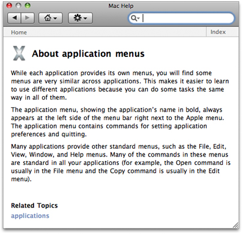
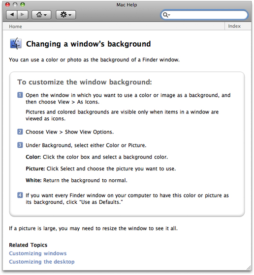
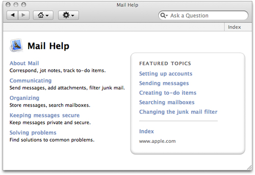
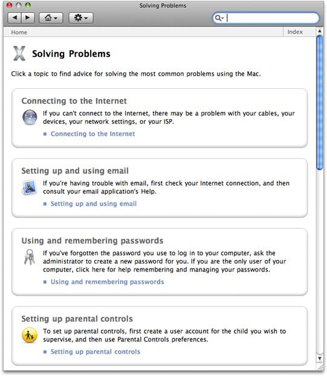
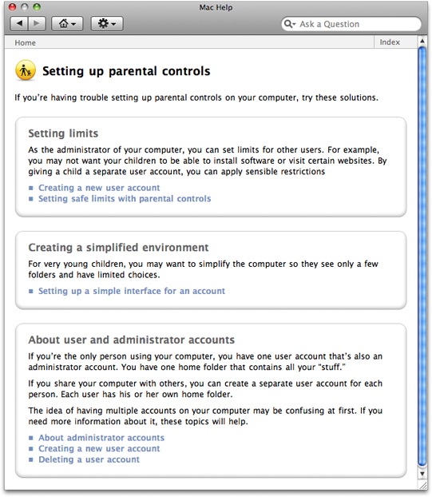
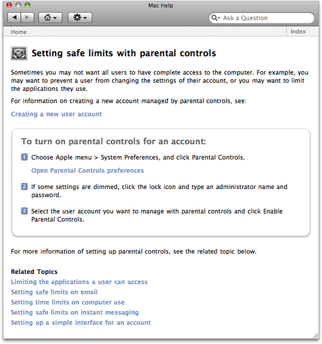
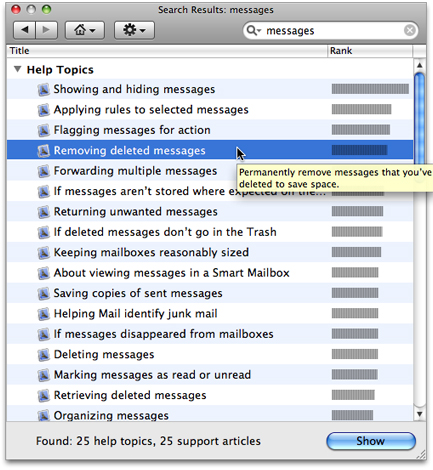
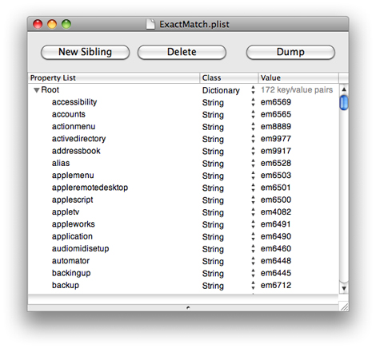
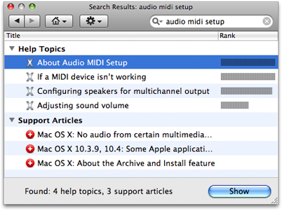

> 导航：[总目录](../../../README.md) · [documentation](../../../_indexes/documentation.md) · [Apple Help Programming Guide](Introduction%20to%20Apple%20Help%20Programming%20Guide.md)


[Next](Help%20Book%20Registration.md)[Previous](Apple%20Help%20Concepts.md)

# Authoring Apple Help

These are the basic steps for creating a help book for OS X:

1. Design the help content.
2. Author the HTML help pages.
3. Organize the help book. This includes creating the necessary auxiliary files that Help Viewer uses.
4. Index the help book.

In addition, this chapter describes how you can include additional content in your help book and how you can localize your help book for other languages.

The first steps in authoring your help book are identifying the topics your help must cover and designing a layout for presenting these topics. To this end, you may find it useful to create a topic outline. If the software product for which you are creating help already has existing documentation, you may be able to base your outline on this material. If you are creating a help book from scratch, there are a number of ways you can approach the outline. A few examples:

- Walk through the steps of the main task sequence in order. If you are writing help for a larger application, there may be several different task sequences a user would perform. For example, a productivity suite may have different task sequences for word processing, using spreadsheets, and creating presentations.
- List topics alphabetically.
- Go through each menu and menu item in the application sequentially.

Each topic should be simple enough to be described in a few short paragraphs on a single HTML page. If a topic is lengthy, you should consider breaking it up into smaller subtopics.

Here are some tips to keep in mind when designing your help book.

- Divide the information into overview information and tasks. Overview information defines terms and explains concepts important to an understanding of your software product; task information gives step-by-step directions for accomplishing a particular goal. You should generally place these two kinds of information on separate help pages to give users quick access to the information they want. You can link between pages containing overview and task information when appropriate. Avoid including “feature-oriented” pages, which describe application features but don’t tell users what they can do or how.
- Identify any information you think you’ll need to give users more than once in a help book. You can write an individual help page to cover this information and link to it from other topics in the book to avoid duplication.
- Build pages around four central questions:

  - What can users do?
  - Why do they want to do it?
  - How can they do it?
  - How can they solve problems doing it?

  Depending upon the complexity of the task, a well-designed help page may cover each of the first three questions in one or two sentences and the fourth in two or three bullet points.

After you have identified the subjects covered in your help book, you need to create HTML files for your help pages. To ensure that your help displays properly in Help Viewer, your help files should comply with the HTML 4.01 specification. Your main file—which contains the `AppleTitle` meta tag—should conform to the XHTML 1.0 specification. For a comprehensive description of the HTML 4.01 specification, see _HTML 4.01 Specification_, W3C Recommendation 24 December 1999 ([http://www.w3.org/TR/1999/REC-html401-19991224/](http://www.w3.org/TR/1999/REC-html401-19991224/)). XHTML is described in _XHTML 1.0 The Extensible HyperText Markup Language (Second Edition)_, W3C Recommendation 26 January 2000, revised 1 August 2002 ([http://www.w3.org/TR/2002/REC-xhtml1-20020801/](http://www.w3.org/TR/2002/REC-xhtml1-20020801/)).

You can author your help book in any application that generates valid HTML 4 files. Likewise, you can view your help book in any HTML 4–qualified browser; however, you should always test your help book in Help Viewer to ensure that your help book displays properly.

Each help page should cover only one topic, which can be expressed in a few short paragraphs. As mentioned in the section [Designing a Help Book](#apple-f4xwc4dqnrsv64tfmyxwi33df52wszbpkridgmbqgaydsmbtfvbuqmrqgywugskiiveekqkd), your help book may contain both overview and task information. Overview pages define terms and concepts important to your application or offer other general information that users may need to know to understand your software product. For example, the help book page shown in Figure 2-1 describes application menus.

__Figure 2-1__  A help book page containing overview information



Task pages, on the other hand, offer a step-by-step description of the actions the user must take to perform a common task in your software product. The help book page shown in Figure 2-2 describes the steps necessary to change the background of a Finder window.

__Figure 2-2__  A task-oriented help book page



Topic pages typically include these elements:

- A title identifying the topic. In [Figure 2-1](#apple-f4xwc4dqnrsv64tfmyxwi33df52wszbpkridgmbqgaydsmbtfvbuqmrqgywugskiivbuorch), “About application menus” identifies the topic and indicates that the topic is informational, not task oriented. In [Figure 2-2](#apple-f4xwc4dqnrsv64tfmyxwi33df52wszbpkridgmbqgaydsmbtfvbuqmrqgywugskijfdekq2d), “Changing a window’s background” indicates (by beginning with a verb) that the topic describes a procedure or task.
- The topic introduction. For an overview page, this section describes what the user will learn about by reading this page. For a task-oriented page, the introduction indicates what the user will accomplish by performing the task.
- Requirements for performing the task. For a task page, any conditions that must be met in order for the task to succeed should be mentioned up front, before the user begins the task. For example, if the help topic is "Burning a CD," the system requirements—such as the presence of a CD burner—for burning the CD should be mentioned here.
- The task description. These are the steps that the user must perform to accomplish the given task. Overview pages typically do not contain this information.
- The topic wrap-up. This includes any information the user may need in order to wrap up any task described in the page. It is also a good place to include tips, shortcuts, troubleshooting information, and links to related help topics. For example, the last paragraph shown in [Figure 2-2](#apple-f4xwc4dqnrsv64tfmyxwi33df52wszbpkridgmbqgaydsmbtfvbuqmrqgywugskijfdekq2d) gives a hint the user might need in order to see a large picture in their Finder window.
- Related topics. At the end of a topic is a list of links to other topics that are related to this one and thus might be of special interest to the user.

In addition to topic pages, you may need to create navigation pages for your help book. Users should be able to find most of the information they need by searching and navigating through links in your topic pages. However, navigation pages, such as tables of content, allow users to browse your help book and navigate to topics they want to learn more about without having a particular search topic in mind. You may consider providing a table of contents at the following levels:

- Top level
- Chapter level
- Topic level

Including a table of contents on the title page, at the top level of your help book, allows the user to select a starting point within your help book. A title-page table of contents gets the user started in finding help, even if they do not quite know what they are looking for. Figure 2-3 shows the top-level table of contents for the Mail application.

__Figure 2-3__  The title-page table of contents for Mail Help



As mentioned in [Designing a Help Book](#apple-f4xwc4dqnrsv64tfmyxwi33df52wszbpkridgmbqgaydsmbtfvbuqmrqgywugskiiveekqkd), you should break complex topics with lengthy descriptions into smaller subtopics in order to keep each help topic short and focused. However, it may not be appropriate to include all of the subtopics directly in your main table of contents.

You can create navigation pages that contain links to sets of related subtopics. Figure 2-4 shows a high-level TOC page from Mac Help. If the user clicks one of the topics, a list of subtopics appears, giving information about each ([Figure 2-5](#apple-f4xwc4dqnrsv64tfmyxwi33df52wszbpkridgmbqgaydsmbtfvbuqmrqgywvgvzr)). By clicking one of those subtopics, the user can get an information or task page for that subtopic ([Figure 2-6](#apple-f4xwc4dqnrsv64tfmyxwi33df52wszbpkridgmbqgaydsmbtfvbuqmrqgywvgvzs)). Typically, this page also contains links to further information about this subtopic and to pages for related subtopics.

__Figure 2-4__  A high-level table of contents in Mac Help



__Figure 2-5__  A subtopic-level table of contents in Mac help



__Figure 2-6__  A task page for a subtopic in Mac help



After you create the HTML files containing your help content, you must organize them into a help book. To do this, create a help book folder and include the following items:

- The topic and navigation pages. These are the HTML pages that you created for your help content, as described in [Authoring Help Pages](#apple-f4xwc4dqnrsv64tfmyxwi33df52wszbpkridgmbqgaydsmbtfvbuqmrqgywugskii5eeirsk).
- A title page (also referred to as the default, landing, start, or access page). This is the XHTML file that is displayed by default when the user first opens your help book.

For an example of a help book to use as a starting point, see the files for Mail Help in `/Applications/Mail.app/Contents/Resources/English.lproj/MailHelp/`. (Note that you have to select Show Package Contents from the contextual menu to see the contents of the Mail.app bundle.)

Every help book must be enclosed in its own folder, which is in the `Resources` folder of the application bundle. The help book folder also contains a `Resources` folder. In the help books `Resources` folder, you put a folder for artwork that does not need to be localized and so is shared by all the localized versions of the help book. You then put as many localized versions of the help book as you need. At the top level of the localized help folder are the index file and the title page. The Application help bundle for the SurfWriter application would have the following structure:

- `SurfWriter.app/`

  - `Contents/`

    - `Resources/`

      - `SurfWriter.help/`

The structure of the English-language help folder for SurfWriter help would look like this:

- `SurfWriter.help/`

  - `Contents/`

    - `Info.plist`
    - `Resources/`

      - `shrd/` <shared artwork>
      - `English.lproj/`

        - `SurfWriter.html` <title page>
        - `SurfWriter.helpindex`
        - `ExactMatch.plist` <see [Setting Up Exact Match Searching](#apple-f4xwc4dqnrsv64tfmyxwi33df52wszbpkridgmbqgaydsmbtfvbuqmrqgywvgvzv)>
        - `InfoPlist.strings`<localized values for Info.plist>
        - `pgs/` <the rest of the content pages>
        - `gfx/` <localized artwork>
        - `scrpt/` <scripts>

The book’s icon and other nonlocalized graphics files are in the `shrd` folder. The `pgs` folder contains the localized HTML pages for all the help topics. The `scrpt` folder contains AppleScript and JavaScript scripts. The `sty` folder contains style sheets. Note that this is an example of a typical help folder, not a prescription for how you need to organize your help book. The index file, the title page, the exact match property list file (if any—see [Setting Up Exact Match Searching](#apple-f4xwc4dqnrsv64tfmyxwi33df52wszbpkridgmbqgaydsmbtfvbuqmrqgywvgvzv)) and the localized values (if any) for the Info.plist should be located at the top level of the help folder.

The title page is described in the next section, Creating a Title Page. Index files are discussed in [Indexing Your Help Book](#apple-f4xwc4dqnrsv64tfmyxwi33df52wszbpkridgmbqgaydsmbtfvbuqmrqgywugskijbdeqqkg). The language names for the `.lproj` folders follow the standard Apple naming scheme, as discussed in Language and Locale Designations (_[Internationalization and Localization Guide](../../Mac%20OSX/Internationalization%20and%20Localization%20Guide/About%20Internationalization%20and%20Localization.md#apple-f4xwc4dqnrsv64tfmyxwi33df52wszbpgeydambqge3tc2i)_).

The `filepath` reference in HTML `` tags to artwork in the `shrd/` folder should look like this:

On the `<accesspagename>.html` page:

```
 ../shrd/artworkname.jpg
```

On a content page in the `pgs/` or other folders:

```
../../shrd/artworkname.jpg
```


Your Apple Help bundle must have an `Info.plist` file with these keys and values (all values are of type `String`):

__Table 2-1__  Help bundle Info.plist file keys and values

| Key | Exact or sample value | Notes |
| `CFBundleDevelopmentRegion` | `en_us` | The same for all help components and localizations. |
| `CFBundleIdentifier` | `com.mycompany.surfwriter.help` | Non-localized way to refer to help book. |
| `CFBundleInfoDictionaryVersion` | `6.0` |  |
| `CFBundleName` | `SurfWriter` |  |
| `CFBundlePackageType` | `BNDL` | The same for all help components and localizations. |
| `CFBundleShortVersionString` | `1` |  |
| `CFBundleSignature` | `hbwr` | The same for all help components and localizations. |
| `CFBundleVersion` | `1` | Version of the content of the help book. |
| `HPDBookAccessPath` | `SurfWriter.html` | Path to the title page. |
| `HPDBookIconPath` | `shrd/SurfIcn.png` | Path to icon relative to Resources. |
| `HPDBookIndexPath` | `SurfWriter.helpindex` | Path to index file relative to the lproj. |
| `HPDBookKBProduct` | `surfwriter1` | KB tag code to identify the product. |
| `HPDBookRemoteURL` | `https:`  `//help.mycompany.com/`  `snowleopard/com.mycompany.`  `surfwriter.help/r1/` | URL to remote content. |
| `HPDBookTitle` | `SurfWriter Help` | Displays title in menu, title bar. Localized string must be included in `InfoPlist.strings` file. |
| `HPDBookType` | `3` | Help book type version number. |

The title page is your help book’s default page, which appears when the user opens your help book by choosing the application help item from the Help menu in your application. The title page introduces your help book and serves as the entry point into the rest of your help content. All help books registered with the Help Viewer must have a title page.

There are many ways you can approach designing the title page for your help book. For example, the title page from Mac Help, the system help book, has a link to a help page that describes the new features in the current version of OS X, a link to a page that introduces the capabilities of the system, and offers a number of links to help pages answering common queries to get the reader started.

[Figure 2-3](#apple-f4xwc4dqnrsv64tfmyxwi33df52wszbpkridgmbqgaydsmbtfvbuqmrqgywugskijffessce) shows the title page for Mail Help.

To help users quickly find the information they need to accomplish their tasks, you should make your help book searchable by running the `hiutil(1)` command.

You should also include additional tags and metadata in your HTML help files to control how your help is indexed. Including this information improves the user experience of searching your help book by increasing the relevance of the results returned for searches of your help book and improving their appearance in Help Viewer. Controlling Indexing of Your Help describes how you can improve indexing and searching of your help book.

There are a number of tags that you can include in your HTML pages to control how your help content is indexed, such as:

- _Keywords_. Keywords allow you to specify synonyms or common misspellings for a help topic, ensuring that users who search on these alternate terms still get a hit on the relevant topic.
- _Abstracts_. An abstract is a brief summary of a help topic that is displayed when the user places the cursor over the topic in a list of search results. Users can determine whether they wish to learn more about the topic without actually loading the topic page.
- _Anchors_. Anchors allow you to uniquely identify a topic or section within a page. Anchors help you provide quick access to help content; you can specify an anchor as the destination of a link or use the Apple Help API to search for and display the content identified by an anchor.

Finally, you can specify which content in your help book should be indexed, as described in [Specifying What Is Indexed](#apple-f4xwc4dqnrsv64tfmyxwi33df52wszbpkridgmbqgaydsmbtfvbuqmrqgywugskiineugr2j). By using these various elements in your help book, you can greatly improve the search results for your help book and make your help book more easily accessible from your application.

Keywords are a set of additional search terms for an HTML help page. When a user searches your help book for a term that is designated as a keyword for a topic page, Help Viewer returns that page as a search result, even though the term may not appear in the body of the page. Using keywords, you can specify a set of synonyms and common misspellings for topics covered in your help book.

You can specify keywords for a help page using the `keywords` meta tag in the header of the help page’s HTML file. The following example shows keywords that you could set for a help page that describes how to use the Trash:

```
<head>
<title>Deleting Files</title>
<meta name="KEYWORDS" content="discard, dispose, delete, clear, erase">
</head>
```

Do not add keywords for terms that already occur on the page. Repeating a keyword that already appears on the page can cause the page to be given an incorrectly high relevance rating when Help Viewer returns it in response to a user’s query.

An abstract is a brief description of a help topic that appears when the user places the mouse cursor over that topic in a list of search results.

Well-written abstracts help users ascertain whether a given page, returned as a search result, in fact contains the information they were searching for. For example, SurfWriter Help contains a page describing how to import files from other formats. The page’s title, “Importing Files,” gives the user some idea of the page’s contents, but you can provide a fuller description by using an abstract phrase such as, “SurfWriter can import files of the following formats: txt, rtf, pages, and doc.”

To add an abstract to a help page, use the `description` meta tag in the header section of the page’s HTML file. Here is an example of how to create such an abstract:

```
<head>
<title>Removing deleted messages</title>
<meta name="description" content="Permanently remove messages that you've deleted to save space.">
</head>
```

`“Example of a search result showing an abstract”` shows how such a page and its abstract show up as a search result.

__Figure 2-7__  Example of a search result showing an abstract



Anchors allow you to uniquely identify topics in your help book. When a user follows a link to an anchor, Help Viewer loads the page containing the anchor. If your link includes the specific file containing the anchor (such as `SurfScript.html#anchor1`), Help Viewer scrolls to the anchor location (if it is not at the top of the page). For example, assume that SurfWriter has a simple scripting language called SurfScript. In the help page for SurfScript, you could specify a unique anchor for each SurfScript command, enabling Help Viewer to scroll directly to the desired text when the page loads.

If you use multiple files for your help book, you can put an anchor at the beginning of each file and direct links to the anchors so that you don’t have to know the final locations of the help files when you code your HTML. To do so, you use the `help:anchor` URL provided by Apple Help in your link (see [Creating a Link to an Anchor Location](#apple-f4xwc4dqnrsv64tfmyxwi33df52wszbpkridgmbqgaydsmbtfvbuqmrqgywviucykjcummjrgi)).

You can also use anchors to load an anchored page from within your application by calling the the NSHelpManager method `openHelpAnchor:inBook:` or, for C applications, the Apple Help function `AHLookupAnchor`. To continue the example, SurfWriter could provide an online lookup function that loads the help page for a SurfScript command by calling the `openHelpAnchor:inBook:` method and passing the appropriate anchor name when a user Option-clicks a command name in a SurfScript document.

If you need to access your help content programmatically—as you would, for example, if you provide contextually sensitive help—you should consider using anchors to make your help easily accessible from your application. Because you can change the location of anchors within your help book without affecting your product’s code, anchors provide a simple and maintainable way for your application to access specific topics within your help book.

You specify an anchor using the standard HTML 4 anchor element, as shown in the following example, which creates an anchor called `SurfScriptCommand_OPEN` in a help page describing SurfScript’s `OPEN` command:

```
<a name="SurfScriptCommand_OPEN"></a>
<!-- Here is the description of SurfScript’s OPEN command -->
```

You link to an anchor by using an HTML anchor element and a `help:anchor` URL:

```
<a href="help:anchor=SurfCmnd_OPEN bookID=com.mycompany.surfwriter.help">Open command</a>
```

The `NSAlert`, `SFChooseIdentityPanel`, `SFCertificatePanel` classes provide help buttons for dialogs. To display such a help button and link it to an anchor in your help book, use the methods `setShowsHelp:` and `setHelpAnchor:` in those classes. See _[NSAlert Class Reference](https://developer.apple.com/documentation/appkit/nsalert)_, _[SFChooseIdentityPanel Class Reference](https://developer.apple.com/documentation/securityinterface/sfchooseidentitypanel)_, and _[SFCertificatePanel Class Reference](https://developer.apple.com/documentation/securityinterface/sfcertificatepanel)_ for details.

By default, each file in your help book is fully indexed. You can use the `ROBOTS` meta tag in the HTML header of a particular file to control how that file is indexed. The `ROBOTS` meta tag supports the values shown in Table 2-2.

__Table 2-2__  Values of the `ROBOTS` meta tag

| Value | Meaning |
| `NOINDEX` | Specifies that the HTML file should not be indexed. |
| `KEYWORDS` | Specifies that the HTML file should be indexed for keywords only. |
| `ANCHORS` | Specifies that the HTML file should be indexed for anchors only. |

Apple recommends that you do not index a page that contains only links or graphics, or a page on which you don’t want the user to land as a result of a search. For example, if you have a sequence of pages that are linked in a series, you might only want to index the first page in the sequence. To specify that a file should not be indexed, use the `ROBOTS` meta tag with the value `NOINDEX` as shown in the following example:

```
<meta name="ROBOTS" content="NOINDEX">
```

Specify `KEYWORDS` as the value of the `ROBOTS` meta tag if you want the indexer to pick up only your specified keywords for use as search results. The `ANCHORS` value is useful for pages which you want to be able to retrieve using anchor lookup, but which are not useful as search results, such as your title page.

Help Viewer can also download updated index files from a remote server. If you specified a remote URL in your help book's Info.plist file, Help Viewer contacts the server and checks for an index file at that location. If an index file is present, and if it is newer than the locally stored index, then Help Viewer downloads the file.

You can control how long your help pages are cached, using the two meta tags shown below:

```
<meta http-equiv="Expires" content="Tue, 01 Jan 1980 1:00:00 GMT">
<meta http-equiv="Pragma" content="no-cache">
```

The first example sets a specific expiration date for the cached page. A 24-hour clock is used, and the time zone is included when specifying a particular expiration date. The second example tells Help Viewer that the file should never be cached.

You can enrich the user experience of your help book by including additional resources such as animated tutorials, scripted tasks, and other multimedia content supported by Help Viewer. This section shows you how to:

- Initiate Help Viewer searches from a link in your help book
- Link to anchors in your help book

When you include an `http://` link in your help book HTML, Help Viewer ordinarily opens the link in the user’s default web browser. You can use the `target="_helpViewer"` attribute to cause the link to open in the Help Viewer window instead. For example, you can use a link of this sort to open a page on your customer service website in Help Viewer, making it appear to the user as if it’s part of your help book.

The URLs using the Help Viewer `help:` protocol, introduced in [Help URLs](Apple%20Help%20Concepts.md#apple-f4xwc4dqnrsv64tfmyxwi33df52wszbpkridgmbqgaydsmbtfvbuqmrqguwviucykjcummjqgq), allow you to access other help content, including:

- Initiating Help Viewer searches
- Jumping to anchor locations
- Opening other help books

The `help:search` URL allows you to create a link in your help book that, when clicked by the user, initiates a search for a particular term or phrase. This is particularly useful for linking to further information about subjects that appear in multiple help pages. Rather than link to each topic page, you can simply set up a search that will find all pages in your help book in which the subject appears. The syntax for initiating a Help Viewer search is as follows:

```
<a href="help:search='search_term' bookID=com.mycompany.myapp.help">
```

The `bookID` parameter is a string value specifying which help book Help Viewer should search. If you do not specify a book, Help Viewer searches all help books currently installed on the system.

The following example creates a link to a search for topics related to importing files in the SurfWriter help book:

```
<a href="help:search='importing files' bookID=com.mycompany.surfwriter.help">
```

The value for the book ID should be the help book ID, as defined by the `CFBundleIdentifier` key in the book’s property list file.

When the user clicks the resulting link, Help Viewer searches SurfWriter Help for all topics pertaining to importing files, just as if the user had typed the query string "importing files" into Help Viewer’s search field.

Using the `help:anchor` URL, you can create a link to any help book location identified by an anchor. It is often simpler to create links using anchors than to hardcode the path to the destination in the link, and it allows a link to be moved without having to update all the pages that point to it. The syntax for linking to an anchor location is as follows:

```
<a href="help:anchor=anchor_name bookID=com.mycompany.myapp.help">
```

The `bookID` parameter is a string value identifying the help book in which Help Viewer should search for the anchor. If no help book is specified, Help Viewer searches all of the registered help books currently on the system. The following example creates a link to the topic on opening files in SurfWriter Help:

```
<a href="help:anchor=openfile bookID=com.mycompany.surfwriter.help">
```

When the user clicks the link, Help Viewer takes the user to the location identified by the anchor named “openfile.” If more than one anchor is found matching the anchor name, Help Viewer displays all of the matching anchor locations in a search results page. To link to anchor locations in your help book, you must index your help book with anchor indexing turned on, as described in Anchor Indexing.

You can use the `help:openbook` URL to open a specified help book in Help Viewer. You can use this URL, for example, to open the help book for a related application in an application suite. The syntax for opening a help book is as follows:

```
<A HREF="help:openbook=com.mycompany.myapp.help">
```

When the user clicks the link, Help Viewer opens the title page of the specified help book. For example, to create a link that opens the SurfWriter Help book to the title page, you would include the following code in your help book:

```
<A HREF="help:openbook=com.mycompany.surfwriter.help">
```

To create a link that jumps to a particular location in a help book, see [Creating a Link to an Anchor Location](#apple-f4xwc4dqnrsv64tfmyxwi33df52wszbpkridgmbqgaydsmbtfvbuqmrqgywviucykjcummjrgi).

You can provide a list of search terms and corresponding search results. When the user enters a search term that exactly matches a term in your list, Help Viewer takes the corresponding search result from your list, gives it a relevance rating of 100%, and displays it along with other search results. You can use an exact match search list, for example, to provide responses to search terms too short to normally be used in a search (such as “CD”) or to make sure that the most relevant results receive the highest relevance rating.

To set up exact match searching, you create a property list containing the search terms and search results and place the `.plist` file inside the appropriate `.lproj` folder, along with the title page and the help book index (see [Organizing the Help Book Bundle](#apple-f4xwc4dqnrsv64tfmyxwi33df52wszbpkridgmbqgaydsmbtfvbuqmrqgywviucykjcummjqgq)). The property list contains a set of key-value pairs. All keys and values are strings. Each key is a search term, specified as all lowercase with all spaces removed. Hyphens and other punctuation marks are not allowed. Each corresponding value is an anchor ID, and each anchor can be used in any number of help book pages. When a user enters a search term, Help Viewer takes a lowercase, spaces-removed version of the search string and compares it to the keys in the exact match property list. If it finds an exact match for the entire string, Help Viewer returns every page containing the referenced anchor string, assigns it a relevance rank of 100%, adds it to the list of search results, and displays the results. Figure 2-8 shows the exact match property list from Mac Help. [Figure 2-9](#apple-f4xwc4dqnrsv64tfmyxwi33df52wszbpkridgmbqgaydsmbtfvbuqmrqgywvgvzrgu) shows the search results displayed when the user searches for one of the terms in that property list. The top items in the search results, with rankings of 100%, contain the anchor ID in the property list for that search term. It’s important to note that exact match searching does not return results from stems or partial matches. If you want exact match search results for “CD”, “CDs”, "VCD”, and “CD or DVD”, for example, you need four entries in the property list: `cd`, `cds`, `vcd`, and `cdordvd`.

__Figure 2-8__  Exact match property list



__Figure 2-9__  Search results corresponding to an exact match



If your application will be used in more than one part of the world, your help book should be localized for every relevant language, country, or cultural region where it will be used. Localizing your help book involves translating the text of your help content and customizing graphics and other resources used in your help book.

This section shows you how you can ensure that your localized help content appears correctly in Help Viewer.

For more information on internationalization and HTML, see [http://www.w3.org/International/](http://www.w3.org/International/)

For each language you support, you must provide a complete, localized help book in its own resource subdirectory within the `Resources` directory in the help bundle (see [Organizing the Help Book Bundle](#apple-f4xwc4dqnrsv64tfmyxwi33df52wszbpkridgmbqgaydsmbtfvbuqmrqgywviucykjcummjqgq)).

Each localized version of the help book must have a localized book name in the `InfoPlist.strings` file in the help bundle.

Help Viewer uses the UTF-8 character encoding exclusively.

After you have created your localized help book, you must run the Help Indexer utility on each localization of the book. The use of UTF-8 character encoding enables Help Indexer to support all languages for indexers compatible with OS X v 10.4 and later. See the manual page for `hiutil(1)` for information about the indexer utility.

[Next](Help%20Book%20Registration.md)[Previous](Apple%20Help%20Concepts.md)

