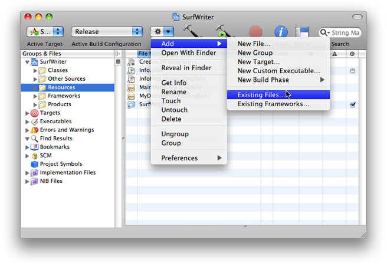
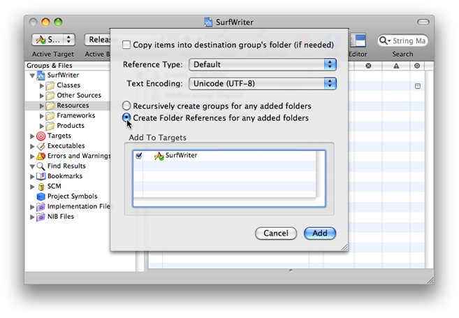
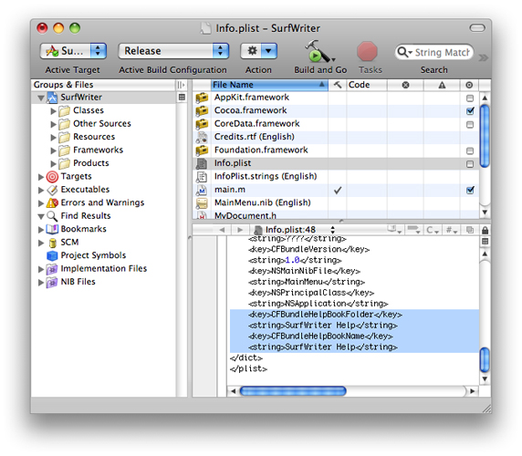

> 导航：[总目录](../../../README.md) · [documentation](../../../_indexes/documentation.md) · [Apple Help Programming Guide](Introduction%20to%20Apple%20Help%20Programming%20Guide.md)


[Next](Opening%20Your%20Help%20Book%20in%20Help%20Viewer.md)[Previous](Authoring%20Apple%20Help.md)

# Help Book Registration

When a help book has been registered, it becomes available from the application Help menu. If the help book is listed in the application’s `Info.plist` file, it is registered automatically when the user chooses application help from the Help menu or from a help button.

Starting with OS X v10.6, help books are placed directly in an application’s Resources/ folder (see [Organizing the Help Book Bundle](Authoring%20Apple%20Help.md#apple-f4xwc4dqnrsv64tfmyxwi33df52wszbpkridgmbqgaydsmbtfvbuqmrqgywviucykjcummjqgq)).

Apple strongly recommends that you place your help book in your software bundle. When your help book is bundled with your software, it is installed and moved along with your software.

You can use the following procedure to install the help folder in the `Resources` folder using Xcode:

1. In the main project window, select Resources in the Groups & Files pane.
2. From the Action menu, choose Add > Existing files (Figure 3-1).

   __Figure 3-1__  Adding help files in Xcode

   
3. Select the help bundle in the Add Files dialog and click Add.
4. Select the “Create Folder References for any added folders” radio button and click Add (Figure 3-2).

   __Figure 3-2__  Create folder references in Xcode

   

For Cocoa and Java applications, you can take advantage of automatic help book registration by adding the help book name and location to your information property list (`Info.plist`) file.

You must register your help book to get the automatic help book support provided by the system. When you register your help book, the system creates a Help menu for your application, populates it with an application help item, and opens your help book when a user chooses this item.

Cocoa and Java applications that use the Apple Help API to access their help book content must also call the `AHRegisterHelpBook` function before making any calls to other Apple Help functions.

To register a help book, you need to include the `CFBundleHelpBookFolder` and `CFBundleHelpBookName` keys in your `Info.plist` file. The `CFBundleHelpBookFolder` key identifies the help book folder; the value associated with this key should be a string specifying the folder name. For example, here is how you would enter the name of the SurfWriter help book folder:

```
<key>CFBundleHelpBookFolder</key>
<string>SurfWriter.Help</string>
```

The `CFBundleHelpBookName` key identifies the help book. The value associated with this key should be a string specifying the help book title, as defined by the `AppleTitle` tag in the title page of the book. For example, here is how you would enter the title of the SurfWriter Help book:

```
<key>CFBundleHelpBookName</key>
<string>com.mycompany.surfwriter.help</string>
```

If you are using Xcode to develop your software product, you can add these keys to your `Info.plist` file with the following steps:

1. From the main project window, select the name of the project in the Groups & Files pane.
2. Select the `Info.plist` file in the right pane
3. Add the help book folder and help book name keys to the `Info.plist` file, as shown in Figure 3-3.

   __Figure 3-3__  Editing the info.plist file in Xcode

   

For OS X v10.6 and later, both the `CFBundleHelpBookName` and `CFBundleHelpBookFolder` values must be NSStrings. Starting with OS X v10.6, the `Name` key should not be localized.

Note that your `Info.plist` file must also contain a valid `CFBundleIdentifier` entry. For more information on application packaging and property lists, see _[Bundle Programming Guide](../../Core%20Foundation/Bundle%20Programming%20Guide/Introduction.md#apple-f4xwc4dqnrsv64tfmyxwi33df52wszbpgeydambqgezdg2i)_.

Applications that call Apple Help functions must first call the Apple Help function `AHRegisterHelpBookWithURL` to register their help book. You would typically do this during application initialization. After your application has called `AHRegisterHelpBookWithURL`, your help content is accessible through the use of the Apple Help functions.

Listing 3-1 shows an example of how to register a help book using `AHRegisterHelpBookWithURL`.

__Listing 3-1__  Registering a help book with `AHRegisterHelpBookWithURL`

```
OSStatus RegisterMyHelpBook(void)
{
    CFBundleRef myApplicationBundle;
    CFURLRef myBundleURL;
    OSStatus err = noErr;

    myApplicationBundle = NULL;
    myBundleURL = NULL;

    myApplicationBundle = CFBundleGetMainBundle();// 1
    if (myApplicationBundle == NULL) {err = fnfErr; goto bail;}

    myBundleURL = CFBundleCopyBundleURL(myApplicationBundle);// 2
    if (myBundleURL == NULL) {err = fnfErr; goto bail;}

    if (err == noErr) err = AHRegisterHelpBookWithURL(myBundleURL);// 3
    return err;

}
```

Here is what the code in Listing 3-1 does:

1. Calls the Core Foundation function `CFBundleGetMainBundle` to retrieve a reference to the application’s main bundle.
2. Calls the Core Foundation function `CFBundleCopyBundleURL` to get the path to the application bundle.
3. Calls `AHRegisterHelpBookWithURL`, passing the URL obtained in the last step. Apple Help finds the help book located in the bundle and caches the name and location of the help book. Apple Help chooses which localized version of the help book to use based upon the current language of the system.

[Next](Opening%20Your%20Help%20Book%20in%20Help%20Viewer.md)[Previous](Authoring%20Apple%20Help.md)

