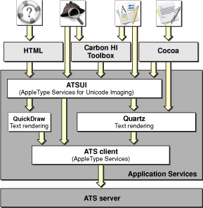
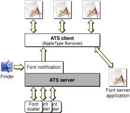
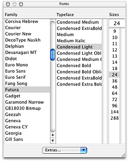
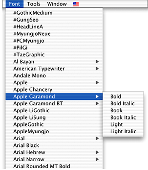

> 导航：[总目录](../../../README.md) · [documentation](../../../_indexes/documentation.md) · [Apple Type Services for Fonts Programming Guide](Apple%20Type%20Services%20for%20Fonts%20Programming%20Guide.md)

[Next](Managing%20Fonts-%20ATS%20Tasks.md)[Previous](Apple%20Type%20Services%20for%20Fonts%20Programming%20Guide.md)

# Managing Fonts: ATS Concepts

The chapter provides an overview of font services in Max OS X and information on the key concepts you need to use ATS for Fonts in your application. It assumes that you are already familiar with fonts and font data, but that you need information specific to managing fonts in Max OS X. In particular, you should be familiar with the following terminology:

- Outline and bitmap fonts
- Font naming conventions
- Type face, font families, and font family instances
- Font metrics such as point size, left-side bearing, advance width, baseline and leading

The following topics, specific to Mac OS X, are discussed in this chapter:

- Font formats and file types supported in Mac OS X
- Locations in which fonts can be installed
- The role of the ATS server in font management
- Font user interface

Figure 1-1 shows the interaction of applications with Mac OS X font services. Various applications (Cocoa, Carbon, HTML-based) communicate with the Application Services framework through the QuickDraw or Quartz frameworks. Each of these frameworks communicate with the ATS client framework. Apple Type Services for Unicode Imaging (ATSUI) communicates through the QuickDraw and Quartz subframeworks but can also call directly into the ATS client framework. The ATS client framework provides the programming interface used by developers (ATS for Fonts) and the private programming interface used by the system.

__Figure 1-1__  Applications and Mac OS X font services

The ATS client communicates directly to the ATS server, which is a separate process. The ATS server maintains the font database and performs such tasks as activating and deactivating fonts, supplying glyph outline data, and obtaining information from font tables. The ATS server is discussed in more detail in [The ATS Server, Notifications, and Queries](#apple-f4xwc4dqnrsv64tfmyxwi33df52wszbpkridgmbqgaydcmbzfvjvomy).

The font formats and file types supported for rendering, previewing, and printing documents in Mac OS X are:

- Macintosh TrueType font suitcases and data-fork (`.dfont`) suitcases. A data fork font suitcase contains the resources associated with a Macintosh font, including 'FOND' and 'NFNT' resources. The only difference is that the information is stored in a data fork rather than a resource fork. However, the data fork suitcase format is not the same as the format used for a data fork TrueType font used in the Windows OS.
- Windows TrueType (`.ttf`/`.ttc`) outline/bitmap fonts
- PostScript OpenType Roman outline/bitmap fonts
- PostScript OpenType CID Chinese, Japanese, Korean, and Vietnamese outline/bitmap fonts
- PostScript Type 1 outline font with Macintosh bitmap font suitcases (LWFN)
- Macintosh PostScript Type 1 enabled font suitcases (`'sfnt'`)
- Macintosh PostScript Type 1 CID enabled font suitcases (`'sfnt'`/CID)
- Multiple Master PostScript fonts (available starting with Mac OS X version 10.2). There are two types available—LWFN and `'sfnt'`.

See the following resources for more details:

- TrueType reference manual

  [http://developer.apple.com/fonts](https://developer.apple.com/fonts)
- The Adobe Type Technology website, for information on the OpenType specification, Multiple Master fonts, and CID-keyed fonts:

  [http://partners.adobe.com/public/developer/opentype/index.html](http://partners.adobe.com/public/developer/opentype/index.html)

Installing fonts is easy. You need only copy or move font files to any of the standard font directories of the Mac OS X file system listed in Table 1-1. The directories are arranged so that resources local to the user's computer are segregated from those on the network. On a computer, system resources are segregated from those under the control of the user or system administrator.

Fonts, applications, documents, and other resources can be installed in one of several file system domains. A _domain_ is an area of the file system segregated from other parts of the file system. A domain has structural elements identical to other domains. For example each of the domains listed in Table 1-1 has a /Library/Fonts/ directory.

Changes to the font directories are registered automatically with the operating system when an application launches or a user logs in to the account or computer on which the changes occurred. The ATS server, which maintains the font database, resolves duplicate fonts based on the order of precedence defined for the standard domains. The standard domains described in Table 1-1 are listed in the table from the highest to lowest priority.

__Table 1-1__  Standard domains and font directories

| Domain | Directory | Comment |
| User | `~/Library/Fonts/` | The User domain is specific to the user who is logged into the system and is associated with the user's home directory, which can either be on the startup volume or on the network. The user has complete control over the contents of this domain. |
| Local | `/Library/Fonts/` | The Local domain is for fonts shared among all users of a particular computer and not required by the operating system to run. Users with system administrator privileges can add, remove, and modify items in this domain, which is also the recommended location for fonts that are shared among applications. |
| Network | `/Network/Library/Fonts/` | The Network domain is for fonts shared among all users of a local area network. The contents of this domain are typically located on network file servers and are under the control of a network administrator. |
| System | `/System/Library/Fonts/` | The System domain contains the default fonts required by the operating system to run and should not be altered. |
| Classic | `System Folder: Fonts:` | The Classic domain contains the default fonts required by the Classic environment to run and should not be altered. |

The domain in which a font is placed defines the accessibility for that font. For example, if a user installs a custom font in the user domain, the font is accessible only to that user. If an administrator installs the same font in the network domain, the font is accessible to everyone on the network.

The ownership and permissions model of the file system is fundamentally different in Mac OS X than from previous releases of the operating system. This difference affects how you install and use fonts. For each file and directory in the file system there are three categories of users (owner, group, and other). For each type of user there are three specific permissions that affect access to the file or directory (read, write, and execute). When you install a font, check that the permissions of the files associated with the font are set to enable read access for the appropriate categories of users for the domain.

You can programmatically activate fonts from any directory, including the application library directory and bundle, and from an application resource fork.

The ATS server is a process that is responsible for maintaining the font database for Mac OS X. It activates and deactivates fonts, maintains and scales glyph outline data, maintains font caches, and communicates information about font availability between font clients and font utility applications. The ATS server ‘s role in font support in Mac OS X is shown in Figure 1-2.

The ATS server also handles font notifications. A _font notification_ is a message from the ATS server that informs applications of changes in the font database. The ATS server passes the font activation and deactivation information to any application that has subscribed to receive notifications. Currently, the only types of notification an application can receive are the result of a global font activation or deactivation.

Applications that subscribe to notifications receive up-to-date information about the font database. Notifications eliminate the need for an application to check generation values and to periodically enumerate fonts and font families.

__Figure 1-2__  The ATS server in Mac OS X

ATS supports the ability for ATS clients to send font queries. A _font query_ is simply a message that is generated by an application in need of font information. Currently there is only one type of query supported—a query for a missing font. A missing-font query is generated automatically whenever an application looks for a font that is not currently active. If the ATS server does not have the queried font in the font database, the server passes the font query to any application that has signed up to handle queries. Typically this is a font utility, often a faceless process, specifically designed to handle font queries. If the font utility has access to the font, the utility can activate the font using the appropriate ATS function.

The query process is opaque to the application that needs a font. Query management is handled by the ATS server. To the requesting application, activation of the needed font is automatic.

Your application can display fonts to the user by providing a Font menu or a Fonts panel. The Font menu, shown in [Figure 1-4](#apple-f4xwc4dqnrsv64tfmyxwi33df52wszbpkridgmbqgaydcmbzfvjvonq), is the user interface available in Mac OS 9. Prior to Mac OS X version 10.1, the Font menu was the only Font interface available to Carbon applications. With the release of Mac OS X version 10.2, Carbon applications can provide a Fonts panel, shown in [Figure 1-3](#apple-f4xwc4dqnrsv64tfmyxwi33df52wszbpkridgmbqgaydcmbzfvjvony). The Fonts panel was previously available only to Cocoa applications. If your application runs only in Mac OS X, you should provide a Fonts panel rather than a Font menu. The Fonts panel is the preferred user interface for Fonts.

Fonts Panel is the programming interface that provides the functions you need to support the Fonts panel. Using these functions along with Carbon events, your application can do the following:

- Show and hide the Fonts panel
- Set selections programmatically in the Fonts panel
- Obtain user selections from the Fonts panel

__Figure 1-3__  The Fonts panel

As shown in Figure 1-3, the columns in the Fonts panel improve the viewing and selection of large collections of fonts compared to the hierarchical Font menu shown in Figure 1-4. The columns provide easy access for users to select font, style, and size. The Fonts panel also supports font color, although color is not shown in Figure 1-3. See [Providing a Fonts Panel in a Carbon Application](Managing%20Fonts-%20ATS%20Tasks.md#apple-f4xwc4dqnrsv64tfmyxwi33df52wszbpkridgmbqgaydcmjqfvjvomy) for instructions and code examples on supporting a Fonts panel in your application.

__Figure 1-4__  A hierarchical Font menu

[Next](Managing%20Fonts-%20ATS%20Tasks.md)[Previous](Apple%20Type%20Services%20for%20Fonts%20Programming%20Guide.md)

