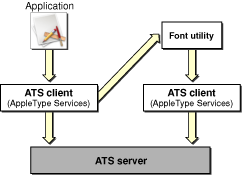
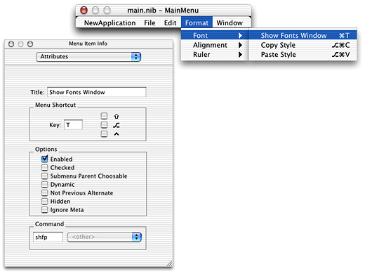
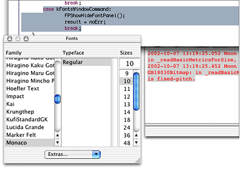
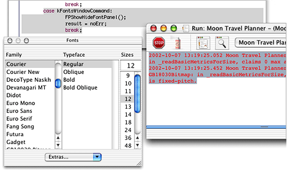

> 导航：[总目录](../../../README.md) · [documentation](../../../_indexes/documentation.md) · [Apple Type Services for Fonts Programming Guide](Apple%20Type%20Services%20for%20Fonts%20Programming%20Guide.md)


[Next](Document%20Revision%20History.md)[Previous](Managing%20Fonts-%20ATS%20Concepts.md)

# Managing Fonts: ATS Tasks

This chapter provides sample code and instructions for most of the programming tasks you can accomplish with ATS for Fonts. It also provides guidelines that you can follow to increase performance and make efficient use of memory in your application. You’ll find details in this chapter about the following tasks:

- Enumerating fonts and font families. You can restrict an enumeration by providing a filter, a context, and/or a scope.
- Activating and deactivating fonts. You can activate and deactivate fonts that are under the control of your application.
- Subscribing to notifications. Notifications allow your application to track changes in the font database, which is more efficient than polling for them.
- Notifying ATS of fonts your application activates or deactivates. The system can then make these fonts available (or unavailable) to other applications.
- Handling font queries. Font utility applications use the ATS query mechanism to provide fonts to other applications that need them.
- Supporting a Fonts panel. The Fonts panel is the preferred user interface for fonts in Mac OS X.
- Storing font information in a document. If your application stores the appropriate font information, it can retrieve the information whenever the document is opened.
- Obtaining font metrics. ATS for Fonts lets you obtain the most common font metrics, such as ascent, descent, and leading.
- Migrating data types from the Font Manager. You can convert Font Manger data types to ones that are compatible with ATS for Fonts.

There are a number of guidelines you should follow to assure optimal performance and efficient memory use when you use ATS for Fonts. This section summarizes them. The code in this chapter shows you how to apply most of the following guidelines:

- Restrict an iteration to the fonts or font families for which your application needs information. If you need to gather information about all the installed fonts, you should do so once and then cache the results because iterating over all fonts can degrade performance. See [Enumerating Font Families and Fonts](#apple-f4xwc4dqnrsv64tfmyxwi33df52wszbpkridgmbqgaydcmjqfvjvona) for more information.
- Implement the Fonts panel instead of the Font menu. Applications that run in Mac OS X should have a consistent user interface. The Fonts panel, formerly available only to Cocoa applications, is now available to Carbon applications in Mac OS X. To be consistent with Cocoa applications, Carbon applications should provide a Fonts panel. You should only provide a Font menu if your application runs in Mac OS 9. See [Providing a Fonts Panel in a Carbon Application](#apple-f4xwc4dqnrsv64tfmyxwi33df52wszbpkridgmbqgaydcmjqfvjvomy) for more information.

- Set up notifications to keep informed of changes in the font database. This lets you avoid querying the generation seed in the font database to track changes. See [Setting Up Notifications](#apple-f4xwc4dqnrsv64tfmyxwi33df52wszbpkridgmbqgaydcmjqfvjvoni) for more information.
- Avoid iterating through font tables if you can obtain the desired information by using a high-level function. For example, if you need to obtain a font name, use the function `ATSFontFamilyGetQuickDrawName`.
- Assess your application’s performance by running such tools as tops or ThreadViewer. These tools can help you to gauge how often your code triggers ATS server messaging and other behavior. You can use that information t to optimize your code.

ATS for Fonts provides several functions you can use to enumerate the fonts and font families available in Mac OS X. You can enumerate fonts and font families in the following ways:

- Create an iterator and then use the iterator from within a loop to enumerate fonts or font families. Provide your code in the loop to process the enumerated fonts or font families appropriately. See [Enumerating Font Families From Within a Loop](#apple-f4xwc4dqnrsv64tfmyxwi33df52wszbpkridgmbqgaydcmjqfvjvonq) and [Enumerating Fonts From Within a Loop](#apple-f4xwc4dqnrsv64tfmyxwi33df52wszbpkridgmbqgaydcmjqfvjvony) for more information.
- Write a customized function that can process each enumerated font or font family appropriately. Let ATS for Fonts automatically iterate through fonts or font families and apply your customized function for you. See [Enumerating Using an Applier Function](#apple-f4xwc4dqnrsv64tfmyxwi33df52wszbpkridgmbqgaydcmjqfvjvooa) for more information.

Regardless of which method you choose to enumerate fonts or font families, an enumeration is restricted by the context, filter, and scoping options applied to it.

_Context_ refers to the font’s accessibility and can be local or global. A font whose context is local can be accessed by your application. A font whose context is global can be accessed by all applications on a system.

A _filter_ consists of one or more restrictions that you define to reduce the number fonts or font families returned during an iteration. For example, you could restrict a font iteration to all those fonts that have the same manufacturer’s name.

_Scope_ refers to whether a font’s use is restricted or unrestricted. Fonts with a restricted scope can be used only by your application whereas fonts with an unrestricted scope can be used by any application.

When you specify both a context and a scope, the enumeration is constrained as shown in Table 2-1.

__Table 2-1__  The interaction of context and scope in an enumeration

|  | Local context | Global context |
| Restricted scope | Fonts activated locally to your application | Only globally activated fonts |
| Unrestricted scope | Globally activated fonts and fonts activated locally to your application. This is the default. | All fonts, which include globally activated fonts and all other fonts activated locally for an application. Font utilities typically need to know all fonts on the system. |

Listing 2-1 shows code that creates an iterator to enumerate all the font families in an application’s context. Your application would need to add code that does something with the fonts it retrieves. A detailed explanation for each numbered line of code appears following the listing.

__Listing 2-1__  Enumerating font families

```
status = ATSFontFamilyIteratorCreate ( // 1
                        kATSFontContextLocal, // 2
                        &myFontFilter // 3
                        &myRefConData // 4
                        kATSOptionFlagsUnRestrictedScope, // 5
                        &myFamilyIterator);

while (status == noErr)
{
        status = ATSFontFamilyIteratorNext (&myFamilyIterator,
                                            &myFamilyRef); // 6

        if (status == noErr)
        {
        // Add your code here to do something with font family information.
        }
        else if (status == kATSIterationScopeModified) // 7
        {
            status = ATSFontFamilyIteratorReset (
                            kATSFontContextLocal,
                            &myFontFilter
                            &myRefConData
                            kATSOptionFlagsUnrestrictedScope,
                            &myFamilyIterator);
            // Add your code here to take any actions needed because of the
            // reset operation.
        }
}
status = ATSFontFamilyIteratorRelease (&myFamilyIterator); // 8
```

Here’s what the code does:

1. Calls the function `ATSFontFamilyIteratorCreate` to create the iterator you use to enumerate font families.
2. Sets up a local context. If you want to set up a global context. use the constant `kATSFontContextGlobal`.
3. Passes a pointer to an ATS font filter. This is optional. If you do not want to apply a filter to the iteration, pass `NULL`. The ATS font filter data structure lets you specify a generation, a font family, or a callback function as a filter.
4. Passes a pointer to data needed by a font filter callback function. Pass `NULL` if you aren’t using a font filter callback or if the callback doesn’t require any data passed to it.
5. Sets up an unrestricted scope. If you want to set up a restricted scope, use the constant `kATSOptionFlagsRestrictedScope`.
6. Calls the function `ATSFontFamilyIteratorNext` to obtain the next font family in the iteration.
7. Checks to make sure the font database hasn’t been changed. If it has, resets the iterator to the start of the iteration. The result code `kATSIterationScopeModified` indicates one or more changes occurred in the font database since you started the iteration. In most cases, you should reset the iterator.
8. Releases the font family iterator. You must do this when you no longer need the iterator. If you plan to use the iterator again in your application, you can reset it rather than release it.

Listing 2-2 shows code that creates an iterator to enumerate all the fonts in an application’s context. Your application would need to add code that does something with the fonts it retrieves. Error-handling code has been omitted to make the sample function more readable. A detailed explanation for each numbered line of code appears following the listing.

__Listing 2-2__  Creating an iterator

```
status = ATSFontIteratorCreate ( // 1
                kATSFontContextGlobal,// 2
                &myFilter,// 3
                &myRefConData,// 4
                kATSOptionFlagsRestrictedScope,// 5
                &FontIterator);

while (status == noErr)
{
        status = ATSFontIteratorNext (&myFontIterator,&myFontRef)// 6
        if (status == noErr)
        {
            // Add your code here to do something with font information.
        }
        else if (status == kATSIterationScopeModified)// 7
        {
            status = ATSFontIteratorReset (
                            kATSFontContextGlobal,
                            &myFontFilter
                            &myRefConData
                            kATSOptionFlagsRestrictedScope,
                            &myFontIterator);
            // Add your code here to take any actions needed because of the
            // reset operation.
        }
}
status = ATSFontIteratorRelease (&myFontIterator);// 8
```

Here’s what the code does:

1. Calls the function `ATSFontIteratorCreate` to create the iterator you use to enumerate fonts.
2. Sets up a global context. If you want to set up a local context. use the constant `kATSFontContextLocal`.
3. Passes a pointer to an ATS font filter. This is optional. If you do not want to apply a filter to the iteration, pass `NULL`. The ATS font filter data structure lets you specify a generation, a font family, or a callback function as a filter.
4. Passes a pointer to data needed by a font filter callback function. Pass `NULL` if you aren’t using a font filter callback or if the callback doesn’t require any data passed to it.
5. Sets up a restricted scope. If you want to set up an unrestricted scope, use the constant `kATSOptionFlagsUnrestrictedScope`.
6. Calls the function `ATSFontIteratorNext` to obtain the next font in the iteration.
7. Checks to make sure the font database hasn’t been changed. If it has, resets the iterator to the start of the iteration. The result code `kATSIterationScopeModified` indicates one or more changes occurred in the font database since you started the iteration. In most cases, you should reset the iterator.
8. Releases the font iterator. You must do this when you no longer need the iterator. If you plan to use the iterator again in your application, you can reset it rather than release it.

If you want to enumerate fonts or font families that are activated locally and have an unrestricted scope, you can call the function `ATSFontApplyFunction`. This function applies the custom function you supply to each item in an enumeration. By using `ATSFontApplyFunction`, you can avoid writing a loop to iterate and process each font or font family in an enumeration.

The function `ATSFontFamilyApplyFunction` iterates only through default fonts or font families. The default includes globally activated fonts or font families and fonts or font families that are activated locally to your application. You can’t specify any other context or scope options.

The custom function you supply can perform any task appropriate to your application. Listing 2-3 shows a function that increments a counter for each valid font reference passed to the function. Your custom function can be as simple or complicated as needed.

__Listing 2-3__  A function that counts font references

```
OSStatus MyFontApplierFunction (ATSFontRef myFontRef,
                            void* myFontRefCon)
{
    OSStatus    status = noErr;

    if (myFontRef)
    {
        *(ItemCount*) myFontRefCon += 1;
    }
    else
        status = paramErr;
    return status;
}
```

Listing 2-4 shows a function that supplies the custom function from Listing 2-3 to the function `ATSFontApplyFunction`.

__Listing 2-4__  A function that uses an applier function to enumerate fonts

```
static OSStatus MyEnumerateFonts (void)
{
    OSStatus        status = noErr;

    status = ATSFontApplyFunction (MyFontApplierFunction,
                                 &myApplierRefCon);
    return status;
}
```


You can control which fonts are available to your users by activating and deactivating fonts. Fonts are activated and deactivated in groups defined by their representation in the file system in the file formats supported by ATS for fonts. Fonts must be in one of the formats listed in [Font Formats and File Types](Managing%20Fonts-%20ATS%20Concepts.md#apple-f4xwc4dqnrsv64tfmyxwi33df52wszbpkridgmbqgaydcmbzfvjvooi).

There are two ATS for Fonts functions available to activate fonts:

- `ATSFontActivateFromFileReference`. This is the preferred function for you to use in Mac OS X v10.5 and later. In earlier versions of Mac OS X, you can use `ATSFontActivateFromFileSpecification`.
- `ATSFontActivateFromMemory`. You should use this function only when you have raw TrueType data that needs to be activated.

You can deactivate any font you’ve activated with an ATS function by calling the function `ATSFontDeactivate`.

When you activate a font, you can specify a local or global context. A font whose context is local can be accessed by the local user. This includes fonts available only to the local user as well as those that can be accessed by all users on a system. A font whose context is global is one that can be accessed by all users on a system. If you do not specify a context, ATS for Fonts uses a local context by default.

In Mac OS X, font data should be stored in the data fork. If you have a font in which the data is stored in the resource fork, you can activate this font by supplying the constant `kATSOptionFlagsUseDataForkAsResourceFork` in the `iOptions` parameter of one of the ATS font activation functions.

Listing 2-5 shows how to activate a font from a file specification, and then deactivate the font. The font is activated locally. On output, the parameter `myFontcontainer` points to the activated font’s container. You need the font container to deactivate the font, as shown in the listing. A detailed explanation for each numbered line of code appears following the listing.

__Listing 2-5__  Activating and deactivating a font in Mac OS X v10.4 and earlier

```
status = ATSFontActivateFromFileSpecification (
                            &myFontFileSpec,// 1
                            kATSFontContextLocal,// 2
                            kATSFontFormatUnspecified,// 3
                            NULL,// 4
                            kATSOptionFlagsDefault,// 5
                            &myFontContainer);// 6


status = ATSFontDeactivate (myFontContainer,
                        NULL, // 7
                        kATSOptionFlagsDefault);// 8
```

Here’s what the code does:

1. Passes the file specification for the font to be activated.
2. Specifies a local context. When you use this option, the activated font is accessible only from within your application. You could also specify a global context by passing the constant `kATSFontContextGlobal`.
3. Specifies a format identifier. You should pass `kATSFontFormatUnspecified` because the system automatically determines the format of the font.
4. Passes `NULL` because this parameter is reserved for future use.
5. Passes the default options flag. If you want to activate a font directory that contains subdirectories, you must pass the option `kATSOptionFlagsProcessSubdirectories`. There are a number of other flags available for you to pass, see _Apple Type Services for Fonts Reference_ for details.
6. Passes a reference to a font container that on return points to the container that references the activated font. You need the font container to deactivate a font.
7. Passes `NULL` because this parameter is reserved for future use.
8. Passes the default options flag. If you plan to call this function a number of times to deactivate several fonts, you can pass `kATSOptionFlagsDoNotNotify`. Then, when you are done deactivating fonts, you can call the function `ATSFontNotify` to signal ATS for Fonts to notify other applications of the font deactivations. See [Notifying ATS for Fonts of Actions](#apple-f4xwc4dqnrsv64tfmyxwi33df52wszbpkridgmbqgaydcmjqfvjvomju) for more information.

Notifications are messages you can receive from ATS for Fonts that inform you of changes to the font database. Available starting in Mac OS X 10.2, notifications provide an efficient way for your application to keep up-to-date on font activations and deactivations.

Notifications aren’t sent to you automatically. Your application must subscribe to them and must supply a callback function to handle any notification you receive. Once you sign up to receive notifications, you never need to check the generation of the font database to track changes. You also don’t need to iterate periodically through fonts and font families to check for changes.

You can set up notifications in your application by following these steps:

1. Create a callback to handle the notification. Your callback can update the user interface or perform other tasks as appropriate. Your callback should look similar to the following:

```
static void MyNotificationCallback (ATSFontNotificationInfoRef Info,
                                    void * refCon)
{
    // Your code to handle the notification
    MyRefreshFontUserInterface (. . .);
}   ]
```
2. Inform ATS for Fonts to send your application notifications by calling the function `ATSFontNotificationSubscribe` and registering the callback you created as shown in the following code:

```
status = ATSFontNotificationSubscribe (
                    MyNotificationCallback,
                    kATSFontNotifyOptionDefault,
                    NULL, // iRefCon
                    &notifyRef );
```

   As of Mac OS X v10.4, the `iRefCon` parameter is an arbitrary 32-bit value specified by your application and that you want passed to your callback function. You can pass `NULL` if your callback does not need any data or if your application runs in an earlier version of Mac OS X.
3. When your application no longer needs to receive notifications, call the function `ATSFontNotificationUnsubscribe`, as follows:

```
status = ATSFontNotificationUnsubscribe (notifyRef);
```

   You must supply the notification reference you obtained when you subscribed to notifications.

If your application is a font utility or other application that manages fonts, you may need to notify ATS for Fonts of your actions by calling the function `ATSFontNotify`. Other applications can sign up to receive notifications of your actions by calling the function `ATSFontNotificationSubscribe`. When you call the function `ATSFontNotify`, ATS for Fonts notifies all subscribers of your actions.

When you call the function `ATSFontNotify` you must supply a notification action (`ATSFontNotifyAction`). If your application activates or deactivates fonts, you should pass `kATSFontNotifyActionFontsChanged`. If your application makes changes to a font directory, you should pass the constant `kATSFontNotifyActionDirectoriesChanged`. You can also optionally supply a pointer to the data you want ATS for Fonts to pass to the applications who subscribe to notifications. You can pass `NULL` if there is no data associated with your action.

It’s best to call the function `ATSFontNotify` after your application makes a batch of changes rather than calling this function after each change you make. For example, if your application calls the functions `ATSFontActivateFromFileSpecification` (Mac OS X v10.4 and earlier), `ATSFontActivateFromFileReference` (Mac OS X v10.5 and later), or `ATSFontDeactivate` multiple times to activate and deactivate fonts, you can set the `iOptions` parameter in these functions to `kATSOptionFlagsDoNotNotify` set. When you are done activating and deactivating fonts you can call the function `ATSFontNotify` with the `action` parameter set to `kATSFontNotifyActionFontsChanged`. Then ATS notifies all applications who subscribe to notifications of the changes you made.

If your application is a font utility that activates and deactivates fonts, you can register with ATS for Fonts to handle font queries. Figure 2-1 shows the path of a font query. The application asks the ATS client for a font. The ATS client passes the request to any font utility that is registered to receive queries. When the font utility finds the font, it obtains the file specification of the font, and then activates the font using the appropriate ATS function calls.

The query, activation, and notification process is opaque to the application that needs the font. The font activation appears to happen automatically because the application needing the font is not required to do anything to activate the font. Font activation occurs behind the scenes, provided the font is available to be activated somewhere on the system.

__Figure 2-1__  Font queries and the ATS server



You must do the following to set up your Carbon or Cocoa application to handle font queries:

1. Create a callback to handle any font queries sent to your application. Your callback should look similar to the following:

```
CFPropertyListRef MyQueryCallback (ATSFontQueryMessageID msgID,
                    CFPropertyListRef data,
                    void * refCon)
{
    CFPropertyListRef    reply = NULL;

    switch (msgID)
    {
        case kATSQueryActivateFontMessage:
            // Your code to parse and handle the property list data
            // passed from the query.
            reply = NULL;
    }
    return reply;
}
```

   See [Listing 2-6](#apple-f4xwc4dqnrsv64tfmyxwi33df52wszbpkridgmbqgaydcmjqfvjvomjw) for an example of a function that parses and handles the property list data passed from the query. The property list data is passed in the form of a Core Foundation dictionary (`CFDictionary`).

   This callback only handles the case of a font activation query. You would need to add cases for other types of queries should these be available in the future. Font activation queries should always return `NULL` as shown in this example.
2. Register for queries by calling the function `ATSCreateFontQueryRunLoopSource` as follows:

```
CFRunLoopSourceRef source =
            ATSCreateFontQueryRunLoopSource (0,
                                    0,
                                    MyQueryCallback,
                                    NULL);
```

   The function `ATSCreateFontQueryRunLoopSource` creates a Core Foundation run loop source reference (`CFRunLoopSourceRef`) to convey font queries from the ATS server to your font utility application
3. Add the run loop source you obtained from the function `ATSCreateFontQueryRunLoopSource` by writing code similar to the following:

```
CFRunLoopAddSource (CFRunLoopGetCurrent(),
                    source,
                    kCFRunLoopDefaultMode);
```

   The function `CFRunLoopGetCurrent` returns the run loop for the current thread. The function `CFRunLoopAddSource` adds an input source to the current run loop. The input source monitors the run loop for a font query. When it detects a font query, it invokes your callback.

In the general case, a font query is packaged as a Core Foundation property list ([CFPropertyListRef](https://developer.apple.com/documentation/corefoundation/cfpropertylistref)). A missing-font query in particular uses a Core Foundation dictionary ([CFDictionaryRef](https://developer.apple.com/documentation/corefoundation/cfdictionaryref)) that contains key-value pairs to specify the needed font. You need to obtain information from the dictionary, such as the font’s name, to determine whether you manage the font in question. You may also need to look up other values in the dictionary to determine what you must do to satisfy the query.

Listing 2-6 shows a function (`MyHandleFontRequest`) that looks for the queried font by various names. When the name is found, the function translates it to a a file specification, then calls the function `ATSFontActivateFromFileSpecification` to activate the font. A detailed explanation for each numbered line of code appears following the listing.

__Listing 2-6__  A function that handles a font query in Mac OS X v10.4 and earlier

```
void MyHandleFontRequest (CFDictionaryRef theDict)
{
    OSStatus status;
    CFStringRef theName = NULL;
    const FSSpec* fontFileSpec = NULL;
    ATSFontContainerRef = myFontContainerRef;

    if (CFDictionaryContainsKey (theDict, kATSQueryQDFamilyName)) // 1
    {
        theName = CFDictionaryGetValue (theDict, kATSQueryQDFamilyName);
        fontFileSpec = MyFindByQDFamilyName (theName );
    }
    else if (CFDictionaryContainsKey (theDict, kATSQueryFontName)) // 2
    {
        theName = CFDictionaryGetValue(theDict, kATSQueryFontName);
        fontFileSpec = MyFindByFontName (theName);
    }
    else if (CFDictionaryContainsKey (theDict,
                         kATSQueryFontPostScriptName))// 3
    {
        theName = CFDictionaryGetValue (theDict,
                                 kATSQueryFontPostScriptName);
        fontFileSpec = MyFindByPostScriptName (theName);
    }
    // If needed, you can add code to handle other query types.

    if (fontFileSpec != NULL) // 4
    {
        status = ATSFontActivateFromFileSpecification (
                                 fontFileSpec,
                                 kATSFontContextGlobal,
                                 kATSFontFormatUnspecified,
                                 NULL, NULL,
                                 myFontContainerRef);// 5
    }


}
```

Here’s what the code does:

1. Checks to see if the `CFDictionary` contains the `kATSQueryQDFamilyName` key. If the key is in the dictionary, then the code obtains the QuickDraw family name of the font and calls your function (`MyFindByQDFamilyName`) to obtain the file specification associated with the name.
2. If the name hasn’t been found yet, checks to see if the `CFDictionary` contains the `kATSQueryFontName` key. If the key is in the dictionary, then the code obtains the full name of the font and calls your function (`MyFindByFontName`) to obtain the file specification associated with the full font name.
3. If the name hasn’t been found yet, checks to see if the `CFDictionary` contains the `kATSQueryFontPostScriptName` key. If the key is in the dictionary, then the code obtains the PostScript name derived from the font's `FOND` resource or from the font’s `sfnt` name table. Then calls your function (`MyFindByPostScriptName`) to obtain the file specification associated with the PostScript font name.
4. Checks to see if a value is assigned to the font file specification.
5. Activates the file specification for the requested font. Because you are activating the font in response to a query from another applications, you need to specify a global context (`kATSFontContextGlobal`) so the font is available to all applications. You should always pass `kATSFontFormatUnspecified`, as the system automatically detects the format of the font. If you want to deactivate the font later, you must pass a font container reference (`myFontContainerRef`) and retain the container returned to you by the function `ATSFontActivateFromFileSpecification`. To deactivate the font, you pass the font container reference to the function `ATSFontDeactivate`.

In Mac OS X the Fonts panel is the preferred user interface for users to specify font family, typeface, size, and color settings for text. See [Font User Interface](Managing%20Fonts-%20ATS%20Concepts.md#apple-f4xwc4dqnrsv64tfmyxwi33df52wszbpkridgmbqgaydcmbzfvjvooa) for a detailed description and screenshot of a Fonts panel. Cocoa applications already use the Fonts panel. With the introduction of the Fonts Panel programming interface, Carbon applications can provide the Fonts panel instead of the Font menu that was used in Mac OS 9. This section shows you how to set up and handle the Carbon events that associated with a Fonts panel.

To support a Fonts panel in a Carbon application, your application must perform the following tasks:

- show and hide the Fonts panel
- handle a selection event in the Fonts panel
- programmatically set a selection in the Fonts panel
- handle a change of user focus from one document to another

Each of these tasks is described in the sections that follow.

It is your application’s responsibility to provide an interface by which the user can activate and deactivate the Fonts panel. Typically users can open the Fonts panel by choosing a Show Fonts menu item from a Format menu. The keyboard equivalent for this item should be command-T. When the Fonts panel is open, your application should change the menu item to Hide Fonts. Your may choose instead to provide a button or other mechanism to activate and deactivate the Fonts panel. What you choose to do depends on the needs of your application.

You can use Interface Builder to provide a Format menu with a Show Fonts menu item. In Interface Builder, you must type the four-character code `shfp` in the Command text field, as shown in Figure 2-2. The constant `kHICommandShowHideFontPanel` is defined by the Carbon Event Manager to be the `shfp` HI command, which is why you must provide this four-character code as the command for the Show Fonts Panel menu item. You can use Project Builder to write code that handles the `kHICommandShowHideFontPanel` command issued by the Show Fonts Panel menu item.

__Figure 2-2__  Setting the command for the Show Fonts menu item



When the user closes the Fonts panel, either by clicking on its close button or using an application-supplied human interface element (such as a Hide Fonts Panel menu item), the Fonts panel sends a Carbon event of class `kEventClassFont` and of type `kEventFontPanelClosed` to the event target your application specified in its most recent call to `SetFontInfoForSelection`. This allows your application to update any menu items or other controls whose state may need to change because the Fonts panel has closed. Your application must have a Carbon event handler installed to detect this event.

[Listing 2-7](#apple-f4xwc4dqnrsv64tfmyxwi33df52wszbpkridgmbqgaydcmjqfvjvomjx) shows an application event handler that handles the Carbon events `kHICommandShowHideFontPanel` and `kEventFontPanelClosed`. A detailed explanation for each numbered line of code appears following the listing.

__Listing 2-7__  An function that handles events related to the Fonts panel

```
pascal OSStatus MyApplicationEventHandler (EventHandlerCallRef myHandler,
                                            EventRef event, void *userData)
{
    OSStatus    status = eventNotHandledErr;
    HICommand   command;
    UInt32  eventClass;
    UInt32  eventKind;

    eventClass = GetEventClass(event);// 1

    switch (eventClass)
    {
        case kEventClassCommand:// 2
        {
                    GetEventParameter (event, kEventParamDirectObject,
                                            typeHICommand, NULL,
                                            sizeof (HICommand),
                                            NULL, &command);// 3
                    switch (command.commandID)
                    {
                        case kHICommandShowHideFontPanel:// 4
                                status = FPShowHideFontPanel();
                                if (FPIsFontPanelVisible)// 5
                                {
                                    // Your code to set the menu item to Hide Fonts

                                }
                                else
                                {
                                    // Your code to set the menu item to Show Fonts
                                }
                        break;
                    }
            break;
            }

         case kEventClassFont:// 6
         {
             eventKind  = GetEventKind (event);
             switch (eventKind)
             {
                    case kEventFontPanelClosed:// 7
                        // Your code to set the menu item to Show Fonts
                    break;
                    case kEventFontSelection:// 8
                        status = MyGetFontSelection (event);
                    break;
             }
         }
         break;
    }
    return status;
}
```

Here’s what the code does:

1. Calls the Carbon Event Manager function `GetEventClass` to obtain the event class.
2. Checks to see if the event class is a command event.
3. Calls the Carbon Event Manager function `GetEventParameter` to obtain the HI command from the event.
4. If the HI command is `kHICommandShowHideFontPanel`, calls the Fonts Panel function `FPShowHideFontPanel`. Calling the function `FPShowHideFontPanel` displays the Fonts panel if it is not currently displayed, and hides it if it is currently displayed.

   The result code `fontPanelShowErr` is returned if, for unknown reasons, the Fonts panel cannot be made visible. Specific result codes, such as `memFullErr` can also be returned

   The Fonts panel opens with the system’s default settings unless you first set the selection information by calling the Fonts Panel function `SetFontInfoForSelection`. See [Setting a Selection in the Fonts Panel](#apple-f4xwc4dqnrsv64tfmyxwi33df52wszbpkridgmbqgaydcmjqfvjvomi) for more information.
5. Calls the Fonts Panel function `FPIsFontPanelVisible` to determine if the Fonts panel is now visible. Your application should provide code to the menu item (or other user interface element) appropriately.
6. Checks to see if the event class is a font event.
7. If the event kind is a close event, you must provide code to set the menu item (or other user interface element) appropriately.
8. If the event kind is a font selection event, calls your function to handle font selection. Font selection events are discussed in [Handling a Selection Event in the Fonts Panel](#apple-f4xwc4dqnrsv64tfmyxwi33df52wszbpkridgmbqgaydcmjqfvjvomjy).

As the user selects font settings from the Fonts panel, your application receives a font-selection Carbon event (`kEventFontSelection`) from the Fonts panel. The settings selected by the user in the Fonts panel are passed as event parameters in the `kEventFontSelection` event. Your application simply extracts as many of the parameters as it can from the event and applies the font settings appropriately.

The event type `kEventFontSelection` contains parameters that reflect the current Fonts panel settings. Provided your application has a Carbon event handler installed to detect this event, it can obtain the parameters listed in [Table 2-2](#apple-f4xwc4dqnrsv64tfmyxwi33df52wszbpkridgmbqgaydcmjqfvjvomjz). [Listing 2-7](#apple-f4xwc4dqnrsv64tfmyxwi33df52wszbpkridgmbqgaydcmjqfvjvomjx) shows an application event handler that detects the event type `kEventFontSelection` and calls the function show in [Listing 2-8](#apple-f4xwc4dqnrsv64tfmyxwi33df52wszbpkridgmbqgaydcmjqfvjvomrq).

__Table 2-2__  Parameters for the event the `kEventFontSelection`

| Parameter | Type | Description |
| `kEventParamATSUFontID` | `typeATSUFontID` | Specifies the font ID of the selected font. |
| `kEventParamATSUFontSize` | `typeATSUSize` | Specifies the size of the font as a `Fixed` value. |
| `kEventParamFMFontFamily` | `typeFMFontFamily` | Specifies the font family reference of the font. |
| `kEventParamFMFontStyle` | `typeFMFontStyle` | Specifies the QuickDraw style of the font. |
| `kEventParamFMFontSize` | `typeFMFontSize` | Specifies the size of the font as an integer. |
| `kEventParamFontColor` | `typeFontColor` | Specifies the color of the text as `RGBColor`. |

The function in Listing 2-8 (`MyGetFontSelection`) obtains the font family, font style, and font size from a selection made by the user in the Fonts panel. You can just as easily extract the ATSUI font and size parameters using the parameters and types shown in Table 2-2. A detailed explanation for each numbered line of code appears following the listing.

__Listing 2-8__  A function that obtains the current selection in the Fonts panel

```
OSStatus MyGetFontSelection (EventRef event)

{
    OSStatus status = noErr;
    FMFontFamilyInstance    instance;       // 1
    FMFontSize              fontSize;

    instance.fontFamily = kInvalidFontFamily;
    instance.fontStyle = normal;
    fontSize = 0;

    status = GetEventParameter (event, kEventParamFMFontFamily,
                                    typeFMFontFamily, NULL,
                                    sizeof (instance.fontFamily),
                                    NULL, &(instance.fontFamily));// 2
    check_noerr (status);// 3

    status = GetEventParameter (event, kEventParamFMFontStyle,
                                    typeFMFontStyle, NULL,
                                    sizeof (instance.fontStyle),
                                    NULL, &(instance.fontStyle));// 4
    check_noerr (status);

    status = GetEventParameter (event, kEventParamFMFontSize,
                                    typeFMFontSize, NULL,
                                    sizeof( fontSize), NULL, &fontSize);// 5
    check_noerr (status);

    return status;
}
```

Here’s what the code does:

1. Declares and initializes variables used to get font information.
2. Calls the Carbon Event Manager function `GetEventParameter` to extract the font family parameter, passing these parameters:

   - the event
   - the event parameter name `kEventParamFMFontFamily`
   - the event parameter type
   - `NULL`, to indicate not to return the actual type of the parameter, which is not needed in this case
   - the size of the event parameter value
   - `NULL`, to indicate not to return the actual size of the parameter, which is not needed in this case
   - on output, points to the font size of the selection
3. Checks for errors before continuing. This is always something your application should do, even though, for clarity, error-checking code is sometimes omitted from the sample code in this book.
4. Calls the Carbon Event Manager function `GetEventParameter` to extract the font style parameter. Similar to the previous call to this function, passes `NULL` to indicate the actual type and size of the parameter need not be returned.
5. Calls the Carbon Event Manager function `GetEventParameter` to extract the font size parameter. Similar to the previous call to this function, passes `NULL` to indicate the actual type and size of the parameter need not be returned.

You can programmatically set a selection in the Fonts panel by calling the function `SetFontInfoForSelection`. You can call this function even when the Fonts panel is not open or visible. When the Fonts panel becomes visible later, the style information specified in the most recent call to `SetFontInfoForSelection` is selected.

[Listing 2-9](#apple-f4xwc4dqnrsv64tfmyxwi33df52wszbpkridgmbqgaydcmjqfvjvomrr) shows a function (`MySetFontSelection`) that passes an ATSUI style object (`ATSUStyle`) to the function `SetFontInfoForSelection` to set up a selection in the Fonts panel. A detailed explanation for each numbered line of code appears following the listing.

__Listing 2-9__  A function that programmatically sets a selection in the Fonts panel

```
OSStatus MySetFontSelection (WindowRef thisWindow)
{
    OSStatus            status = noErr;
    ATSUStyle           myStyle;// 1
    ATSUAttributeTag    myTags[2];
    ByteCount           mySizes[2];
    ATSUAttributeValuePtr   myValues[2];
    ATSUFontID          theFontID;
    Fixed               theFontSize;
    HIObjectRef     myHIObjectTarget;// 2

    status = ATSUCreateStyle (&myStyle);// 3
    verify_noerr (ATSUFindFontFromName ("Times Roman",
                            strlen ("Times Roman"),
                            kFontFullName, kFontNoPlatform,
                            kFontNoScript, kFontNoLanguage,
                            &theFontID) );// 4

    myTags[0] = kATSUFontTag;// 5
    mySizes[0] = sizeof (theFontID);
    myValues[0] = &theFontID;

    theFontSize = Long2Fix (36);    // 6
    myTags[1] = kATSUSizeTag;
    mySizes[1] = sizeof(theFontSize);
    myValues[1] = &theFontSize;

    verify_noerr (ATSUSetAttributes (myStyle, 2,
                            myTags, mySizes, myValues) );// 7
    myHIObjectTarget = (HIObjectRef) GetWindowEventTarget (thisWindow);  // 8
    SetFontInfoForSelection (kFontSelectionATSUIType,
                            1,
                            &myStyle,
                            myHIObjectTarget);// 9
    status = ATSUDisposeStyle (myStyle);// 10
    return status;
}
```

Here’s what the code does:

1. Declares variables necessary to set up an ATSUI style for two style attributes. Each attribute in an ATSUI style consists of three values (a triple)—an attribute tag, the value associated with the tag, and the size of the value. See _ATSUI Reference_ for a list of the style attribute tags you can supply.
2. Declares an `HIObjectRef` variable. You need to pass a value of this type to the function `SetFontInfoForSelection`. An HI object (`HIObject`) is an HI Toolbox data type; it is the base class for a variety of objects that appear in the user interface. An HI object can receive events and can have event handlers installed on it. See the HIObject reference documentation for more information:

   [http://developer.apple.com/documentation/Carbon/Reference/HIObjectReference/index.html](https://developer.apple.com/documentation/Carbon/Reference/HIObjectReference/index.html)
3. Calls the ATSUI function `ATSUCreateStyle` to create and initialize an ATSUI style object. The newly-created style object contains default values for style attributes, font features, and font variations.
4. Calls the ATSUI function `ATSUFindFontFromName` to obtain the font ID for the specified font.
5. Declares a triple (tag, size, value) for the font ID attribute.
6. Declares a triple for the font size attribute. Font size must be specified as a `Fixed` value, which is why the code calls the macro `Long2Fix` prior to assigning the font size to the `myValues` array.
7. Calls the ATSUI function `ATSUSetAttributes` to associate the font ID and font size attributes with the ATSUI style object.
8. Calls the Carbon Event Manager function `GetWindowEventTarget` to obtain the window that should be associated with the selection event. You’d typically set a selection in the Fonts panel to reflect the style selected in the active document window (or the default setting for a newly-opened document window). You need the resulting value (`EventTargetRef`), cast as an `HIObjectRef`, to pass to the function `SetFontInfoForSelection` in the next step.
9. Calls the Fonts Panel function `SetFontInfoForSelection` to set the selection in the Fonts panel with these parameters:

   - `kFontSelectionATSUIType` specifies the style is an ATSUI style and not a QuickDraw style.
   - the size of the style array.
   - a pointer to the ATSUI style object that contains the attribute information you want to set in the Fonts panel.
   - a reference to the Carbon Event Manager HI object to which subsequent Fonts panel events should be sent. This should be the window or control holding the current user focus, or the application itself. The value can change from one call to another, as the user focus shifts. If this value is `NULL`, the Fonts panel sends events to the application target as returned by the function `GetApplicationEventTarget`.
10. Calls the ATSUI function `ATSUDisposeStyle` to dispose of the `ATSUStyle` data structure. If you plan to use the same style again in your application, you don’t need to dispose of the style now. It is more efficient to reuse `ATSUStyle` data structure than to recreate them.

The _user focus_ is the part of your application's user interface toward which keyboard input is directed; it can be a window, a control, or any other user interface element. For the Fonts panel, your application needs to track user focus only for those user interface elements to which you want Fonts panel events sent.

In [Figure 2-3](#apple-f4xwc4dqnrsv64tfmyxwi33df52wszbpkridgmbqgaydcmjqfvjvomrs) the user focus is in the top window while in [Figure 2-4](#apple-f4xwc4dqnrsv64tfmyxwi33df52wszbpkridgmbqgaydcmjqfvjvomrt) the user focus is in the window on the right side. Compare the Fonts panel in one figure with the Fonts panel in the other figure. As the user focus changes, so do the selections in the Fonts panel. Your application should behave in a similar manner when the user focus changes.

__Figure 2-3__  User focus in the top window



To handle changes in the user focus, when a Carbon event target (typically a control or window) gains the focus, your application calls the Fonts Panel function `SetFontInfoForSelection`, providing the Fonts panel with style run information for the currently selected text. If the Fonts panel is visible when this function is called, its contents are updated to reflect the style run information passed to the Fonts panel.

__Figure 2-4__  User focus in the window on the right side



If the Fonts panel is not visible, there is no user-visible effect. However, the information supplied by `SetFontInfoForSelection` is saved so that when the Fonts panel becomes visible again, the correct settings are displayed. The function `SetFontInfoForSelection` also lets your application specify the event target to which Fonts panel-related Carbon events should be sent.

When the user focus shifts, the component receiving the focus calls `SetFontInfoForSelection` to register itself as the new event target (even if `iNumStyles` is still 0). The component that relinquishes focus should call the function `SetFontInfoForSelection`, specifying 0 for `iNumStyles` parameter and `NULL` for `iEventTarget` parameter. This tells the Fonts panel that its settings are to be cleared. In the case that there is not another window open to receive focus, you need to set the Fonts panel to its default settings.

For example, if your application supports multiple windows, you can install a Carbon event handler to check for window class events (`kEventClassWindow`) that are event kinds `kEventWindowFocusAcquired` and `kEventWindowFocusRelinquish`. In response to these two event kinds, you call the function `SetFontInfoForSelection`.

[Listing 2-10](#apple-f4xwc4dqnrsv64tfmyxwi33df52wszbpkridgmbqgaydcmjqfvjvomru) shows a function (`MyWindowEventHandler`) that is installed on every document window to handle user-focus events in an application. A detailed explanation for each numbered line of code appears following the listing.

__Listing 2-10__  A function that handles user-focus events

```
pascal OSStatus MyWindowEventHandler (EventHandlerCallRef myHandler,
                                        EventRef event, void * userData)
{
    OSStatus    status = eventNotHandledErr;
    UInt32      eventClass = GetEventClass (event);
    WindowRef   thisWindow = NULL;

    switch (eventClass)
    {
        case kEventClassWindow:
        {
            switch (GetEventKind (event))
            {
                case kEventWindowFocusRelinquish:// 1
                {
                    SetFontInfoForSelection (kFontSelectionATSUIType,
                                    0, NULL, NULL);// 2
                }
                break;
                case kEventWindowFocusAcquired: // 3
                {
                    status = GetEventParameter (event,
                                    kEventParamDirectObject,
                                    typeWindowRef, NULL,
                                    sizeof (WindowRef), NULL,
                                    &thisWindow);// 4
                   status = MySetFontSelection (thisWindow);// 5
                }
                break;
            }
            break;
         }
    }

    return status;
}
```

Here’s what the code does:

1. Checks for a focus-relinquish event. In this example, the settings are cleared. If there is not another window to receive focus, you should set the Fonts panel to its default settings.
2. Clears the Fonts panel settings. The constant `kFontSelectionATSUIType` specifies to use an `ATSUStyle` collection instead of QuickDraw style. When you clear the Fonts panel settings, you need to set the window target (the last parameter to the function `SetFontInfoForSelection`) to `NULL`.
3. Checks for a focus-acquired event.
4. Calls the Carbon Event Manager function `GetEventParameter` to obtain a window reference to the window that acquired the focus.
5. In the case of a focus-acquired event, the code calls a the function `MySetFontSelection` to set the font family, font style, and font size to values appropriate for the window. The `MySetFontSelection` function calls `SetFontInfoForSelection` to set the selection in the Fonts panel and set the window target to the window that acquired the focus.

   Your application would need to supply a function that sets fonts selections appropriately. For example, you may need to retrieve font settings from the document attached to the window that acquires user focus.

You may need to store font information in a document to ensure that the next time the document opens the correct fonts are used. Fonts have several names, any of which can be stored with a document and retrieved each time the document is opened, even if the document is opened on another system. The following are the different font names you can store in a document:

- font family name and style. (used by QuickDraw)
- PostScript font name. (used by Cocoa and Quartz)
- unique name (full font name plus the font manufacturer name). (Used by Multilingual Text Engine)
- full font name

Unlike font names which are part of a font’s data, data types, such as `ATSFontRef` and `ATSFontFamilyRef` represent values that are arbitrarily assigned by ATS for Fonts at system startup. These values can change when the system is restarted, so you shouldn’t use them to store font information. You can, however, use an ATS font reference (`ATSFontRef`) to obtain a font name by passing the reference to the appropriate function. You can use the following functions to obtain a font name from an ATS font reference:

- `ATSFontFamilyGetQuickDrawName` obtains the QuickDraw font family name.
- `ATSFontGetPostScriptName` obtains the PostScript name for a font.
- `ATSFontFamilyGetName` obtains the full font family name.
- `ATSFontGetName` obtains the full font name.

You can use ATS for Fonts to obtain a variety of horizontal and vertical font metrics, including the ascent, descent, and leading. You call the functions `ATSFontGetHorizontalMetrics` or `ATSFontGetVerticalMetrics` to get the measurements you need. ATS for Fonts returns the measurements in an `ATSFontMetrics` data structure. If one or more metrics are not available for a font, then the appropriate fields in the `ATSFontMetrics` data structure are set to `0`. See  _ATS for Fonts Reference_ for details on which measurements are contained in this data structure.

Calling either of the functions to get metrics is straightforward, as shown in Listing 2-11. A detailed explanation for each numbered line of code appears following the listing.

__Listing 2-11__  A function that obtains font metrics

```
OSStatus MyGetFontMetrics (ATSFontRef fontRef)
{
    OSStatus        status = noErr;
    ATSFontMetrics  horizontalMetrics,
                    verticalMetrics;

    status = ATSFontGetHorizontalMetrics (fontRef,
                                0,
                                &horizontalMetrics);// 1
    // Your code to do something with the metrics
    status = ATSFontGetVerticalMetrics(fontRef,
                                0,
                                &verticalMetrics);// 2
    // Your code to do something with the metrics

    return status;
}
```

Here’s what the code does:

1. Calls `ATSFontGetHorizontalMetrics` to obtain the horizontal metrics for the font specified by `fontRef`. The second parameter is an options flag reserved for future use, so you should pass `0`. If one or more of the horizontal metrics are not available for the font, then the appropriate fields in the `ATSFontMetrics` data structure are set to `0`.
2. Calls `ATSFontGetVerticalMetrics` to obtain the vertical metrics for the font specified by `fontRef`. The second parameter is an options flag reserved for future use, so you should pass `0`. If one or more of the vertical metrics are not available for the font, then the appropriate fields in the `ATSFontMetrics` data structure are set to `0`.

There are two sets of programming interfaces you can use in Mac OS X that you can use to manage fonts—ATS for Fonts and the Font Manager. This document focuses on using ATS for Fonts, the programming interface designed for font management in Mac OS X. The Font Manager is designed for Mac OS 9 but can be used as a compatibility path from Mac OS 9 to Mac OS X. The Font Manager is discussed in detail in _[Managing Fonts: QuickDraw](../Managing%20Fonts-%20QuickDraw/Introduction%20to%20Managing%20Fonts-%20QuickDraw.md#apple-f4xwc4dqnrsv64tfmyxwi33df52wszbpkridgmbqgaydsobs)_ and _Font Manager Reference_.

When you migrate code from the Font Manager to ATS for Fonts, keep in mind the difference between the data types used in each API. Although there are parallels between the data types used to reference fonts and font families in the two programming interfaces, the base types are different. The `ATSFontFamilyRef` data type is an opaque 32-bit value while the `FMFontFamily` data type is a signed 16-bit integer, so you should avoid type casting or implicit type promotion when working with these data types. Instead, use the conversion functions defined for the font family references by the QuickDraw framework to protect your software from any changes or differences in the way these two data types are generated.

The `FMFont` and `ATSUFontID` data types are equivalent so you can use them interchangeably with the functions provided by the Font Manager and ATSUI in the QuickDraw framework. However, you must use the functions listed in Table 2-3 to convert between Font Manager and ATS for Fonts data types. See _Font Manager Reference_ for more information on these functions.

__Table 2-3__  Functions that convert between Font Manager and ATS for Fonts data types

| Function | Data type obtained | Data type provided |
| `FMGetATSFontRefFromFont` | `ATSFontRef` | `FMFont` |
| `FMGetATSFontFamilyRefFromFontFamily` | `ATSFontFamilyRef` | `FMFontFamily` |
| `FMGetFontFromATSFontRef` | `FMFont` | `ATSFontRef` |
| `FMGetFontFamilyFromATSFontFamilyRef` | `FMFontFamily` | `ATSFontFamilyRef` |

[Next](Document%20Revision%20History.md)[Previous](Managing%20Fonts-%20ATS%20Concepts.md)

