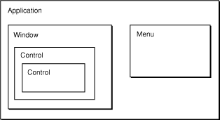
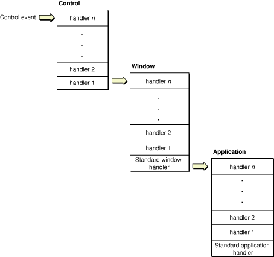
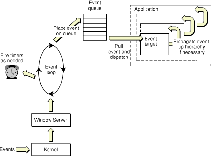
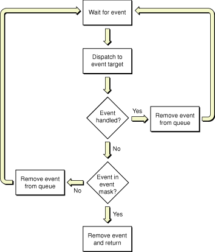

> 导航：[总目录](../../../README.md) · [documentation](../../../_indexes/documentation.md) · [Carbon Event Manager Programming Guide](Introduction%20to%20Carbon%20Event%20Manager%20Programming%20Guide.md)


[Next](Carbon%20Event%20Manager%20Tasks.md)[Previous](Introduction%20to%20Carbon%20Event%20Manager%20Programming%20Guide.md)

# Carbon Event Manager Concepts

This chapter gives an overview of the Carbon event model and how the Carbon Event Manager interacts with your application.

Carbon event processing is based on a callback mechanism. You define your program’s response to various types of event by writing _event handler_ functions and installing them in the Carbon Event Manager. Then, each time an event occurs, the Carbon Event Manager will call back the handler routine you’ve installed for that type of event. By defining how your program responds to events, the event handlers determine everything about the program’s appearance and behavior on the screen.

The heart of an event-driven application is the _main event loop_. After any required initialization, the application enters the main event loop and does not leave it until required to quit. The basic loop operation is as follows:

1. The application sits in a suspended state, waiting for an event. While in this state it uses no processor time, which means that more time is available to other running applications.
2. When an event occurs that requires its attention, the application “wakes up” and processes the event. Typically the Carbon Event Manager calls back the event handler, if any, that the application has installed for that event.
3. After processing, the application returns to its suspended state, waiting for the next event.

The main event loop continues in this manner until it receives a quit event (usually in response to the user’s choosing a Quit command from a menu). After leaving the event loop, the application calls any necessary termination routines and then quits.

Every Carbon event is characterized by an _event type_ consisting of two items of information: an _event class_ and an _event kind_. The event class denotes a general category of events, such as mouse events or window events; the event kind identifies the specific type of event within that category, such as a mouse-down event (the user pressed the mouse button) or a window-activated event (a window has been brought to the front of the screen).

Every event handler you create must be associated with a particular object called an _event target_. For example, your handler could be associated with a control, a menu, a window, or even the entire application. The event class and kind do not have to be related to the event target. For example, a handler to process a control event (such as button click) does not have to be attached to a control. You could attach it to the window that contains the control, or even the application itself. How and when your handler gets called for an event is determined by a _containment hierarchy_, as shown in Figure 1-1.

__Figure 1-1__  Event target containment hierarchy



When an event occurs, it is initially reported to the innermost relevant target in the hierarchy. For example, if the user clicks a button, the event is initially sent to that button control. If the user resizes a window, the event is sent to that window. If that target has no handler for the given event type, the event propagates outward to the next containing target. This makes it possible for an event handler associated with an inner target to override the behavior defined for a given event type by an outer, enclosing target.

For example, you can use this hierarchy to enable or disable your program’s menu items according to circumstances. This behavior is controlled via events of type `kEventCommandUpdateStatus`, which ask whether a particular item should be enabled or disabled on the menu. On receiving such an event for, say, the Close command on your program’s File menu, you might have an event handler associated with the application event target (the outermost target in the hierarchy) disable the menu, while a handler associated with an individual window enables it. If your program has at least one window open on the screen, the event will be handled by the window’s event handler; if not, it will propagate outward to the application event handler. The Close command will thus be enabled if there are any windows present, but disabled if there aren’t.

Within an event target, you can have multiple event handlers installed. These handlers are arranged in a stack, placed in reverse order of installation (last in is first called). For example, when an event is passed to an event target, it is sent to the top handler in the stack. If that handler doesn’t take the event, it is passed to the next handler in the stack, and so on.

Note that this stack design means that you can install more than one handler for a particular event. Plugins, for example, can use this feature to install additional event handlers for existing events. If the plug-in is installed after the application-defined handler, it is first in line to take the event. If it chooses not to handle it, the application-defined handler then has the opportunity to take the event.

If a standard handler is installed, it is placed at the bottom of the stack and will be the last to be called.

Carbon provides a standard event handler for the window and application event targets. These handlers define a standard response to each type of event that a window or application target may receive; the one for windows, for instance, implements all the standard behavior for manipulating a window with the mouse—dragging it by its title bar, closing it by clicking the close button, resizing it by dragging the resize control, and so on.

By installing the standard handler when you create a window, you automatically inherit all of this standard behavior with no additional effort on your part. You can then proceed to install additional handlers of your own for those aspects of the window’s behavior that are specific to your individual application, such as drawing its contents or responding to the user’s mouse actions inside it. Events of those specific types will be reported to your own installed handlers for processing; all others will instead be passed through to the standard handler to deal with in the standard way. This frees you from having to provide your own handler for each of the hundred-odd kinds of event that Carbon may throw at you: with the standard event handlers to back you up, you can just focus your attention on those events whose behavior you need to modify or customize in some way and leave the rest to the standard handlers, knowing that they will do something sensible with them.

Sometimes the standard event handler’s response to a single event can trigger an elaborate cascade of other events. Consider, for example, what happens when the user presses the mouse button in a window’s resize control. The mouse press generates an event of type `kEventMouseDown`, reporting such information as the time and location at which the button was pressed, what modifier keys were being held down at the time, and so forth. Responding to this event involves hit-testing the mouse location to determine that it lies in the window’s resize control, tracking the mouse’s movements for as long as the button is held down, providing appropriate visual feedback on the screen, and finally resizing the window when the button is released. Theoretically, you could provide a handler routine for mouse-down events to do all this yourself, but it’s generally more convenient to let the standard window event handler manage all these chores for you in the standard way. It does this by generating a sequence of further events representing various stages in the process of responding to the original mouse press:

1. A hit-test event (`kEventWindowHitTest`) to analyze the mouse location and determine what object on the screen received the mouse press
2. A click-resize-region event (`kEventWindowClickResizeRgn`) indicating that the mouse button was pressed in the resize control of one of your windows
3. A get-minimum-size (`kEventWindowGetMinimumSize`) and a get-maximum-size (`kEventWindowGetMaximumSize`) event requesting the smallest and largest dimensions to which the user should be allowed to resize the window

   1. A mouse-dragged event (`kEventMouseDragged`) reporting the mouse’s coordinates
   2. A window bounds-changing event (`kEventWindowBoundsChanging`) indicating that the window’s size is about to change
   3. A get-grow-image-region event (`kEventWindowGetGrowImageRegion`) requesting the size and shape of the window outline to be drawn for visual feedback on the screen
4. A mouse-up event (`kEventMouseUp`) when the mouse button is released
5. A draw-frame event (`kEventWindowDrawFrame`) to redraw the window’s structural elements (frame, title bar, and so forth) in the new size
6. A window bounds-changed event (`kEventWindowBoundsChanged`) indicating that the window’s size has changed
7. A window update event (`kEventWindowUpdate`) indicating that the portion of the window’s contents visible on the screen has changed and must be redrawn
8. A draw-content event (`kEventDrawContent`) to redraw the window’s interior contents

This proliferation of events may seem daunting, but most of them are really intended to be processed by the standard window event handler itself, with no active intervention on your part. The only reason for sending all these events is to give you the flexibility to step in at various points in the process and take control yourself if you choose to do so. Maybe you want to reimplement the draw-frame event to change the standard rectangular window frame to an octagonal viewing port for your starship simulation, or intercept mouse-dragged events to play a cool sound effect while the user is dragging the mouse around. Most of the time, you’ll just leave these events for the standard handler to manage in its own way.

Here’s a simple example of how an event would propagate through the containment hierarchy when you have the standard handlers installed, as shown in Figure 1-2.

__Figure 1-2__  Event propagation with standard handlers



Say the user clicks on a button. Doing so generates an event which is sent to the associated event target (the button control). If the event makes its way through the control’s handler stack without being processed, it is propagated to the window that contains it. (Currently there are no standard handlers that can be installed on controls.)

If the window event target contains no installed handlers that can take the control event, the standard window handler takes the event. (The standard window handler includes responses for control events.)

Note that if you installed a handler for a control event on the application event target, it would never get called, because the standard window handler will take the event before it can get propagated to the application.

In addition to letting you install event handlers, the Carbon Event Manager also lets you create event timers, which you use to perform some action repeatedly at regular intervals. For example, you may want to use a timer to handle actions such as blinking a text-insertion caret, sounding a repeating beep, or updating a clock display on the screen. The timer fires at specified intervals, calling a timer routine you specified when installing the timer. You can also specify that a timer fire only once. For example, you can install a one-shot timer that dismisses a dialog after two minutes.

In most cases, you can simply write your event handlers and not worry about the details of how events are propagated to your application. However, if you have more sophisticated needs, understanding the event model will make it easier to write your code.

Figure 1-3 diagrams the basic Carbon event model in Mac OS X.

__Figure 1-3__  The Carbon event model



User events of all kinds are propagated through the kernel to the Window Server. From there, events are sent to your application in a two-step process:

1. A low-level event loop extracts the events that are relevant to your application and places them into the application’s event queue. This loop also fires timers as necessary. If neither of these tasks need attention, the loop is blocked.
2. The Carbon Event Manager removes events from the event queue and dispatches them to the appropriate event targets. If the target has registered for the event, the appropriate handler is called. If not, the event propagates up the containment hierarchy until someone handles the event.
3. If no registered handler takes the event, and no standard handlers are installed, the event is discarded (unless `WaitNextEvent` is also installed; see [Carbon Events Versus WaitNextEvent](#apple-f4xwc4dqnrsv64tfmyxwi33df52wszbpkridgmbqgaydsobzfvbuqmrqgiwviucykjcummjqg4) for more details).

The standard Carbon Event Manager event loop function, `RunApplicationEventLoop`, automatically handles all of the above operations for you. However, if you want more control over the event-handling mechanism, you may choose to call lower-level functions to explicitly run the event loop and dispatch events. For more information about processing events yourself, see [Processing Events Manually](Carbon%20Event%20Manager%20Tasks.md#apple-f4xwc4dqnrsv64tfmyxwi33df52wszbpkridgmbqgaydsobzfvbuqmrqgmwugskiizeuqskg).

If you create preemptive threads (using Multiprocessing Services), these will have their own low-level event loops and event queues, but they do not receive user events. Cooperatively-scheduled threads (such as you would create with the Thread Manager) share the main application event loop and queue. For more information about processing events in other threads, see [Carbon Events in Multiple Threads](Carbon%20Event%20Manager%20Tasks.md#apple-f4xwc4dqnrsv64tfmyxwi33df52wszbpkridgmbqgaydsobzfvbuqmrqgmwugskijjeugr2k).

The Carbon Event Manager was designed as a replacement for the Classic Event Manager, which is based around the `WaitNextEvent` loop. If you are writing a new Carbon application, you should use the Carbon Event Manager. If you are porting an existing application to Carbon, here are some reasons why you should adopt the Carbon Event Manager:

- Standard event handlers mean that you don’t have to handle most common events.
- No polling. A more efficient event model means that your application uses less processor time, improving overall system performance.
- The Carbon Event Manager can handle any number of event types (not just the 16 available in the Classic Event Manager).
- Defined event types include those that replace defproc messaging.

The Carbon event model is flexible enough that you can make gradual changes to adopt the Carbon Event Manager. In fact, you can have Carbon event handlers installed and still call `WaitNextEvent` to run your event loop. Figure 1-4 shows the modified event handling mechanism used by `WaitNextEvent`.

__Figure 1-4__  WaitNextEvent execution in the Carbon environment



1. `WaitNextEvent` runs the event loop, placing events into the event queue as they appear. It also fires timers as necessary.
2. When an event appears in the event queue, `WaitNextEvent` dispatches it to the appropriate event target, but does not pull the event off the queue.
3. If a Carbon event handler processed the event, then the event is pulled off the queue and `WaitNextEvent` waits for the next event.
4. If the event wasn’t handled, `WaitNextEvent` checks to see if the event is in the event mask specified by the application. If not, it pulls the event off the queue and discards it.
5. It the event is in the event mask, `WaitNextEvent` pulls the event from the queue, packages it as an event specification, and returns.

Note that if you specify that standard event handlers be used for your windows, these will override any `WaitNextEvent` handlers you had written to process window events. Also, the standard handlers for menu events and Apple events are installed only when you call `RunApplicationEventLoop`. Therefore, as long as you use `WaitNextEvent`, you will still have to handle menu tracking, menu selection, and Apple event dispatching yourself.

Here are some simple changes that can improve performance if you are not ready to fully adopt the Carbon Event Manager:

- Maximize the wait time in `WaitNextEvent` to `7FFFFFFF`. Doing so effectively blocks your application so it won’t use unnecessary processor time.
- Don’t reduce your wait time in order to get null events for idle processing. If you need to perform periodic actions (such as blinking the cursor), install Carbon event timers to do so.

The Carbon Event Manager also provides some utility functions which can be useful for applications using both Carbon events and `WaitNextEvent`. To convert between event references and Classic Event Manager event specifications, use `ConvertEventRefToEventRecord`:

```
EventRef     theRef;
EventRecord  theRecord;

ConvertEventRefToEventRecord (theRef, &theRecord);
```

To determine whether a Carbon event corresponds to a bit in a Classic Event Manager event mask, use `IsEventInMask`:

```
EventRef theRef;
EventMask theMask;
Boolean result;

result = IsEventInMask (theRef, theMask);
```

A pair of convenience macros, `EventTimeToTicks` and `TicksToEventTime`, are available for converting between event times and the older ticks intervals: 

```
EventTime  timeInSeconds;
UInt32     timeInTicks;

timeInTicks   = EventTimeToTicks(timeInSeconds);
timeInSeconds = TicksToEventTime(timeInTicks);
```

[Next](Carbon%20Event%20Manager%20Tasks.md)[Previous](Introduction%20to%20Carbon%20Event%20Manager%20Programming%20Guide.md)

