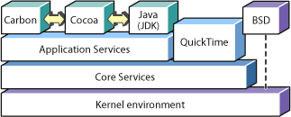

> 导航：[总目录](../../../README.md) · [documentation](../../../_indexes/documentation.md) · [Carbon Overview](Introduction%20to%20Carbon%20Overview.md)

[Next](The%20Carbon%20Factory%20Tour.md)[Previous](Introduction%20to%20Carbon%20Overview.md)

# Carbon Basics

This chapter describes the basics of Carbon, how it fits into Mac OS X, and the tools you use to build Carbon applications.

Carbon contains thousands of functions, data structures, and constants. Related functions and data structures are organized into functional groups, usually referred to as managers or services. For example, the Window Manager contains functions and data structures that let you create, remove, and otherwise manipulate application windows.

As a general rule, Carbon interfaces are those that are part of the Carbon umbrella framework; that is, those that are included when you include the `Carbon.h` header.

This document also describes a number of managers or services that you can call from a Carbon application (for example, Quartz and QuickTime). Some of these technologies use Objective-C, which may require you to write some wrapper code.

As shown in the following figure, Carbon is one of several application environments available on Mac OS X.

These other environments include:

- Cocoa. The object-oriented interface for writing Mac OS X applications in Objective-C.
- Java. A JDK-compliant virtual machine for running Java applications.

These environments depend on the same application and core services for their operation, and the underlying services rely on Darwin (Apple's open-source core operating system) and the Mach kernel.

Each environment (including the optional BSD command-line environment) has advantages and disadvantages, but for C and C++ programmers, Carbon is the best choice.

Xcode and Interface Builder are Apple's development tools for building Mach-O-based applications on Mac OS X. Both tools support Carbon, and they come free with Mac OS X, making them excellent choices for new developers targeting Mac OS X. Also Xcode is currently the only development environment that allows compiling for both PowerPC and Intel-based Macintosh computers.

Xcode and Interface Builder work in conjunction with each other to make building applications easier than ever:

- Xcode. The main development environment; it lets you create and assemble the components of your application. When you create a new Carbon application, Xcode uses a Carbon Event-based template that automatically provides basic event-handling support. Xcode also makes it easy to build universal binaries, which support both PowerPC and Intel-based Macintosh hardware.
- Interface Builder. A WYSIWYG tool that lets you lay out user interfaces in a simple, intuitive manner. These interface templates are stored as a .nib file, which your application can then access to create its windows, menus, and other elements.

Xcode uses open-source developer tools (such as the GCC compiler) under the hood. If you are comfortable doing so, you can run these tools yourself from the command line using the Terminal application, writing Make files and so on.

[Next](The%20Carbon%20Factory%20Tour.md)[Previous](Introduction%20to%20Carbon%20Overview.md)

