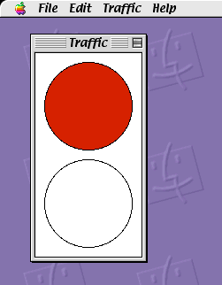
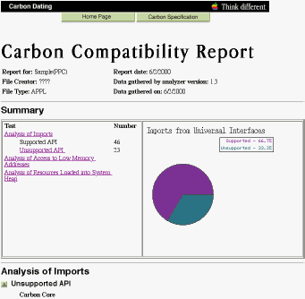

> 导航：[总目录](../../../README.md) · [documentation](../../../_indexes/documentation.md) · [Carbon Porting Guide](Introduction%20to%20Carbon%20Porting%20Guide.md)


[Next](New%20Carbon%20Technologies.md)[Previous](Building%20Carbon%20Applications.md)

# A Porting Example

This chapter details the process required to port a simple application to the Carbon interface. While this application is likely much simpler than your code, many of the steps are similar and you can use this example as a guideline for porting your own application.

The application used for this porting example is Sample (also known as TrafficLight), which is an old Mac OS demonstration program used to illustrate basic windowing and user interaction.

The original C code listing is also reproduced in [The Sample Application](The%20Sample%20Application.md#apple-f4xwc4dqnrsv64tfmyxwi33df52wszbpkridgmbqgaydsojrfvbuqmrqg4wueskbijeesrce).

Sample puts up a small window containing a rudimentary traffic light which toggles between red and green when you click in the window or when you select a color from the Light menu. [Figure 3-1](#apple-f4xwc4dqnrsv64tfmyxwi33df52wszbpkridgmbqgaydsojrfvbuqmrqgqwueqshijdeissh) shows the Sample application.

__Figure 3-1__  The Sample application



The first step in the porting process is to obtain a Carbon Dater report detailing what APIs will need to be changed or modified. Figure 3-2 shows the opening page of a Carbon Dater report on Sample.

__Figure 3-2__  A Carbon Dater report



Note that while the percentage of unsupported APIs seems high (33.3 %), this fraction corresponds to only 23 functions. Larger applications typically contain many more supported functions, often resulting in compatibility ratings of 90% or higher.

Table 3-1 summarizes Carbon Dater’s comments about the incompatible functions.

__Table 3-1__  Carbon Dater output for incompatible functions

| Manager | Function Name | Comments |
| Memory Management Utilities | `SysEnvirons` | Uses working directories. Use `FindFolder` and `Gestalt` instead. |
| Memory Manager | `ApplicationZone` | Carbon does not support zones because they do not work in a preemptively multitasked environment. |
|  | `GetApplLimit` | Mac OS X applications have no size limit on their application partition. |
|  | `MaxApplZone` | This routine is not needed by PowerPC-based applications because they can specify a stack size in the `'cfrg' 0` resource. |
| Patch Manager | `NGetTrapAddress` | Patch Manager not supported in Carbon. |
| Disk Initialization Manager | `DIBadMount` | Carbon does not support the Disk Initialization Manager. Disk Initialization is supported by the system. Mac OS X applications that need to initialize disks can do so using new APIs in the I/OKit. |
| QuickDraw Manager | `InitGraf` | In Carbon, the Mac OS automatically initializes Quickdraw for every application. When the Mac OS initializes QuickDraw, the Mac OS also automatically calls `InitGraf`. |
| Device Manager | `CloseDeskAcc` | Desk accessories not supported in Carbon. |
|  | `OpenDeskAcc` | Desk accessories not supported in Carbon. |
| Dialog Manager | `InitDialogs` | `InitDialogs` is not supported in Carbon. There is no need to initialize the Dialog Manager as the shared library is loaded as needed. |
| Event Manager | `OSEventAvail` | `OSEventAvail` is not supported in Carbon. Use the `EventAvail` function instead. |
|  | `SystemClick` | Desk accessories are not supported in Carbon. |
|  | `SystemTask` | In Carbon, the Event Manager automatically handles all task scheduling. |
| Menu Manager | `CheckItem` | Replaced by `CheckMenuItem`. |
|  | `DisableItem` | Replaced by `DisableMenuItem`. |
|  | `EnableItem` | Replaced by `EnableMenuItem`. |
|  | `InitMenus` | `InitMenus` is not supported in Carbon. There is no need to initialize the Menu Manager because the shared library is loaded as needed. |
|  | `SystemEdit` | Carbon does not support desk accessories. |
| Window Manager | `CloseWindow` | The `CloseWindow` function is not supported because developers do not allocate their own memory for windows in Carbon. Use the `DisposeWindow` function to remove a window instead. |
|  | `InitWindows` | `InitWindows` is not supported in Carbon. There is no need to initialize the Window Manager because the shared library is loaded as needed. |
|  | `InvalRect` | Calls `InvalWindowRect`, which takes a window pointer as an additional parameter. This change is necessary because invalidation works only on windows, not ports, and windows are not ports in Carbon. |
| Font Manager | `InitFonts` | There is no need to initialize the Font Manager because the shared library is loaded as needed. |
| TextEdit | `TEInit` | There is no need to initialize TextEdit because the shared library is loaded as needed. |

The Carbon Dater report indicates that many of the incompatible functions are either no longer needed or obsolete (such as those related to desk accessories), while others require just a replacement. There are only a few cases which might require some thoughtful workarounds.

This section describes the initial steps of the porting process. For clarity, the subsection names parallel the porting steps described in [Preparing Your Code for Carbon](Preparing%20Your%20Code%20for%20Carbon.md#apple-f4xwc4dqnrsv64tfmyxwi33df52wszbpkridgmbqgaydsojrfvbuqmrqgiwviucykjcummjqge)

To qualify for this step, the Sample application should compile as a PowerPC executable, which it does. You can also make the following changes to clean up the code:

- Remove the `#pragma segment` statements. These statements indicate which segments should contain which parts of the code. PowerPC code does not use segments, so these are unnecessary.
- Remove `UnloadSeg` calls in `Main` (2 instances). Again, these calls make sense only on 68K machines.
- Remove the comment on segmentation strategy.
- Remove the `TrapAvailable` function and all references to it. Because `WaitNextEvent` is always available on current systems, `TrapAvailable` is superfluous. Also, it relies on the `NGetTrapAddress` function, which is illegal in Carbon anyway, so you might as well get rid of it now.

You must make sure that Sample compiles and runs using the latest version of Universal Interfaces, which should be included with the latest version of the Carbon SDK. The examples here assume you are building your code using Metrowerks CodeWarrior. The following changes are necessary to update to the latest headers:

- Remove `Desk.h` include statement and add `Devices.h` in both `Sample.c` and `SampleInit.c`.
- Change name of `GetGlobalMouse` function in `Sample.c` and `Sample.h` to `MyGetGlobalMouse` (or something similar). The local function collides with the `GetGlobalMouse` function in `Events.h`.
- Remove the reference to `_DataInit` in `main` and its external declaration. This function (part of the MPW runtime library) initializes global data on 68K machines.

This guideline requires you to focus on building a CFM-based Carbon application (at least initially), rather than a Mach-O–based one.

This step is probably the most tedious as it requires you to inspect your code for data structure access that will become illegal in Carbon.

First, add the object file `CarbonAccessors.o` to your CodeWarrior project.

Then add `#define ACCESSOR_CALLS_ARE_FUNCTIONS 1` to the beginning of `Sample.c` and `SampleInit.c`. With this setting in place, the compiler generates errors indicating places where you need to add accessor functions.

If you don’t mind seeing additional compile errors initially, you can also add `#define OPAQUE_TOOLBOX_STRUCTS 1`. The compiler will then generate errors if it detects attempts to directly access fields of the now opaque structures. You can use this error list to identify places where you need to modify the code to use accessor functions.

For example, after setting both conditionals, CodeWarrior generates errors such as the following when attempting to compile `Sample.c`:

```swift
Error   : cannot convert
'struct OpaqueWindowPtr *' to
'struct OpaqueGrafPtr *'
Sample.c line 224   SetPort(window);    /* the window must be the current port... */

Error   : illegal use of incomplete struct/union/class 'struct OpaqueWindowPtr'
Sample.c line 225   EraseRect(&window->portRect); /* because of a bug in ZoomWindow */

Error   : illegal use of incomplete struct/union/class 'struct OpaqueWindowPtr'
Sample.c line 227   InvalRect(&window->portRect); /* to make things look better on-screen */
```

The code indicated by the errors (contained in the function `DoEvent`) is as follows:

```swift
…
    case inZoomIn:
    case inZoomOut:
        hit = TrackBox(window, event->where, part);
        if ( hit ) {
            SetPort(window);/* window must be the current port */
            EraseRect(&window->portRect);   /* because of a bug in ZoomWindow */
            ZoomWindow(window, part, true); /* note that we invalidate and erase... */
            InvalRect(&window->portRect);   /* to make things look better on-screen */
        }
        break;
…
```

You must use an accessor to obtain the contents of the `window.portRect` field, and then you must cast the window pointer to a graphics pointer (`GrafPtr`) before setting the port. For more information about available accessor functions and how to use them, see [Functions for Accessing Opaque Data Structures](New%20Carbon%20Functions.md#apple-f4xwc4dqnrsv64tfmyxwi33df52wszbpkridgmbqgaydsojrfvbuqmrqgywueqkbineegrkd).

After the required changes, the code might look something like this:

```swift
    …
    case inZoomIn:
    case inZoomOut:
        hit = TrackBox(window, event->where, part);
        if ( hit ) {
            Rect portRect;              /*•• new variable to hold the value of  */
                                        /*•• the portRect field of window.      */
            GetPortBounds(GetWindowPort(window), &portRect); /*•• new accessor added */
            SetPort(GetWindowPort(window));/*•• The windowPtr is now cast to */
                                         /*•• a GrafPtr before setting */
            EraseRect(&portRect);           /* because of a bug in ZoomWindow */
            ZoomWindow(window, part, true); /* note that we invalidate and erase... */
            InvalRect(&portRect);           /* to make things look better on-screen */
        }
        break;
…
```

Note that the event record (referenced in a parameter for `TrackBox`) is not opaque. This is one of the few Carbon structures that remains accessible without accessors.

You also need to add accessor functions to the following functions:

- `DoEvent`: add an accessor to obtain the `screenbits` field of the `QDGlobals` structure.
- `AdjustCursor` : add accessors to obtain the port bounds, the visible region, and the arrow field of the `QDGlobals` structure. Instead of attempting to get the `portBits` field of the window port and setting the global origin from that, you can obtain the local port bounds, translate them to global coordinates, and set the origin to the upper left corner of those bounds. Also, you must allocate (and afterwards dispose of) a region handle to hold the visible region obtained by the accessor.
- `DoUpdate`: Add an accessor to obtain the visible region.
- `DrawWindow`: Convert the Window pointer to type `GrafPtr` before setting the port.
- `SetLight`: Add an accessor to obtain the port bounds.
- `DoCloseWindow`: You would normally want to use an accessor to obtain the `windowKind` field, but the function using it is `CloseDeskAcc`, which is not supported in Carbon anyway. So the simplest thing to do is to eliminate the code that handles the desk accessory case altogether.
- `IsAppWindow`: Add an accessor to obtain the window kind.
- `IsDAWindow`: Normally you would use an accessor to obtain the window kind, but because the entire function is useful only for desk accessories, it is simpler to remove it altogether.
- `AlertUser`: Add an accessor to obtain the arrow field of the `QDGlobals` structure.
- `Initialize` (in `SampleInit.c`): Instead of determining the size of a window record in order to allocate space for a new window, you can leave these lines out entirely, because the need to preallocate memory for windows has not been an issue for some time. Note that instead of calling `GetNewWindow`, you could call `CreateNewWindow`, which is the suggested replacement for window creation on Mac OS 8.5 and later.

Use the `GetWindowPort` function to convert window pointers to graphics pointers in the following functions, if you have not already done so: `DoEvent`, `AdjustCursor`, `DrawWindow`, and `SetLight`.

To allow compilation on both Mac OS X and Mac OS 8 and 9, replace the usual header includes with the following:

```c
#define MAC_OS_X_BUILD 0
#if MAC_OS_X_BUILD
        #include <Carbon/Carbon.h>
#else
        #include <Carbon.h>
#endif
```

To build on Mac OS X, you would set the `MAC_OS_X_BUILD` flag to `1`(true).

Note that `Carbon.h` is not required; you could have included the usual Mac OS 8 and 9 headers instead. However, by including `Carbon.h`, you set the preprocessor directive

```
#define TARGET_API_MAC_CARBON 1
```

(if it wasn’t already defined) which sets the previous directives (`ACCESSOR_CALLS_ARE_FUNCTIONS` and `OPAQUE_TOOLBOX_STRUCTS` ) as well.

Sample does not use universal procedure pointers, so this step is unnecessary.

Sample uses no custom definition functions, so you can skip this step.

Sample does not access any low-memory globals, so you can skip this step as well.

During development, it’s usually useful to keep the debugging version of `CarbonLib` in your Extensions folder instead of the standard `CarbonLib`.

Using the information obtained from Carbon Dater, you can now add the required replacements or modifications for Carbon compatibility. First, remove `CarbonAccessors.o` and `InterfaceLib` from your link path and begin linking exclusively against `CarbonLibStub`.

Any attempts to build Sample at this stage will generate linker errors for any functions that are not available in Carbon. You can use the linker errors and the Carbon Dater report as guides for making the following changes:

- In `main`: Remove `MaxApplZone` as it’s not needed in PowerPC applications.
- In `DoEvent`:

  Remove `SystemClick`, which is specific to desk accessories.

  Replace `InvalRect` with `InvalWindowRect`. Note that `InvalWindowRect` takes an additional window pointer as a parameter.

  Remove `DIBadMount`. This function is hardware-specific. If you want to reproduce its functionality on Mac OS X, you must use the I/O Kit API to do so. Actually, because Carbon does not support the `diskEvt` event , you can remove this particular case altogether. The Carbon Event Manager will provide support for disk and volume events.
- In `SetLight`: Replace `InvalRect` with `InvalWindowRect`.
- In `DoMenuCommand`:

  Remove `SystemEdit` because it’s specific to desk accessories.

  Remove `OpenDeskAcc` because, again, Carbon doesn’t support desk accessories.
- In `DoCloseWindow`: Replace `CloseWindow` with `DisposeWindow`.
- In `AdjustMenus`:

  Replace `EnableItem` with `EnableMenuItem`.

  Replace `CheckItem` with `CheckMenuItem`.

  Normally you would replace `DisableItem` with `DisableMenuItem`. Here, `DisableItem` is used only in the desk accessory case, which will never occur. Therefore, you can remove all instances of `DisableItem` as well as the conditional to distinguish between the traffic light window and desk accessories.
- In `EventLoop`: Remove the `SystemTask` function as it is not needed in Carbon. Actually, because `WaitNextEvent` is guaranteed to be present, you can remove the conditional altogether.
- In `MyGetGlobalMouse`: Change `OSEventAvail` to `EventAvail`.
- In `Initialize`:

  Remove initialization functions `InitGraf`, `InitFonts`, `InitWindows`, `InitMenus`, `TEInit`, and `InitDialogs`, as they are not needed in Carbon.

  Remove the `SysEnvirons` function, which is not supported in Carbon. This function is part of a check to see if `WaitNextEvent` is available. Because `WaitNextEvent` is always available in Carbon, you can remove all of the code associated with this check, which eliminates the unsupported functions.

  Remove `GetApplLimit` and `ApplicationZone` as they are not supported in Carbon.

In addition, it turns out that the `WaitNextEvent` time `LONG_MAX` (referenced in the `EventLoop` function) is not defined in Carbon. You can replace it with 0x7FFFFFFF because there are no periodic actions that need to be taken..

After making these changes, your version of Sample should be able to run on Mac OS 8 and 9 using the `CarbonLib` extension.

Sample does not require interfaces for printing or saving files, so this step is unnecessary.

To ensure that Sample will launch as a Carbon application on the Mac OS X and not in the Classic environment, you must add a resource of type `'plst'` with ID 0 to the resource file `TCSample.rsrc`. To add this resource, you can either modify the resource file directly using an editor such as ResEdit or Resourcerer, or you can DeRez the file, add text defining the resource, and then recompile the resource file. A minimal `'plst'` resource entry would be as follows:

```
data 'plst' (0) {
    $"00"               /* . */
};
```


To make sure that Sample can quit properly in Mac OS X, you must add a Quit Apple event handler to `SampleInit.c` such as the following:

```
/* Here is our Quit Apple event handler */
static pascal OSErr QuitAppleEventHandler (const AppleEvent *appleEvt,
                                     AppleEvent* reply, UInt32 refcon)
{
    Terminate(); /* close window and terminate gracefully */
} /* QuitAppleEventHandler */
```

To install the handler, you must call `AEInstallEventHandler` in the `Initialize` function:

```
…
OSErr err;
err = AEInstallEventHandler( kCoreEventClass, kAEQuitApplication,
                 NewAEEventHandlerUPP(QuitAppleEventHandler), 0, false );
    if (err != noErr) ExitToShell();
…
```

Note that the Apple event installer function requires one of the new UPP accessor functions, `NewAEEventHandlerUPP`. This accessor replaces the old macro `NewAEEventHandlerProc`.

In addition, you must add a case to the `DoEvent` function to process the event properly when it occurs.

```
void DoEvent (EventRecord *event)
    {
…
    /*•• Add a case to process the Quit Apple event */
        case kHighLevelEvent:
            AEProcessAppleEvent( event );
            break;
…
    }
```

After installing the handler, you must adjust the Quit menu item depending on whether Sample is running on Mac OS X or on Mac OS 8 and 9. Because the Quit item appears automatically in the application menu on Mac OS X, you should add code to the `Initialize` function to remove the Quit item from the File menu (where it normally appears for Mac OS 8 and 9) if Sample is running on Mac OS X:

```
…
    SetMenuBar(menuBar);                /* install menus */
    DisposeHandle(menuBar);

/*•• New code begins here */
long result;
MenuRef menu;

err = Gestalt(gestaltMenuMgrAttr, &result);
    if (!err && (result & gestaltMenuMgrAquaLayoutMask)) {
        menu = GetMenuHandle (mFile);
        DeleteMenuItem(menu, iQuit);
        DeleteMenuItem(menu, iQuit-1); /* the element above the Quit */
                                        /* item is a separator */
/*•• End of new code */

    DrawMenuBar();
…
```

This snippet uses `Gestalt` to get the Menu Manager attributes and checks to see if the Aqua interface is present. If it is, then Sample running on Mac OS X. It then simply deletes the Quit item and its separator from the menu bar before it gets drawn.

At this point the Sample application should run on both Mac OS X and Mac OS 8 and 9. However, you can remove a few extraneous bits of code to clean up Sample:

- Remove all references to the variable `gMac`, which was only used in the (now nonexistent) `SysEnvirons` call.
- Remove the `gHasWaitNextEvent` flag. Because `WaitNextEvent` is always available in Carbon, this flag is unnecessary.

If desired, you can now use the same code to build a Mach-O–based version of Sample which can run only on Mac OS X.

While the Carbon version of Sample now executes on Mac OS X, it is also important that the application adheres to the new Aqua interface. Here are a few additional changes you can make to adopt the Aqua look and feel.

Due to the placement of the three Aqua buttons in each window (the close, minimize, and zoom buttons) and the small default size of Sample’s window, the title, Traffic, is truncated. To work around this, you can increase the dimensions of the window and avoid truncation.

About boxes in Mac OS X have a consistent appearance that is different from what you may be used to in Mac OS 8 and 9. They should be modeless dialogs that contain the application icon as well as informative text. Figure 3-3 shows an About box created for Sample.

__Figure 3-3__  The About box for Sample

<IMAGE>

See _Inside Mac OS X: Aqua Human Interface Guidelines_ for the full specifications for the About box.

[Listing 3-1](#apple-f4xwc4dqnrsv64tfmyxwi33df52wszbpkridgmbqgaydsojrfvbuqmrqgqwueqshincucqkh) and [Listing 3-2](#apple-f4xwc4dqnrsv64tfmyxwi33df52wszbpkridgmbqgaydsojrfvbuqmrqgqwueqshijbucqke) show the Sample application now ported to Carbon. Changes related to the porting process are indicated by “••” in comments `/*•• just like this */`. Some discussion comments were removed for clarity.

__Figure 3-4__  The Carbon version of Sample on Mac OS X

<IMAGE>

__Listing 3-1__  Carbon version of Sample.c

```c
//#define ACCESSOR_CALLS_ARE_FUNCTIONS 1 /*•• leftovers from the porting process */
//#define OPAQUE_TOOLBOX_STRUCTS 1

#define TARGET_API_MAC_CARBON 1

#define MAC_OS_X_BUILD  0
/*•• use only one include for all Carbon headers */
#if MAC_OS_X_BUILD
        #include <Carbon/Carbon.h>
    #else
        #include <Carbon.h>
        #endif

#include "Sample.h      "/* bring in all the #defines for Sample */

/* The "g" prefix is used to emphasize that a variable is global. */

/*•• removed gMac and gHasWaitNextEvent global variables, as they are never used */

/* GInBackground is maintained by our osEvent handling routines. Any part of
   the program can check it to find out if it is currently in the background. */
Boolean     gInBackground;      /* maintained by Initialize and DoEvent */


/* The following globals are the state of the window. If we supported more than
   one window, they would be attached to each document, rather than globals. */

/* GStopped tells whether the stop light is currently on stop or go. */
Boolean     gStopped;           /* maintained by Initialize and SetLight */

/* GStopRect and gGoRect are the rectangles of the two stop lights in the window. */
Rect        gStopRect;          /* set up by Initialize */
Rect        gGoRect;            /* set up by Initialize */


/* Define TopLeft and BotRight macros for convenience. Notice the implicit
   dependency on the ordering of fields within a Rect */
#define TopLeft(aRect)  (* (Point *) &(aRect).top)
#define BotRight(aRect) (* (Point *) &(aRect).bottom)


/*•• Removed _DataInit, which is 68K-specific */


void main()
{
/*•• Removed UnloadSeg call, which is 68K-specific */

    /* 1.01 - call to ForceEnvirons removed */
    /*•• Removed MaxApplZone as it's not needed in PowerPC apps */

    Initialize();                   /* initialize the program */
    /*•• Removed UnloadSeg call, which is 68K-specific */

    EventLoop();                    /* call the main event loop */
} /*main*/


void EventLoop()
{
    RgnHandle   cursorRgn;
    Boolean     gotEvent;
    EventRecord event;
    Point       mouse;

    cursorRgn = NewRgn();   /* we’ll pass WNE an empty region the 1st time thru */
    do {
        /*•• WNE is always available in Carbon, so the conditional was removed. */
        MyGetGlobalMouse(&mouse);
        AdjustCursor(mouse, cursorRgn);
        /*•• Note wait period LONG_MAX not defined in Carbon. Replaced with 0x7FFFFFFF */
        gotEvent = WaitNextEvent(everyEvent, &event, 0x7FFFFFFF, cursorRgn);

        if ( gotEvent ) {
            /* make sure we have the right cursor before handling the event */
            AdjustCursor(event.where, cursorRgn);
            DoEvent(&event);
        }
        /*  If you are using modeless dialogs that have editText items,
            you will want to call IsDialogEvent to give the caret a chance
            to blink, even if WNE/GNE returned FALSE. However, check FrontWindow
            for a non-NIL value before calling IsDialogEvent. */
    } while ( true );   /* loop forever; we quit via ExitToShell */
} /*EventLoop*/


void DoEvent(EventRecord *event)
{
    short       part, err;
    WindowPtr   window;
    Boolean     hit;
    char        key;
    Point       aPoint;
    BitMap screenBits;      /*•• needed to hold contents of qd.screenBits */
    Rect bounds, portRect;  /*•• needed to hold contents of screenbits.bounds and */
                            /*•• the value of the portRect field of the window rec */

    switch ( event->what ) {
        case mouseDown:
            part = FindWindow(event->where, &window);
            switch ( part ) {
                case inMenuBar:         /* process a mouse menu command (if any) */
                    AdjustMenus();
                    DoMenuCommand(MenuSelect(event->where));
                    break;
                case inSysWindow:   /*•• removed SystemClick (not part of Carbon) */
                    break;
                case inContent:
                    if ( window != FrontWindow() ) {
                        SelectWindow(window);
                        /*DoEvent(event);*/ /* use this line for "do first click" */
                    } else
                        DoContentClick(window);
                    break;
                case inDrag:        /* pass screenBits.bounds to get all gDevices */
                    GetQDGlobalsScreenBits(&screenBits); /*•• use accessor to obtain */
                                                        /*•• screenBits */
                    bounds = screenBits.bounds; /*•• get bounds from screenBits.*/
                                            /*•• Note that bitmaps are not opaque */
                    DragWindow(window, event->where, &bounds);
                    break;
                case inGrow:
                    break;
                case inZoomIn:
                case inZoomOut:
                    hit = TrackBox(window, event->where, part);
                    if ( hit ) {
                        /*•• new accessor in place */
                        GetPortBounds(GetWindowPort(window), &portRect);

                        /*•• The windowPtr is now cast to a GrafPtr before setting */
                        SetPort(GetWindowPort(window));

                        EraseRect(&portRect);   /* because of a bug in ZoomWindow */
                        ZoomWindow(window, part, true); /* note that we invalidate */
                                                /* and erase...to make things look */
                                                /* better on-screen */

                        /*•• InvalRect replaced with InvalWindowRect */
                        InvalWindowRect(window, &portRect);
                    }
                    break;
            }
            break;
        case keyDown:
        case autoKey:                       /* check for menukey equivalents */
            key = event->message & charCodeMask;
            if ( event->modifiers & cmdKey )            /* Command key down */
                if ( event->what == keyDown ) {
                    AdjustMenus();      /* enable/disable/check menu items properly */
                    DoMenuCommand(MenuKey(key));
                }
            break;
        case activateEvt:
            DoActivate((WindowPtr) event->message,
                        (event->modifiers & activeFlag) != 0);
            break;
        case updateEvt:
            DoUpdate((WindowPtr) event->message);
            break;
        /*•• Add a case to process the Quit Apple event */
        case kHighLevelEvent:
            AEProcessAppleEvent( event );
            break;

        /*•• Removed diskEvt case (and DIBadMount)--not supported in Carbon

        case kOSEvent:
        /*  1.02 - must BitAND with 0x0FF to get only low byte */
            switch ((event->message >> 24) & 0x0FF) {   /* high byte of message */
                case kSuspendResumeMessage: /* suspend/resume is also an activate/ */
                                            /* deactivate */
                    gInBackground = (event->message & kResumeMask) == 0;
                    DoActivate(FrontWindow(), !gInBackground);
                    break;
            }
            break;
    }
} /*DoEvent*/


void AdjustCursor(Point mouse, RgnHandle region)
{
    WindowPtr   window;
    RgnHandle   arrowRgn;
    RgnHandle   plusRgn;
    RgnHandle   visRgn; /*•• needed to hold field value obtained by accessor function */
    Cursor      arrow; /*•• used to hold the contents of the qd.arrow field */
    Rect        globalPortRect, portRect;

    window = FrontWindow(); /* we only adjust the cursor when we are in front */

    if (! gInBackground) {  /*•• removed desk accessory case from conditional */
        /* calculate regions for different cursor shapes */
        arrowRgn = NewRgn();
        plusRgn = NewRgn();

        /* start with a big, big rectangular region */
        SetRectRgn(arrowRgn, kExtremeNeg, kExtremeNeg, kExtremePos, kExtremePos);

        /* calculate plusRgn */
        if ( IsAppWindow(window) ) {

            Point tempPoint;

            SetPort(GetWindowPort(window)); /* make a global version of the viewRect */
            /*•• Added accessor to cast WindowPtr to GrafPtr */
            GetPortBounds (GetWindowPort(window), &portRect);
            SetPt(&tempPoint, portRect.left, portRect.top); /*•• obtain local origin */
            LocalToGlobal(&tempPoint); /*•• translate point to global coordinates */
            SetOrigin(tempPoint.h, tempPoint.v); /*•• Set the global origin */

            /*•• Added accessor to get value for globalPortRect */
            GetPortBounds(GetWindowPort(window), &globalPortRect);
            RectRgn(plusRgn, &globalPortRect);

            visRgn = NewRgn();/*•• allocate a new region */
            /*•• Added accessor to get value for visRgn */
            GetPortVisibleRegion(GetWindowPort(window), visRgn);
            SectRgn(plusRgn, visRgn, plusRgn);
            SetOrigin(0, 0);
            DisposeRgn(visRgn);/*•• dispose of the region */
        }

        /* subtract other regions from arrowRgn */
            DiffRgn(arrowRgn, plusRgn, arrowRgn);

        /* change the cursor and the region parameter */
        if ( PtInRgn(mouse, plusRgn) ) {
                SetCursor(*GetCursor(plusCursor));
                CopyRgn(plusRgn, region);
        } else {
                SetCursor(GetQDGlobalsArrow(&arrow)); /*•• new accessor in place */
                CopyRgn(arrowRgn, region);
        }

        /* get rid of our local regions */
        DisposeRgn(arrowRgn);
        DisposeRgn(plusRgn);
    }
} /*AdjustCursor*/


/*•• "My" added to GetGlobalMouse to avoid name collision with the function in Events.h */

void MyGetGlobalMouse(Point *mouse)
{
    EventRecord event;

    /*•• Changed OSEventAvail to EventAvail */
    EventAvail(kNoEvents, &event);  /* we aren't interested in any events */
    *mouse = event.where;               /* just the mouse position */
} /*MyGetGlobalMouse*/


void DoUpdate(WindowPtr window)
{

    if (IsAppWindow(window)) {
        RgnHandle  visRgn; /*•• needed to hold contents of window->visRgn */

        BeginUpdate(window);                /* this sets up the visRgn */
        visRgn = NewRgn();
        /*•• Added accessor to obtain the visRgn */
        GetPortVisibleRegion (GetWindowPort(window), visRgn);
        if ( ! EmptyRgn(visRgn) )   /* draw if updating needs to be done */
            DrawWindow(window);
        EndUpdate(window);
        }
} /*DoUpdate*/


void DoActivate(WindowPtr window, Boolean becomingActive)
{
    if (IsAppWindow(window)) {

        if ( becomingActive )
            /* do whatever you need to at activation */ ;
        else
            /* do whatever you need to at deactivation */ ;
        }
} /*DoActivate*/


void DoContentClick(WindowPtr window)
{
    SetLight(window, ! gStopped);
} /*DoContentClick*/


void DrawWindow(WindowPtr window)
{
    Rect portRect; /*•• Needed to hold the contents of window->portRect */

    SetPort(GetWindowPort(window));

     /*•• Use accessor to obtain port bounds */
    GetPortBounds(GetWindowPort(window), &portRect);

    EraseRect(&portRect);   /* clear out any garbage that may linger */

    if ( gStopped )                 /* draw a red (or white) stop light */
        ForeColor(redColor);
    else
        ForeColor(whiteColor);

    PaintOval(&gStopRect);
    ForeColor(blackColor);
    FrameOval(&gStopRect);

    if ( ! gStopped )               /* draw a green (or white) go light */
        ForeColor(greenColor);
    else
        ForeColor(whiteColor);

    PaintOval(&gGoRect);
    ForeColor(blackColor);
    FrameOval(&gGoRect);
} /*DrawWindow*/


void AdjustMenus()
{
    MenuHandle  menu;

    /*•• Removed references to IsDAWindow, because desk accessories are not in Carbon*/
    /*•• removed DisableItems and all code dealing with the desk accessory case.*/

    menu = GetMenuHandle(mLight);
    EnableMenuItem(menu, iStop); /*•• replaced EnableItem with EnableMenuItem */
    EnableMenuItem(menu, iGo);

    /*•• replaced CheckItem with CheckMenuItem */
    CheckMenuItem(menu, iStop, gStopped); /* we can also determine check/uncheck */
                                        /* state, too */
    CheckMenuItem(menu, iGo, ! gStopped);
} /*AdjustMenus*/


void DoMenuCommand(long menuResult)
{
    short       menuID;             /* the resource ID of the selected menu */
    short       menuItem;           /* the item number of the selected menu */
    short       itemHit;
    Str255      daName;
    short       daRefNum;
    Boolean     handledByDA;

    menuID = HiWord(menuResult);    /* use macros for efficiency to... */
    menuItem = LoWord(menuResult);  /* get menu item number and menu number */
    switch ( menuID ) {
        case mApple:
            switch ( menuItem ) {
                case iAbout:        /* bring up alert for About */
                    itemHit = Alert(rAboutAlert, nil);
                    break;
                default:/* all non-About items in this menu are DAs */
                        /*•• removed desk accessory code (not supported in Carbon) */
                    break;
            }
            break;
        case mFile:
            switch ( menuItem ) {
                case iClose:
                    DoCloseWindow(FrontWindow());
                    break;
                case iQuit:
                    Terminate();
                    break;
            }
            break;
        case mEdit:     /* call SystemEdit for DA editing & MultiFinder */
                        /*•• removed because Carbon doesn't support desk accessories */
            break;
        case mLight:
            switch ( menuItem ) {
                case iStop:
                    SetLight(FrontWindow(), true);
                    break;
                case iGo:
                    SetLight(FrontWindow(), false);
                    break;
            }
            break;
    }
    HiliteMenu(0);      /* unhighlight what MenuSelect (or MenuKey) hilited */
} /*DoMenuCommand*/


void SetLight(WindowPtr window, Boolean newStopped)
{
    if ( newStopped != gStopped ) {

        Rect portRect;  /*•• Needed to hold port bounds */

        gStopped = newStopped;

        /*•• Use accessor to obtain port bounds */
        GetPortBounds(GetWindowPort(window), &portRect);

        /*•• Use accessor to cast WindowPtr to GrafPtr */
        SetPort(GetWindowPort(window));

        InvalWindowRect(window,&portRect);
    }
} /*SetLight*/


Boolean DoCloseWindow(WindowPtr window)
{
    /*•• Desk accessory–related code removed, because it's not supported in Carbon */

    DisposeWindow(window); /*•• replaced CloseWindow with DisposeWindow */
    return true;
} /*DoCloseWindow*/


void Terminate()
{
    WindowPtr   aWindow;
    Boolean     closed;

    closed = true;
    do {
        aWindow = FrontWindow();                /* get the current front window */
        if (aWindow != nil)
            closed = DoCloseWindow(aWindow);    /* close this window */
    }
    while (closed && (aWindow != nil));
    if (closed)
        ExitToShell();                          /* exit if no cancellation */
} /*Terminate*/


Boolean IsAppWindow(WindowPtr window)
{
    short       windowKind;

    if ( window == nil )
        return false;
    else {  /* application windows have windowKinds = userKind (8) */
        windowKind = GetWindowKind(window);
        return ( windowKind == userKind );
    }
} /*IsAppWindow*/


/* Boolean IsDAWindow(WindowPtr window)                */
/*•• Carbon does not support desk accessories, so we removed this function */
/*                                                                         */
/*IsDAWindow*/


void AlertUser()
{
    short       itemHit;
    Cursor      arrow; /*•• used to hold the contents of the qd.arrow field */

    SetCursor(GetQDGlobalsArrow(&arrow)); /*•• new accessor in place */
    itemHit = Alert(rUserAlert, nil);
    ExitToShell();
} /* AlertUser */
```


__Listing 3-2__  Carbon version of SampleInit.c

```c
//#define ACCESSOR_CALLS_ARE_FUNCTIONS 1 /*•• leftovers from the porting process */
//#define OPAQUE_TOOLBOX_STRUCTS 1

#define TARGET_API_MAC_CARBON 1

#define MAC_OS_X_BUILD  0
/*•• use only one include for all Carbon headers */
#if MAC_OS_X_BUILD
        #include <Carbon/Carbon.h>
    #else
        #include <Carbon.h>
        #endif

#include "Sample.h      "/* bring in all the #defines for Sample */


/* The "g" prefix is used to emphasize that a variable is global. */
/* All are extern since the variables are declared in the main segment. */

/*•• removed gMac and gHasWaitNextEvent global variables, as they are never used */

/* GInBackground is maintained by our osEvent handling routines. Any part of
   the program can check it to find out if it is currently in the background. */
extern Boolean      gInBackground;      /* maintained by Initialize and DoEvent */


/* The following globals are the state of the window. If we supported more than
   one window, they would be attached to each document, rather than globals. */

/* GStopped tells whether the stop light is currently on stop or go. */
extern Boolean      gStopped;           /* maintained by Initialize and SetLight */

/* GStopRect and gGoRect are the rectangles of the two stop lights in the window. */
extern Rect     gStopRect;          /* set up by Initialize */
extern Rect     gGoRect;            /* set up by Initialize */


/*•• Here is our Quit Apple event handler */
static pascal OSErr QuitAppleEventHandler( const AppleEvent *appleEvt,
                                            AppleEvent* reply, UInt32 refcon )
{
    Terminate(); /* close window and terminate gracefully */
}   /*•• QuitAppleEventHandler */


void Initialize()
{
    Handle      menuBar;
    WindowPtr   window;
    long        total, contig;
    EventRecord event;
    short       count;
    MenuRef     menu;
    long        result;  /*•• used to hold results of Gestalt call */
    OSErr       err;

    gInBackground = false;

    /*•• Removed most of the init functions (InitGraf, etc) as they */
    /*•• are not needed in Carbon */
    InitCursor();

    /*  Call MPPOpen and ATPLoad at this point to initialize AppleTalk,
        if you are using it. */

    /*  This next bit of code is necessary to allow the default button of our
        alert be outlined.
        1.02 - Changed to call EventAvail so that we don't lose some important
        events. */

    for (count = 1; count <= 3; count++)
        EventAvail(everyEvent, &event);

    /*•• WaitNextEvent is always available in Carbon, so we eliminated the code that */
    /*•• calls SysEnvirons and checks a trap for its presence. */

    /*•• Removed calls to GetApplLimit and ApplicationZone. They are not supported */
    /*•• in Carbon, and the memory problem they protect against is no longer an issue */

    PurgeSpace(&total, &contig);
    if (total < kMinSpace) AlertUser();

    /*•• Removed code to preallocate space for our window, because memory */
    /*•• requirements are no longer strict enough to make it necessary */

    window = GetNewWindow(rWindow, nil, (WindowPtr) -1);

    menuBar = GetNewMBar(rMenuBar);         /* read menus into menu bar */
    if ( menuBar == nil ) AlertUser();

    SetMenuBar(menuBar);                    /* install menus */
    DisposeHandle(menuBar);
    /*•• Removed code that added desk accessories to the Apple Menu */

    /*•• Determine if we're running on Mac OS X, and if we are, remove the Quit menu */
    /*•• item and the Quit separator from the File Menu */
    err = Gestalt(gestaltMenuMgrAttr, &result);
    if (!err && (result & gestaltMenuMgrAquaLayoutMask)) {
        menu = GetMenuHandle (mFile);
        DeleteMenuItem(menu, iQuit);
        DeleteMenuItem(menu, iQuit-1); /*•• the element above the Quit item */
                                     /* •• is a separator */
        }

    DrawMenuBar();

    /*•• Install a Quit Apple Event handler to make sure that the application can */
    /*•• quit properly on Mac OS X. It's also just good programming practice on 8/9 */
    err = AEInstallEventHandler( kCoreEventClass, kAEQuitApplication,
                             NewAEEventHandlerUPP(QuitAppleEventHandler), 0, false );
    if (err != noErr) ExitToShell();

    gStopped = true;
    if ( !GoGetRect(rStopRect, &gStopRect) )
        AlertUser();                        /* the stop light rectangle */
    if ( !GoGetRect(rGoRect, &gGoRect) )
        AlertUser();                        /* the go light rectangle */
} /*Initialize*/


Boolean GoGetRect(short rectID, Rect *theRect)
{
    Handle      resource;

    resource = GetResource('RECT', rectID);
    if ( resource != nil ) {
        *theRect = **((Rect**) resource);
        return true;
    }
    else
        return false;
} /* GoGetRect */


/* TrapAvailable */
/*•• Carbon does not support traps, so this function was removed. */

/*TrapAvailable*/
```

[Next](New%20Carbon%20Technologies.md)[Previous](Building%20Carbon%20Applications.md)

