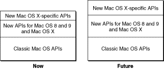
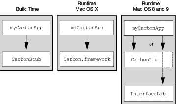

> 导航：[总目录](../../../README.md) · [documentation](../../../_indexes/documentation.md)

[Next](Preparing%20Your%20Code%20for%20Carbon.md)

# Introduction to Carbon Porting Guide

The Carbon Porting Guide is intended to help experienced Macintosh developers convert existing Mac OS applications into Carbon applications that can run on Mac OS X as well as Mac OS 8 and 9. It contains detailed information about how to adapt and build your application using the Carbon API as well as step-by-step examples of the porting process.

To make the Carbon transition as smooth as possible, you should also be familiar with the following documents before beginning your port:

- _Inside Mac OS X: System Overview_. This document contains in-depth discussions of Mac OS X features and architecture. It also contains more detailed information about some topics discussed in this document.
- _Inside Mac OS X: Aqua Human Interface Guidelines_. This document provides the human interface guidelines for the Mac OS X user interface.

This chapter introduces Carbon and provides an overview of the changes you’ll need to be aware of as you convert your application.

Carbon is the set of programming interfaces derived from earlier Mac OS APIs that can run on Mac OS X. Some of these APIs have been modified or extended to take advantage of Mac OS X features such as preemptive multitasking and protected memory.

In addition to being able to run on Mac OS X, Carbon applications built for Mac OS X can also run on Mac OS 8 and 9 when the CarbonLib system extension is installed. (As always, you should test for the existence of specific features before using them.)

Carbon includes about 70 percent of the existing Mac OS APIs, covering about 95 percent of the functions used by applications. Because it includes most of the functions you rely on today, converting to Carbon is a straightforward process. Apple provides tools and documentation to help you determine the changes you will need to make in your source code, as well as the header files and libraries necessary to build a Carbon application.

Mac OS X brings important new features and enhancements that developers have asked for, and Carbon allows you to take advantage of them while preserving your investment in Mac OS source code. As Apple moves the Mac OS forward, Carbon ensures you won’t be left behind.

Carbon applications gain these benefits when running under Mac OS X:

- Greater stability. Protected address spaces help prevent errant applications from crashing the system or other applications.
- Improved responsiveness. Each application is guaranteed processing time through preemptive multitasking, resulting in a more responsive user experience.
- Dynamic resource allocation. More efficient use of system resources, including the elimination of fixed size heaps, means your application can allocate memory and other shared resources based on actual needs rather than predetermined values. Each application can access up to 4GB of potential addressable memory.
- Aqua look and feel. Apple’s newest user interface is available only to applications that run natively on Mac OS X.

The Carbon programming interface consists of the following types of APIs:

- Classic Mac OS APIs that can run unchanged on Mac OS X. These comprise the majority of the APIs in your current application.
- Classic Mac OS APIs that have been modified to work on Mac OS X. For example, to operate properly in a preemptively-scheduled environment, a function may now require an additional parameter to specify the context (or process) to which it belongs.
- New APIs that can run on both Mac OS X and Mac OS 8 and 9. For example, Core Foundation and the Carbon Event Manager provide additional benefits for Carbon applications but are not required for porting.
- New APIs that are available only on Mac OS X.

Currently, the Classic Mac OS APIs make up the largest proportion of Carbon APIs, as shown in [Figure I-1](#apple-f4xwc4dqnrsv64tfmyxwi33df52wszbpkridgmbqgaydsojrfvbuqmrqgewueqshirdusske). However, as Carbon evolves to take advantage of new features in Mac OS X, new Mac OS X-specific APIs will be added that enhance its capabilities.

__Figure I-1__  Current and future composition of the Carbon API

If Carbon does not support a Classic Mac OS function, it is generally for one of the following reasons:

- The function performs actions that are illegal or make no sense in Mac OS X. For example, functions that are 68K-specific, or functions that allocate memory in the system heap (Mac OS X has no concept of a system heap).
- The function directly accesses hardware. The Carbon environment was designed to be fully abstracted from hardware, so such functions are not allowed.
- The function was there for legacy purposes only, and has more modern replacements (for example, File Manager functions that use working directories).

In addition, certain Classic Mac OS programming practices are no longer allowed:

- No 68K code allowed. All Carbon code must be PowerPC-based.
- No trap table access. The trap table and Patch Manager are 68K-specific.
- Limited access to data structure fields. See [Data Structure Access](#apple-f4xwc4dqnrsv64tfmyxwi33df52wszbpkridgmbqgaydsojrfvbuqmrqgewueqshindekq2h).

Carbon lets you create one executable file that can run on both Mac OS X and Mac OS 8 and 9. You accomplish this by linking your application with a single stub library, `CarbonLibStub`, at build time. At runtime your application links with the appropriate Carbon implementation stored as shared libraries (sometimes referred to as DLLs).

On Mac OS X, your application links dynamically to the Carbon framework, which is a hierarchy of libraries and resources that contains the implementation of Carbon.

On Mac OS 8 and 9, the Carbon implementation is stored as a system extension named `CarbonLib`. This library contains two types of elements:

- Implementations of all functions specific to Carbon.
- Exports of functions currently available in system software. For example, calls to a Menu Manager function available in both Carbon and Mac OS 8 and 9 will merely call through to the implementation in InterfaceLib.

Figure I-2 shows Carbon functions called on Mac OS X and Mac OS 8 and 9.

__Figure I-2__  Calling Carbon functions on Mac OS X and Mac OS 8 and 9

In general, for a pure Carbon application, the only library you should link against is `CarbonLib`. See [Linking to Non-Carbon-Compliant Code](Preparing%20Your%20Code%20for%20Carbon.md#apple-f4xwc4dqnrsv64tfmyxwi33df52wszbpkridgmbqgaydsojrfvbuqmrqgiwueqkcinbumq2d) for special cases where you may need to link to other libraries.

The Mac OS application model remains fundamentally unchanged in Carbon. Carbon applications employ system services in essentially the same manner for both Mac OS 8 and 9 and Mac OS X. But because Mac OS 8 and 9 and Mac OS X are built on different architectures, there will be slight differences in the way your application uses some system services. This section highlights the most important changes you need to be aware of. [Preparing Your Code for Carbon](Preparing%20Your%20Code%20for%20Carbon.md#apple-f4xwc4dqnrsv64tfmyxwi33df52wszbpkridgmbqgaydsojrfvbuqmrqgiwviucykjcummjqge) provides more detailed information on each of these subjects.

In Mac OS X, each Carbon application is scheduled preemptively against other Carbon applications. For calls to most low-level operating system services, Mac OS X also supports preemptive threading within an application. Because most Human Interface Toolbox functions are not reentrant, however, a multithreaded application will initially be able to call these functions only from cooperatively scheduled threads. Thread-based preemptive access to all system services—including the Human Interface Toolbox—is an important future direction for the Mac OS.

In both Mac OS 8 and 9 and Mac OS X, you can use the Multiprocessing Services API to create preemptively scheduled tasks.

In Mac OS X, each Carbon application runs in its own protected address space. An application can’t reference memory locations—or corrupt another application’s data—outside of its assigned address space. This separation of address spaces increases the reliability of the user’s system, but it may require small programming changes to applications that use zones, system memory, or temporary memory. For example, temporary memory allocations in Mac OS X will be allocated in the application’s address space, and Apple will define new functions for sharing memory between applications. [Manage Memory Efficiently](Preparing%20Your%20Code%20for%20Carbon.md#apple-f4xwc4dqnrsv64tfmyxwi33df52wszbpkridgmbqgaydsojrfvbuqmrqgiwviucykjcummjrhe) provides more detailed information about memory management for Carbon applications.

Mac OS X uses a dynamic and highly efficient virtual memory system that is always enabled. Your Carbon application must therefore assume that virtual memory is turned on at all times. In addition, the Mac OS X virtual memory system introduces a number of changes to the addressing model that are discussed in [Manage Memory Efficiently](Preparing%20Your%20Code%20for%20Carbon.md#apple-f4xwc4dqnrsv64tfmyxwi33df52wszbpkridgmbqgaydsojrfvbuqmrqgiwviucykjcummjrhe).

Mac OS X supports traditional Resource Manager resources, but you should consider moving resources to the data fork of your application and accessing them using Core Foundation CFBundle APIs instead. Doing so will ensure that this information will not be lost if your application is copied by a method that does not recognize resource forks. See [Move Resources to Data Fork–Based Files](Preparing%20Your%20Code%20for%20Carbon.md#apple-f4xwc4dqnrsv64tfmyxwi33df52wszbpkridgmbqgaydsojrfvbuqmrqgiwueqkcinbeer2k) and [Consider Using Bundles](Preparing%20Your%20Code%20for%20Carbon.md#apple-f4xwc4dqnrsv64tfmyxwi33df52wszbpkridgmbqgaydsojrfvbuqmrqgiwueqkcijdeqski) for more information.

Note that you can no longer store executable code in resources. See [Move Custom Definition Procedures Out of Resources](Preparing%20Your%20Code%20for%20Carbon.md#apple-f4xwc4dqnrsv64tfmyxwi33df52wszbpkridgmbqgaydsojrfvbuqmrqgiwueqkcijdusscb) for more information.

Carbon fully supports the Code Fragment Manager, and the Mac OS X runtime environment supports code compiled into code fragments. For Mac OS X, however, all code fragments must contain only native PowerPC code. In addition, resource-based fragments are no longer allowed.

While the Mixed Mode Manager is no longer needed to handle calls between PowerPC and 68K code, there may be instances where it must handle calls between CFM-based code and Mach-O code (the native executable format on Mac OS X). In any case, you must replace the macros for creating and disposing routine descriptors with new Carbon functions for creating, invoking, and disposing universal procedure pointers (UPPs). See [Replace Macro Calls to the Mixed Mode Manager With UPP Accessor Functions](Preparing%20Your%20Code%20for%20Carbon.md#apple-f4xwc4dqnrsv64tfmyxwi33df52wszbpkridgmbqgaydsojrfvbuqmrqgiwueqkcivauor2j) for more information.

Carbon introduces a new Printing Manager that allows applications to print on Mac OS 9 using current printer drivers and on Mac OS X using new printer drivers. The functions and data types defined by the Carbon Printing Manager are contained in the header files `PMApplication.h`, `PMCore.h`, and `PMDefinitions.h`. Documentation for the Carbon Printing Manager is provided with the Mac OS X Developer Tools CD and at the following website:

[http://developer.apple.com/documentation/Carbon/Reference/CarbonPrintingManager_Ref/](https://developer.apple.com/documentation/Carbon/Reference/CarbonPrintingManager_Ref/)

Carbon does not support control panels. If possible, you should package your control panel as an application.

The trap table is a 68K-specific mechanism for dispatching calls to Mac OS Toolbox functions. Because Mac OS X does not support 68K code, the Trap Manager is unavailable in Carbon, and your application should not dispatch calls through the trap table. Likewise, the Patch Manager is unsupported in Carbon, and your application should not attempt to patch the trap table or any operating system entry points. If your application relies on patches, please tell us why, so that we can help you remove this dependency.

Carbon supports the standard Mac OS definition procedures (also known as defprocs) for such human interface elements as windows, menus, and controls. Custom definition procedures are also supported (as long as they are compiled as PowerPC code), but there are new procedures for creating and packaging them. These new functions are discussed in [Move Custom Definition Procedures Out of Resources](Preparing%20Your%20Code%20for%20Carbon.md#apple-f4xwc4dqnrsv64tfmyxwi33df52wszbpkridgmbqgaydsojrfvbuqmrqgiwueqkcijdusscb) and [Custom Definition Procedures](New%20Carbon%20Functions.md#apple-f4xwc4dqnrsv64tfmyxwi33df52wszbpkridgmbqgaydsojrfvbuqmrqgywueqkcindekr2h).

Carbon supports most Mac OS application-defined (callback) functions. Mac OS X fully supports callback functions within an application’s address space. In Carbon, callback functions use native PowerPC conventions instead of 68K conventions, but Carbon doesn’t change these function definitions. As usual you should pass universal procedure pointers when specifying your callback functions.

So that future versions of Mac OS can support access to all system services through preemptive threads, Carbon limits direct application access to some Mac OS data structures. Carbon allows three levels of data structure access, depending on which is appropriate for a given structure:

- Direct access—your application can read from and write to the data structure without restriction.
- Direct access with notification—your application can read from and write to the data structure, but after modifying the structure your application must call a function to notify the operating system that the structure has been changed.
- Indirect access—your application has no direct access to the data structure. Instead, your application can obtain and set values in the structure only by using accessor functions. Structures of this type are said to be “opaque” because their contents are not visible to applications.

Opaque data structures and the functions for using them are discussed in [Functions for Accessing Opaque Data Structures](New%20Carbon%20Functions.md#apple-f4xwc4dqnrsv64tfmyxwi33df52wszbpkridgmbqgaydsojrfvbuqmrqgywueqkbineegrkd).

Apple is working hard to deliver the features and performance you expect from Carbon. You can keep abreast of current developments by visiting the Carbon website at

[http://developer.apple.com/carbon/index.html](https://developer.apple.com/carbon/index.html)

where you’ll find the complete Carbon Specification, preliminary documentation, and links to other useful information.

If you have comments or suggestions about Carbon, please send them to `carbon@apple.com`.

[Next](Preparing%20Your%20Code%20for%20Carbon.md)

