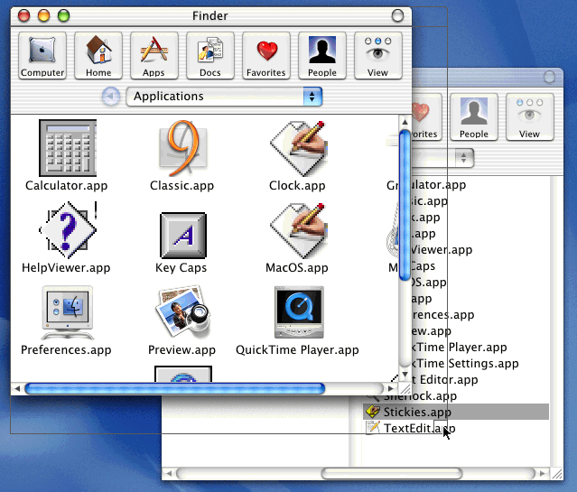
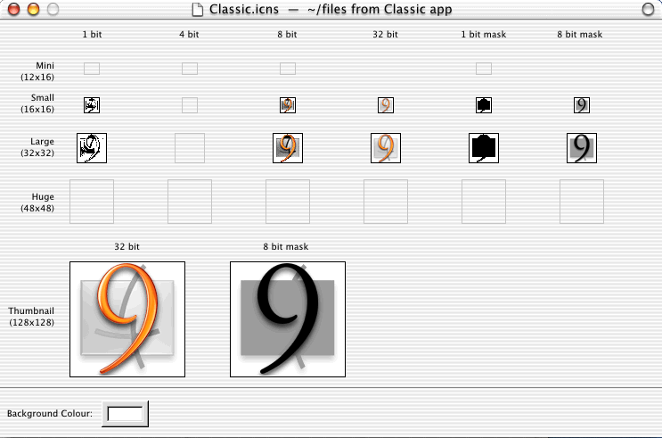

> 导航：[总目录](../../../README.md) · [documentation](../../../_indexes/documentation.md) · [Carbon Porting Guide](Introduction%20to%20Carbon%20Porting%20Guide.md)


[Next](Building%20Carbon%20Applications.md)[Previous](Introduction%20to%20Carbon%20Porting%20Guide.md)

# Preparing Your Code for Carbon

This chapter describes the modifications you need to make to your source code to create a Carbon application. These changes are divided into three categories:

- Essential changes. Applications that follow these steps should run on Mac OS X, but may suffer from performance or responsiveness problems.
- Other porting issues. These are topics that could affect the porting process depending on the capabilities and needs of your application.
- Optimization steps. This section describes steps and issues to consider so your application can take best advantage of Mac OS X. Apple highly recommends that you address at least some of the topics described in this section.

For more details about porting an application, see [A Porting Example](A%20Porting%20Example.md#apple-f4xwc4dqnrsv64tfmyxwi33df52wszbpkridgmbqgaydsojrfvbuqmrqgqwviucykjcummjqge)

Technote TN2003, “Moving Your Code to Mac OS X,” contains additional porting information that you may find useful:

[http://developer.apple.com/technotes/tn/tn2003.html](https://developer.apple.com/technotes/tn/tn2003.html)

To make your job easier, begin by using the Carbon Dater tool to analyze the current compatibility level of your application.

Apple has developed a tool called Carbon Dater to analyze compiled applications and libraries for compatibility with Carbon. You can use Carbon Dater to obtain information about the compatibility of your existing code and the scope of your future conversion efforts.

Carbon Dater works by examining PEF containers in application binaries and CFM libraries. It compares the list of Mac OS symbols your code imports against Apple’s database of Carbon-supported functions.

Using Carbon Dater is a two-step process. You begin by dropping your compiled application or CFM library file onto the Carbon Dater tool. The tool examines the first PEF container in your file and outputs a text file named _filename_`.CCT` (Carbon Compatibility Test). You can drop more than one file onto the Carbon Dater tool to get a combined report, but the tool examines only the first PEF container in each file.

The CCT file contains a list of all the Mac OS functions referenced by your code. If applicable, it may also include information about your application’s use of direct access to low memory addresses or about resources stored in the system heap.

The second step is to send your CCT file to Apple for analysis. The information gathered by the Carbon Dater tool is used to create a compatibility report for your application. Attach the CCT file as an email enclosure (preferably compressed) and send it to `CarbonDating@apple.com`.

The CCT file you send to Apple will be processed by an automated analysis tool. The analyzer compares the list of Mac OS functions your code calls against Apple’s Carbon API database, and returns a report to you by email. This report is an HTML document that provides a snapshot of your application’s Carbon compatibility level.

For each Mac OS function your code calls that is not fully supported in Carbon, the compatibility report specifies whether the function is

- supported but modified in some way from how it is used in previous versions of the Mac OS
- supported but not recommended—that is, you can use the function, but it may not be supported in the future
- unsupported
- not found in the latest version of Universal Interfaces

The report includes a chart that shows the percentages of Mac OS functions in each category. For many functions, the report also describes how to modify your application. For example, text accompanying an unsupported function might describe a replacement function or recommended workaround.

This section of the compatibility report lists instances where your code makes a direct access to low memory. For information on how to access low memory correctly, see [Remove Direct Access to Low-Memory Globals](#apple-f4xwc4dqnrsv64tfmyxwi33df52wszbpkridgmbqgaydsojrfvbuqmrqgiwueqkcineecskj). If the tested code was built with symbolic debugging information enabled, the report specifies the names of the routines that access low memory directly.

Many of the low-memory accessor functions currently defined in the Universal Interfaces are implemented as inline macros that insert load or store instructions directly in your code. Carbon Dater can’t tell the difference between one of these macros and the code you wrote yourself, so you’ll need to verify that you’re using an approved accessor function.

This section of the compatibility report lists resources that have their system heap bit set, indicating they should be stored in the system heap. For each flagged resource, the report lists the resource type and ID, as well as the resource name if one is available. Applications do not have access to the system heap in Mac OS X, so Carbon applications cannot store resources there.

You can obtain additional compatibility reports as often as you wish. This is a good way to see how much progress you’ve made in your porting effort. Also, as work on Mac OS X and Carbon continues, there may be changes in the level of support for some functions, which Carbon Dater may bring to your attention.

To determine compatibility, Carbon Dater uses the Carbon Specification available at

[http://developer.apple.com/documentation/carbon/](https://developer.apple.com/documentation/carbon/)

You can browse this document for general compatibility information. Apple updates the Carbon Specification regularly to reflect the latest state of the Carbon APIs.

This section describes the bare minimum steps you must take to port your application to Carbon. Applications ported by following these instructions will run on Mac OS 8 and 9 and Mac OS X, but may not function optimally. To further improve performance and responsiveness, see the guidelines in [Optimizing Your Code for Carbon](#apple-f4xwc4dqnrsv64tfmyxwi33df52wszbpkridgmbqgaydsojrfvbuqmrqgiwueqkciraukrcg).

In addition to reading this section, you should also read the information provided in [Additional Porting Issues](#apple-f4xwc4dqnrsv64tfmyxwi33df52wszbpkridgmbqgaydsojrfvbuqmrqgiwueqkcinaumq2i) before beginning to port your application.

Because Mac OS X requires 100% native PowerPC code, you will need to remove any dependencies on 68K instructions. This applies to custom definition procedures (defprocs) and plug-ins as well as your main application. See [Move Custom Definition Procedures Out of Resources](#apple-f4xwc4dqnrsv64tfmyxwi33df52wszbpkridgmbqgaydsojrfvbuqmrqgiwueqkcijdusscb) and [Custom Definition Procedures](New%20Carbon%20Functions.md#apple-f4xwc4dqnrsv64tfmyxwi33df52wszbpkridgmbqgaydsojrfvbuqmrqgywueqkcindekr2h) for information about new functions for creating native defprocs.

Your transition to Carbon will be easier if your application already compiles using the latest version of Universal Interfaces (as of this writing, the most recent version is 3.4). Although updating is not a requirement, doing so will minimize the number of compatibility problems. Once your project compiles without errors, you should switch to the Carbon headers provided with the Carbon SDK.

You’ll find the most recent Universal Interfaces on Apple’s website at

[http://developer.apple.com/sdk/](https://developer.apple.com/sdk/)

The Carbon SDK contains the headers, stub libraries, extensions and other material that you will need to build your Carbon application. You can download it from the following website:

[http://developer.apple.com/carbon/index.html](https://developer.apple.com/carbon/index.html)

To ease the transition to Carbon, you should initially focus on getting your application running on Mac OS 8 and 9 with the CarbonLib extension. Then you can test your application on Mac OS X.

Note that just because your Carbon application runs on Mac OS 8 and 9, there is no guarantee that it will correctly run on Mac OS X. For example, Mac OS X is stricter about direct casting of types, so what is allowable on Mac OS 8 and 9 may not work on Mac OS X.

`CarbonAccessors.o` is a static library that may help ease your transition to Carbon by allowing you to begin using certain Carbon features while continuing to link against `InterfaceLib` and other non-Carbon libraries.

Because many toolbox data structures are opaque in Carbon, one of the first steps you should take in porting your application is to begin using the new accessor functions. It’s easier to do this if you can continue compiling as a classic `InterfaceLib`-based application, because you can keep your application running and qualify your changes incrementally. `CarbonAccessors.o` facilitates this by providing implementations of the accessor functions for opaque toolbox data structures. For a list of the functions in `CarbonAccessors.o`, see [Table A-3](New%20Carbon%20Functions.md#apple-f4xwc4dqnrsv64tfmyxwi33df52wszbpkridgmbqgaydsojrfvbuqmrqgywviucykjcummjrgq).

We recommend that as the first step in the porting process, you add `CarbonAccessors.o` to your link, and then begin modifying your source code to use Carbon accessor functions, one file at a time. You can do this by setting the following conditional macro at the top of each source file you plan to convert:

```
#define ACCESSOR_CALLS_ARE_FUNCTIONS 1
```

This conditional makes the prototypes for the accessor functions available to that source file.

When you have converted all of your source files to use accessor functions, you can add the following conditional macro to your build options to ensure that you are no longer directly accessing any opaque toolbox data structures:

```
#define OPAQUE_TOOLBOX_STRUCTS 1
```

At this point you have an application that uses the Carbon accessor functions but does not link against the Carbon libraries. You can continue to run and test your application on any Mac OS release, because it does not require the `CarbonLib` extension at runtime.

The next step in the conversion process is to allow only Carbon-compatible APIs in your code by adding the following conditional macro to your build options:

```
#define TARGET_API_MAC_CARBON 1
```

You can now begin modifying your code so that it no longer calls functions that are obsolete in Carbon. At this point you must stop linking against `InterfaceLib` (and `CarbonAccessors.o`) and begin linking against `CarbonLibStub` (that is, the `CarbonLib` shared library).

You cannot directly cast values of type `DialogPtr` or `WindowPtr` to a `GrafPtr`, but instead you must use the new functions described in [Casting Functions](New%20Carbon%20Functions.md#apple-f4xwc4dqnrsv64tfmyxwi33df52wszbpkridgmbqgaydsojrfvbuqmrqgywueqkbivbeksck). Direct casting will not affect compilation, but it will cause crashes on Mac OS X.

Carbon introduces significant changes to the Mixed Mode Manager. Static routine descriptors are not supported, and you must use the system-supplied functions for creating, invoking, and disposing of universal procedure pointers. For example, Carbon provides the following functions to replace the macros previously used to create, invoke, and dispose of universal procedure pointers:

```
ControlActionUPP NewControlActionUPP (ControlActionProcPtr userRoutine);
void InvokeControlActionUPP (ControlRef theControl,
                             ControlPartCode partCode
                             ControlActionUPP userUPP);
void DisposeControlActionUPP (ControlActionUPP userUPP);
```

Similar functions are provided for all supported UPPs. Note that Carbon does not support the generic functions `NewRoutineDescriptor`, `DisposeRoutineDescriptor`, and `CallUniversalProc`.

On Mac OS 8 and 9, the UPP creation functions allocate routine descriptors in memory just as you would expect. On Mac OS X, the implementation of UPPs depends on various factors, including the object file format you choose. Universal procedure pointers will allocate memory if your application is compiled as a CFM binary, but are likely to return a simple procedure pointer if your application is compiled as a Mach-O binary.

On Mac OS X, UPPs are opaque types that may or may not require memory allocation, depending on the particular function and the runtime they are created in. By using the system-supplied UPP functions, your application will operate correctly in either environment. You must dispose of your UPPs using the system-supplied functions to ensure that any allocated memory is released. See [Consider Mach-O Executables](#apple-f4xwc4dqnrsv64tfmyxwi33df52wszbpkridgmbqgaydsojrfvbuqmrqgiwueqkcijbuiq2c) for more information about the differences between these formats.

Your own plug-ins must be compiled as PowerPC code, so there is no need to create universal procedure pointers for them. Use normal procedure pointers instead.

The resource-based format for custom definition functions (such as WDEFs, CDEFs, and so on) is defined to start with 68K instructions. Because Mac OS X does not support 68K code, you must move your custom definition functions out of resources and compile them directly in your application.

To access your custom code, you can do either of the following:

- Use new Carbon functions (`CreateCustomXXXX`) to create your objects. For example, to create a custom window, pass a universal procedure pointer (UPP) to your window definition function into the `CreateCustomWindow` function:

```
OSStatus CreateCustomWindow (
    const WindowDefSpec *def,
    WindowClass windowClass,
    WindowAttributes attributes,
    const Rect *contentBounds,
    WindowRef *outWindow
);
```

  You can specify your function pointer in the `WindowDefSpec` structure by taking the following steps:

```
WindowDefSpec defSpec;
defSpec.defType = kWindowDefProcPtr;
defSpec.u.defProc = NewWindowDefUPP( MyWindowDefProc );
```
- Map the old `procID` s to pointers to your custom code using the `RegisterXXXDefinition` functions. For example, if you still want to use `NewCWindow` to create your window, you should call `RegisterWindowDefinition`, passing it the resource ID referenced by your `procID`s and a UPP to your window definition function:

```
OSStatus RegisterWindowDefinition (
    SInt16 inResID,
    const WindowDefSpec *inDefSpec
);
```

  When `NewCWindow` receives a `procID` that isn’t one of the standard system `procID`s, it will look in the mapping table to find the function that’s registered for the resource ID embedded in the `procID`.

  For more details about changes to custom definition procedures, see [Custom Definition Procedures](New%20Carbon%20Functions.md#apple-f4xwc4dqnrsv64tfmyxwi33df52wszbpkridgmbqgaydsojrfvbuqmrqgywueqkcindekr2h).

Low-memory globals are system and application global data located below the system heap in the Mac OS 8 and 9 runtime environment. They typically fall between the hexadecimal addresses $100 and $2800. Carbon applications can continue to use many of the existing low-memory globals, although in some cases the scope and impact of the global has changed. But in all cases, Carbon applications must use the supplied accessor routines to examine or change global variables. Attempting to access them directly with an absolute address will crash your application when running on Mac OS X.

The complete list of low-memory globals supported in Carbon is not yet finalized, but your transition to Carbon will be easier if you follow these guidelines:

- Use high-level calls instead of low-memory accessors whenever possible. For example, use `GetGlobalMouse` instead of `LMGetMouseLocation`.
- If a high-level call is not available, use an accessor function.
- Rely on global data only from Mac OS managers supported in Carbon. For example, because the driver-related calls in the Device Manager are not supported in Carbon, low-memory accessors like `LMGetUTableBase` are not likely to be available. Similarly, direct access to hardware is not supported in Carbon, so calls like `LMGetVIA` will no longer be useful.

Table 2-1 lists some frequently used low-memory accessors that are unsupported in Carbon. Refer to the Carbon Specification for the most recent information.

__Table 1-1__  Summary of Carbon low memory accessor support

| Accessor | Replacement |
| `LMGet/SetAuxCtlHead` | not supported |
| `LMGet/SetAuxWinHead` | not supported |
| `LMGet/SetCurActivate` | not supported |
| `LMGet/SetCurDeactive` | not supported |
| `LMGet/SetDABeeper` | not supported |
| `LMGet/SetDAStrings` | `GetParamText, ParamText` |
| `LMGet/SetDeskPort` | not supported |
| `LMGet/SetDlgFont` | not supported |
| `LMGet/SetGhostWindow` | not supported |
| `LMGetGrayRgn` | `GetGrayRgn` |
| `LMGetMBarHeight` | `GetMBarHeight` |
| `LMSetMBarHeight` | not supported |
| `LMGet/SetMBarHook` | not supported |
| `LMGet/SetMenuHook` | not supported |
| `LMGetMouseLocation` | `GetGlobalMouse` |
| `LMSetMouseLocation` | not supported |
| `LMGet/SetPaintWhite` | not supported |
| `LMGetWindowList` | `GetWindowList` |
| `LMSetWindowList` | not supported |
| `LMGet/SetWMgrPort` | not supported |

The debugging version of `CarbonLib` on Mac OS 8 and 9 checks for the validity of ports and windows, so using it is a good way to quickly identify potential problem areas. However, you should be aware that it runs considerably slower than the standard version of the library.

If you plan to build your application on Mac OS X using Project Builder, be aware that the standard flat Mac OS 8 and 9 headers (such as `Dialogs.h` and `MacWindows.h`) do not correspond directly with Mac OS X frameworks. To address this issue, you can do either of the following:

- Add `-I /Developer/Headers/FlatCarbon` to the cc compiler command line when building your application. The files in the FlatCarbon folder act as a compatibility layer, mapping the standard flat header includes to the proper frameworks.
- Replace your flat headers with the single include statement `#include <Carbon/Carbon.h>`. This statement lets you access the Carbon framework directly. You should choose this method if you plan to build exclusively on Mac OS X, as it will improve compile times.

If you choose not to include the path to FlatCarbon at build time, you can also conditionalize your code to use the proper headers :

```c
#if <Some flag for building on X is set>
        #include <Carbon/Carbon.h>
#else
        <The usual Mac OS 8 and 9 includes>
#endif
```


From the list given to you by Carbon Dater, you should replace all functions listed as “out” or “modified” with their suggested replacements. Depending on the function it may have been easier to remove them earlier in the process (such as removing A5 functions when purging all 68K-related code).

Carbon requires you to replace some older system services with newer ones as follows:

- Navigation Services replaces the Standard File Package. For documentation, see the web site:

  [http://developer.apple.com/documentation/Carbon/Reference/Navigation_Services_Ref/](https://developer.apple.com/documentation/Carbon/Reference/Navigation_Services_Ref/)
- The Carbon Printing Manager replaces the Classic Printing Manager. For documentation, see the web site:

  [http://developer.apple.com/documentation/carbon/Reference/CarbonPrintingManager_Ref/](https://developer.apple.com/documentation/carbon/Reference/CarbonPrintingManager_Ref/)

On Mac OS X, Carbon applications that do not contain a `'plst' 0` resource will open in the Classic compatibility environment and will not gain all the advantages of Mac OS X. To ensure that Mac OS X properly recognizes your application, your application must include a resource of type `'plst'` with ID 0 or a plist file in a bundle. You can also store additional information about your application in a plist resource or file. See [Consider Using Bundles](#apple-f4xwc4dqnrsv64tfmyxwi33df52wszbpkridgmbqgaydsojrfvbuqmrqgiwueqkcijdeqski) for more information about plists and bundles.

Even if you include a `'plst' 0` resource, you can still launch the application in the Classic environment:

- If you include an empty `'plst' 0` resource, a “user choice” checkbox appears in the Finder’s Get Info window, allowing the user to choose whether to launch the application in Mac OS X or the Classic compatibility environment. The default is Mac OS X. (This checkbox feature does not appear if you include only a `'carb' 0` resource).
- By specifying options in the `'plst' 0` resource, you can force the application to launch into either Mac OS X or the Classic environment.

If your application does not contain a resource fork, it launches in Mac OS X by default.

See _Inside Mac OS X: System Overview_ for more information about specifying Launch Services keys in your plist file or resource.

Carbon applications running on Mac OS X automatically adopt the Aqua interface. Because Aqua provides a Quit menu item under the Application menu, your application does not need to add one to the File menu. As long as your application supports the Quit Apple event, it will quit normally. However, because the Mac OS 8 and 9 user interfaces still require a Quit menu item, you must conditionalize your code to add one in the File menu when running under Mac OS 8 or 9. The easiest way to identify the user interface is to check the `gestaltMenuMgrAquaLayoutBit` bit of the `gestaltMenuMgrAttr` gestalt selector. If the bit is set, the application is using the Aqua interface, and you should not add a Quit item to the File menu.

For example, you could use code such as the following to conditionalize your menus:

```
Gestalt( gestaltMenuMgrAttr, &result);
if (result & gestaltMenuMgrAquaLayoutMask)
    menuBar = GetNewMBar(rSysXMenuBar);
else
    menuBar = GetNewMBar(rMenuBar);
```

This method uses two different `'MBAR'` resources, each with a different `'MENU'` resource for the File menu.

If you must enable and disable the Quit menu item programmatically, you can use the new functions `DisableMenuCommand` and `EnableMenuCommand` to do so. Pass `NULL` for the menu reference and `'quit'` for the command ID.

In addition to the steps described in the [Essential Steps for Porting Your Application](#apple-f4xwc4dqnrsv64tfmyxwi33df52wszbpkridgmbqgaydsojrfvbuqmrqgiwueqkcirceuskb), you should be aware of these other issues that can affect the porting process.

Just like system software, `CarbonLib` also exists in various versions, each of which contains different levels of functionality. Because some calls to `CarbonLib` merely call through to the underlying system software, the functions available can depend on the system software version.

| CarbonLib version | Reflects Universal Interfaces version | Compatible back to | Notes |
| --- | --- | --- | --- |
| 1.0 | 3.3.1 | Mac OS 8.1 | _Shipped with Mac OS 9. Do not develop with this version._ |
|  |  |  |  |
| 1.0.4 | 3.3.1 | Mac OS 8.1 | _Includes the following_: |
|  |  |  | All Carbon APIs available with Mac OS 8.1 |
|  |  |  | Toolbox accessor functions |
|  |  |  | Control, Window, and Menu properties |
|  |  |  | Appearance Manager 1.1 |
|  |  |  | Navigation Services |
|  |  |  | Core Foundation |
|  |  |  | Carbon Printing Manager |
|  |  |  |  |
| 1.2 | 3.4 | Mac OS 8.6 | _Adds the following:_ |
|  |  |  | DataBrowser |
|  |  |  | Carbon Event Manager |
|  |  |  | XML |
|  |  |  | URL Access Manager |
|  |  |  | Apple Type Services for Unicode Imaging (ATSUI) |
|  |  |  | Interface Builder Services |
|  |  |  | Font Sync |
|  |  |  | Apple Help Viewer |
|  |  |  | Font Management |
|  |  |  |  |
|  |  | Mac OS 9 | _Adds the following:_ |
|  |  |  | Keychain Manager |

Because Mac OS X is a truly preemptive system, any number of applications may be drawing into their windows at the same time. Carbon applications, therefore, cannot draw outside their own windows. In the past you could call the `GetWMgrPort` function and use that port to draw anywhere on the screen. This port does not exist in Mac OS X, so you will need to use alternate methods to implement window dragging and resizing. For more detailed information about handling windows in Carbon, see [Window Manager Issues](#apple-f4xwc4dqnrsv64tfmyxwi33df52wszbpkridgmbqgaydsojrfvbuqmrqgiwueqkcincegqke).

Carbon applications should not patch traps because there is no trap table in Mac OS X. The Patch Manager is unsupported, and functions like `GetTrapAddress` and `SetTrapAddress` are not available in Carbon. You can, of course, conditionalize your code and continue to patch traps when running under Mac OS 9, but your programs will be much easier to maintain if you avoid patching entirely.

In Mac OS X, every process has its own address space, so attempting to pass a pointer to another process is meaningless at best and may cause your application to misbehave. Threads or tasks created by an application (for example, Multiprocessing Services tasks or Thread Manager threads) occupy the application’s address space, so you can pass pointers between them.

While writing to your application’s resource fork is acceptable (if not encouraged) in Mac OS 8 and 9, you should not do so in Mac OS X, as there are many common instances that will cause such write attempts to fail. Some examples:

- when file-system permissions don't allow itwhen the application resides on a network serverwhen the application resides on read-only media

If you have application-specific data that you need to save, you should store them in a preferences file.

Ideally you should remove resource forks from your application altogether and place your resources in the data fork (see [Move Resources to Data Fork–Based Files](#apple-f4xwc4dqnrsv64tfmyxwi33df52wszbpkridgmbqgaydsojrfvbuqmrqgiwueqkcinbeer2k). Note, however, that such resources are also read-only.

Note that you can still write to other resource forks (such as in document files).

If you use OpenGL in your application, you should continue to link to the OpenGLLibrary, OpenGLMemory, and OpenGLUtility stubs as you would for non-Carbon applications. On Mac OS X these functions will link with the OpenGL framework.

Note that if you are building a Mach-O–based Carbon application that uses the OpenGL header `aglMacro.h`, you must make the following call before creating any OpenGL contexts:

```
aglConfigure(AGL_TARGET_OS_MAC_OSX,GL_TRUE);
```

Do not make this call from CFM-based Carbon applications.

See [Consider Mach-O Executables](#apple-f4xwc4dqnrsv64tfmyxwi33df52wszbpkridgmbqgaydsojrfvbuqmrqgiwueqkcijbuiq2c) for more information about the Mach-O format.

Carbon applications can load non-Carbon plug-ins. You must make sure, however, that your plug-ins do not link to `InterfaceLib`. On Mac OS 8 and 9 this will not cause a problem, but it can cause a crash on Mac OS X (because `InterfaceLib` is unavailable).

You can use the MPW tool DumpPEF with the `-loader i library` option to find unintentional links to non-Carbon libraries.

In some cases, your CFM application may need to call code that is not Carbon-compliant to maintain cross-platform compatibility between Mac OS 8 and 9 and Mac OS X. For example, say your application makes calls to the Device Manager. The Device Manager is not part of Carbon as it cannot run on Mac OS X. However, its replacement, I/O Kit, is a Mac OS X technology that cannot run on Mac OS 8 and 9. The only way to maintain your application’s functionality is to fork your code and make calls to either the Device Manager or I/O Kit, depending on the platform.

Forking your code in this manner brings up some build issues. For example, if you had set preprocessor directives to build with Carbon, the Universal Interfaces will conditionalize out any non-Carbon functions, and attempting to call non-Carbon functions will generate a compiler error indicating missing prototypes.

The easiest way to work around this problem is to compile your noncompliant code separately, using non-Carbon headers. You can package your non-Carbon code as a shared library, which you can then call from your application.

The safest method for calling non-Carbon functions in shared libraries is to prepare the fragment and locate the symbols manually. That is, call `GetSharedLibrary` to prepare the library and use `FindSymbol` to get the symbol address. You can then call the function through the returned pointer. This method gives you maximum flexibility in handling missing symbols or libraries. See the sample code included with the Mac OS X Developer Tools CD for examples.

This section addresses common issues encountered when porting code that draws or otherwise manipulates windows.

In Mac OS X, all windows are buffered. A window’s contents are written first to a buffer and then the Window Manager periodically refreshes the screen with the contents of the buffers. As you don’t automatically have control over when a window’s contents are written to the screen, you may need to make some minor changes to your windowing code to account for buffering.

If you are writing periodically to the screen in a loop that doesn’t call `WaitNextEvent`, you must call `QDFlushPortBuffer` to flush your drawing to the screen. Otherwise, you are only updating the contents of the buffer.

If you draw directly into a window’s pixel map, QuickDraw cannot tell which parts of the pixel map are dirty. To work around this, you must do one of the following:

- Call `QDFlushPortBuffer` explicitly, passing a nonempty region parameter describing the modified area.
- Call, `QDGetDirtyRegion` to get the port’s dirty region, add in the area you modified by calling `UnionRgn`, and then set the updated dirty region by calling `QDSetDirtyRegion`. The Window Manager will the update the region during the next call to `WaitNextEvent`.

If you draw directly into the pixel map of your windows without using QuickDraw, you’ll need to wrap those blits with two new calls that signal the Window Manager not to update the window until your drawing operation completes. Here are the basic steps:

1. Use the `GetWindowPort` function to get the window’s port.
2. Use the `LockPortBits` function to lock the port’s pixel map. Note that this function is different from `LockPixels`; they are not interchangeable.
3. Use the `GetPortPixMap` function to get a handle to the port’s pixel map. The `baseAddr` field of the `PixMap` structure contains the base address of the actual port bits in memory.
4. Perform your drawing operation as quickly as possible. Because the `LockPortBits` function blocks all other updates to the port, it’s important that your drawing code be small and fast to avoid impacting system performance.
5. Call the `UnlockPortBits` function to release the port. The `PixMapHandle` is automatically disposed when you call this function. Do not attempt to reuse the handle.

Note that the `UnlockPortBits` function does not initiate a window update, it merely allows any pending or future updates to occur. An update is initiated either by the `BeginUpdate/EndUpdate` routines or when the `QDFlushPortBuffer` function is called.

Prior to Carbon and Mac OS X, any Mac application could access the Window Manager port, which included all available screens. Using that port, an application could write directly to the screen on top of all windows. Developers used this capability to implement a number of features, such as custom window grow outlines and custom window dragging.

Because recent releases of Mac OS 8 and 9 offer improved Window Manager functionality, as well as robust drag-and-drop support through the Drag Manager, many applications no longer need to use the Window Manager port. This is a good thing, because in Mac OS X, there is no Window Manager port, and Carbon provides no access to the Window Manager port for applications running in Mac OS 8 and 9.

The Carbon Window Manager does supply alternate mechanisms to implement features that may have relied on use of the Window Manager port. To learn more about when to use these mechanisms, see [Window Dragging and Resizing Q&A](#apple-f4xwc4dqnrsv64tfmyxwi33df52wszbpkridgmbqgaydsojrfvbuqmrqgiwueqkcijcemrkg).

If your application is drawing in the Window Manager port and you don’t see an alternate mechanism described, you should consider whether you can achieve the same results by modifying your user interface. If that’s not appropriate, send an email to `carbon@apple.com` explaining what you need and some APIs may be added to support additional features.

This section answers some frequently asked questions about dragging and resizing windows in Carbon and Mac OS X. For related information, see [Bypassing the Window Manager Port](#apple-f4xwc4dqnrsv64tfmyxwi33df52wszbpkridgmbqgaydsojrfvbuqmrqgiwueqkcijfeorcc).

- Q. What is the standard window dragging feedback supplied by `DragWindow`?

  A. In Mac OS X, if you call `DragWindow` for a buffered window, the Carbon Window Manager provides live dragging—that is, the contents of the window remain visible as a user moves the window around the screen.

  For a Carbon application running in Mac OS 8 or 9, `DragWindow` supplies the traditional outline feedback.
- Q. Can I still use `DragGrayRegion`?

  A. Although `DragGrayRegion` is fully supported in Carbon, it only applies to the current port. If you’re currently using `DragGrayRegion` with the Window Manager port, you should instead use one of the other mechanisms described here, such as calling `DragWindow` or using Carbon event handlers.
- Q. How do I implement custom window dragging—for example, to modify the position and shape of a tool palette as the user moves it to dock with another palette?

  A. You can implement features of this type using a Carbon event handler that tracks move events. When a user starts to drag a window, your handler receives a move window event (`kEventWindowOriginChange`). If you so request, your event handler can also receive periodic move window events as the user continues to drag the window. When the user completes the move, your handler receives a window moved event that includes the final position of the window. Your handler should get the `kEventParamCurrentBounds` parameter from the event, modify the `Rect` structure as needed, update the parameter, and then return `noErr`. In the example of docking a palette to another palette, you can either make changes to the palettes during the move as the current position warrants, or you can modify them after the move is complete.

  Keep in mind that using a move event handler that receives and processes events during the move may have an impact on performance.

  The Carbon Window Manager may also support custom dragging as part of an API to be added later. However, in Mac OS X this approach would only provide outline feedback for the drag, rather than live feedback.
- Q. What is the standard window resizing feedback supplied by `GrowWindow`?

  A. If you do not supply a resize event handler (described in another question), `GrowWindow` provides the traditional outline feedback.

  [Figure 1-1](#apple-f4xwc4dqnrsv64tfmyxwi33df52wszbpkridgmbqgaydsojrfvbuqmrqgiwueqkcircucrkk) shows the traditional outline feedback for resizing a window.

__Figure 1-1__  Outline feedback as a user resizes a window



- Q. How do I take advantage of live resizing in Mac OS X?

  A. If you want live resizing in Mac OS X—that is, the contents of a window remain visible and are adjusted and redrawn as needed as a user resizes the window—you must set the `kWindowLiveResizeAttribute` attribute on the window (either at creation time using `CreateNewWindow` or `CreateCustomWindow`, or by called `ChangeWindowAttributes` on an existing window) and then provide a resize event handler. The Carbon Window Manager sends an event (`kEventWindowBoundsChanged`) to your handler that indicates when it should adjust its scrollbars, redraw its content, and so on, as the user resizes the window.

  Carbon applications running in Mac OS 8 and 9 will only get outline resizing.
- Q. How do I implement custom window resize feedback—for example, to make the window snap to a grid as a user resizes the window?

  A. You can implement custom resizing using the same Carbon event handler you use to support live resizing. When a user starts to resize a window, your handler receives a resize window event (`kEventWindowBoundsChanged`). Your handler also receives periodic events as the user continues the resize. When the user completes the resize, your handler receives a window resized event that includes the final size. You can modify the `kEventParamCurrentBounds` parameter to constrain resizing to the desired grid as the user resizes, or do so after the resize is complete.

  If you are already using a custom window definition (WDEF) and you do not need live resizing, the easiest way to provide custom resize feedback is to support the new WDEF message `kWindowMsgGrowImageRegion`. Your WDEF receives this message periodically as the user moves the mouse during a resize operation. You can use this message to override the region that gets displayed during resize. To get these messages, your WDEF must report the `kWindowSupportsSetGrowImageRegion` feature bit.
- Q. Do I need to make any other changes to my existing WDEF?

  A. In most cases, you should not have to change your custom window definition. Prior to Carbon and Mac OS X, custom window definitions expected to draw directly in the global port. Now the Carbon Window Manager automatically sets up an appropriate port for drawing. When your window definition gets a draw message, it can go ahead and draw—but it shouldn’t assume it’s drawing in a global port, because it isn’t.
- Q. I use the Window Manager port to implement custom dragging with translucent drag images. How do I keep my translucent drag images without the Window Manager port?

  A. The Drag Manager has supported translucent dragging since version 1.3 and System 7.5.3. This feature is fully supported in Carbon, so you don’t need to write any custom code.
- Q. How can I capture a region of the current global screen?

  A. There is currently no way to do this in Carbon, although we are considering providing an interface that will allow you to grab an arbitrary screen region.

  You should not rely on calling `CreateNewPort` and determining the location of the screen bits from the new port. This behavior is no longer supported and code that relies on it is likely to break in future versions of Mac OS X.
- Q. How can I write a screen saver or other application that needs to take over the whole screen?

  A. Use the QuickTime functions `BeginFullScreen` and `EndFullScreen`. For more information, see the QuickTime documentation at

  [http://developer.apple.com/documentation/QuickTime/index.html](https://developer.apple.com/documentation/QuickTime/index.html)
- Q. I don’t want to modify my user interface and I don’t see anything described here that will help me do what I want to do.

  A. Tell us what you need and why, so that we can help provide a solution.

This section describes steps and issues you should consider for your application to take best advantage of the Mac OS X environment.

Memory management doesn’t change much for Carbon applications running on Mac OS 9. You’ll need all the code you use today to handle heap fragmentation, low memory situations, and stack depth.

However, there are some techniques you can adopt now that will help your application perform well when running on Mac OS X, which uses an entirely different heap structure and allocation behavior. The most significant change is in determining the amounts of free memory and stack space available. For example, you should avoid preallocating memory, as doing so will not make best use of the allocators available in Mac OS X. Similarly, using suballocators (allocating a block of memory and then allocating from within the block) is not suggested.

The functions `FreeMem`, `PurgeMem`, `MaxMem`, and `StackSpace` are all included in Carbon. You should, however, think about how and why you are using them. You’ll probably want to consider additional code to better tune your performance.

The `FreeMem`, `PurgeMem`, and `MaxMem` functions behave as expected when your Carbon application is running on Mac OS 9, but they’re almost meaningless when it’s running on Mac OS X, where the system provides essentially unlimited virtual memory. Although you can still use these calls to ensure that your memory allocations won’t fail, you shouldn’t use them to allocate all available memory. Allocating too much virtual memory will cause excessive page faults and reduce system performance. Instead, determine how much memory you really need for your data, and allocate that amount.

Before Carbon, you would use the `StackSpace` function to determine how much space was left before the stack collided with the heap. This routine could not be called at interrupt time, but was useful for preventing heap corruption in code using recursion or deep call chains. But because a Carbon application may have different stack sizes under Mac OS 9 and Mac OS X, the `StackSpace` function is no longer very useful. You shouldn’t rely on it for your logic to terminate a recursive function. It might still be useful as a safety check to prevent heap corruption, but for terminating runaway recursion, you should consider passing a counter or the address of a stack local variable instead of calling `StackSpace`.

The Carbon API does not include any subzone creation or manipulation routines. If you use subzones today to track system or plug-in memory allocations, you must use a different mechanism. For plug-ins, you might switch to using your own allocator routines. To prevent memory leaks, make sure all your allocations are matched with the appropriate dispose calls.

The Carbon API also removes the definition of zone headers. You can no longer modify the variables in a zone header to change the behavior of routines like `MoreMasters`. Simply call `MoreMasters` multiple times instead, which will allocate 128 master pointers each time. (You can also use the new Carbon call `MoreMasterPointers`, which allows you to specify the number of master pointers to allocate in one relocatable block.)

Polling for events or using a timer loop is allowable (but not recommended) on Mac OS 9, but it can cause severe performance problems on Mac OS X. In the Mac OS X multitasking environment, the OS gives time to all active processes. A process that is busy waiting for an event is considered active, even though it is not actually doing anything. Such waiting reduces the performance of other active processes. As an extreme example, multiple instances of a shared library, all polling for an event, can easily bog down the system. Instead of polling, your code should implement some sort of notification mechanism (such as an event queue or semaphore).

Note that triggering actions on null events (to blink the cursor, for example) does not work on Mac OS X, as the system will notify your application only when real events occur. To work around this issue you should use Carbon Event Manager timers.

To allow Mac OS X to manage memory efficiently, you should not prepare shared libraries at application launch time, but rather only when you need them. Also, try to avoid using initialization functions if possible. See _Mac OS Runtime Architectures_ for more information about initialization functions.

HFS Plus, the Mac OS Extended File Format, is the default file system for Mac OS X, so you should consider using HFS Plus APIs if you need to programmatically access files on hard drives. Some of the advantages of HFS Plus are as follows:

- support for long Unicode filenames (255 characters)
- support for files larger than 2 GB
- support for extended file attributes

See the File Manager documentation at

[http://developer.apple.com/documentation/carbon/Reference/File_Manager](https://developer.apple.com/documentation/carbon/Reference/File_Manager)

for more information about HFS Plus.

You can build Carbon applications in two object file formats: PEF, which uses the Code Fragment Manager introduced with PowerPC Macintosh computers, and Mach-O, which is the preferred format for Mac OS X. Depending on your needs, you may want to consider creating Mach-O-based Carbon applications. There are advantages and disadvantages.

Advantages:

- Applications get access to all native Mac OS X APIs such as Quartz and POSIX. CFM-based Carbon applications can access only Carbon APIs.
- Symbolic debugging is easier on Mac OS X (using GDB).
- You can take full advantage of the Interface Builder and Project Builder development tools on Mac OS X.

Disadvantages:

- Applications cannot run on Mac OS 8 and 9.
- Mach-O doesn’t support the existing CFM plug-in architecture.
- Programmatic manipulation of the Code Fragment Manager (for example, calling `GetSharedLibrary`) may not work as expected.

You can also package CFM-based code and Mach-O–based executables together in bundles (as described in [Consider Using Bundles](#apple-f4xwc4dqnrsv64tfmyxwi33df52wszbpkridgmbqgaydsojrfvbuqmrqgiwueqkcijdeqski)). Bundling creates file packages analogous to PowerPC/68K fat applications built during the transition to PowerPC. Such CFM/Mach-O packages will execute the CFM version of the application on Mac OS 8 and 9, and the Mach-O version on Mac OS X. See _Inside Mac OS X: System Overview_ for more information about the Mach-O format.

Eventually, as customer focus shifts to Mac OS X, you should concentrate on building Mach-O binaries.

While Mac OS X can handle application resources stored in the resource fork of an executable file, in general you should begin storing these resources in the data fork. The major reason for doing this is to maximize compatibilty when moving files between different file systems. Many computing environments and file copying tools recognize only single-fork files; copying uncompressed files usually results in the loss of any information stored in the resource fork.

The only exceptions at this time are the `'cfrg' 0` and `'plst' 0` (or `'carb' 0` ) resources, which must remain in the resource fork for CFM-based applications so the Mac OS X Finder can launch them properly.

In general you should use the Core Foundation CFBundle APIs to package and access resources in the data fork. While you can simply move your existing resource files to the data fork, a better solution is to save each resource as an individual data fork–based file. Doing so makes it much easier to access (and perhaps modify) any individual resource.

See [Consider Using Bundles](#apple-f4xwc4dqnrsv64tfmyxwi33df52wszbpkridgmbqgaydsojrfvbuqmrqgiwueqkcijdeqski) and _Inside Mac OS X: System Overview_ for more information about bundling resources.

A bundle is a Mac OS X concept that lets you store all the software resources and executable files that an application requires in one package. Essentially a directory or folder hierarchy, a bundle could contain any of the following:

- images, sounds, or other files used by the application
- localized character strings
- multiple executable versions of an application.

A bundle can contain multiple sets of resources, grouped by language, locale, and platform. By combining all these resources and executables in one package, you can create one version of your application that is localized for multiple languages and can run on multiple platforms.

On Mac OS X, a bundle hierarchy normally appears as a single file, unless the bundle bit is unset, in which case it appears as a folder hierarchy.

On Mac OS 8 and 9, a bundle appears as a folder hierarchy, because the system software does not have knowledge of bundles. For this reason you should generally place an alias to your application prominently in the top level folder where the user can find it.

For maximum compatibility, you should use the Core Foundation CFBundle APIs to access bundled resources and executable files. See the Core Foundation Bundle Services documentation at

[http://developer.apple.com/documentation/MacOSX/Conceptual/BPBundles/index.html](https://developer.apple.com/documentation/MacOSX/Conceptual/BPBundles/index.html)

Note that if you do not wish to adopt bundles at this time, you can include some of the information stored in a bundle’s `Info.plist` file in a resource of type `'plst'` with ID 0. Doing so allows you to specify attributes that provide information to the Finder (for example, what icons to use, what document types the application recognizes). You can also access data in the `'plst'` resource using Resource Manager or CFBundle APIs.

See _Inside Mac OS X: System Overview_ for more specific information about packaging files in bundles.

By linking with CarbonLib, your Carbon application will automatically register itself with the Appearance Manager and adopt the basic Aqua look and feel. You should make sure that your interface elements are Appearance Manager–compliant; generally this means using system-defined controls, menus, and windows as much as possible.

To provide the best user experience, however, you should take the additional time to modify dialog boxes, windows, icons, controls, and so on, to conform with the Aqua specification. Doing so ensures that your application will look its best on Mac OS X. For details, see the document _Aqua Human Interface Guidelines_ available at

[http://developer.apple.com/documentation/macosx/](https://developer.apple.com/documentation/macosx/)

For additional information on icons, see [Provide Thumbnail Icons for Your Application](#apple-f4xwc4dqnrsv64tfmyxwi33df52wszbpkridgmbqgaydsojrfvbuqmrqgiwueqkcinauqqsi).

You should also consider adding some new interface elements introduced with Aqua, such as the following:

- Sheets: Sheets are the new window-centric modal dialogs that slide down from the title bar. Sheet functions appear in `MacWindows.h`.
- Help Tags: A help tag is a little yellow text field that appears over a control when you roll the cursor on top of it. The tag typically describes or clarifies the control’s purpose. Help tags replace the Help balloons available on older Mac OS systems. Help tag functions appear in `MacHelp.h`.

The leftmost pull-down menu in Mac OS X is the application menu. To maximize space for other menus, you should adopt a short version of your application name (16 characters or less) for this menu. You should add this information in your application’s `InfoPlist.strings` file.

The information in this section supplements the document “Obtaining and Using Icons With Icon Services,” available at the Carbon documentation website at

[http://developer.apple.com/documentation/carbon/](https://developer.apple.com/documentation/carbon/)

In Mac OS X, a user may choose to display very large icons for the desktop, the application Dock, and so on. The Finder uses a high-quality scaling algorithm, supplied by Icon Services, to generate the variable-sized icons it needs. To help ensure a pleasing result for your application, you should provide a thumbnail icon and a thumbnail mask as part of the `'icns'` resource for your icon family. [Figure 1-2](#apple-f4xwc4dqnrsv64tfmyxwi33df52wszbpkridgmbqgaydsojrfvbuqmrqgiwueqkcineeersg) shows the icon family, including thumbnail icons, for `Classic.app` in Mac OS X.

__Figure 1-2__  Thumbnail icons in a `.icns` file, displayed in Icon Browser



A thumbnail icon is 128x128 pixels with 32-bit depth. A thumbnail mask is 128x128 pixels with 8-bit depth (there is no one-bit mask for a thumbnail). Within an icon family resource, you specify thumbnail elements with the following constants:

```
enum {
    kThumbnail32BitData = 'it32',
    kThumbnail8BitMask  = 't8mk'
};
```

You can use these icon types only for an icon element within an `'icns'` icon family, not for an individual icon or icon mask resource.

Your application can continue to provide small (16x16) and large (32x32) icons as a complement to its thumbnail icons, especially if you need to preserve certain fine details at smaller resolutions. Icon Services will pick the best available icon for a particular size, so providing additional icons gives it more flexibility and gives you more control.

As of this writing, some third-party resource editor applications support editing of thumbnail icons, so you can investigate to determine which one best meets your needs.

If you want to add a thumbnail icon or mask to an icon family yourself, you can do so with the Icon Services function `SetIconFamilyData`.

```
pascal OSErr SetIconFamilyData (
                        IconFamilyHandle iconFamily,
                        OSType iconType,
                        Handle h)
```

**`iconFamily`**
: A handle to an `iconFamily` data structure to be used as the target.

**`iconType`**
: A value of type `OSType` specifying the format of the icon data you provide. For a thumbnail icon, for example, you specify `kThumbnail32BitData` in this parameter. For a thumbnail mask, you specify `kThumbnail8BitMask`.

**`h`**
: A handle to the icon data you provide. For a thumbnail icon, the handle contains raw image data in the form of 128x128, four bytes per pixel, RGB data. For a thumbnail mask, the data is in the same format except that it is one byte per pixel.

When you are finished constructing the icon family, you can write it to a file with the `WriteIconFile` function. For more information on these functions, see the document “Obtaining and Using Icons With Icon Services.”

[Next](Building%20Carbon%20Applications.md)[Previous](Introduction%20to%20Carbon%20Porting%20Guide.md)

