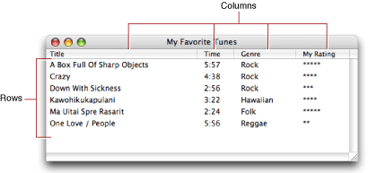
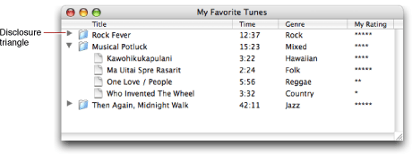
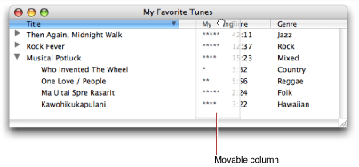
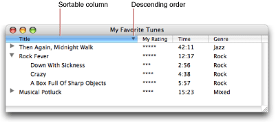
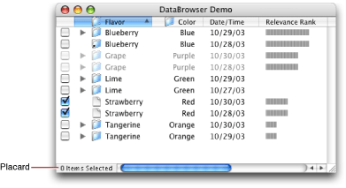
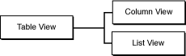
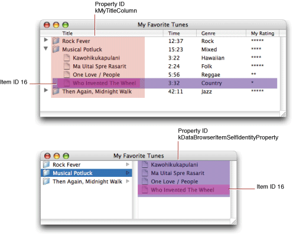

> 导航：[总目录](../../../README.md) · [documentation](../../../_indexes/documentation.md) · [Data Browser Programming Guide](Introduction%20to%20Data%20Browser%20Programming%20Guide.md)

[Next](Data%20Browser%20Tasks.md)[Previous](Introduction%20to%20Data%20Browser%20Programming%20Guide.md)

# Data Browser Concepts

This section provides definitions for key concepts needed to understand and use the data browser API. It contains information on the following topics:

- [The Data Browser User Interface](#apple-f4xwc4dqnrsv64tfmyxwi33df52wszbpkrbeilkciffeesscjbca). Provides a description of list and column views and shows a variety of implementations that call out the use of such things as disclosure triangles, placards, icons with text, relevance ranking, and date-time information.
- [How the Data Browser Works](#apple-f4xwc4dqnrsv64tfmyxwi33df52wszbpkrbeilkciffekqskizfa). Discusses how data is identified in each view, how your application specifies the identifying values, the tasks performed by callbacks you supply, how a view gets populated with data, the view hierarchy, and the types of data you can display.

The data browser can present data in two different kinds of displays—list view and column view. List view displays data in a list with one or more columns. A simple list with four columns—Title, Time, Genre, and My Rating—is shown in Figure 1-1.

__Figure 1-1__  Data displayed in a list view data browser

A list can display hierarchically arranged data, as shown in Figure 1-2. A disclosure triangle next to an item indicates that the item is a container. The user can open and close a container by clicking its disclosure triangle.

__Figure 1-2__  Hierarchical data displayed in a list view data browser

A list can be set up to provide the user with the option to move the columns, as shown in Figure 1-3. This example shows the user dragging the My Rating column so it is positioned between the Title column and the Time column.

__Figure 1-3__  A list with movable columns

List view can also support sorting, as shown in Figure 1-4. The triangle to the right of a column title indicates whether the current sorting order is ascending or descending. In the figure, the sorting order is descending. The user can change the sorting order by clicking the column title.

__Figure 1-4__  A sortable column

Column view provides in-place browsing using fixed navigation columns. Figure 1-5 shows the same data that is displayed in Figure 1-4, but in column view. Column view is typically used to navigate to items in a data hierarchy, while list view is used to find out information about a specific data item. The Finder is an example of an application that can display data in either list view or column view.

__Figure 1-5__  Data displayed using column view

A data browser can display various types of data. The list view data browser in Figure 1-6 shows checkboxes, icons, text, dates, and relevance indicators, but a data browser can also display pop-up menus and progress indicators.

__Figure 1-6__  A list view data browser that displays a variety of data

Other options available in a data browser include:

- Displaying items as active or inactive
- Providing a placard, similar to that shown in the lower left of the window in Figure 1-6
- Using items that are aliases

This section describes how the data browser works and provides information you need to know before you begin to write any code. You’ll find out:

- How list and column views are implemented and the impact that has on the functions available in the API
- How the data browser refers to data, including the assumptions it makes about the data you want to display
- The callbacks you can provide and what the most important callbacks—item-data and item-notification—handle
- How a data browser gets populated with data
- What types of data can be displayed by the data browser

The data browser implementation is object oriented. Its views—list and column—are derived from the table view class, as shown in Figure 1-7. Although there isn’t a user interface for table view, the data browser API defines a number of table-view functions, most of which can be used with list view and some of which can be used with column view.

__Figure 1-7__  Column and list views are subclasses of table view

The API contains sets of functions that format and set attributes for the data browser and other sets of functions that get, set, or operate on the displayed data. Although the formatting can be set up programmatically, it’s easier to set up the initial look and behavior of the data browser graphically using Interface Builder.

An _item_ in a data browser refers to the data displayed at a particular row and column intersection. Two values are associated with each item—an item ID and a property ID.

Keep in mind that the data browser displays data; it does not store data. It the responsibility of your application to store data and to supply data to the data browser when requested. Your application stores all data and sets up item IDs to refer to your stored data.

An _item ID_ is a unique 32-bit value that your application uses to refer to data. When you ask the data browser to display one or more items in a data browser, you provide an item ID for each data item. You can store the actual data in memory, on disk, or across a network. The data browser passes item IDs to the appropriate callback to get information about properties of the data items and to signal your application to provide the data associated with an item ID. Item IDs must be greater than 0. (Zero is reserved for use as the data browser constant `kDataBrowserNoItem`.) Item IDs can be pointer values, data file offsets, and 32-bit TCP/IP host addresses.

Item IDs are position independent—they specify data, not its specific position, in the data browser. The constant `kDataBrowserNoItem` is an API-defined item ID used by the data browser to mean none of the item IDs currently stored in the data browser.

Item IDs have slightly different interpretations in column view and in list view. In list view, an item ID refers to a row of data. In column view, an item ID refers to one entry in a column. In list view, to refer to an entry in a cell (a column, row intersection), you must supply the item ID as well as a property ID.

A _property ID_ is a nonzero, 32-bit unsigned integer value that uniquely identifies a list view column. Property IDs do not need to be ordered or sequential, but they cannot be values 0 through 1023 because those values are reserved by Apple. A property ID is typically defined as a four-character sequence. For example, a column that displays dates could be assigned the property ID `DATE`.

Columns in column view don’t use application-defined property IDs. Instead, they have the predefined property `kDataBrowserItemSelfIdentityProperty`.

[Figure 1-8](#apple-f4xwc4dqnrsv64tfmyxwi33df52wszbpkrbeilkdjjbeischijca) shows item IDs and property IDs in list and column view. Take a look at the song “Who Invented The Wheel.” List view displays the song title and its three attributes—time (length of song), genre, and a listener-assigned rating. Every attribute in this row has the same item ID—the value 16. This value is assigned by the application. The song title is an item that is uniquely identified by its item ID (`16`) and its property ID (`kMyTitleColumn`). The genre data for the song “Who Invented The Wheel” is uniquely identified by its item ID (`16`) and its property ID (`kMyGenreColumn`).

Data items in column view are uniquely identified by an item ID. In the case of columns, the property ID is always `kDataBrowserItemSelfIdentityProperty`, so it’s really the item ID that is the distinguishing value for an item. Compare the song title “Who Invented The Wheel” in list and column views. In each case the song title has the same item ID. But for list view the property ID is `kMyTitleColumn` whereas for column view it is the generic `kDataBrowserItemSelfIdentityProperty`.

__Figure 1-8__  An item is data at a row, column intersection

The data browser relies on callbacks provided by your application to take care of any tasks that relate to the displayed data, including populating the data browser with data. At a minimum, you must supply an _item-data callback_ that responds to requests for data; this is the main path of communication between the data browser and your application. Without a callback to respond data requests, the data browser is not able to display and update your data. In all cases except for the simplest list-view data browser, you also need to supply an _item notification callback_ to respond to messages sent to your application from the data browser. Messages are generated by the data browser in response to a changed condition in the browser. You’ll see how to write an item-data (`DataBrowserItemDataProcPtr`) and item-notification (`DataBrowserItemNotificationWithItemProcPtr`) callbacks in [Data Browser Tasks](Data%20Browser%20Tasks.md#apple-f4xwc4dqnrsv64tfmyxwi33df52wszbpkridgmbqgaydsnryfvbuqmrqgywviucykjcummjqge).

You can optionally set up callbacks to:

- Compare items for the purpose of sorting them
- Support drag and drop
- Provide a contextual menu in the data browser
- Provide help tags
- Control how custom items are drawn, tracked, and dragged. See [What Can Be Displayed](#apple-f4xwc4dqnrsv64tfmyxwi33df52wszbpkrbeilkciffekssdjfea) for more information on custom items.

You can find more information about using the optional callbacks in [Data Browser Tasks](Data%20Browser%20Tasks.md#apple-f4xwc4dqnrsv64tfmyxwi33df52wszbpkridgmbqgaydsnryfvbuqmrqgywviucykjcummjqge) and in _Data Browser Reference_. But right now let’s focus on the two most important callbacks you need to use—the item-data and item-notification callbacks.

The purpose of an item-data callback is to respond to data requests. The data browser sends an item ID and a property to the item-data callback. In response, your callback provides the data associated with the property. Properties are either the API-defined properties shown in [Table 1-1](#apple-f4xwc4dqnrsv64tfmyxwi33df52wszbpkrbeilkciveusr2djfbq) or a four-character sequence that you assign to represent a column in list view.

Your callback responds only to the properties that it makes sense to respond to for your application. [Table 1-1](#apple-f4xwc4dqnrsv64tfmyxwi33df52wszbpkrbeilkciveusr2djfbq) provides some guidance. For example, if the browser you create doesn’t display hierarchical data, then you don’t need to respond to the properties that support hierarchical data.

__Table 1-1__  Properties you can respond to in an item-data callback

| Properties | Respond to this . . . | Provide |
| `kDataBrowserItemIsActiveProperty` | when items can be active or inactive | `Boolean`; default `true` |
| `kDataBrowserItemIsSelectableProperty` | to support item selection | `Boolean`; default `true` |
| `kDataBrowserItemIsEditableProperty` | to support editing items | `Boolean`; default `false` |
| `kDataBrowserItemIsContainerProperty` | to support display of hierarchical data | `Boolean`; default `false` |
| `kDataBrowserItemParentContainerProperty` | to support display of hierarchical data | item ID for parent |
| `kDataBrowserContainerIsOpenableProperty` | to report whether a container in a hierarchical list can be opened | `Boolean`; default `true` |
| `kDataBrowserContainerIsClosableProperty` | to report whether a container in a hierarchical list can be closed | `Boolean`; default `true` |
| `kDataBrowserContainerIsSortableProperty` | to report whether a container in a hierarchical list can be sorted | `Boolean`; default `true` |
| `kDataBrowserItemSelfIdentityProperty` | to display data in column view | data to display |
| `kDataBrowserContainerAliasIDProperty` | to report whether a container is an alias or symbolic link to some other container | `DataBrowserItemID` |

You respond to an application-defined property by providing the data displayed for that item. Recall that application-defined properties are relevant only to list view, because you use them to distinguish one column in list view from another. For example, in [Figure 1-8](#apple-f4xwc4dqnrsv64tfmyxwi33df52wszbpkrbeilkdjjbeischijca), the song “Who Invented the Wheel” has four application-defined properties—each associated with a column, Title, Time, Genre, and MyRating. You define a four character sequence for each property—such as, `'NAME'`, `'TIME'`, `'GENR`', and `'RATE'`. When the data browser passes your item-data callback an item ID and one of these four properties, you supply the data to display in the column. For example, for the data shown in [Figure 1-8](#apple-f4xwc4dqnrsv64tfmyxwi33df52wszbpkrbeilkdjjbeischijca), if your item-data callback receives an item ID equal to `16` and the `GENR` property, you’d supply `Country` as the data.

The purpose of an item-notification callback is to respond to messages, as appropriate. The data browser sends an item ID and a message to your item-notification callback. The messages, shown in [Table 1-2](#apple-f4xwc4dqnrsv64tfmyxwi33df52wszbpkrbeilkciveuor2bizda), inform your application of changes to the state of your browser. You take action when it makes sense to do so for your application. For example, when a container is opened, you add items to the display by calling the function `AddDataBrowserItems`.

__Table 1-2__  Messages sent by the data browser to the item-notification callback

| Notification | Sent when . . . |
| `kDataBrowserItemAdded` | An item is added to the data browser |
| `kDataBrowserItemRemoved` | An item is removed from the data browser |
| `kDataBrowserEditStarted` | A text editing session is started for an item |
| `kDataBrowserEditStopped` | A text editing session is stopped for an item |
| `kDataBrowserItemSelected` | An item is added to the selection set |
| `kDataBrowserItemDeselected` | An item is removed from the selection set |
| `kDataBrowserDoubleClicked` | The user double clicks an item |
| `kDataBrowserContainerOpened` | A container is opened |
| `kDataBrowserContainerClosing` | A container is in the process of closing; at the start of the close operation. |
| `kDataBrowserContainerClosed` | A container is closed, after the close operation. |
| `kDataBrowserContainerSorting` | A container is about to be sorted. |
| `kDataBrowserContainerSorted` | A container is sorted. |
| `kDataBrowserUserStateChanged` | The user reformats the view for the target. For example, the user changes a sorting order or a column width. |
| `kDataBrowserSelectionSetChanged` | The selection set is modified. |
| `kDataBrowserTargetChanged` | The target changes to the specified item. |
| `kDataBrowserUserToggledContainer` | The user toggles a container (opened or closed) by clicking a disclosure triangle. This does not get sent if the container is programmatically opened or closed through one of the routines in the Data Browser API. |

To populate the data browser with data, your application can call these functions: `AddDataBrowserItems` and `SetDataBrowserTarget`. In response to each of these functions, the data browser invokes your item-data and item-notification callbacks, sending the callbacks a variety of data requests or messages. In this section, you’ll take a behind-the-scenes look at the requests and messages the data browser sends for these three scenarios:

- Calling the function `AddDataBrowserItems` to populate a simple list view data browser
- Calling the function `AddDataBrowserItems` to populate a hierarchical list view data browser
- Calling the function `SetDataBrowserTarget` to populate a column view data browser

You add items to a simple list of nonhierarchical data, similar to that shown in [Figure 1-1](#apple-f4xwc4dqnrsv64tfmyxwi33df52wszbpkrbeilkciffeqq2cijca) by calling the function `AddDataBrowserItems`. When you implement a simple list you need only to supply an item-data callback. You don’t need an item-notification callback. You’ll see exactly how to write an item-data callback in [Displaying Data in a Simple List View](Data%20Browser%20Tasks.md#apple-f4xwc4dqnrsv64tfmyxwi33df52wszbpkridgmbqgaydsnryfvbuqmrqgywueqkkinfeussi).

After you call the function `AddDataBrowserItems`, the data browser invokes your item-data callback to find out whether the items to be added are active, and then to obtain the data to display for each item. As you add each item, the data browser:

1. Sends a request for the active property for the item. The data browser passes you an item ID and the API-defined property `kDataBrowserItemIsActiveProperty`. If data in the list can be active or inactive, you can respond to this request by setting the active state of the item using the function `SetDataBrowserItemDataBooleanValue`. If items are always active, you don’t need to respond to the request.
2. Sends a request for data you want displayed in each column of the list. The data browser passes you an item ID and an application-defined property that specifies the column. You must respond to this request by calling the appropriate function for setting the data.

To populate a simple list with the six rows of data shown in [Figure 1-1](#apple-f4xwc4dqnrsv64tfmyxwi33df52wszbpkrbeilkciffeqq2cijca), the data browser would invoke your item-data callback to fetch data as needed. Each time the data browser needs data, it sends a request for the active property followed by a request for data.

To display hierarchical data, you must provide both an item-data callback and an item-notification callback. The data browser populates a list of hierarchical data similar to the way it populates a simple list, but there is a message and an additional data request sent to your callbacks. See [Figure 1-2](#apple-f4xwc4dqnrsv64tfmyxwi33df52wszbpkrbeilkciffeoq2iirda) for an example of such a list. When you call the function `AddDataBrowserItems`, the data browser:

1. Sends a message for each item ID provided to the list, to the item-notification callback informing you the item is added (`kDataBrowserItemAdded` ).
2. Sends a request for the active property for the item. The data browser passes you an item ID and the API-defined property `kDataBrowserItemIsActiveProperty`. If data in the list can be active or inactive, you can respond to this request by setting the active state of the item using the function `SetDataBrowserItemDataBooleanValue`. If items are always active, you don’t need to respond to the request.
3. Sends a request for data you want displayed for that item. The data browser passes you an item ID and an application-defined property that specifies the column. You must respond to this request by calling the appropriate function for setting the data.
4. The data browser sends a request to check whether the item is a container (`kDataBrowserItemIsContainerProperty`)
5. Repeats steps 2 through 4 for each application-defined property of each item ID.

You can populate a column view data browser, similar to that shown in [Figure 1-5](#apple-f4xwc4dqnrsv64tfmyxwi33df52wszbpkrbeilkciffegskjjfea), by calling the function `SetDataBrowserTarget`. You can set the target to any item in the hierarchy to have the data browser open with that item selected. When you call the function `SetDataBrowserTarget`, the data browser:

1. Sends a request to your item-data callback for the container property for the target item (`kDataBrowserItemIsContainerProperty`).
2. If the target item is a container, sends a container-opened message (`kDataBrowserItemContainerOpened`) to your item-notification callback. You respond by calling the function `AddDataBrowserItems`, supplying the items that are in the container. This function call sets off the requests and messages described previously in [Adding Items to a Simple List View](#apple-f4xwc4dqnrsv64tfmyxwi33df52wszbpkrbeilkdjjbegrkhifeq) for the function `AddDataBrowserItems`.

   If the target item is not a container, sends a request to your item-data callback to get the parent of the item (`kDataBrowserItemParentContainerProperty`).

The next set of steps describe what happens for a target item after you supply the item ID of the target’s parent:

1. Sends a container-opened message (`kDataBrowserContainerOpened`) to your item-notification callback. You callback responds by supplying the items in the container by calling the function `AddDataBrowserItems`.
2. After all items in the target’s parent container are added, the data browser sends a request for the is-sortable-property (`kDataBrowserItemIsSortableProperty`) to you item-data callback. If you don’t respond to this request, the data browser assumes the items in the container are sortable. If the container is sortable, the data browser invokes your item-compare callback if you supply one (see [Sorting Items](Data%20Browser%20Tasks.md#apple-f4xwc4dqnrsv64tfmyxwi33df52wszbpkridgmbqgaydsnryfvbuqmrqgywuerkji5eumske) ). Otherwise, it uses its built-in sorting routing.
3. If it is sortable, sends a container-sorting message (`kDataBrowserItemContainerSorting`) followed by a container-sorted message (`kDataBrowserItemContainerSorted`) to your item-notification callback.
4. Sends a target-changed message (`kDataBrowserTargetChanged`) to your item-notification callback.

The data browser API defines several display types that your application uses to designate the kind of data shown in a column. For these predefined types, the data browser automatically handles a number of tasks, such as drawing the item. If you prefer to draw the items and provide custom behavior, you can use a custom type.

Each display type is listed below. Only icon and text can be used for a column view data browser. All display types can be used for a list view data browser.

- _Text_. Columns with the display type `kDataBrowserTextType` display text in list view. For an example of a column that displays text, see [Figure 1-3](#apple-f4xwc4dqnrsv64tfmyxwi33df52wszbpkrbeilkciffekscijfcq).
- _Icon and text_. Columns with the display type `kDataBrowserIconAndTextType` display an icon with text next to it in list or column view. Your application provides the icon to draw in a cell and the text to draw next to the icon. For an example of a column that displays icon and text, see [Figure 1-5](#apple-f4xwc4dqnrsv64tfmyxwi33df52wszbpkrbeilkciffegskjjfea).
- _Icon_. Columns with the display type `kDataBrowserIconType` display icons in list view. Your application provides the icon to draw in a cell. You can also provide other drawing information such as color and an icon transformation type.
- _Date and time_. Columns with the display type `kDataBrowserDateTimeType` can display values, in list view, returned by the date and time utilities routines. Time can be displayed as a relative time value (Today, Yesterday, and so forth) or absolute. For an example of a column that displays time, see [Figure 1-6](#apple-f4xwc4dqnrsv64tfmyxwi33df52wszbpkrbeilkciffeischjjda).
- _Checkboxes_. Columns created with the display type `kDataBrowserCheckboxType` display checkboxes in list view. Checkboxes can be shown in three states—on, off, or mixed. To allow users to change the checkbox setting, your application sets the flag `kDataBrowserPropertyIsEditable`. For an example of a column that displays checkboxes, see [Figure 1-6](#apple-f4xwc4dqnrsv64tfmyxwi33df52wszbpkrbeilkciffeischjjda).
- _Progress indicators_. Columns with the display type `kDataBrowserProgressBarType` can show progress indicators in list view. The appearance of a progress indicator is defined by minimum, maximum, and current values.
- _Relevance indicators_. Columns with the display type `kDataBrowserRelevanceRankType` display relevance indicators in list view. The appearance of a relevance indicator is defined by minimum, maximum, and current values. For an example of a column that displays relevance indicators, see [Figure 1-6](#apple-f4xwc4dqnrsv64tfmyxwi33df52wszbpkrbeilkciffeischjjda).
- _Pop-up menus_. Columns with the display type `kDataBrowserPopupMenuType` display pop-up menus in list view. Your application provides the menu and sets the value of the menu item to display. To allow a user to choose menu items, your application sets the flag `kDataBrowserPropertyIsEditable`.
- _Custom_. Columns with the display type `kDataBrowserCustomType` display data, in list view, for which your application provides the routines needed to display the data and support custom behavior for tasks such as dragging or tracking.

[Next](Data%20Browser%20Tasks.md)[Previous](Introduction%20to%20Data%20Browser%20Programming%20Guide.md)

