> 导航：[总目录](../../../README.md) · [documentation](../../../_indexes/documentation.md) · [Data Browser Programming Guide](Introduction%20to%20Data%20Browser%20Programming%20Guide.md)


[Next](Document%20Revision%20History.md)[Previous](Data%20Browser%20Concepts.md)

# Data Browser Tasks

This chapter provides instructions and sample code on how to implement a data browser in an application. It provides general tips for using the data browser API and shows how to create list and column view data browsers. You’ll also see how to switch between the two views.

The chapter includes these sections:

- [Tips for Using the Data Browser API](#apple-f4xwc4dqnrsv64tfmyxwi33df52wszbpkridgmbqgaydsnryfvbuqmrqgywugskijbbusrcc)
- [Displaying Data in a Simple List View](#apple-f4xwc4dqnrsv64tfmyxwi33df52wszbpkridgmbqgaydsnryfvbuqmrqgywueqkkinfeussi)
- [Displaying Hierarchical Data in a List View](#apple-f4xwc4dqnrsv64tfmyxwi33df52wszbpkridgmbqgaydsnryfvbuqmrqgywueqkkizeeeqkd)
- [Displaying Data in a Column View](#apple-f4xwc4dqnrsv64tfmyxwi33df52wszbpkridgmbqgaydsnryfvbuqmrqgywueqkki5dukskj)
- [Switching Between List View and Column View](#apple-f4xwc4dqnrsv64tfmyxwi33df52wszbpkridgmbqgaydsnryfvbuqmrqgywueqkkjfceuqkc)
- [Supporting Text Editing](#apple-f4xwc4dqnrsv64tfmyxwi33df52wszbpkridgmbqgaydsnryfvbuqmrqgywugskii5duiq2e)
- [Applying an Operation to Each Item](#apple-f4xwc4dqnrsv64tfmyxwi33df52wszbpkridgmbqgaydsnryfvbuqmrqgywuerkji5begq2f)
- [Sorting Items](#apple-f4xwc4dqnrsv64tfmyxwi33df52wszbpkridgmbqgaydsnryfvbuqmrqgywuerkji5eumske)
- [Supporting Drag and Drop](#apple-f4xwc4dqnrsv64tfmyxwi33df52wszbpkridgmbqgaydsnryfvbuqmrqgywuerkjivbeuqsh)
- [Providing a Contextual Menu](#apple-f4xwc4dqnrsv64tfmyxwi33df52wszbpkridgmbqgaydsnryfvbuqmrqgywuerkjijbegrsj)
- [Providing Help Tags](#apple-f4xwc4dqnrsv64tfmyxwi33df52wszbpkridgmbqgaydsnryfvbuqmrqgywuerkjjbbeksch)
- [Customizing Drawing, Tracking, and Dragging](#apple-f4xwc4dqnrsv64tfmyxwi33df52wszbpkridgmbqgaydsnryfvbuqmrqgywuerkjirbeorsb)

For best results, follow these tips when using a data browser in your application:

- Adhere to the guidelines discussed in _Apple Human Interface Guidelines_. Using the data browser API doesn’t ensure you’ll have a stunning interface. Only you can do that by following the human interface guidelines.
- Text editing works only in list view; don’t plan to make text editing available in column view.
- Avoid using pop-up menus and sliders. The implementation is such that these items can look crowded in a data browser. In addition, the rectangle returned by the function `GetDataBrowserItemPartBounds` for these items doesn’t provide the values you need to make the interface align properly.

This section shows how to create the list view data browser shown in Figure 2-1 and to display data in the list. This data browser has the following characteristics:

- It is a list view.
- It uses minimal highlighting, does not show the focus ring, has variable column width, can show scroll bars, and has drag select enabled.
- It uses a header row and has four columns.
- Each column holds text information and can be moved, sorted, and selected.

__Figure 2-1__  A simple list view

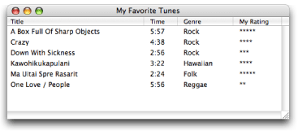

To create this list, you’ll perform these tasks, each of which is described in the sections that follow:

1. Design and configure a list view data browser. In Mac OS X, the easiest way to accomplish this task is to use Interface Builder.
2. Declare the necessary global constants in your Carbon application.
3. Write an item-data callback that populates the list with data.
4. Write code that initializes the data browser control.

Follow these steps to design and configure the list view data browser shown in [Figure 2-1](#apple-f4xwc4dqnrsv64tfmyxwi33df52wszbpkridgmbqgaydsnryfvbuqmrqgywueqkki5eukrce):

1. Create a new Carbon application in Xcode.
2. Double-click the `main.nib` file provided in the new project in the NIB Files folder.

   You access Interface Builder from within Xcode to ensure that the nib file you create is properly bundled with the Xcode project.
3. Click the empty window (titled Window), and choose Tools > Show Info.
4. In the Size pane of the Info window, set the width and height to 500 by 180.
5. Choose Tools > Palettes > Show Palettes.
6. Click the Carbon Browsers & Tab palette button.
7. Drag the Data Browser (List View) item to the window.
8. Drag the data browser control to resize it to fit in the window.
9. With the data browser control selected, make the Info window active.
10. In the Control pane, enter a signature and make sure the Enabled option is selected, as shown in Figure 2-2. You can enter any signature you’d like, as long as there is at least one uppercase letter. Apple reserves signatures that are all lowercase. For this example, enter `SLST`.

    __Figure 2-2__  Setting up the Control pane for a list view

    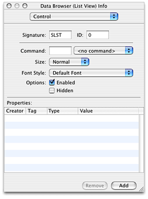
11. In the Attributes pane, make the following settings, as shown in Figure 2-3:

    - Set Hilite Style to Minimal.
    - Make sure Focus Ring is not selected.
    - Under Variable, select the Column Width option.
    - Under Scroll Bars, select Horizontal and Vertical.
    - Under Selection, make sure Drag Select is selected. If you want to restrict the user to selecting only one item at a time, select Only One. You can leave the other items at the default setting.
    - Don’t make any changes to the default row height and column width.

    __Figure 2-3__  Setting up the Attributes pane for a list view

    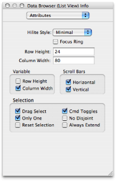
12. In the List View pane, make these settings, as shown in Figure 2-4:

    - Make sure Has Header is selected. A header is a title row.
    - Set the number of columns to `4`.

    __Figure 2-4__  Setting up a header and number of columns for a list view

    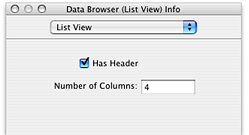
13. In the Columns pane, shown in Figure 2-5, set the following for column 1:

    - Title: `Title`
    - Title Alignment: Left
    - Title Offset: `0`
    - Sort Order: Ascendant
    - Property ID: `SONG`
    - Property Type: Text
    - Min Width: `100`
    - Max Width: `400`
    - Make sure the column is movable, sortable, and can be selected.

    __Figure 2-5__  Setting up the Columns pane for a list view

    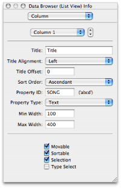
14. In the Columns pane for column 2:

    - Title: `Time`
    - Title Alignment: Left
    - Title Offset: `0`
    - Sort Order: Ascendant
    - Property ID: `TIME`
    - Property Type: Text
    - Min Width: `20`
    - Max Width: `100`
    - Make sure the column is movable, sortable, and can be selected.
15. In the Columns pane for column 3:

    - Title: `Genre`
    - Title Alignment: Left
    - Title Offset: `0`
    - Sort Order: Ascendant
    - Property ID: `GENR`
    - Property Type: Text
    - Min Width: `50`
    - Max Width: `150`
    - Make sure the column is movable, sortable, and can be selected.
16. In the Columns pane for column 4:

    - Title: `MyRating`
    - Title Alignment: Left
    - Title Offset: `0`
    - Sort Order: Ascendant
    - Property ID: `RATE`
    - Property Type: Text
    - Min Width: `75`
    - Max Width: `100`
    - Make sure the column is movable, sortable, and can be selected.
17. Save the file and quit Interface Builder.

When you create a list view data browser for your own application, you’d set the options to support the number of columns and functionality appropriate for your application.

In the previous section, you assigned each of the columns in list view a unique property ID. You have to make sure the code in your Carbon application uses the same property IDs that you assigned in Interface Builder because you refer to the columns from within your application using the property ID. Rather than use the four-character property IDs directly, it’s useful to declare an enumeration of constants set to the property IDs. You’ll use these constants later in an item-data callback to determine which column requires updating.

In Xcode, open the `main.c` file and add the following global enumeration to the code:

```
enum {
        kMyTitleColumn = 'SONG',
        kMyTimeColumn = 'TIME',
        kMyGenreColumn = 'GENR',
        kMyRatingColumn = 'RATE'
}
```


The item-data callback communicates data between the data browser and your application; it adds and modifies data in the browser. Your application must provide this callback because without it, no data is displayed. The data browser invokes the callback when it needs to display a value for an item. Typically, the callback is invoked under the following conditions:

- The user interacts with the data browser by clicking a disclosure triangle to open a container, scrolling, editing text, or performing some other action that changes the display.
- Your application calls a function that requires the data browser to add or modify data. For example, the functions `AddDataBrowserItems`, `SetDataBrowserTarget`, and `SetDataBrowserColumnViewPath` cause the data browser to invoke your item-data callback.

An item-data callback consists of a switch statement that responds to application-defined properties that you define in your application as well as to the list of properties shown in [Table 1-1](Data%20Browser%20Concepts.md#apple-f4xwc4dqnrsv64tfmyxwi33df52wszbpkrbeilkciveusr2djfbq). For each case in the switch statement, you call the appropriate function from the `SetDataBrowserItemData` and `GetDataBrowserItemData` set of functions available in the data browser API. (See _Data Browser Reference_ for the complete list of “getting and setting” functions.)

The data browser shown in [Figure 2-1](#apple-f4xwc4dqnrsv64tfmyxwi33df52wszbpkridgmbqgaydsnryfvbuqmrqgywueqkki5eukrce) is a simple list view. The data is not hierarchical, there are no symbolic links, it uses list view, editing is not allowed, and the user cannot change the active or selection states. For this example, an item-data callback simply needs to look for the property ID for a given item ID, and provide the data that’s associated with that item ID, property ID pair by calling the function `SetDataBrowserItemDataText`.

There are four columns of data, so the switch statement in the item-data callback must respond to the property ID assigned to each column. Listing 2-1 shows the item-data callback needed to populate the list view data browser shown in [Figure 2-1](#apple-f4xwc4dqnrsv64tfmyxwi33df52wszbpkridgmbqgaydsnryfvbuqmrqgywueqkki5eukrce). An explanation for each numbered line of code appears following the listing.

__Listing 2-1__  An item-data callback that populates a simple list view

```
OSStatus    MyDataBrowserItemDataCallback (ControlRef browser,
                DataBrowserItemID itemID,
                DataBrowserPropertyID property,
                DataBrowserItemDataRef itemData,
                Boolean changeValue)
{
    OSStatus status = noErr;

    if (!changeValue) switch (property) // 1
    {
        case kMyTitleColumn:
            status = SetDataBrowserItemDataText (itemData,
                     myTunesDatabase[itemID].song); // 2
            break;
        case kMyTimeColumn:
            status = SetDataBrowserItemDataText(itemData,
                    myTunesDatabase[itemID].time);
            break;
        case kMyGenreColumn:
            status = SetDataBrowserItemDataText(itemData,
                    myTunesDatabase[itemID].genre);
            break;
        case kMyRatingColumn:
            status = SetDataBrowserItemDataText(itemData,
                    myTunesDatabase[itemID].rating);
            break;
        default:
            status = errDataBrowserPropertyNotSupported;
            break;
    }
    else status = errDataBrowserPropertyNotSupported; // 3

 return status;
}
```

Here’s what the code does:

1. Makes sure that this is a set request, and if so, that it examines the property. The `changeValue` parameter is `false` for a set request. The property is the same property ID you defined for each column in Interface Builder, and is the same property ID you declared global constants for in your code.
2. Calls the function `SetDataBrowserItemDataText` to provide the data to display for that item. In this example, all the data in the data browser, regardless of the property ID of the column, is text. Your application needs to use the item ID associated with the data to obtain the appropriate data. In this example, data from a database was previously read into the structure `myTunesDatabase`. When the data was read, the application assigned an item ID equal to the array location in the `myTunesDatabase` structure. For a more complex set of data, your application could provide a function that looks up the data location based on the item ID.
3. Sets `status` to a result code indicating that get requests are not supported for any property. Get requests need to be supported only if the data in a browser can be edited.

The item-data callback in this example is a simple one. The item-data callbacks in the sections [Displaying Hierarchical Data in a List View](#apple-f4xwc4dqnrsv64tfmyxwi33df52wszbpkridgmbqgaydsnryfvbuqmrqgywueqkkizeeeqkd), [Displaying Data in a Column View](#apple-f4xwc4dqnrsv64tfmyxwi33df52wszbpkridgmbqgaydsnryfvbuqmrqgywueqkki5dukskj), and [Switching Between List View and Column View](#apple-f4xwc4dqnrsv64tfmyxwi33df52wszbpkridgmbqgaydsnryfvbuqmrqgywueqkkjfceuqkc) show item-data callbacks that handle progressively more complex situations.

There are a number of tasks that need to be done to initialize a data browser. You need to:

- Get the data browser control that you defined in Interface Builder so that you can then pass it to other functions.
- Initialize the data browser callbacks structure and fill it with callbacks appropriate for your application. In this case there is only one callback—an item-data callback.
- Load your data.
- Populate the data browser with data.

Listing 2-2 shows a function that initializes the list view data browser depicted in [Figure 2-1](#apple-f4xwc4dqnrsv64tfmyxwi33df52wszbpkridgmbqgaydsnryfvbuqmrqgywueqkki5eukrce). A detailed explanation for each numbered line of code appears following the listing.

__Listing 2-2__  Initializing a simple list view data browser

```
OSStatus MyInitializeDataBrowserControl (WindowRef window)
{
    const       ControlID  dbControlID  = { 'SLST', 0 };// 1
    OSStatus    status = noErr;
    UInt32      i;
    SInt32      numRows;
    ControlRef  dbControl;
    DataBrowserCallbacks  dbCallbacks;

    GetControlByID (window, &dbControlID, &dbControl);  // 2
    dbCallbacks.version = kDataBrowserLatestCallbacks;// 3
    InitDataBrowserCallbacks (&dbCallbacks);// 4
    dbCallbacks.u.v1.itemDataCallback =
            NewDataBrowserItemDataUPP((DataBrowserItemDataProcPtr)
                         MyDataBrowserItemDataCallback);// 5
    SetDataBrowserCallbacks(dbControl, &dbCallbacks);// 6
    SetAutomaticControlDragTrackingEnabledForWindow (window, true);// 7

    numRows = MyLoadData ();// 8
    status = AddDataBrowserItems (dbControl, kDataBrowserNoItem, numRows,
                            NULL, kDataBrowserItemNoProperty );// 9
    return status;
}
```

Here’s what the code does:

1. Initializes a control ID variable with the values you set up in Interface Builder for the data browser.
2. Obtains the data browser using the control ID from the previous step.
3. Sets the version of the data browser callbacks structure to the latest version.
4. Initializes a data browser callbacks structure, effectively setting all fields to `NULL` in preparation for assigning the callback provided by your application.
5. Creates a universal procedure pointer (UPP) to an item-data callback and assigns the callback to the appropriate field in the data browser callbacks structure.
6. Installs the callback by calling the function `SetDataBrowserCallbacks`, passing the data browser callbacks structure as a parameter.
7. Enables automatic drag tracking for the window that contains the data browser. This lets a user drag a column in list view to a new position.
8. Calls your application’s function to read data from a database in preparation for writing it to the data browser.
9. Populates the data browser by calling the function `AddDataBrowserItems`. This function causes the data browser to invoke your item-data callback, which in turn provides the data browser with the data associated with each row.

   Note that the fourth parameter, the `items` parameter, is `NULL`. In all but the most simplest of lists, such as this one, this parameter should be a pointer to an array of item ID values for the items you want to add to the data browser. You supply item ID values based on your own identification scheme. Passing `NULL` causes the data browser to generate item ID values for you, starting at a value of 1. Calling the function in this way clears whatever items are in the container. Because of this clearing behavior, passing `NULL` is not recommended unless your application uses a data browser to display a simple list that is populated only once with data. We pass `NULL` here just to point out the usage of the function. In other examples, we pass application-generated item IDs.

This section shows how to create a data browser that uses list view to display hierarchical data. Figure 2-6 shows the list that’s created in this section.

__Figure 2-6__  Hierarchical data displayed in a list view

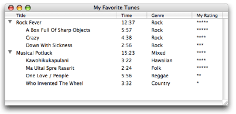

To create this list, you’ll perform the following tasks:

1. Design and configure a data browser that uses list view. This example uses the same design and configuration options as that used for the simple list view discussed in the previous example. See [Design and Configure a List View Data Browser](#apple-f4xwc4dqnrsv64tfmyxwi33df52wszbpkridgmbqgaydsnryfvbuqmrqgywueqkkjjbuqsci) for instructions on performing this task.
2. Declare the necessary global constants. These are the same constants declared for the simple list view example discussed in the previous example. See [Declare the Necessary Global Constants](#apple-f4xwc4dqnrsv64tfmyxwi33df52wszbpkridgmbqgaydsnryfvbuqmrqgywueqkkijbusr2g) for instructions on performing this task.
3. Write an item-data callback that writes data to the list and sets each item in the list to the appropriate value for the property `kDataBrowserItemIsContainerProperty`. See [Write an Item-Data Callback](Introduction%20to%20Data%20Browser%20Programming%20Guide.md#apple-f4xwc4dqnrsv64tfmyxwi33df52wszbpkridgmbqgaydsnryfvbuqmrqguwviucykjcummjqgm).
4. Write an item-notification callback that responds to a container-opened notification. See [Write an Item-Notification Callback for Hierarchical Data](#apple-f4xwc4dqnrsv64tfmyxwi33df52wszbpkridgmbqgaydsnryfvbuqmrqgywugskiincegskd).
5. Write code that initializes the data browser control. See [Write Code That Initializes the Data Browser](#apple-f4xwc4dqnrsv64tfmyxwi33df52wszbpkridgmbqgaydsnryfvbuqmrqgywugskijjbeoqse).

Tasks 3 through 5 are discussed in the sections that follow.

The item-data callback needed for a list view data browser that displays hierarchical data is almost identical to the callback supplied to display nonhierarchical data. There is one difference. In addition to responding to the property IDs of each column, the callback must respond to the API-defined property `kDataBrowserItemIsContainerProperty`. Your callback checks to see if an item is a container, and if it is, you set the container property to `true`. Otherwise, set the property to `false`. The code in Listing 2-3 shows how to do this. A detailed explanation for each numbered line of code appears following the listing.

__Listing 2-3__  An item-data callback for a hierarchical list

```
OSStatus    MyDataBrowserItemDataCallback (ControlRef browser,
                DataBrowserItemID itemID,
                DataBrowserPropertyID property,
                DataBrowserItemDataRef itemData,
                Boolean changeValue)
{
    OSStatus status = noErr;

    if (!changeValue) switch (property)// 1
    {
        case kMyTitleColumn:
            status = SetDataBrowserItemDataText (itemData,
                     myTunesDatabase[itemID].song);
            break;
        case kMyTimeColumn:
            status = SetDataBrowserItemDataText(itemData,
                     myTunesDatabase[itemID].time);
            break;
        case kMyGenreColumn:
            status = SetDataBrowserItemDataText(itemData,
                     myTunesDatabase[itemID].genre);
            break;
        case kMyRatingColumn:
            status = SetDataBrowserItemDataText(itemData,
                     myTunesDatabase[itemID].rating);
            break;
        case kDataBrowserItemIsContainerProperty:// 2
            status = SetDataBrowserItemDataBooleanValue (itemData,
                     MyCheckIfContainer (itemID));// 3
            break;
    }
    else status = errDataBrowserPropertyNotSupported;// 4

    return status;
}
```

Here’s what the code does:

1. Makes sure this is a set request, and if so, examines the property. The `changeValue` parameter is `false` for a set request. In this case, the property ID can be one of the unique four-character sequences you assigned to the columns in list view or it can be one of the predefined properties from the data browser API.
2. Checks for the container property.
3. Sets the container property for the item to `true` if the item is a container or `false` if the item is not a container. Your application determines whether the item is a container or not.
4. Sets `status` to a result code indicating that get requests are not supported for any property. Get requests need to be supported only if the data in a browser can be edited.

The item-notification callback informs your application of actions taken by the user, such as initiating an editing session or opening a container. Your application must provide this callback if it displays hierarchical data in a list view or uses column view. Without it, users cannot open containers in list view or navigate the data hierarchy in column view.

The data browser communicates changes of its internal state by sending messages to your item-notification callback. Your callback responds to each event notification by taking the appropriate action. In the case of hierarchical data, your application responds to a container-opened notification by populating the data browser with the items that are in the container. [Table 1-2](Data%20Browser%20Concepts.md#apple-f4xwc4dqnrsv64tfmyxwi33df52wszbpkrbeilkciveuor2bizda) shows the message that can be sent to an item-notification callback. What you choose to handle in your item-notification callback depends on the nature of your application.

To implement the hierarchical list shown in [Figure 2-6](#apple-f4xwc4dqnrsv64tfmyxwi33df52wszbpkridgmbqgaydsnryfvbuqmrqgywueqkkjbducqkh), you need to respond only to the container opened (`kDataBrowserContainerOpened`) notification. The data browser handles closing automatically, so you don’t need to handle a container closed notification. Listing 2-4 shows the code necessary to handle an open container event for the list view data browser shown in [Figure 2-6](#apple-f4xwc4dqnrsv64tfmyxwi33df52wszbpkridgmbqgaydsnryfvbuqmrqgywueqkkjbducqkh). A detailed explanation for each numbered line of code appears following the listing.

__Listing 2-4__  An item-notification callback for a hierarchical list

```
void MyDataBrowserItemNotificationCallback( ControlRef browser,
                        DataBrowserItemID itemID,
                        DataBrowserItemNotification message)
{
    switch (message)
    {
        case kDataBrowserContainerOpened:// 1
        {
            int i, myItemsPerContainer;

            myItemsPerContainer = myTunesDatabase[itemID].songsInAlbum;// 2

            DataBrowserItemID myItems [myItemsPerContainer];
            for ( i = 0; i < myItemsPerContainer; i++)// 3
                        myItems[i] =  MyGetChild (itemID, i);
            AddDataBrowserItems (browser, itemID,
                                    myItemsPerContainer,
                                    myItems, kTitleColumn);// 4
            break;
        }
    }
}
```

Here’s what the code does:

1. Checks for a container-opened notification. For this simple example, that’s all this item-notification callback needs to check for. The data browser API defines a number of other item notifications that can be used within this kind of callback.
2. Retrieves the number of items in this container. You pass this value to the function `AddDataBrowserItems`.
3. Builds an array of the item IDs for the items in the container. This example calls an application-defined function (`MyGetChild`) that looks up item ID values for items in a container. Your application would need to build an array of item IDs appropriately.
4. Calls the function `AddDataBrowserItems` to add the items to the container. You supply the item ID of the container, the number of items in the container, an array of the item IDs for the items in the container, and the property ID of the column whose sorting order matches the sorting order of the items array. In this case, passes the property ID of the title column. You can pass `kDataBrowserItemNoProperty` if the items array is not sorted or if you don’t know the sorting order of your data. You’ll get the best performance from this function if you provide a sorting order.

   After calling `AddDataBrowserItems`, the data browser invokes your item-data callback to obtain the data to display. For more information on the requests sent to your item-data callback see [Adding Items to a Simple List View](Data%20Browser%20Concepts.md#apple-f4xwc4dqnrsv64tfmyxwi33df52wszbpkrbeilkdjjbegrkhifeq).

The initialization function needed for a list view data browser that displays hierarchical data is almost the same as that needed for nonhierarchical data. There are two differences:

- You need to assign your item-notification callback UPP to the appropriate field in the data browser callbacks structure.
- You must add code to specify which column can display a disclosure triangle next to a container items.

The code you need to add is shown in Listing 2-5. Just add this code to the function shown in [Write Code That Initializes the List View](#apple-f4xwc4dqnrsv64tfmyxwi33df52wszbpkridgmbqgaydsnryfvbuqmrqgywugskiinfeqr2h).

__Listing 2-5__  Initializing a hierarchical list view data browser

```
dbCallbacks.u.v1.itemNotificationCallback =
                NewDataBrowserItemNotificationUPP(
                            (DataBrowserItemNotificationProcPtr)
                             MyDataBrowserItemNotificationCallback);

SetDataBrowserListViewDisclosureColumn (dbControl,
                            kMyTitleColumn,
                            true);
```


This section shows how to create a data browser that uses column view to display data. Figure 2-7 shows the data browser that’s created in this section. There are two notable features about this data browser:

- Each column displays icon and text data. You’ll need to provide the icons to display and the text strings.
- The columns are of equal width. A column view data browser can’t have columns of unequal widths.

__Figure 2-7__  A column view data browser

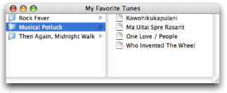

To create this list, you’ll perform the following tasks:

1. Design and configure a column view data browser.
2. Write an item-data callback that populates the columns.
3. Write an item-notification callback that handles container notifications.
4. Write code that initializes the data browser control.

Follow these steps to design and configure the column view data browser shown in [Figure 2-7](#apple-f4xwc4dqnrsv64tfmyxwi33df52wszbpkridgmbqgaydsnryfvbuqmrqgywueqkkirdussch):

1. Create a new Carbon application in Xcode.
2. Double-click the `main.nib` file provided in the new project.

   You access Interface Builder from within Xcode to ensure that the nib file you create is properly bundled with the Xcode project.
3. Click the window, and choose Tools > Show Info.
4. Choose Size in the Info window and set the width and height to 250 by 300.
5. Choose Tools > Palettes > Show Palettes.
6. Click the Carbon Browsers & Tab palette button.
7. Drag the Data Browser (Column View) item to the window.
8. Drag the data browser control to resize it to fit in the window.
9. With the data browser control selected, make the Info window active.
10. In the Control pane, enter a signature, and make sure the Enabled option is selected, as shown in Figure 2-8. You can enter any signature you like, as long as there is at least one uppercase letter. Apple reserves signatures that are all lowercase. For this example, enter `CLVW`.

    __Figure 2-8__  Setting up the Control pane for a column view

    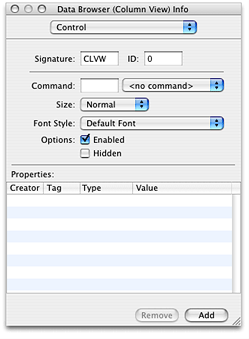
11. In the Attributes pane, make the following settings, as shown in Figure 2-9:

    - Set Hilite Style to Fill.
    - Make sure Row Height is set to `22` (the default) and the Column Width is set to `250`.
    - Make sure Focus Ring is not selected.
    - Select Column Width to make it variable.
    - Select Horizontal and Vertical under Scroll Bars.
    - Under Selection, do not change the default selections.

    __Figure 2-9__  Setting up the Attributes pane for a column view

    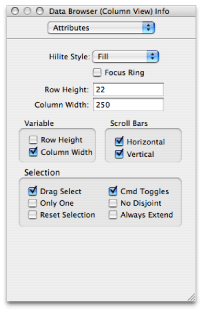
12. Save the file and quit Interface Builder.

A column view data browser is populated with data the same way a list view data browser is—through an item-data callback provided by your application. Unlike list view columns, columns in column view do not have property IDs assigned by your application. Instead, every column in column view has the API-defined property `kDataBrowserItemSelfIdentityProperty`. This is one of the properties to which your item-data callback responds. The two other API-defined properties handled by an item-data callback for a column view are `kDataBrowserItemIsContainerProperty` and `kDataBrowserItemParentContainerProperty`. Column view is, by definition, a way to view hierarchically organized data. As such, your item-data callback provides item IDs for the items within a container and for the parent of an item if the item has a parent.

Figure 2-6 shows the item-data callback needed to populate the column view data browser shown in [Figure 2-7](#apple-f4xwc4dqnrsv64tfmyxwi33df52wszbpkridgmbqgaydsnryfvbuqmrqgywueqkkirdussch). A detailed explanation for each numbered line of code appears following the listing.

__Listing 2-6__  An item-data callback for a column view data browser

```
OSStatus    MyDataBrowserItemDataCallback (ControlRef browser,
                DataBrowserItemID itemID,
                DataBrowserPropertyID property,
                DataBrowserItemDataRef itemData,
                Boolean changeValue)
{
    OSStatus status = noErr;

    switch (property)
    {
        case kDataBrowserItemSelfIdentityProperty: // 1
        {
            status = SetDataBrowserItemDataIcon (itemData,
                         MyCheckIfContainer (itemID) ?
                         icon[kFolder] : icon[kDocument]); // 2
            status = SetDataBrowserItemDataText (itemData,
                         myTunesDatabase[itemID].song); // 3
        break;
        }
        case kDataBrowserItemIsContainerProperty: // 4
        {
            status = SetDataBrowserItemDataBooleanValue (itemData,
                                    MyCheckIfContainer (itemID));
            break;
        }
        case kDataBrowserItemParentContainerProperty: // 5
        {
            DataBrowserItemID myParent;
            myParent = MyGetParent (itemID); // 6
            status = SetDataBrowserItemDataItemID (itemData, myParent); // 7
            break;
        }
    }
    return status;
}
```

Here’s what the code does:

1. Checks for the self-identity property. This property is relevant only to column view.
2. Sets the icon for the item. There are two types of icons used in this example—a folder, used for a container, and a document, used for an item. The code checks to see if the item is a container, and then supplies the appropriate icon.
3. Sets the text data for the item.
4. Checks for the container property. It sets the property to `true` if the item is a container or `false` if the item is not a container. Your application determines whether the item is a container or not.
5. Checks for the parent container property.
6. Calls your routine to look up the item ID for the item’s parent. If the item is at the top of the hierarchy, it has no parent, and the returned value should be `0`.
7. Sets the item’s parent ID by calling the function `SetDataBrowserItemDataItemID`. If the item has a parent, the data browser calls your item-data callback again with the parent ID. It keeps doing this until the top of the hierarchy is reached.

The item-notification callback needed for this column-view data browser is identical to that supplied for the list view data browser that displays hierarchical data. The notification you must respond to is `kDataBrowserContainerOpened`. See [Write an Item-Notification Callback for Hierarchical Data](#apple-f4xwc4dqnrsv64tfmyxwi33df52wszbpkridgmbqgaydsnryfvbuqmrqgywugskiincegskd) for details.

Listing 2-7 shows code that initializes the column view data browser shown in [Figure 2-7](#apple-f4xwc4dqnrsv64tfmyxwi33df52wszbpkridgmbqgaydsnryfvbuqmrqgywueqkkirdussch). A detailed explanation for each numbered line of code appears following the listing.

__Listing 2-7__  Initializing a column view data browser

```
ControlRef MyInitializeDataBrowserControl (WindowRef window)
{
    const       ControlID  dbControlID = {'CLVW', 0};// 1
    OSStatus    status = noErr;
    ControlRef  dbControl;
    DataBrowserCallbacks  dbCallbacks;

    GetControlByID (window, &dbControlID, &dbControl);// 2
    dbCallbacks.version = kDataBrowserLatestCallbacks;// 3
    InitDataBrowserCallbacks (&dbCallbacks);// 4
    dbCallbacks.u.v1.itemDataCallback =
                NewDataBrowserItemDataUPP((DataBrowserItemDataProcPtr)
                            MyDataBrowserItemDataCallback);// 5
    dbCallbacks.u.v1.itemNotificationCallback =
                NewDataBrowserItemNotificationUPP(
                    (DataBrowserItemNotificationProcPtr)
                    MyDataBrowserItemNotificationCallback);  // 6

    status = SetDataBrowserCallbacks(dbControl, &dbCallbacks);// 7
    return dbControl;
}
```

Here’s what the code does:

1. Initializes a control variable with the values you set up in Interface Builder for the data browser.
2. Obtains the data browser using the control ID from the previous steps.
3. Sets the version of the data browser callbacks structure to the latest version.
4. Initializes a data browser callback structure, effectively setting all fields to `NULL` in preparation for assigning the callbacks provided by your application.
5. Creates a universal procedure pointer (UPP) to your item-data callback and assigns the callback to the appropriate field in the data browser callbacks structure.
6. Creates a UPP to your item-notification callback and assigns the callback to the appropriate field in the data browser callbacks structure.
7. Installs the callbacks by calling the function `SetDataBrowserCallbacks`, passing the data browser callbacks structure as a parameter.

The only task left to perform is to populate the data browser with data when your application first launches. You can add a function call to the initialization function here, or to the main part of your application. For a column view data browser, you can call the function `SetDataBrowserColumnViewPath` to open the data browser so the specified target item is selected. Calling this function populates the entire data browser, not just the items in the specified path. As an alternative, you can populate the data browser by calling the function `SetDataBrowserTarget` to add data along a specific path, with the target item selected.

This section shows how to create a data browser that opens in list view, but the user can switch to column view. You’ll find it easier to follow the instructions in this section if you have already read the sections [Displaying Hierarchical Data in a List View](#apple-f4xwc4dqnrsv64tfmyxwi33df52wszbpkridgmbqgaydsnryfvbuqmrqgywueqkkizeeeqkd) and [Displaying Data in a Column View](#apple-f4xwc4dqnrsv64tfmyxwi33df52wszbpkridgmbqgaydsnryfvbuqmrqgywueqkki5dukskj).

To create a data browser that can switch between list view and column view, perform the following tasks:

1. Design and configure a data browser that uses list view. The data browser opens in list view, so you’ll use Interface Builder to configure the list view portion of the data browser. You will configure the column view programmatically.

   This example uses the same design and configuration options as that used for the simple list view discussed in the section [Design and Configure a List View Data Browser](#apple-f4xwc4dqnrsv64tfmyxwi33df52wszbpkridgmbqgaydsnryfvbuqmrqgywueqkkjjbuqsci), except that you’ll set up the Title column to display both icon and text data. This will make the list and column views look more consistent when you switch between them. Follow the instructions in the [Design and Configure a List View Data Browser](#apple-f4xwc4dqnrsv64tfmyxwi33df52wszbpkridgmbqgaydsnryfvbuqmrqgywueqkkjjbuqsci), but choose Icon and Text as the display type for Column 1.
2. Set up a menu that allows the user to switch from one view to another. See the section [Set Up a Menu for Switching Views](#apple-f4xwc4dqnrsv64tfmyxwi33df52wszbpkridgmbqgaydsnryfvbuqmrqgywugskiijcueskj).
3. Declare the necessary global constants. See [Declare the Global Constants Needed for Switching](#apple-f4xwc4dqnrsv64tfmyxwi33df52wszbpkridgmbqgaydsnryfvbuqmrqgywugskii5cusrsb).
4. Write an item-data callback that can write data to the data browser regardless of whether its in list or column view. See [Write an Item-Data Callback to Handle Both Views](#apple-f4xwc4dqnrsv64tfmyxwi33df52wszbpkridgmbqgaydsnryfvbuqmrqgywugskii5decqkd).
5. Write an item-notification callback that handles container notifications. The item-notification callback needed for this data browser is identical to that supplied for the list view data browser that displays hierarchical data. The notification you must respond to is `kDataBrowserContainerOpened`. See [Write an Item-Notification Callback for Hierarchical Data](#apple-f4xwc4dqnrsv64tfmyxwi33df52wszbpkridgmbqgaydsnryfvbuqmrqgywugskiincegskd) for details.
6. Write code that initializes the data browser control. See [Write Code That Initializes a Switchable Data Browser](#apple-f4xwc4dqnrsv64tfmyxwi33df52wszbpkridgmbqgaydsnryfvbuqmrqgywugskiizdukrkc).
7. Write code that changes the view style of the browser. See [Write Code to Switch Between Views](#apple-f4xwc4dqnrsv64tfmyxwi33df52wszbpkridgmbqgaydsnryfvbuqmrqgywugskii5bekske).
8. Write code that configures the data browser for the current view. See [Configure the Data Browser](#apple-f4xwc4dqnrsv64tfmyxwi33df52wszbpkridgmbqgaydsnryfvbuqmrqgywugskiiraumrcj).
9. Write data to the data browser when the application first launches. See [Populate the Initial List View With Data](#apple-f4xwc4dqnrsv64tfmyxwi33df52wszbpkridgmbqgaydsnryfvbuqmrqgywugskiijeumrsc).

You can set up any user interface element you’d like for switching views (menu, button, and so forth), but in this example you’ll create a menu in Interface Builder. The View menu shown in Figure 2-10 contains two menu items—Column and List. You assign each item a command that is issued when the user chooses the menu item from the View menu. In this case the Column menu item is assigned the command `'CLVW'`, as shown in the figure. You can assign `'LSVW'` for the List menu item command. Your application needs to handle each of these commands appropriately, as shown in the section [Write Code to Switch Between Views](#apple-f4xwc4dqnrsv64tfmyxwi33df52wszbpkridgmbqgaydsnryfvbuqmrqgywugskii5bekske).

__Figure 2-10__  Assigning a command to a menu item

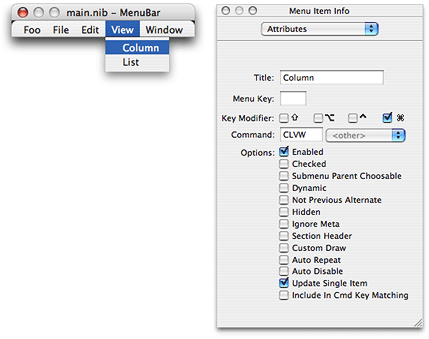

If you are unfamiliar with how to create a menu in Interface Builder, see the following resources:

- Managing Menus under Objects in Interface Builder Help
- _Learning Carbon_, available from O’Reilly publishers

When you designed and configured the list view data browser previously (see [Design and Configure a List View Data Browser](#apple-f4xwc4dqnrsv64tfmyxwi33df52wszbpkridgmbqgaydsnryfvbuqmrqgywueqkkjjbuqsci)), you assigned each of the list view columns a unique property ID. You must make sure the code in your Carbon application uses the same property IDs you assigned in Interface Builder because you refer to the columns from within your application using the property ID. Rather than use the four-character property IDs directly, it’s useful to declare an enumeration of constants set to the property IDs. You’ll use these constants later in an item-data callback to determine which column requires updating.

In addition to the property IDs, you also need to declare constants for the menu commands you set up in Interface Builder. In Xcode, open the `main.c` file and add the following global enumeration to the code:

```
enum
{
    kMyTitleColumn = 'TITL',
    kMyTimeColumn = 'TIME',
    kMyGenreColumn = 'GENR',
    kMyRatingColumn = 'RATE',
    kCommandListView = 'LISV',
    kCommandColumnView = 'COLV'
};
```


An item-data callback for a data browser that switches between views must respond to inquiries from both views. This means your switch statement responds to the property IDs assigned to each list view column, as well as the API-defined properties used for column view columns—`kDataBrowserSelfIdentityProperty`, `kDataBrowserItemIsContainerProperty`, and `kDataBrowserItemParentContainerProperty`. Listing 2-8 shows an item-data callback for a data browser that switches between views. A detailed explanation for each numbered line of code appears following the listing.

__Listing 2-8__  An item-data callback for a data browser that can switch between views

```
OSStatus    MyDataBrowserItemDataCallback (ControlRef browser,
                DataBrowserItemID itemID,
                DataBrowserPropertyID property,
                DataBrowserItemDataRef itemData,
                Boolean changeValue)
{
    UInt32 index = MyGetIndex (itemID);
    OSStatus status = noErr;

    switch (property)
    {
        case kMyTitleColumn:// 1
           status = SetDataBrowserItemDataIcon (itemData,
                        MyCheckIfContainer (itemID) ?
                        icon[kFolder] : icon[kDocument]);
            SetDataBrowserItemDataText (itemData,
                     myTunesDatabase[index].song);
             break;
        case kMyTimeColumn:// 2
            SetDataBrowserItemDataText(itemData,
                     myTunesDatabase[index].time);
            break;
        case kMyGenreColumn:// 3
            SetDataBrowserItemDataText(itemData,
                     myTunesDatabase[index].genre);
            break;
        case kMyRatingColumn:// 4
            SetDataBrowserItemDataText(itemData,
                     myTunesDatabase[index].rating);
            break;
        case kDataBrowserItemSelfIdentityProperty:// 5
        {
           status = SetDataBrowserItemDataIcon (itemData,
                        MyCheckIfContainer (itemID) ?
                        icon[kFolder] : icon[kDocument]);
            status = SetDataBrowserItemDataText (itemData,
                     myTunesDatabase[index].song);
            break;
        }
        case kDataBrowserItemIsContainerProperty:// 6
        {
            status = SetDataBrowserItemDataBooleanValue (itemData,
                             MyCheckIfContainer (itemID));
            break;
        }
        case kDataBrowserItemParentContainerProperty:// 7
        {
            DataBrowserItemID myParent;
            myParent = MyGetParent (itemID);// 8
            status = SetDataBrowserItemDataItemID (itemData, myParent);// 9
            break;
        }
    }

    return status;
}
```

Here’s what the code does:

1. Checks for the title property ID, then sets the icon and text data for the item. Recall that the display type for the title column is icon and text, so you have to set the appropriate icon as well as the text. This example uses a folder icon for a container and a document icon for an item that is not a container. The code checks to see if the item is a container, and then supplies the appropriate icon.
2. Checks for the time property ID, then sets the text data for the item. This is not the time of day, but the duration of a song, so the data is text.
3. Checks for the genre property ID, then sets the text data for the item.
4. Checks for the rating property ID, then sets the text data for the item.
5. Checks for the self-identity property (relevant only in column view). Sets the icon for the item—a folder, used for a container, or a document, used for an item. Then sets the text data for the item.
6. Checks for the container property. It sets the property to `true` if the item is a container or `false` if the item is not a container. Your application determines whether the item is a container or not.
7. Checks for the parent container property.
8. Calls your routine to look up the item ID for the item’s parent. If the item is at the top of the hierarchy, it has no parent, and the returned value should be `0`.
9. Sets the item’s parent ID by calling the function `SetDataBrowserItemDataItemID`. If the item has a parent, the data browser calls your item-data callback again with the parent ID you provide. It keeps doing this until the top of the hierarchy is reached.

As with any data browser, you initialize the data browser by setting the appropriate callbacks. For a data browser that can switch views, you also need to set the initial view (in this case, list view) and to store configuration information about the list view columns. Whenever the user switches from column view back to list view, you need to retrieve the list view configuration information so you can restore the data browser to the list view state. You’ll declare the following global structures to store list view configuration information for each column in the list. Note that `myNumColumns` should be replaced with the number of columns you need in list view.

```
struct  ListViewColumns{
    DataBrowserTableViewColumnID column;
    DataBrowserListViewHeaderDesc  description;
};
typedef struct  ListViewColumns  ListViewColumns;

ListViewColumns myListViewColumns[myNumColumns];
DataBrowserPropertyDesc myColumnPropertyDescription[myNumColumns];
```

You’ll save list view configuration information to these global data structures in the initialization function shown in Listing 2-9, so that later you can restore the configuration. A detailed explanation for each numbered line of code appears following the listing.

__Listing 2-9__  Initializing a data browser that can switch between views

```
ControlRef MyInitializeDataBrowserControl (WindowRef window)
{
    const       ControlID  dbControlID  = {'CLVW', 0};
    OSStatus    status = noErr;
    ControlRef  dbControl;
    DataBrowserCallbacks  dbCallbacks;
    int i;

    GetControlByID (window, &dbControlID, &dbControl);  // 1
    dbCallbacks.version = kDataBrowserLatestCallbacks; // 2
    InitDataBrowserCallbacks (&dbCallbacks);

    dbCallbacks.u.v1.itemDataCallback =
                    NewDataBrowserItemDataUPP ((DataBrowserItemDataProcPtr)
                        MyDataBrowserItemDataCallback); // 3
    dbCallbacks.u.v1.itemNotificationCallback =
                    NewDataBrowserItemNotificationUPP (
                            (DataBrowserItemNotificationProcPtr)
                             MyDataBrowserItemNotificationCallback);  // 4

    status = SetDataBrowserCallbacks(dbControl, &dbCallbacks);

    SetDataBrowserListViewDisclosureColumn (dbControl,
                                kMyTitleColumn, true); // 5
    SetDataBrowserSelectionFlags  (dbControl, kDataBrowserSelectOnlyOne); // 6
    SetAutomaticControlDragTrackingEnabledForWindow (window, true); // 7
    SetDataBrowserViewStyle (dbControl, kDataBrowserListView); // 8
    myListViewColumns[0].column = kTitleColumn; // 9
    myListViewColumns[1].column = kGenreColumn;
    myListViewColumns[2].column = kTimeColumn;
    myListViewColumns[3].column = kRatingColumn;
    for (i = 0; i < kNumListViewColumns; i++) // 10
    {
        DataBrowserListViewHeaderDesc description;

        GetDataBrowserListViewHeaderDesc (dbControl,
                     myListViewColumns[i].column, &description); // 11
        myListViewColumns[i].description = description; // 12
        myColumnPropertyDescription[i].propertyID =
                     myListViewColumns[i].column; // 13
        if (i == 0)// 14
            myColumnPropertyDescription[i].propertyType =
                                kDataBrowserIconAndTextType;
        else
            myColumnPropertyDescription[i].propertyType =
                                kDataBrowserTextType;
    }

    return dbControl;
}
```

Here’s what the code does:

1. Initializes a control ID variable to the values you set up in Interface Builder to identify the data browser.
2. Sets the version of the data browser callbacks structure to the current one.
3. Creates a universal procedure pointer (UPP) to an item-data callback and assigns the callback to the appropriate field in the data browser callback structure.
4. Creates a UPP to an item-notification callback and assigns the callback to the appropriate field in the data browser callback structure.
5. Sets the title column as the one to display a disclosure triangle. You need to do this because the data is organized hierarchically. In this instance, the title column either denotes an album or a song title. Album titles disclose song titles.
6. Sets the selection flags so that only one item can be selected at a time. Your application would set up the selection flags appropriate to its needs.
7. Enables drag tracking. This allows users to reorder the columns by dragging. The system automatically handles the drag operation for you.
8. Sets the view style to a list view style. The data browser first opens to a list view but the user can change the view to a column view after the application launches.
9. Starts to fill the list view column structure with configuration information. This line and the next three lines of code save the property IDs for each column.
10. Iterates through the columns to save the appropriate configuration information.
11. Obtains the current list view header description, which you previously set up in Interface Builder.
12. Assigns the description to the list view column structure.
13. Assigns the property ID to the column property description structure.
14. Assigns the appropriate display type to the column property description structure. Recall that you previously set up the title column to contain icon and text data and all other columns to contain text only.

In one of the Carbon event handlers for your application you need to write code that checks for, and responds to, the menu commands you set up in Interface Builder. Recall that you declared constants for these commands in the section [Declare the Global Constants Needed for Switching](#apple-f4xwc4dqnrsv64tfmyxwi33df52wszbpkridgmbqgaydsnryfvbuqmrqgywugskii5cusrsb).

Respond to the menu commands `kCommandListView` and `kCommandColumnView` by calling the function `SetDataBrowserViewStyle` with the `style` parameter set to the appropriate value—either `kDataBrowserListView` or `kDataBrowserColumnView`. Then, call your function to configure the data browser for the new view.

Whenever the user switches the view, you must configure the data browser for the new view. Listing 2-10 shows how to configure each view. A detailed explanation for each numbered line of code appears following the listing.

__Listing 2-10__  Configuring the data browser for each view

```
void ConfigureDataBrowser (ControlRef dbControl)
{
    UInt32          i;
    SInt32          numAlbums;
    DataBrowserItemID target;
    DataBrowserViewStyle viewStyle;

    numAlbums = CFStringGetIntValue (CFCopyLocalizedString
                            (CFSTR("NumAlbums"), NULL));
    DataBrowserItemID myItems[numAlbums];
    SetDataBrowserTarget (dbControl, 0);// 1
    GetDataBrowserViewStyle (dbControl, &viewStyle);// 2

    switch (viewStyle)
    {
        case kDataBrowserListView:
        {
            for (i = 0; i < kNumListViewColumns; i++)// 3
            {
                DataBrowserListViewColumnDesc myColDescription;
                DataBrowserListViewHeaderDesc description;
                description = myListViewColumns[i].description;
                myColDescription.headerBtnDesc =
                        myListViewColumns[i].description;
                myColDescription.propertyDesc =
                     myColumnPropertyDescription[i];
                status = AddDataBrowserListViewColumn (dbControl,
                             &myColDescription, i);
            }
            SetDataBrowserListViewDisclosureColumn (dbControl,
                             kTitleColumn, true);// 4
            SetDataBrowserSelectionFlags  (dbControl,
                            kDataBrowserSelectOnlyOne);// 5
            MyPopulateListView();// 6
            break;
        }
        case kDataBrowserColumnView:
        {
            int j = 0;
            MyPopulateColumnView();// 7
        }break;
    }
}
```

Here’s what the code does:

1. Sets the target for the data browser to the top level. You could also save the current target at the time the user switches the view, then set the target as the target for the new view.
2. Gets the view style. This is the view the user just switched to, and that you set when you processed the view command.
3. Retrieves the previously saved list view configuration and adds each column to the list view by calling the function `AddDataBrowserListViewColumn`.
4. Sets the title column as the one that has a disclosure triangle.
5. Sets a flag to restrict selection in list view to one item at a time. Your application would set whatever user selection flags are appropriate.
6. Calls your function to populate list view. Your function should build an array of the item IDs for the container items, and then call the function `AddDataBrowserItems` to add the container items to the list.
7. Calls your function to populate column view. Your function can call `SetDataBrowserTarget`, supplying the item ID for the item you want as the target. You must make sure your item-data callback responds to the request `kDataBrowserItemParentContainerProperty` to ensure the data browser is populated properly.

When your application first launches, you need to read in your data and populate the data browser. The code shown in Listing 2-11 is from the main part of the application. It calls the function `AddDataBrowserItems` for each container to display in the initial list view. Your application needs to take similar action when the application launches.

__Listing 2-11__  Reading data and populating the data browser

```
DataBrowserItemID myItemID;

myNumRows = MyLoadData (dbControl);
for (i = 0; i < MyNumRows; i++)
{
    if (MyCheckIfContainer (i))
    {
        myItemID = MyGetItemID(i);
        AddDataBrowserItems (dbControl, kDataBrowserNoItem,
                            1, &myItemID, kTitleColumn);
    }
}
```


The data browser provides built-in text editing capability for columns with the display type `kDataBrowserTextType` or `kDataBrowserIconAndTextType`. The user clicks an item in a cell and edits the text displayed in that cell. The editing session is open as long as the user has the cell selected. Your application needs to capture any changes the user makes and save those changes to its internal data store.

To support text editing in a data browser, follow these steps:

1. When you create a column that you want users to be able to edit, set the property `kDataBrowserPropertyIsEditable` to `true` for that column. Otherwise, the user won’t be able to modify the data in the column.
2. In the switch statement in your item-data callback, handle the `kDataBrowserItemIsEditableProperty` inquiry. In response to this inquiry, call the function `SetDataBrowserItemDataBooleanValue` with the `theData` parameter set to `true`. If your application has more than one column that contains editable text, call the function `GetDataBrowserItemDataProperty` to find out which column is being edited.
3. After you pass `true` in response to the `kDataBrowserItemIsEditableProperty` inquiry, the data browser issues two notifications to your item-notification callback: `kDataBrowserEditStarted` and `kDataBrowserEditStopped`. Respond to each of these appropriately. For example, after you’ve been notified that editing has started, you can lock any data that might need to be locked, or update the user interface as needed. After the editing has stopped, you can unlock any locked data or update the user interface.
4. When the editing session is finished, your item-data callback is invoked with the `property` parameter set to the ID of the column that was modified and the `setValue` parameter set to `true`. Your callback extracts the edited text by calling the function `GetDataBrowserItemDataText`, supplying the item ID of the item whose text was modified. You can then make sure the string is valid and decide to accept or reject the new value before saving the edited text to your application’s private data store. If your application decides to reject the edited text, you can inform the user that you are rejecting the edit.

The item-iterator callback (`DataBrowserItemProcPtr`) performs a task, defined by your application, on each item in a data browser that meets your criteria. You provide the callback and the criteria for applying it as parameters to the function `ForEachDataBrowserItem`. For example, you could write a callback to remove inactive items or to set values displayed in a data browser to default values.

Items in a list view column can be sorted in ascending or descending order. Items in a container appear in the same sorting order as the items in the parent container. You supply a callback (`DataBrowserItemCompareProcPtr`) to handle sorting. Your callback can perform simple sorting or more complex sorting, such as the following:

- Sort containers in a hierarchical list independently of each other
- Use secondary and tertiary sorting

In either of the complex cases, your callback must keep track of previous sort operations and preserve sorting orders for secondary and tertiary items.

If your application wants to support drag-and-drop behavior in a data browser, it can supply callbacks to:

- Add an item to a drag object. The callback `DataBrowserAddDragItemProcPtr` is invoked when a drag operation is started and is used to support dragging objects from the data browser. Your callback adds the item to the drag reference passed to it by the data browser.
- Determine if a drag object can be accepted in a particular location (`DataBrowserItemAcceptDragProcPtr`)
- Receive a drag item by extracting the item from the drag reference passed to it by the data browser and then processing the item appropriately (`DataBrowserItemReceiveDragProcPtr`)
- Perform drag postprocessing tasks, such as deallocating resources (`DataBrowserPostProcessDragProcPtr`)

If you want only to support the ability for the user to change column positions in a list view, you don’t need to provide drag callbacks.

Any time you want a data browser to support drag-and-drop, you must call the Control Manager function `SetAutomaticControlDragTrackingEnabledForWindow`. This is true even if you want only column dragging or only item dragging.

Providing a contextual menu in a data browser is optional. You need to supply two callbacks if you want to support a contextual menu in a data browser—get-contextual-menu (`DataBrowserGetContextualMenuProcPtr`) and select-contextual-menu (`DataBrowserSelectContextualMenuProcPtr`). The get-contextual-menu callback is called by the data browser when the user Control-clicks an item in the display. Figure 2-11 shows how such a menu looks; this one is from the Finder.

__Figure 2-11__  A contextual menu in the Finder

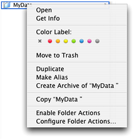

Your get-contextual-menu callback provides a menu and information about help that is (or is not) available. You can customize the content of the menu and determine what information to provide in it by calling the function `GetDataBrowserItems` with the `state` parameter set to `kDataBrowserItemIsSelected`. This function obtains the items that are selected, which you can then use to choose the appropriate information to supply.

Your select-contextual-menu callback is invoked by the data browser when the user selects and item from the contextual menu. Your callback can retrieve the selection and take the appropriate action.

The item-help-content callback (`DataBrowserItemHelpContentProcPtr`) is invoked by the data browser when the user hovers the pointer over an item. Your callback fills in a help tag structure provided to you by the data browser and, when requested, disposes of previously supplied help content. As a result of the information you supply, a help tag is displayed similar to that shown in Figure 2-12. You are not required to provide this callback.

__Figure 2-12__  A help tag in a data browser

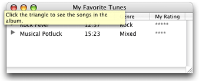

If you want to provide a single help tag for the entire data browser, you can simply type the help tag content into the Help pane of the Info window in Interface Builder. The system takes care of displaying and disposing of the content; a callback is unnecessary.

If you want to control how items are drawn, tracked, and dragged in a list view data browser, you need to set the display type of the columns to custom (`kDataBrowserCustomType`). (See [What Can Be Displayed](Data%20Browser%20Concepts.md#apple-f4xwc4dqnrsv64tfmyxwi33df52wszbpkrbeilkciffekssdjfea) for more information on display types.) The custom type signals the data browser that, at the very least, you want to handle drawing the items. If you plan to support editing, drag and drop, or anything that requires tracking and hit-testing, you must also handle these tasks because none of these tasks are handled by the data browser for columns that display custom types.

The data browser API has a suite of callbacks that operate only on custom types:

- The draw-item callback (`DataBrowserDrawItemProcPtr`), which is invoked by the data browser whenever your custom content needs to be drawn.
- The edit-item callback (`DataBrowserEditItemProcPtr`), which is invoked by the data browser when a user clicks a custom item.
- The hit-testing callback (`DataBrowserHitTestProcPtr`), which determines if the mouse is over content that can be selected or dragged.
- The tracking callback (`DataBrowserTrackingProcPtr`), which is invoked after your hit-testing callback returns `true` and when a mouse-click is inside the content area of the custom item.
- The item-drag callback (`DataBrowserItemDragRgnProcPtr`), which determines which part of an item to use to create a transparent image for a dragged item.
- The item-accept callback (`DataBrowserItemAcceptDragProcPtr`), which is invoked after your item-drag callback starts a drag operation, determines whether or not the associated item can accept the drag object.
- The item-receive callback (`DataBrowserItemReceiveDragProcPtr`), which is called after your item-accept-drag callback has determined that a location can accept a drag object. Your application takes whatever actions are necessary to add the dropped data to the data browser.

[Next](Document%20Revision%20History.md)[Previous](Data%20Browser%20Concepts.md)

