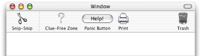
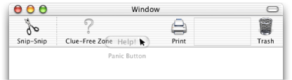
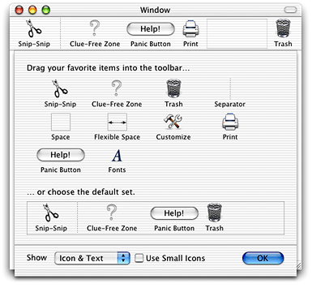
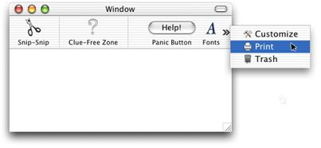
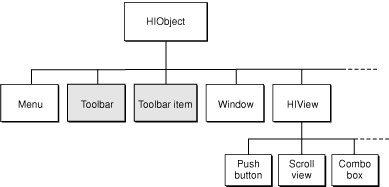
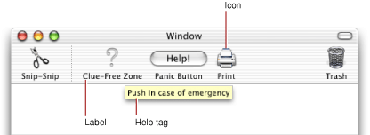

> 导航：[总目录](../../../README.md) · [documentation](../../../_indexes/documentation.md)

[Next](Toolbar%20Tasks.md)

# HIToolbar Concepts

This chapter explains the concepts behind the Carbon HIToolbar. It describes the basic look and feel of a toolbar from a user’s perspective, as well as “under-the-hood” details of how toolbars fit into the HIObject model.

A toolbar is a special container displayed directly underneath a window’s title bar as shown in Figure 1-1. A toolbar can contain multiple toolbar items, which act as buttons or other controls. The user can show or hide the toolbar by clicking on the clear oblong “toolbar button” in the upper right corner of the window. A typical toolbar item displays an icon and is activated by a user click. While some items may simply mimic a simple push button, others may contain controls such as pop-up menus and search fields.

__Figure 1-1__  A toolbar

A toolbar can display its items as a combination of graphical image and text, text only, or graphics only, with two different sizes. The user can select view modes using a contextual menu displayed by control-clicking in the toolbar or cycle through all available modes by command-clicking the toolbar button. The user can also choose view modes while in the configuration sheet (as shown in [Figure 1-3](#apple-f4xwc4dqnrsv64tfmyxwi33df52wszbpkridimbqgaydsnjyfvbuqmrqgewviucykjcummjrg4).

The same toolbar can appear in multiple windows, providing a convenient way to access application features from a document. An application can also have multiple toolbars. For example, the Mail application has different toolbars for mail documents and viewer windows.

One advantage of a toolbar over a standard floating palette or other application-defined window is that the contents are user-configurable. The user has three ways to customize a toolbar’s contents:

- The user can rearrange items in the toolbar (in Mac OS X v. 10.2.4 and later) by command-dragging them around, as shown in Figure 1-2. The user can also remove items entirely by command-dragging and releasing them outside the toolbar.

  __Figure 1-2__  Dragging toolbar items

  
- If the toolbar supports drag-and-drop, the user may be able to create toolbar items by dragging specific data to the toolbar. For example, in Finder windows, a user can create folder items by dragging a folder into the toolbar. Another application could create a special URL item when the user drags text into the toolbar from a browser.
- If the toolbar is configurable, the user can bring up a sheet containing all the toolbar items supported by the application (excluding drag-and-drop items). The user can view the configuration sheet by choosing Customize Toolbar in the contextual menu brought up by control clicking in the toolbar or by command-option-clicking in the toolbar button.

__Figure 1-3__  The toolbar configuration sheet

Changes made to the toolbar in one window automatically propagate to other windows sharing the same toolbar. The toolbar configuration is automatically stored in the user’s Preferences folder when the application quits.

The toolbar can support any number of toolbar items. If there are more items than can be displayed in the window, the user can select the excess items using an overflow pop-up menu., as shown in Figure 1-4.

__Figure 1-4__  The toolbar overflow menu

In Carbon, the HIToolbar class is a subclass of HIObject (also introduced with Mac OS X v.10.2), which is the base class for all user interface objects in Carbon. [Figure 1-5](#apple-f4xwc4dqnrsv64tfmyxwi33df52wszbpkridimbqgaydsnjyfvbuqmrqgewugsscinfeqr2k) shows how toolbars and toolbar items fit into the HIObject class hierarchy.

__Figure 1-5__  The HIObject class hierarchy

The HIToolbar object is not associated with any window, and as such is not part of the standard event containment hierarchy. However, for each window in which a toolbar is to appear, the toolbar object creates toolbar views and toolbar item views and embeds them in that window’s root view. These views are automatically updated when the toolbar contents change.

The Carbon toolbar follows the model-view controller convention as follows:

- The model is the list of toolbar items in a toolbar as well as the data each toolbar item displays or alters. In the HIToolbar API, these elements correspond to the HIToolbar and HIToolbarItem objects.
- The view is the visual representation of the toolbar and its items. A toolbar often has multiple views (one for each window that displays it), each of which shows a custom display of the HIToolbar model (depending on the size of the window and toolbar items, visibility of individual items, and so on). In the HIToolbar API, the view corresponds to the various HIViews created by the toolbar and its toolbar items.
- The controller is the code that determines how the view displays the model. For HIToolbar, all of the following correspond to the controller:

  - application-defined code that creates and manages views in custom toolbar items
  - code that modifies application data in response to clicks in toolbar items
  - code contained in any of the HIToolbar standard event handlers.

Associated with every HIToolbar object is a delegate, which is an event target containing a set of Carbon event handlers that enable the creation of toolbar items. While the toolbar is, by default, its own delegate, you can specify a different event target if you wish.

The delegate handles three basic requests, sent as Carbon events:

- A query for a list of default items. These are the initial items that appear in the toolbar.
- A query for a list of allowable items. This is the set of items that appear in the configuration sheet.
- A request to create a particular toolbar item.

Toolbar items are HIToolbarItem objects subclassed from HIObject. These objects are associated with HIToolbar objects, but are not embedded in the manner of HIViews.

You identify toolbar items using a unique identifier. The system defines a number of standard toolbar items (such as Print, Customize, Separator, and so on) that you can create simply by specifying the proper identifier.

Most toolbar items act as buttons, performing a simple action when pressed. If you want a more sophisticated toolbar item, you can subclass the toolbar item HIObject class and implement your own behavior.

Toolbar items typically have the following data associated with them:

- An icon reference, which determines which icon to display for the item.
- A label, which appears below the icon, (and represents the item when in text-only mode).
- A help tag, which appears when the user hovers the cursor on the item for a few seconds.
- A command ID, which is sent in a `kEventCommandProcess` event when the user clicks on the toolbar item.

__Figure 1-6__  Toolbar item parts

Toolbar items also have attributes that govern their behavior. See [Toolbar Item Attributes](Toolbar%20Tasks.md#apple-f4xwc4dqnrsv64tfmyxwi33df52wszbpkridgmbqgaydgmjqfvbecssiifauery) for more information.

The HIToolbar object creates toolbar items in a lazy fashion. That is, no request is sent until the toolbar item needs to become visible.

The toolbar is designed to be as easy to use as possible. To this end, much of the basic implementation is done for you. For example, doing any of the following requires no additional work on your part:

- Displaying the configuration sheet
- Saving the current toolbar setting to the user’s preferences
- Showing and hiding the toolbar
- Drag tracking and drag rearranging of toolbar items
- Displaying contextual menus
- Moving items into the overflow menu when the toolbar runs out of space

In most cases all you need to worry about is creating the toolbar and any nonstandard toolbar items. The rest is done for you.

HIToolbar is available to Carbon applications in Mac OS X v.10.2 and later . Note that windows that contain toolbars do not have to support HIView compositing.

[Next](Toolbar%20Tasks.md)

