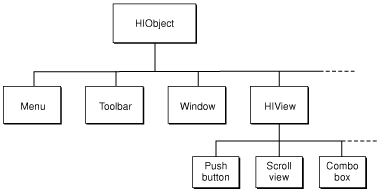
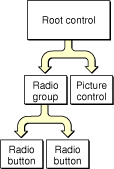
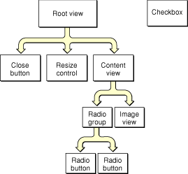
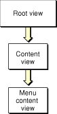
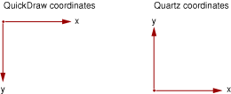
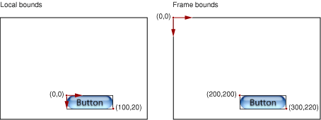
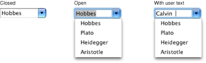

> 导航：[总目录](../../../README.md) · [documentation](../../../_indexes/documentation.md) · [HIView Programming Guide](Introduction%20to%20HIView%20Programming%20Guide.md)

[Next](HIView%20Tasks.md)[Previous](Introduction%20to%20HIView%20Programming%20Guide.md)

# HIView Concepts

This chapter explains the concepts behind the HIView model, covering the view embedding hierarchy, composited drawing, and the new drawing coordinate system. It also describes how HIView relates to older controls and menus, and introduces some new HIView-only controls.

HIView is a new object-oriented view system available for implementing Carbon user interface elements. Beginning with Mac OS X v10.2, all of the standard controls can now be considered views. From Mac OS X v10.3 onwards, all standard menu content is also displayed using views. HIView also introduces several new view-based controls.

Advantages of HIView include the following:

- Quartz is the native drawing system, but you can still use QuickDraw if you want to.
- The modern coordinate system is not limited by the 16-bit space of QuickDraw. Floating-point coordinates are valid.
- There is a simplified coordinate system for view bounds and the position of a view within its parent.
- Views can be ordered within a hierarchy layer; that is, it is easy to place views behind or in front of other controls.
- Views can be easily attached and detached from windows. You can even retain a view separate from an owning window.
- The object-oriented nature of views makes it easy to subclass your own custom views.

HIView is a subclass of HIObject (also introduced in Mac OS X v10.2), which is the base class for all user interface objects in Carbon. Figure 1-1 shows how HIView fits into the HIObject class hierarchy.

__Figure 1-1__  The HIObject class hierarchy

You can think of HIView as a more modern superset of the older Control Manager API. The HIView mechanism underlies all the workings of the current Control Manager, so just about all the standard controls can now be considered views.

HIView views use a special compositing procedure when drawing. Views are drawn from back to front, and your drawing routines have the opportunity to avoid redundant drawing when views overlap. You cannot gain the advantages of views unless you specify the compositing attribute when creating the window that contains them. Note that as compositing is enabled on a per-window basis, you can have both compositing and noncompositing windows in the same application.

If you choose not to enable compositing, all the older Control Manager functions work as they did before.

If you enable compositing, all Control Manager controls (as defined in `ControlDefinitions.h`) gain the properties of views. For example, a checkbox created with `CreateCheckBoxControl` can be ordered in front or behind other views, may be detached from a window, and can be subclassed to create a custom checkbox. You can manipulate views using Control Manager functions or (if they exist) comparable HIView functions. For example, to get the bounds of a checkbox, you could call `GetControlBounds` or `HIViewGetFrame`. Functions that took a `ControlRef` parameter can now take either a `ControlRef` or an `HIViewRef` parameter. In addition, HIView functions that provide new functionality (such as `HIViewAdvanceFocus`) automatically work with the older controls.

HIView also introduces new view-only user interface elements as described in [New HIView User Interface Elements](#apple-f4xwc4dqnrsv64tfmyxwi33df52wszbpkridgmbqgaydsmrtfvbuqmrqgqwugsscizcusr2b). These new elements appear in `HIView.h`.

Technically, the actual menu (as defined by the menu reference) is an HIObject. However, what the user sees as a menu is a menu content view, which is embedded within a compositing window. The menu content view , which contains the individual menu items that the user can select, is essentially a view-based control, which means that you can manipulate it using Control Manager or HIView functions.

In Mac OS X v10.3 and later, all standard menu content is rendered using views. This translation occurs "under the hood," so you do not need to modify your existing menu code to adopt views. However, view-based menus are both simpler and more flexible than old-style menus, so if your code contains custom MDEF-based menus, you should consider re-implementing them as views.

In the new HIView world, all controls are views and vice versa. In fact, the new `HIViewRef` type is exactly the same as the older `ControlRef` type. For the purposes of this document, the term _view_ refers generically to any view object; that is, a new user interface element introduced with HIView or an older Control Manager control. The term _control_ refers specifically to a Control Manager control.

As stated previously, the menu (as represented by the `MenuRef` type) is an HIObject but the Menu Manager displays its contents using a menu content view. For the purposes of this document, _menu_ refers to the actual menu object, while _menu content view_ or _menu view_, refers to the HIView used to display the menu content.

Both HIView and the Control Manager rely on a hierarchy of user interface elements. The two hierarchies are similar, but there are important differences. The old control hierarchy is shown in Figure 1-2.

__Figure 1-2__  An older control hierarchy

The control hierarchy dealt only with items in a window’s content region. Items such as the close button and resize control were not contained in the hierarchy. However, in a view hierarchy, everything within a window is considered a view and is accessible to the application. Figure 1-3 shows a sample view hierarchy.

__Figure 1-3__  A view hierarchy for controls

The view hierarchy contains a content view which is equivalent to the root control in the old Control Manager control hierarchy. The content view contains all views that are visible in the window’s content area.

The view hierarchy for menus is much simpler, as shown in Figure 1-4. Each menu content view is contained within a window, root view, and content view. The menu content view contains whatever is to be displayed in the menu, typically a list of menu items, although that is not a requirement. Note that a submenu is considered to be a separate menu and therefore belongs to its own window.

__Figure 1-4__  A view hierarchy for menus

A view can contain one or more _subviews_. The parent of a view is called the _superview_.

Note that [Figure 1-3](#apple-f4xwc4dqnrsv64tfmyxwi33df52wszbpkridgmbqgaydsmrtfvbuqmrqgqwugsscjfbegsce) shows a checkbox appearing outside the hierarchy. While all controls must be associated with a window and must be contained within the control hierarchy, views can exist separate from an owning window. You can remove a view from a window, hold onto it for a while, and then embed it later (possibly within a different window). Views also don’t require an owning window when you first create them.

The root view is analogous to the Control Manager root control as it represents the top of the view hierarchy in a window. Like a root control, the root view is not visible, but merely acts as a receptacle for embedding other views.

The root view is actually a little higher in the hierarchy than the old Control Manager root control, as it contains all the standard window controls (close, minimize, and zoom buttons, resize control, and so on), not just what’s in the content region. The root control is now equivalent to the content view (and calling `GetRootControl` in compositing mode returns the content view). Use the `HIViewGetRoot` function to obtain the true root view.

Calling the Control Manager function `CreateRootControl` while in compositing mode returns an error, `errRootAlreadyExists`.

HIView lets you embed views within other views, much like embedding controls. However, each of the views embedded within a superview can be ordered within the embedding layer. For example, say you have a content view that contains a picture view and a button. You can deliberately order the views in the content view to make sure that the picture is behind the button. See [Embedding Views](HIView%20Tasks.md#apple-f4xwc4dqnrsv64tfmyxwi33df52wszbpkridgmbqgaydsmrtfvbuqmrqguwueqkkirbemr2f) and [Ordering Views](HIView%20Tasks.md#apple-f4xwc4dqnrsv64tfmyxwi33df52wszbpkridgmbqgaydsmrtfvbuqmrqguwueqkki5fegqsg) for descriptions of the functions used for embedding and ordering views.

As stated earlier, views do not necessarily have to be in the embedding hierarchy; they can exist by themselves, and you can move them from window to window if desired.

HIView uses a special composited drawing method to minimize the amount of drawing that is necessary. Ideally, each opaque pixel is drawn only once, and only areas that are visible are drawn.

Views are drawn in order according to the view hierarchy and the order of the view within a hierarchy layer. At each level in the view hierarchy, an embedding view is drawn first, followed by its embedded views; the embedded views are drawn in bottom-up order. This drawing process means that embedded views are visible above the embedding view. It also means that a view ordered higher in the embedded view appears on top of those ordered below it. For example, for views in the window content area, the content view is drawn first, followed by the bottommost of the views embedded in the content view. If an opaque portion of a view overlaps a view beneath it, HIView informs the lower view, so it can avoid drawing into the overlapping area.

Note that all drawing inside a compositing window must be done from within a view; that is, if you have custom content to display, you must create a custom view with a draw event handler to render your content. You cannot draw directly into a compositing window using classic event record–based update events or Carbon `kEventWindowUpdate` or `kEventWindowDraw` events; compositing windows do not receive these events.

The HIView drawing model does not support drawing to the screen outside of a `kEventControlDraw` event handler. If you want to redraw a view, you should mark areas as being invalid using the `HIViewSetNeedsDisplay`, `HIViewSetNeedsDisplayInRegion` or, in Mac OS X v10.4 and later, `HIViewSetNeedsDisplayInRect` and `HIViewSetNeedsDisplayInShape` functions. You draw only when the system tells you to do so by calling your `kEventControlDraw` handler.

This delayed drawing model is required to support correct compositing of overlapping views. Before your view draws itself, all views underneath it must have a chance to draw first, so that your view's drawing can be composited on top of views beneath it. Only by invalidating your view and allowing the Control Manager to manage the order of drawing can this compositing effect be achieved. Invalid views are automatically redrawn when your application allows the event loop to run; therefore, if you are updating the content of your view in response to user input, you should make sure to return to `RunApplicationEventLoop` or `WaitNextEvent` promptly after invalidating the view, so that the view hierarchy may be redrawn.

Note that you can force a redraw immediately by calling the `HIViewRender` function (available in Mac OS X v10.3 and later). However, you should not use this function indiscriminately, as it can cause performance issues.

HIView supports both Quartz and the older QuickDraw drawing systems. These drawing systems use different coordinate systems, as shown in Figure 1-5.

__Figure 1-5__  The QuickDraw versus Quartz coordinate systems

One drawback to the Quartz orientation is that the coordinates of objects within a window can change if the window is resized. To minimize confusion when drawing, HIView automatically transforms the Core Graphics context that it passes to your drawing routines, flipping the axis to match the QuickDraw coordinate system. This transformation means that you can do most of your Quartz drawing just as if you were drawing in a QuickDraw environment.

However, because the context is flipped, if you are drawing images using Quartz, the usual `CGContextDrawImage` function will draw upside down. To avoid having to translate your image bounds on-the-fly, you can call the utility function `HIViewDrawCGImage`. This function temporarily transforms the context back to the "normal" Quartz orientation before drawing the image.

HIView simplifies the process of placing items within a view by using a coordinate system that is always view-relative. For example, the placement of objects within a view (as well as any drawing or hit testing) is done relative to that view. That is, the origin is in the upper left corner of the view. The coordinates of items in the view won’t change even if the view itself is moved. This relative coordinate system makes it much easier to calculate the position of views and the objects within them.

You can determine the bounds or position of a view in two different ways. The _local bounds_ of a view refers to its bounds relative to its own coordinate system. The _frame bounds_ of a view refers to its bounds relative to its parent view (or superview). Figure 1-6 shows the difference between the local and frame coordinate systems for a button embedded in a content view.

__Figure 1-6__  A button’s local bounds versus its frame bounds

HIView also defines several new data types for positioning elements in its coordinate space:

- The type `HIPoint` defines a point in floating-point coordinates, and it replaces the QuickDraw-based `Point` in mouse events. Note that you do not need to update your QuickDraw-based mouse event code; if you attempt to obtain a mouse event parameter with the `typeQDPoint` type, the `HIPoint` is converted to a QuickDraw `Point` type. The `HIPoint` type is equivalent to a Core Graphics `CGPoint` type.
- The type `HISize` defines the dimensions of an element (but not its position) in floating point coordinates. It is equivalent to the Core Graphics `CGSize` type.
- The type `HIRect` is a structure that defines the size and position of a rectangle in floating point coordinates. Note that while it replaces the QuickDraw `Rect` type, the `HIRect` structure does not contain the same fields. The `HIRect` type is equivalent to a Core Graphics `CGRect`.

HIView introduces several new user interface elements that are specific to HIView. Moving forward, all new control-like elements will be based on HIView.

The combo box is a combination of an editable text field and a pop-up menu. The user can enter text into the field or choose a text item from the pop-up menu. Typically you use combo boxes if you have several preselected text options available but still want to give the user the option of entering other choices. Although you could build combo box functionality from several older Carbon controls, the HIView combo box provides a much simpler alternative. Figure 1-7 shows the combo box.

__Figure 1-7__  The combo box

Note that the combo box automatically turns into a scrolling list if you exceed a specified number of pop-up menu items (the default is six) or if the number of items exceeds the maximum specified pixel height for the box.

The image view is similar to the older Carbon picture control in that it simply holds an image. The advantage of having an image be a view is that you can rely on the system to redraw and update the image as necessary. You can also use the image view in conjunction with the new scroll view to make it easy to display images in a scrollable viewing area.

The scroll view control provides a simple way to display scrollable information. It provides a view into a "canvas," which is actually an embedded subview. For example, you can embed an image view within a scroll view and specify certain parameters such as the size of the viewing window and the offset of the view in relation to the total canvas. The scroll view automatically handles scrolling and live updating of the image. Again, while you can build similar functionality using older Carbon controls, the scroll view makes the process much simpler.

A search field is a specialized text field that lets the user enter search information. This is the standard search field you see in Mail and Safari, for example. You can also specify a pop-up menu containing items to tune the search. In the HIView-based implementation, when the user enters text, the search field view sends that text to your application using a Carbon event so you can take any appropriate actions.

The search field is available in Mac OS X v10.3 and later.

A segmented view is partitioned control that operates as a group of buttons, each of which may be configured differently (with radio behavior, stickiness, and so on). The Finder uses a segmented view to allow switching between icon, list, and column views.

The segmented view is available in Mac OS X v10.3 and later.

The text view is a container for holding text. You can use text views whenever you need to handle or display text but don’t want to use heavyweight text manipulation code. Text views use MLTE (Multilingual text engine) to display and manipulate text and, as such, supports Unicode, mixed style runs, copy-and-paste, drag-and-drop, and so on.

The text view is available in Mac OS X v10.3 and later.

The web view is simply a container (such as an image view) designed to hold web content. As with an image view, the system handles updates and redraws, requiring you to draw only when the web content actually changes.

Currently you must use Objective-C calls to load and manipulate web content within a web view. For more details, see the document _[WebKit Objective-C Programming Guide](../../Cocoa/WebKit%20Objective-C%20Programming%20Guide/Introduction%20to%20WebKit%20Objective-C%20Programming%20Guide.md#apple-f4xwc4dqnrsv64tfmyxwi33df52wszbpgeydambqge3di2i)_.

The Web view is available in Mac OS X v10.3 and later or when Safari 1.0 or later is installed.

Cocoa provides views that are either not currently available in HIToolbox or are available without full support. These include views such as `WebView`, `PDFView`, `QTMovieView`, and `NSTokenField`. In addition, the Cocoa and Carbon control hierarchies are incompatible, so it has been difficult or impossible to have views from both frameworks embedded within the same window.

A new type of HIView called HICocoaView provides a general solution to these problems. You can embed a Cocoa view (any subclass of `NSView`) inside the HIView control hierarchy of a Carbon window. This is accomplished by associating the Cocoa view with a Carbon wrapper view called HICocoaView, a subclass of HIView. You can use standard HIView functions to manipulate the wrapper view, and you can use Cocoa methods to manipulate the associated Cocoa view. HICocoaView is supported only in compositing windows.

HICocoaView is available in Mac OS X v10.5 and later. For more information, see _[Carbon-Cocoa Integration Guide](../../Cocoa/Carbon-Cocoa%20Integration%20Guide/Introduction%20to%20Carbon-Cocoa%20Integration%20Guide.md#apple-f4xwc4dqnrsv64tfmyxwi33df52wszbpkridgmbqgaydqojt)_.

[Next](HIView%20Tasks.md)[Previous](Introduction%20to%20HIView%20Programming%20Guide.md)

