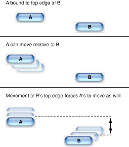
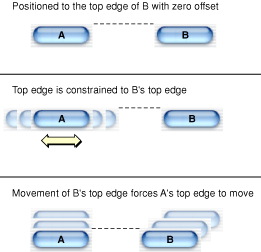

> 导航：[总目录](../../../README.md) · [documentation](../../../_indexes/documentation.md) · [HIView Programming Guide](Introduction%20to%20HIView%20Programming%20Guide.md)


[Next](Document%20Revision%20History.md)[Previous](HIView%20Concepts.md)

# HIView Tasks

This chapter contains instructions and sample code for implementing common tasks involving HIView, such as creating and embedding views, automating view layout, drawing in views, and implementing some new view-based controls. It also contains information about subclassing views to create your own custom user interface elements.

Windows that use HIView must have compositing turned on. Compositing means that HIView draws window content view by view, from back to front, allowing each view to draw only the portions of itself that are visible. That is, you don’t have to worry about inefficient drawing resulting from drawing on top of existing pixels.

Turn on compositing by setting the compositing window attribute. You can do so in the Info window in Interface Builder or by adding `kWindowCompositingAttribute` to the attribute list when you call `CreateNewWindow`. Note that older window creation functions don’t allow compositing.

Unless you really need specialized event handling, you should also specify using the standard window event handler when creating windows for HIView.

If you are porting older control code to HIView, you should know that once compositing is on, your code must accommodate these changes:

- You should replace any calls that draw directly to the screen (`DrawControls`, `Draw1Control`) with the appropriate HIView invalidation call (`HIViewSetNeedsDisplay`).
- You no longer need to erase behind controls, as the compositor keeps track of the background layers and can redraw them as necessary.

Creating views is straightforward. If your view is an older control, just use the Control Manager creation function (for example, `CreateCheckBoxControl`). For new views, use the appropriate HIView creation function shown in Table 2-1.

__Table 2-1__  New view creation functions

| View | Function |
| Combo box | `HIComboBoxCreate` |
| Image view | `HIImageViewCreate` |
| Scroll view | `HIScrollViewCreate` |
| Segmented View | `HISegmentedViewCreate` |
| Search field | `HISearchFieldCreate` |
| Text view | `HITextViewCreate` |
| Web view | `HIWebViewCreate` |
| HICocoaView | `HICocoaViewCreate` |

Menus in Mac OS X v10.3 and later are automatically implemented as views, so you do not need to change your code to adopt view-based menus.

Note that when initially created, the new HIView views are not associated with a window, and some do not even have a physical size. To give the view physical dimensions, you must embed the view within a parent and then set its size and position by calling the function `HIViewSetFrame` or `HIViewPlaceInSuperviewAt`.

You can pass `NULL` for the window reference when calling older control creation functions if you want to create a control that is not initially associated with a window.

Views are invisible when first created. To make them visible, call `HIViewSetVisible` or the Control Manager function `ShowControl`.

The HIView API provides a number of functions to add or remove views from a view hierarchy:

- To embed a view within another view, call the `HIViewAddSubview` function:

```
OSStatus HIViewAddSubview (HIViewRef inParent, HIViewRef inChild);
```

  Note that this function merely adds the view to the hierarchy; it does not physically place the view within its parent. To position the view, you should call the `HIViewSetFrame` function or `HIViewPlaceInSuperviewAt`.
- To remove a view from its parent, call the `HIViewRemoveFromSuperview` function:

```
OSStatus HIViewRemoveFromSuperview (HIViewRef inView);
```
- To determine the parent of a view, call the `HIViewGetSuperview` function:

```
HIViewRef HIViewGetSuperview (HIViewRef inView);
```
- To obtain the root view for a window, call the `HIViewGetRoot` function:

```
HIViewRef HIViewGetRoot (WindowRef inWindow);
```


You use the following functions to set or obtain the position of a view within its parent:

- To obtain the local bounds of a view, call the `HIViewGetBounds` function:

```
OSStatus HIViewGetBounds (HIViewRef inView, HIRect *outRect);
```
- To obtain the frame bounds of a view, call the `HIViewGetFrame` function:

```
OSStatus HIViewGetFrame (HIViewRef inView, HIRect *outRect);
```

  This function is analogous to the older `GetControlBounds` function except that the coordinates are referenced to the view’s parent, not the window’s content region.
- To set the frame bounds of a view, call the `HIViewSetFrame` function.

```
OSStatus HIViewSetFrame (HIViewRef inView, const HIRect *inRect);
```

  This function effectively moves the view within its parent. It also marks the view (as well anything that may have been exposed behind it) to be redrawn.
- To move a view a certain amount within its parent, call the `HIViewMoveBy` function:

```
OSStatus HIViewMoveBy (HIViewRef inView, float inDX, float inDY);
```
- To place a view at a certain point within its parent, call the `HIViewPlaceInSuperviewAt` function:

```
OSStatus HIViewPlaceInSuperviewAt (HIViewRef inView,
                                    float inX, float inY);
```


In Mac OS X v10.3 and later, you can use special layout functions to bind the size or position of one view to another view. For example, the layout APIs make it easy to do any of the following:

- Center views either horizontally or vertically (or both) in a window.
- Specify that an OK button always keep its proper pixel distance from the bottom right corner of the window (as per the Aqua guidelines) even if the window is resized.
- Create group boxes that automatically resize proportionally as the content view bounds change.

You can specify the following different layout options:

- _Bind_ a view so that it maintains its relative position to one or more edges of another view. For example, if you bind a button to the top edge of a group box, the button maintains its relative position to that edge if the group box moves. (Note, however, that you can move the button’s top edge independent of the group box.) See [The HIBinding Structure](#apple-f4xwc4dqnrsv64tfmyxwi33df52wszbpkridgmbqgaydsmrtfvbuqmrqguwviucykjcummjrhe) for more details.
- _Position_ a view so that it is always aligned to the specified edge (or the center) of another view. For example, if you align a button’s top edge to the top edge of a group box, those edges will always share the same y-coordinate. You can also specify an alignment offset if desired. See [The HIPositioning Structure](#apple-f4xwc4dqnrsv64tfmyxwi33df52wszbpkridgmbqgaydsmrtfvbuqmrqguwviucykjcummjsge) for more details.
- _Scale_ a view so that it maintains a particular size ratio with another view. For example, you can specify that a group box’s width is always half that of the content view that contains it. See [The HIScaling Structure](#apple-f4xwc4dqnrsv64tfmyxwi33df52wszbpkridgmbqgaydsmrtfvbuqmrqguwviucykjcummjsga) for more details.

Note that these layout constraints are "one-way"; for example, if button A is constrained to scale as the size of button B changes, that doesn’t mean that button B will scale when button A changes size.

You specify a view’s layout relationships by setting its `HILayoutInfo` structure:

```
struct HILayoutInfo {
    UInt32 version;
    HIBinding binding;
    HIScaling scale;
    HIPositioning position;
    };
```

The `version` field simply indicates the version of this data structure (in case it changes in the future); set this field to `kHILayoutInfoVersionZero`.

The `binding`, `scale`, and `position` fields each point to additional structures that indicate the specific layout constraints for this view.

You can use the view layout APIs to specify layout relationships between any two views (siblings, parents, and so on). The layouts are applied in the following order: binding, scaling, then positioning. Note that some layout information when applied may override previous constraints. For example, positioning constraints may override the bindings set in the `HIBinding` structure.

- To set layout constraints, you must first call the `HIViewGetLayoutInfo` function to obtain the layout structure:

```
OSStatus HIViewGetLayoutInfo (HIViewRef inView,
                                HILayoutInfo *outLayoutInfo);
```

  Then you can modify the fields of the structure to specify the layout constraints you want.
- To set the layout relationships for a view, you use the `HIViewSetLayoutInfo` function:

```
OSStatus HIViewSetLayoutInfo (HIViewRef inView,
                                const HILayoutInfo *inLayoutInfo);
```
- If you set a layout that constrains view A to view B, the layouts do not get implemented until either view B moves or resizes, or you call the `HIViewApplyLayout` function on view A:

```
OSStatus HIViewApplyLayout (HIViewRef inView);
```
- Layouts are active by default. To temporarily disable the layout constraints, call `HIViewSuspendLayout`. To resume the layout, call `HIViewResumeLayout`:

```
OSStatus HIViewSuspendLayout (HIViewRef inView);
OSStatus HIViewResumeLayout (HIView inView);
```
- To determine if the layout is active or suspended, call the `HIViewIsLayoutActive` function:

```
Boolean HIViewIsLayoutActive (HIViewRef inView);
```


The `HIBinding` structure specifies the layout bindings for all four sides of the view:

```
struct HIBinding {
    HISideBinding top;
    HISideBinding left;
    HISideBinding right;
    HISideBinding bottom;
    }
```

The `HISideBinding` structure indicates the binding constraints for a specific side:

```
struct HISideBinding {
    HIViewRef toView;
    HIBindingKind kind;
    };
```

The `toView` field indicates the view you want to bind to. The kind field specifies the side of the `inView` view to bind to. You can pass any of the following constants in the kind field: `kHILayoutBindLeft`, `kHILayoutBindRight`, `kHILayoutBindTop`, `kHILayoutBindBottom`.

For example, say you bind the top edge of view A to the top edge of view B as in Figure 2-1.

You can move view A as you please, as binding seeks to preserve only the relative positioning between view A and B.

If view B moves (or resizes), view A must also move (or resize) to preserve the specified binding. In this case, that means to maintain the vertical distance between the top edges of view A and view B.

__Figure 2-1__  A binding example



You can bind all four edges of your view if you desire. Note that your view’s bounds may change if that is required to maintain the specified bindings.

The `HIPosition` structure specifies the position constraints for the view’s axes:

```
struct HIPositioning {
    HIAxisPosition x;
    HIAxisPosition y;
    }
```

The `HIAxisPosition` structure contains the specific positioning constraints for each axis:

```
struct HIAxisPosition {
    HIViewRef toView;
    HIPositionKind kind;
    float offset;
    };
```

The `toView` field indicates the view that constrains your view. The kind field indicates along which line or side the two views are aligned. You can pass `kHILayoutPositionCenter`, `kHILayoutPositionLeft`, `kHILayoutPositionRight`, `kHILayoutPositionTop`, or `kHILayoutPositionBottom`. The offset field indicates any optional offset to include between `toView` and your view.

For example, say you position the y axis of view A to match the top edge of view B (that is, `positionKind` = `kHILayoutPositionTop`, `offset` = 0), as in Figure 2-2.

View A cannot move up or down, as it is position-constrained to match the top edge of view B.

If view B moves or resizes, view A must move or resize to match any change in view B’s y coordinate.

__Figure 2-2__  A positioning example



The `HIScaling` structure specifies the scaling constraints for both axes of the view:

```
struct HIScaling {
    HIAxisScale x;
    HIAxisScale y;
    };
```

The `HIAxisScale` structure indicates the scaling constraints for a specific axis:

```
struct HIAxisScale {
    HIViewRef toView;
    HIScaleKind kind;
    float ratio;
    };
```

The `toView` field indicates the view that will dictate the axial size of your view. The kind field specifies the type of scaling; currently you must pass `kHILayoutScaleAbsolute`. The ratio field specifies the scale ratio to maintain between your view and the constraining view. For example, if you want your view to always be half the width of `toView`, set `ratio` to 0.5.

You can also set and manipulate the ordering of subviews within a parent view. This process is similar to ordering (sometimes called z-ordering) windows within an application, with views layered from top to bottom.

- To order a view in front of or behind a sibling view, call the `HIViewSetZOrder` function:

```
OSStatus HIViewSetZOrder (HIViewRef inView, HIViewZOrderOp inOp,
                            HIViewRef inOther);
```

  The `inOp` parameter (possible values: `kHIViewZOrderAbove` or `kHIViewZOrderBelow`) determines the position of `inView` with respect to `inOther`.
- To obtain the first (that is, topmost) subview in a parent view, call the `HIViewGetFirstSubview` function:

```
HIViewRef HIViewGetFirstSubview (HIViewRef inParentView);
```
- To obtain the last (bottommost) subview in a parent view, call the `HIViewGetLastSubview` function:

```
HIViewRef HIViewGetLastSubview (HIViewRef inParentView);
```
- To obtain the next view after a specified one, call the `HIViewGetNextView` function:

```
HIViewRef HIViewGetNextView (HIViewRef inView);
```
- To obtain the previous view before a specified one, call the `HIViewGetPreviousView` function:

```
HIViewRef HIViewGetPreviousView (HIViewRef inView);
```


Just like controls, you can set or test for the visibility of views.

- To set the visibility of a view, call the `HIViewSetVisible` function:

```
OSStatus HIViewSetVisible (HIViewRef inView, Boolean inVisible);
```

  This function is analogous to the older `SetControlVisibility` function. Hiding a view also hides any embedded subviews.
- To determine whether a view is visible, call the `HIViewIsVisible` function:

```
Boolean HIViewIsVisible (HIViewRef inView);
```

Note that you can also use the Control Manager functions `SetControlVisibility` and `IsControlVisible` on views.

In Mac OS X v10.2 and later, most views can acquire keyboard focus. This feature allows a user to select a checkbox, enter text, or click a button entirely through the keyboard. The user presses the Tab key to advance the focus and Shift-Tab to move it backwards. Pressing the Space bar activates the view with focus.

Your application should allow the user to advance focus and activate focused views. HIView provides several functions to change keyboard focus:

- To advance the focus to the next appropriate view, call the `HIViewAdvanceFocus` function:

```
OSStatus HIViewAdvanceFocus (HIViewRef inRootForFocus,
                                EventModifiers inModifiers);
```

  You pass in the root of the subtree in which to confine the focus. That is, if you pass in a content view as the root, the focus is confined to the subviews within the content view. You must also pass in the event modifiers parameter of the keyboard event that resulted in the call to `HIViewAdvanceFocus`.

  `HIViewAdvanceFocus` sends a `kEventControlSetFocusPart` event whenever a view is requested to gain, advance, or lose keyboard focus.

  Note that if your window uses the standard event handler, the basic focus-shifting work (acquiring the raw keyboard input, calling `HIViewAdvanceFocus` and so on) is handled for you, and the standard views support the `kEventControlSetFocusPart` event. However, if you are creating a custom view, you may need to handle the `kEventControlSetFocusPart` event yourself.

  Menus and menu items automatically gain keyboard focus support, independent of any standard event handlers.
- `HIViewAdvanceFocus` uses its own algorithm to determine the next view to acquire focus, generally attempting to move the focus from left to right, top to bottom, taking groups of views into account. However, if you want to explicitly specify which view should follow a given view in the focus chain, call the `HIViewSetNextFocus` function:

```
OSStatus HIViewSetNextFocus (HIViewRef inView,
                                HIViewRef inNextFocus);
```


Although HIView simplifies most operations by adopting a view-relative coordinate system, at times you may need to know the coordinates of a object relative to a different view. The HIView API provides several functions to simplify these translations:

- To translate the coordinates of a point from one view to another, call the `HIViewConvertPoint` function:

```
OSStatus HIViewConvertPoint (HIPoint *inPoint, HIViewRef inSourceView,
                                HIViewRef inDestView);
```
- To translate an `HIRect` structure from one view to another, call the `HIViewConvertRect` function:

```
OSStatus HIViewConvertRect (HIRect *ioRect, HIViewRef inSourceView,
                                HIViewRef inDestView);
```
- To translate a region from one view to another, call the `HIViewConvertRegion` function:

```
OSStatus HIViewConvertRegion (RgnHandle ioRgn, HIViewRef inSourceView,
                                HIViewRef inDestView);
```

For example, if you wanted to obtain the global coordinates of a point within a view, (to be used in, say, a call to `WaitMouseUp`), you can call `HIViewConvertPoint` to obtain the window-relative coordinates. You can then get to global coordinates by calling `GetWindowBounds`, specifying the structure region, and add the top left global point of the window to the window-relative point.

You can use any of the usual Quartz functions to draw in your views. However, because HIView flips the Core Graphics context it passes to you, you draw using the QuickDraw coordinate system by default. If you need to draw images, you can use the `HIViewDrawCGImage` function, which flips the Core Graphics context (`CGContext`) back to the Quartz coordinate system, draws the image, and then flips the context back:

```
OSStatus HIViewDrawCGImage (CGContextRef inContext,
                                const HIRect *inBounds,
                                CGImageRef inImage);
```

This function is essentially identical to the Quartz function `CGContextDrawImage` except that it reverses the direction of the y-coordinate axis.

If you prefer to draw in your view using the Quartz coordinate system, you can translate the context you receive in your drawing handler

```
HIViewGetBounds (view, &bounds);
CGContextTranslateCTM (theContext, 0, bounds.size.height);
CGContextScaleCTM (theContext, 1.0, -1.0);
```

The `CGContextTranslateCTM` shifts the origin of the y-axis by the height of the view bounds, while the `CGContextScaleCTM` call invert the y-axis.

Note that unlike in older system software, you should never draw your views outside of a `kEventControlDraw` handler; do not use the Control Manager functions `UpdateControls`, `DrawControls`, or `Draw1Control` to draw to the screen. Instead, you must let the system know that a view, or a portion thereof, needs to be updated. This process is analogous to the older method of adding dirty areas to an update region.

To mark a view as dirty and needing to be redrawn, call the `HIViewSetNeedsDisplay` function:

```
OSStatus HIViewSetNeedsDisplay (HIViewRef inView,
                                    Boolean inNeedsDisplay);
```

Pass `true` for the `inNeedsDisplay` parameter if you want the view updated. You should make this call wherever you would have previously called `DrawControls`.

If you need to update only a portion of a view, you can call the `HIViewSetNeedsDisplayInRegion` function:

```
OSStatus HIViewSetNeedsDisplayInRegion (HIViewRef inView, RgnHandle inRgn,
                                            Boolean inNeedsDisplay);
```

In Mac OS X v10.4 and later you can also use the `HIViewSetNeedsDisplayInRect` and `HIViewSetNeedsDisplayInShape` functions:

```
OSStatus HIViewSetNeedsDisplayInRect( HIViewRef inView,
                const HIRect *  inRect, Boolean inNeedsDisplay);

OSStatus HIViewSetNeedsDisplayInShape( HIViewRef inView,
                HIShapeRef   inArea, Boolean inNeedsDisplay)
```

At the appropriate time, the system copies the updated regions to the screen (or calls your drawing routines).

In rare cases where you want to redraw your view immediately, you can call the `HIViewRender` function in Mac OS X v10.3 and later. Doing so allows you to bypass firing Carbon event timers or any other actions that may occur when cycling through the event loop.

You can turn off drawing related to a view by calling the `HIViewSetDrawingEnabled` function:

```
OSStatus HIViewSetDrawingEnabled (HIViewRef inView, Boolean inEnabled);
```

Turning off drawing in a view also affects any subviews embedded within it.

When drawing is turned off, the view is not drawn or updated (that is, calls to `HIViewSetNeedsDisplay` or even `Draw1Control` have no effect).

To determine whether drawing is allowed for a view, call the `HIViewIsDrawingEnabled` function:

```
Boolean HIViewIsDrawingEnabled (HIViewRef inView);
```


Beginning in Mac OS X v10.3, all menus are implemented as views. This feature allows additional flexibility in creating or modifying menus. The actual menu content views are created lazily, as needed. That is, the Menu Manager does not create the menu content view, or even the owning window/root view/content view hierarchy that holds it, until the user first clicks on a menu title in the menu bar.

Listing 2-1 gives an example of how you can manipulate a menu as a view. This example allows you to install an event handler on the menu content view.

__Listing 2-1__  Creating a menu with an embedded image

```
IBNibRef nibRef;
MenuRef myMenuRef;
HIViewRef theView;
EventTypeSpec myEvent;
…
CreateMenuFromNib (nibRef, CFSTR ("myMenu"),&myMenuRef);
InsertMenu (myMenuRef, 0);

HIMenuGetContentView (myMenuRef, kThemeMenuTypePullDown, &theView);

myEvent.eventClass = kEventClassControl;
myEvent.eventKind = kEventControlOwningWindowChanged;

InstallControlEventHandler (theView, myPictureHandler, 2, &myEvent,0, NULL);
```

Here is how the code works:

1. First create the menu. The easiest way is to load it from a nib file, but you can use older Menu Manager functions to do so as well. After creating the menu, use `InsertMenu` to install it into the menu bar. At this point, none of the menu content views or owning windows have been created.
2. Call `HIMenuGetContentView` on your menu reference to obtain the menu content view associated with it. This is the view that displays the menu items. Note that making this call forces an instantiation of the menu content view before it actually needs to be displayed.
3. Install an event handler for the `kEventControlOwningWindowChanged` event on the menu content view. This event is sent when the menu content view is attached to a window content view for display (which occurs the first time the user clicks the menu title to display the menu).

Listing 2-2 shows a possible implementation for the event handler installed in Listing 2-1. This example installs an image view in your menu content view so that it appears behind the menu items.

__Listing 2-2__  Adding an image view to a menu

```
OSStatus PictureHandler( EventHandlerCallRef caller, EventRef event,
                            void* refcon )
{
    OSStatus    err = eventNotHandledErr;
    WindowRef   owner;

    GetEventParameter( event, kEventParamControlCurrentOwningWindow,
                     typeWindowRef, NULL, sizeof( owner ), NULL, &owner );

    if ( owner != NULL )
    {
        // find the content view
        HIViewRef content;
        HIViewFindByID( HIViewGetRoot( owner ), kHIViewWindowContentID,
                         &content );

        // create a data provider for our image
        CFURLRef url = CFBundleCopyResourceURL( CFBundleGetMainBundle(),
                            CFSTR("GoldenGate"), CFSTR("jpg"), NULL );
        CGDataProviderRef data = CGDataProviderCreateWithURL( url );
        CFRelease( url );

        // create our image
        CGImageRef image = CGImageCreateWithJPEGDataProvider( data, NULL,
                                     true, kCGRenderingIntentDefault );
        CFRelease( data );

        // create our image view
        HIViewRef imageView;
        HIImageViewCreate( image, &imageView );
        HIImageViewSetOpaque( imageView, false );
        HIImageViewSetAlpha( imageView, 0.3 );
        CFRelease( image );

        // position our image view below the content view's children
        HIViewAddSubview( content, imageView );
        HIViewSetZOrder( imageView, kHIViewZOrderBelow, NULL );
        HIViewSetVisible( imageView, true );

        // size our image view to match the content view
        HIRect bounds;
        HIViewGetBounds( content, &bounds );
        HIViewSetFrame( imageView, &bounds );
    }
    return err;
}
```

Here is how the code works:

1. Call `GetEventParameter` to obtain a reference to the window that owns this menu. Note that each menu has its own separate owning window (including submenus).
2. Call `HIViewFindByID` to obtain the content view for the window. This is the view that contains the menu content view, and also the one in which the image view will be embedded.
3. Create a data provider for the image you want to display. First, call the Core Foundation function `CFBundleCopyResourceURL` to get the URL to the image in the bundle, then call the Core Graphics function `CGDataProviderCreateWithURL` to obtain a data provider. After creating the data provider, you can release the URL by calling `CFRelease`.
4. Next, create a Core Graphics image from the data provider by calling `CGImageCreateWithJPEGDataProvider`. After creating the image, you can release the data provider.
5. Call `HIImageViewCreate` to create an image view from the Core Graphics image. After creating the image view, you can dispose of the Core Graphics image by calling `CFRelease`.
6. Passing `false` to `HIImageViewSetOpaque` specifies that the image view is not opaque.
7. Set the transparency of the image view by calling `HIViewSetAlpha`. Making the image translucent allows the background of the window content view (that is, the light gray striping) to show through. The alpha range can vary from 0 (transparent) to 1 (opaque).
8. Call `HIViewAddSubview` to add the image view to the window content view.
9. Call `HIViewSetZOrder` to place the image view behind the menu content view.
10. Call `HIViewSetVisible` to make the image view visible.
11. Lastly, set the bounds of the image view to be the same as that of the window content view. Doing so ensures that the image covers the entire background of the menu. `HIViewGetBounds` obtains the bounds of the window content view, and `HIViewSetFrame` sets the bounds of the image view to match those of the content view.

View-based menus allow you even more flexibility when creating custom menu items. For example, you can draw into your menus using Quartz, embed controls within the menu, and so on. Instead of creating custom MDEFs for your menus, you simply create a custom view, and implement Carbon events to handle any required messaging. See [Creating Custom Menus](#apple-f4xwc4dqnrsv64tfmyxwi33df52wszbpkridgmbqgaydsmrtfvbuqmrqguwueqkkjbfegqsd) for more information.

The HIView scroll view provides an easy way to display a scrollable image. For example, you can simply embed an image view within the scroll view and the scroll view automatically handles the scrolling of the image; you don’t need to worry about installing live feedback handlers, adjusting scroller positions and sizes, or moving pixels.

Listing 2-3 shows a simple example of displaying a scrollable JPEG image in a document window. This example assumes that the image you want to display is a JPEG file installed in your application bundle (in the Resources folder).

__Listing 2-3__  Creating a scroll view with an embedded image

```
WindowRef scrollWindow;
Rect windowBounds = {100, 100, 500, 550};
HIRect myViewRect;
HIViewRef myImageView, myScrollView, myContentView;

CGImageRef myImage;
CGDataProviderRef myProvider;

CFBundleRef theAppBundle;
CFStringRef filename;
CFURLRef theURL;

CreateNewWindow (kDocumentWindowClass, kWindowStandardHandlerAttribute |
             kWindowCompositingAttribute, &windowBounds,&scrollWindow);

/* Get the JPEG image from a file. */
theAppBundle = CFBundleGetMainBundle();

filename = CFStringCreateWithCString(NULL, "CowPuppy.jpg",
                kCFStringEncodingASCII);

theURL = CFBundleCopyResourceURL (theAppBundle, filename, NULL, NULL);

/* Quartz stuff to put the JPEG image into an image view */
myProvider = CGDataProviderCreateWithURL(theURL);
myImage = CGImageCreateWithJPEGDataProvider (myProvider, NULL, false,
                                     kCGRenderingIntentDefault);

CGDataProviderRelease (myProvider);
CFRelease(filename);

/* Now create the scroll view and image view. */
HIScrollViewCreate (kHIScrollViewOptionsVertScroll |
                     kHIScrollViewOptionsHorizScroll, &myScrollView);

HIViewSetVisible (myScrollView, true);

HIViewFindByID(HIViewGetRoot(scrollWindow), kHIViewWindowContentID,
                 &myContentView);
HIViewAddSubview (myContentView, myScrollView);

myViewRect.origin.x = 50.0;
myViewRect.origin.y = 10.0;
myViewRect.size.width = 300.0;
myViewRect.size.height = 300.0;

HIViewSetFrame (myScrollView, &myViewRect);

HIImageViewCreate (myImage, &myImageView);
CGImageRelease (myImage);

HIViewSetVisible (myImageView, true);
HIViewAddSubview (myScrollView, myImageView);

ShowWindow (scrollWindow);
```

Here is how the code works:

1. Call `CreateNewWindow` to create a new document window. Note that you must set the `kWindowCompositingAttribute` attribute if you want to use HIView objects in the window. Use of the standard window handler is also highly recommended.

   If you are creating a window from a nib file, you must set the Compositing checkbox for the window from the Info window in Interface Builder.
2. Call the Core Foundation CFBundle function `CFBundleGetMainBundle` to find the main application bundle.
3. Create a CFString of the name of the image file using the Core Foundation function `CFStringCreateWithCString`.
4. Call the Core Foundation function `CFBundleCopyResourceURL` to build a URL path to the image file in the application bundle.
5. Use the Core Graphics function `CGDataProviderCreateWithURL` to create a data provider. In Quartz, you need to create data providers before creating a `CGImage` object.
6. Call the Core Graphics function `CGImageCreateWithJPEGDataProvider` to create a `CGImage` object from the JPEG file.
7. After creating the `CGImage` object, you can release the data provider and the `CFString` filename object by calling `CGDataProviderRelease` and `CFRelease` respectively.
8. To create the scroll view, call the `HIScrollViewCreate` function. This example passes in options specifying both horizontal and vertical scroll bars.
9. Call `HIViewSetVisible` to make the scroll view visible.
10. In order to embed the scroll view properly, you need to obtain the content view of the window. You do so by calling the `HIViewFindByID` function, specifying that you want to find the content view. Note that this function requires the root view as its first parameter. To obtain the root view for this window, you must call `HIViewGetRoot`.

    Note that to obtain the content view, you could also call the Control Manager function `GetRootControl`.
11. To embed the scroll view in the content view, call the `HIViewAddSubview` function. Note that at this point, although the scroll view is embedded in the content view, it has no bounds (that is, it has no physical location or size).
12. To set the bounds of the scroll view, you fill in an `HIRect` structure. Note that this structure has a format different from that of the QuickDraw `Rect` structure. This example creates a 300 pixel square scroll view located at (50,10) in the local coordinates of the content view.
13. Once you specify the bounds in `myViewRect`, you pass them into the `HIViewSetFrame` function to set the frame bounds of the scroll view (that is, the coordinates of the scroll view relative to the content view).

    If you want the scroll view to occupy the entire content view, you can call `HIViewGetBounds` (not `HIViewGetFrame`) on the content view and pass the resulting `HIRect` into `HIViewSetFrame` for the scroll view.
14. To create the image view, you call `HIImageViewCreate`, passing in the `CGImage` object you obtained from `CGImageCreateWithJPEGDataProvider`.
15. After creating the image view, you can dispose of the `CGImage` object by calling the Core Graphics function `CGImageRelease`.
16. Call `HIViewSetVisible` to make the image view visible.
17. Call `HIViewAddSubview` to embed the image view within the scroll view. The image view will appear with the top-left corner aligned with the scroll view’s origin.
18. Call the Window Manager function `ShowWindow` to display the window with the scroll view.

If you create your scroll view to be resizable, by passing `true` to the `HIScrollViewSetScrollBarAutoHide` function, you can specify that the scroll bars be hidden if the scroll view is enlarged to the point that the entire image is visible.

HIView lets you create a combo box control using simple function calls. All of the basic pop-up behavior and item selection is handled for you automatically. In addition, HIView combo boxes also support the following optional features, which you set by specifying attributes during creation:

- auto-completion in the editable text field (`kHIComboBoxAutoCompletionAttribute`)
- automatic disclosure of list items when the user enters text (`kHIComboBoxAutoDisclosureAttribute`)
- alphabetical sorting of list items (`kHIComboBoxAutoSortAttribute`)
- automatic resizing of the list to conform to the Aqua human interface guidelines (`kHIComboBoxAutoSizeListAttribute`). Note that if you do not specify this attribute, you must size the list yourself using Control Manager `SetControlData` tags. Otherwise the size of the list is undefined. See `HIView.h` for a listing of available combo box data tags.

Listing 2-4 shows a code fragment that creates the simple combo box in [Figure 1-7](HIView%20Concepts.md#apple-f4xwc4dqnrsv64tfmyxwi33df52wszbpkridgmbqgaydsmrtfvbuqmrqgqwueq2jjbcuurkj).

__Listing 2-4__  Creating a simple combo box

```
WindowRef myPrefsWindow;
HIViewRef myCombo, myContentView;
HIRect hiRect;

Rect myBounds = {100, 100, 500, 500};
Rect ComboRect = {0, 0, 20, 100};

CreateNewWindow (kMovableModalWindowClass, kWindowStandardHandlerAttribute|
                kWindowCompositingAttribute, &myBounds,&myPrefsWindow);

hiRect.origin.x = ComboRect.left;
hiRect.origin.y = ComboRect.top;
hiRect.size.width = ComboRect.right-ComboRect.left;
hiRect.size.height = ComboRect.bottom-ComboRect.top;

HIComboBoxCreate (&hiRect, CFSTR ("Hobbes"), NULL, NULL,
                    kHIComboBoxStandardAttributes, &myCombo);

HIViewSetVisible (myCombo, true);

HIViewFindByID (HIViewGetRoot(myPrefsWindow),kHIViewWindowContentID,
                 &myContentView);
HIViewAddSubview (myContentView, myCombo);
HIViewPlaceInSuperviewAt (myCombo, 25.0, 25.0);

HIComboBoxAppendTextItem (myCombo, CFSTR ("Hobbes"), NULL);
HIComboBoxAppendTextItem (myCombo, CFSTR ("Plato"), NULL);
HIComboBoxAppendTextItem (myCombo, CFSTR ("Heidegger"), NULL);
HIComboBoxAppendTextItem (myCombo, CFSTR ("Aristotle"), NULL);

ShowWindow (myPrefsWindow);
```

Here is what the code does:

1. This example places the combo box in a movable modal window created using `CreateNewWindow`. Note that you must specify the `kWindowCompositingAttribute` attribute.
2. This example originally specifies the bounds of the combo box as a QuickDraw `Rect` structure and then translates those coordinates into a Quartz-compatible `HIRect` structure.
3. To create the combo box, call the `HIComboBoxCreate` function. You specify the following parameters:

   - The bounds of the combo box, as an `HIRect` structure.
   - The initial text in the editable text field as a Core Foundation `CFString`. This text could indicate the kind of item the user should enter, or the default item selection.
   - A pointer to a Control Manager `ControlFontStyleRec` structure indicating the font style to use for this combo box. Pass `NULL` (as in this example) if you want to use the default system font.
   - A Core Foundation `CFArray` containing the items you want to display in the item list. You can also pass `NULL` (as in this example) and add items on-the-fly later.
   - The attributes you want for this combo box. Specifying `kHIComboBoxStandardAttributes` gives you the automatic sizing, list disclosure, and text completion features.

   On return, `myCombo` contains the new combo box.
4. As usual, the new HIView is initially hidden, so call `HIViewSetVisible` to make it visible.
5. To embed the combo box in the movable modal window’s content view, you can call `HIViewFindByID` and `HIViewAddSubview`, just as in [Listing 2-3](#apple-f4xwc4dqnrsv64tfmyxwi33df52wszbpkridgmbqgaydsmrtfvbuqmrqguwueqkkincuuq2k). However, as an alternative to using `HIViewSetFrame` to position the combo box in the view, you can call the `HIViewPlaceInSuperviewAt` function. You can do this because the combo box already has a size; you now need to specify only a position. The coordinates you specify indicate the top-left corner of the view’s bounds.
6. You can add items to the combo box list by simply calling the `HIComboBoxAppendTextItem` function. This example adds four items.

One of the advantages of HIView is that you can subclass an existing view when creating a custom view. In object-oriented fashion, a view is essentially a class defined by Carbon event handlers (essentially methods) and instance data. To create a custom view, you must create a subclass of HIView and add your custom functionality by overriding event handlers.

You register your subview much like you register a custom window or control when you call `RegisterToolboxObjectClass`, but there are some parameter differences.

```
OSStatus HIObjectRegisterSubclass (CFStringRef inClassID,
                                CFStringRef inBaseClassID,
                                OptionBits inOptions,
                                EventHandlerUPP inConstructProc,
                                UInt32 inNumEvents,
                                const EventTypeSpec *inEventList,
                                void* inConstructData,
                                HIObjectClassRef *outClassRef);
```

1. The `inClassID` parameter represents the ID of the class you want to register. This ID must be a Core Foundation string, preferably in the form _com.CompanyName.Application.ClassName_.
2. The `inBaseClassID` parameter represents the class you want to subclass. For the base HIView class, you pass the constant `kHIViewClassID`.
3. Pass any options in the `inOptions` parameter. Currently there are no options (pass `0`).
4. The `inConstructProc` is a universal procedure pointer (UPP) to the event handler for your view class.
5. The `inNumEvents` parameter indicates the number of events you want to register for this view class.
6. The `inEventList` array contains the events to register for this class. You define these just as you would for registering any Carbon Event handler.
7. The `inConstructData` parameter points to any initialization data (that is, constructor data) you want to pass to your class.
8. On return, `outClassRef` holds the class reference for your registered subclass. You pass this value to `HIObjectCreate` when creating an instance of your class.

Listing 2-5 shows a function that registers a custom view.

__Listing 2-5__  Registering a custom view

```
#define kMyCustomViewClassID CFSTR("com.myCorp.myApp.myView")

OSStatus myCustomViewRegister()
{
    OSStatus                err = noErr;
    static HIObjectClassRef sMyViewClassRef = NULL;

    if ( sMyViewClassRef == NULL )
    {
        EventTypeSpec       eventList[] = {
            { kEventClassHIObject, kEventHIObjectConstruct },
            { kEventClassHIObject, kEventHIObjectInitialize },
            { kEventClassHIObject, kEventHIObjectDestruct },
            { kEventClassControl, kEventControlInitialize },
            { kEventClassControl, kEventControlDraw },
            { kEventClassControl, kEventControlHitTest },
            { kEventClassControl, kEventControlGetPartRegion } };

        err = HIObjectRegisterSubclass(
            kMyCustomViewClassID,       // class ID
            kHIViewClassID,             // base class ID
            NULL,                       // option bits
            myCustomViewHandler,        // construct proc
            GetEventTypeCount( eventList ),
            eventList,
            NULL,                       // construct data,
            &sMyViewClassRef );
    }

    return err;
}
```

This example stores the resulting `HIObjectClassRef` value as a static variable, so you can skip the registration call if your class has already been registered.

You specify an event handler for your view when you call `HIObjectRegisterSubclass`, just as you would for any custom control. Listing 2-6 shows an event handler to correspond with the class registered in Listing 2-5.

__Listing 2-6__  A custom view event handler

```
OSStatus myCustomViewHandler(
    EventHandlerCallRef     inCallRef,
    EventRef                inEvent,
    void*                   inUserData )
{
    OSStatus                err = eventNotHandledErr;
    UInt32                  eventClass = GetEventClass( inEvent );
    UInt32                  eventKind = GetEventKind( inEvent );
    myCustomViewData*       data = (myCustomViewData*) inUserData;

    switch ( eventClass )
    {
        case kEventClassHIObject:
        {
            switch ( eventKind )
            {
                case kEventHIObjectConstruct:
                    err = myCustomViewConstruct( inEvent );
                    break;

                case kEventHIObjectInitialize:
                    err = myCustomViewInitialize( inCallRef, inEvent,
                                                    data );
                    break;

                case kEventHIObjectDestruct:
                    err = myCustomViewDestruct( inEvent, data );
                    break;
            }
        }
        break;

        case kEventClassControl:
        {
            switch ( eventKind )
            {
                case kEventControlInitialize:
                    err = noErr;
                    break;

                case kEventControlDraw:
                    err = myCustomViewDraw( inEvent, data );
                    break;

                case kEventControlHitTest:
                    err = myCustomViewHitTest( inEvent, data );
                    break;

                case kEventControlGetPartRegion:
                    err = myCustomViewGetRegion( inEvent, data );
                    break;
            }
        }
        break;
    }

    return err;
}
```

Note that this handler uses special HIObject class events. The sections that follow describe HIObject events, as well as other basic events your custom view may want to handle.

All custom views must support the following Carbon events of class `kEventClassHIObject` (as defined in `HIObject.h`). These events correspond to object-oriented constructor and destructor methods:

- `kEventHIObjectConstruct`: you use this event to allocate memory for your instance data. Typically you want to allocate enough space to store the `HIViewRef` (or `ControlRef`) as well as any other view-specific instance data. You must return a pointer to this allocated memory in the `kEventParamHIObjectInstance` parameter (type `typeVoidPtr`).
- `kEventHIObjectDestruct`: your view receives this event when its reference count has dropped to zero (that is, when the object should be destroyed). You should use this event to dispose of anything you may have allocated for your view.

Listing 2-7 shows a sample handler for the `kEventHIObjectConstruct` event.

__Listing 2-7__  A kEventHIObjectConstruct handler

```swift
typedef struct
{
    ControlRef control;
} myCustomViewData;

OSStatus myCustomViewConstruct (EventRef inEvent)
{
    OSStatus                err;
    myCustomViewData*       data;

    data = malloc( sizeof( myCustomViewData ) );
    require_action( data != NULL, CantMalloc, err = memFullErr );

    err = GetEventParameter( inEvent, kEventParamHIObjectInstance,
                            typeHIObjectRef, NULL, sizeof( HIObjectRef ),
                            NULL, (HIObjectRef*) &data->control );
    require_noerr( err, ParameterMissing );

    // Set the userData to be used with all subsequent eventHandler calls
    err = SetEventParameter( inEvent, kEventParamHIObjectInstance,
                            typeVoidPtr, sizeof( myCustomViewData* ),
                            &data );
ParameterMissing:
    if ( err != noErr )
        free( data );

CantMalloc:
    return err;
}
```

Here is what the code does:

1. The `myCustomViewData` structure defines the instance data to associated with the class. In this case, the only data required is the control reference. Note that you could also have defined this as an `HIViewRef` type or an `HIObjectRef` type, as they are identical.
2. Use `malloc` to allocate space for your instance data.
3. This code example and others in this section use Apple-defined error-checking macros. For more information about using these macros, see the header `AssertMacros.h`.
4. Use the Carbon Event Manager function `GetEventParameter` to obtain the default instance data for this class (which is just the `HIViewRef`). You store this data in the `control` field of your instance data.
5. Now, use `SetEventParameter` to set your instance data to be the instance data for this class. Because this example only has one field, you are passing back the same data that you received. However, this procedure allows you to specify additional instance data if you desire. The data you specify for the `kEventParamHIObjectInstance` parameter is then passed to your HIObject event handler in the `userData` parameter when subsequent events occur.

Your `kEventHIObjectDestruct` handler should dispose of anything allocated for your view (such as user data allocated during the initialize event and instance data) Do not dispose of the view reference. Listing 2-8 shows a very simple destruct handler that simply frees the instance data you allocated in the construct handler.

__Listing 2-8__  A kEventHIObjectDestruct handler

```
OSStatus myCustomViewDestruct (EventRef inEvent,
                                myCustomViewData* inData)
{
    free (inData);

    return noErr;
}
```

In addition, your view will usually want to support the `kEventHIObjectInitialize` event. This handler provides a simple mechanism to perform any needed initialization tasks. As a rule, your handler should first pass the event to its superclass by calling `CallNextEventHandler`. This gives the superclass the opportunity to perform any initializations.

You can also use this event to pass initialization data to your view when you call `HIObjectCreate`. For example, you may want to pass initial bounds (size and position) information to your view using this event.

Listing 2-9 shows an example of an initialization event handler.

__Listing 2-9__  A kEventHIObjectInitialize handler

```swift
OSStatus myCustomViewInitialize (EventHandlerCallRef inCallRef,
                            EventRef inEvent,
                            myCustomViewData* inData)
{
    OSStatus err;
    Rect bounds;

    // Let any parent classes have a chance at initialization
    err = CallNextEventHandler( inCallRef, inEvent );
    require_noerr( err, TroubleInSuperClass );

    // Extract the bounds from the initialization event
    err = GetEventParameter( inEvent, 'Boun', typeQDRectangle,
            NULL, sizeof( Rect ), NULL, &bounds );
    require_noerr( err, ParameterMissing );

    // Resize the view
    SetControlBounds( inData->control, &bounds );

ParameterMissing:
TroubleInSuperClass:
    return err;
}
```

Here is what the code does:

1. First, call the Carbon Event Manager function `CallNextEventHandler` to give the view’s superclasses a chance to perform any initialization.
2. Any further initialization is entirely up to the application. Note that before you call `HIObjectCreate`, you can store initialization data as parameters in the `kEventHIObjectInitialize` event. In this example, the initial bounds were stored in the event, so you call `GetEventParameter` to obtain it. The parameter identifier (`'Boun'` in this example) is entirely arbitrary (as long as it’s a four-character code), as it is used only in this event.
3. After obtaining the bounds of the view, you call the Control Manager function `SetControlBounds` to set them. Note that you could also have used the `HIViewSetFrame` function to set the bounds of the view, but you must make sure you passed an `HIRect` type in the initialize event.

When a hit-test event (`kEventControlHitTest`) occurs, your custom view must indicate what part of itself was hit. The system can then send draw events to your view if that is required for tracking or selecting.

Note that while the Control Manager defines several part codes, you are also free to define your own values within the range 1 through 127. All negative value part codes are defined by Apple; your application can respond to these negative values (for example, when asked to shift focus), but it should never return them from a `kEventControlHitTest` handler.

You can use `GetEventParameter` to obtain the mouse location parameter, and then use `SetEventParameter` to pass back the part code that was hit in the control part parameter.

When the draw event (kEventControlDraw) occurs, you must draw your view or portion thereof.

If you are using Quartz, you must obtain the `kEventParamCGContextRef` parameter, which holds the Core Graphics context you should draw into. You must use the context that is passed to you rather than creating your own in the drawing handler. This context is already transformed, so you simply draw.

If you are using QuickDraw, you can obtain the current graphics port from the `kEventParamGrafPort` parameter.

In addition, whether you use QuickDraw or Quartz, the `kEventControlDraw` event also contains a `kEventParamRgnHandle` parameter. This region defines the visible portion of the view, and in most cases you should restrict your drawing to this area; any part of the view outside this area is presumably covered by another view and will be overwritten. The HIView compositor determines the size of this region.

At times the system may need to obtain region information about your view; it sends a `kEventControlGetPartRegion` event to do so. The most important regions are the structure region and the opaque region. The event reference indicates the desired region in the `kEventParamPartCode` parameter. You should use `SetEventParameter` to return the requested region handle in the `kEventParamControlRegion` parameter.

The structure region is essentially the area onscreen taken up by the view. In many cases this area is identical to the view’s bounds, but not always. For example, focus rings are considered part of the structure region, even though they appear outside the view bounds. If you choose not to return a structure region (or you choose not to handle this event), the system assumes that the view’s bounds are the structure region.

If your view’s structure region changes, you should inform the system by calling the `HIViewReshapeStructure` function. Doing so lets the system recalculate visible areas and redraw as appropriate. For example, if your view gains or loses a focus ring, the structure changes size and you should inform the system.

The opaque region is the part of your view that is opaque. Knowledge of a view’s opaque region simplifies drawing because the HIView compositor knows that it does not have to render anything underneath the opaque parts. If you do not return an opaque region (or if you don’t handle this event) the compositor assumes the view is transparent.

If your view supports drag and drop, you should support the following Carbon events:

- `kEventControlDragEnter`: sent when the drag item enters your view. Typically you should check to see if your view accepts the type of drag item, and if so, highlight the view. If your view accepts the drag item, you must return a Boolean parameter (`kEventParamControlLikesDrag`, `typeBoolean`) in the drag-enter event.
- `kEventControlDragWithin`: sent while the user drags within your view (but not within a subview).
- `kEventControlDragLeave`: sent when the drag item leaves your view.
- `kEventControlDragReceive`: sent when the user drops an item in your view. If your window accepts the item, it can take appropriate action (for example, paste dragged text into the window).

To enable drag-and-drop, your code should also take the following steps:

- Set the `kControlSupportsDragAndDrop` bit in the `kEventParamControlFeatures` parameter of the `kEventControlInitialize` event. You should set these bits before calling `CallNextEventHandler`.
- Call `SetControlDragTrackingEnabled` (with the Boolean parameter set to `True`) for the view.
- Turn on drag-tracking for the window using the `SetAutomaticControlDragTrackingEnabledForWindow` function.

To streamline the event handling, if your view does not handle the `kEventControlDragEnter` event, then it never receives any other drag events. If you think you may want the drag item, return `noErr` from your drag-entered handler.

Note that only views that can receive keyboard focus can receive drag-within or drag-received events.

For more detailed information about how your application should behave in response to drag-and-drop actions, see the document _Apple Human Interface Guidelines_.

To create an instance of a view, you call the `HIObjectCreate` function.

Listing 2-10 gives an example of a function to create a view instance.

__Listing 2-10__  A view instance creation function

```
OSStatus CreateMyCustomView ( WindowRef inWindow, const Rect*inBounds,
                                ControlRef* outControl )
{
    OSStatus            err;
    ControlRef          root;
    EventRef            event;

    // Register this class
    err = myCustomViewRegister();
    require_noerr( err, CantRegister );

    // Make an initialization event
    err = CreateEvent( NULL, kEventClassHIObject, kEventHIObjectInitialize,
                        GetCurrentEventTime(), 0, &event );
    require_noerr( err, CantCreateEvent );

    // If bounds were specified, push the them into the initialization event
    // so that they can be used in the initialization handler.
    if ( inBounds != NULL )
    {
        err = SetEventParameter( event, 'Boun', typeQDRectangle,
                sizeof( Rect ), inBounds );
        require_noerr( err, CantSetParameter );
    }

    err = HIObjectCreate( kMyCustomViewClassID, event, (HIObjectRef*)
                            outControl );
    require_noerr( err, CantCreate );

    // If a parent window was specified, place the new view into the
    // parent window.
    if ( inWindow != NULL )
    {
        err = GetRootControl( inWindow, &root );
        require_noerr( err, CantGetRootControl );

        err = HIViewAddSubview( root, *outControl );
    }

CantCreate:
CantGetRootControl:
CantSetParameter:
CantCreateEvent:
    ReleaseEvent( event );

CantRegister:
    return err;
}
```

Here is what the code does:

1. The `CreateMyCustomView` function mimics an older Control Manager creation function in that you can specify the desired bounds of the view as well as the owning window in its input parameters.
2. Register your custom class if you have not already done so. Note that you can register your subclass multiple times with no adverse effects.
3. As mentioned in [Handling HIObject Events](#apple-f4xwc4dqnrsv64tfmyxwi33df52wszbpkridgmbqgaydsmrtfvbuqmrqguwueqkcivbuqrce), the `HIObjectCreate` function requires you to pass it a `kEventHIObjectInitialize` event. You must create this event by calling the Carbon Event Manager function `CreateEvent`, specifying the event class and kind.
4. If the `CreateMyCustomView` function received a valid bounds parameter, you should attach it to the initialization event by calling `SetEventParameter`. The parameter name is four-character code that can be completely arbitrary as long as your initialization event handler recognizes it.
5. To create the instance, call `HIObjectCreate`, passing the class of view to create and the initialization event. On return, `outControl` contains a reference to the new view.
6. If the `CreateMyCustomView` function received a valid owning window reference, you can add it to the window’s view hierarchy by calling `HIViewAddSubview`. This example adds the view to the content view (by calling the Control Manager function `GetRootControl`), but you can add it to the root view or any other arbitrary view if you desire.

In Mac OS X v10.3 and later, if you want to create a custom menu, you should create one as an HIView subclass rather than using an old-style menu definition `MDEF`. Doing so generally requires less work on your part, as you can inherit a lot of functionality from the menu content view class.

A custom menu is a view typically subclassed from the `HIMenuView` or `HIStandardMenuView` classes.

- `HIMenuView` is the base class for menu views. It sets or implements the following functionality:

  - The view is marked to be ignored for accessibility, so assistive applications do not think it is a standard window/view hierarchy.
  - Sets the `kHIViewDoesNotUseSpecialParts` and `kHIViewAllowsSubviews` feature bits.
  - Implements default handlers for `kEventMenuCreateFrameView`, `kEventMenuGetFrameBounds`, `kEventControlSetFocusPart`, `kEventMenuBecomeScrollable` , `kEventMenuCeaseToBeScrollable``kEventScrollableScrollTo` and `kEventControlSimulateHit`. See [Optional Menu Definition Events](#apple-f4xwc4dqnrsv64tfmyxwi33df52wszbpkridgmbqgaydsmrtfvbuqmrqguwviucykjcummjsha) for more details.
  - Handles `kEventControlClick` by returning `paramErr`. Doing so prevents clicks in the menu view from invoking the Control Manager’s default tracking. The Menu Manager handles all menu tracking instead.
  - Handles `kEventControlHit` by returning `paramErr`. Doing so prevents `kEventControlHit` events generated by clicks in the menu from being sent to the application.

  You should subclass from the base class if your menu contains unusual items (such as buttons, sliders, and so on) or requires specialized tracking.
- `HIStandardMenuView` is the class for the standard Aqua-compliant menu. That is, it assumes that you are displaying conventional menu items. It provides handlers for standard menu display, tracking, and selection.

Use the `HIObjectRegisterSubclass` function to register your custom subclasses.

You create your custom menus by calling `CreateCustomMenu`, just as if you were creating an MDEF-based menu. However, instead of providing a pointer to your menu definition, you must specify a class ID and an (optional) initialization event for your custom menu in the menu definition specification.

```
enum {kMenuDefClassID = 1};
struct MenuDefSpec
{
    MenuDefType defType;
    union
    {
        MenuDefUPP defProc;
        struct
        {
            CFStringRef classID;
            EventRef initEvent;
            }view;
        }u;
    }
```

When it comes time to display the menu, the system calls `HIObjectCreate`, passing in the class ID and the initialization event you specified in the menu definition specification.

As with any custom view, you must register your view subclass before use, assigning it a unique class ID and specifying the events that your view will handle.

All view-based menus must handle a number of different events. Note, however, that the hit-test, draw, and get part events may be handled by views embedded within the menu content view rather than the view itself.

The Menu Manager sends this event to determine the size of your menu content view. Your view should return its dimensions in the `kEventParamControlOptimalBounds` parameter. Note that the optimal bounds may differ from the view bounds you receive from `HIViewGetBounds`. The latter may display only part of the complete menu, requiring the user to scroll up or down to view all the contents. For efficiency, you may want to store this size in the view’s instance data so it can quickly respond to other queries (such as `kEventScrollableGetInfo`).

Your menu should return the following information:

- The total image size of the menu, as determined in response to the `kEventControlGetOptimalBounds` event.
- The menu’s view size, which is the bounds returned by `HIViewGetBounds`. You can think of this as the visible part of the total menu. If the entire menu cannot fit onscreen, the user must scroll to see the rest of it.
- Its scrolling line size, which should be the size of an individual menu item.
- Its bounds origin, which you can determine from `HIViewGetBounds`.

Your menu should draw its menu items when receiving this event. The event supplies a Core Graphics context (`CGContext`) in which to draw, as well as an invalid region, which you should use to determine what parts need to be redrawn.

The Menu Manager sends this event during menu tracking to determine which item is currently underneath the mouse cursor. Your menu should return the index of the menu item under the specified point in the part code parameter. If no menu item is underneath the point, return 0.

The Menu Manager sends this event to determine the bounds of a menu item. Your menu should update the region parameter to include the bounds of the menu item specified by the part code parameter.

If you subclass your custom menu from the HIMenuView class, you do not need to implement these events unless you want to override the default behavior.

The Menu Manager sends this event when it needs to create a menu (typically just before it is shown for the first time). You should return the HIView reference of the window that is to contain the menu content view. Note that your window must also contain a content view within which the Menu Manager will embed the menu content view.

The default handler returns the HIView reference for a standard window frame view for menus.

The Menu Manager sends this event when it is ready to display the menu. you should calculate the appropriate bounds for your menu and return it in the `kEventParamBounds` parameter.

The default handler calculates and returns an appropriate bounding rectangle based on the menu bounds, the available screen space, and the frame metrics of the menu window’s content view.

The Menu Manager sends this event to the most recently-opened menu in the menu hierarchy to indicate that this menu should become scrollable. You should install the appropriate event handlers on the menu content view, content view, or frame view, to implement scrolling support.

The default handler installs event handlers to provide automatic scrolling for view-based menus.

The Menu Manager sends this event when a menu is no longer the most recently-opened menu, and therefore should not allow scrolling. This occurs when a menu is closed, or if the user selects a submenu of the menu. You should remove whatever handlers you installed to enable scrolling for that menu.

The default handler removes the event handlers that implement automatic scrolling for view-based menus.

The Menu Manager sends this event to indicate that the menu needs to be scrolled. You should implement any customized scrolling. Note that you can also use this event if you need to keep track of the origin of the view bounds.

The default handler changes the origin of the view bounds and then invalidates the entire menu content view.

The Menu Manager sends this event during menu tracking to highlight a menu item as the mouse enters its bounds and unhighlight it as it leaves. Your handler should determine the area of the part gaining or losing focus (that is, the invalid region). Then the handler should call `HIViewSetNeedsDisplayInRegion`, passing the invalid region. The Control Manager then sends a `kEventControlDraw` event to your view with the invalid region stored in the `kEventParamRgnHandle` parameter. Your drawing handler can then update the focus area appropriately.

The default handler calls `GetControlRegion` to determine the region of the item gaining or losing focus, and then calls `HIViewSetNeedsDisplayInRegion` with the total invalid region.

The Menu Manager sends this event when the user selects a menu item. Your handler should display some sort of feedback to acknowledge the selection.

The default handler flashes the selected menu item off and on.

If you have older custom menu code that uses MDEF messages, you should convert them to use Carbon events instead. Table 2-2 shows the correspondence between MDEF messages and their Carbon event equivalents.

__Table 2-2__  Carbon events versus MDEF messages

| MDEF Message | Carbon Event |
| `kMenuInitMsg` | `kEventControlInitialize` |
| `kMenuDisposeMsg` | `kEventControlDispose` |
| `kMenuFindItemMsg` | `kEventControlHitTest` |
| `kMenuHiliteItemMsg` | `kEventControlSetFocusPart` |
| `kMenuDrawItemsMsg` | `kEventControlDraw` |
| `kMenuDrawMsg` | `kEventControlDraw` |
| `kMenuSizeMsg` | `kEventControlGetOptimalBounds`, `kEventScrollableGetInfo` |
| `kMenuPopUpMsg` | `kEventMenuGetFrameBounds` |
| `kMenuCalcItemMsg` | `kEventControlGetPartRegion` |
| `kMenuThemeSavvyMsg` | No equivalent |

As custom menu view is an HIView, you can conceivably put anything into the menu that you could put into a window content view, even standard controls. This example creates a menu view that contains a standard push button.

Listing 2-11 shows the event handers that make up the menu definition.

__Listing 2-11__  Menu view event handlers

```swift
typedef struct
{
    HIViewRef           view;
    HIViewRef           button;
}
MyMenuData;

static const EventTypeSpec  kMyMenuEvents[] =
{
    { kEventClassHIObject, kEventHIObjectConstruct },
    { kEventClassHIObject, kEventHIObjectDestruct },
    { kEventClassControl, kEventControlInitialize },
    { kEventClassControl, kEventControlBoundsChanged },
    { kEventClassControl, kEventControlGetOptimalBounds },
    { kEventClassScrollable, kEventScrollableGetInfo }
};

static pascal OSStatus MyMenuHandler( EventHandlerCallRef inCaller,
                        EventRef inEvent, void* inRefcon )
{
    OSStatus    err = eventNotHandledErr;
    MyMenuData* data = (MyMenuData*) inRefcon;

    switch ( GetEventClass( inEvent ) )
    {
        case kEventClassHIObject:
            switch ( GetEventKind( inEvent ) )
            {
                case kEventHIObjectConstruct:
                {
                    data = (MyMenuData*) calloc( 1, sizeof( MyMenuData ) );
                    require_action( data != NULL, CouldntAllocData,
                                    err = memFullErr );

                    GetEventParameter(inEvent,kEventParamHIObjectInstance,
                            typeHIObjectRef, NULL, sizeof( data->view ),
                            NULL, &data->view );
                    SetEventParameter(inEvent,kEventParamHIObjectInstance,
                             typeVoidPtr, sizeof( data ), &data );
                    err = noErr;
                    break;
                }

                case kEventHIObjectDestruct:
                    free( (void*) data );
                    err = noErr;
                    break;
            }
            break;

        case kEventClassControl:
            switch ( GetEventKind( inEvent ) )
            {
                case kEventControlInitialize:
                {
                    Rect        bounds = { 0, 0, 0, 0 };

                    err = CreatePushButtonControl( NULL, &bounds,
                                     CFSTR("Beep!"), &data->button );
                    require_noerr( err, CouldntCreateButton );

                    HIViewAddSubview( data->view, data->button);
                    break;
                }

                case kEventControlGetOptimalBounds:
                {
                    HIRect bounds = { { 0, 0 }, { 90, 100} };
                    SetEventParameter( inEvent,
                                 kEventParamControlOptimalBounds,
                                 typeHIRect, sizeof( bounds ), &bounds );
                    err = noErr;
                    break;
                }

                case kEventControlBoundsChanged:
                {
                    HIRect bounds;
                    HIViewGetBounds( data->view, &bounds );

                    HIRect frame;

                    frame.origin.x = 10;
                    frame.origin.y = bounds.size.height/2 - 10;

                    frame.size.height = 20;
                    frame.size.width = bounds.size.width - 20;

                    HIViewSetFrame( data->button, &frame );
                    err = noErr;
                    break;
                }
            }
            break;

        case kEventClassScrollable:
            switch ( GetEventKind( inEvent ) )
            {
                case kEventScrollableGetInfo:
                {
                    HIRect bounds;
                    HIPoint origin = { 0, 0 };
                    HIViewGetBounds( data->view, &bounds );
                    SetEventParameter( inEvent, kEventParamImageSize,
                         typeHISize, sizeof( bounds.size ), &bounds.size );
                    SetEventParameter( inEvent, kEventParamViewSize,
                         typeHISize, sizeof( bounds.size ), &bounds.size );

                    bounds.size.height = 20;    // arbitrary
                    SetEventParameter( inEvent, kEventParamLineSize,
                         typeHISize, sizeof( bounds.size ), &bounds.size );

                    SetEventParameter( inEvent, kEventParamOrigin,
                         typeHIPoint, sizeof( origin ), &origin );
                    err = noErr;
                    break;
                }
            }
            break;
    }

CouldntCreateButton:
CouldntAllocData:
    return err;
}
```

Here is how the code works:

1. The custom menu code must define its instance data in a structure. In this example, the only instance data that we need to store are the HIView references for the custom menu and the button embedded within it.
2. This custom menu event handler handles the usual HIObject construct and destruct events as well as most of the events required for view-based menus. Note that it does not implement handlers for `kEventControlDraw`, `kEventControlHitTest`, or `kEventControlGetPartRegion`, as these events are handled by the push button control’s handlers.
3. The instance data is passed to your handler in the `refCon` parameter.
4. The construct event allocates enough memory to hold the menu’s instance data. As is typical, you call `GetEventParameter` to obtain the default instance data for the HIObject, which you store in the view field of your actual instance data. Then call `SetEventParameter` to set the instance data to be the entire data structure you allocated. This data is passed to your event handler for subsequent events.
5. The destruct event handler simply frees the instance data associated with the custom menu. You do not need to dispose of the actual views, as this occurs automatically when the view hierarchy is released.
6. When it comes time to create the custom menu view, you can choose to add additional initialization steps by creating a `kEventControlInitialize` handler. The control in this case is the menu content view. This example creates a push button control to embed in the menu content view. The HIView reference of the button is stored as part of the custom menu’s instance data. The `HIViewAddSubview` function does the actual embedding.

   Note that at this point, neither the menu content view nor the button have size or relative position (that is, bounds). The menu content view’s bounds are set when the Menu Manager is ready to display it.

   Instead of using `kEventControlInitialize`, you could also handle this initialization in a `kEventHIObjectInitialize` event.
7. When the Menu Manager is ready to display the custom menu, it sends the `kEventControlGetOptimalBounds` event to the menu content view to determine its proper size. The event handler uses `SetEventParameter` to return the bounds in the `kEventParamControlOptimalBounds` parameter. Note that these bounds are of type `HIRect`, which uses different fields than the older `Rect` type.

   Note that the baseline offset, which you can also return for this event, does not apply for menus.
8. When the bounds change in response to what is returned for the `kEventControlGetOptimalBounds` event, the Menu Manager sends the `kEventControlBoundsChanged` event to the menu content view. You can use this event to position any additional views that are embedded within the content view. This example calls `HIViewGetBounds` to obtain the bounds of the menu content view. It uses these bounds to calculate a position and width for the embedded push button (centered within the menu and sized to leave 10 pixel borders to either side of the button). Calling `HIViewSetFrame` sets the frame coordinates for the button.
9. The Menu Manager sends the `kEventScrollableGetInfo` event when it needs to lay out a menu or scroll an existing one. This example sets the following values:

   - The image size is the total size of the menu, set in the `kEventParamImageSize` parameter.
   - The view size is the bounds of the currently visible portion of the menu, set in the `kEventParamViewSize` parameter. Because this menu is not designed to be scrollable, the view bounds and the image bounds are identical.
   - The line size is the size of an individual menu item, set in the `kEventParamLineSize` parameter. Because this menu doesn’t have individual menu items, the line size doesn’t matter.
   - The origin, set in the `kEventParamOrigin` parameter. Because the image size and the view size are identical, the origin for this menu content view is always at 0,0. If the image and view sizes were different (that is, the menu can be scrolled) then the origin reflects the frame coordinates of the top left corner of the currently visible portion of the menu).

   Note that the size values passed are of type `HISize`, not `HIRect`.

You could use the function in Listing 2-12 to register, instantiate, and insert your custom menu:

__Listing 2-12__  Creating a custom menu

```
#define kMyCustomMenuViewClassID CFSTR("com.apple.sample.kMyCustomMenuClassID")

OSStatus MyCreateCustomMenu (MenuID theID)
{
    MenuDefSpec     defSpec;
    MenuRef         theMenu;

    HIObjectClassRef theClassIDRef;

    OSStatus        err;

    HIObjectRegisterSubclass( kMyCustomMenuViewClassID,
                        kHIMenuViewClassID, kNilOptions, MyMenuHandler,
                        GetEventTypeCount( kMyMenuEvents ), kMyMenuEvents,
                        NULL, &theClassIDRef );

    defSpec.defType = kMenuDefClassID;
    defSpec.u.view.classID = kMyCustomMenuViewClassID;
    defSpec.u.view.initEvent = NULL;
    err = CreateCustomMenu( &defSpec, 0, 0, &theMenu );
    if ( err == noErr ) {
        SetMenuTitleWithCFString( theMenu, CFSTR("Button") );
        InsertMenu( theMenu, theID );
    }
    return err;
}
```

Here is how the code works:

1. The class ID of your custom menu must be a unique CFString.
2. Call `HIObjectRegisterSubclass` to register your custom menu, just as you would for any HIObject. This custom menu is subclassed from the base HIMenuView class (`kHIMenuViewClassID`). The event handler is the function described in [Listing 2-11](#apple-f4xwc4dqnrsv64tfmyxwi33df52wszbpkridgmbqgaydsmrtfvbuqmrqguwueqkkinbusscd).
3. Specify `kMenuDefClassID` in the menu definition specification structure to indicate that this is an HIObject-based custom menu.
4. `kMyCustomMenuViewClassID`, the class of menu to instantiate, is the class registered in step 2.
5. This custom menu has no HIObject initialization event, so set this field in the menu definition specification to `NULL`.
6. Create an instance of the custom menu by calling `CreateCustomMenu` with the specified menu definition specification.
7. Call `SetMenuTitleWithCFString` to assign a title to the menu. If you don’t assign a title, the corresponding space in the menu bar appears blank (although clicking in the appropriate region still activates the menu).
8. Call `InsertMenu` to insert the custom menu into the current menu list.

[Next](Document%20Revision%20History.md)[Previous](HIView%20Concepts.md)

