> 导航：[总目录](../../../README.md) · [documentation](../../../_indexes/documentation.md) · [Handling Carbon Windows and Controls](Introduction%20to%20Handling%20Carbon%20Windows%20and%20Controls.md)

[Next](Window%20and%20Control%20Tasks.md)[Previous](Introduction%20to%20Handling%20Carbon%20Windows%20and%20Controls.md)

# Window and Control Concepts

Almost all applications require windows and controls to interact with the user. This chapter describes the types of windows and controls you can use in your application, as well as basic concepts you should understand when manipulating them.

If you are new to Macintosh programming or unfamiliar with new concepts introduced with Mac OS X, you should read this entire chapter before examining the implementation examples in [Window and Control Tasks](Window%20and%20Control%20Tasks.md#apple-f4xwc4dqnrsv64tfmyxwi33df52wszbpkridgmbqgaytambufvbuqmrqgywviucykjcummjqge).

The _window_ is one of the fundamental user interface elements available in the Mac OS. It is an area on the screen that allows the user to enter or view information. Users can move windows around as well as change their size. Multiple windows can appear onscreen at any time. Windows can partially or completely cover other windows, just as multiple sheets of paper can be layered on top of each other on a table. (The background on top of which all windows appear to rest is called the _desktop_.)

Typically your application creates document windows that let the user enter and display text, graphics, or other information (for example, a window may display a visual representation of something intangible, such as a sound wave). [Figure 2-1](#apple-f4xwc4dqnrsv64tfmyxwi33df52wszbpkridgmbqgaytambufvbuqmrqguwueqsdijbeercc) shows a standard document window.

__Figure 1-1__  A standard document window

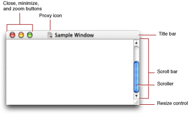

At the top of the window is the _title bar_, which displays the name of the window, and indicates whether or not it is active. The Window Manager lets you set the name, which the Window Manager displays using the current system font.

When the user creates a new document, you usually display a new document window with the name “untitled” in lowercase letters. If the user creates additional documents without saving the first, they should be titled “untitled 2”, “untitled 3”, and so on. When the user opens a saved document, the title bar should display the document’s filename. Do not put a “1” on the first untitled window, even after the user opens other new windows. If the user dismisses all untitled windows by saving them or closing them, the next new document should start over as “untitled,” followed by “untitled 2,” and so on.

The title bar also serves as the “handle,” or _drag area_, by which the user can move the window. Pressing in the title bar and dragging lets the user move the window.

The title bar also contains three control buttons on the upper-left side:

- The _close button_ (red) lets the user close the window.
- The _minimize button_ (yellow) moves the window off the desktop and into the Dock.
- The _size button_ (green) toggles the window between two different sizes. The _user size_is the size determined by the user (for example, if the user resized the window). The _best size_is the optimum size for displaying the contents of the window (as determined by the application).

Some windows include a _toolbar button_, which is a clear oblong button in the upper-right corner. This button shows and hides the toolbar associated with the window. Finder windows, for example, contain toolbars that the user can show or hide.

The title bar can also contain a _proxy icon_ to the left of the window name. The user can manipulate this icon just as if it were the actual document icon displayed by the Finder. For example, if the user wants to move a document to the desktop, he or she can simply drag the proxy icon to that location, rather than having to open Finder windows to find the actual document.

The entire area taken up by the window onscreen is called the _structure region_. The area taken up by the title bar is called the _frame region_. Everything below the title bar is defined as the _content region_; this is the area that provides a “window” into the contents of the document. The majority of this region is devoted to displaying the contents of the document, be it text, graphics, or other content.

The right and bottom portions of the content region can contain the following controls that let the user change the view into the contents:

- _Scroll bars_should appear on the right side and the bottom of the content region if the window does not display the entire document. The size of the _scroller_ is proportional to the amount of document visible in the window along that axis. _Scroll arrows_ controls let the user advance the scrollers without dragging.
- The _resize control_lets the user adjust the size of the window. Depending on the window, this control may sometimes be constrained to allow the user to adjust only the length of one axis.

The portion of the content region that is visible to the user (that is, not obscured by other windows) is called the _visible region._When your application draws the window contents, it is actually drawing only this subset of the content region.

The window in which the user is currently working is the _active window_. This window is usually the one that is frontmost on the desktop. This window has _keyboard focus_, which means that all keyboard input is directed to this window.

The active window has an opaque title bar and all its controls have color. Inactive windows (typically those behind the active window) have a translucent title bar, and their controls don’t have color.

A window’s position on the screen is determined by _global coordinates_in pixels. This reference system has the coordinates (0,0) in the upper-left corner of the main display screen. Within a window, you position items (such as controls) using _local coordinates_, where (0,0) is the upper-left corner of the window’s content region.

Each window has a drawing environment associated with it, which is represented by a _graphics port._The graphics port is an opaque data structure that contains information about how to translate bits in memory to onscreen pixels. You draw into specific windows by specifying which graphics port you want to draw in. All drawing in the window is referenced to the window’s local coordinates.

The Window Manager keeps track of your windows by means of a _window reference._The window reference points to an opaque data structure that contains the information necessary to define the window. For example, information about a window’s class (described in [Window Classes](#apple-f4xwc4dqnrsv64tfmyxwi33df52wszbpkridgmbqgaytambufvbuqmrqguwueqsdirceorsf)) and attributes ([Window Attributes](#apple-f4xwc4dqnrsv64tfmyxwi33df52wszbpkridgmbqgaytambufvbuqmrqguwueqsdijaumqkf)) are stored in this structure. Functions that handle or manipulate windows typically require you to pass the window reference as a parameter.

Windows that are primarily designed for user interaction are called _dialogs_. A dialog may inform the user that something has happened, or it may request input. They typically contain one or more controls (buttons, text fields, and so on) to handle the interaction. Dialogs come in a number of different flavors, and not all of them share the same controls or layout. Some examples include

- alerts, which are specifically designed to report warnings or errors.
- open and save dialogs, which let users select a location and name for their files.
- preferences dialogs, which let users select various application options.
- input dialogs, which are specifically designed to solicit input (such as a password).

For the purpose of this document, the term _dialog_ is used only to distinguish how a window is used; dialogs do not differ programmatically from any other type of window.

A window’s content region can also contain controls. Controls commonly appear in dialogs, but you can also add controls to document windows and utility windows. [Figure 2-2](#apple-f4xwc4dqnrsv64tfmyxwi33df52wszbpkridgmbqgaytambufvbuqmrqguwueqsdivbeuq2d) shows a window containing a number of controls.

__Figure 1-2__  A window containing controls

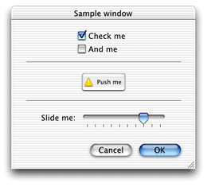

While you may think of a control as an object the user can use to interact with your application, the Mac OS expands the definition of a control to include elements that give feedback or otherwise facilitate user interaction. For example, a progress bar, which gives a visual representation of how much time is required to finish a task, is considered a control. A group box, which allows you to visually associate controls together, is also considered a control. [Control Types](#apple-f4xwc4dqnrsv64tfmyxwi33df52wszbpkridgmbqgaytambufvbuqmrqguwueqsdjjcusqsg) gives more details about individual controls.

Controls that have a value associated with them visually represent this value with an _indicator_. For example, in a scroll bar control, the scroller is the indicator; the position of the scroller indicates the control’s current value. Most indicators are user-adjustable (such as the scroller), but this is not a requirement.

You usually embed controls within other controls. For example you can combine the pane control, which is essentially just an empty container to hold related controls, with tab controls to create multiple “pages” of controls in one window. Clicking different tabs lets the user switch between the individual pages. See [Panes and Tab Controls](#apple-f4xwc4dqnrsv64tfmyxwi33df52wszbpkridgmbqgaytambufvbuqmrqguwviucykjcummjuhe) for an illustration.

Manipulating the outer control affects all the controls embedded within it. For example, when your application deactivates a group box, any controls contained within it are also deactivated.

Note that all the controls in a window are embedded in a _root control._ The root control is simply a conceptual container for holding other controls; it has no visible representation. However, it does provide a convenient target for activating and deactivating all the controls in a window.

As mentioned earlier, the active window has keyboard focus, but within the active window, the focus may be further directed towards a particular control. For example, if multiple controls in a window can take text input, only one can have keyboard focus at any time. For example, a dialog can have text entry fields for a user’s name, address, and so on. The user can enter text into only one of these fields at a time. The control that currently has the keyboard focus is identified by a blue halo or _focus ring_around the control. The user can switch the focus by clicking in another text control or by pressing the Tab key. See [Editable Text Fields](#apple-f4xwc4dqnrsv64tfmyxwi33df52wszbpkridgmbqgaytambufvbuqmrqguwueqsdizduiq2h) for an illustration of a control with focus.

Controls have several state attributes that affect whether the user can use it:

- _Active_: A control is active when the owning window is active. Active controls can respond to user input. Deactivated (or inactive) controls are grayed out and do not respond to user input, unless the click-through state is specified.
- _Enabled_: A control is enabled if it appears normally and can respond to user input when active. A disabled control is grayed out and can never respond to user input, even if the click-through state is specified.

  You often want to disable controls that are not valid in the current state of the window. For example, in a file-saving dialog, the Save button should not be enabled until the user enters a name for the file to be saved.
- _Click-through_: When the click-through state is specified, the control can respond to user input even if the window that contains it is inactive. For example, the standard control buttons for a document window support click-through; you can close background windows without deactivating the currently active window. See the Aqua human interface guidelines for more information about when it is appropriate to use click-through in your applications.

These states are independent of each other; how they are combined is what determines whether a control responds to user input. For example, the user can always click a button that has click-though specified (that is, whether or not it is active), unless the control is also disabled.

Controls are defined and manipulated by means of a _control reference_. These are similar to window references in that they point to opaque data structures. They describe the control’s properties, and you can manipulate the values in the structure only by calling specific control accessor functions.

The Mac OS allows a number of different types of windows. Each has specific uses, and many have different appearances or other characteristics. For example, a window may or may not have a title or standard controls (namely the close, minimize, and zoom buttons).

Some windows are modal, which means that when the window is open, certain other interactions are suspended. For example, an _application-modal_ dialog prevents the user from doing anything else within a particular application until the user provides a response to dismiss the window. The user can, however, switch to another application. _Document-modal_ windows prevent the user from doing anything within a particular document until the user provides a response. The user can switch to other documents within the application, or to other applications. _System-modal_ dialogs, used only in Mac OS 8 and 9 (and not recommended even then) prevent any other action until the user provides a response.

[Table 2-1](#apple-f4xwc4dqnrsv64tfmyxwi33df52wszbpkridgmbqgaytambufvbuqmrqguwueqsdizeuuqke)shows the window classes provided by the Window Manager. See the Aqua human Interface guidelines for detailed information about when to use each type of window.

__Table 1-1__  Window classes

| Window class | Description |
| Alert | A system-modal dialog used to communicate errors and warning conditions. This class was originally designed for Mac OS 9 and earlier and should not be used in Mac OS X. |
| Movable alert | A movable application-modal dialog used to communicate errors and warning conditions. This window class should be used in place of Alerts in Mac OS X. |
| Modal | A system-modal dialog that forces the user to supply information before continuing operation. This class was originally designed for Mac OS 9 and earlier and should not be used in Mac OS X. |
| Movable modal | A movable application-modal dialog that forces the user to supply information before continuing operation. An example would be a login window that requires the correct password to continue the application. You should use this window class in place of Modal dialogs in Mac OS X. |
| Floating | A document window that floats above all other windows in an application. These windows often show some ongoing status. |
| Document | The standard document window used to enter and display file-based data. Note that you can also add controls to a document window. |
| Drawer | A window that slides out from behind another window. Drawers typically hold frequently accessed controls or items that don’t need to be visible at all times. Available in Mac OS X version 10.2 and later. Drawer windows must also have the `kWindowCompositingAttribute` attribute set. |
| Utility | A system-wide window that floats above all windows on the desktop. An example would be the CPU meter window in the CPU Monitor application. |
| Help | A frameless document window used for help tags. |
| Sheet | A document-modal window. A sheet slides down from the top of a document window, making it obvious to which window it pertains. Sheets are used for document-centric dialogs, such as for saving and printing files. |
| Toolbar | A document window that floats above all document windows in an application, but below floating windows. Toolbars typically provide tools or controls that pertain to open documents. Toolbar windows are sometimes called palettes. Not to be confused with the toolbar attached to windows. |
| Plain | An older window class included only for compatibility purposes (corresponds to the old `plainDBox` procID type). Don’t use this class for new development. |
| Overlay | A transparent window typically used to overlay the screen. You can use this window to draw images, cursors, or other graphics. You can draw into this window only using Quartz APIs (not QuickDraw). |
| Sheet alert | A document-modal window used to communicate errors and warning conditions. |
| Alternate plain | An older window class included only for compatibility purposes (corresponds to the old `altDBox` procID type). Don’t this class use for new development. |

In Mac OS X, the different window classes occupy separate “layers” on the desktop. The hierarchy, from lowest to highest, is as follows:

1. Document windows
2. Document-modal windows (also called sheets). Note that sheets are always associated with a document, so it is possible for a document with a sheet to be underneath another document window.
3. Toolbars
4. Floating windows
5. Application-modal windows (namely alerts and some dialogs)
6. Help windows
7. Utility windows
8. Overlay windows

Note that within each layer, windows of the same class are also layered. For example, if you have two toolbars (occupying the Toolbar layer) open in your application, one will be on top, partially obscuring the other if their onscreen placement overlaps. Selecting a window brings it forward, in front of the other windows in its class. Note that the windows do not necessarily have to belong to the same application, so you can have, for example, documents from several different applications interleaved together. For the purposes of this document, _window layering_refers to the layers of the window class hierarchy. _Window ordering_ refers to the layering of windows within a class.

The window layering hierarchy is important if you are manipulating window groups. See [Window Groups (Mac OS X Only)](Window%20and%20Control%20Tasks.md#apple-f4xwc4dqnrsv64tfmyxwi33df52wszbpkridgmbqgaytambufvbuqmrqgywueq2jjbeeeqkc) for more details.

Window attributes define the look and behavior of a window. To a great extent, each window class differs from the others only by the types of attributes they have. Each attribute is defined by a constant that you can specify when creating your window. [Table 2-2](#apple-f4xwc4dqnrsv64tfmyxwi33df52wszbpkridgmbqgaytambufvbuqmrqguwueqsdjbcucrsd) describes the available window attributes.

__Table 1-2__  Window attributes

| Constant Name | Description |
| `kWindowCloseBoxAttribute` | The window has a close button (Mac OS X) or box (Mac OS 9). |
| `kWindowHorizontalZoomAttribute` | The window can zoom (that is, expand or contract) in the horizontal axis |
| `kWindowVerticalZoomAttribute` | The window can zoom in the vertical axis. |
| `kWindowFullZoomAttribute` | The window can zoom in both horizontal and vertical axes. |
| `kWindowCollapseBoxAttribute` | The window has a minimize (Mac OS X) or collapse (Mac OS 9) button. |
| `kWindowResizableAttribute` | The window is resizable (that is, it has a resize control). |
| `kWindowSideTitlebarAttribute` | The window’s title bar is on the side. (Used only for floating window classes.) |
| `kWindowNoUpdatesAttribute` | The window does not receive update events. |
| `kWindowNoActivatesAttribute` | The window does not receive activate events. |
| `kWindowOpaqueForEventsAttribute` | The entire window is considered opaque with respect to events (that is, even transparent areas can receive clicks). Available only for the overlay window class in Mac OS X version 10.1 and earlier. Available to all window classes in Mac OS X version 10.2 and later. |
| `kWindowNoShadowAttribute` | The window does not have a drop shadow. (Mac OS X only.) |
| `kWindowHideOnSuspendAttribute` | The window is automatically hidden when the application becomes inactive and shown when the application becomes active. This attribute is used for tool palettes and other floating windows. |
| `kWindowStandardHandlerAttribute` | The window uses the standard window event handler. |
| `kWindowHideOnFullScreenAttribute` | The window is automatically hidden when full-screen display mode is invoked. |
| `kWindowInWindowMenuAttribute` | This window automatically appears in the Window menu (if the application uses it). Use the Window Manager function `CreateStandardWindowMenu` to create the menu. |
| `kWindowLiveResizeAttribute` | This window supports live resizing. (Mac OS X only.) |
| `kWindowStandardDocumentAttributes` | The window has the three standard document window buttons (close, minimize, zoom). |
| `kWindowStandardFloatingAttributes` | The window has the close and minimize buttons. |
| `kWindowToolbarButtonAttribute` | The window has a toolbar button. |
| `kWindowCompositingAttribute` | The window uses the Control Manager’s compositing mode, which is used for HIView. (Mac OS X, version 10.2 and later). You can specify this attribute only when creating a window; you cannot set this attribute using `ChangeWindowAttributes`. |
| `kWindowMetalAttribute` | The window has a metallic appearance (Mac OS X, version 10.2 and later). Available only for document and movable modal window classes. If you specify this attribute, you must also specify the `kWindowCompositingAttribute`. |
| `kWindowIgnoreClicksAttribute` | The window ignores mouse clicks; any clicks are sent to whatever lies underneath the window.. For example, if another window lies beneath this one, that window will receive the mouse click instead (Mac OS X, version 10.2 and later). |

The Appearance Manager is a Mac OS technology that coordinates the look and feel of the user interface to ensure that if the user changes the theme of the interface, the windows and controls adapt accordingly.

All the system-defined controls and windows are Appearance Manager–compliant, so if you are not creating custom interface objects, you do not need to do anything special to be Appearance-savvy.

The Appearance Manager contains a number of functions that let you draw Appearance-compliant window and control parts. If you are creating custom windows or controls, you may want to use these functions to ensure that your custom elements match the current theme. See [Drawing Using the Appearance Manager](Window%20and%20Control%20Tasks.md#apple-f4xwc4dqnrsv64tfmyxwi33df52wszbpkridgmbqgaytambufvbuqmrqgywueq2jjjeuuscg) for more information.

This section describes the various system-defined controls available in the Mac OS. Rather that list each control separately, this section groups them according to usage or functionality.

For information about how to create these controls, see [Using Interface Builder](Window%20and%20Control%20Tasks.md#apple-f4xwc4dqnrsv64tfmyxwi33df52wszbpkridgmbqgaytambufvbuqmrqgywviucykjcummjsga) and [Calling Functions to Create Windows and Controls](Window%20and%20Control%20Tasks.md#apple-f4xwc4dqnrsv64tfmyxwi33df52wszbpkridgmbqgaytambufvbuqmrqgywviucykjcummjug4).

A button control is activated by a single click. Depending on the type of button or its attributes, the effect of the click can be one of the following:

- It signals your application to do something immediately. A real world example would be a door bell or a Start button.
- It toggles between two settings (like an on/off switch).
- It enters a “selected” state and remains in that state until changed. That is, additional clicks while it is selected do not change its state. Buttons with this characteristic are sometimes called “sticky.”

Most of the button-type controls are variants of these three types, with different cosmetic features.

The push button, as shown in [Figure 2-3](#apple-f4xwc4dqnrsv64tfmyxwi33df52wszbpkridgmbqgaytambufvbuqmrqguwueqsdjjcukrke), is the simplest button control. Clicking a push button typically enables actions in dialogs and alerts. Saving files, cancelling actions, and acknowledging information are common uses for this control. Button names should be verbs that describe the action performed. Don’t use push buttons to indicate a state such as On or Off.

You can designate a button to be the _default button_, which means that pressing the Return or Enter key automatically activates that button. The default button is identified by pulsing blue animation.

__Figure 1-3__  Push buttons

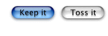

The checkbox, as shown in [Figure 2-4](#apple-f4xwc4dqnrsv64tfmyxwi33df52wszbpkridgmbqgaytambufvbuqmrqguwueqsdjbeeqssi), is a control used to indicate one or more options that must be either on or off. You should label checkboxes clearly to imply two opposite states, so that it’s obvious what happens when the user selects or deselects a box.

__Figure 1-4__  Checkboxes

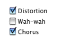

Radio buttons are used in groups of two or more to select mutually exclusive, but related, choices. Selecting one should automatically deselect the previously selected button. A simple way to ensure that radio buttons remain mutually exclusive is to embed them within a radio group. See [Radio Groups](#apple-f4xwc4dqnrsv64tfmyxwi33df52wszbpkridgmbqgaytambufvbuqmrqguwueqsdjbeuqskd).

__Figure 1-5__  Radio buttons

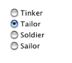

Radio buttons should never initiate an action, and they should never change dynamically (that is, their contents should not change depending on the context). A set of radio buttons should contain at least two items and a maximum of about seven. If you need more selections, consider using [Pop-Up Controls](#apple-f4xwc4dqnrsv64tfmyxwi33df52wszbpkridgmbqgaytambufvbuqmrqguwueqsdjjceqrkk).

Bevel buttons are square buttons with a beveled edge that gives them a three-dimensional appearance. They can have square or rounded corners, as shown in [Figure 2-6](#apple-f4xwc4dqnrsv64tfmyxwi33df52wszbpkridgmbqgaytambufvbuqmrqguwueqsdijcusqke).

__Figure 1-6__  Bevel buttons

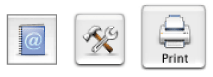

Bevel buttons can contain text, an icon, or an image. Depending on what attributes you set for it, a bevel button can behave like a pushbutton, a checkbox, a radio button, or a pop-up menu (see [Pop-Up Controls](#apple-f4xwc4dqnrsv64tfmyxwi33df52wszbpkridgmbqgaytambufvbuqmrqguwueqsdjjceqrkk) for more information about the latter).

The round button is a circular variant of the push button, available in two different sizes (20 pixel and 25 pixel diameter). Currently round buttons can display only an icon.

__Figure 1-7__  Round buttons

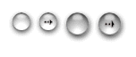

Little arrows are small pairs of up/down arrows that you typically use to adjust numerical values in a text field. The clock control shown in [Figure 2-23](#apple-f4xwc4dqnrsv64tfmyxwi33df52wszbpkridgmbqgaytambufvbuqmrqguwueqsdjbeuqsse) includes little arrows to let the user adjust the highlighted time value.

A control related to the button control is the pop-up control. Unlike a button, activating a pop-up control is a two-step process:

- The user presses the mouse in the control. Doing so brings up a small menu of options.
- Keeping the mouse pressed, the user then moves it to highlight the desired menu selection. When the user releases the mouse, that selection is activated.

Like radio buttons, pop-up controls let users make a selection from a number of mutually exclusive options. In general, if you have four or fewer options, use radio buttons. For five to twelve options, use a pop-up menu. For more than twelve options, use a list box, as described in [List Boxes](#apple-f4xwc4dqnrsv64tfmyxwi33df52wszbpkridgmbqgaytambufvbuqmrqguwueqsdirdegrck).

The most common pop-up control is a pop-up menu. A pop-up menu is an oblong button with small triangular arrows at one end, as shown in [Figure 2-8](#apple-f4xwc4dqnrsv64tfmyxwi33df52wszbpkridgmbqgaytambufvbuqmrqguwueqsdizeemssc).

__Figure 1-8__  Pop-up menus

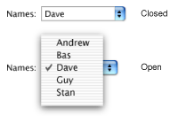

The text displayed in the pop-up menu indicates the current selection.

Other controls can have pop-up variants. These variants typically add a small downward-facing arrow to indicate their pop-up nature. For example, [Figure 2-9](#apple-f4xwc4dqnrsv64tfmyxwi33df52wszbpkridgmbqgaytambufvbuqmrqguwueqsdireeerke) shows the pop-up version of a bevel button.

__Figure 1-9__  A pop-up bevel button

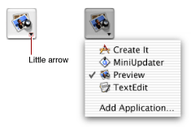

Placards (described in [Miscellaneous Controls](#apple-f4xwc4dqnrsv64tfmyxwi33df52wszbpkridgmbqgaytambufvbuqmrqguwviucykjcummjvgy)) can also have pop-up variants.

Scroll bars and sliders are controls that let you arbitrarily adjust their positions along their axis of movement.

Scroll bars are added to document windows when the visible window cannot show the entire contents of the file (for example, a multipage memo or a large graphical image). They appear on the right side and bottom of the document window as shown previously in [Figure 2-1](#apple-f4xwc4dqnrsv64tfmyxwi33df52wszbpkridgmbqgaytambufvbuqmrqguwueqsdijbeercc). The size of the scroller (the colored oblong part that moves) is proportional to how much of the document is visible; The smaller the scroller, the less of the content the user can see in the window. The scroller represents the relative location, in the whole document, of the portion that can be seen in the window.

The user can manipulate a scroll bar in three ways:

- Dragging the scroller to view any part of the content along that axis.
- Clicking the scroll arrows to move the content a small incremental distance. Depending on system preferences, these arrows may appear on either end of the scroll control or grouped together on one side.
- Clicking in the track through which the scroller moves. The result depends on the scroll bar preference set by the user in the General pane of System Preferences.

  - If the preference is set to “Jump to next page,” the click moves the content by a “page.” The size of the page is determined by the amount of content that is visible; if the window’s content is 100 pixels high, a click in the vertical scroll bar’s track area moves the content up or down by 100 pixels.
  - If the preference is set to “Scroll to here,” the click moves the scroller to that point, just as if the user had dragged the scroller there (changing the content accordingly).

In general you should not add additional controls to scroll bars, as this can make things more confusing for the user. Window splitters and status bars (such as placards) are acceptable, however.

In Mac OS X, all scrolling should be live; that is, the content should update on the fly as the scroller is moved. For details of how to implement live scrolling in your application, see [Live Scrolling](Window%20and%20Control%20Tasks.md#apple-f4xwc4dqnrsv64tfmyxwi33df52wszbpkridgmbqgaytambufvbuqmrqgywugsscinbegssg).

A slider control lets the user make a selection along a continuous range of allowable values. Sliders can be horizontal or vertical and can display labeled tick marks to represent the increments you specify. The slider itself (also called the thumb) can be round or directional, as shown in [Figure 2-10](#apple-f4xwc4dqnrsv64tfmyxwi33df52wszbpkridgmbqgaytambufvbuqmrqguwueqsdjfceesci). How the slider is oriented should correspond to users’ real-world expectations for similar controls.

Sliders support live feedback (that is, live dragging), so that users can see the effect of moving the slider as it is dragged. For example, moving the Dock Size slider in Dock Preferences adjusts the size of the Dock on-the-fly.

__Figure 1-10__  Sliders

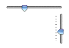

The list box is a scrollable window that displays a number of different choices for the user. You typically use list boxes when you must present more than 12 options to the user (that is, more than is suggested for a pop-up menu). List boxes may be a fixed part of a window or dialog, or they can be activated by pressing a pop-up menu or edit text field. In the latter case, the user can choose to type a selection into the text field instead of selecting from the list box.

__Figure 1-11__  A list box

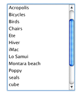

Users can make multiple selections in a list box by holding down the Shift key (continuous selection) or the Command key (discontinuous selection).

The scrolling text field is a scrollable window of non-editable text. There are two variants:

- Standard scrolling field: this variant has a standard scroll bar on the right side. you might use a standard scrolling field to display a software license agreement.
- Auto-scrolling field: this variant automatically scrolls through its text with a specified starting delay and scroll speed. You can use an autoscrolling text box to display a list of credits in an About window, for example.

The visual feedback controls—the progress indicator, relevance control, and chasing arrows— do not rely on user interaction, but merely present visual cues for activity or information that would otherwise be invisible to the user.

Progress indicators (also known as progress bars) inform the user about the status of lengthy operations. Two types of indicators exist:

- Determinate indicators should be used when you know how long the full operation will take. The progress bar moves from left to right, indicating what proportion of the task is complete.
- Indeterminate indicators should be used when you can’t predetermine how long an operation will take. For example, operations that require asynchronous actions (such as establishing a dialup communication connection) are good candidates for indeterminate progress bars. The indicator displays a spinning spiral cylinder to indicate that something is happening (that is, the application has not locked up or crashed) but gives no indication about how soon the operation will be completed.

__Figure 1-12__  Progress indicators

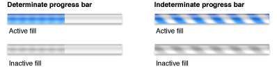

Progress indicators typically inhabit a dialog that appears when the user begins an operation. In addition, the dialog should display a Cancel button, if the operation can be canceled with no side effects, or a Stop button otherwise. After the operation is complete, the dialog should disappear (if the application is returning to “normal” operation) or present a button prompting the user to continue (if the operation is just one step in a larger process).

The chasing arrows control is merely a pair of arrows that spin around a center, “chasing” each other for as long as the control is visible. Use this control in a window to indicate that some background task is operating. For example, the Mail application uses chasing arrows to indicate when it is checking for new mail or otherwise updating its mail database. The user still has full control of the application and can choose some action that cancels the background task.

__Figure 1-13__  Chasing arrows

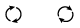

The relevance control is simply a thick line used to indicate relevance in search results or other situations where a visual aid is useful.

__Figure 1-14__  Relevance controls in a search result

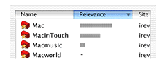

Text controls hold text—either a user-editable field (for text entry, for example) or static display text (to hold an error message, for example).

A static text field holds fixed text that cannot be edited by the user. Use static text fields for dialog or alert messages or any other type of informative text that should not be changed. Note that in some cases you may want the static text to be selectable. For example, being able to select error codes or other messages makes it easier for the user to cut and paste the exact text into an email for feedback.

An editable text field, also called text input field, is one that allows the user to enter or edit text. An editable text field may be initially blank (for example, prompting the user to enter a name or address), or it may contain default text that the user can change if desired. In either case, the field appears as a distinct visible region, which distinguishes it from a static text field. Note that editable text fields can handle only standard Macintosh text encodings. If you want to handle Unicode text, you should use an editable Unicode text field instead.

__Figure 1-15__  Editable text fields

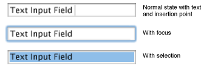

The editable Unicode text field acts like an editable text field but with the following enhancements:

- It handles Unicode text, and can therefore accept mixed script text.
- It allows you to edit any type of text, including those which only have Unicode representation.
- It automatically supports inline input.

Image controls, described in the following sections, are essentially images or icons that can also act as controls.

An icon control is simply an icon (even an icon suite) that can act like a control. If you want to display an icon in your dialog, it is often convenient to use an icon control to do so. However, because it also is a control, it can receive events, and you can use it to trigger various actions. For example, an icon control can track the mouse (highlighting or otherwise changing as the mouse rolls over its boundary) and then perform an action when the mouse is released, just as if it were a push button. An icon control can also act as a pop-up menu if so desired.

A picture control is an image of type `'PICT'` that can also act as a control. It is similar to an icon control.

You can think of an image well as being a user-configurable icon or picture control. That is, the user can drag a picture or icon into the image well to customize the image it displays. The image well itself can also remain in a selected state, much like a radio button or checkbox. For example, the channels used in QuickTime Player and the Search options in Sherlock use image wells.

__Figure 1-16__  Image wells

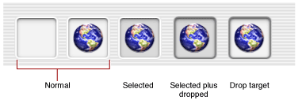

You should not use image wells in place of push buttons or bevel buttons.

The embedding controls—the root control, group box, radio group, and pane—have no user functionality in themselves, but they are used to hold other controls within them. Activating or deactivating an embedding control automatically activates or deactivates all the controls within it.

As described earlier in [Controls](#apple-f4xwc4dqnrsv64tfmyxwi33df52wszbpkridgmbqgaytambufvbuqmrqguwueqsdi5cueq2i), a root control is an invisible conceptual entity that contains all the controls in a window. That is, if you want to add controls to a window, first you create a root control associated with the window, and then you embed your controls within it.

A group box is simply a visual box that holds other controls. You can embed controls in a group box to emphasize that they are somehow related. For example, in a preferences window, you may want to group all the checkboxes associated with some particular functionality in a group box.

Group boxes come in several variants:

- The untitled group box is just a box, with no additional features.
- The titled group box has a box with a static text title.
- The checkbox group box contains a titled checkbox in the upper left. Controls in the group box should not be active unless the box is checked.
- The pop-up group box contains a pop-up menu in the upper left. Each item in the pop-up menu corresponds to a different set of controls. That is, when the user chooses an item in the pop-up menu, the content of the group box changes. For example, the standard print dialog contains a pop-up group box that lets the user choose different sets of options, such as the number of copies, the layout, and any printer-specific options.

[Figure 2-17](#apple-f4xwc4dqnrsv64tfmyxwi33df52wszbpkridgmbqgaytambufvbuqmrqguwueqsdi5beqsck) shows an unchecked checkbox group box and a pop-up group box.

__Figure 1-17__  Group boxes

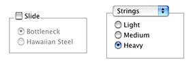

A radio group is simply an invisible enclosure for radio buttons. The buttons embedded within it are automatically set to be mutually exclusive. That is, only one button within a radio group can be set at any time.

A pane (sometimes called a user pane) is a panel in which you can embed other controls. Typically you use panes in conjunction with a tab control to create a layered stack of panes, much like folders in a filing cabinet. [Figure 2-18](#apple-f4xwc4dqnrsv64tfmyxwi33df52wszbpkridgmbqgaytambufvbuqmrqguwueqsdireeerkb) shows panes and a tab control. The currently exposed pane (corresponding to the Resonator tab) contains three radio buttons and a checkbox group box.

Note that the tab control is the entire collection of visible tabs; while there are three tabs in [Figure 2-18](#apple-f4xwc4dqnrsv64tfmyxwi33df52wszbpkridgmbqgaytambufvbuqmrqguwueqsdireeerkb), they are all part of one tab control.

__Figure 1-18__  A pane with a tab control

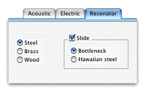

The tab control does not automatically select the proper pane. Your code must determine which tab was clicked and then activate the corresponding pane. For an example of implementing tab controls with panes, see [Using Tab Controls](Window%20and%20Control%20Tasks.md#apple-f4xwc4dqnrsv64tfmyxwi33df52wszbpkridgmbqgaytambufvbuqmrqgywugsscjfcugq2g).

Disclosure controls allow the user to view more or less information in a window depending on the setting of the control.

A disclosure triangle is a small black triangle that lets the user see additional information. Clicking the triangle changes its orientation. The most common example is the Finder’s list view, where disclosure triangles allow you to view the contents of a folder.

__Figure 1-19__  Disclosure triangles in a Finder list view

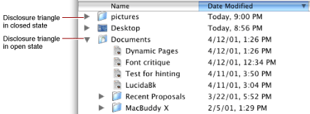

In general, you should use disclosure triangles only to change the view of data. If you want to display additional controls, you should use disclosure buttons instead.

The disclosure button is a push button that lets the user toggle between two viewing states in a window or dialog. Use the button to disclose additional controls that the user may not normally need. For example, the standard Mac OS X Save As dialog (shown in [Figure 2-20](#apple-f4xwc4dqnrsv64tfmyxwi33df52wszbpkridgmbqgaytambufvbuqmrqguwueqsdi5aueqsg)) uses a disclosure button. When in a closed state, it presents only minimal save location options. When open (in its “disclosed” state), it presents a full file browser to let the user choose a save location.

__Figure 1-20__  Disclosure button in a Save As dialog

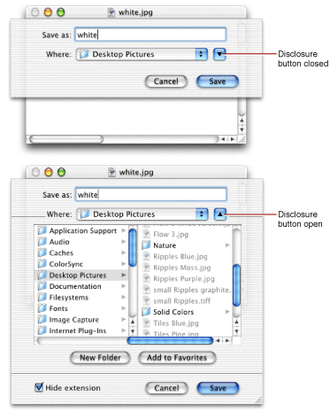

These controls typically do not interact with the user at all, but merely provide aesthetic appeal. However, if you use these system-supplied controls instead of drawing your own, they remain Appearance-compliant even if the interface is modified in the future.

A separator line is simply a line, either vertical or horizontal, that isolates a portion of a dialog. Use these separators to lightly group controls. If possible, you should use separators lines rather than group boxes; using separators with adequate spacing should be enough to isolate most groups of controls. The sample preferences dialog in [Figure 3-14](Window%20and%20Control%20Tasks.md#apple-f4xwc4dqnrsv64tfmyxwi33df52wszbpkridgmbqgaytambufvbuqmrqgywueq2jivbucskg) shows the use of separators.

Pop-up arrows are tiny triangles similar to the disclosure triangle. These controls were originally used to designate buttons as being a pop-up control, but current pop-up button variants automatically contain an arrow. Pop-up arrows are mentioned here only for completeness.

This section describes controls that don’t easily fit into any of the other categories.

The data browser is a sophisticated control that lets the user view and navigate hierarchical data structures. Currently the user can view this information in two forms:

- As a multicolumned list, much like the list view in the Mac OS X and Mac OS 9 Finder.
- As a browsable hierarchy of columns, much like the column view in the Mac OS X Finder.

Column and list views displayed by the data browser automatically conform to the Aqua human interface guidelines, so it is a good choice to use if you need to present large amounts of data to the user.

For detailed information about the data browser control, see _[Data Browser Programming Guide](../Data%20Browser%20Programming%20Guide/Introduction%20to%20Data%20Browser%20Programming%20Guide.md#apple-f4xwc4dqnrsv64tfmyxwi33df52wszbpkridgmbqgaydsnry)_ and _Data Browser Reference_in Carbon User Interface documentation.

A placard is usually used in document windows to display information about the document. Often it provides a pop-up menu that provides a simple way to change the view of a document (such as the page number or magnification). [Figure 2-21](#apple-f4xwc4dqnrsv64tfmyxwi33df52wszbpkridgmbqgaytambufvbuqmrqguwueqsdinduurkk) shows a placard at the bottom of a window, to the left of the scroll bar.

__Figure 1-21__  A placard in a document window

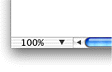

The window header was originally used in the Finder to provide a place to display file and disk space information, as shown in [Figure 2-22](#apple-f4xwc4dqnrsv64tfmyxwi33df52wszbpkridgmbqgaytambufvbuqmrqguwueqsdi5degrck). It is simply an Appearance Manager–compliant bar. While you may not need this control, it is included here for completeness.

__Figure 1-22__  A window header

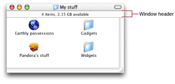

Originally designed for various system services, the clock control is a digital clock that can display time or date. This control may be useful if your application needs the user to set a date or time for some task (for example, to start a nightly data backup).

__Figure 1-23__  The clock control in edit mode

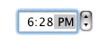

You can implement the up and down arrows to the right of the clock display separately as [Little Arrows](#apple-f4xwc4dqnrsv64tfmyxwi33df52wszbpkridgmbqgaytambufvbuqmrqguwviucykjcummjwha).

You may have noticed that many controls also come in a smaller variant. You should use these small controls sparingly, and only when absolutely necessary. For example, you should use the small variants when size is at an extreme premium, such as in tool palettes or other utility windows. Do not mix full-size and small versions of controls in the same window. [Figure 2-24](#apple-f4xwc4dqnrsv64tfmyxwi33df52wszbpkridgmbqgaytambufvbuqmrqguwueqsdizbeosse) shows examples of small and full-size controls.

__Figure 1-24__  Some full-size controls and their small variants

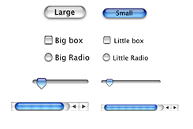

Note that the text within the controls is also proportionally smaller when using the smaller variants. If you need to determine the proper font type and size, you should use Appearance Manager calls to ensure that you always have the proper font for the current theme.

To function, all windows and controls must be able to respond to events sent by the operating system. The mechanism for doing so is the Carbon Event Manager. Windows and controls receive specific types of events based upon the actions taken by the user.

For explicit details about the the Carbon Event Manager, you should read _[Carbon Event Manager Programming Guide](../Carbon%20Event%20Manager%20Programming%20Guide/Introduction%20to%20Carbon%20Event%20Manager%20Programming%20Guide.md#apple-f4xwc4dqnrsv64tfmyxwi33df52wszbpkridgmbqgaydsobz)_ in Carbon Events and Other Input documentation. However, this section gives an overview of the basic concepts as they relate to windows and controls.

The Carbon Event Manager allows you to attach event handlers to user interface objects such as window, controls, and menus. In theory, you could install a separate handler for each instance of a window or control. When you register your event handler, you specify the object (or _event target_) to which it pertains, and only those events for which you want to be notified. Key advantages of the Carbon event model include the following:

- A detailed hierarchy of event types that allows you to execute a handler at any point during a user action. For example, when the user clicks a button, your handler can be notified when the first mouse down occurs, while the mouse is down and moving, or when the mouse is released.
- Standard event handlers that provide default behavior for actions you choose not to handle. For example, if you choose not to handle any mouse events when the user clicks a button, the standard handlers automatically fill in, tracking the mouse, visually toggling the button, and so on. By letting the standard handler handle all these actions, you can choose to be notified only when a button has been selected.

The event targets are grouped in a containment hierarchy, and if one object does not handle an event, the event is passed to the enclosing event target. For example, an unhandled control event is passed to window that contains it, and from there to the application. If no object takes the event, the standard handler handles the event. [Figure 2-25](#apple-f4xwc4dqnrsv64tfmyxwi33df52wszbpkridgmbqgaytambufvbuqmrqguwueqsdiraugrkh) shows the containment hierarchy.

__Figure 1-25__  The event containment hierarchy

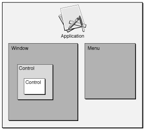

You can install multiple handlers on an event target. Each handler is placed on a stack for that event target, with the last installed being the first called. For example, say your application installs a handler on a control to handle a mouse-down event. Then your application installs a plug-in that also installs a mouse-down handler on the same control. When the user clicks the control, the plug-in’s mouse-down handler is called first. If it chooses not to handle the event, the application’s control handler then has the opportunity to take it.

The majority of events your windows receive are in response to mouse clicks. Whenever the user presses the mouse, the system generates a mouse-down event (`kEventMouseDown`). In response to this event, the standard event handler gets the coordinates of the mouse to determine where on the screen it occurred. If it occurred within the currently active window, the handler further analyzes it to find out where within the window the click took place.

In many cases, you can rely on the standard handlers to do most of the busywork, letting you concentrate only on those events that require application-specific responses. The following sections describe typical events that your application should handle.

The vast majority of events fall into one of the following categories:

- Events that let you override default behaviors.
- Events that give your application access (“hooks”) into the execution path. For example, your application can choose to take actions before or after certain events take place.

For detailed information about how to create handlers for specific events, see [Handling Events](Window%20and%20Control%20Tasks.md#apple-f4xwc4dqnrsv64tfmyxwi33df52wszbpkridgmbqgaytambufvbuqmrqgywueq2jjfcuiscg).

A window becomes active when it is “brought forward” by the user clicking it or choosing it from the window menu. A window becomes inactive when the user brings a different window forward or activates a different application. Events sent in response to these actions let the window change appearance appropriately. For example, when a window is deactivated, the title bar becomes translucent, scroll bars and other controls lose their color, and certain text may be grayed out.

__Figure 1-26__  An active and inactive window

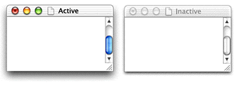

Controls also receive activate and deactivate events.

Because the standard handlers can handle the changes in the usual windows and controls, whether or not you need to respond to activate and deactivate events is usually determined by what’s in your content region. For example, if the window holds editable text, on deactivation you should stop blinking the insertion cursor and give up the keyboard focus. On the other hand, if the window is a dialog that contains only system-defined controls, you may need to do nothing at all.

Drawing events occur when a change onscreen requires you to draw or redraw an object or region. For most system-defined controls or windows, the standard handler can handle the drawing for you. However, you must handle the drawing of any unique content (such as in the content region of a window).

When the user moves, resizes, or activates a window, hidden portions of one or more windows on the desktop may be exposed. In order to properly fill these exposed regions, the system maintains an _update region_ for each window. For example, in [Figure 2-27](#apple-f4xwc4dqnrsv64tfmyxwi33df52wszbpkridgmbqgaytambufvbuqmrqguwueqsdivdecrsh), when the window is enlarged, a blank section is exposed, which must be redrawn with the proper content.

__Figure 1-27__  The update region during a window resize

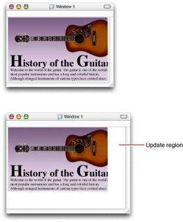

When a portion of a window needs to be refreshed, the system first calls the window’s definition function, requesting that it redraw the window frame. Then it posts an event to the owning application’s event queue requesting that the application draw into the newly visible region. For actions such as live resizing, your drawing handler is called multiple times while the mouse moves, making your window appear to update on the fly.

If desired, you can add portions of your window to the update region using the QuickDraw functions `InvalRect` (for rectangular regions) or `InvalRgn` (for arbitrarily shaped regions). Calling these functions is the preferred method of making changes to the visible contents of a window. For example, instead of drawing the changes immediately, you should simply mark the changed regions as invalid by calling `InvalRect` or `InvalRgn`. Doing so triggers an event requesting that your application update the now invalid portion of the window. Your drawing event handler can then handle the rest.

In certain cases, you want to keep track of where the mouse goes between a mouse-down event (when the user presses the mouse button) and the subsequent mouse-up event (when the user releases the mouse button). For example, when the user presses a push button, the button highlights or otherwise changes to indicate that it is in its pressed state. While the mouse is down, the button should

- stay highlighted while the cursor is in the control
- lose highlighting if the cursor leaves the control
- highlight again if the cursor reenters the control

The button should receive a “button selected” event only if the cursor is within the control’s bounds when the mouse is finally released. If you use the standard handlers, all of this functionality is implemented for you, so you need to handle only the final button selection. For information about implementing your own tracking handler, see [Custom Control Tracking](Window%20and%20Control%20Tasks.md#apple-f4xwc4dqnrsv64tfmyxwi33df52wszbpkridgmbqgaytambufvbuqmrqgywueq2jjbeesrcj).

A slightly more involved example is when the user presses a scroll bar. Once the mouse is down in the control, the user can drag it to another position, and the control should update on the fly to reflect the change in position. For a system-defined control, the standard handler takes care of this tracking. However, if your application supports live scrolling (which it should), you should also update the contents as the scroller control is moved. You do so by registering an on-the-fly drawing handler, which is called continuously as the mouse moves. See [Live Scrolling](Window%20and%20Control%20Tasks.md#apple-f4xwc4dqnrsv64tfmyxwi33df52wszbpkridgmbqgaytambufvbuqmrqgywugsscinbegssg) for more details.

As described earlier, the standard event handler performs much of the work of handling mouse events in controls, meaning that you can choose to be informed only when a control is successfully activated. In fact, you can take this event abstraction one step further and receive an event only when a particular command action has occurred.

You can assign a special command ID to any system-defined control. This ID is a four-character code that must have at least one uppercase character (for example, `'Moof'`). Whenever the user activates a control, the Carbon Event Manager sends a command event to your application indicating the control that was activated, the command ID, and other useful information.

What makes the command ID useful is that you can assign the same ID to several controls, or even menu items, and the Carbon Event Manager will send the same command event. For example, many buttons often have an associated menu item for doing the same thing. If you assign each of them the same command ID, you need to write only one handler to cover both cases.

As described in [Window Classes](#apple-f4xwc4dqnrsv64tfmyxwi33df52wszbpkridgmbqgaytambufvbuqmrqguwueqsdirceorsf), certain dialogs may be application or document modal, meaning that no actions can take place in that application or document until the dialog is dismissed. This modality is implemented by simply restricting which interface objects can receive events. For example, a document window containing a sheet cannot receive any events as long as the sheet is open.

If you want to enforce your own modality in windows, the Carbon Event Manager provides several functions to let you do so. See the Carbon Event Manager documentation for more details. 

In the United States, section 508 of the Workforce Investment Act of 1998 requires that people with disabilities have comparable access to information technology as those without disabilities. Applications running in Mac OS X should therefore be able to communicate with special assistive technologies such as screen readers to enable their use by people with disabilities. An application that can respond to assistive technology must be able to do the following:

- Communicate a hierarchy of its user interface features. For example, an assistive application or technology should be able to determine what windows are open, which one is active, what controls exist in the active window, and their current states (checked, pressed, and so on).
- Respond to action requests; for example, be able to press a particular button or select a particular menu item.
- Inform the system of changes in its user interface. For example, when a new window opens, the keyboard focus changes, and so on.

If you use the standard system-defined controls, windows, and menus, all of the above functionality is handled for you. However, if you are using custom or modified versions of any of these elements, you may need to add code to make sure your application can respond properly. For more detailed information, see the document _[Accessibility Programming Guidelines for Carbon](../Accessibility%20Programming%20Guidelines%20for%20Carbon/Introduction%20to%20Accessibility%20Programming%20Guidelines%20for%20Carbon.md#apple-f4xwc4dqnrsv64tfmyxwi33df52wszbpkridgmbqgaytcmrx)_ in Carbon Accessibility documentation.

Note that even if you are using only system-defined elements, you may want to add special accessibility help strings to your controls (or menu items). These strings can help clarify the purpose of an element, much the way a help tag would.

[Next](Window%20and%20Control%20Tasks.md)[Previous](Introduction%20to%20Handling%20Carbon%20Windows%20and%20Controls.md)

