> 导航：[总目录](../../../README.md) · [documentation](../../../_indexes/documentation.md) · [Handling Carbon Windows and Controls](Introduction%20to%20Handling%20Carbon%20Windows%20and%20Controls.md)


[Next](Carbon%20Events%20Versus%20Classic%20DefProc%20Messages.md)[Previous](Window%20and%20Control%20Concepts.md)

# Window and Control Tasks

This chapter describes how to implement windows and controls in your application using one of the following methods:

- By creating nib files using Interface Builder. This method is the most straightforward and intuitive. If you are a new developer or want to minimize the amount of programming you need to do, you should choose this option. Nib file support is easy to add to older applications, so you should consider this option even if you are working with legacy code.
- By calling various Window Manager, Control Manager, and Dialog Manager functions. This method gives you more control, but in most cases it is a lot more work than creating nib files and requires more knowledge on your part.

Several sections also describe commonly used Control Manager and Window Manager functions, as well as functions that reproduce features found in Interface Builder. In addition, this chapter includes implementation details about special features such as

- [Adding Window Proxy Icons](#apple-f4xwc4dqnrsv64tfmyxwi33df52wszbpkridgmbqgaytambufvbuqmrqgywviucykjcummjxgm)
- [Window Groups (Mac OS X Only)](#apple-f4xwc4dqnrsv64tfmyxwi33df52wszbpkridgmbqgaytambufvbuqmrqgywueq2jjbeeeqkc)
- [Manipulating Drawers (Mac OS X 10.2 and later)](#apple-f4xwc4dqnrsv64tfmyxwi33df52wszbpkridgmbqgaytambufvbuqmrqgywueq2jjbeuessb)
- [Live Scrolling](#apple-f4xwc4dqnrsv64tfmyxwi33df52wszbpkridgmbqgaytambufvbuqmrqgywugsscinbegssg)
- [Using Tab Controls](#apple-f4xwc4dqnrsv64tfmyxwi33df52wszbpkridgmbqgaytambufvbuqmrqgywugsscjfcugq2g)
- [Custom Windows and Controls](#apple-f4xwc4dqnrsv64tfmyxwi33df52wszbpkridgmbqgaytambufvbuqmrqgywueq2jijbegqsh)

In addition, if you are interested in learning more about the new object-oriented model that underlies all Carbon user interface elements, see [Introducing HIObject and HIView (Mac OS X 10. 2 and Later)](#apple-f4xwc4dqnrsv64tfmyxwi33df52wszbpkridgmbqgaytambufvbuqmrqgywueq2ji5beuscf).)

Interface Builder is Apple’s graphical user interface layout tool. In true WYSIWYG fashion, you simply drag user interface elements onto windows, menus, and controls to create your interfaces. This information is stored in a _nib file_, which your application can access using a few simple function calls.

Interface Builder has many advantages over other layout methods:

- The WYSIWYG interface makes it easy to visualize your interface objects.
- Its ease of use allows for experimenting and rapid prototyping.
- Special guides makes it easy to conform to Aqua’s layout guidelines.
- Simple APIs make it easy to create interface objects from nib files.

You can use Interface Builder’s nib files even if you are working with legacy code. Applications can support both nib-based and older resource-based windows and controls at the same time, so you can make the transition as gradual as you like. Nib file support is available back to Mac OS 8.6 using CarbonLib.

Interface Builder is included on the Developer Tools CD available with Mac OS X.

Interface Builder also makes it easy to associate controls and windows with Carbon event handlers, again minimizing the amount of work required to implement your user interface.

Interface Builder stores all the information about your application’s windows, menus, and controls in a nib file (typically named _filename_._nib_ ). When creating a new file, Interface Builder gives you the option of selecting what type of nib file you want to create. When creating interfaces for Carbon applications, you should always select one of the Carbon options, as shown in [Figure 3-1](#apple-f4xwc4dqnrsv64tfmyxwi33df52wszbpkridgmbqgaytambufvbuqmrqgywueq2jinduoqkb).

__Figure 2-1__  Opening dialog for new nib files

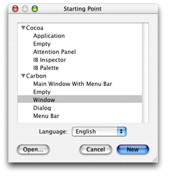

Interface Builder always displays the windows shown in [Figure 3-2](#apple-f4xwc4dqnrsv64tfmyxwi33df52wszbpkridgmbqgaytambufvbuqmrqgywueq2jizbukqke) for an open nib file.

__Figure 2-2__  Nib file windows

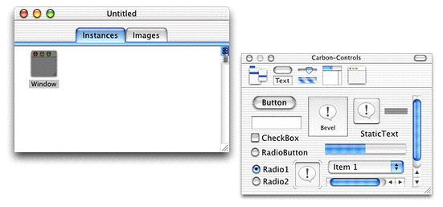

- The main nib window. This window contains two panes: Instances and Images. The Instances pane displays icons representing the interface objects (windows, menus, and so on) in your nib file. The Images pane shows the images that are available for you to use in your interface.
- The palettes window. For Carbon applications, the palettes window holds all the interface objects that you can add to your application. You select a palette by clicking in the top toolbar, and then you can add objects by dragging them to your interface.

If you chose to create a particular interface object (menu bar, dialog, or window) in the opening dialog, Interface Builder also creates empty versions of the objects.

For example, to create a simple dialog you can do the following:

- Open a new empty nib file.
- Select the Windows palette in the palettes window toolbar, and drag out an empty window.
- Select the Controls palette and drag a static text field and a button to the empty window.

Laying out your window is essentially as simple as dragging and placing the interface objects you want.

For Carbon applications, Interface Builder provides five different layout palettes, which are displayed in the Carbon palettes window. If the window is not already open, you can do so by choosing Palettes from Interface Builder’s Tools menu.

The Menus palette allows you to build menus. Although it is not covered in this document, Interface Builder lets you build menus using the same simple drag-and-drop method you use for creating windows.

The Controls palette, as shown in [Figure 3-3](#apple-f4xwc4dqnrsv64tfmyxwi33df52wszbpkridgmbqgaytambufvbuqmrqgywueq2ji5dugski), contains the most commonly used controls.

__Figure 2-3__  The Controls palette

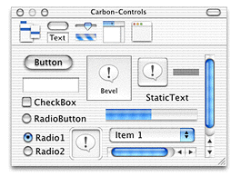

The Enhanced Controls palette, shown in [Figure 3-4](#apple-f4xwc4dqnrsv64tfmyxwi33df52wszbpkridgmbqgaytambufvbuqmrqgywueq2ji5decscd), contains more specialized controls, many of which are used in combination with other controls. For example, the separator lines are used to isolate controls from each other.

__Figure 2-4__  The Enhanced Controls palette

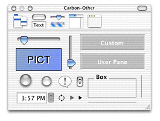

The PICT box is used as a container for an image you want to add to the interface. You use the custom box to place a custom (that is, application-defined) control. See [Custom Windows and Controls](#apple-f4xwc4dqnrsv64tfmyxwi33df52wszbpkridgmbqgaytambufvbuqmrqgywueq2jijbegqsh) for information about creating custom controls.

The Data Views palette, shown in [Figure 3-5](#apple-f4xwc4dqnrsv64tfmyxwi33df52wszbpkridgmbqgaytambufvbuqmrqgywueq2jijfeerkc), contains special controls that are specifically designed to organize information for the user in list or column format.

__Figure 2-5__  The Data Views palette

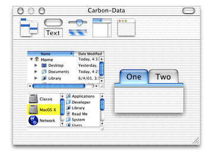

The table viewer and browser are subsets of the data browser control, while the tabs are simply a tab control paired with panes.

The Windows palette, shown in [Figure 3-6](#apple-f4xwc4dqnrsv64tfmyxwi33df52wszbpkridgmbqgaytambufvbuqmrqgywueq2jizeukqkj), holds windows that you can use to interact with the user.

__Figure 2-6__  The windows palette

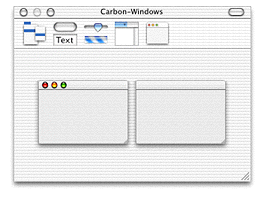

The standard window (containing the close, minimize, and zoom buttons) should be used for documents, dialogs, and any other windows that the user can close or minimize.

The buttonless window should be used for windows that must remain open while the application is running (such as a status window), or those that are dismissed in other ways, such as an alert.

Aside from the palettes, the Interface Builder window you will use the most is the Info window, which displays information about the currently selected object (such as a window or control) and lets you set attributes and other information that determine how the object behaves and appears to the user.

To display the Info window, choose the Show Info menu item in the Tools menu of Interface Builder.

[Figure 3-7](#apple-f4xwc4dqnrsv64tfmyxwi33df52wszbpkridgmbqgaytambufvbuqmrqgywueq2jizfeiq2h) shows an Info window for a window object.

__Figure 2-7__  The Info window for a window object

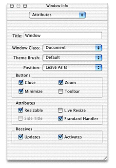

The pop-up menu at the top of the Info window lets you choose between four different panes:

- Attributes. Controls in this pane let you set the display or behavior characteristics of the interface object. For windows, for example, you can set the window title and window class, among other attributes. For controls, attributes vary depending on the control. For example, for a checkbox, you can set the title, the initial state (checked, unchecked, and so on), and whether it should toggle automatically.
- Control. This pane lets you set control-specific attributes, such as control IDs and command IDs. See [Designing a Simple Preferences Window](#apple-f4xwc4dqnrsv64tfmyxwi33df52wszbpkridgmbqgaytambufvbuqmrqgywviucykjcummjtga) for an example of its usage. This pane doesn’t apply for windows.
- Size. This pane lets you adjust the size and position of the interface object with pixel accuracy, which is often more convenient than trying to size or align objects by eye.
- Help. This pane lets you enter optional help tag text as well as the position in which the tag appears. Help tags are the little yellow pop-up fields that appear near a control or window when the user hovers the cursor over it for a few seconds. This pane provides a much simpler way to add help tags than making calls from your application.

The available selections vary depending on which interface object you have selected.

Although Interface Builder lets you manually drag and place interface components into your windows, it also provides tools for more precise placement.

The Alignment submenu in the Layout menu (as shown in [Figure 3-8](#apple-f4xwc4dqnrsv64tfmyxwi33df52wszbpkridgmbqgaytambufvbuqmrqgywueq2jizcemsch)) lets you align groups of objects by their edges or centers.

__Figure 2-8__  The Alignment submenu

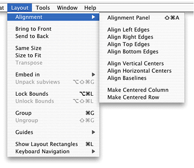

For more sophisticated layout options, you can choose the Alignment panel (chosen from the Alignment submenu) as shown in [Figure 3-9](#apple-f4xwc4dqnrsv64tfmyxwi33df52wszbpkridgmbqgaytambufvbuqmrqgywueq2jivduur2h).

__Figure 2-9__  The Alignment panel

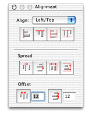

- By using the Align controls, you can align the selected controls to a particular edge, or center them. Choose the type of alignment from the pop-up menu and then use the bevel buttons for the actual placement. Each button has help tags that provide additional information.
- The Spread controls let you space the selected controls evenly between themselves or across the container (the window, group box, pane, and so on) that holds them. Each button has help tags.
- The Offset controls let you space controls with a given offset. Each button has help tags.

In addition, Interface Builder also provides special Aqua guides, which you can use to make sure your window conforms to the Aqua placement guidelines. For example, when dragging a control near the edge of a window, dotted blue lines appear indicating the proper placement for Aqua compliance. Releasing the control makes it snap to the specified placement. [Figure 3-10](#apple-f4xwc4dqnrsv64tfmyxwi33df52wszbpkridgmbqgaytambufvbuqmrqgywueq2jjffeqrcj) shows the Aqua guides suggesting the proper placement for a checkbox.

__Figure 2-10__  Aqua guides

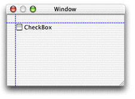

The Guides submenu in the Layout menu contains options for the Aqua guides.

- Show/Hide Guides enables or disables both custom and Aqua guides.
- Lock Guides locks any custom guides you have placed so they cannot be moved.
- Add Horizontal/Vertical Guides creates custom guides (designated by unbroken blue lines), which you can position as needed. These guides are useful if you want to align objects to some arbitrary position.
- Enable/Disable Aqua Guidelines enables or disables only the Aqua guides.

Finally, there are additional commands available in the Layout menu that you might find useful:

- Bring to Front and Send to Back rearrange the order of controls in the interface.
- Same Size ensures that two objects have exactly the same dimensions. Using this command is simpler than typing in sizes and much more accurate than trying to size by eye.
- Size to Fit is often useful for objects that contain text. Choosing Size to Fit makes the object large enough to fit the text and also ensures that the space around the text complies with the Aqua human interface guidelines.
- Transpose changes rows to columns and vice versa. You can use this command for radio button groups.
- Group lets you embed two or more objects in a container such as a pane or a group box. This command is handy when you have already created a number of containers and then decide you want to group some of them together.

This section gives a step-by-step example of how you would lay out a window in Interface Builder. While not particularly complex, the ideas and methods used here apply to any type of window.

This example creates a preferences window containing a few checkboxes and radio buttons, along with push buttons that allow the user to save or cancel the preferences.

To create the initial window, you can either select a Carbon window or dialog when creating a new nib file (as shown in [Figure 3-1](#apple-f4xwc4dqnrsv64tfmyxwi33df52wszbpkridgmbqgaytambufvbuqmrqgywueq2jinduoqkb)) or drag a window from the Windows palette of an existing nib file. By bringing up the Info window and choosing the Attributes pane (using the pop-up menu), you can do the following:

- Set the window’s title to “MyGuitar Preferences” (or whatever you choose).
- Make sure the window’s class is set to Document. (Normal dialogs and document windows both share this window.)
- Set the Theme Brush to Dialog.
- Make sure the you choose Alert Position in the Position pop-up menu.
- As this is a dialog, you don’t need any of the standard document window buttons, so make sure the Close, Zoom, Minimize, and Toolbar checkboxes in the Buttons group are unselected.
- The dialog does not need to be resizable, so the Resizable checkbox should not be selected. In fact, the only option in the Attribute group that should be selected is the Standard Handler, as that simplifies the event handling code.
- The Receives options (signifying update events and activate events) should both be selected.

In the Size pane, set the size of the window to be 175 pixels high and 480 pixels wide.

Finally, in the Instances pane of the nib file, double-click the text below the window’s icon and assign it a unique name (such as “GuitarPrefs”). This is the name that an application uses to load the window from the nib file.

Your simple dialog should now look like [Figure 3-11](#apple-f4xwc4dqnrsv64tfmyxwi33df52wszbpkridgmbqgaytambufvbuqmrqgywueq2jjbdusskc).

__Figure 2-11__  An empty dialog

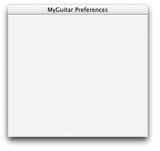

Most Preferences dialogs (and many dialogs in general) contain push buttons in the lower-right corner: OK to close the dialog, accepting any changes that were made, and Cancel, which closes without accepting changes. To add these buttons, drag two push button objects from the Controls palette to your window. If you have the Aqua guides turned on, they indicate the proper placement in the lower-right corner.

__Figure 2-12__  Using the Aqua guides to place push buttons

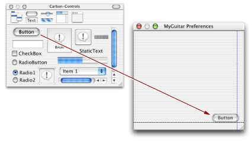

After placing the buttons, you can specify the following using the Attributes pane of the Info window:

- Change the titles of the buttons to “OK” and “Cancel.”
- Change the button type of the OK button to Default by selecting the appropriate radio button under Button Type. As the default button , the button pulses blue and the user can trigger it by pressing the Return or Enter keys.
- Change the button type of the Cancel button to Cancel. The user can trigger the Cancel button by pressing the Esc key.

In the Control pane, you can add the following:

- Add an application signature and control ID for each button. The application signature is typically your application’s creator code (for example, `'surF'`). The control ID should uniquely identify the control within your application.
- Set command IDs for each button. These IDs are sent to your application as part of a command event, as described in [Command Events](Window%20and%20Control%20Concepts.md#apple-f4xwc4dqnrsv64tfmyxwi33df52wszbpkridgmbqgaytambufvbuqmrqguwugsscizcecqsh). As the functions of these buttons are predefined, you can just choose them in the pop-up menu (that is, OK and Cancel) as shown in [Figure 3-13](#apple-f4xwc4dqnrsv64tfmyxwi33df52wszbpkridgmbqgaytambufvbuqmrqgywueq2jjfbeuscb). If you wanted to create a new command ID, you would choose <other> and then enter a unique four-character ID to identify the command.

__Figure 2-13__  Assigning a command ID from the Info window

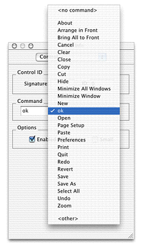

Next you can add some preference controls. This example includes four different types of controls:

- Radio buttons to select the guitar type. These buttons are aligned at the top according to the Aqua guides., but otherwise spaced to balance out the checkboxes.
- Checkboxes to select optional effects. These boxes are also top-aligned according to the Aqua guides.
- A slider to choose the amount of echo.
- Static text to label the slider and indicate the amount of echo.

To view the dialog as it would actually appear in an application, choose the Test Interface command in the File menu. The completed preferences dialog appears in [Figure 3-14](#apple-f4xwc4dqnrsv64tfmyxwi33df52wszbpkridgmbqgaytambufvbuqmrqgywueq2jivbucskg). 

__Figure 2-14__  A preferences dialog

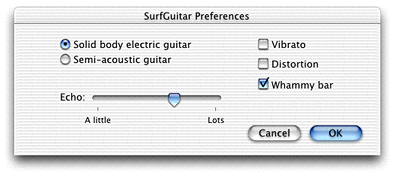

After you have created a nib file containing your windows, you can access them from your application.

Note that while a nib file can contain multiple windows, menus, and so on, to make the best use of resources, you may want to break up your user interface elements among several nib files. For example, you can put only the most commonly used windows in one nib file and the rarely used ones in another.

To make sure your application can find the nib file, you should place it in the Resources folder of your application’s bundle hierarchy, as shown in [Figure 3-15](#apple-f4xwc4dqnrsv64tfmyxwi33df52wszbpkridgmbqgaytambufvbuqmrqgywueq2jinbemq2j). For information about creating application bundles, see _Inside Mac OS X: System Overview_.

__Figure 2-15__  The nib file in an application bundle

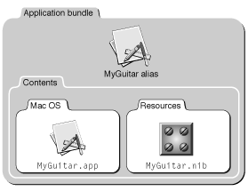

[Listing 3-1](#apple-f4xwc4dqnrsv64tfmyxwi33df52wszbpkridgmbqgaytambufvbuqmrqgywueq2jijbuirsc) shows how you use these functions to create a window.

__Listing 2-1__  Creating a window from a nib file

```
OSStatus err;
IBNibRef theNib;
WindowRef theWindow;

err = CreateNibReference (CFSTR(“MyGuitar”), &theNib); // 1
if (!err)
    CreateWindowFromNib (theNib, CFSTR(“GuitarPrefs”), &theWindow); // 2

ShowWindow(theWindow); // 3
```

Here is what the code does:

1. The Interface Builder Services function `CreateNibReference` simply creates a nib reference that points to the specified file. In this case, the file is `MyGuitar.nib` (you don’t need to specify the `.nib` extension when calling this function). The `CFSTR` function converts the string into a Core Foundation string, which is the format that `CreateNibReference` expects.
2. The Interface Builder Services function `CreateWindowFromNib` uses the nib reference to access a window within the nib file. The name of the window (`GuitarPrefs` in this example) is the name you assigned to it in the Instances pane of the nib file window. As with the `CreateNibReference` function, `CreateWindowFromNib` expects a Core Foundation string for the window name, so it must first be converted using `CFSTR`. The created window is stored as a window reference in `theWindow`.
3. Windows are normally hidden when first created, so you should call `ShowWindow` to make them visible.

The complete window can now appear in your application. However, while the facade is there (and many of the controls are functional), this window does not do anything useful. To make the windows and controls do useful work, you must attach Carbon event handlers, which are described in detail in [Handling Events](#apple-f4xwc4dqnrsv64tfmyxwi33df52wszbpkridgmbqgaytambufvbuqmrqgywueq2jjfcuiscg).

After you have created your windows and controls, you need to make them functional, which means that they must be able to respond to events. To do so, you must install one or more Carbon event handlers. To get the most out of this section, you should be familiar with the workings of the Carbon Event Manager, as described in the document _Inside Mac OS X: Handling Carbon Events_.

This document assumes that you are installing your handler on the specific control or window it is intended to act upon, but this is not a requirement. The Carbon Event Manager lets you install your handlers anywhere up the containment hierarchy from your specified object.

You install your event handlers using the `InstallEventHandler` function:

```
OSStatus InstallEventHandler (EventTargetRef target,// 1
                                EventHandlerUPP handlerProc,// 2
                                UInt32 numTypes,// 3
                                const EventTypeSpec* typeList,// 4
                                void* userData,// 5
                                EventHandlerRef handlerRef);// 6
```

1. The `target` parameter is an event reference indicating which object you want to install your handler on. You obtain an event reference by calling `GetWindowEventTarget` or `GetControlEventTarget`, passing in the appropriate window or control reference. Similar functions also exist for menu and application event targets (`GetMenuEventTarget` and `GetApplicationEventTarget`) respectively.
2. The `handlerProc` parameter is a universal procedure pointer (UPP) to your event handling function. To convert a normal procedure pointer to a UPP, call the `NewEventHandlerUPP` function.
3. The `numTypes` parameter indicates the number of events you want to register. If you don’t want to hard code this value, you can call the Carbon Event Manager macro `GetEventTypeCount`, passing in the array of events desired.
4. The `typeList` parameter is an array describing the events you want to register. Each event is defined by its class (such as `kEventWindowClass`) and its kind (such as `kEventWindowDrawContent`).
5. If you have any arbitrary data that you want passed to your handler, store it in the `userData` parameter. This data is passed to your handler each time it is called.
6. If you want a reference to your installed event handler, pass a pointer here. On return, `handlerRef` contains a reference to your event handler.

The Carbon Event Manager includes macros that make it simpler to install event handlers by eliminating the need to create the event target reference. For example, the `InstallControlEventHandler` macro requires only that you pass the control reference where you would pass the event target reference in `InstallEventHandler`; the macro converts the control reference by calling `GetControlEventTarget` for you.

[Listing 3-2](#apple-f4xwc4dqnrsv64tfmyxwi33df52wszbpkridgmbqgaytambufvbuqmrqgywueq2ji5eusqsj)shows how you would install a window event handler named `MyWindowEventHandler` for two events using the `InstallWindowEventHandler` macro.

__Listing 2-2__  Installing a window event handler

```
EventHandlerUPP myHandlerUPP;

EventTypeSpec eventList[] = {
                    {kEventClassWindow, kEventWindowDrawContent},
                    {kEventClassWindow, kEventWindowBoundsChanged}};

myHandlerUPP = NewEventHandlerUPP (MyWindowEventHandler);

InstallWindowEventHandler(theWindow,
                        myHandlerUPP,
                        GetEventTypeCount(eventList),
                        eventList, theWindow, NULL);
```

This example passes the window reference as user data.

[Listing 3-3](#apple-f4xwc4dqnrsv64tfmyxwi33df52wszbpkridgmbqgaytambufvbuqmrqgywueq2jizeeeqkh) shows a sample function to handle the events registered in [Listing 3-2](#apple-f4xwc4dqnrsv64tfmyxwi33df52wszbpkridgmbqgaytambufvbuqmrqgywueq2ji5eusqsj).

__Listing 2-3__  A sample window event handling function


```
static pascal OSStatus MyWindowEventHandler (
                            EventHandlerCallRef myHandler, // 1
                            EventRef theEvent, // 2
                            void* userData)// 3
{
    #pragma unused (myHandler)

    OSStatus result = eventNotHandledErr;// 4
    WindowRef theWindow = (WindowRef) userData;
    UInt32 whatHappened;

    whatHappened = GetEventKind (theEvent);// 5

    switch (whatHappened)
    {
        case kEventWindowDrawContent:// 6

            DoMyWindowDrawing (window); // dummy drawing function
            result = noErr;// 7
            break;

        case kEventWindowBoundsChanged:// 8

            DoMyWindowBoundsChange (theWindow); // dummy bounds function
            result = noErr;
            break;
    }

    return (result);

}
```

Here is what the code does:

1. The Carbon Event Manager passes three parameters to your event-handling callback function. The `myHandler` parameter is a reference to the next event handler in the calling chain. That is, the event handler that will be called next if your handler chooses not to take this event.
2. The `theEvent` parameter is an event reference; it points to an opaque data structure that describes the event that occurred.
3. The `userData` parameter is the user data you specified when you registered your handler (in this case it contains the window reference).
4. If your event handler chooses not to handle the event for any reason, you should return `eventNotHandledErr` to give other handlers in the calling chain a chance to take it.
5. The `GetEventKind` function returns a constant that corresponds to the type of event that occurred. You can also call the related function `GetEventClass` to obtain the event class, but in this case, you know that it’s a window event.
6. If the event kind indicates a draw content event, call your function to draw the window. See [The Drawing Event](#apple-f4xwc4dqnrsv64tfmyxwi33df52wszbpkridgmbqgaytambufvbuqmrqgywviucykjcummjtha) for more information about what to do for this event.
7. Set `result` to `noErr` to tell the Carbon Event Manager that you handled the event.
8. If the event kind indicates that the window bounds changed, call your function to change the bounds. See [Window Bounds Changed Events](#apple-f4xwc4dqnrsv64tfmyxwi33df52wszbpkridgmbqgaytambufvbuqmrqgywviucykjcummjtg4) for more information about how to handle this event.

In this example, you receive the window reference as user data. However, you can also obtain parameters such as the window reference from the event reference. See [Event Parameters](#apple-f4xwc4dqnrsv64tfmyxwi33df52wszbpkridgmbqgaytambufvbuqmrqgywviucykjcummjtgq) for information on how to do this.

Every event has event parameters associated with it. For example, when your application receives a `kEventWindowActivated` event, the event reference structure also contains a window reference indicating which window received the activate event.

To obtain the associated parameters, you call the Carbon Event Manager function `GetEventParameter`, indicating which parameter you wish to obtain (see [Listing 3-4](#apple-f4xwc4dqnrsv64tfmyxwi33df52wszbpkridgmbqgaytambufvbuqmrqgywueq2ji5cecqkd) for an example). Often you want to specify `kEventParamDirectObject`, which indicates the object on which the event was directed. For example, for a window event, the direct object would be a reference to the window in which the event occurred.

For a list of the permissible parameters (and associated constants to pass to `GetEventParameter`), see the Carbon Event Manager documentation or the `CarbonEvents.h` header file.

This section describes how to implement handlers to handle the most common window events:

- window activation and deactivation events: `kEventWindowActivated` and `kEventWindowDeactivated`
- window bounds changed events: `kEventWindowBoundsChanged` and `kEventWindowBoundsChanging`
- the drawing event: `kEventDrawContent`
- the window content click event (`kEventWindowContentClick`)
- the close event (`kEventWindowClose`)

When your window is activated or deactivated, it receives the events `kEventWindowActivated` and `kEventWindowDeactivated` respectively. The standard handler automatically activates and deactivates the title bar.

In response to the activation event, your handler must handle any requisite changes to the content region. For example, if your content region holds text, you may need to set the keyboard focus to the text field and begin blinking the insertion cursor. Any controls in the window receive their own activate events, so you do not need to handle them in your window activation handler.

For deactivate events, your handler should do the reverse of your activation handler. That is, stop blinking the cursor, relinquish keyboard focus, and so on.

Your window receives a `kEventWindowBoundsChanged` event when the user moves or resizes a window.

If the window is merely moved, the standard handler can handle the repositioning of both the title bar and the content region. If it is resized, usually because the user dragged the resize control or clicked the zoom button, the standard handler automatically resizes the title bar and the content region.

If the `kEventWindowBoundsChanged` event indicates the window size is changing, your handler should adjust the content region to reflect the new size. For example, you may need to expose or hide more of an image, or word wrap text to conform to the new size. Note that your handler should not redraw the new content. If the update region is nonempty, your application will receive a drawing event, and you can draw the content from that handler.

In Mac OS X you should constrain the resize to make sure that it does not overwrite the Dock. You should call the function `GetAvailableWindowPositioningBounds` to determine the largest allowable bounding rectangle for a given screen device (that is, the largest rectangle that does not overwrite the menu bar or the Dock):

```
OSStatus GetAvailableWindowPositioningBounds (
                                    GDHandle inDevice.
                                    Rect *availableRect);
```

To constrain the size of a window, you can get the `kEventParamCurrentBounds` parameter from the `kEventWindowBoundsChanged` event, modify the bounds and then replace the bounds parameter using the Carbon Event Manager function `SetEventParameter`.

If you want your window to support live resizing, you must specify the live resize attribute either in the nib file or by setting the `kWindowLiveResizeAttribute` bit in your application. If you do this, your application receives the `kEventWindowBoundsChanged` event whenever a `kEventMouseMoved` event is sent. By updating your content each time, the window then resizes on the fly.

To determine which action is occurring when the bounds changed event is sent (that is, whether the window is being resized or merely moved), you call `GetEventParameter`, specifying the `kEventParamAttributes` bit field as shown in [Listing 3-4](#apple-f4xwc4dqnrsv64tfmyxwi33df52wszbpkridgmbqgaytambufvbuqmrqgywueq2ji5cecqkd).

__Listing 2-4__  Obtaining parameter attributes for a kEventWindowBoundsChanged event

```
EventRef theEvent;
UInt32 Attributes;
OSStatus err;

err = GetEventParameter (theEvent, kEventParamAttributes, typeUInt32,
                            NULL, sizeof(UInt32), NULL, &Attributes);
if (!err)
    {
     if (attributes & kWindowBoundsChangeSizeChanged)
        {
        // Window is being resized
        }
     else if (attributes & kWindowBoundsChangeOriginChanged)
        {
        // Window is being moved
        }
```

If you want to intercept the resize or move before it actually begins, you should install your handler on the `kEventWindowBoundsChanging` event.

Whenever elements in your content region are hidden or shown, you must redraw those portions that are now visible. Typically you do so by creating a handler to handle the `kEventWindowDrawContent` event.

When you receive the `kEventWindowDrawContent` event, the standard handler has already called the QuickDraw functions `BeginUpdate` and `SetPort`, and it will call `EndUpdate` after you finish handling the event. These functions simplify the updating process by setting the visible region of the window to be the intersection of the visible region and the update region during the redraw. When your drawing handler executes, it automatically draws only those visible portions that have changed.

If your update region contains any system-defined controls, the standard handler also calls `DrawControls` to redraw them before your handler is called.

If for some reason you want to call the `BeginUpdate`, `EndUpdate`, and `SetPort` functions yourself, you should register your handler to be called for the `kEventWindowUpdate` function instead.

When the user presses in the content region of a window, your application receives a `kEventWindowContentClick` event. At this point, the mouse is still down, so typically you want to determine where the mouse press occurred and begin tracking. Doing so may require your application to present visual feedback, such as highlighting a selection or dragging an object. You do so using the Carbon Event Manager function `TrackMouseLocation`.

Note that if the initial mouse press occurred in a control, the events are sent to the control, not the window. In most cases, you can let the standard handler handle the tracking of the mouse in the control and take action only after the mouse is released.

The user can close a window by

- clicking the window’s close button
- activating a control that ends the window’s usefulness (for example, an OK or Save Settings button in a dialog)
- choosing the Close command in the File menu (typically only for document windows)
- entering the keyboard equivalent for the Close command (typically Command-W)

In all of these cases, the window to be closed is sent a `kEventWindowClose` event. In response to this event your application should do the following:

- For unsaved documents, bring up a Save Changes sheet.
- Perform any application-specific clean up (for example, disposing of text objects associated with the window).
- Call the `DisposeWindow` function to remove the window.

The `DisposeWindow` function sends an additional event, `kEventWindowClosed`, before actually disposing of the window.

This section describes some common control events. Note that in most cases, the standard handler (if it is installed on the owning window) automatically handles most of the work required to respond to these events. That is, the visual cues that accompany button presses, toggling, scroller and slider dragging, and so on, are taken care of for you.

Control events are of the class `kEventClassControl`.

The `kEventControlActivate` and `kEventControlDeactivate` events are analogous to the activation and deactivation events for windows. These events are sent to your control when `ActivateControl` or `DeactivateControl` is called on the control or any higher control in its embedding hierarchy.

For system-defined controls, the standard handler automatically redraws the control to reflect its new state (for example, graying out the control when deactivated.)

When the user clicks a control, that control receives a `kEventControlHit` event. The standard handler can take care of the visual details (such as making a checkbox appear to toggle), but your application must address the consequences of the action. For example, if the user selects a checkbox, you must update your application to reflect the new state.

If you don’t need to take any action until the mouse is released, it is simpler to assign a command ID to the control and then install a handler for the `kEventProcessCommand` event. See [Command Events](#apple-f4xwc4dqnrsv64tfmyxwi33df52wszbpkridgmbqgaytambufvbuqmrqgywugsscirbueq2g) for more details.

When the user presses and holds down the mouse to adjust a control (such as a pop-up menu or the scroller of a scroll bar), the Carbon Event Manager sends the `kEventControlTrack` event continuously while the mouse is down. The standard handler automatically adjusts system-defined controls (moving the scroller, highlighting a button, and so on), so in most cases you don’t need to register for this event.

When a control needs to be redrawn, it receives a `kEventControlDraw` event. The drawing of system-defined controls is taken care of by the standard handler, so you need to register for this event only if you are using a custom control.

When a control is resized or moved, the control receives a `kEventControlBoundsChanged` event. Typically this happens only when you move or resize an embedding control; that is, if you move a group box, the controls embedded within in receive a bounds changed event. For system-defined controls, the standard handler automatically takes care of scaling and redrawing the control, so you usually don’t need to take any additional action.

If you assigned a command ID to your control, your application is sent command events whenever the control is activated. Command events are of the class `kEventClassCommand`.

The Carbon Event Manager defines command ID’s for many common commands, such as OK, Cancel, Cut, Paste, and so on. You can also define your own for application-specific commands. You assign the command ID to a control in the Control pane of Interface Builder’s Info window, as shown previously in [Figure 3-13](#apple-f4xwc4dqnrsv64tfmyxwi33df52wszbpkridgmbqgaytambufvbuqmrqgywueq2jjfbeuscb). You can also call the Control Manager function `SetControlCommandID`.

The `kEventCommandProcess` event (which is identical to the `kEventProcessCommand` event) indicates that your control was triggered. The actual command ID is stored within an `HICommand` structure in the event reference, so you must call the Carbon Event Manager function `GetEventParameter` to retrieve it, as shown in [Listing 3-5](#apple-f4xwc4dqnrsv64tfmyxwi33df52wszbpkridgmbqgaytambufvbuqmrqgywueq2jivbusrsj).

__Listing 2-5__  Obtaining the command ID from the event reference

```
HICommand commandStruct;
UInt32 the CommandID;

GetEventParameter (event, kEventParamDirectObject, // 1
                    typeHICommand, NULL, sizeof(HICommand),
                    NULL, &commandStruct);

theCommandID = commandStruct.commandID;// 2
```

Here is what the code does:

1. When calling `GetEventParameter`, you must specify which parameter you want to obtain. For command events, the direct object (`kEventParamDirectObject`) is the `HICommand` structure, which describes the command that occurred.
2. The command ID of the control (or menu) that generated the event is stored in the `commandID` field of the `HICommand` structure.

Note that because command events may be triggered from either a control or a menu item, you may want to install your command event handler at the application level to make sure that the handler can take events coming from either location.

After handling a command, your application may need to change the state of a control or menu item. For example, after saving a document, the Save menu item should be disabled until the document changes. Whenever the status of a command item might be in question, the system makes a note of it. When the user takes an action that may require updating the status (such as pulling down a menu), your application receives a `kEventCommandUpdate` event. To make sure that the states of your controls and menus are properly synchronized, you should install a handler for the `kEventCommandUpdate` event. This handler should check the attributes bit of the command event to determine which items may need updating. Some examples of possible updates include

- enabling or disabling menu items
- changing the text of a menu item (for example, from Show xxxx to Hide xxxx).

If the `kHICommandFromMenu` bit in the `attributes` field of the `HICommand` structure (shown in [Listing 3-6](#apple-f4xwc4dqnrsv64tfmyxwi33df52wszbpkridgmbqgaytambufvbuqmrqgywueq2jincugrkf)) is set, then you should check the menu item in question to see if you need to update it.

__Listing 2-6__  The HICommand structure

```
struct HIComamnd
{
    UInt32  attributes;
    UInt32  commandID;
    struct
    {
        MenuRef         menuRef;
        MenuItemIndex   menuItemIndex;
    } menu;
};
```


Interface Builder lets you easily create and lay out windows and controls. However, in theory your application can create and lay out windows and controls solely by calling Window Manager and Control Manager functions. In most cases, this method is more involved, requires much more work on your part, and makes your application much more difficult to localize. However, if you are working with large amounts of legacy code, familiarity with the programmatic methods of window and control creation may be useful.

Historically, windows and controls were stored as _resources_ in the _resource fork_ of an executable file. This storage method made it relatively easy to create and access these interface elements as well as to localize them. Today, data fork–based nib files provide the same easy accessibility while also providing the layout benefits of Interface Builder. However, if you have older legacy code that uses resources, you can still use them and call `CreateWindowFromResource` to add them into your application.

To programmatically create a window, the preferred method is to call the function `CreateNewWindow`.

```
OSStatus CreateNewWindow (
                WindowClass windowClass,
                WindowAttributes attributes,
                const Rect * contentBounds,
                WindowRef * outWindow);
```

You specify the type of window you want in the `windowClass`and `attributes` parameters. The `contentBounds` parameter is a structure describing the global coordinates of the content region (that is, both the dimensions of the content region and its location onscreen).

While you probably would use nib files to create dialogs and other complex windows, `CreateNewWindow` is useful for creating windows that have no application-unique features. A good example would be a plain document window. [Listing 3-7](#apple-f4xwc4dqnrsv64tfmyxwi33df52wszbpkridgmbqgaytambufvbuqmrqgywugsscjbfeqqsd) shows how you can create one.

__Listing 2-7__  Creating a document window

```
 WindowRef         theWindow;
 WindowAttributes  windowAttrs;
 Rect              contentRect;
 CFStringRef       titleKey;
 CFStringRef       windowTitle;
 OSStatus          result;

 windowAttrs = kWindowStandardDocumentAttributes // 1
                       | kWindowStandardHandlerAttribute
                       | kWindowInWindowMenuAttribute;
 SetRect (&contentRect, kWindowLeft,  kWindowTop, // 2
                        kWindowRight, kWindowBottom);

 CreateNewWindow (kDocumentWindowClass, windowAttrs,// 3
                        &contentRect, &theWindow);

 titleKey    = CFSTR(kMyWindowTitleKey); // 4
 windowTitle = CFCopyLocalizedString(titleKey, NULL); // 5
 result = SetWindowTitleWithCFString (theWindow, windowTitle); // 6
 myErrorCheck (result);                              // Check for error
 CFRelease (titleKey); // 7
 CFRelease (windowTitle);

/* Add application-specific window initialization here *// 8

 RepositionWindow (theWindow, NULL, // 9
                    kWindowCascadeOnMainScreen);
 ShowWindow (theWindow); // 10
```

Here is what the code does:

1. The `windowAttrs` parameter is a bit field that you can set with all the attributes you want for your window. This window has the standard document window controls, uses the standard window handler, and appears in the Window menu of the application.
2. You specify the dimensions of the window and its location by setting a structure of type `Rect`, which contains the coordinates of the top left and bottom right corners of the window’s content region. The constants included here are simply examples (although you could define actual values for them in the file).
3. When calling `CreateNewWindow`, you pass the window class of the desired window, its attributes, and its dimensions. On return `theWindow` contains a reference to the new window.
4. The next several lines let you assign a localized title to the new document window. The `myWindowTitleKey` string is the name of the key that defines the title in your localized property list (`plist`) file.
5. `CFCopyLocalizedString` gets the actual localized title string using the title’s key.
6. After getting the title string, `SetWindowTitleWithCFString` sets the window title.
7. You should dispose of your Core Foundation objects when you no longer need them.
8. This is where you would add application-specific initializations for your window (such as registering event handlers, initializing the Multilingual Text Engine (MLTE), and so on.)
9. Call `RepositionWindow` to specify where you want the window to appear onscreen. Passing `kWindowCascadeOnMainScreen` indicates that you want the window to appear on the main screen, offset to overlap the currently frontmost application window (this is the usual setting for document windows).
10. Display the window.

To create a simple alert, you can call the Dialog Manager functions `CreateStandardAlert` and `RunStandardAlert`, as shown in [Listing 3-8](#apple-f4xwc4dqnrsv64tfmyxwi33df52wszbpkridgmbqgaytambufvbuqmrqgywueq2jindecrsc). This method is convenient for on-the-fly alert messages that require only minimal user interaction, such as to click on only the OK or Cancel buttons. Alerts created with these functions are automatically Aqua-compliant in look and placement.

__Listing 2-8__  Creating a simple alert

```
DialogRef theItem;
DialogItemIndex itemIndex;

CreateStandardAlert(kAlertStopAlert, // 1
                CFSTR(“Oh dear, the penguin’s disappeared.”), // 2
                CFSTR(“I hope you weren’t planning to open source him.”),
                NULL, &theItem);// 3

RunStandardAlert (theItem, NULL, &itemIndex); // 4
```

Here is what the code does:

1. When calling `CreateStandardAlert`, passing `kAlertStopAlert` specifies that you want the Stop alert icon to be used. Other possible constants you can pass are `kAlertNoteAlert`, `kAlertCautionAlert`, and `kAlertPlainAlert`. Your application icon is automatically added to the alert icon in accordance with the Aqua guidelines.
2. The Core Foundation strings (created using `CFSTR`) specify the alert message you want displayed. The second string contains the smaller, informative text.
3. If you have a custom parameter block describing how to create the alert, you would pass it here. Otherwise pass `NULL`. On return, `theItem` contains a reference to the new alert.
4. `RunStandardAlert` displays the alert and puts the window in an application-modal state. When the user exits the alert (by clicking OK or Cancel), `itemIndex` contains the index of the control the user clicked.

[Figure 3-16](#apple-f4xwc4dqnrsv64tfmyxwi33df52wszbpkridgmbqgaytambufvbuqmrqgywueq2jjbcucssf) shows the alert created by the code in [Listing 3-8](#apple-f4xwc4dqnrsv64tfmyxwi33df52wszbpkridgmbqgaytambufvbuqmrqgywueq2jindecrsc).

__Figure 2-16__  A simple alert

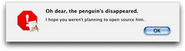

A sheet is simply a window with the window class `kSheetWindowClass` or `kAlertSheetWindowClass`, and as such you can create one from a nib, from a resource, or by using a window creation function. You should attach event handlers to the sheet, just as any other window.

Here are some cases where you should use sheets:

- You want to display a modal dialog that is specific to a particular document, such as saving or printing.
- You want to display a modal dialog that is specific to a single-window application that does not create documents. For example, a single-window utility application might use a sheet to request acceptance of a licensing agreement.
- You want to display a dialog that benefits from being associated with a document window, even if the dialog could also have been implemented as a modeless dialog.

Here are some cases when you should not use sheets:

- You want to display a dialog that pertains to several windows.
- Your dialog needs to be left open to let the user observe the effects of changes applied. Such tasks are better suited to modeless dialogs, utility windows, or drawers.
- Your window does not have a title bar. Sheets should emerge from a definite visual edge.

Only one sheet should be open for a document at any time. If the user’s response to a sheet requires another sheet to open, you must close the first sheet before opening the second.

To display a sheet, you call the function `ShowSheetWindow` (analogous to the `ShowWindow` function used for other window types), passing the window references of the sheet to be displayed and the window to associate with the sheet. If you have installed the standard handler on the sheet, the window contents are automatically drawn before display; otherwise your sheet receives a `kEventWindowDrawContent` event requesting the same. The now-visible sheet is grouped with its parent window (so that they move and activate/deactivate together).

To remove a sheet, you call the `HideSheetWindow` function, which you typically do from one of the event handlers attached to the window. For example, you can call `HideSheetWindow` when the user clicks the OK button or otherwise signals that he or she is done with the sheet.

If you want to create a simple alert that appears as a sheet, you can call the function `CreateStandardSheet`. This function is analogous in format to the `CreateStandardAlert` function. However, it includes an additional parameter to specify an event target. When the user dismisses the sheet alert (by clicking OK or Cancel), the system sends a command event (`kEventClassCommand`, type `kEventCommandProcess`) to the specified event target. You can use this event to determine which control the user clicked.

To make the sheet alert visible, you call `ShowSheetWindow`, just as you would for any other sheet.

The Control Manager has a creation function for each system-defined control, as shown in [Table 3-1](#apple-f4xwc4dqnrsv64tfmyxwi33df52wszbpkridgmbqgaytambufvbuqmrqgywueq2jirauuqsf).

__Table 2-1__  Control creation functions

| Control type | Creation function | Notes |
| Root control | `CreateRootControl` |  |
| Push button | `CreatePushButtonControl` or `CreatePushButtonWithIconControl` |  |
| Checkbox | `CreateCheckboxControl` |  |
| Radio button | `CreateRadioButtonControl` |  |
| Bevel button | `CreateBevelButtonControl` | You set the button behavior when calling the function. Additional bevel button functions exist to set the alignment of text or images within the button, set or obtain menu information, and so on. |
| Round button | `CreateRoundButtonControl` |  |
| Pop-up menu | `CreatePopUpButtonControl` |  |
| Scroll bar | `CreateScrollBarControl` |  |
| Slider | `CreateSliderControl` |  |
| List box | `CreateListBoxControl` |  |
| Scroll text field | `CreateScrollingTextBoxControl` |  |
| Progress indicator | `CreateProgressBarControl` |  |
| Chasing arrows | `CreateChasingArrowsControl` |  |
| Relevance control | `CreateRelevanceBarControl` |  |
| Static text | `CreateStaticTextControl` |  |
| Editable text field | `CreateEditTextControl` |  |
| Editable Unicode text field | `CreateEditUnicodeTextControl` | Mac OS X only |
| Icon control | `CreateIconControl` |  |
| Picture control | `CreatePictureControl` |  |
| Image well | `CreateImageWellControl` |  |
| Group box | `CreateGroupBoxControl`, `CreateCheckGroupBoxControl`, or `CreatePopupGroupBoxControl` |  |
| Radio group | `CreateRadioGroupControl` |  |
| Pane | `CreateUserPaneControl` |  |
| Tabs | `CreateTabsControl` |  |
| Disclosure triangle | `CreateDisclosureTriangleControl` |  |
| Disclosure button | `CreateDisclosureButtonControl` |  |
| Little arrows | `CreateLittleArrowsControl` |  |
| Separator lines | `CreateVisualSeparatorControl` |  |
| Data browser | `CreateDataBrowserControl` | This complex control also requires a number of additional configuration and manipulation functions. |
| Placard | `CreatePlacardControl` |  |
| Window header | `CreateWindowHeaderControl` |  |
| Clock | `CreateClockControl` | The clock automatically contains a little arrows control to adjust the date or time. |

These functions let you specify all the attributes or options necessary for creating the appropriate control. In addition, most control creation functions require you to specify the bounds of the control. This is the bounding rectangle (specified by the `Rect` data type) that defines the position (in the window’s local coordinates) and size of the control. Note if the bounds you specify are smaller than the minimum control size, the control will exceed the requested bounds.

Most of the options for Carbon windows and controls are handled by calling Window and Control Manager functions. If you want to reproduce or modify functionality that you see in Interface Builder, you can call the underlying functions yourself. This section describes the correspondence between options found in the Interface Builder Info windows and their Control and Window Manager counterparts.

[Table 3-2](#apple-f4xwc4dqnrsv64tfmyxwi33df52wszbpkridgmbqgaytambufvbuqmrqgywueq2jjfdegrkh) describes the correspondence between Interface Builder window options and Window Manager functions

__Table 2-2__  Window Manager functions for setting window options

| Interface Builder Window Option | Window Manager equivalent |
| Title | `SetWindowTitleWithCFString` |
| Class | Set when you call `CreateNewWindow`. You can also call `SetWindowGroup` or `GetWindowClass` after creation. Do not use `SetWindowClass`. |
| Theme brush | Set using the Appearance Manager function `SetThemeWindowBackground`. |
| Position | Set when you specify the `contentBounds` parameter in `CreateNewWindow`. You can also pass window position constants (type `WindowPositionMethod`) to `RepositionWindow`. |
| Buttons | Attributes you can set when calling `CreateNewWindow` or by calling `ChangeWindowAttributes`. |
| Attributes | Attributes you can set when calling `CreateNewWindow` or by calling `ChangeWindowAttributes`. |
| Receives | Attributes you can set when calling `CreateNewWindow` or by calling `ChangeWindowAttributes`. |
| Size | Set in the `contentBounds` parameter when calling `CreateNewWindow`. |
| Help tags | Implemented by calling the Carbon Help Manager. See the Carbon Help Manager documentation for more details. |

Options unique to a control type (for example, specifying a determinate or indeterminate progress indicator) are usually specified in the control’s creation function. See [Table 3-1](#apple-f4xwc4dqnrsv64tfmyxwi33df52wszbpkridgmbqgaytambufvbuqmrqgywueq2jirauuqsf) for the list of control creation functions.

[Table 3-3](#apple-f4xwc4dqnrsv64tfmyxwi33df52wszbpkridgmbqgaytambufvbuqmrqgywueq2jijaumr2b) describes the correspondence between general Interface Builder control options and Control Manager functions.

__Table 2-3__  Control options

| Interface Builder Control Option | Control Manager equivalent |
| Control ID | `SetControlID` |
| Signature | `SetControlID` |
| Command | `SetControlCommandID` |
| Enabled checkbox | `EnableControl` and `DisableControl` |
| Hidden checkbox | `HideControl` and `ShowControl` |
| Small checkbox | Pass `kControlSizeSmall` in `SetControlData` to specify the small control variant. |
| Size | Set in the `inBoundsRect` parameter of the particular control creation function. You can also set the size by calling `SetControlBounds`. |
| Help tags | Implemented by calling the Carbon Help Manager. See the Carbon Help Manager documentation for more details. |

This section describes some common window manipulation functions that you may want to use in your application. You can use these functions with windows created in any manner.

Activating a window typically brings it forward, gives it keyboard focus, and deactivates the previously active window. However, because of floating windows, the active window may not always be the frontmost window on the screen.

- To obtain the window reference of the currently active window, call the `ActiveNonFloatingWindow` function:

```
WindowRef ActiveNonFloatingWindow(void);
```
- To determine if a window is active, call the `IsWindowActive` function:

```
Boolean IsWindowActive(WindowRef inWindow);
```
- To activate or deactivate a window, call the `ActivateWindow` function:

```
OSStatus ActivateWindow (WindowRef inWindow,
                            Boolean inActivate);
```

  You do not have to call `ActivateWindow` in response to typical user actions (such as clicking in a window) as the standard handler will do so for you. `ActivateWindow` also causes the appropriate window activation or deactivation event to be sent to your window.

The Carbon Window Manager provides a number of functions to find particular windows.

- To obtain the frontmost window, call the `FrontWindow` function:

```
WindowRef FrontWindow(void);
```
- To obtain the frontmost window that is not a floating window, call the `FrontNonFloatingWindow` function:

```
WindowRef FrontNonfloatingWindow (void);
```
- To find the frontmost window of a particular class, call the `GetFrontWindowOfClass` function:

```
WindowRef GetFrontWindowOfClass (WindowClass inWindowClass
                                    Boolean mustBeVisible);
```
- To find the next window of a particular class, call the `GetNextWindowOfClass` function:

```
WindowRef GetNextWindowOfClass (WindowRef inWindow,
                                    WindowClass inClass,
                                    Boolean mustBeVisible);
```


At times you may want to change the visibility of your windows. For example, if the user closes a floating palette that is used often, it may be better to hide it rather than dispose of it, as doing so avoids the overhead of disposing of the window and recreating it later. On the other hand, keeping many windows available does use up memory, so use your judgment in determining which windows to hide and which to dispose of.

- To make a window visible, call the `ShowWindow` function:

```
void ShowWindow (WindowRef window);
```

  Note that all windows are invisible when first created.
- To hide a window, call the `HideWindow` function:

```
void HideWindow (WindowRef window);
```
- To determine whether a window is visible or not, use the `IsWindowVisible` function:

```
Boolean IsWindowVisible (WindowRef window);
```


When a document window is in an unsaved state, the close button should display a small dot in its center, and the proxy icon (if there is one) should be disabled. (Disabled proxy icons cannot be dragged because unsaved documents cannot be moved or copied in a manner predictable to the user.) You accomplish both of these tasks by calling the `SetWindowModified` function to change the modification state:

```
OSStatus SetWindowModified (WindowRef window, Boolean modified);
```


At times you may want to change the layering order of the windows in your application.

- To bring a window forward and make it active, call the `SelectWindow` function:

```
void SelectWindow (WindowRef window);
```

  The previously frontmost window is automatically deactivated.
- To send one window behind another, call the `SendBehind` function:

```
void SendBehind (WindowRef window, WindowRef behindWindow);
```

  If the window sent behind is the active window, it is deactivated and the next higher window is activated.

Beginning in Mac OS X version 10.2, the user should be able to cycle through the open document windows of an application by entering Command-tilde (~) to rotate forward, or Command-Shift-tilde to rotate backwards. The standard handler provides default support for these keyboard shortcuts, so you do not need to add any additional code.

If you use the standard window menu (see [The Standard Window Menu](#apple-f4xwc4dqnrsv64tfmyxwi33df52wszbpkridgmbqgaytambufvbuqmrqgywviucykjcummjwga)), you can specify the option `kWindowMenuIncludeRotate` when calling `CreateStandardWindowMenu` to place a “Cycle Windows” menu item in the Window menu. Doing so makes window cycling an explicit, rather than hidden, feature in the application.

If you want to add menu items for window cycling, and you want to use the standard handler’s cycling code, you can assign the following command IDs to your menu items:

```
kHICommandRotateWindowsForward = 'rotw',
kHICommandRotateWindowsBackward = 'rotb'
```


Most applications that handle document windows should have a Window menu, which allows the user to choose among any of the currently open windows. The easiest way to implement this menu is to call the `CreateStandardWindowMenu` function:

```
OSStatus CreateStandardWindowMenu (OptionBits inOptions,
                                    MenuRef *outMenu);
```

Each open window that has the `kWindowInWindowMenuAttribute` attribute set automatically appears in the Window menu.

At times, the window title that shows up in the Window menu may not be expressive enough to identify the window. In those cases, you can set an alternate title for the window that will appear only in the Window menu by calling the `SetWindowAlternateTitle` function:

```
OSStatus SetWindowAlternateTitle (WindowRef inWindow
                                    CFStringRef inTitle);
```

To get an existing alternate window title, use the `CopyWindowAlternateTitle` function:

```
OSStatus CopyWindowAlternateTitle (WindowRef InWindow,
                                    CFStringRef *outTitle);
```


If desired, you can assign arbitrary data to your windows by calling the `SetWindowProperty` function:

```
OSStatus SetWindowProperty (
                        WindowRef window,
                        PropertyCreator PropertyCreator,
                        PropertyTag PropertyTag,
                        UInt32 PropertySize,
                        void* PropertyBuffer);
```

You assign a creator code (typically the application’s signature) and a unique four-character tag to identify the data; this way you can associate multiple pieces of data with a window. To retrieve particular data, call the `GetWindowProperty` function:

```
OSStatus GetWindowProperty (
                        WindowRef window,
                        PropertyCreator PropertyCreator,
                        PropertyTag PropertyTag,
                        UInt32 bufferSize,
                        UInt32 *actualSize, // can be NULL
                        void *propertyBuffer);
```

If you need to set only one value, (such as a pointer to a data structure), you can also use the `SetWRefCon` function:

```
void SetWRefCon (WindowRef window, UInt32 data);
```

To retrieve the stored data, call the `GetWRefCon` function:

```
long GetWRefCon (WindowRef window);
```


If you create a document window, you should add a proxy icon to the title bar. This icon, which appears next to the window’s title, serves as a proxy for the document’s icon in the Finder. This proxy icon should appear and behave the way the document's icon does in the Finder.

Your application can call the function `SetWindowProxyCreatorAndType` when you want to establish a proxy icon for a window, but the window's data has not yet been saved to a file. By passing `SetWindowProxyCreatorAndType` the creator and type of the file that the window is to contain, you can provide visual consistency with other windows that have saved files with the Finder. If the window's data has been saved to a file, your application can call the functions `SetWindowProxyFSSpec` or `SetWindowProxyAlias` to associate the file with the window and thereby establish the proxy icon.

Once a window has a proxy icon, the user should be able to manipulate it as if he or she were performing actions with a Finder icon for the window's file. For example, if a user drags a proxy icon to a folder, Finder window, the desktop, or another volume, the file represented by the proxy icon should be moved or copied accordingly, as if the user had dragged the file's icon in the Finder.

If your window has the standard event handler installed, then the Window Manager automatically handles any proxy icon dragging feedback. Note that standard handler sends you `kEventWindowProxyBeginDrag` and `kEventWindowProxyEndDrag` events so that you can modify or obtain information from the drag reference structure if you desire. For more detailed information about drag-and-drop actions, see the Drag Manager documentation.

Because a user can so readily use a proxy icon to manipulate a document file while the document is itself open, your application should be sure to synchronize the file data for all of its document windows on an ongoing basis. Because a proxy icon is much more prominent to a user than a Finder icon when the user is working in an open document, it is more likely that the user may move the file represented by the proxy icon while the document is open.

For example, if a user opens "My Document" in an application, then drags the proxy icon for "My Document" to a different folder, the application may still expect "My Document" to be in its original location. Additionally, the user may change the name of "My Document" to "Your Document" or place "My Document" in the Trash folder while "My Document" is open.

If a document window contains unsaved changes, you should disable the proxy icon by calling the `SetWindowModified` function described in [Changing the Modification State](#apple-f4xwc4dqnrsv64tfmyxwi33df52wszbpkridgmbqgaytambufvbuqmrqgywueq2jijbemssj). Doing so prevents the user from dragging the proxy icon to another location. Your application should not disable the proxy icon at any other time.

Finally, when the user drags content that your application can accept into the content area of one of its windows, the window's structure region, including the proxy icon, should become highlighted. This gives visual feedback that the window is a valid destination for the content. Applications typically call the Drag Manager functions `ShowDragHilite` and `HideDragHilite` to indicate that a window is a valid drag-and-drop destination. If your application does not do this—that is, if your application implements any type of custom drag highlighting, such as highlighting more than one area of a window at a time—it must call the function `HiliteWindowFrameForDrag`.

The Window Manager supports the concept of window groups, which is essentially a way to associate windows together. Depending on which attributes you set for the group, windows in a group can share one or more of the following behaviors as if they were a single window:

- Activate and deactivate
- Change layers (that is, if one window is brought forward, all the windows in the group are brought forward)
- Move
- Collapse or hide

Using window groups, you can link several different classes of window together. For example, you could lock a toolbar window to a document window so that when one moved the other would also move.

Each window group is associated with a layer in the window layering hierarchy. In fact, in Mac OS X, the Window Manager defines each of the standard window classes (document, floating, and so on) as a window group. Window groups can contain other window groups, so you can create hierarchies of groups.

A document window with a sheet is an example of a window group. The sheet (when visible) is locked to a particular document window, and it moves, collapses, and changes layers along with the document. Here are some other examples of when you might want to group windows together:

- You want to create a window overlay that you can modify without affecting the window’s contents.
- You want to create multiple layers within a particular window class. For example, using window groups you could ensure that certain floating windows always remain above other floating windows.
- You want to toggle a floating window in a utility application from “stay behind mode” (where the window stays behind other applications’ windows) to “keep-in-front mode” (where the window is above all other windows).

To create a window group, call the `CreateWindowGroup` function:

```
OSStatus CreateWindowGroup (
                    WindowGroupAttributes inAttributes
                    WindowGroupRef *outGroup);
```

The attribute bits you pass to `CreateWindowGroup` determine which grouping properties windows in the group will have. [Table 3-4](#apple-f4xwc4dqnrsv64tfmyxwi33df52wszbpkridgmbqgaytambufvbuqmrqgywueq2jinbuisci) shows the possible constants you can pass.

__Table 2-4__  Window group attribute bits

| Constant | Description |
| `kWindowGroupAttrSelectAsLayer` | All windows in this group act as if they occupy the same layer. However, the user can change the ordering of the windows within the group. |
| `kWindowGroupAttrMoveTogether` | The positions of each window in the group with respect to each other is locked; moving one window also moves the others. |
| `kWindowGroupAttrLayerTogether` | The ordering of the windows within the group is locked; if the user attempts to bring one window forward, all the windows in the group are brought forward. |
| `kWindowGroupAttrSharedActivation` | All windows within the group activate and deactivate together. |
| `kWindowGroupAttrHideOnCollapse` | All windows within the group collapse into the Dock together. If any subgroup of this group has the `kWindowGroupAttrHideOnCollapse` attribute set, that group’s windows are collapsed as well. |

For example, to obtain the proper behavior for a window displaying a sheet, you would group the window and sheet together specifying the following attributes:

- `kWindowGroupAttrMoveTogether` (the two windows should move together)
- `kWindowGroupAttrLayerTogether` (the user should not be able to bring the document window in front of the sheet)

[Listing 3-9](#apple-f4xwc4dqnrsv64tfmyxwi33df52wszbpkridgmbqgaytambufvbuqmrqgywueq2jjjauescd) shows an example of grouping two windows together, a toolbar window and a document window.

__Listing 2-9__  Grouping two windows together

```
WindowRef myDocWindow, myToolbar;
WindowGroupRef myGroup;

/* Create your two windows here and show them */

CreateWindowGroup (0, &myGroup);// 1

SetWindowGroupParent (myGroup, // 2
                GetWindowGroupOfClass (kDocumentWindowClass));

SetWindowGroup (myDocWindow, myGroup);// 3
SetWindowGroup (myToolbar, myGroup);

ChangeWindowGroupAttributes (myGroup,// 4
            kWindowGroupAttrMoveTogether | kWindowGroupAttrLayerTogether,
            0);
```

Here is what the code does:

1. Call the `CreateWindowGroup` function to create a new group. The first parameter specifies any attributes you want to set (none in this case), and on return `myGroup` references the newly-created group.
2. Assign a parent group for the new group. As described earlier, groups can contain other groups, and in this case you assign your group to the group containing document class windows. To obtain a group reference from a window class, you call `GetWindowGroupOfClass`.

   Note that currently you cannot assign a parent to a group if the group already contains windows.
3. To add windows to your group, call the `SetWindowGroup` function. Note that you can only assign a window to one group. If the window is already in a group, `SetWindowGroup` removes the window from the old group and assigns it to the new one.
4. Now set attributes for the window group by calling `ChangeWindowGroupAttributes`. The second parameter indicates attributes to set, the third indicates those to remove. In this case, you specify that the windows in the group should move together and layer together.

The resulting pair of windows acts as though they were a single document window.

If you wanted to change the window ordering within the group, you can call functions such as `SelectWindow` and `SendBehind` on individual windows.

Some other useful window grouping functions include the following:

- To release (or dispose of ) a window group, call the `ReleaseWindowGroup` function:

```
OSStatus ReleaseWindowGroup (WindowGroupRef, inGroup);
```

  Calling `ReleaseWindowGroup` decrements the reference count of the group. If the reference count drops to zero, the group is disposed.
- To increment the reference count for a group, call the `RetainWindowGroup` function:

```
OSStatus RetainWindowGroup (WindowGroupRef inGroup);
```
- To get the group that contains a window, call the `GetWindowGroup` function:

```
WindowGroupRef GetWindowGroup (WindowRef inWindow);
```
- You can associate a window group with a particular window. To do so, call the `SetWindowGroupOwner` function:

```
OSStatus SetWindowGroupOwner (WindowGroupRef inGroup,
                                WindowRef inWindow);
```
- To determine which window owns a particular group, call the `GetWindowGroupOwner` function:

```
WindowRef GetWindowGroupOwner (WindowGroupRef inGroup);
```
- As mentioned earlier window groups can contain other groups. To change the ordering of a group within another window group, call the `SendWindowGroupBehind` function:

```
OSStatus SendWindowGroupBehind (WindowGroupRef inGroup, WindowGroupRef behindGroup);
```

  This function works much like the `SendBehind` function for windows. Both groups must have the same parent group.
- If you want to set the window level for a group, call the `SetWindowGroupLevel` function:

```
OSStatus SetWindowGroupLevel (WindowGroupRef inGroup,
                                SInt32 inLevel);
```

  The window levels you can specify here are a superset of the window class hierarchy. See the Core Graphics frameworks header `CGWindowLevel.h` for a listing of window levels.
- To get the window level for a group, call the `GetWindowGroupLevel` function:

```
OSStatus GetWindowGroupLevel (WindowGroupRef inGroup
                                SInt32 *outLevel);
```


Drawers are a special class of window that appear to slide out from behind another window. You use drawers to hold commonly used items or controls that do not have to be visible all the time. For example, a drawer could hold bookmarks for a web browser, or mailboxes for an email program. Figure shows a drawer attached to a document window.

You create a drawer just as you would any other type of window, except that you specify that its window class be a drawer. That is, you specify a drawer when creating your window in Interface Builder (need to confirm this) or you pass `kDrawerWindowClass` for the window class when calling `CreateNewWindow`. When creating your drawer, you must also specify the window compositing attribute, `kWindowCompositingAttribute`.

In most cases you should specify the standard event handler when creating a drawer. You can then add controls to the drawer just as you would for any other type of window.

If you want the drawer to have the default background for drawers, call the Appearance Manager function `SetThemeWindowBackground`, specifying `kThemeBrushDrawerBackground`.

- After creating the drawer, you must attach it to a parent window by calling the `SetDrawerParent` function:

```
OSStatus SetDrawerParent (WindowRef inDrawerWindow,                             WindowRef inParent);
```
- Unless you specify otherwise, the height of the drawer is the same as that of the parent window. If you want to change the height and relative position of the drawer with respect to its parent, use the `SetDrawerOffsets` function:

```
OSStatus SetDrawerOffsets (WindowRef inDrawerWindow,
                            float inLeadingOffset,
                            float inTrailingOffset);
```

  The leading offset is the number of pixels to offset the drawer from the top of the parent. The trailing offset is the number of pixels from the bottom of the drawer to the bottom edge of the parent.
- To toggle the drawer call the `ToggleDrawer` function:

```
OSStatus ToggleDrawer (WindowRef inDrawerWindow);
```

  This function call is asynchronous; `ToggleDrawer` installs a Carbon event timer to toggle the drawer and then returns. Therefore, the calling thread must be running its event loop for the drawer to actually open or close.
- Alternatively, to specifically open or close a drawer, call the `OpenDrawer` or `CloseDrawer` functions respectively.

```
OSStatus OpenDrawer (WindowRef inDrawerWindow                        OptionBits inEdge,                        Boolean inAsync);
OSStatus CloseDrawer (WindowRef inDrawerWindow                        Boolean inAsync);
```

  For the `inEdge` parameter you must pass a constant specifying the edge (that is, `kWindowEdgeTop`/`Left`/`Bottom`/`Right` or `kWindowEdgeDefault`).

  If you pass `False` in the `inAsync` parameter, the drawer opening or closing occurs synchronously; otherwise the action is asynchronous, as with the `ToggleDrawer` function.

[Listing 3-10](#apple-f4xwc4dqnrsv64tfmyxwi33df52wszbpkridgmbqgaytambufvbuqmrqgywueq2jjbfeqrkf) shows the code to set up and attach a simple drawer.

__Listing 2-10__  Displaying a simple drawer

```
WindowRef myDrawer, parentWindow;
Rect drawerBounds = {0,0,250,150};

/* Assume that the parent window exists already and is visible */

CreateNewWindow (kDrawerWindowClass, kWindowStandardHandlerAttribute |
                kWindowCompositingAttribute, &drawerBounds, &myDrawer);

SetThemeWindowBackground (myDrawer, kThemeBrushDrawerBackground, true);

SetDrawerParent(myDrawer, parentWindow);
SetDrawerOffsets (myDrawer, 0.0, 25.0);

ToggleDrawer (myDrawer);
```

By default, the edge of the parent window where the drawer appears is determined by the current script system. If the script reads left to right, the drawer appears on the left side. For right to left scripts (such as Arabic), the drawer appears on the right side. If there is not enough screen space for the drawer, the drawer appears on the opposite edge. If space is constrained on both sides, the drawer appears on the preferred side, but possibly obscured (for example, partly offscreen or hidden by the Dock).

- If you want to override the preferred edge for the drawer, call the `SetDrawerPreferredEdge` function:

```
OSStatus SetDrawerPreferredEdge (WindowRef inDrawerWindow,                                    OptionBits inEdge);
```

  The edge you specify becomes the new default edge (that is, the one chosen when you pass `kWindowEdgeDefault` into `OpenDrawer`.
- To get the preferred edge for a drawer, call the `GetDrawerPreferredEdge` function:

```
OptionBits GetDrawerPreferredEdge (WindowRef inDrawerWindow);
```
- To get the current window edge on which a drawer is displayed, call the `GetDrawerCurrentEdge` function:

```
OptionBits GetDrawerCurrentEdge (WindowRef inDrawerWindow);
```

  Note that this edge is not necessarily the preferred edge because of screen space constraints.

This section describes various control manipulation functions that you may want to use in your application.

You can use the following functions to activate or deactivate your controls:

- To activate a control, call the `ActivateControl` function:

```
OSErr ActivateControl (ControlRef inControl);
```
- To deactivate a control, call the `DeactivateControl` function:

```
OSErr DeactivateControl (ControlRef inControl);
```
- To determine whether a control is active, use the `IsControlActive` function:

```
Boolean IsControlActive (ControlRef inControl);
```

In general, a control’s active state should match that of its owning window (that is, when a window is active, all of its controls should likewise be active). However, the Control Manager does not enforce this matching; your application is responsible for maintaining this correspondence. The simplest way to do so is to activate or deactivate the window’s root control as the window’s state changes.

You can use the following functions to enable or disable your controls. Disabled controls are “grayed out" and do not receive user events.

- To enable a control, call the `EnableControl` function:

```
OSStatus EnableControl (ControlRef inControl);
```
- To disable a control, call the `DisableControl` function:

```
OSStatus DisableControl (ControlRef inControl);
```
- To determine whether a control is enabled, use the `IsControlEnabled` function:

```
Boolean IsControlEnabled (ControlRef inControl);
```

You disable controls if you do not want them to function for a particular reason. For example, in the standard Save dialog, the Save button is disabled until the user enters a name for the file to be saved.

You use the following functions to show or hide a control:

- To show or hide a control, use the `SetControlVisibility` function:

```
OSErr SetControlVisibility (ControlRef inControl,
                                Boolean inIsVisible,
                                Boolean inDoDraw);
```
- To determine whether a control is visible, use the `IsControlVisible` function:

```
Boolean IsControlVisible (ControlRef inControl):
```


In certain cases (such as when draw content events or update events occur) you may want to redraw your controls.

If you want to redraw all the controls associated with a window, call the `DrawControls` function:

```
void DrawControls (WindowRef theWindow);
```

In most cases, however, you want to redraw only those controls that were added to the update region. In response to the draw content event or update event, you should call `UpdateControls`:

```
void UpdateControls (WindowRef the Window, RgnHandle updateRegion);
```

If you want to redraw only a particular control (say a scroll bar after the user resized a window), you call the `Draw1Control` function:

```
void Draw1Control (ControlRef theControl);
```


All controls are embedded in one or more other controls, so you may need to use these functions to manipulate them properly:

- To create a root control for a window, call the `CreateRootControl` function:

```
OSErr CreateRootControl (WindowRef inWindow,
                            ControlRef *outControl);
```
- To get an existing root control, call the `GetRootControl` function:

```
OSErr GetRootControl (WindowRef inWindow
                            ControlRef *outControl);
```
- To embed one control in another, use the `EmbedControl` function:

```
OSErr EmbedControl (ControlRef inControl,
                        ControlRef, inContainer);
```
- You can also embed controls using the `AutoEmbedControl` function:

```
OSErr AutoEmbedControl ControlRef inControl, WindowRef inWindow);
```

  If you specify auto-embedding for a control, then the Control Manager assumes embedding if the control lies within the bounds of another control. For example, say you have a group box within a window. If you designate a checkbox as being auto-embedding and place it so that its physical coordinates lie within the group box, the Control Manager embeds your checkbox within that control. The bounds of the root control is the content region of the window, so auto-embedded controls are always embedded within the root control (in addition to whatever other controls might contain it).
- To get the immediate owner of an embedded control, call the `GetSuperControl` function:

```
OSErr GetSuperControl (ControlRef inControl,
                            ControlRef *outParent);
```


This section contains some examples of how to implement functions to handle the following tasks:

- Live scrolling in windows with proportional scrollers
- Using tab controls to switch between panes

Scroll bars have been a part of the user interface since the first Macintosh computer. All Mac OS X applications should support live scrolling, meaning that the window’s contents should update on the fly as the user manipulates the scroll bars.

You implement live scrolling by assigning a control action callback to your scroll controls. The callback function is called periodically as the user interacts with the scroll bar, giving your application the opportunity to update the contents of the window.

You register a callback for a control using the `SetControlAction` function:

```
void SetControlAction (ControlRef theControl,                         ControlActionUPP actionProc);
```

Note that you can attach control action callbacks to any type of control. Typically you use them whenever you need to do some sort of update on the fly. For example, a size-control slider could use an action callback to update the size of an image as it is moved.

The scrolling action itself is relatively straightforward if you understand conceptually what is happening to the window’s contents. The simplest way to look at scrolling is to imagine a window as the rectangular cutout in a sheet of opaque paper resting on a two-dimensional image, such as a photograph. Moving the horizontal scroller to the right moves the window to the right, exposing more of what is on that side. Moving the vertical scroller downwards effectively moves the window down.

The tricky part is translating the apparent movement of the window in a manner that you can implement in your application. For example, when displaying a picture onscreen, the window actually remains stationary while scrolling. Therefore, to accomplish the same relative movement across the picture, you must move the picture in the opposite direction. That is, as the user moves a scroller to the right, you must move the picture to the left.

This section describes how to create a window containing an image that you can scroll vertically or horizontally. For this example, assume the following:

- The window is not resizable, and its content region is 200 pixels wide by 150 pixels high. The window (“Scroller”) is contained in a nib file named `simpleScroller.nib`, and it uses the standard window handler.
- The window contains vertical and horizontal scroll bars with control IDs of 128 and 129 respectively. The application signature for the controls is `'Moof'`.
- The picture to display in the window is 500 pixels wide by 350 pixels high. The picture is stored in a data fork–based resource.

[Listing 3-11](#apple-f4xwc4dqnrsv64tfmyxwi33df52wszbpkridgmbqgaytambufvbuqmrqgywueq2jjjcekrkc) shows an initialization function that creates a window from a nib file, loads the picture, and then displays the picture in the window.

__Listing 2-11__  Creating a window and displaying a picture


```
/* First define various global variables */
PicHandle myPict;
Rect pictRect;
UInt32 picWidth, picHeight;
Point picOffset;
ControlActionUPP myLiveScrollerUPP;

ControlID vScrollID, hScrollID;
ControlRef horizontalScroller, verticalScroller;

UInt32 contentWidth, contentHeight;

void MyInitializeScrollWindow (void)
 {

    IBNibRef theNib;
    OSStatus err;
    WindowRef scrollWindow;
    Rect theBounds;

    err = CreateNibReference (CFSTR("simpleScroller"),&theNib);// 1
    CreateWindowFromNib(theNib, CFSTR("Scroller"), &scrollWindow);

/* Install your window event handlers here *// 2

    ShowWindow(scrollWindow);// 3

    hScrollID.signature = 'Moof';
    vScrollID.signature = 'Moof';
    hScrollID.id = 129;
    vScrollID.id = 128;

    GetControlByID (scrollWindow, &vScrollID, &verticalScroller);// 4
    GetControlByID (scrollWindow, &hScrollID, &horizontalScroller);


    myPict = GetPicture (10001); // get picture from resource// 5

    if (myPict == NULL) SysBeep(1);


    /* Get dimensions of the picture */
    picWidth = (**myPict).picFrame.right - (**myPict).picFrame.left;
    picHeight = (**myPict).picFrame.bottom - (**myPict).picFrame.top;

    SetPortWindowPort(scrollWindow);                    // 6

    GetWindowBounds (scrollWindow, kWindowContentRgn, &theBounds); // 7

    contentWidth = theBounds.right -theBounds.left - 15;// 8
    contentHeight = theBounds.bottom - theBounds.top - 15;

    SetControl32BitMaximum (verticalScroller,
                             picHeight - contentHeight);// 9
    SetControl32BitMaximum (horizontalScroller, picWidth - contentWidth);

    SetControl32BitMinimum (verticalScroller, 0);// 10
    SetControl32BitMinimum (horizonalScroller, 0);

    SetControlViewSize (verticalScroller, contentHeight);// 11
    SetControlViewSize (horizontalScroller, contentWidth);

    SetControl32BitValue (verticalScroller, 0);// 12
    SetControl32BitValue (horizontalScroller, 0);

    /* Assign initial offset of picture */
    picOffset.v = 0// 13
    picOffset.h = 0

    myLiveScrollerUPP = NewControlActionUPP (MyLiveScrollProc);

    SetControlAction (verticalScroller,myLiveScrollerUPP);// 14
    SetControlAction (horizontalScroller, myLiveScrollerUPP);

    MyDrawThePic (scrollWindow); // 15
 }
```

Here is what the code does:

1. First obtain a nib reference and load the window from the nib file.
2. In a real window initialization function, you would probably want to install any custom event handlers here. Live scrolling requires only the standard event handler.
3. Display the window.
4. Call the `GetControlByID` function twice to obtain the control references for the two scroll controls. These control references are stored globally. In a more flexible case, you may want to pass these references as parameters into your scrolling function.
5. Obtain the image from a resource. The image is stored as a PICT resource in the data fork with (in this example) resource ID 10001.
6. Call `SetPortWindowPort` to set the graphics port to be the content region of the window. Once set, all drawing is directed to this window, with the pixel coordinates (0,0) corresponding to the upper-left corner of the content region.
7. Pass the `kWindowContentRgn` constant into `GetWindowBounds` to obtain a rectangle that defines the boundaries of the content region.
8. Note that the content region obtained by `GetWindowBounds` also includes the area currently occupied by the scroll controls. Because you don’t want to draw over the controls, subtract the width of the scroll controls (15 pixels) to obtain the true dimensions of allowable drawing region.
9. Call `SetControl32BitMaximum` twice to set the maximum allowable values for the scrollers (which are the indicators for the scroll bars). In this example, the values that the scrollers can take correspond to pixels. The maximum horizontal scroll value is the difference between the picture width (500 pixels) and the drawing region width (185 pixels). When the scroller value is 0, the window displays the leftmost portion of the picture. When the value is at its maximum (315), the window displays the rightmost portion. Similarly, the maximum vertical scroller value is the difference between the picture height and the drawing region height, or 215 pixels.
10. Similarly, you call `SetControl32BitMinimum` twice to set the minimum scroller values to 0.
11. Call `SetControlViewSize` to set the correct proportional scroller size. The value you pass indicates how much of the actual image is visible in the window, in terms of the units you specified in `SetControl32BitMaximum`. For example, because the units are pixels, the value to set for the horizontal scroller corresponds to the number of horizontal pixels that are visible in the window, which is the value of `contentWidth`.

    For resizable windows, you must update the sizes of the scrollers whenever the window dimensions change.
12. Call `SetControl32BitValue` to assign initial values to the scrollers. Setting these to their minimum values means that the scrollers are positioned at the left and top of their respective scroll bars.
13. Because the initial scroller values are 0, the initial picture offsets should also be 0. Note however, that as the scroller’s value is increased, the picture must be displaced in the opposite direction to create the illusion of movement.
14. Using the control references obtained earlier, call `SetControlAction` for each scroll control to assign an action callback, `MyLiveScrollProc`. This callback is called whenever the user activates a scroll control.
15. Call the function `MyDrawThePic` to draw the picture inside the window.

[Listing 3-12](#apple-f4xwc4dqnrsv64tfmyxwi33df52wszbpkridgmbqgaytambufvbuqmrqgywueq2jireeqrsi) shows the implementation for the `MyDrawThePic` function, which draws the picture in the window. Much of the graphical manipulation relies on QuickDraw function calls. Their usage and functionality are described briefly, but if you want more details, you should consult the QuickDraw documentation available in Carbon Graphics and Imaging documentation.

__Listing 2-12__  The picture-drawing function


```
void MyDrawThePic (WindowRef theWindow)
{
    RgnHandle saveClip;
    Rect theBounds;
    CGrafPtr thePort;

    thePort = GetWindowPort(theWindow);// 1
    GetPortBounds(thePort, &theBounds);     // 2

    saveClip = NewRgn(); // allocate new region// 3
    GetClip (saveClip); // save old clip region// 4

    theBounds.bottom = theBounds.bottom -15;// 5
    theBounds.right = theBounds.right -15;

    ClipRect (&theBounds); // 6

    pictRect.left = picOffset.h ;// 7
    pictRect.top = picOffset.v;
    pictRect.right = pictRect.left + picWidth;
    pictRect.bottom = pictRect.top + picHeight;

    DrawPicture (myPict, &pictRect ); // 8

    SetClip (saveClip); // 9
    DisposeRgn (saveClip);
}
```

Here is what the code does:

1. Call `GetWindowPort` to obtain the graphics port associated with the window. This `CGrafPtr` pointer references a structure containing information about the current drawing area.
2. Calling the QuickDraw function `GetPortBounds` obtains the boundaries of the current drawing area (both in size and location). For system-defined windows, this area is equivalent to the window’s content region.
3. Allocate space for a new clip region by calling the QuickDraw function `NewRgn`. The clip region is an arbitrary region within which drawing is allowed. For example, while the actual drawing region (as defined by the graphics port) may be arbitrarily large, the only drawing that actually appears onscreen is that which intersects the clip region.
4. Only one clip region is defined at any time, so you must store the previously defined clip region in `saveClip` by calling the QuickDraw function `GetClip`. Doing so ensures that you don’t corrupt the clip region used by a different application.
5. Reduce the obtained bounds for the content region by 15 pixels in each dimension to exclude the window’s scroll bars from the drawing area.
6. Set the clip region for the window’s graphics environment to be the reduced bounds.
7. Set the coordinates in which to draw the picture. These coordinates define a rectangle the size of the actual picture, offset from the local origin by an amount determined by the scroller values. For example, if there is no offset (because both scrollers are at their minimum values) then the top-left corner of the picture is at the window’s local origin.
8. Draw the picture using the QuickDraw function `DrawPicture` , which is a simple way to draw images of type PICT. Because the clip region is confined to the area inside the window, only the portion of the picture within that region actually appears onscreen.
9. After drawing, restore the old clip region using the `SetClip` function, and dispose of the memory used to store it by calling `DisposeRgn`.

Your drawing function may be more complex, but the basic principles still apply. Because the clip region defines the area within which the picture is visible, you change what portion is visible by moving the picture around “behind the window,” so to speak. Scrolling merely gives you a measured way to change the position of the picture. 

[Figure 3-17](#apple-f4xwc4dqnrsv64tfmyxwi33df52wszbpkridgmbqgaytambufvbuqmrqgywueq2jizdeqrkc) shows the relative positions of the window and the image when the scroller values are 0.

__Figure 2-17__  Picture in window for the minimum scroll control values

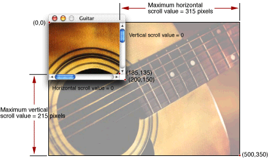

[Listing 3-13](#apple-f4xwc4dqnrsv64tfmyxwi33df52wszbpkridgmbqgaytambufvbuqmrqgywueq2ji5ceor2f) shows the live scrolling callback function. This function takes two parameters indicating the control and the part of the control that activated the action callback.

Note that the standard event handlers take care of moving the scrollers, tracking the mouse, and any other feedback related to control itself; our scrolling callback function only has to adjust the position of the image based on the actions taken by the user.

__Listing 2-13__  The live scrolling callback function


```
static pascal void MyLiveScrollProc (ControlHandle control, SInt16 part)
{
    SInt16 currentValue, min, max, delta;

    currentValue = GetControl32BitValue (control);// 1
    min = GetControl32BitMinimum (control);
    max = GetControl32BitMaximum (control);

    delta = 0;// 2

    switch (part)
    {
        case kControlUpButtonPart:// 3
            if (currentValue >min)
                    delta = (currentValue-min < 5 ?
                                    -(currentValue-min): -5);
            break;

        case kControlDownButtonPart:
            if (currentValue < max)
                    delta =  (max - currentValue > 5 ?
                                    5 : max - currentValue);
            break;

        case kControlPageUpPart:// 4
            if (currentValue >min)
                    {
                    if (control == horizontalScroller)
                            delta = ( currentValue-min >contentWidth-1 ?
                                -(contentWidth-1) : -(currentValue-min));
                    else
                            delta = ( currentValue-min >contentHeight-1 ?
                                -(contentHeight-1) : -(currentValue-min));
                    }
            break;

        case kControlPageDownPart:
            if (currentValue < max)
                    {
                    if (control == horizontalScroller)
                            delta = (contentWidth-1 < max-currentValue ?
                                contentWidth-1: max-currentValue);
                    else
                            delta = (contentHeight-1 < max-currentValue ?
                                contentHeight-1 : max-currentValue));
                    }
            break;
    }

    if (delta != 0)
    {
        SetControl32BitValue (control, currentValue + delta);// 5

        if (control == horizontalScroller)// 6
                picOffset.h -= delta;

        if (control == verticalScroller)
                picOffset.v -= delta;


        MyDrawThePic(GetControlOwner(control));// 7
    }

    else if (part == kControlIndicatorPart)// 8
    {
        if (control == horizontalScroller)
                picOffset.h = -(currentValue - min);

        if (control == verticalScroller)
                picOffset.v = -(currentValue - min);

        MyDrawThePic (GetControlOwner (control));

    }
}
```

Here is what the code does:

1. First obtain the values assigned to the control. The maximum and minimum values are those that were set in the `MyInitializeScrollWindow` function. The current value is determined by the position of the scroller.
2. The `delta` variable indicates the distance (in pixels) to move the picture in response to the scroll bar manipulation. This value is also used to set the new value of the scroller.
3. The `switch` statement assigns the `delta` value depending on which part of the scroll control was manipulated. The `kControlUpButtonPart` and `kControlDownButtonPart` constants refer to the scroll arrows. Clicking one of these arrows once scrolls the content by a small fixed amount. The incremental amount chosen for this example is 5 pixels. Note that if the scroller value is less than 5 away from its minimum or maximum, it `delta` is adjusted to be only the amount necessary to reach the endpoint.
4. The `kControlPageUpPart` and `kControlPageDownPart` constants refer to the white track area of the scroll control within which the Aqua scrollers move. If the user has the scroll bar preference in the General pane of System Preferences set to to “Jump to next page, “ a click in the track area causes the content to shift by the corresponding window content dimension. For example, clicking above the vertical scroller moves the image up by the height of the window’s content region. A click below the scroller moves the image down by the same amount. As with the scroll arrows, in the end cases where a full page shift would take you beyond the end of the picture, `delta` is set to be only enough to reach the edge.
5. If `delta` is not zero, add it to the appropriate scroller value (horizontal or vertical).
6. Because the control value is in the same units as the offset (pixels), you also adjust the offset to reflect the new picture position. Note that you subtract `delta` from the offset because the control values and picture offset move in opposite directions. For example, as you increase the horizontal scroller value (that is, as the scroller moves to the right), the picture must move left to show the proper portion.
7. Call the `MyDrawThePic` function to update the picture. Because you don’t currently have a window reference, use the function `GetControlOwner` to obtain one.

   Note that updating the entire picture each time is not necessarily the most efficient way to update the window contents. A more sophisticated application might determine how much of the picture has actually changed, move the picture using a function such as `ScrollWindowRect` or `ScrollWindowRegion`, ) and update only the portion that is new.
8. The final scroll bar part that the user can manipulate is the scroller. Typically the user drags the scroller to a new position. In such cases, rather than changing the picture’s offset by an incremental amount, you simply set the offset based on the new value of the scroller and call `MyDrawThePic` to redraw the picture.

   If the user has the “Scroll to here” system preference set, a click in the track area moves the scroller to that point and sets the scroller value, just as if the user had actually dragged the scroller.

[Figure 3-18](#apple-f4xwc4dqnrsv64tfmyxwi33df52wszbpkridgmbqgaytambufvbuqmrqgywueq2jivbegrkj) shows the relative positions of the window and the image when the horizontal and vertical scroller values are each set to 100. 

__Figure 2-18__  Picture in window when scroller values are set to (100,100)

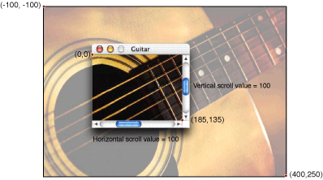

You typically use tab controls to switch between several panes. Interface Builder lets you place panes and tabs together as one unit. However, while each tab looks as though it is attached to a particular pane, this appearance is actually an illusion that you must implement using code in your control event handlers. This section gives an example of how to do this. For this example, assume the following:

- The window is contained in a nib file and uses the standard handler. It contains a tab control with two panes (that is, the tabs let you switch between two panes).
- The application signature is `'Moof'`. The control ID for the tab control is 128. The control IDs for the panes are 129 and 130.

First you should install an event handler on the tab control that determines which tab was clicked and then switch panes accordingly.

[Listing 3-14](#apple-f4xwc4dqnrsv64tfmyxwi33df52wszbpkridgmbqgaytambufvbuqmrqgywueq2jjfdugskg) shows how you would install your tab event handler.

__Listing 2-14__  Installing the tab control event handler

```
ControlID   tabControlID;
ControlRef  tabControl;
EventHandlerUPP myTabHandlerUPP;

tabControlID.signature = 'Moof';// 1
tabControlID.id = 128;

static const EventTypeSpec tabControlEvents[] =// 2
{
    {kEventClassControl, kEventControlHit}
};

GetControlByID (theWindow, &tabControlID, &tabControl);// 3

myTabHandlerUPP = NewEventHandlerUPP (MyTabEventHandlerProc);// 4

err = InstallControlEventHandler (tabControl, // 5
                            myTabHandlerUPP,
                            GetEventTypeCount (tabControlEvents),
                            tabControlEvents,
                            theWindow, NULL);// 6
```

Here is what the code does:

1. First, define the tab control’s signature and control ID. These should be the same values that you set for the tab control in your nib file.
2. Define the events for which you want the tab event handler to be called. In this example, there is only one, the control hit event. The system sends this event whenever the user clicks the control.
3. Call `GetControlByID` to get the control reference for the tab control. The `theWindow` parameter is a reference to the window containing the control. You would have obtained this reference when creating the window from the nib file (that is, when calling `CreateWindowFromNib`).
4. When designating the tab event handler, you must call `NewEventHandlerUPP` on the function pointer to convert it to a universal procedure pointer.
5. The function `InstallControlEventHandler` is the macro that combines the standard `InstallEventHandler` call with `GetControlEventTarget` so you don’t have to call the latter function yourself.
6. You pass the window reference `theWindow` as arbitrary data to make it easy to obtain the control references for the panes.

The actual tab event handler, `MyTabEventHandlerProc`, determines whether the user has switched tabs. If so, it calls another function to switch panes. [Listing 3-15](#apple-f4xwc4dqnrsv64tfmyxwi33df52wszbpkridgmbqgaytambufvbuqmrqgywueq2jivceeqsg) shows the event handler.

__Listing 2-15__  The tab control event handler


```
static pascal OSStatus MyTabEventHandlerProc(
                                EventHandlerCallRef inCallRef,
                                EventRef inEvent, void* inUserData )
{
    ControlRef          tabControl;
    static short        lastTabIndex;
    short               controlValue;
    WindowRef           window  = (WindowRef)inUserData;
    ControlID           tabControlID;

    tabControlID.signature = 'Moof';// 1
    tabControlID.id = 128;

    GetControlByID( window, &tabControlID, &tabControl );// 2
    controlValue = GetControlValue( tabControl );// 3
    if ( controlValue != lastTabIndex )// 4
    {
        MySwitchItemOfTabControl( window, tabControl, controlValue );
        lastTabIndex = controlValue;
        return (noErr);
    }
    else
    {
        return( eventNotHandledErr );
     }
}
```

Here is what the code does:

1. Redefine the tab control’s signature and control ID. Alternatively, you could define the control ID in a global variable.
2. Obtain the control reference for the tab control by calling `GetControlByID`. Note that you used the window reference passed into the event handler as custom data.
3. Now that you have the tab control reference, you can obtain the value of the control. This value indicates which of the tabs the user selected.
4. Compare the obtained tab value with the “current” tab value. If they are the same, that means that the user clicked the tab that was currently active, so you don’t need to do anything; the handler simply returns `eventNotHandledErr`. If they differ, then call the function to switch panes (`mySwitchItemOfTabControl`), update the current tab value, and then return.

Note that this event handler doesn’t have to call `GetEventParameter` to obtain any needed information; the value of the tab control is set automatically by the Control Manager when the user clicks a specific tab.

The actual function to switch panes is shown in [Listing 3-16](#apple-f4xwc4dqnrsv64tfmyxwi33df52wszbpkridgmbqgaytambufvbuqmrqgywueq2jjfaumq2j).

__Listing 2-16__  The tab switching function


```
static  void    MySwitchItemOfTabControl( WindowRef window,
                            ControlRef tabControl, short currentTabIndex )
{
    ControlID       controlID;
    ControlRef      userPaneControl;
    short           i;
    ControlRef      selectedPaneControl = NULL;
     int            tabList[]           = {2, 129, 130};// 1

    controlID.signature = 'Moof';

    for ( i=1 ; i<tabList[0]+1 ; i++ )
    {
        controlID.id    = tabList[i];
        GetControlByID( window, &controlID, &userPaneControl );// 2

        if ( i == currentTabIndex )// 3
            selectedPaneControl = userPaneControl;
        else
            SetControlVisibility( userPaneControl, false, true );
    }
    if ( selectedPaneControl != NULL )// 4
    {
        (void) ClearKeyboardFocus( window );
        SetControlVisibility( selectedPaneControl, true, true );
    }

    Draw1Control( tabControl );         //  Redraw the tab control itself
}
```

Here’s what the code does:

1. The `tabList` array contains the number of tabs (two in this case) followed by the control IDs assigned to each of the panes (called user pane IDs in the nib file).
2. Obtain the control reference for the pane indexed by the counter `i`.
3. If the index is the same as that for the current pane, then save the corresponding control reference. Otherwise, call `SetControlVisibility` to set the pane visibility to `false` (hidden) and update the display (by passing `true`).
4. If saved control reference is valid, then make that pane visible and update the display. If the previous pane had keyboard focus, you should clear it by calling the `ClearKeyboardFocus` function.

When you create the window with the tab controls, you should call your tab switching function to initialize the tab settings. Your code might look something like [Listing 3-17](#apple-f4xwc4dqnrsv64tfmyxwi33df52wszbpkridgmbqgaytambufvbuqmrqgywueq2jindemskj).

__Listing 2-17__  Initalializing the tab control setting when creating the window

```
WindowRef   tabWindow;
ControlRef  tabControl;
ControlID   tabControlID;

tabControlID.signature = 'Moof';// 1
tabControlID.id =128;

CreateWindowFromNib (theNib, CFSTR(“Tabs”), &tabWindow);

GetControlByID (tabWindow, &tabControlID, &tabControl);// 2
SetControlValue (tabControl, 1);

MySwitchItemOfTabControl (tabWindow, tabControl, // 3
                            GetControlValue (tabControl));
ShowWindow(tabWindow);
```

1. First, set the tab control signature and ID so you can obtain the tab control.
2. After calling `GetControlbyID` to obtain the tab control reference, call `SetControlValue` to set its index. This value corresponds to the first, or leftmost, tab.
3. Call `MySwitchItemOfTabControl` to make the corresponding pane visible.

For specialized applications you may want to create your own windows or controls. An example might be an immersive science-fiction game with a customized look-and-feel (that is, one that does not rely on Aqua).

The Carbon Event Manager lets you implement custom objects such as windows and controls by creating toolbox object classes for them. A _toolbox object class_ is similar to a class in object-oriented programming, except that instead of methods you have event handlers to create and define your objects.

For example, when first creating a window, the Carbon Event Manager sends an event requesting that you draw the window outline. If a mouse click occurs in the window, an event is sent to determine what part of the window was hit, and so on. Your custom window is essentially a collection of event handlers that define its appearance and behavior.

The standard system-defined controls and windows are also described by event handlers. The only difference for custom objects is that you must supply the implementation code to handle the events.

You register your collection of event handlers as a custom object using the `RegisterToolboxObjectClass` function:

```
OSStatus RegisterToolboxObjectClass (
                            CFStringRef inClassID// 1
                            ToolboxObjectClassRef inBaseClass// 2
                            UInt32 inNumEvents// 3
                            const EventTypeSpec* inEventList// 4
                            EventHandlerUPP inEventHandler// 5
                            void* inEventHandlerData// 6
                            ToolboxObjectClassRef *outClassRef);// 7
```

1. The `inClassID` parameter lets you assign a Core Foundation string to label this class of object. You must assign a unique class name; Apple suggests that you follow the standard naming convention `com`._CompanyName_._Application_._ClassName_.
2. If you are subclassing this object from another class, you can specify the base class in the `inBaseClass` parameter. In true object-oriented fashion, the new object retains the event handlers registered for the base class, although you can override them if you like.
3. The `inNumEvents` parameter specifies the number of events you want to register for this object class.
4. The `inEventList` array contains the events to register for this object. You define these just as you would for any other Carbon Event handler. In addition to your custom definition events, you should also install the usual event handlers required for the object (such as `kEventWindowDrawContent` for a window).
5. The `inEventHandler` parameter is a universal procedure pointer to the event handler for this object class.
6. The `inEventHandlerData` parameter contains any special data you want to pass to your event handler.
7. On return, `outClassRef` contains a reference to the new object class.

In cases where you want to add a specialized control or window to the standard interface, you can use Appearance Manager functions to ensure that whatever you draw matches the current theme.

For example, if you use the Appearance Manager function `DrawThemeWindowFrame` to draw your window’s frame region, then the frame automatically has the proper look for the type of window you specified. The function `SetThemeWindowBackground` ensures that your window’s background has the proper look for its type given the current theme. Similar functions exist for drawing controls or parts of controls. For example, even if you use nonstandard controls, you may want to use the Appearance Manager to draw focus rings, obtain the preferred font type and size, and so on. [Creating a Custom Control](#apple-f4xwc4dqnrsv64tfmyxwi33df52wszbpkridgmbqgaytambufvbuqmrqgywueq2jivaumqsf) uses a call to the Appearance Manager function `DrawThemeButton` to draw a bevel button.

The Appearance Manager also includes functions to obtain the fonts appropriate for a given theme. For example, you could call `GetThemeFont` passing `kThemePushButtonFont` and the appropriate script encoding to obtain the proper font for drawing push button text.

On Mac OS X, applications are automatically registered with the Appearance Manager, so you do not need to call `RegisterAppearanceClient` before calling Appearance Manager functions (but there is no penalty if you do).

For more detailed information, see _[Programming with the Appearance Manager](https://developer.apple.com/library/archive/documentation/Carbon/Conceptual/ProgAppearance_Manager/index.html#//apple_ref/doc/uid/TP40001038)_ in Carbon Human Interface Toolbox documentation.

To create a custom window, you must write handlers to respond to a number of different events. [Table 3-5](#apple-f4xwc4dqnrsv64tfmyxwi33df52wszbpkridgmbqgaytambufvbuqmrqgywueq2jjbdugskg) lists the most common events.

__Table 2-5__  Custom window events

| Event | Required Action |
| `kEventWindowDrawFrame` | Draw the frame region, including any controls within it. |
| `kEventWindowDrawPart` | Draw a specific part in the window, such as the close button. The part to be drawn is specified by the `kEventParamWindowDefPart` parameter. |
| `kEventWindowPaint` | Draw the frame region and the content region. In cases where you need to draw both at the same time, acting on this event is more efficient than handling both `kEventWindowDrawFrame` and `kEventWindowDrawPart` (specifying the content region). |
| `kEventWindowGetRegion` | Return the region specified by `kEventParamWindowRegionCode` in the `kEventParamRgnHandle` parameter. The window region codes are defined in `MacWindows.h`. |
| `kEventWindowHitTest` | Based on the mouse location passed into `kEventParamMouseLocation`, return the part hit (close button, size button, drag region, and so on) in the `kEventParamWindowDefPart` parameter. |
| `kEventWindowInit` | Perform any specific window initialization. Return the features of the window in the `kEventParamWindowFeatures` parameter. The window feature bits are defined in `MacWindows.h`. |
| `kEventWindowDispose` | Perform any cleanup required before disposing of the window. Note that you do not dispose of the window in this handler. |
| `kEventWindowStateChanged` | Any changes required to reflect the new state-change flag settings (passed in the `kEventParamWindowStateChangedFlags`parameter. An example would be if the title changed for a document window. |
| `kEventWindowDragHilite` | Depending on the state of the Boolean `kEventParamWindowDragHiliteFlag` parameter, draw or erase any highlighting associated with a dragged object (such as when the user attempts to drag a selection into the window). Needed only if your window supports drag-and-drop. |
| `kEventWindowModified` | Redraw the window to reflect whether this document window is in its modified or unmodified state, depending on the value of the `kEventParamWindowModififiedFlag` parameter. For example, for Aqua document windows, if the content has been modified but not saved, the close button contains a small black dot. |

Implementing the event handlers is the most involved part of creating a custom window; all the drawing, hit-testing, and similar manipulation that was previously performed by the Window Manager is now your responsibility.

[Listing 3-18](#apple-f4xwc4dqnrsv64tfmyxwi33df52wszbpkridgmbqgaytambufvbuqmrqgywueq2jirauiskf) shows the handler for a very simple custom window. It creates a 200 pixel x 200 pixel box with a 10 pixel wide black border which the user can drag around the screen.

__Listing 2-18__  A simple custom window event handler


```
static pascal OSStatus MyCustomWindowEventHandler (
                                EventHandlerCallRef myHandler,
                                EventRef theEvent, void* userData)
{

    #pragma unused (myHandler,userData)

    OSStatus result = eventNotHandledErr;

    UInt32 whatHappened;
    WindowDefPartCode where;

    GrafPtr thePort;
    Rect windBounds;

    whatHappened = GetEventKind (theEvent);

    switch (whatHappened)
    {
        case kEventWindowInit:

            GetEventParameter (theEvent, kEventParamDirectObject,                                typeWindowRef, NULL, sizeof(WindowRef),                                NULL, &newWindow);
            SetThemeWindowBackground (newWindow,                            kThemeBrushMovableModalBackground, true);// 1
            result = noErr;
            break;

        case kEventWindowDrawFrame:// 2

            GetPort (&thePort);// 3
            GetPortBounds (thePort, &windBounds);

            PenNormal();// 4
            PenSize (10,10);
            FrameRect (windBounds);// 5

            result = noErr;
            break;

        case kEventWindowHitTest:// 6

            /* determine what part of the window the user hit */
            where = wInDrag;

            SetEventParameter (theEvent, kEventParamWindowDefPart,// 7
                                typeWindowDefPartCode,
                                sizeof(WindowDefPartCode), &where);

            result = noErr;
            break;
    }

    return (result);

}
```

Here is what the code does:

1. When your event handler receives the `kEventWindowInit` event, it should do any one time initialization. This example uses the Carbon Event Manager function `GetEventParameter` to obtain the reference to the new window, and then calls the Appearance Manager function `SetThemeWindowBackground` to set the window’s background pattern. The `kThemeBrushMovableModalBackground` specifies the gray striped background associated with Mac OS X dialogs and alerts.
2. When your handler receives the `kEventWindowDrawFrame` event, it should draw (or redraw) the frame region of the window (That is, the area of the window that is not part of the content region). You can do so using QuickDraw or Quartz (Core Graphics) function calls. This example uses QuickDraw. While this document briefly describes the functions required, for more detailed information, you should consult the QuickDraw documentation.

   Note that prior to Mac OS X, if an object required a fair amount of drawing to render, you would first draw it offscreen and then copy the completed object to the screen when you are finished. (An offscreen graphics world is simply a drawing environment that is not part of the visible screen.) However, because Mac OS X automatically provides window buffering, you no longer need to draw offscreen. All drawing is directed to a window back buffer which is then copied to the screen as necessary. In fact, buffering the window yourself can actually affect performance.
3. Call the QuickDraw functions `GetPort` and `GetPortBounds` to find the bounds of the current graphics world. These are the bounds you specify when calling `CreateCustomWindow` to create the window.
4. The QuickDraw function `PenNormal` sets the drawing “pen” to its default state. In default mode, the pen size is 1x1 pixel and it draws in solid black. The QuickDraw function `PenSize` sets the pen size to be 10 pixels wide by 10 pixels high.
5. The QuickDraw function `FrameRect` draws an outline of the specified rectangle using the current pen values.
6. When your handler receives the `kEventWindowHitTest` event, it should check to see what part of the window the mouse is in. Your application receives this event whether the mouse is up or down. See [Table 3-6](#apple-f4xwc4dqnrsv64tfmyxwi33df52wszbpkridgmbqgaytambufvbuqmrqgywueq2jjjbuuqsg) for a list of possible part constants. This example simply returns `wInDrag` indicating that the mouse is in the drag region, which means that the user can drag the window if the mouse is down. If your window uses the standard window handler, then the actual dragging is done for you.

   To determine the location of the mouse, you should call the Carbon Event Manager function `GetEventParameter`, specifying the `kEventParamMouseLocation` parameter.
7. To return the part in which the mouse is located, call the Carbon Event Manager function `SetEventParameter`, setting the appropriate part constant in the `kEventParamWindowDefPart` parameter.

__Table 2-6__  Window part definition constants

| Constant | Mouse location |
| `wNoHit` | No part hit. |
| `wInContent` | In content region |
| `wInDrag` | In the drag region |
| `wInGrow` | In the resize control |
| `wInGoAway` | In the Close button |
| `wInZoomIn` | In the Size button (for zooming in) |
| `wZoomOut` | In the Size button (for zooming out) |
| `wInCollapseBox` | In the Minimize button |
| `wInProxyIcon` | In the proxy icon |
| `wInA` | Used if you want to define a nonstandard region or control |
| `wInB` | Used if you want to define a nonstandard region or control |

After you have created your window definition handlers, you register them as a toolbox object by calling `RegisterToolboxObjectClass`. Then, to instantiate one of your custom windows, you call the `CreateCustomWindow` function. [Listing 3-19](#apple-f4xwc4dqnrsv64tfmyxwi33df52wszbpkridgmbqgaytambufvbuqmrqgywueq2jjjaugssc) gives an example of registering and creating a custom window.

__Listing 2-19__  Registering a toolbox object class and instantiating a custom window

```
ToolboxObjectClassRef customWindow;
WindowRef myWindow;
WindowDefSpec myCustomWindowSpec;
EventHandlerUPP myCustomWindowUPP;
Rect theBounds = {200,200,400,400};

EventTypeSpec eventList[] = {{kEventClassWindow, kEventClassWindowInit},// 1
                            {kEventClassWindow, kEventWindowDrawFrame},
                            {kEventClassWindow, kEventWindowHitTest}};

myCustomWindowUPP = NewEventHandlerUPP(MyCustomWindowEventHandler;

RegisterToolboxObjectClass ( CFSTR("com.myCompany.myApp.customWindow"),// 2
                        NULL, EventTypeCount(eventList), eventList,
                        myCustomWindowUPP), NULL, &customWindow);

myCustomWindowSpec.defType = kWindowDefObjectClass;// 3
myCustomWindowSpec.u.classRef = customWindow;// 4

CreateCustomWindow (&myCustomWindowSpec,kMovableModalWindowClass,// 5
                    kWindowStandardHandlerAttribute,
                    &theBounds,
                    &myWindow);
ShowWindow(myWindow);
```

Here is what the code does:

1. You set up your `EventTypeSpec` array just as if you were specifying events for a system-defined window. The only difference is that you also want to register for the events required for custom windows. In this simple example, you register for only three events: `kEventWindowInit` for initialization, `kEventWindowDrawFrame` to draw the window’s frame region, and `kEventWindowHitTest`, to determine which part of the window the mouse is in
2. Call `RegisterToolboxObjectClass`, passing your event list and specifying the UPP of the event handler to be called (`MyCustomWindowEventHandler`, in this case). The object class reference is stored in `customWindow`.
3. The `CreateCustomWindow` function requires you to pass a window definition specification structure (type `WindowDefSpec`) which describes the window definition you are passing. The first field, `defType`, indicates the kind of window definition you are using. `kWindowDefObjectClass` specifies a toolbox object class. Other options are `kWindowDefProcPtr`, for a pointer to a window definition function, and `kWindowDefProcID`, indicating a resource-based window definition. Note that the latter two are supported mostly for legacy purposes.
4. The `WindowDefSpec` structure also includes a union which, depending on the constant you passed in the `defType` field, can be either a toolbox object reference (as in this example), a pointer to a window definition function, or the ID of a window definition resource.
5. The `CreateCustomWindow` function is similar to the `CreateNewWindow` function, except that you pass your `WindowDefSpec` structure in addition to the usual document class, window attributes, and window bounds. The window class you specify is partly determined by the type of window you defined, but it also defines other behaviors (such as in which window layer your custom window will appear). Specifying the standard window handler gives us some additional functionality, such as window dragging, for free.

   On return `CreateCustomWindow` gives you a window reference, which you can then manipulate as desired. 

Most of the examples in this document assume you are using QuickDraw to draw your windows. However, if you are targeting Mac OS X only, you can also use Quartz (sometimes called Core Graphics) to draw, or draw into, your windows.

Drawing using Quartz is similar to drawing with QuickDraw except that you draw into a Core Graphics context instead of a graphics port. The coordinate system is also different. [Listing 3-20](#apple-f4xwc4dqnrsv64tfmyxwi33df52wszbpkridgmbqgaytambufvbuqmrqgywueq2ji5dekskd) shows how you would draw the rectangular custom window in [Listing 3-18](#apple-f4xwc4dqnrsv64tfmyxwi33df52wszbpkridgmbqgaytambufvbuqmrqgywueq2jirauiskf) if you were using Quartz.

__Listing 2-20__  Drawing a simple custom window with Quartz

```
GrafPtr thePort;
Rect windBounds;

CGContextRef theCGContext;
CGRect myCGRect;
…
case kEventWindowDraw:

        GetPort (&thePort);
        GetPortBounds(thePort, &windBounds);

        QDBeginCGContext(thePort, &theCGContext);// 1

        CGContextTranslateCTM(theCGContext, 0, // 2
                        (float)(windBounds.bottom - windBounds.top));
        CGContextScaleCTM(theCGContext, 1, -1);// 3

        myCGRect.origin.x = (float) windBounds.left + 5.0 ;// 4
        myCGRect.origin.y = (float) windBounds.top + 5.0 ;
        myCGRect.size.width =
                    (float)(windBounds.right - windBounds.left) - 10.0;
        myCGRect.size.height =
                    (float)(windBounds.bottom -windBounds.top) - 10.0;

        CGContextStrokeRectWithWidth (theCGContext, myCGRect,10.0);// 5
        QDEndCGContext(thePort, &theCGContext);// 6

        result = noErr;
        break;
```

Here is how the code works:

1. After obtaining the window’s graphics port as usual, you then pass it into the QuickDraw function `QDBeginContext` to create the Core Graphics context.
2. The Quartz coordinate system is different from that for QuickDraw, so for convenience you can transform the context to accept QuickDraw-style coordinates. Quartz assumes the origin to be at the bottom left of the context, while QuickDraw assumes the upper left. The Core Graphics function `CGContextTranslateCTM` function shifts all y coordinates up by the height of the context (equivalent to the height of the port).
3. As increasing y coordinate values in Quartz move in the opposite direction to QuickDraw coordinates, you call the Core Graphics function `CGContextScaleCTM` to invert the coordinate system. Note that doing so means that any text you draw will be inverted!
4. The `myCGRect` rectangle (essentially the Quartz equivalent of a QuickDraw Rect structure) defines the rectangular window to be drawn. Because the rectangle defines the center lines of the 10-pixel wide border, you need to “inset” the rectangle by 5 pixels on each side. The resulting rectangle then fills out to the edges of the context.
5. Call the `CGContextStrokeRectWithWidth` function to draw the rectangle. Note that all Quartz functions take floating-point coordinates and values.
6. After drawing, call the QuickDraw function `QDEndCGContext` to remove the graphics context. Any drawing you do after this call is in the QuickDraw graphics port.

For more information about Quartz, see _[Quartz 2D Programming Guide](../../Graphics%20Imaging/Quartz%202D%20Programming%20Guide/Introduction.md#apple-f4xwc4dqnrsv64tfmyxwi33df52wszbpkridgmbqgaytanrw)_ in Carbon Graphics and Imaging documentation.

You create custom controls in a manner similar to creating custom windows: you write event handlers to take care of drawing and manipulating your control, and then you register your control as a custom toolbox object. However, the variety of control events available is much larger, because controls have a much wider range of functionality than windows. One thing you can assume, however, is that you must now implement more control functionality that was previously handled by the standard handler. [Table 3-7](#apple-f4xwc4dqnrsv64tfmyxwi33df52wszbpkridgmbqgaytambufvbuqmrqgywueq2jiveekskk) indicates additional steps your custom control must take for the common control events described in [Control Events](#apple-f4xwc4dqnrsv64tfmyxwi33df52wszbpkridgmbqgaytambufvbuqmrqgywviucykjcummjuge).

__Table 2-7__  Actions required for common control events

| Event | Required Action |
| `kEventControlActivate` | Draw your control to reflect its active state |
| `kEventControlDeactivate` | Gray out or otherwise change the appearance of your control to reflect its inactive state. |
| `kEventControlHitTest` | Based on the mouse location passed into `kEventParamMouseLocation`, return the part hit (indicator, inactive, or disabled part, application-defined part, and so on) in the `kEventParamControlPart` parameter. |
| `kEventControlHit` | Make changes to the control to reflect the state after it was hit (for example, putting a check in a checkbox). |
| `kEventControlTrack` | Provide any visual feedback required while the mouse is down. For example, you must move scroll bars, highlight or unhighlight buttons, and so on. Even if you are using a control action callback to perform live updates, you should handle any control-related changes during this tracking event. Note that you may not need to handle this event for simple controls (see [Listing 3-21](#apple-f4xwc4dqnrsv64tfmyxwi33df52wszbpkridgmbqgaytambufvbuqmrqgywueq2jizdeurce) for an example). |
| `kEventControlDraw` | Draw your control or (if the `kEventParamControlPart` parameter is present) a specific part of your control. |
| `kEventControlBoundsChanged` | Resize your control to reflect its new size. The Control Manager will send you a `kEventControlDraw` event to redraw the control (assuming that it is visible). |

In addition, [Table 3-8](#apple-f4xwc4dqnrsv64tfmyxwi33df52wszbpkridgmbqgaytambufvbuqmrqgywueq2jijfesqsf) lists some additional control events that your custom control may need to handle.

__Table 2-8__  Additional custom control events

| Event | Required Action |
| `kEventControlInitialize` | Perform any initializations required before creating the control. |
| `kEventControlDispose` | Perform any required cleanup before the control is disposed. Note that you do not dispose of the control in this handler. |
| `kEventControlSimulateHit` | Provide visual feedback as if the control was actually hit. You normally receive this event in response to some other action, such as a Return key being hit as a default button. |
| `kEventControlSetFocusPart` | Change the keyboard focus to reflect what was sent in the `kEventParamControlPart` parameter. |
| `kEventControlGetFocusPart` | Set the `kEventParamControlPart` parameter to the part that currently has the keyboard focus. |
| `kEventControlGetPartRegion` | Set the region handle passed in the `kEventParamControlRegion` parameter to the region of the part specified in the `kEventParamControlPart` parameter. |

[Listing 3-21](#apple-f4xwc4dqnrsv64tfmyxwi33df52wszbpkridgmbqgaytambufvbuqmrqgywueq2jizdeurce) shows a handler for creating a very simple custom control. This example simply handles the hit test, draw, and hit control events, and relies on the standard handler to take care of mouse tracking. It uses Appearance Manager functions to draw the actual control.

__Listing 2-21__  A simple custom control handler


```
static pascal OSStatus MyCustomControlHandler (
                                    EventHandlerCallRef myHandler,
                                    EventRef theEvent, void* userData)
{
    #pragma unused (myHandler, userData)

    OSStatus result = eventNotHandledErr;
    UInt32 whatHappened;

    ControlRef theControl;
    Rect controlBounds;
    ControlPartCode whatPart;
    UInt16 hiliteState;
    RgnHandle controlRegion;

    Point mouseLocation;

    ThemeButtonDrawInfo myButtonInfo;


    myButtonInfo.state = kThemeStateActive;// 1
    myButtonInfo.value = kThemeButtonOff;
    myButtonInfo.adornment = kThemeAdornmentDefault;

    hiliteState = 0;

    whatHappened = GetEventKind (theEvent);

    switch (whatHappened)
    {
        case kEventControlHitTest:// 2

            GetEventParameter (theEvent, kEventParamDirectObject,
                                typeControlRef, NULL, sizeof(ControlRef),
                                NULL, &theControl);
            GetEventParameter (theEvent, kEventParamMouseLocation,// 3
                                typeQDPoint, NULL, sizeof (Point), NULL,
                                &mouseLocation);

            GetControlBounds(theControl, &controlBounds);
            GetThemeButtonRegion (&controlBounds,// 4
                            kThemeRoundedBevelButton,
                            &myButtonInfo, controlRegion);

            if (PtInRgn(mouseLocation, controlRegion) == true// 5
                    whatPart = 5; // == kSomeAppDefinedPart
                else
                    whatPart = kControlNoPart;

            SetEventParameter (theEvent, kEventParamControlPart,// 6
                                typeControlPartCode,
                                sizeof(ControlPartCode),
                                &whatPart);

            result = noErr;
            break;

        case kEventControlDraw:// 7

            GetEventParameter (theEvent, kEventParamDirectObject,// 8
                                typeControlRef, NULL, sizeof(ControlRef),
                                NULL, &theControl);

            GetControlBounds (theControl, &controlBounds);// 9

            hiliteState = GetControlHilite (theControl);// 10
            if (hiliteState !=0)// 11
                    myButtonInfo.value = kThemeButtonOn;
                else
                    myButtonInfo.value = kThemeButtonOff;

            DrawThemeButton (&controlBounds, kThemeRoundedBevelButton,// 12
                             &myButtonInfo,NULL, NULL, NULL,0);

            result = noErr;
            break;

        case kEventControlHit:// 13
            SysBeep (1);
            result = noErr;
            break;
    }

    return (result);
}
```

Here is what the code does:

1. When calling the Appearance Manager function `DrawThemeButton`, you must pass a `ThemeButtonDrawInfo` structure describing the state of the button. The `kThemeStateActive` constant indicates the control is active. `kThemeButtonOff` indicates that the button is in its off (that is, unpressed) state. `kThemeAdornmentDefault` specifies that you want the default look for the type of button.
2. Whenever the Control Manager needs to know which part of the control the mouse is in, it sends the `kEventHitTest` event. Your application should determine the part the mouse is in and then return a part code in the event reference. Note that you receive the hit test event whenever the user presses the mouse within the control’s bounding rectangle; if the control does not fully occupy the rectangle (for example if it is round), it is possible that the control itself was not hit.
3. First, use `GetEventParameter` to obtain the control reference and the mouse location.
4. After obtaining the control bounds, pass this value into the Appearance Manager function `GetThemeButtonRegion`. This function returns the area of any standard Appearance-compliant button as a region. You specify the button type and a button info structure (which you filled out in step 1.)
5. Now that you have both the mouse location and the region of the button, call the QuickDraw function `PtInRgn` to determine if the mouse point is within the control. If so, set the part code to be some nonnegative value in the range 1-127. Note that the actual part code can be arbitrary, depending on your control. For example, if your control has multiple states, you can assign specific values for each. If the control has several subparts, you can assign values specifying each subpart as well as highlight states for each subpart. [Table 3-9](#apple-f4xwc4dqnrsv64tfmyxwi33df52wszbpkridgmbqgaytambufvbuqmrqgywueq2ji5auir2b) shows some standard constants defined for control parts. (Apple reserves all negative part codes.) If the mouse is outside the control, set the part code to `kControlNoPart`.

   Note that if you knew that your control entirely filled the control bounds (that is, the control was rectangular), you could use the QuickDraw function `PtInRect` to determine if the mouse was within the bounds without having to obtain a region.
6. Use the `SetEventParameter` function to return the part code in the event reference. The value you pass is set as the control’s highlight value, which you can access later from your drawing routine.
7. When the `kEventControlDraw` event occurs, you must draw your control. This example draws an Appearance-compliant bevel button within the control bounds.
8. Call the Carbon Event Manager function `GetEventParameter` to get the control reference.
9. With the control reference, you can call `GetControlBounds` to get the bounds of your control.
10. Call the `GetControlHilite` function to get the highlight state of the button. This value is simply the part code you passed back in your hit test routine. While some controls may have several states, a simple push button has only two: the unpressed state, and the highlighted (pressed) state.
11. If the button is to be in its highlighted state, change the value in the button info structure to specify that it should be drawn in its “on” state.
12. Call the Appearance Manager function `DrawThemeButton` to draw your button. You pass the bounds within which to draw the control, a constant specifying the type of button, and the button info structure, just as you did for the `GetThemeButtonRegion` function.

    Note that while the bounds you pass are the “base” bounds used to draw the control, the control may not always be wholly within those bounds. For example, a control’s drop shadow is drawn outside of the bounds. If the bounds are too small, much of the control may appear outside of them. Some Appearance Manager calls actually draw entirely outside the specified bounds. For example, the `DrawThemeWindowFrame` function assumes the bounds you pass define the content region, so it draws the frame outside those bounds.

    `DrawThemeButton` also takes additional parameters (set to `NULL` in this example) that you may find useful:

    - A second `ThemeButtonDrawInfo` structure that describes the previously-drawn button. This state information is useful if you are drawing a control that uses transition animation, such as a disclosure triangle, to switch between states.
    - A universal procedure pointer to a custom erase function.
    - A universal procedure pointer to a custom draw function.

    The final parameter (set to 0 in this example) is for any custom data you may want to assign to the button.
13. If the user releases the mouse while in the control, the Carbon Event Manager sends a `kEventControlHit` event to the control, and your handler can take appropriate action. This example simply beeps to indicate a hit.

__Table 2-9__  Control part constants

| Constant | Mouse location |
| `kControlNoPart` = 0 | Not in the control |
| `kControlIndicatorPart` = 129 | In the indicator |
| `kControlDisabledPart` = 254 | In a part that is disabled (the control is disabled) |
| `kControlInactivePart` = 255 | In an inactive part (the control is deactivated) |
| Any other positive value | In an application-defined part |

In [Listing 3-21](#apple-f4xwc4dqnrsv64tfmyxwi33df52wszbpkridgmbqgaytambufvbuqmrqgywueq2jizdeurce), all of the actual mouse tracking is handled by the standard event handler, and in most cases that is all you need. However, if you want more control over the tracking behavior, you must incorporate a `kEventControlTrack` event handler into your application. The basic event sequence that occurs during mouse tracking is as follows:

1. When the user presses the mouse in a control’s bounding area (that is, the rectangle containing the control, that control receives a `kEventControlHitTest` event.
2. The control then needs to determine what part of itself was hit, and return a part code (using the Carbon Event Manager function `SetEventParameter`). If no part of the control was actually hit (that is, the mouse-down occurred within the control’s bounding rectangle, but not actually within the control), the part hit should be `kControlNoPart`. This step is essentially implemented in [Listing 3-21](#apple-f4xwc4dqnrsv64tfmyxwi33df52wszbpkridgmbqgaytambufvbuqmrqgywueq2jizdeurce).
3. If a valid part of the control was hit (that is, the part code was not `kControlNoPart`), the control then receives a `kEventControlTrack` event.
4. Upon receiving the tracking event, the control must then track the mouse by calling the Carbon Event Manager function `TrackMouseLocation` or `TrackMouseRegion`. If you need to redraw your control in response to the tracking, you must do so within this handler.

   If your control has an action callback associated with it, the callback is called continuously during tracking.

   When mouse tracking ends, your tracking handler should call `SetEventParameter` to indicate which part of the control the mouse was in when it was released.
5. If the mouse was released in a valid part of the control, the control is sent a `kEventControlHit` event indicating which part was hit. The handler for the control hit event can then take any required action.

[Listing 3-22](#apple-f4xwc4dqnrsv64tfmyxwi33df52wszbpkridgmbqgaytambufvbuqmrqgywueq2ji5aucqkg) shows a template for what your control tracking event handler might look like:

__Listing 2-22__  A template for a custom tracking handler


```
static pascal OSStatus MyCustomControlTrackingHandler (
                                    EventHandlerCallRef myHandler,
                                    EventRef theEvent, void* userData)
{
    #pragma unused (myHandler, userData)

    OSStatus result = eventNotHandledErr;
    ControlPartCode whatPart;

    ControlRef theControl;
    Rect controlBounds;
    RgnHandle controlRegion;
    Boolean IsInRegion;
    MouseTrackingResult trackingResult;

    GetEventParameter (theEvent, kEventParamDirectObject,
                        typeControlRef, NULL, sizeof(ControlRef), NULL,
                        &theControl);
    GetControlBounds (theControl, &controlBounds);
    /* obtain a region based on the control bounds here *// 1

    trackingResult = kMouseTrackingMouseEntered;// 2

    while (trackingResult != kMouseTrackingMouseUp)// 3
        {
        switch (trackingResult)
            {
             case kMouseTrackingMouseEntered:// 4
                /* Mouse has entered the region */
                 break;
             case kMouseTrackingMouseExited:// 5
                /* Mouse has exited the region */
                 break;

             case kMouseTrackingMouseDragged:// 6
                /* Mouse moved while still down*/
                 break;
            }
         TrackMouseRegion (NULL, controlRegion, &isInRegion,
                         &trackingResult);
        }
    if (isInRegion == true)// 7
             whatPart = kMyPartCode; // application-defined
        else
             whatPart = kControlNoPart;


    SetEventParameter (theEvent, kEventParamControlPart,
                                typeControlPartCode,
                                sizeof(ControlPartCode),
                                &whatPart);
    result = noErr;
}
```

Here is what the code does:

1. This tracking handler uses the Carbon Event Manager function `TrackMouseRegion`, which requires you to pass a region handle that indicates the valid control area. Typically you need to calculate a region based on the bounds of the control.
2. You can assume that the initial state is that the mouse is down and within the control region (otherwise you would never have gotten the tracking event in the first place).
3. The tracking loop continually calls `TrackMouseLocation` while the user keeps the mouse down and takes action based on what that function returns.
4. When the tracking result is `kMouseTrackingMouseEntered`, the mouse has reentered the designated region. Typically you would highlight the control (or control part) when this occurs.
5. When the tracking result is `kMouseTrackingMouseExited`, the mouse has left the region. You usually want to unhighlight your control (or control part) when this happens.
6. When the tracking result is `kMouseTrackingMouseDragged`, the mouse has moved within the designated region while still being pressed. For simple controls such as buttons, you probably don’t need to handle this result, but if the region is a scrollbar or slider indicator, you should drag the indicator. Your control action callback should handle any changes to settings or content that result from this drag.
7. After the user releases the mouse, you should return the part code indicating where the mouse-up occurred in the event reference by calling `SetEventParameter`.

After you have written the handlers for your custom control, you register them as a toolbox object class, just as you would for a custom window. [Listing 3-23](#apple-f4xwc4dqnrsv64tfmyxwi33df52wszbpkridgmbqgaytambufvbuqmrqgywueq2jivbesrkj) shows an example of registering `MyCustomControlHandler`.

__Listing 2-23__  Registering your custom control handler

```
ToolboxObjectClassRef customControl;
EventHandlerUPP myCustomControlUPP;
EventTypeSpec CEventList[] = {{kEventClassControl, kEventControlDraw},
                            {kEventClassControl, kEventControlHitTest}};

myCustomControlUPP = NewEventHandlerUPP (MyCustomControlHandler);

RegisterToolboxObjectClass (CFSTR (“com.Moof.MyApp.cntrl”), NULL,
                            GetEventTypeCount(CEventList), CEventList,
                            myCustomControlUPP, NULL, &customControl);
```

To create your control, you have two options:

- Use Interface Builder to add a custom control to your nib file
- Call `CreateCustomControl` to create an instance of the control from your application.

The simplest way is to add a custom control to your nib file. You do so by dragging a Custom object from the Enhanced Controls palette (previously shown in [Figure 3-4](#apple-f4xwc4dqnrsv64tfmyxwi33df52wszbpkridgmbqgaytambufvbuqmrqgywueq2ji5decscd) to your window. The dimensions of the custom object should be the desired bounds of your control.

In the Attributes pane of the Info panel for the custom object, you can set the class ID of the toolbox object class corresponding to your control, as shown in [Figure 3-19](#apple-f4xwc4dqnrsv64tfmyxwi33df52wszbpkridgmbqgaytambufvbuqmrqgywueq2jjjcuiskc). You should specify an event-based control definition type.

__Figure 2-19__  Assigning the class ID and name for a custom control

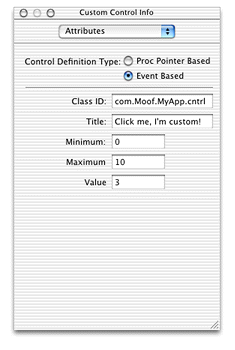

If your control requires a title, you can set that in this panel. (Doing so is the same as calling the function `SetControlTitle`; your application can obtain the title by calling `GetControlTitle`). If your control has minimum, maximum, and initial control values, you can set these as well. Later, when you call `CreateWindowFromNib` from your application, your custom control is automatically created and placed within the window.

If you want to create your custom control within your application, you use the `CreateCustomControl` function as shown in [Listing 3-24](#apple-f4xwc4dqnrsv64tfmyxwi33df52wszbpkridgmbqgaytambufvbuqmrqgywueq2jjjbuircj).

__Listing 2-24__  Creating controls using CreateCustomControl

```
ToolboxObjectClassRef customControl;
ControlDefSpec myCustomControlSpec;

WindowRef theWindow;
ControlRef myControl;

Rect controlBounds = {100, 100, 200, 300};

myCustomControlSpec.defType = kControlDefObjectClass;// 1
myCustomControlSpec.u.classRef = customControl;

CreateCustomControl (theWindow, &controlBounds, &myCustomControlSpec,// 2
                        NULL, &myControl);
```

Here is what the code does:

1. The `CreateCustomControl` function requires you to pass a control definition specification structure to describe the type of control definition you want to use. This structure is analogous to the `WindowDefSpec` structure used in `CreateCustomWindow`. In this case, you set the `defType` field to `kControlDefObjectClass` to indicate an event-based toolbox object class. Then you set the `classRef` field of the union to specify the class reference you obtained from calling `RegisterToolboxObjectClass`.
2. When calling `CreateCustomControl`, you pass

   - the reference of the window to contain the control (`theWindow`).
   - the bounds of the control, in the window’s local coordinates (`controlBounds`).
   - the control definition specification structure (`myCustomControlSpec`).
   - any specialized data to associate with the control. In this example you pass `NULL` to indicate no data.

   On return, `myControl` contains a reference to the newly-created control.

After you create the control, you still need to embed it within a root control or other control by calling `EmbedControl` or `AutoEmbedControl`.

HIObject is a common base class for all user interface objects. That is, for Mac OS X version 10.2 and later, all menus, windows, controls, toolbars, and so on, are subclasses of HIObject.

Essentially the HIObject model brings an object-oriented approach to the Mac OS Human Interface Toolbox, where the HIObject is the data store (instance) and the Carbon event handlers are the methods.

Use of HIObject is entirely optional. Windows, controls (views), menus and so on are built on top of the HIObject base class, but you can continue to use the various toolbox managers to manipulate them. However, HIObjects make it easy to create custom objects as you can simply subclass them from the standard classes.

HIView is an object-oriented view system subclassed from HIObject. All controls are implemented as HIView objects ("views"). You can easily subclass HIView classes, making it easy to implement custom controls. Over time the HIView API will replace the current Control Manager.

Using the HIView model, every item within a window is a view: the root control, controls, and even the standard window "widgets" (close, zoom, and minimize buttons, resize control, and so on).

Current Control Manager function calls are layered on top of this HIView model and will be supported for the foreseeable future.

Additional benefits of the new HIView model include the following:

- Quartz is the native drawing system, but you can still use QuickDraw if desired.
- Modern coordinate system not bounded by the 16-bit space of QuickDraw. Floating point coordinates are valid.
- Simplified coordinate system for view bounds and the position of a view within its parent.
- Views can be ordered within a hierarchy layer; that is, it is easy to place controls in front or behind other controls.
- Views can be easily attached and detached from windows. You can even retain a view separate from an owning window if desired.

For more details, see the separate HIObject and HIView documentation grouped under HIToolbox on the Carbon Developer documentation site.

[Next](Carbon%20Events%20Versus%20Classic%20DefProc%20Messages.md)[Previous](Window%20and%20Control%20Concepts.md)

