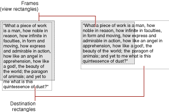
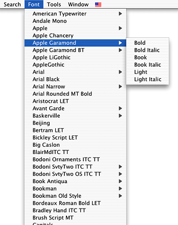
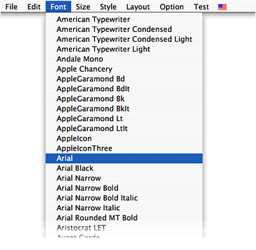
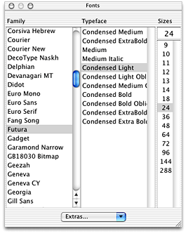
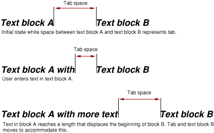
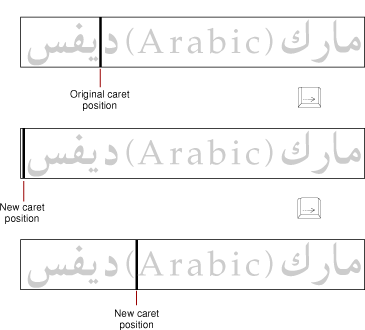
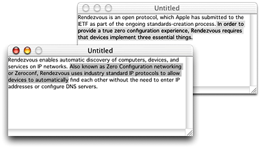
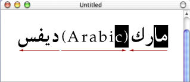

> 导航：[总目录](../../../README.md) · [documentation](../../../_indexes/documentation.md) · [Handling Unicode Text Editing With MLTE](MLTE%20Introduction.md)

[Next](MLTE%20Tasks.md)[Previous](MLTE%20Introduction.md)

# MLTE Concepts

This chapter provides an overview of Macintosh text handling and how MLTE in particular handles Unicode text editing. If you are new to text handling on the Macintosh, you should read the entire chapter. If you have already worked with international text on the Mac OS and are familiar with text handling, you can skip the first two sections and go to [How MLTE Handles Text](#apple-f4xwc4dqnrsv64tfmyxwi33df52wszbpkridgmbqgaydsobtfvkfamzqgaydambyg4wueqkkjfbeqrke).

This chapter covers concepts rather than implementation or programming details. For information about using MLTE functions in your application, and to see sample code, see [MLTE Tasks](MLTE%20Tasks.md#apple-f4xwc4dqnrsv64tfmyxwi33df52wszbpkridgmbqgaydsobtfvkfamzqgaydambyhawueq2jireesrsi).

This section defines the terms used to discuss international text handling on the Mac OS. If you would like a more detailed introduction to typography on the Mac OS as well as more information on Unicode and related topics, see _[ATSUI Programming Guide](../ATSUI%20Programming%20Guide/Introduction%20to%20ATSUI%20Programming%20Guide.md#apple-f4xwc4dqnrsv64tfmyxwi33df52wszbpkridgmbqgaydsobu)_.

A _character_ is a symbolic representation of a letter, a number, a punctuation mark, or any other mark used in text; it is the concept of, for example, “lowercase a” or “number 3.”

In computer memory, text is stored as _character codes_, where each code is a numeric value that defines a particular character. A _character encoding_ is the organization of the set of numeric codes that represent all the meaningful characters of a _script system_ in memory. There are two fundamental classes of Mac OS character encodings: single-byte and double-byte.

A _writing system_is a set of characters and the basic rules for using them to create a visual depiction of language. Examples of writing systems are Roman, Japanese, Arabic, and Hebrew. _Unicode_is an international standard that combines the characters for all commonly used writing systems into a single, coded character set, based upon a 16-bit character encoding standard. With a universal character encoding such as Unicode, the character sets of separate writing systems do not overlap. Furthermore, Unicode resolves the issue of conflicting character encodings within a single writing system.

The user typically enters text through a keyboard that your application then stores as character codes. The system reports the user’s key-down, key-up, and auto-key events to your application. _Key-down_ and _key-up events_ indicate the user pressed or released a key, respectively. _Auto-key events_ indicate the user has held a key down for a certain amount of time. For keyboard-related events, your application receives both the virtual key code and the character code for the key that is pressed, as well as the state of any _modifier keys_(For example, Shift, Caps Lock, Command, Option, and Control) at the time of the event.

For languages with large character sets, it is impractical to manufacture keyboards with keys for every possible character. In such a case, it is usually the job of an input method, working in conjunction with a keyboard, to handle text input. An _input method_ is a software module, often independent of the application it serves, that performs complex processing of text input, prior to the application’s processing of the text. A typical example of an input method is a translation service that converts character codes that can be entered from the keyboard into character codes that cannot; text input in Japanese, Chinese, and Korean usually requires an input method.

An application with simple text editing capabilities has to do several tasks. First of all, the application must get text input from the user. The application must be prepared to convert character sets in the event a user pastes text from a document created on another platform, the Internet, or from any document that uses a character set different from that of the application’s default _script_.

As the user enters text, the text must be manipulated and stored. _Text manipulation_ refers to system-level procedures used to sort and compare characters, determine line breaks, determine _text directionality_, and keep track of character properties, such as case. Calculating line breaks is a difficult text manipulation task for scripts that do not delineate words with spaces, such as the Thai script. _Display order_ is complicated for scripts that are _bidirectional_, such as Hebrew. For example, in Hebrew, words are displayed right-to-left while Roman numerals are displayed left-to-right.

Characters are stored as codes to facilitate searching and other text manipulation tasks. Before text can be displayed, characters must be rendered. _Character rendering_ is the process of properly preparing the characters for display, taking into account _line direction_, contextual rules, and character reordering. For example, the formation of _ligatures_ and _diphthongs_ occurs during the display of text.

Once text is displayed, an application needs to provide ways for the user to edit the text. The user may want to change the font, add or delete text, or change _font attributes_ such as size, color, and _style_. Users may also want to align text, set tabs, or change other attributes that affect text layout.

When you use MLTE, your application does not need to contain all the code necessary to handle text. It can rely on MLTE and other Mac OS text technologies to do most of the grunt work for you. This section describes what tasks MLTE and other Mac OS text technologies handle for you, and what tasks your application needs to handle. If all your application needs to do is to display static text in a text box, you can skip this section and go to [Displaying Static Text](MLTE%20Tasks.md#apple-f4xwc4dqnrsv64tfmyxwi33df52wszbpkridgmbqgaydsobtfvkfamzqgaydambyhawueq2jijeuoqkj). You need only to use one of two MLTE functions to display static text.

MLTE supports standard text input from a keyboard. Once your application creates an MLTE document and associates the document with a window, anything your user types is displayed in the window. Your user may type on any keyboard layout using any script currently supported on the Mac OS. MLTE automatically supports _inline input_ for Chinese, Japanese, Korean, other double-byte scripts, and Unicode text.

When your application calls the MLTE initialization function `TXNInitTextension`, MLTE enables the _Text Services Manager_ automatically. The Text Services Manager (TSM) is the part of the Mac OS that provides an environment for applications to use input methods that support text entry for languages such as Chinese, Japanese, and Korean. 

In Mac OS X, once you initialize MLTE, you do not need to do anything else to assure support for text input. Behind the scenes, MLTE calls TSM functions as needed, and TSM passes text input directly to an active MLTE document.

By default, MLTE stores text as Unicode. If a user enters text in an encoding other than Unicode, MLTE calls the appropriate _Text Encoding Conversion (TEC) Manager_ functions to convert the text to Unicode. You do not need to call the TEC Manager functions directly.

MLTE uses _Apple Type Services for Unicode Imaging (ATSUI)_and QuickDraw Text functions to render and draw text. ATSUI handles complex scripts, supports bidirectional text, and implements a number of other advanced typographical features. 

Your application does not need to call any ATSUI functions directly; MLTE does it for you. However, if you want to display and support editing text that uses advanced typographic features, such as ligatures or diphthongs, your application must supply ATSUI information to MLTE functions. For example, if you want MLTE to display text using a specific rare ligature, your application needs to pass an ATSUI constant to specify the ligature. ATSUI constants are defined in the reference documentation for ATSUI. The section [Displaying Static Text](MLTE%20Tasks.md#apple-f4xwc4dqnrsv64tfmyxwi33df52wszbpkridgmbqgaydsobtfvkfamzqgaydambyhawueq2jijeuoqkj) indicates the functions for which ATSUI constants may be used.

MLTE has a variety of functions your application can use to make changes that affect an entire MLTE document or to change text attributes. For example, when a user changes the style of a selection, your application must call the appropriate MLTE function to set the style attributes for the selection.

Your application must provide the appropriate user feedback when the user takes any actions that affect what is displayed in any text-related menus, such as the Edit and Format menus. For example, if the user changes the justification for a selection, you application must call the appropriate Menu Manager function to display a check mark next to the appropriate item in the Format menu that applies to the selection.

There are a number of user actions that MLTE handles automatically for your application, such as highlighting selected text, dragging selected text, and moving the _caret_ in response to arrow key presses.

MLTE supports onscreen text editing by maintaining information about where the text is stored, where to display it, and the text attributes (style, font, and so forth). This information is contained in an opaque structure called a `TXNObject`, or _text object_. From the user’s perspective, a text object could take many forms. For example, if your application is a simple text editor, a user views the text object as a document that can be saved, opened, and edited. If your application is a drawing program that uses MLTE for labeling support, the user views a text object as a label or caption associated with a graphic object. If your application is a natural-language query program that uses MLTE for query input, a user views the text object as an input window.

When your application calls the MLTE function `TXNNewObject` to create a text object, you specify the window in which the text is to be drawn. The window defines the _destination rectangle_—the area in which the text is drawn. You also have the option to specify the frame. The _frame_ is that portion of the window within which the text is actually displayed. It is sometimes referred to as the _view rectangle_.

Figure 2-1 shows two sets of frames and destination rectangles. The frames are shaded and defined by dotted lines. The text is drawn in the destination rectangle; the part of it that is displayed is defined by the frame.

__Figure 1-1__  Frames and destination rectangles

A `TXNObject` is an opaque structure, so your application cannot access it directly and the MLTE reference documentation does not define explicitly the fields in the `TXNObject`. A `TXNObject` contains references to the window frame and

- the text associated with the text object
- the options you want the frame to support, such as scroll bars and a size box
- the file type of the text object, such as plain text or RTF, and whether the text can contain graphics, movie, and sound data
- the _text encoding_ to use; Unicode is the default
- the attributes of the text associated with the text object
- information about the layout of the text object

MLTE provides a number of functions that operate on the text object for you, allowing you to get and set attributes of the entire text object or of runs of text associated with the object.

When the MLTE function `TXNNewObject` creates a text object, MLTE creates other structures that maintain information about the styles and attributes of the text associated with a text object.

MLTE keeps track of character attributes as runs. A _run_ is a sequence of characters that are contiguous in memory and share a set of common attributes.

MLTE has two functions your application can use to get or set text attributes. Attributes are passed to and from these functions in a type attributes structure. This structure supports your application’s use of ATSUI font features and font variations, should you want to use them.

A _font feature_ is the set of typographic and layout characteristics that creates a specific appearance for a glyph. For example, displaying text as small caps is a font feature. A _font variation_is a range of typestyles along a _variation axis_. For example, a “width” font variation allows your application to condense or expand a line of displayed text. If you want to get or set such ASTUI font features or variations, your application can pass ATSUI font features or variations information in the type attributes structure. See [Accessing and Displaying Advanced Typographical Features](MLTE%20Tasks.md#apple-f4xwc4dqnrsv64tfmyxwi33df52wszbpkridgmbqgaydsobtfvkfamzqgaydambyhawueq2jijeuersg) for an example of how to get ATSUI font features.

MLTE functions follow Mac OS user interface guidelines, so using these functions ensures the presentation of a consistent user interface in your application.

Although MLTE does not handle any menu except for the Font menu, it provides applications with all the necessary functionality and information to support the standard text editing menus as specified in _Apple Human Interface Guidelines_. MLTE supports the Undo, Redo, Cut, Copy, Paste, Clear, and Select All items in the Edit menu, but does not support Publish and Subscribe.

MLTE supports undo for the Cut, Copy, Paste, and Clear commands as well as applying a font, size, or style to a non empty selection. However, applying a font, size, or style to an insertion point cannot be undone. Undo cannot be applied to a Select All command because Select All is a selection operation.

An uninterrupted sequence of keystrokes, whether done as standard input on a keyboard or as inline input using an input method, is treated as a single typing command for purposes of the Undo command. Events that interrupt a typing sequence include selection operations (except for those handled by input methods), deactivating a window, printing, or any undoable command other than typing.

Because MLTE supports both QuickDraw Text and ATSUI without requiring your application to know which is being used, MLTE provides utility functions for creating and handling a standard Font menu (where standard is defined as what is most appropriate for the imaging system in use).

MLTE provides an opaque structure called `TXNFontMenuObject` and the functions `TXNNewFontMenuObject` and `TXNDoFontMenuSelection` that you can use to build a Font menu and handle user interaction with the Font menu. If you prefer to have your application build its own Font menu, you can do so. But if you use the MLTE Font menu functions you’ll have fewer lines of code to write.

When your application uses MLTE on a system that has ATSUI (which is the default), the Font menu automatically includes hierarchical submenus for ATSUI fonts that share a family name but have different style names. MLTE draws each Font menu item in a single system font. [Figure 2-2](#apple-f4xwc4dqnrsv64tfmyxwi33df52wszbpkridgmbqgaydsobtfvkfamzqgaydambyg4wueqkkivbusqsd) shows an MLTE Font menu drawn in Mac OS X using ATSUI.

__Figure 1-2__  Font menu on a system that uses ATSUI

An MLTE Font menu on a system that uses only QuickDraw Text looks similar to a menu created by calling the Menu Manager function `AppendResMenu`, as shown in Figure 2-3.

__Figure 1-3__  A Font menu drawn in Mac OS X using QuickDraw

Prior to Mac OS X version 10.1, the Font menu was the only Font interface available to Carbon applications. With the release of Mac OS X version 10.2, Carbon applications can provide a Fonts window, as shown in Figure 2-4. The Fonts window is the preferred user interface for applications that run only in Mac OS X. The columns in the Fonts window improve the viewing and selection of large collections of fonts compared to the hierarchical Font menu shown in [Figure 2-2](#apple-f4xwc4dqnrsv64tfmyxwi33df52wszbpkridgmbqgaydsobtfvkfamzqgaydambyg4wueqkkivbusqsd). The columns provide easy access for users to select font, style, and size.

__Figure 1-4__  The Fonts window

MLTE does not handle the Fonts window for you. If you choose to use a Fonts window in your application, your application must perform the following tasks:

- show and hide the Fonts window
- handle a selection event in the Fonts window
- programmatically set a selection in the Fonts window
- handle a change of user focus from one document to another

For more information and programming examples on supporting a Fonts window in your application, see _[Apple Type Services for Fonts Programming Guide](../Apple%20Type%20Services%20for%20Fonts%20Programming%20Guide/Apple%20Type%20Services%20for%20Fonts%20Programming%20Guide.md#apple-f4xwc4dqnrsv64tfmyxwi33df52wszbpkridgmbqgaydsobr)_.

Tab settings and text _alignment_ are characteristics that apply to an entire text object.

MLTE interprets tab characters based on the one-tab-per-document standard found in many simple text editors. Each tab character maps to an initial width. As MLTE flows text onto a line, each tab is replaced by the width value necessary to place the start of the text following the tab at a given position on the line. As the text placed before the tab grows, the white space appears to shrink until the preceding text becomes long enough to envelop the entire tab. At that point, the tab assumes its full width and the text following the tab jumps ahead. Figure 2-5 illustrates this point.

__Figure 1-5__  Text entry and tab behavior

MLTE flows tab widths in the line direction for the line being formatted. If text is wrapped automatically and a tab width extends past the trailing margin (the right margin on a Roman system), MLTE wraps the line and the next visual line begins with the tab width.

MLTE allows you to specify the alignment of the lines of text, that is, their horizontal placement with respect to the left and right edges of the _text area_ or _destination rectangle_. The different types of alignment that MLTE supports accommodate script systems that are read from right to left as well as those that are read from left to right. MLTE supports the following types of alignment:

- Default alignment—MLTE positions text according to the line direction of the _system script_. The alignment can be either left or right. Line direction is the direction in which text in a particular language is written and read. The English language has a left-to-right line direction. Arabic and Hebrew have a primarily right-to-left line direction.
- Center alignment—MLTE positions text so it is centered between the right and left edges of the destination rectangle.
- Right alignment—MLTE positions text so it is flush with the right edge of the destination rectangle.
- Left alignment—MLTE positions text so it is flush with the left edge of the destination rectangle.
- Full _justification_—MLTE positions text so it is flush against both right and left edges of the destination rectangle.

MLTE assumes that your application filters out all characters it wants to handle. MLTE uses the following list of rules to process the characters it handles. (Unicode encodings are designated as Uxxx and Mac OS encodings are designated as $xxx, where xxx is replaced by a value.)

- Inserting: All single-byte and double-byte characters starting at ($20, U0020) except Forward Delete ($7F, U007F) are inserted into the text. Return ($0D, U000D) and the Tab character ($09, U0009) are inserted. Characters entered through inline input are always inserted.
- Selecting: All combinations involving the arrow keys ($1C–$1F, U001C–U001F) are interpreted as selection operations (see [The Selection Range, the Insertion Point, and Highlighting in MLTE](#apple-f4xwc4dqnrsv64tfmyxwi33df52wszbpkridgmbqgaydsobtfvkfamzqgaydambyg4wueqkkjfeecrsg)). Other than as specified in _Apple Human Interface Guidelines_, they do interrupt typing commands in MLTE.
- Scrolling: The Home ($01, U0001) and End ($04, U0004) characters are interpreted to scroll the text block to its logical beginning or end as specified in _Apple Human Interface Guidelines_.
- Paging: The Page Up ($0B, U000B) and Page Down ($0C, U000C) characters are interpreted to scroll the text up or down once according to the height of the currently visible portion. They are not part of typing commands, but they also don’t interrupt typing commands.
- Deleting: The Backspace ($08,U0008) and Forward Delete ($7F, U007F) characters first delete the currently selected text (if the selection is nonempty), then delete individual characters logically preceding (Backspace) or following (Forward Delete) the insertion point . They are part of typing commands.
- All other characters are ignored. This includes all key combinations involving the Command key but not involving the arrow keys. They are not part of typing commands, but do not interrupt the typing commands.

MLTE uses a caret to mark the position in the displayed text where the next editing operation is to occur. When your application uses MLTE to paste text into a text object, MLTE positions a caret after the pasted text. For _unidirectional text_, when the user presses an arrow key to move the caret left or right across the text, MLTE moves the caret in the direction of the arrow key. If the document contains _embedded objects_—graphics, movie, or sound data embedded in text—the caret treats the embedded object as a single character.

For bidirectional text, the _caret position_ at a direction run boundary depends on the direction of the _keyboard script_; _split carets_ are not supported. Figure 2-6 shows a sequence of two Right Arrow key presses and their impact on caret display and movement in a line containing bidirectional text. In this example, the _primary line direction_ is right to left.

__Figure 1-6__  Caret movement across a direction boundary

In the first instance of the _text segment_, the caret is positioned within the Arabic text. When the user presses the Right Arrow key once, the insertion point is positioned on a _direction boundary_ and the caret jumps to the left side of the Arabic text. When the user presses the Right Arrow key again, MLTE displays the caret at the right side of the left parenthesis in the Roman text.

For read-only documents, you can choose among three behaviors for your application. The first behavior is to display a blinking caret and allow selection and copying of text. The second behavior is not to display a caret or allow text to be selected. This is the model used by SimpleText for read-only documents. The third behavior is to display a non-blinking caret and allow selection and copying of text.

Horizontal arrow keys move in a direction dependent on the line direction of the text. The arrow key moving in the line direction (right for Roman) starts at the trailing edge of the highlight region in the last line of the selection and simulates successive clicks at each character boundary moving in the line direction until it hits the trailing edge of the visual line. At that point, selection wraps to the leading edge of the next visual line. The character boundaries are determined by the _storage order_ and not the _display order_.

The arrow key moving against the line direction (left for Roman) starts at the leading edge of the highlight region in the first line of the selection and simulates successive clicks at each character boundary moving against the line direction until it hits the leading edge of the visual line, then wraps to the trailing edge of the previous visual line.

For the horizontal arrow keys, a ligature that does not allow for an insertion point between its constituting characters is treated as one character. Combining the Option key with a horizontal arrow key simulates clicks at word boundaries instead of character boundaries. Combining the Command key with a horizontal arrow key in or against the line direction simulates clicks at the trailing edge or leading edge of the last line or first line intersecting with the selection, respectively.

When the user presses the Up Arrow key, the caret moves up one line, even in lines of text containing fonts of different sizes. When the caret is positioned on the first line of a _text object_, and the user presses the Up Arrow key, MLTE moves the caret to the beginning of the text on that line. This position corresponds to the visible right end of a line when the primary line direction is right to left and to the left end of the line when the primary line direction is left to right.

Similarly, when the user presses the Down Arrow key, the caret moves down one line. When the caret is positioned on the last line of a text object, and the user presses the Down Arrow key, MLTE moves the caret to the end of the text on that line. That is, the caret moves to the visible left end of a line when the primary line direction is right to left and to the right end of a line when the primary line direction is left to right.

Combining the Option key with an Up Arrow or Down Arrow key simulates a click at the corresponding edge of the portion of the view shown in the window, paging the view first if the active selection was already at that edge. The starting point for a selection is determined at the beginning of an uninterrupted sequence of Up Arrow and Down Arrow keys.

A user can select a range of text to be edited or your application can set the _selection range_ programmatically. A user can define a selection by creating a new one or modifying the current one. A new selection is defined by the Select All command, by mouse actions (single-, double-, or triple-clicking or dragging), or by using the arrow keys along with the Shift key (which could be combined with the Command or Option keys). A selection can be modified by pressing the Shift key and performing a mouse-based or arrow key–based selection action. MLTE interprets user actions to modify a selection according to the fixed-point model described in the _Apple Human Interface Guidelines_.

The _anchor point_is the position in the text at which the user positions the pointer and presses the mouse button. When visual feedback shows the desired range, the user releases the mouse button. The point at which the button is released is called the _active end_of the range. The user can expand or shrink the active selection by performing a modifying action such as pressing and holding the Shift key while pressing an arrow key. If necessary, the text scrolls to make a selection visible in the view rectangle. See _Apple Human Interface Guidelines_ for more details, including illustrations, on selection behavior.

Single-clicking defines an insertion point. Double-clicking selects a word as defined by the Script Manager or ATSUI. Triple-clicking selects a visual line from the beginning of the line to the beginning of the next line. Quadruple-clicking selects the paragraph. If the user performs a double, triple, or quadruple click, then drags, the selection grows by words, visual lines, or paragraphs respectively. A click in an empty space is mapped to some location that has text.

Regardless of how text is selected, the selected text becomes the current selection range. MLTE uses a _byte offset_to identify the position of a character in the text object, and a text object includes fields that specify the byte offsets of the characters that correspond to the beginning and the end of the current selection range in the displayed text. A graphics, movie, or sound object embedded in a text object is treated as a single character.

When the byte offset values for the beginning and the end of the selection range are the same, the selection range is an insertion point. MLTE displays an insertion point as a blinking caret in the form of a vertical bar (|). You can turn caret display on or off by setting the appropriate frame option when you create a new text object in MLTE.

MLTE highlights a selection range. Highlight regions for nonempty selections are drawn in the system highlight color, while carets are drawn in black. MLTE modifies the highlighting as shown in Figure 2-7 for selected text in an inactive window, as required by the Drag Manager.

__Figure 1-7__  Highlighted text selection in background window

Because MLTE supports bidirectional text, the selection range can appear as _discontinuously highlighted_ as shown in Figure 2-8. Displayed text is highlighted according to the storage order of the characters. When multiple script systems with different line directions are installed, a continuous sequence of characters in memory may appear as a discontinuous selection when displayed.

__Figure 1-8__  Discontinuous highlighting

MLTE provides the drag and drop user experience as specified in the _Apple Human Interface Guidelines_. MLTE highlights selections in inactive views, so that users can drag between active and inactive views. If the cursor is over the highlighted region in an active view, the cursor changes to an arrow. MLTE automatically distinguishes between selection operations and drag-and-drop operations, and MLTE provides user feedback. If the mouse-down event occurs within the highlighted region of the current selection and the Drag Manager is available, then MLTE waits to see whether the mouse is dragged. If the mouse is dragged, MLTE initiates a drag–and–drop operation. Otherwise, MLTE interprets the mouse event as a selection operation.

Because MLTE has no contextual information, it cannot provide your application feedback about the destination of the dragged text. However, it highlights the insertion point where dropped text gets inserted, performs the actual move, and selects the dragged text in its new location. By default, MLTE recognizes dragging as a move operation. The user can drag a copy by pressing the Option key.

MLTE renders text into a single rectangular frame. You can choose to have your application create arbitrarily wide lines or break lines at a certain width. If you choose to break lines, MLTE uses ATSUI line-breaking algorithms to control where a line breaks. Text is flowed into a visual line as long as it fits, then a new line is started with the first unbreakable unit (such as a word) that did not fit completely in the line.

If your application turns off ATSUI (this is not recommended), MLTE uses QuickDraw Text line–breaking algorithms. In this case, in scripts that use space characters to separate words, one (and only one) space character at the logical end of the text flowed into a visual line is consumed by the line break—it is ignored for measurements and not displayed.

Your application can pass ATSUI features and variations to MLTE functions and have them applied to a selection. This, like building the Font menu, requires your application to be aware that it is running on a system that has ATSUI, and further requires you to use some of the moderately complicated ATSUI functions.

MLTE does not provide a human interface that allows a user to view and select font variations and features on a per font basis. However, your application can create a user interface that displays font variation and font features. Then you can use MLTE functions to get and set font features and font variations in response to items your user changes in the interface your application creates. See [Accessing and Displaying Advanced Typographical Features](MLTE%20Tasks.md#apple-f4xwc4dqnrsv64tfmyxwi33df52wszbpkridgmbqgaydsobtfvkfamzqgaydambyhawueq2jijeuersg) for information on how your application could provide this capability.

_Keyboard and font synchronization_ is a process by which the operating system compares the current keyboard script to the script of the font at the current insertion point. If the two do not match, one or the other is changed so the two scripts are the same.

In a multiscript environment, the operating system should display text in a font that supports the character set in which the text is written. In the _WorldScript_ environment, the operating system typically monitors the current keyboard script and compares it to the script of the font at the current insertion point. If the two scripts do not match and the user starts typing, the operating system automatically replaces the font with one that belongs to the keyboard script.

This behavior is not always appropriate, as there is not a one-to-one correspondence between fonts and keyboards. Typically, non-Roman keyboard layouts support only the characters that are specific to that script, not the ASCII characters that are supported by all fonts designed for the WorldScript environment.

Despite these drawbacks, MLTE by default attempts to synchronize the font to the keyboard when the user changes the keyboard. To find the appropriate font, MLTE first searches backwards in the document for an appropriate font, then forward. If it does not find an appropriate font, the _application font_ or the _system font_ for the keyboard script is used. Font synchronization does not interrupt typing commands.

Some text editors also support synchronization in the opposite direction: They automatically switch the keyboard script to the script of the font being used at the current selection. For example, this could happen when the user changes the selection. The assumption is that the user is most likely to type additional text in the script already being used for the current selection. Also, the location of the caret in bidirectional text may depend on the direction of the keyboard script. In this context, it is important that the direction of the keyboard script matches the direction of text in which the user clicks.

In double-byte scripts, the issue of caret placement does not exist, so input methods often allow users to enter ASCII characters in a _pass-through mode_. Switching the keyboard is not necessary. Users of single-byte scripts can enter ASCII characters only by switching to a _Roman keyboard script_.

MLTE supports font to keyboard synchronization by default. You can turn off keyboard synchronization by using the `kTXNNoKeyboardSyncMask`constant when you set the `iFrameOptions` parameter in the function `TXNNewObject`.

A user can override the behavior by pressing and holding the Control key while changing the font. In this case, the text changes to the selected font no matter what characters are selected. Each character that is not supported by the new font will be represented by a _missing character glyph_(such as an empty rectangle). To represent missing glyphs with a character that resembles the missing one more closely, you can turn on [Font Substitution](#apple-f4xwc4dqnrsv64tfmyxwi33df52wszbpkridgmbqgaydsobtfvkfamzqgaydambyg4wueqkkivbugqkj).

There may be situations in which MLTE cannot draw a character with the assigned font because the font is not installed on the user's system. If you set font substitution options, MLTE will use the transient font matching function supplied by ATSUI. The transient font matching function scans all valid fonts on the user's system until it finds a suitable substitute font. If you do not set this bit, missing character glyphs are used to represent unavailable characters.

You can use the font fallback mask `kTXNUseFontFallBackMask` to set fallback options for static text display. If you want to use font substitution for a text object, you can use the font substitution tag `kTXNDoFontSubstitution`. See _Multilingual Text Engine Reference_ for more information on these constants.

Prior to the release of Mac OS X version 10.1, MLTE used the Apple Event Manager to handle text input. Beginning with Mac OS X version 10.1, MLTE uses the Carbon Event Manager instead. Because MLTE uses Carbon events, you have less code to write, as MLTE handles most Carbon events without your intervention. If you prefer to handle some of the Carbon events MLTE now handles, you can. You can install Carbon event handlers on top of MLTE’s handlers, as long as you are careful to call the Carbon Event Manager function `CallNextEventHandler` or return `eventNotHandledErr` if the event should be passed to MLTE for handling. For further details, see [Customizing MLTE Support for Carbon Events](MLTE%20Tasks.md#apple-f4xwc4dqnrsv64tfmyxwi33df52wszbpkridgmbqgaydsobtfvkfamzqgaydambyhawueqsdireukqsc).

[Next](MLTE%20Tasks.md)[Previous](MLTE%20Introduction.md)

