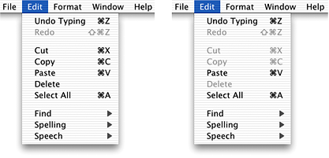
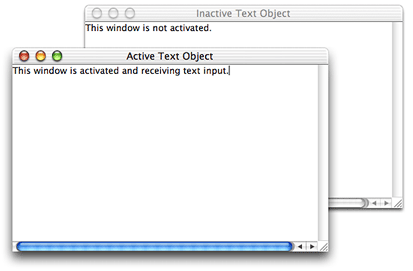
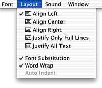
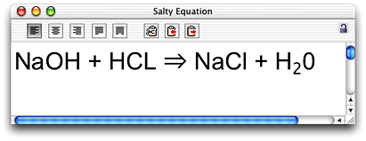
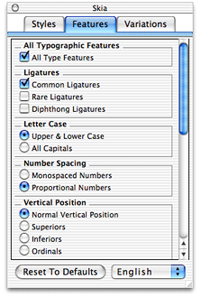
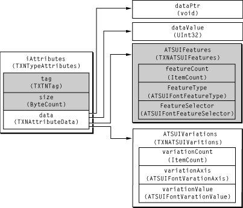

> 导航：[总目录](../../../README.md) · [documentation](../../../_indexes/documentation.md) · [Handling Unicode Text Editing With MLTE](MLTE%20Introduction.md)


[Next](Document%20Revision%20History.md)[Previous](MLTE%20Concepts.md)

# MLTE Tasks

This chapter provides instructions and code samples for the most common tasks you can accomplish with Multilingual Text Engine (MLTE), such as displaying static text, working with document-wide settings, and handling File, Edit, and Font menu commands.

The section on advanced topics includes working with embedded objects (graphics, sound, movies), displaying chemical equations, and displaying advanced typographical features (such as ligatures).

You should read the section [Migrating an Application from TextEdit to MLTE](#apple-f4xwc4dqnrsv64tfmyxwi33df52wszbpkridgmbqgaydsobtfvkfamzqgaydambyhawueq2jizbuosse) if you have an existing application that uses TextEdit, and you want to determine what you need to do to rewrite the code so your application uses MLTE instead.

The code samples assume you are developing your application on Mac OS using CarbonLib. All code samples in this chapter are in C.

MLTE provides an easy way for your application to display static text whether or not it uses other MLTE features to implement editing services. You do not need to initialize MLTE to display static text. You can use a static text box for such purposes as displaying text information associated with a control.

The `TXNDrawUnicodeTextBox` and `TXNDrawCFStringTextBox` functions display text that a user cannot edit. You use the `TXNDrawUnicodeTextBox` function when you want to display a Unicode string and the `TXNDrawCFStringTextBox` function when you want to display a `CFString`object. Each function draws the text in a rectangle whose size you specify in the local coordinates of the current graphics port.

MLTE uses the ATSUI style you specify to display the text or creates an ATSUI style based on the style associated with the current graphics port. You can specify a number of other options, such as text orientation (horizontal or vertical) and text alignment (right, left, centered, or fully justified).

Listing 3-1 shows how to use the `TXNDrawCFStringTextBox` function to display a static string. The `TXNDrawCFStringTextBox` function draws into the current graphics port. An explanation for each numbered line of code appears following the listing.

__Listing 2-1__  Displaying static text in a text box


```
static void MyDrawStaticText (CFStringRef stringToDisplay,
                            WindowRef theWindow)
{
    Rect            bounds;
    GrafPtr         myOldPort;

    GetPort (&myOldPort);// 1
    SetPortWindowPort (theWindow);    // 2
    EraseRect (GetWindowPortBounds (theWindow, &bounds));// 3
    TXNDrawCFStringTextBox (stringToDisplay, &bounds, NULL, NULL);// 4
    SetPort (myOldPort);// 5
}
```

Here’s what the code does:

1. Call the QuickDraw function `GetPort` to save the current graphics port. You’ll need to restore this later.
2. Calls the QuickDraw function `SetPortWindowPort` to set the graphics port to the window port.
3. Calls the QuickDraw function `EraseRect` to make sure the rectangle in which you will draw is empty.
4. Calls the MLTE function `TXNDrawCFStringTextBox` to draw the `CFString` passed to the function.
5. Restores the graphics port by calling the function `SetPort`.

You need to initialize MLTE before you can use any MLTE function except the two functions that display static text—`TXNDrawUnicodeTextBox` and `TXNDrawCFStringTextBox`. You should initialize MLTE at the same time you call other initialization functions for your application.

At the very least, to use MLTE your application must call the MLTE initialization function `TXNInitTextension`. On a more practical level, most applications need to provide users with a Font menu or Fonts window. So your application should also set up the menu bar and the Font user interface in addition to calling the MLTE initialization function `TXNInitTextension`. To set up your application to use MLTE functions and provide users with a Font menu you need to perform the tasks described in this section.

When you call the MLTE initialization function `TXNInitTextension`, you pass an array of _font descriptions_, which are structures of type `TXNMacOSPreferredFontDescription`. Each font description specifies the _font family_ ID, point size, style, and encoding. The array can be `NULL` or can have an entry for any encoding for which you would like to designate a default font. You can use the MLTE constants `kTXNDefaultFontName`, `kTXNDefaultFontStyle`, and `kTXNDefaultFontSize` as the font family ID, point size, and style values for a font description. You can supply an encoding of type `TextEncoding`, created using the function `CreateTextEncoding`. See [Listing 3-2](#apple-f4xwc4dqnrsv64tfmyxwi33df52wszbpkridgmbqgaydsobtfvkfamzqgaydambyhawueq2ji5cusrkb) for an example of assigning font default values to a single font description.

You can specify whether MLTE should support data types other than text, such as graphics, movies, and sound, in your application. You can specify other data types by using the initialization option masks described in _Inside Mac OS X: MLTE Reference_. See `[Listing 3-2](#apple-f4xwc4dqnrsv64tfmyxwi33df52wszbpkridgmbqgaydsobtfvkfamzqgaydambyhawueq2ji5cusrkb)` for an example of assigning initialization options using the option masks supplied by MLTE.

You initialize MLTE by calling the `TXNInitTextension`function. You need to call this function only once. Calling it more than once returns the result code `kTXNAlreadyInitializedErr` and has no effect. If for some reason you want to initialize MLTE again while your application is running, you must first call the `TXNTerminateTextension`function.

Listing 3-2 shows how you can initialize MLTE using a `MyInitializeMLTE`function. You call the `MyInitializeMLTE` function from your application’s one-time-only initialization function. An detailed explanation for each numbered line of code appears following the listing.

__Listing 2-2__  Initializing MLTE

```
void MyInitializeMLTE (TextEncodingBase myTextEncodingBase)
{
    OSErr status;
    TXNInitOptions options;
    TXNMacOSPreferredFontDescription  defaults; // 1

    status = ATSUFindFontFromName ("Times Roman",
                        strlen("Times Roman"),
                        kFontFullName, kFontNoPlatform,
                        kFontNoScript, kFontNoLanguage,
                        &theFontID);
    defaults.fontID = theFontID;// 2
    defaults.pointSize = kTXNDefaultFontSize; // 3
    defaults.fontStyle = kTXNDefaultFontStyle;// 4
    defaults.encoding  = CreateTextEncoding (myTextEncodingBase,
                            kTextEncodingDefaultVariant,
                            kTextEncodingDefaultFormat);// 5

    options = kTXNWantMoviesMask | kTXNWantSoundMask |
                                         kTXNWantGraphicsMask;// 6

    status = TXNInitTextension (&defaults, 1, options); // 7
    if (status != noErr)
        MyAlertUser (eNoInitialization);// 8
}
```

Here’s what the code does:

1. Declares a data structure to hold the default font values.
2. Sets Times Roman as the default font by calling the ATSUI function `ATSUFindFontFromName` to obtain the font ID associated with the font name. If you don’t need to assign a particular font you can assign the default system font using the following line of code:

```
defaults.fontID    = kTXNDefaultFontName;
```
3. Assigns the default font size.
4. Assigns the default font style.
5. Assigns the default text encoding. The encoding must be a `TextEncoding` data type, created by calling the Text Encoding Manger function `CreateTextEncoding`. The sample function `MyInitializeMLTE` uses the `TextEncodingBase` passed to the function. You would either need to determine the current text encoding base or provide one of the Base Text Encoding constants defined in the Text Encoding Conversion Manager.
6. Assigns initialization options. The sample code sets up options to support movies, sound, and graphics embedded in text data.
7. Initializes MLTE by calling the function `TXNInitTextension`. You need to pass an array of font descriptions. In this case, there is only one description in the array. You also need to pass the initialization options.
8. Checks for an error condition, and if there is one, calls your function to handle the error. You can’t use MLTE unless it initializes without error. See [Posting an Alert](#apple-f4xwc4dqnrsv64tfmyxwi33df52wszbpkridgmbqgaydsobtfvkfamzqgaydambyhawueqkkjjbukqkk) for information on writing an alert function.

Your application needs to set up menus as part of its initialization function. Once you’ve set up the menu bar, you can use MLTE functions to create a Font menu and handle user interaction with the Font menu.

The `TXNFontMenuObject`structure is an opaque structure that MLTE uses to handle user interaction with the Font menu. You create a Font menu object by calling the `TXNNewFontMenuObject`function. You should create a font menu object at the same time you are preparing to display your menu bar.

When you call the `TXNNewFontMenuObject` function, you must provide the Font menu reference, the menu ID, and the menu ID at which hierarchical menus begin. By default, MLTE creates hierarchical menus similar to what is shown in [Figure 2-2](MLTE%20Concepts.md#apple-f4xwc4dqnrsv64tfmyxwi33df52wszbpkridgmbqgaydsobtfvkfamzqgaydambyg4wueqkkivbusqsd).

Listing 3-3 shows how your application can create a Font menu object. If you want to display a check mark next to the active font in the Font menu the first time a user opens the menu, you must call the function `TXNPrepareFontMenu`. However, you call that function right after you create a text object, as shown in [Listing 3-6](#apple-f4xwc4dqnrsv64tfmyxwi33df52wszbpkridgmbqgaydsobtfvkfamzqgaydambyhawueq2jjfauuqsj).

__Listing 2-3__  Creating a Font menu object


```
 void MySetUpFontMenu (MenuRef myMenuRef, SInt16 myMenuID)
{
    TXNFontMenuObject myFontMenuObject;// 1
    OSStatus  status;

    status = TXNNewFontMenuObject (myMenuRef,
                            myMenuID,
                            kStartHierMenuID,
                            &myFontMenuObject);// 2
    if (status != noErr)
            MyAlertUser (eNoFontMenuObject);// 3
    DrawMenuBar();// 4
   }
```

Here’s what the code does:

1. Declares a `TXNFontMenuObject` data type.
2. Creates a Font menu object by calling the MLTE function `TXNNewFontMenuObject`. You must supply a value greater than 160 that specifies the menu ID at which hierarchical menus begin. The sample code uses a an application-defined constant `kStartHierMenuID`. Note that MLTE creates hierarchical menus automatically on systems that use ATSUI. On output, `&myFontMenuObject` points to a new Font menu object.
3. Checks for an error. If there is one, calls your function to notify the user. See [Posting an Alert](#apple-f4xwc4dqnrsv64tfmyxwi33df52wszbpkridgmbqgaydsobtfvkfamzqgaydambyhawueqkkjjbukqkk) for information on writing an alert function.
4. Displays the menu bar by calling the Menu Manager function `DrawMenuBar`.

You need to call the `TXNTerminateTextension`function when you terminate your application. Listing 3-4 shows how you can terminate MLTE when your application quits. You should first check to make sure all the document windows are closed and the Font menu object is disposed of before you terminate MLTE so that your application quits gracefully. A detailed explanation for each numbered line of code appears following the listing.

__Listing 2-4__  Terminating MLTE in your application’s termination function


```
void MyTerminate (TXNFontMenuObject myFontMenuObject)
{
    WindowPtr       theWindow;
    Boolean         closed;

    closed = true;
    do {
        theWindow = FrontWindow ();             // 1
        if (theWindow != NULL)// 2
            closed = MyDoCloseWindow (theWindow);
    }
    while (closed && (theWindow != NULL));// 3
    if (closed)
    {
        if (myFontMenuObject != NULL) // 4
        {
            OSStatus        status;
            status = TXNDisposeFontMenuObject (myFontMenuObject);// 5
            // If there is an error
            if (status != noErr)
                MyAlertUser (eNoDisposeFontMenuObject);// 6
            myFontMenuObject = NULL;// 7
        }
    }
    TXNTerminateTextension ();// 8
}
```

Here’s what the code does:

1. Gets the front window by calling the Window Manager function `FrontWindow`.
2. Checks to see if there is a window. If so, calls your function to close the window.
3. Iterates through each open window, closing each one.
4. When all the windows are closed, check for a Font menu object. If your application uses a Fonts window instead of a Font menu, you do not need to check for or dispose of a Font menu object.
5. Disposes of the Font menu object by calling the MLTE function `TXNDisposeFontMenuObject`.
6. Checks for an error. If there is one, calls your function to notify the user. See [Posting an Alert](#apple-f4xwc4dqnrsv64tfmyxwi33df52wszbpkridgmbqgaydsobtfvkfamzqgaydambyhawueqkkjjbukqkk) for information on writing an alert function.
7. Sets the Font menu object to `NULL`. You need to do this even if there is an error.
8. Terminates MLTE by calling the function `TXNTerminateTextension`.

_Text objects_ (`TXNObject`) are the fundamental structures in MLTE; most MLTE functions operate on them. A text object contains text along with character attribute information. Text objects also contain document-wide formatting and privileges information and the private variables and functions necessary to handle text formatting at the document level. (For an overview of text objects see `[“Text Objects (TXNObject)”](../mlte_concepts/mlte_concepts.md#apple-f4xwc4dqnrsv64tfmyxwi33df52wszbpkridgmbqgaydsobtfvkfamzqgaydambyg4wueqkkjbdueqkb)`.)

To work with text objects, your application must perform the tasks described in this section.

Creating the text object is not of much use to your users unless you attach the text object to a window and make sure the window is visible. Your application can either create a text object and attach it to a window using the function `TXNAttachObjectToWindow`, or it can create a window and then create a text object with a reference to the window. [Listing 3-6](#apple-f4xwc4dqnrsv64tfmyxwi33df52wszbpkridgmbqgaydsobtfvkfamzqgaydambyhawueq2jjfauuqsj) shows how to attach a new text object to a window.

Because of how MLTE uses Carbon events internally, the window that the document will be displayed in must have the standard event handlers installed. This can be easily done by doing one of the following:

- If you create the window by calling the Window Manager functions `CreateNewWindow` or `CreateCustomWindow` you should include the attribute `kWindowStandardHandlerAttribute`.

  For more information see _[Handling Carbon Windows and Controls](../Handling%20Carbon%20Windows%20and%20Controls/Introduction%20to%20Handling%20Carbon%20Windows%20and%20Controls.md#apple-f4xwc4dqnrsv64tfmyxwi33df52wszbpkridgmbqgaytambu)_.
- If you create the window from an Interface Builder nib file, you can call the Carbon Event Manager function `InstallStandardEventHandler` to install the standard event handlers on the window's target, as shown in Listing 3-5. For more information on the standard event handler see _[Carbon Event Manager Programming Guide](../Carbon%20Event%20Manager%20Programming%20Guide/Introduction%20to%20Carbon%20Event%20Manager%20Programming%20Guide.md#apple-f4xwc4dqnrsv64tfmyxwi33df52wszbpkridgmbqgaydsobz)_.

A detailed explanation for each numbered line of code appears following Listing 3-5.

__Listing 2-5__  A function that creates a window from a nib file

```
WindowRef MyMakeNewWindow (CFStringRef inName)
{
    IBNibRef        windowNib;
    OSStatus        status;
    WindowRef       theWindow;

    EventTypeSpec   windowEventSpec[] =  {// 1
                {kEventClassWindow,  kEventWindowFocusRelinquish},
                {kEventClassWindow,  kEventWindowFocusAcquired},
                {kEventClassWindow,  kEventWindowCursorChange},
                {kEventClassCommand, kEventCommandProcess}};

    status = CreateNibReference (CFSTR ("window"), &windowNib);// 2
    require_noerr (status, CantGetNibRef);// 3

    status = CreateWindowFromNib(windowNib, CFSTR ("Window"), &theWindow);// 4
    require_noerr (status, CantCreateWindow);// 5

    DisposeNibReference (windowNib);// 6
    status =  InstallWindowEventHandler (theWindow,
                            NewEventHandlerUPP (MyWindowEventHandler),
                            4, windowEventSpec,
                            (void *) theWindow, NULL); // 7
    status =  SetWindowTitleWithCFString (theWindow, inName); // 8
    return theWindow;

    CantCreateWindow:
    CantGetNibRef:
        return NULL;
}
```

Here’s what the code does:

1. Declares an event specification. Your application would declare only those events it wants to handle. In this example, the following four events are specified:

   - Window focus relinquished. You need to handle this event only if your application uses a Fonts window, as you will need to update the Fonts window display accordingly. See _Inside Mac OS X: Managing Fonts_ for information on handling focus relinquished and focus acquired events.
   - Window focus acquired. You need to handle this event only if your application uses a Fonts window, as you will need to update the Fonts window to display the current font selection in the window acquiring focus.
   - Window cursor changed. When this event occurs, you can call your function to update the menus. See [Updating the File and Edit Menus](#apple-f4xwc4dqnrsv64tfmyxwi33df52wszbpkridgmbqgaydsobtfvkfamzqgaydambyhawviucykjcummjrge) for more information on updating menus.
   - Command process. When this event occurs, you can call your function to process the command chosen by the user. See [Calling the Appropriate MLTE Function](MLTE%20Concepts.md#apple-f4xwc4dqnrsv64tfmyxwi33df52wszbpkridgmbqgaydsobtfvkfamzqgaydambyg4wviucykjcummjrga) for more information on processing commands.
2. Creates a nib reference for the window by calling the Interface Builder Services function `CreateNibReference`. You must supply two parameters:

   - a `CFString` that represents the name of the nib file that defines the window user interface but without the `.nib` extension
   - a pointer to an `IBNibRef` data type. On return, this points to a reference to the nib file.
3. Checks for errors by calling the macro `require_noerr`. It the nib reference can’t be created, the function terminates, as it should.
4. Creates a window from the nib reference by calling the Interface Builder Services function `CreateWindowFromNib`. On return, `theWindow` is a window reference to the newly-created window.
5. Checks for errors by calling the macro `require_noerr`. It the window reference can’t be created, the function terminates, as it should.
6. Disposes of the nib reference.
7. Installs a window event handler on the window. This example installs a window event handler (`MyWindowEventHandler`) created by the application to handle the four events discussed previously. Everything except these four events will be handled by the standard window event handler. If you want to install only the standard event handler, you would use this code:

   `status = InstallStandardEventHander (theWindow);`
8. Set the title of the newly created window to the name passed to the function `MyMakeNewWindow`.

Before you create a text object your application must specify options for the text object’s _frame_ (that is, the view rectangle). Frame options determine whether the window in which the text object is displayed has scroll bars, a size box, or a number of other options. [Listing 3-6](#apple-f4xwc4dqnrsv64tfmyxwi33df52wszbpkridgmbqgaydsobtfvkfamzqgaydambyhawueq2jjfauuqsj) shows how an application uses the MLTE frame option masks described in _Inside Mac OS X: MLTE Reference_ to specify a frame that has horizontal and vertical scroll bars and a size box.

You create a text object using the `TXNNewObject` function. [Listing 3-6](#apple-f4xwc4dqnrsv64tfmyxwi33df52wszbpkridgmbqgaydsobtfvkfamzqgaydambyhawueq2jjfauuqsj) shows a sample function—`MyCreateTextObject`—that creates a text object and attaches it to a window. Error handling code has been omitted in the sample function so that you can more easily read the sequence of functions calls. A detailed explanation for each numbered line of code appears following the listing.

Once the text object is attached to the window, the `MyCreateTextObject` function sets the state of the scroll bars using the `TXNActivate`function and then prepares the Font menu for display. The function `TXNPrepareFontMenu` displays a check mark next to the active font in the Font menu the first time the user opens the Font menu associated with the text object. If you don’t call the `TXNPrepareFontMenu` function, the check mark is not displayed until the second time the user opens the Font menu associated with the text object.

__Listing 2-6__  Creating a text object


```
OSStatus MyCreateTextObject (const FSSpec *fileSpecPtr,                                 WindowRef  theWindow)
{
    TXNObject   textObject = NULL;               // text object
    TXNFrameID  frameID    = 0;                  // ID for text frame
    TXNFrameOptions frameOptions;

    frameOptions = kTXNShowWindowMask | kTXNWantVScrollBarMask |
                    kTXNWantHScrollBarMask |kTXNDrawGrowIconMask;// 1
    status = TXNNewObject (fileSpecPtr,
                theWindow,
                NULL,
                frameOptions,
                kTXNTextEditStyleFrameType,
                kTXNTextensionFile,
                kTXNSystemDefaultEncoding,
                &textObject,
                &frameID,
                0);                         // 2
    SetWindowProperty (theWindow, kPropertyTag, kObjectTag,
                        sizeof (TXNObject), &textObject);// 3
    SetWindowProperty (theWindow, kPropertyTag, kFrameTag,
                        sizeof (TXNFrameID),&frameID); // 4
    status = TXNPrepareFontMenu (object, gTXNFontMenuObject);// 5
    return status;
    }
```

Here’s what the code does:

1. Sets frame options for the text object’s frame. The frame options shown here specify to display a window when the text object is created, and that the frame should have horizontal and vertical scroll bars and a size box.
2. Creates a text object. If `fileSpecPtr` is `NULL` the object is empty. Otherwise the object has the contents of the file to which `fileSpecPtr` points. The remaining parameters specify the following:

   - `theWindow`, is a reference to the window in which you want the document displayed
   - `NULL` specifies to use the window’s port rectangle as the frame
   - `frameOptions` are the options specified previously (See item 1.)
   - `kTXNTextEditStyleFrameType` specifies to use a Text Edit-style frame
   - `kTXNTextensionFile` specifies MLTE file format as the file type of the text object
   - `kTXNSystemDefaultEncoding` specifies to use the default text encoding
   - `textObject` is the newly created text object you obtain from the function. You need this later when you call other MLTE functions to operate on the text object.
   - `frameID` is the text frame ID you obtain from the function. You need this later when you call other MLTE functions to operate on the text object.
   - `0` specifies you have no private data. This is where you can specify a reference constant for your by your application.
3. Calls the Window Manager function `SetWindowProperty` to save the text object as a property of the window. This allows your application to retrieve the text object later.
4. Calls the Window Manager function `SetWindowProperty` to save the frame ID as a property of the window. This allows your application to retrieve the frame ID later.
5. Call the function `TXNPrepareFontMenu` to prepare the Font menu for display. When you call this function, MLTE displays a check mark next to the active font. You can call this function only if you have already created a valid Font menu object using the function `TXNNewFontMenuObject`.

When you close a window associated with a text object, you should call the `TXNDeleteObject`function to release the text object and all associated data structures from memory.

[Listing 3-7](#apple-f4xwc4dqnrsv64tfmyxwi33df52wszbpkridgmbqgaydsobtfvkfamzqgaydambyhawueq2jizducrch) shows a sample function—`MyDisposeObject`—that first checks the `TXNGetChangeCount` function to see if the text object has been modified since it was created or saved last. If it has been modified, you can give the user an opportunity to save the changes before the object is deleted and the window is disposed of. A detailed explanation for each numbered line of code appears following the listing.

__Listing 2-7__  Disposing of a text object


```
Boolean MyDisposeObject (WindowPtr theWindow)
{
    TXNObject   textObject = NULL;
    Boolean     okToClose = true;
    MyGetTextObject (theWindow, &textObject);// 1
    if (TXNGetChangeCount (textObject))// 2
        okToClose = MyDoSaveDialog (window, textObject);
    if (okToClose)// 3
    {
        TXNDeleteObject (textObject);
        DisposeWindow (theWindow);
    }
    return okToClose;
}
```

Here’s what the code does:

1. Calls your function to obtain the text object associated with the window. If you saved the text object as a property of the window using `SetWindowProperty`, you can retrieve it by calling the Window Manager function `GetWindowProperty`.
2. Checks to see if the text object has changed. If so, calls your function to open the Save dialog and gives the user an opportunity to save the text object to a file.
3. If it is okay to close the window, calls the function `TXNDeleteObject` to dispose of the text object and calls the Window Manager function `DisposeWindow` to dispose of the window.

This section shows how your application can handle commands from the File and Edit menus. MLTE provides a variety of functions to handle these menu commands, such as the functions `TXNCut` and `TXNSelectAll`. Regardless of the command, your application must call the appropriate MLTE function to handle the command and update the menu items.

If you’ve installed a window event handler to process menu commands, the Carbon event manager will call your handler whenever the user chooses a command from the menu. Your handler can then call the appropriate MLTE function to process the command.

Listing 3-8 shows how your application can handle window-related menu events from within a `MyWindowEventHandler` function. A detailed explanation for each numbered line of code appears following the listing.

__Listing 2-8__  Handling menu commands from the File and Edit menus

```

pascal OSStatus MyWindowEventHandler ( EventHandlerCallRef myHandler,
                            EventRef event,
                            void * userData)// 1
{

     OSStatus   result,
                status = eventNotHandledErr;
    UInt32      eventClass = GetEventClass (event);// 2
    HICommand   command;
    TXNObject   textObject;

    switch (eventClass)
    {
        case kEventClassWindow:// 3
        {
            // Your code to handle any window events
            // such as window-focus and window-relinquish events.
         }
        case kEventClassCommand:// 4
        {
            GetEventParameter (event, kEventParamDirectObject,
                                typeHICommand, NULL,
                                sizeof (HICommand),
                                NULL, &command);// 5
            MyGetTextObject (theWindow, &textObject);// 6
            switch (command.commandID)// 7
            {
                case kHICommandUndo:
                    TXNUndo (textObject); // 8
                break;
                case kHICommandRedo:
                    TXNRedo (textObject); // 9
                break;
                case kHICommandCut:
                    status = TXNCut (textObject);// 10
                break;
                case kHICommandCopy:
                    status = TXNCopy (textObject); // 11
                break;
                case kHICommandPaste:
                    status = TXNPaste (textObject); // 12
                break;
                case kHICommandClear:
                    status = TXNClear (textObject); // 13
                break;
                case kHICommandSelectAll:
                    TXNSelectAll (textObject); // 14
                break;
                case kHICommandPageSetup:
                    TXNPageSetup (textObject); // 15
                break;
                case kHICommandPrint:
                    TXNPrint (textObject);          // 16
                break;
                case kHICommandSave:
                    MyDoSave (textObject); // 17
                break;
                case kHICommandSaveAs:
                    MyDoSaveAs (textObject); // 18
                break;
                case kHICommandClose:
                    MyDoCloseDoc (textObject); // 19
                break;
            } // switch command.commandID
            break;
         }//  case kEventClassCommand
    }//  switch eventClass
    MyUpdateMenus();// 20
    return status;
}
```

Here’s what the code does:

1. Declares parameters for the window event handler. When the Carbon Event Manager invokes your handler it passes an event reference from which you can determine the event. It also passes a reference constant. In this case, `userData` is a reference to the window on which the handler is installed.
2. Gets the event class from the event reference by calling the Carbon Event Manager function `GetEventClass`.
3. Checks for a window class event. You need this only if you want to handle any window events. If your application implements a Fonts window instead of a Font menu, you need to handle window focus and window relinquish events.
4. Checks for a command class event. This includes any command issued from any menu in the menu bar.
5. Obtains the parameters associated with a command event by calling the Carbon Event Manager function `GetEventParameter`. In this case, gets the HI command that triggered the event.
6. Calls your function to obtain the text object associated with the window. If you saved the text object as a property of the window using `SetWindowProperty`, you can retrieve it by calling the Window Manager function `GetWindowProperty`.
7. Checks for one of the standard command ID constants defined in the Carbon Event Manager.
8. Calls the function `TXNUndo` to undo the last user action. The undo stack is 32 levels deep
9. Calls the function `TXNRedo` to redo the last user action.
10. Calls the function `TXNCut` to delete the current selection and copy it to the private MLTE scrap.
11. Calls the function `TXNCopy` to copy the current selection to the private MLTE scrap.
12. Calls the function `TXNPaste` to paste the contents of the Clipboard into the text object. Before you call this function, you can call the function `TXNIsScrapPastable` to make sure the Clipboard contains data supported by the MLTE.
13. Calls the function `TXNClear` to delete the current selection. This function does not add the deleted selection to the private MLTE scrap.
14. Calls the function `TXNSelectAll` to select all text in the frame of a text object. You can check whether your application should enable the Select All menu item by calling the function `TXNDataSize` to see if the text object contains any data.
15. Calls the MLTE function `TXNPageSetup` to display the Page Setup dialog. This function handles all changes in response to page layout settings your user makes.
16. Calls the MTLE function `TXNPrint` to display the Print dialog. This function handles all changes in response to print settings your user makes, then prints the text associated with the text object.
17. Closes the window by calling your function to close the window and dispose of the text object.
18. Calls your function to save the text object. Your `MyDoSave` function should call the MLTE function `TXNSave` to save the text object and perform any clean-up tasks that are necessary.
19. Calls your function to save a copy of the text object. Your `MyDoSaveAs` function should call the MLTE function `TXNSave` to save the text object and perform any clean-up tasks that are necessary.
20. Calls your function to update the menu items so the items are enabled or disabled appropriated. See [Updating the File and Edit Menus](#apple-f4xwc4dqnrsv64tfmyxwi33df52wszbpkridgmbqgaydsobtfvkfamzqgaydambyhawviucykjcummjrge) for more information.

If your application uses a Font menu instead of a Fonts window, you also need to to check for the appropriate case (hierarchical or non hierarchical) and then execute the following code:

```
if (gTXNFontMenuObject!= NULL)
            status = TXNDoFontMenuSelection (textObject,
                             gTXNFontMenuObject,
                             menuID, menuItem);
```


MLTE provides functions that your application can use to determine whether File and Edit menu items should be enabled or disabled. (When a menu item is enabled, a user can select it from the menu. When a menu item is disabled, it appears dimmed to the user.) Figure 3-1 shows two Edit menus, the first with more items enabled than the second.

__Figure 2-1__  Edit menus with a variety of items enabled and disabled



The Cut, Copy, and Clear items from the Edit menu operate on selected text. Before you enable these items in the Edit menu, your application should check whether the user has selected text by calling the `TXNIsSelectionEmpty`function. If `TXNIsSelectionEmpty` returns `false` (meaning text is selected) then your application should enable the Cut, Copy, and Clear menu items.

The Paste item in the Edit menu should be enabled if the current scrap contains data supported by MLTE. You can test the current scrap by calling the `TXNIsScrapPastable`function. If `TXNIsScrapPastable` returns `true`, then your application should enable the Paste menu item.

The Select All menu item should be enabled if a text object contains any data at all. The `TXNDataSize`function returns the size of a text object. If the returned value is not zero, your application should enable the Select All menu item.

The Save menu item should be enabled if any changes were made to the text object since the text object was created or saved last. You can check for changes by calling the `TXNGetChangeCount`function. If the function returns a value greater than 0, then changes have been made.

The Undo and Redo command should be enabled if the previous action by the user is undoable or redoable. You can use the functions `TXNCanUndo` and `TXNCanRedo` to test whether these menu items should be enabled. These functions also return a value that indicates the action than can be undone or redone. You can use this information to customize the Edit menu. For example, `[Figure 3-1](#apple-f4xwc4dqnrsv64tfmyxwi33df52wszbpkridgmbqgaydsobtfvkfamzqgaydambyhawueq2ji5feur2c)` shows an Undo Typing menu item instead of simple Undo menu item. See [Customizing MLTE Support for Carbon Events](#apple-f4xwc4dqnrsv64tfmyxwi33df52wszbpkridgmbqgaydsobtfvkfamzqgaydambyhawueqsdireukqsc) for information on how to provide a callback that customizes the Undo menu item.

Listing 3-9 shows a function that updates the File and Edit menu items. A detailed explanation for each numbered line of code appears following the listing.

__Listing 2-9__  A function that updates the File and Edit menu items


```
OSStatus MyUpdateMenus ()
{
    TXNObject       textObject = NULL;
    TXNActionKey    actionKey;
    OSStatus        status = noErr;
    WindowRef       theWindow;

    if (theWindow = FrontWindow())
            MyGetTextObject (theWindow, &textObject);// 1
    if (TXNGetChangeCount (textObject) > 0 ) // 2
    {
            EnableMenuCommand (NULL, kHICommandSave);
            EnableMenuCommand (NULL, kHICommandSaveAs);
    }
    else
    {
            DisableMenuCommand (NULL, kHICommandSave);
            DisableMenuCommand (NULL, kHICommandSaveAs);
    }
    if (theWindow != NULL)// 3
    {
            EnableMenuCommand (NULL,  kHICommandPageSetup);
            EnableMenuCommand (NULL,  kHICommandPrint);
            EnableMenuCommand (NULL,  kHICommandClose);
    }
    else
    {
            DisableMenuCommand (NULL,  kHICommandPageSetup);
            DisableMenuCommand (NULL,  kHICommandPrint);
            DisableMenuCommand (NULL,  kHICommandClose);
    }

    if (!TXNIsSelectionEmpty (textObject))// 4
    {
            EnableMenuCommand (NULL,  kHICommandCut);
            EnableMenuCommand (NULL,  kHICommandCopy);
            EnableMenuCommand (NULL,  kHICommandClear);
    }
    else
    {
            DisableMenuCommand (NULL,  kHICommandCut);
            DisableMenuCommand (NULL,  kHICommandCopy);
            DisableMenuCommand (NULL,  kHICommandClear);
    }
    if (TXNIsScrapPastable () && (textObject != NULL))// 5
                    EnableMenuCommand (NULL,  kHICommandPaste);
    else
                    DisableMenuCommand (NULL,  kHICommandPaste);
    if (TXNDataSize (textObject) > 0) // 6
                    EnableMenuCommand (NULL,  kHICommandSelectAll);
    else
                    DisableMenuCommand (NULL,  kHICommandSelectAll);
    if (TXNCanUndo (textObject, &actionKey)) // 7
                    EnableMenuCommand (NULL,  kHICommandUndo);
    else
                    DisableMenuCommand (NULL,  kHICommandUndo);
    if (TXNCanRedo (textObject, &actionKey)) // 8
                    EnableMenuCommand (NULL,  kHICommandRedo);
    else
                    DisableMenuCommand (NULL,  kHICommandRedo);
    return status;
}
```

Here’s what the code does:

1. Calls the Window Manger function `FrontWindow` to obtain a reference to the window. If the window is not `NULL`, calls your function to obtain the text object associated with the window. If you saved the text object as a property of the window using `SetWindowProperty`, you can retrieve it by calling the Window Manager function `GetWindowProperty`.
2. Calls the function `TXNGetChangeCount` to get the number of times the text object has changed since the last time it was saved. If there have been changes, enables the Save and Save As items in the File menu. If not, these menu items are disabled. The Menu Manager functions `EnableMenuCommand` and `DisableMenuCommand` take two parameters, a menu reference and a command ID. If you pass `NULL` instead of a menu reference, the Menu Manager starts the search for the command at the root menu.
3. Makes sure the window is not `NULL`. If it is not `NULL`, you can assume the window is open and you should enable the Print, Page Setup, and Close items. Otherwise, disable these items.
4. Calls the function `TXNIsSelectionEmpty` to see whether the current selection is empty. If the selection is not empty, enables the Cut, Copy, and Clear items in the Edit menu. If the selection is empty, disables the menu items.
5. Calls the function `TXNIsScrapPastable` to see whether the Clipboard contains data supported by MLTE. If there is data that can be pasted, enables the Paste item in the Edit menu. If the data is not supported by MLTE, or there is no data available to paste, disables the menu item.
6. Calls the function `TXNDataSize` and checks to see if the size of the data in the text object is greater than 0. Any value other than zero indicates that the text object is not empty, so the code enables the Select All item in the Edit menu. If the text object is empty, disables the menu item.
7. Calls the function `TXNCanUndo` to see if the last user action can be undone. If the action can be undone, enables the Undo item in the Edit menu. Otherwise it disables the menu item. On output, this function provides a `TXNActionKey` value that identifies the action that can be undone. You can use this information to customize the Undo menu item with the name of the item than can be undone. See [Writing an Action Key Mapping Callback Function](#apple-f4xwc4dqnrsv64tfmyxwi33df52wszbpkridgmbqgaydsobtfvkfamzqgaydambyhawueqsdiveekskh) for more information.
8. Calls the function `TXNCanRedo` to see if the last user action can be redone. If the action can be redone, enables the Redo item in the Edit menu. Otherwise it disables the menu item.

You can set font size and style for the current selection by calling the `TXNSetTypeAttributes`function. The current selection can be a range of text selected by the user or specified by your application. You specify the current selection with the `iStartOffset` and `iEndOffset` parameters of the `TXNSetTypeAttributes` function.

MLTE specifies a type attribute using a _triple_. A triple is an attribute tag, the size of the attribute, and a value for the attribute. Attribute tags are constants. The attributes you can specify are described in _Inside Mac OS X: MLTE Reference_ and include the following attribute tags for font size and style:

- `kTXNQDFontSizeAttribute`
- `kTXNQDFontStyleAttribute`

The following constants specify attribute sizes for font size and style:

- `kTXNFontSizeAttributeSize`
- `kTXNQDFontStyleAttributeSize`

MLTE stores the triple that specifies a type attribute in a `TXNTypeAttributes`structure. This structure contains the `TXNAttributeData`union, and it is that union you use to pass the triple that specifies a type attribute. The `tag` field of the `TXNTypeAttributes` structure defines the type of data in the `TXNAttributeData` union, and the `size` field of the `TXNTypeAttributes` structure defines the size of the data in the `TXNAttributeData` union.

Typically your application would have a function that handles size and style selections whether these selections occur in Size and Style menus or in the Size and Style columns of a Fonts window. If a user selects a new font size or style, you change the appropriate values in the `TXNTypeAttributes` structure, then you call the `TXNSetTypeAttributes` function to change the attributes for the current selection.

The code fragment in Listing 3-10 shows how your application can change size and style changes for the current text selection. A detailed explanation for each numbered line of code appears following the listing.

__Listing 2-10__  Changing size and style attributes for selected text

```
OSStatus ChangeSizeAndStyleAttributes (TXNObject myTextObject,
                            Fixed myNewSize, Style myNewStyle);
{
    OSStatus status = noErr;
    TXNTypeAttributes typeAttr[2];

    typeAttr[0].tag = kTXNQDFontSizeAttribute;// 1
    typeAttr[0].size = kTXNFontSizeAttributeSize;
    typeAttr[0].data.dataValue = myNewSize;
    typeAttr[1].tag = kTXNQDFontStyleAttribute;// 2
    typeAttr[1].size = kTXNQDFontStyleAttributeSize;
    typeAttr[1].data.dataValue = myNewStyle;
    status = TXNSetTypeAttributes(myTextObject, 2, typeAttr,
                            kTXNUseCurrentSelection,
                            kTXNUseCurrentSelection);// 3
    return status;
}
```

Here’s what the code does:

1. Assigns a triple (attribute tag, size of the attribute, and attribute value) to specify the font size.
2. Assigns a triple (attribute tag, size of the attribute, and attribute value) to specify the font style.
3. Calls the function `TXNSetTypeAttributes` to set the size and style attribute for the current selection.

When your application manages multiple text objects, it must make sure the appropriate text object has user focus. The _user focus_ is the part of your application's user interface toward which keyboard input is directed. You can bring the appropriate text object into user focus by calling the `TXNFocus`function.

When you have multiple text objects you may need to handle the activation state of the text objects as well as the user focus. The activation state is independent of the user focus and can be turned on or off by calling the function `TXNActivate`.

Keep in mind that the `TXNActivate` function does not change the user focus. You typically call the `TXNActivate` function when you have multiple text objects in a window and you want all of them to be scrollable even though only one at a time can have user focus. This lets application users scroll the inactive text without changing the focus from another text area.

Note that if your application sets the `iActiveState` parameter of the `TXNActivate` function to `kScrollBarsAlwaysActive`, the scroll bars are active even when the text object does not have user focus. Before you call `TXNActivate`, you should call the function `TXNFocus` to focus the scroll bars and insertion point so they become active or inactive, depending on whether you want the text object to obtain user focus.

When your application brings a text object into user focus by calling the `TXNFocus`function, the function removes any visual indication of its inactive state and then sets the state of the scroll bars so they are drawn correctly in response to update events. [Figure 3-2](#apple-f4xwc4dqnrsv64tfmyxwi33df52wszbpkridgmbqgaydsobtfvkfamzqgaydambyhawueq2jinceqrcg) shows examples of text objects that are activated (and have user focus) and deactivated (without user focus).

__Figure 2-2__  An activated and a deactivated text object, with and without user focus



Listing 3-11 shows a `MyDoUserFocus` function that handles user focus. A detailed explanation for each numbered line of code appears following the listing.

__Listing 2-11__  Handling an activation event

```
void MyDoUserFocus (WindowPtr theWindow, Boolean  becomingActive)
{
    TXNObject           textObject;
    TXNFrameID          frameID     =   0;
    OSStatus            status      =   noErr;

    MyGetTextObject (theWindow, &textObject);// 1
    MyGetFrameID (theWindow, &frameID);// 2
    TXNFocus (textObject, becomingActive);// 3

    if (becomingActive) // 4
        {
            TXNActivate (textObject, frameID, kScrollBarsAlwaysActive);
            MyUpdateMenus ();
        }
    else // 5
            TXNActivate (textObject, frameID, kScrollBarsSyncWithFocus);
    }
```

Here’s what the code does:

1. Calls your function to obtain the text object associated with the window. If you saved the text object as a property of the window using `SetWindowProperty`, you can retrieve it by calling the Window Manager function `GetWindowProperty`.
2. Calls your own function to get the frame ID of the text object associated with the window.
3. Calls the function `TXNFocus` to change the user focus of the scroll bars and insertion caret to the state specified by the `becomingActive` parameter.
4. If the text object obtains user focus, calls the function `TXNActivate` to set the state of the scroll bars so they are drawn correctly. Then, calls your function to adjust the menus so menu items are enabled and disabled appropriately.
5. If the text object loses user focus, calls the function `TXNActivate` to synchronize the activity state of the scroll bars with the focus state of the frame. In this case, only when the frame has user focus does the frame have active scroll bars.

When an alert is posted, the Dialog Manager starts a sub-event loop. Keyboard input is instead returned to the Dialog Manager, which in most cases ignores the input. Keyboard input is not sent to your application and does not appear in your application's document.

MLTE uses event handlers to receive input directly from the Unicode input method. Keyboard events don't flow through the event loop and are not returned as event records. MLTE receives keyboard input and places the input into the active MLTE text object (`TXNObject`).

When your application deactivates an MLTE text object, the keyboard input handlers are removed. Typically, your application should deactivate an MLTE text object when it receives a deactivate event for the window that contains the object. When the user switches between two document windows, the application receives the deactivate event in its main event loop, deactivates the old MLTE text object, activates the new MLTE text object, and keyboard input goes to the newly active document window.

When you post an alert, however, the Dialog Manager's sub-event loop receives the deactivate event for the document window. Your application doesn't see the event so it doesn't deactivate the MLTE text object associated with the document window. When a user presses keys, the input is sent to the MLTE text object instead of the Dialog Manager's sub-event loop. Because the MLTE text object is active, it still has its event handlers installed.

To avoid this situation, you must provide a modal event filter callback to the Dialog Manger Alert function. The Dialog Manager passes the deactivate event for your application's window to the modal event filter callback, and the callback deactivates the `TXNObject`. Once the MLTE text object is deactivated by the callback, the document window no longer receives keystrokes while the Alert dialog is open.

MLTE has a variety of settings that apply to an entire text object, such as line direction, tab values, read-only privileges, keyboard synchronization, automatic indentation, word wrap, caret display, font substitution, and type of input for input methods. You can get and set global settings with the `TXNGetTXNObjectControls` and `TXNSetTXNObjectControls`functions. This section shows you how to implement code for changing two document-wide settings—word wrap and line justification. You can take the same approach shown here to implement code that changes other document-wide settings.

Your application can provide a Layout menu that allows the user to enable and disable automatic word wrap. Once you create a Layout menu that contains a word-wrap item, you can indicate to the user whether automatic word wrap is enabled or disabled by displaying a check mark or other visual indicator next to the item if it is enabled. `[Figure 3-3](#apple-f4xwc4dqnrsv64tfmyxwi33df52wszbpkridgmbqgaydsobtfvkfamzqgaydambyhawueq2jjfdeksck)` shows a Layout menu that has the Word Wrap item checked.

__Figure 2-3__  Using check marks to show enabled Layout settings



When a user changes the word-wrap setting, your application can use the `TXNGetTXNObjectControls` and `TXNSetTXNObjectControls` functions to get the current setting and then to toggle the setting appropriately. These functions are used to get and set a number of document-wide settings, so you need to use the `iControlTags` parameter to specify that automatic word wrap is the setting you want to change. MLTE provides a constant called `kTXNWordWrapStateTag` that you can use for the `iControlTags` parameter.

You use the `iControlData` parameter of the `TXNSetTXNObjectControls` function to specify the new value of the word-wrap setting. MLTE provides two constants called `kTXNAutoWrap` and `kTXNNoAutoWrap` that you can use to specify the word-wrap state.

Listing 3-12 shows a `MyDoWordWrap` function that your application can call from a menu-handling function to enable or disable word wrap in response to what your user selects from a Layout menu you create. A detailed explanation for each numbered line of code appears following the listing.

__Listing 2-12__  Toggling the word-wrap setting

```
OSStatus MyToggleWordWrap (WindowRef theWindow)
{
    TXNObject   textObject = NULL;
    OSStatus    status = noErr;
    TXNControlTag               controlTag[1];
    TXNControlData              controlData[1];

    MyGetTextObject (theWindow, &textObject);// 1
    controlTag[0] = kTXNWordWrapStateTag;// 2
    status = TXNGetTXNObjectControls (textObject, 1,
                            controlTag, controlData);// 3
    if (controlData[0].uValue == kTXNAutoWrap)      // 4
            controlData[0].uValue = kTXNNoAutoWrap;
    else// 5
            controlData[0].uValue = kTXNAutoWrap;
    status = TXNSetTXNObjectControls (textObject, false, 1,
                                    controlTag, controlData);// 6
    return status;
}
```

Here’s what the code does:

1. Calls your function to obtain the text object associated with the window. If you saved the text object as a property of the window using `SetWindowProperty`, you can retrieve it by calling the Window Manager function `GetWindowProperty`.
2. Assigns the word-wrap state as the formatting data to obtain.
3. Calls the function `TXNGetTXNObjectControls` to obtain the current value of the word-wrap state for the text object associated with the specified window.
4. If the current state is automatic word wrap, set the value to no automatic word wrap.
5. Otherwise, set the value to enable automatic word wrap.
6. Calls the function `TXNSetTXNObjectControls` to set the value of the word-wrap state for the text object. The second value passed to this function (`false`) indicates that none of the other formatting and privileges attributes should be reset to their default value.

Your application can provide a Layout menu that allows the user to select a line justification setting. Once you create a menu that contains line justification items, you can indicate to the user which justification setting is active by displaying a check mark or other visual indicator next to the item if it is enabled. [Figure 3-3](#apple-f4xwc4dqnrsv64tfmyxwi33df52wszbpkridgmbqgaydsobtfvkfamzqgaydambyhawueq2jjfdeksck) shows a Layout menu that has the Justify Full item checked.

When a user changes the line justification setting, your application can use the `TXNGetTXNObjectControls` and `TXNSetTXNObjectControls` functions to get the current setting, then change the setting appropriately. These functions are used to get and set a number of document-wide settings, so you need to use the `iControlTags` parameter to specify that line justification is the setting you want to change. MLTE provides a constant called `kTXNJustificationTag` that you can use for the value of the `iControlTags` parameter.

You use the `iControlData` parameter of the `TXNSetTXNObjectControls` function to specify the new value of the line justification setting. MLTE provides six constants that you can use to specify the value—`kTXNFlushDefault`, `kTXNFlushLeft`, `kTXNFlushRight`, `kTXNCenter`, `kTXNFullJust`, and `kTXNForceFullJust`. The `kTXNFlushDefault` constant indicates text should be flush according to the line direction. The constant `kTXNForceFullJust` indicates that every line of text, including the last line, should be flush left and right.

Listing 3-13 shows a `MyDoJustification` function that your application can call from a menu-handling function to implement the type of justification your user selects from a Layout menu you create. A detailed explanation for each numbered line of code appears following the listing.

__Listing 2-13__  A function that sets line justification


```
OSStatus MyDoJustification (WindowRef theWindow,
                            SInt32 myNewJustification)
{
    TXNObject       textObject = NULL;
    OSStatus        status = noErr;
    TXNControlTag   controlTag[1];
    TXNControlData  controlData[1];

    MyGetTextObject (theWindow, &textObject);// 1
    controlTag[0] = kTXNJustificationTag;// 2
    status = TXNGetTXNObjectControls (textObject, 1,
                            controlTag, controlData);// 3
    if (controlData[0].sValue != myNewJustification)
    {
        controlData[0].sValue = myNewJustification;// 4
        status = TXNSetTXNObjectControls (textObject, false, 1,
                                controlTag, controlData);// 5
    }
    return status;
}
```

Here’s what the code does:

1. Calls your function to obtain the text object associated with the window. If you saved the text object as a property of the window using `SetWindowProperty`, you can retrieve it by calling the Window Manager function `GetWindowProperty`.
2. Assigns justification as the formatting data to get.
3. Calls the `TXNGetTXNObjectControls` to obtain the current justification value for the text object.
4. If the justification value is not equal to that passed to the function, assigns the new value.
5. Calls the function `TXNSetTXNObjectControls` to set the new justification value.

_Embedded objects_ are graphics, movie, or sound data embedded in text data. An embedded object is represented by one character offset in a text object. The offset does not represent the size of the embedded object, it is merely a placeholder for the object. This means you cannot use the number of offsets to calculate the size of the text object if your text object contains embedded data. If you need to calculate the size, you must write your own function to do so.

The `TXNGetData`function does not copy data that cross a data type boundary. But it may be used to copy data that cross a text-run boundary. For example, suppose your document consists of this: 

If you call the `TXNGetData` function with a starting offset of 0 and an ending offset of 6, the returned data would contain the characters “abc def” even though the offsets cross a style-run boundary.

However suppose your document consists of this:

If you call the `TXNGetData` function with a starting offset of 0 and an ending offset of 6, the function returns the result code `kTXNIllegalToCrossDataBoundariesErr`.

If you are not sure whether a text object contains embedded data, you can use the `TXNCountRunsInRange`function to determine how many runs are in the text object. If there is more than one run in the range, you can then use the `TXNGetIndexedRunInfoFromRange`function to determine if the runs contain different types of data. The `oRunDataType` parameter returns the data type of each run. Once you know the run type, you can use the function `TXNGetData` to copy the run data.

Chemical equations, such as the one displayed in Figure 3-4, use subscripts. MLTE treats a subscript as a font attribute, so you use the function `TXNSetTypeAttributes` to set the attribute that controls subscripts.

__Figure 2-4__  Chemical equation that uses a subscript



To subscript the 2 shown in Figure 3-4 you would do the following

- assign values to the `TXNTypeAttributes` structure to specify the attribute tag, size, and data
- call the MLTE function `TXNSetTypeAttributes`

You can use the ATSUI constant `kATSUCrossStreamShiftTag` as the attribute tag. This constant specifies a _cross-stream shift_—a shift in a character’s position in the direction against the reading direction. In the case of Figure 3-4, this is a vertical shift.

The data value associated with the cross-stream shift tag is the amount by which the position should be changed with respect to the _base line_. Values can range from -1.0 to 1.0, with negative values indicating that a character should be drawn lower than the base line. (See _Inside Mac OS X: Rendering Unicode Text With ATSUI_ for more information on stream shift attribute tags and values.)

Listing 3-14 shows how to set text attributes to display a character as a subscript. If you want to display the equation subscript with a smaller font size than the size used for the chemical symbol to which the subscript is associated, you need to change the size attribute for the subscript to an appropriate value. A detailed explanation for each numbered line of code appears following the listing.

__Listing 2-14__  Setting attributes for a subscript

```
#define myFloatToFixed (a) ((Fixed) ((float) (a) * fixed1))

OSErr   status;
TXNTypeAttributes typeAttr[1];
typeAttr[0].tag = kATSUCrossStreamShiftTag;// 1
typeAttr[0].size = sizeof(Fixed);// 2
typeAttr[0].data.dataValue = myFloatToFixed(-0.35);// 3
status = TXNSetTypeAttributes (myTextObject, 1, typeAttr,
                kTXNUseCurrentSelection, kTXNUseCurrentSelection);// 4
```

Here’s what the code does:

1. Assigns cross-stream shift as the tag.
2. Assigns an attribute size. The size of the value associated with the cross-stream shift tag is 4-byte fixed.
3. The value of the cross-stream shift must be between -1. and 1.0. A subscript should be negative. You may need to convert the value type to a fixed value, as shown here.
4. Calls the function `TXNSetTypeAttributes` to set the attribute. You can use the constant `kTXNUseCurrentSelection` to specify the current selection if you are applying the attribute to user-selected text. Otherwise, you should specify starting and ending offset values for the character you want to subscript.

Your application can use MLTE to display advanced typographical features (such as ligatures, diacritical marks, and diphthongs). However, you need to be familiar with font features described in _Inside Mac OS X: Rendering Unicode Text With ATSUI_.

To have your application provide your users with the ability to apply advanced typographical features to text they select, your application needs to do the following:

- provide an interface for users to select advanced features
- respond to user-selected events for advanced features
- translate user selections into the appropriate font feature type and font feature selector constants
- assign the constants to the `TXNTypeAttributes` structure
- call the MLTE function `TXNSetTypeAttributes`
- update the display

Your application can provide an interface that lets users view and select advanced font styles, font features, and font variations. One approach is to create a typography dialog that has three panes—Styles, Features, and Variations. This would allow users control over all the advanced ATSUI typography that can be set using the MLTE function `TXNSetTypeAttributes`. Figure 3-5 shows a sample features dialog. The dialog lets users access a few of the ATSUI features for the Skia font that can be set using the MLTE function `TXNSetTypeAttributes`. Depending on your users’ needs, your application could create a feature dialog that lists all ATSUI features that can be set for the current font, or you could limit user-selectable font features to those most important to your users.

__Figure 2-5__  A Features dialog for the Skia font



Your application then responds to user selections from the features dialog. Depending on how you set up the user interface, your application can respond on an item-by-item basis, or can apply, at the same time, all changes specified in the dialog.

Translating the user’s selections into the appropriate font feature type and font feature selector constants requires some research as you write your application. You need to be familiar with the font features and font variations constants that are described in _[ATSUI Programming Guide](../ATSUI%20Programming%20Guide/Introduction%20to%20ATSUI%20Programming%20Guide.md#apple-f4xwc4dqnrsv64tfmyxwi33df52wszbpkridgmbqgaydsobu)_.

For example, imagine your user has just made changes to the Ligatures section of the Features pane shown in [Figure 3-5](#apple-f4xwc4dqnrsv64tfmyxwi33df52wszbpkridgmbqgaydsobtfvkfamzqgaydambyhawueqkkinbegr2j). Your application should represent the ligatures feature by using the `kLigaturesType` constant.

To represent the specific ligature selections made by the user, you need constants that indicate that rare, common, and diphthong ligatures are enabled, while logo and rebus ligatures are disabled. So your application would use the following font feature type constants: `kRareLigaturesOnSelector`, `kCommonLigaturesOnSelector`, `kDiphthongLigaturesOnSelector`, `kLogosOffSelector`, and `kRebusPicturesOffSelector`.

You would take a similar approach for any font feature or font variation. First, look up the constant that represents the feature or variation category. Then look up the constants that represent the state of each feature or variation in that category.

You can use the MLTE function `TXNSetTypeAttributes` to set a variety of features from simple to the most complex ATSUI features. The `iAttributes` parameter of the `TXNSetTypeAttributes` function is an array of `TXNTypeAttributes` structures that you use to indicate what features you want to set and the values to which the features should be set.

A `TXNTypeAttributes` structure has a `TXNAttributeData` union as one of its fields. The kind of attribute your application needs to set determines the data contained in the union. For ATSUI features, your application should supply `atsuFeatures` data, as defined by the `TXNATSUIFeatures` data structure. The `TXNATSUIFeatures` structure contains information about the number of features in the structure, along with pointers to the feature type and selector information (that is, whether a feature is enabled or not).

You can also use the MLTE `TXNSetTypeAttributes` function to set font variations data. In this case, your application would supply `atsuVariations` data in the `TXNAttributeData` union.

Figure 3-6 shows the `TXNTypeAttributes` structure and its fields. The shaded areas show the fields for which your application needs to provide data in order to change the ATSUI font features for a selection.

__Figure 2-6__  The fields for which your application needs to supply data in order to set ATSUI font features (shaded areas)



Once your application identifies the kind of data (feature or variation) it needs to set, then it needs to assign the appropriate values to the `tag` and `size` fields of the `TXNTypeAttributes` structure. The `tag` field determines the kind of data in the `TXNAttributeData` structure and the `size` field indicates the size of the attribute data. If your application needs to set ATSUI feature data, it would use the constant `kTXNATSUIFontFeaturesAttribute` for the `tag` field. It would use `sizeof(TXNATSUIFeatures)` for the `size` field. See _Inside Mac OS X: MLTE Reference_ for a description of the font run attribute constants you can use for the `tag` field and for a description of the font run attribute size constants you can use for the `size` field.

Finally, your application needs to supply ATSUI feature data. You need only take the constants you identified based on the user’s selections (see [Translating the User’s Selections to Constants](#apple-f4xwc4dqnrsv64tfmyxwi33df52wszbpkridgmbqgaydsobtfvkfamzqgaydambyhawueq2jjbdecrsd)) and assign them to the appropriate fields of the `TXNATSUIFeatures` structure.

Listing 3-15 shows how to assign parameter values that set up diphthongs. A detailed explanation for each numbered line of code appears following the listing.

__Listing 2-15__  Assigning parameter values for diphthongs


```
TXNTypeAttributes       typeAttr[1];
TXNATSUIFeatures        myFeatures;
TXNObject               textObject;
ATSUFontFeatureType     myFeatureType[1];
ATSUFontFeatureSelector myFeatureSelector[1];

myFeatureType[0] = kLigaturesType;// 1
myFeatureSelector[0] = kDiphthongLigaturesOnSelector;// 2

myFeatures.featureCount     = 1;// 3
myFeatures.featureTypes = myFeatureType;// 4
myFeatures.featureSelectors = myFeatureSelector;// 5

typeAttr[0].tag = kTXNATSUIFontFeaturesAttribute;// 6
typeAttr[0].size = sizeof (TXNATSUIFeatures);// 7
typeAttr[0].data.atsuFeatures   = (TXNATSUIFeatures *)&myFeatures;// 8
```

Here’s what the code does:

1. Assigns the ligatures feature type.
2. Assigns the diphthong ligatures on selector. Constants that represent font feature types and selectors are declared in the header file SFNTLayoutTypes.h, and are fully described in _[ATSUI Programming Guide](../ATSUI%20Programming%20Guide/Introduction%20to%20ATSUI%20Programming%20Guide.md#apple-f4xwc4dqnrsv64tfmyxwi33df52wszbpkridgmbqgaydsobu)_.
3. Assigns the number of features in `myFeatures` to be 1; `myFeatures` is a `TXNATSUIFeatures` data structure.
4. Assigns the feature type.
5. Assigns the feature selector.
6. Assign the attribute tag value to be an ATSUI font feature attribute.
7. Assigns the attribute size to be the size of the `TXNATSUIFeatures` structure
8. Sets the value of the data field associated with the ligatures feature.

Once you have determined which constants to use and to which fields of the `TXNTypeAttributes` structure the constants should be assigned, the call to the MLTE function `TXNSetTypeAttributes` is straightforward. In addition to the `TXNTypeAttributes` structure, you need to pass the current text object and the starting and ending offsets of the current selection.

__Listing 2-16__  Calling the MLTE function to set type attributes

```
OSStatus status;
status = TXNSetTypeAttributes (textObject, 1, typeAttr,
                kTXNUseCurrentSelection, kTXNUseCurrentSelection);
```


Your application needs to update the display to reflect your user’s selections. You need to check or uncheck items in the features dialog to reflect whether the item is now enabled or disabled.

This section describes how you can use MLTE to create custom, editable controls that use text in a single style. Beginning with Mac OS X version 10.2, MLTE supports monostyled text when typing, copying and pasting, and dragging and dropping styled text into a control. You can specify that MLTE uses monostyled text by using the `TXNFrameOptions` flag `kTXNMonostyledTextMask`.

When you set this option for an object such as a control, the text in the object has a single style no matter what changes the users makes to the text.

To set monostyled text, follow these steps:

1. Call the function `TXNNewObject` with the `kTXNMonostyledTextMask` option.

   If you obtain data from a file at the same time you create the text object, the style information in the file is ignored. It is preferable that you first create the text object, set its style, and then set data into the text object by calling the function `TXNSetDataFromFile`.

   Alternatively, you can create the text object without attaching it to a window, set the data, then set the style, and finally attach the text object to a window.
2. Set the style of the monostyled text by calling the function `TXNSetTypeAttributes`. MLTE ignores any starting and ending offsets you supply to this function as the style of the monostyled text is set for all the text associated with the text object.

In Mac OS X version 10.1 or later, MLTE automatically sets up Carbon event handlers for text input and window events. See [What’s Installed On a Text Object](#apple-f4xwc4dqnrsv64tfmyxwi33df52wszbpkridgmbqgaydsobtfvkfamzqgaydambyhawugsscizduossg) for details. However, there are a few situations in which you might want to configure Carbon events in MLTE:

- Your application runs on a release that’s earlier than Mac OS X version 10.1.

  In this case, you need to specify that MLTE use Carbon events instead of Apple events to handle text input and window events, because MTLE does not automatically set up such support in versions 10.1 and earlier. Read the sections [Building a Dictionary](#apple-f4xwc4dqnrsv64tfmyxwi33df52wszbpkridgmbqgaydsobtfvkfamzqgaydambyhawueqkkijcekrcd), [Instantiating the Carbon Events Structure](#apple-f4xwc4dqnrsv64tfmyxwi33df52wszbpkridgmbqgaydsobtfvkfamzqgaydambyhawueqsdijbumqsh), and [Calling the function TXNSetTXNObjectControls](#apple-f4xwc4dqnrsv64tfmyxwi33df52wszbpkridgmbqgaydsobtfvkfamzqgaydambyhawviucykjcummjsgy).
- You need MLTE to support other Carbon events, namely command and Font menu events.

  In this case, you use the data structure `TXNCarbonEventInfo` to specify that MLTE use Carbon events to handle these simple event-driven tasks that you would otherwise need to route to MLTE through function calls to the MLTE API. Read the sections [Building a Dictionary](#apple-f4xwc4dqnrsv64tfmyxwi33df52wszbpkridgmbqgaydsobtfvkfamzqgaydambyhawueqkkijcekrcd), [Instantiating the Carbon Events Structure](#apple-f4xwc4dqnrsv64tfmyxwi33df52wszbpkridgmbqgaydsobtfvkfamzqgaydambyhawueqsdijbumqsh), and [Calling the function TXNSetTXNObjectControls](#apple-f4xwc4dqnrsv64tfmyxwi33df52wszbpkridgmbqgaydsobtfvkfamzqgaydambyhawviucykjcummjsgy).
- You want to use your own action key mapping callback function to customize the Undo and Redo menus.

  In this case, you pass your callback function to MTLE through the `TXNCarbonEventInfo` data structure. For information on writing the callback, see [Writing an Action Key Mapping Callback Function](#apple-f4xwc4dqnrsv64tfmyxwi33df52wszbpkridgmbqgaydsobtfvkfamzqgaydambyhawueqsdiveekskh). Then read the sections [Building a Dictionary](#apple-f4xwc4dqnrsv64tfmyxwi33df52wszbpkridgmbqgaydsobtfvkfamzqgaydambyhawueqkkijcekrcd), [Instantiating the Carbon Events Structure](#apple-f4xwc4dqnrsv64tfmyxwi33df52wszbpkridgmbqgaydsobtfvkfamzqgaydambyhawueqsdijbumqsh), and [Calling the function TXNSetTXNObjectControls](#apple-f4xwc4dqnrsv64tfmyxwi33df52wszbpkridgmbqgaydsobtfvkfamzqgaydambyhawviucykjcummjsgy).
- You don’t want to use Carbon events or you want to handle all Carbon events in your application.

  You should let MLTE support Carbon events, but in the rare case you don’t want MLTE to use its Carbon event handlers, you can turn off MLTE automatic support for them. Read the section [Turning Off MLTE Support for Carbon Events](#apple-f4xwc4dqnrsv64tfmyxwi33df52wszbpkridgmbqgaydsobtfvkfamzqgaydambyhawviucykjcummjsg4).

MLTE installs Carbon event handlers each time you create an MLTE text object (`TXNObject`). The handlers that are set up for a text object (`TXNObject`) depend on the parameters you pass to the function `TXNNewObject`.

If you call the function `TXNNewObject` with the parameter `iFrame` set to `NULL`, handlers are set up for all text input events and the following window events:

- `kEventWindowActivated`
- `kEventWindowDeactivated`
- `kEventWindowDrawContent`
- `kEventWindowClickContentRgn`
- `kEventWindowResizeCompleted`

If you call the function `TXNNewObject` with the parameter `iWindow` set to `NULL`, the Carbon event handlers aren’t installed until you call the function `TXNAttachObjectToWindow` with a valid window pointer. The Carbon event handlers are automatically removed if you call the function `TXNAttachObjectToWindow` with a `NULL` window pointer.

If you call the function `TXNNewObject` with the parameter `iFrame` set to a valid `Rect`, or if you call the functions `TXNSetViewRect`, `TXNSetFrameBounds`, or `TXNSetRectBounds`, then the default Carbon event handlers for window events are only the following:

- `kEventWindowDrawContent`
- `kEventWindowClickContentRgn`

The reason for this is that the text object is now association with a frame, not the entire window.

If you want MLTE to support client-specified Carbon events, you need to build a dictionary whose keys are strings that represent events (such as “CommandUpdate” or “WindowResize”) and whose values are event target references associated with the events. A _dictionary_ is a set of key-value pairs. (An _event target_ is the interface object (window, menu, and so forth) in which an event occurs.) See _Inside Mac OS X: MLE Reference_ for a list of the predefined keys you can use to build the dictionary.

There are two additional items that dictionary can contain:

- a font menu object (`TXNFontMenuObject`)
- a universal procedure pointer (`TXNActionKeyMapperUPP`) to a callback function you provide to handle action key mapping events

You use an action key mapping callback to dynamically change the edit menu to reflect what actions can be undone and redone (for example, Undo Paste instead of Undo). You’ll see how to create an action key mapping callback in the section [Writing an Action Key Mapping Callback Function](#apple-f4xwc4dqnrsv64tfmyxwi33df52wszbpkridgmbqgaydsobtfvkfamzqgaydambyhawueqsdiveekskh).

If dictionary values are event target references or a font menu object, how is it possible to provide a universal procedure pointer (UPP) or a `TXNFontMenuObject` as a dictionary value? These data types use the same amount of space as an event target reference uses. So as long as you cast either of them to be of type `EventTargetRef`, the compiler won’t complain. Although casting is generally not recommended, in this case you can be confident that once MLTE processes the dictionary, the UPP or `TXNFontMenuObject` is cast back to the appropriate type.

Listing 3-17 shows a `MyBuildTargetsDictionary` function that builds a dictionary for of Carbon events that MLTE should handle. When you create your own function to build a dictionary, you can add as many of the Carbon events supported by MLTE as you’d like. A detailed explanation for each numbered line of code appears following the listing.

__Listing 2-17__  Building a dictionary


```
static CFDictionaryRef MyBuildTargetsDictionary(
        WindowRef               targetWindow
        MenuRef                 editMenu,
        TXNFontMenuObject       fontMenuObj)
{
        CFStringRef     keys[] = {  kTXNCommandTargetKey, // 1
                                    kTXNCommandUpdateKey,
                                    kTXNActionKeyMapperKey,
                                    kTXNFontMenuObjectKey };

        EventTargetRef  values[4];
        OSStatus        status;
        MenuRef         theFontMenuRef;

    values[0] = GetWindowEventTarget (targetWindow);// 2
    values[1] = GetMenuEventTarget (editMenu);// 3

    if (gTXNActionKeyMapperUPP == NULL)  // 4
        gTXNActionKeyMapperUPP =                         NewTXNActionKeyMapperUPP (ActionKeyMappingProc);
    values[2] = (EventTargetRef) gTXNActionKeyMapperUPP; // 5
    values[3] = theFontMenuObj;  // 6

    return CFDictionaryCreate (kCFAllocatorDefault,
                        (const void **)&keys,
                        (const void **)&values,
                        4,
                        &kCFCopyStringDictionaryKeyCallBacks,
                        NULL);// 7
}
```

Here’s what the code does:

1. Defines the keys that will be used in the dictionary. The keys you can use are defined in _Inside Mac OS X: MLTE Reference_. Each key must be a `CFStringRef`, which these predefined keys are.
2. Defines the value associated with the first key (`kTXNCommandTargetKey`). Each entry in the `values` array must specify the event target associated with the key of the same index. The target for an edit command event is the `WindowRef` to which the text object is attached.
3. Defines the value associated with the second key (`kTXNCommandUpdateKey`). The target for an edit command update event is the Edit menu.
4. Defines a universal procedure pointer (`TXNActionKeyMapperUPP`) to your callback function. This is a global UPP which is created the first time the function `NewTXNActionKeyMapperUPP` is called. See [Writing an Action Key Mapping Callback Function](#apple-f4xwc4dqnrsv64tfmyxwi33df52wszbpkridgmbqgaydsobtfvkfamzqgaydambyhawueqsdiveekskh) for more information on this callback.
5. Defines the value associated with the third key (`kTXNActionKeyMapperKey`). This is the UPP, but you must cast it to an `EventTargetRef`.
6. Defines the value (`TXNNewFontMenuObject`) associated with the fourth key (`kTXNFontMenuObjectKey`).
7. Calls the Core Foundation Collection Services function `CFDictionaryCreate` to create the dictionary and return a reference to it. The caller of the `MyBuildTargetsDictionary` function must release the dictionary after it has been passed to MLTE.

So far you’ve built a dictionary that contains information about the specific Carbon events and event targets you want MLTE to handle. You need to pass this dictionary to a `TXNObject` you’ve created, along with additional information needed to set the state of the `TXNObject` to use Carbon events. You use the MLTE function `TXNSetTXNObjectControls` to change the state of the `TXNObject`. Before you call this function, you need to instantiate the data structure `TXNCarbonEventInfo` with the information needed to set up Carbon events.

The code fragment shown in Listing 3-18 shows you how to do this. The next section will show you how to pass this structure to MLTE. A detailed explanation for each numbered line of code appears following the listing.

__Listing 2-18__  Instantiating MLTE’s Carbon events data structure

```
TXNCarbonEventInfo      carbonEventInfo;

carbonEventInfo.useCarbonEvents = true;  // 1
carbonEventInfo.filler = 0; // 2
carbonEventInfo.flags = 0;  // 3
carbonEventInfo.fDictionary = MyBuildTargetsDictionary (aWindow,
                                                theEditMenu,
                                                aTXNFontObject);  // 4
```

Here’s what the code does:

1. Turns on support for Carbon events by setting `useCarbonEvents` to `true` in the `TXNCarbonEventInfo` data structure.
2. Sets the filler value to `0`. The filler is just that, a value that’s not used for anything.
3. Sets the flags value to `0`, as there is currently no other value you should supply here.
4. Calls the dictionary-building function `MyBuildTargetsDictionary` created in [Building a Dictionary](#apple-f4xwc4dqnrsv64tfmyxwi33df52wszbpkridgmbqgaydsobtfvkfamzqgaydambyhawueqkkijcekrcd).

The function `TXNSetTXNObjectControls` is what you call to request a change to the state of a `TXNObject`. You must supply tags that identify the data you are passing to the function. To set up Carbon events, you must provide a tag to specify you are passing Carbon events data.

Listing 3-19 shows the code you need to call the function `TXNSetTXNObjectControls`. A detailed explanation for each numbered line of code appears following the listing.

__Listing 2-19__  Changing the state of a text object

```
TXNControlTag           iControlTags[] = { kTXNUseCarbonEvents }; // 1
TXNControlData          iControlData[1];    // 2
iControlData[0].uValue = (UInt32) &carbonEventInfo; // 3


status = TXNSetTXNObjectControls(
                        MyTextObject,// 4
                        false, // 5
                        1,// 6
                        iControlTags,
                        iControlData);
CFRelease (carbonEventInfo.fDictionary);   // 7
```

Here what the code does:

1. Sets the control tag to the constant `kTXNUseCarbonEvents`. This constant specifies that the data in the `iControlData` parameter is a `TXNCarbonEventInfo` structure.
2. Declares a control data array. `TXNControlData` is a union that contains a field that you set to point to the `TXNCarbonEventInfo` structure.
3. Assigns a pointer to the `TXNCarbonEventInfo` structure to the `iControlData` variable. You filled this structure in the section [Instantiating the Carbon Events Structure](#apple-f4xwc4dqnrsv64tfmyxwi33df52wszbpkridgmbqgaydsobtfvkfamzqgaydambyhawueqsdijbumqsh).
4. Passes `MyTextObject` which is a `TXNObject` created by your application. You call the function `TXNNewObject` to create a `TXNObject`.
5. Sets this parameter to `false` to indicate whether or not MLTE should clear all tags associated with the `TXNObject`. Make sure you pass `false`. If you set this to `true`, all formatting and privileges attributes are reset to their default value.
6. Specifies the count of the number of items in the `iControlTags` array.
7. Calls the Core Foundation Base Services function `CFRelease` to release the memory associated with the dictionary you built.

As mentioned in [Customizing MLTE Support for Carbon Events](#apple-f4xwc4dqnrsv64tfmyxwi33df52wszbpkridgmbqgaydsobtfvkfamzqgaydambyhawueqsdireukqsc), MLTE supports Carbon events on a per object basis rather than on a per application basis. In other words, every time you allocate a new `TXNObject` with a call to the function `TXNNewObject`, you also need to call the function `TXNSetTXNObjectControls` to have MLTE support client-specified Carbon events for that text object.

There is no need to turn off MLTE’s support for Carbon events unless you don’t want to use Carbon events or you want to handle all Carbon events in your application. Listing 3-20 shows the code you can use should you encounter such a rare situation. A detailed explanation for each numbered line of code appears following the listing.

__Listing 2-20__  Turning off MLTE support for Carbon event handling

```
carbonEventInfo.useCarbonEvents = false; // 1
carbonEventInfo.filler = 0;
carbonEventInfo.flags = 0;  // 2
carbonEventInfo.fDictionary = NULL;

iControlData[0].uValue = (UInt32) &carbonEventInfo;
status = TXNSetTXNObjectControls(
                                    MyTextObject,
                                    false,
                                    1,
                                    iControlTags,
                                    iControlData
                                    );// 3
```

Here’s what the code does:

1. Sets `useCarbonEvents` to `false` to indicate to MLTE that Carbon events should be turned off for the `TXNObject` you specify.
2. Sets the flags value to `0`, which is only value you should currently provide.
3. Calls the function `TXNSetTXNObjectControls` to apply the control values to the specified text object.

You need to write an action key mapping callback function if you want to customize the Redo and Undo menu items with the specific action that can be redone or undone. For example, if the user just typed some text, you can change the Redo menu item to Redo Typing.

You provide your callback function to MLTE by passing a universal procedure pointer to the callback as an entry in the `TXNCarbonEventInfo` data structure. See [Customizing MLTE Support for Carbon Events](#apple-f4xwc4dqnrsv64tfmyxwi33df52wszbpkridgmbqgaydsobtfvkfamzqgaydambyhawueqsdireukqsc) for details.

The function shown in [Listing 3-21](#apple-f4xwc4dqnrsv64tfmyxwi33df52wszbpkridgmbqgaydsobtfvkfamzqgaydambyhawueqsdijdeossh) maps`TXNActionKey` to the localized strings you want displayed to the user. The function takes two parameters: a `TXNActionKey` and a command ID. A detailed explanation for each numbered line of code appears following the listing.

__Listing 2-21__  A function that maps action keys to localized strings


```
static CFStringRef MyActionKeyMappingProc (TXNActionKey theActionKey,
                                            UInt32   theCommandID )
{
    CFStringRef  theActionString = CFSTR(""); // 1

    switch (theActionKey) // 2
    {
        case kTXNTypingAction // 3
            if (theCommandID == kHICommandUndo)
                theActionString = CFCopyLocalizedString(
                    CFSTR("Undo Typing"), "Localized undo typing string.");
            else
                theActionString = CFCopyLocalizedString(
                    CFSTR("Redo Typing"), "Localized redo typing string.");
            break;
        case kTXNCutAction:// 4
            if (theCommandID == kHICommandUndo)
                theActionString = CFCopyLocalizedString(
                    CFSTR("Undo Cut"), "Localized undo cut string.");
            else
                theActionString = CFCopyLocalizedString(
                    CFSTR("Redo Cut"), "Localized redo cut string.");
            break;
        case kTXNPasteAction:// 5
                theActionString = CFCopyLocalizedString(
                    CFSTR("Undo Paste"), "Localized undo paste string.");
            else
                theActionString = CFCopyLocalizedString(
                    CFSTR("Redo Paste"), "Localized redo paste string.");
            break;
        default:                                                 // 6
            if (theCommandID == kHICommandUndo)
                theActionString = CFCopyLocalizedString(
                    CFSTR("Undo"), "Localized plain undo string.");
            else
                theActionString = CFCopyLocalizedString(
                    CFSTR("Redo"), "Localized plain redo string.");
            break;
    }
    return theActionString; // 7
}
```

Here’s what the code does:

1. Declares a `CFStringRef` and set its value to an empty string. A Core Foundation string (`CFString`) represents an array of Unicode characters (`UniChar`) along with a count of the number of characters. You’ll use `CFString` objects a lot in Carbon because Unicode-based strings in Core Foundation provide a solid foundation for internationalizing software and they are stored more efficiently than arrays of Unicode characters.
2. Checks for an action key. The switch statement in this sample function has three cases, plus a default case. When you write your own function, you can have as many cases as there are `TXNActionKey` values, plus a default case. See _Inside Mac OS X: MLTE Reference_ for a complete list of action types.
3. Checks for a typing action, then checks the command ID to see if the action is an undoable one. If the action is undoable, the code sets the action string to “Undo Typing.” If the action is redoable, the code sets the action string to “Redo Typing.” You must call the Core Foundation String Services macro `CFCopyLocalizedString` to get the string (such as “Undo Typing”) you want displayed in the Edit menu. `CFCopyLocalizedString` takes two parameters, a `CFString` that is the key for the string you want to retrieve, and a comment to provide localizers with contextual information necessary for translation. The key is usually in the development language. `CFCopyLocalizedString` searches the default strings file (Localizable.strings) for the localized string associated with the specified key. For information on creating Localizable.strings files, see _Inside Mac OS X: System Overview_.
4. Checks for a cut action, then checks the command ID to see if the action is an undoable one. If the action is undoable, the code sets the action string to “Undo Cut.” If the action is redoable, the code sets the action string to “Redo Cut.”
5. Checks for a paste action, then checks the command ID to see if the action is an undoable one. If the action is undoable, the code sets the action string to “Undo Paste.” If the action is redoable, the code sets the action string to “Redo Paste.”
6. Returns the localized version of the plain Undo or Redo string.
7. Returns the string associated with the action. The caller of the function `MyActionKeyMappingProc` must release the string by calling the Core Foundation Base Services function `CFRelease`.

If you have an application that uses TextEdit, and you want to modify the application so it uses MLTE instead of TextEdit, you should get the Multilingual Text Engine Software Developer’s Kit (SDK). The MLTE SDK is available from the Apple Developer Connection website.

The TEtoMLTESample folder in the MLTE SDK contains a project file named TEtoMLTE.proj. When you open that project, you will find the folders TESources and MLTE Sources. You should compare the C++ code in one folder with the comparable code in the other folder. For example, compare TESample.cp with MLTESample.cp. The comments in the file that uses MLTE describe the changes necessary to use MLTE instead of TextEdit.

[Next](Document%20Revision%20History.md)[Previous](MLTE%20Concepts.md)

